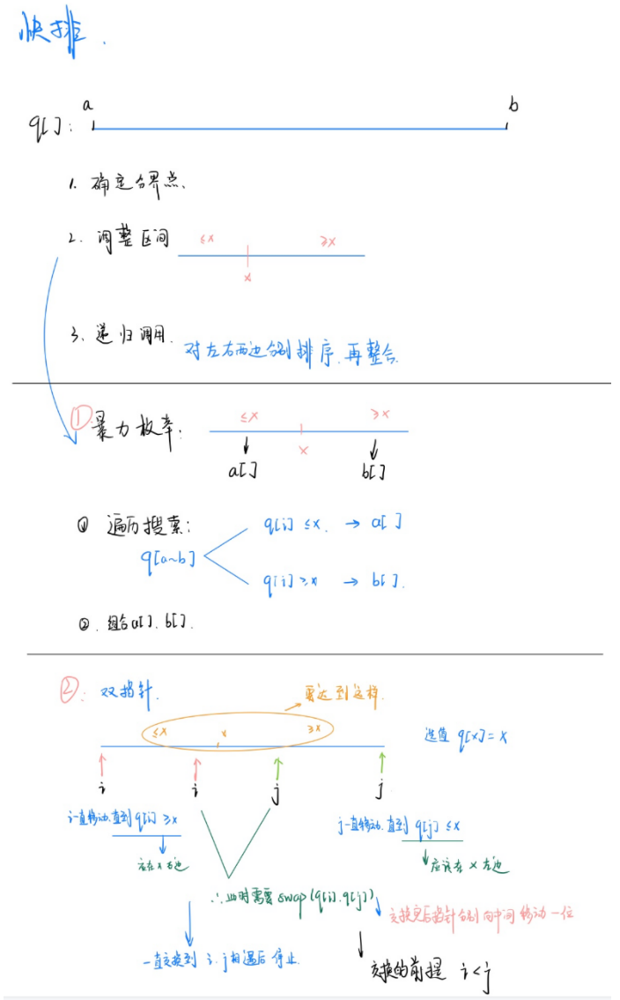
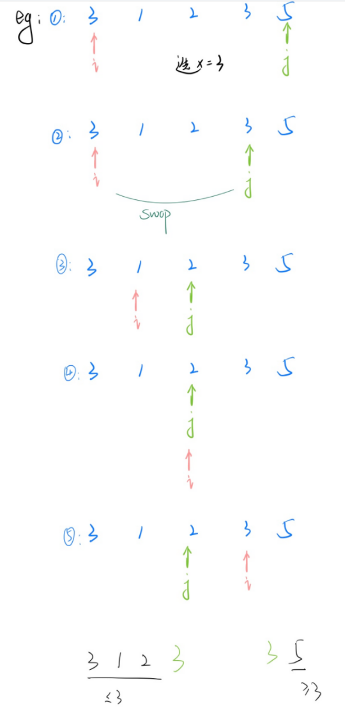
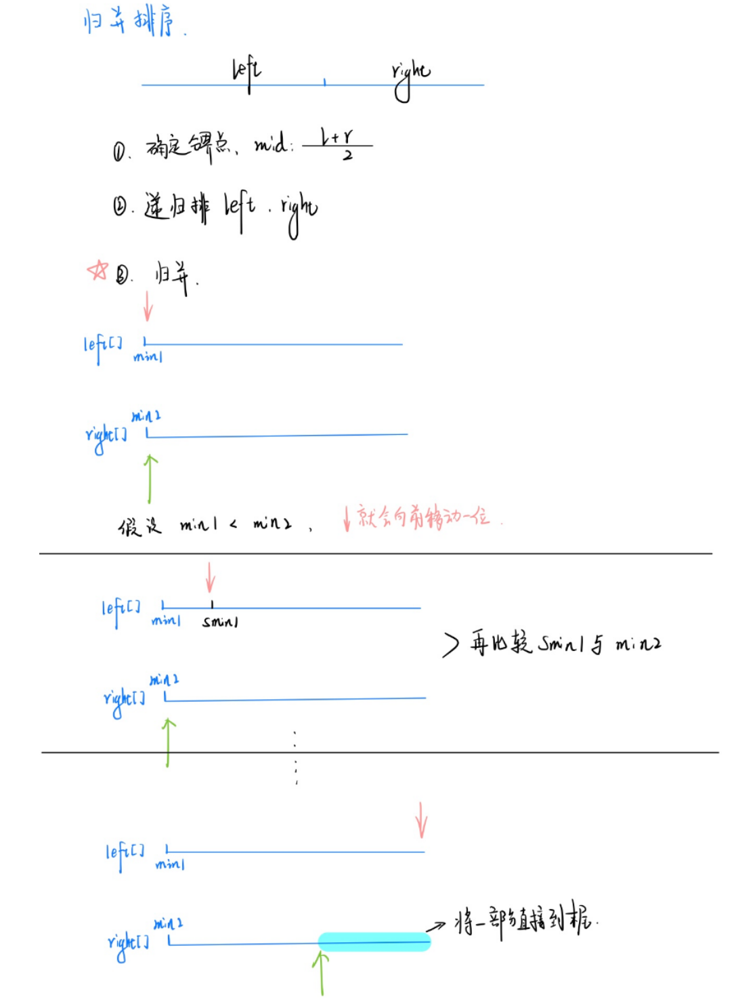
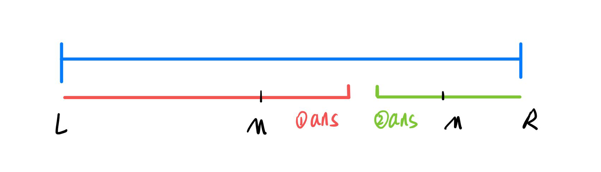
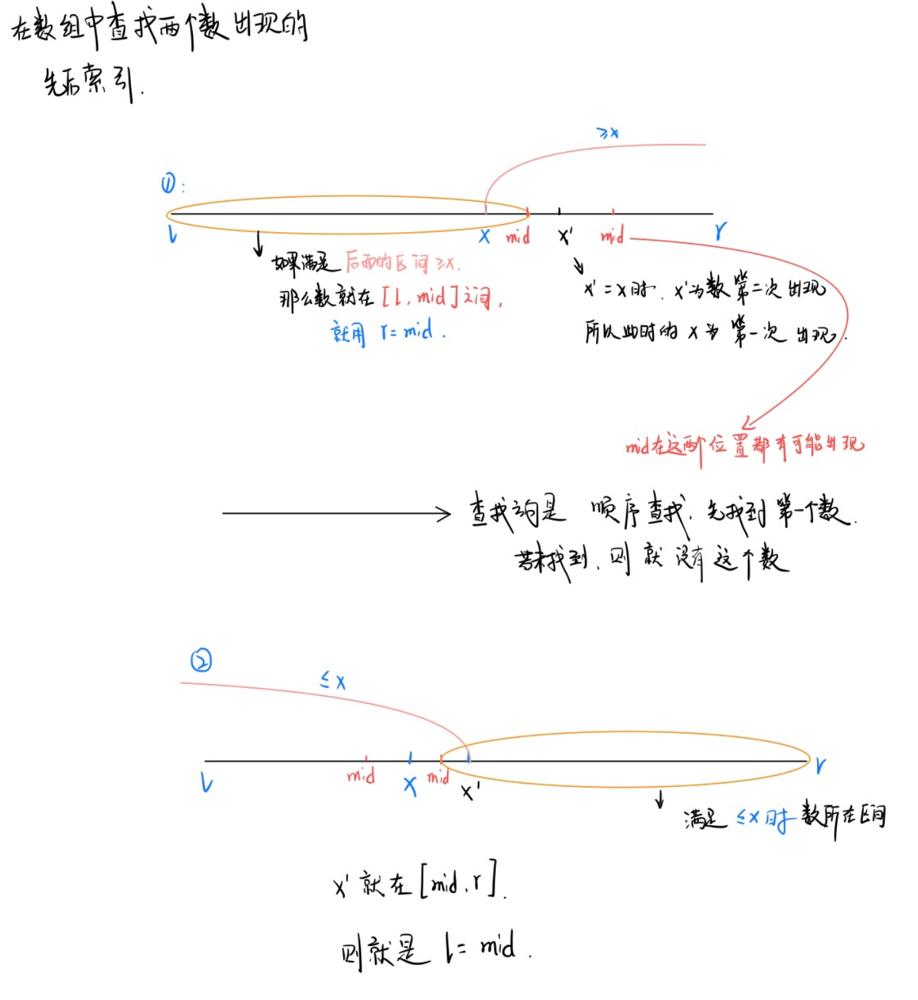
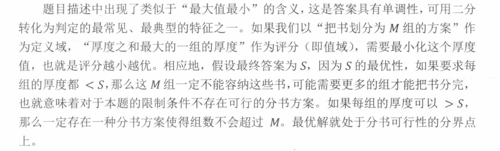
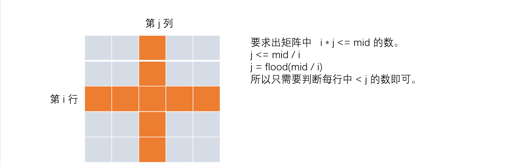

[TOC]


## 排序

1. 两种排序：快速排序和归并排序
2. 二分查找（整数，浮点数） 

### 1.1:快排





```c++
快排   ---->主要思想：分治
  
  1：确定分界点
			确定的分界点可以随机确定，但是后续使用双指针时一定要注意分界点的选取
  2：调整区间
  3：递归排序
  
void quick_sort(int q[], int l, int r)
{
    if (l >= r) return;
    int i = l - 1, j = r + 1, x = q[l + r >> 1];
    while (i < j)
    {
        do i ++ ; while (q[i] < x);
        do j -- ; while (q[j] > x);
        if (i < j) swap(q[i], q[j]);
    }
    quick_sort(q, l, j);
  	quick_sort(q, j + 1, r);
}


关于边界问题都是由于 x 的取值造成的:以下都是会出限边界问题。
比如，在递归的时候使用
  ①：	int x = l;   //  l 为左边界。
      quick_sort(q,l,i-1);
      quick_sort(q,i,r);
 上面以 i 作为边界时，并且选取 l 作为 x 的时候，
     
  ②：  int x = r;   // r 时左边界
				quick_sort(q,l,j);
				quick_sort(q,j+1,r);

  
```

#### 785:快速排序

https://www.acwing.com/problem/content/787/

```c++
// ACW 785
#include<iostream>
using namespace std;
const int N = 1e6 + 10;
int q[N];

void q_sort(int q[],int l,int r){
    if(l>=r) return;
    int x = q[l+r >> 1],i=l-1,j=r+1;
    while(i<j){
        do i++;while(q[i]<x);
        do j--;while(q[j]>x);
        if(i<j) swap(q[i],q[j]);
    }
    q_sort(q,l,j);
    q_sort(q,j+1,r);
    
}

int main(){
    int n;
    scanf("%d",&n);
    
    for(int i=0;i<n;i++) scanf("%d",&q[i]);
    
    q_sort(q,0,n-1);
    
    for(int i=0;i<n;i++) printf("%d ",q[i]);
    
    return 0;
    
}
```

```java
import java.util.Scanner;
public class Main {
    static final int N = 100010;
    static int a[] = new int[N];
    public static void main(String[] args) {
        var scan = new Scanner(System.in);
        var n = scan.nextInt();
        for (int i = 0; i < n; i++) {
            a[i] = scan.nextInt();
        }
        q_sort(a, 0, n - 1);
        for(int i=0;i<n;i++){
            System.out.printf("%d ",a[i]);
        }
    }
    public static void q_sort(int a[], int l, int r) {
        if (l >= r) return;
        int i = l - 1, j = r + 1, x = a[l + r >> 1];
        while (i < j) {
            while (a[++i] < x) ;
            while (a[--j] > x) ;
            if (i < j) {
                int t = a[i];
                a[i] = a[j];
                a[j] = t;
            }
        }
        q_sort(a, l, j);
        q_sort(a, j + 1, r);
    }
}


注意 : 使用 增强 for 循环时，不能用于遍历动态数组
    eg:  
	final int N = 100010;
	int a = new int[N];
	int n = scan.nextInt();
	for(int i=0;i<n;i++){
        a[i] = scan.nextInt();
    }
    // 下面的这个循环会将我们的 a 全部遍历，这会导致与所要数据不符
	for(int it : a){
        System.out.printf("%d ",item);
    }
```


### 1.2 归并排序



```c++
void merge_sort(int q[], int l, int r)
{
    // 判断左右边界输入是否正确
    if (l >= r) return;
	// 1: 确定分界点， 归并排序是 (l+r)/2;
    int mid = l + r >> 1;
    // 2: 递归排左右
    merge_sort(q, l, mid);
    merge_sort(q, mid + 1, r);

    // 3: 归并
    int k = 0, i = l, j = mid + 1;
    
    while (i <= mid && j <= r) // 判断两个指针是否在都在界内
        if (q[i] <= q[j]) tmp[k ++ ] = q[i ++ ]; // 升序排列
        else tmp[k ++ ] = q[j ++ ];
	
    
    // 两个指针中有一个指针到达末尾了，就将另一个指针指向的数组的剩余直接接到末尾
    while (i <= mid) tmp[k ++ ] = q[i ++ ]; // 左半边没有循环完
    while (j <= r) tmp[k ++ ] = q[j ++ ];   // 右半边没有循环完

    // 将 tmp[] 的数转到 q[];
    for (i = l, j = 0; i <= r; i ++, j ++ ) q[i] = tmp[j];
}
```

#### 逆序对

​		逆序对的定义：对于一个序列 $a$，若 $i < j$ 且 $a[i] > a[j]$，则称 $a[i]$ 与 $a[j]$ 构成逆序对。

使用归并排序可以在 $O(n logn)$ 的时间里求出一个长度为 $n$ 的序列中逆序对的个数。

​		归并排序每次把序列二分，递归对左右两半排序，然后合并两个有序序列。

​		递归对左右两半排序时，可以把左右两半各自内部的逆序对数作为子问题计算，因此我们只需要在合并时考虑 “ 左边一半里一个较大的数 ” 与 “ 右边一半里一个较小的数 ” 构成逆序对的情形，求出这种情形的个数。

​		合并两个有序序列 $a[l～mid]$ 与 $a[mid + 1～r]$ 可以采用两个指针 $i$与 $j$ 分别对二者进行扫描的方式，不断比较两个指针所指向数值 $a[i]$ 和 $a[j]$ 的大小，将小的那个加入到排序的结果数组中。若小的那个是 $a[j]$，则 $a[i～mid]$ 都比 $a[j]$ 要大，它们都会与 $a[j]$ 构成逆序对，可以顺便统计到答案中。


#### 788：逆序对的数量

https://www.acwing.com/problem/content/790/


### 2.1 整数二分

```
1：确定一个区间，使得目标值一定在区间中。
2：找一个性质：满足：
	1：性质具有二段性
	2：答案是二段性的分界点
	
```



```
1：    ans 是红色区间的右端点。
将 [L , R] 分成 [L , M-1] , [M , R]
if： M 在红色区间，不满足某一性质 ，说明 ans 仍在 [M , R]
else： ans 在 [L , M - 1]


2:     ans 是绿色区间的左端点。
将 [L , R] 分成 [L , M] , [ M + 1 , R]
if : M 是绿，满足某一性质 ，说明 ans 在 [L , M]
else : 说明 ans 在 [M + 1 , R]

```

```
整数 二分的步骤 ：
1：找一个区间[L , R], 使得答案一定在该区间终
2：找一个判断条件，使得该判断条件具有二段性，并且答案一定是该二段性的分界点。
3：分析终点 M 在该判断条件下是否成立，
	如果成立， 考虑答案在哪个区间。
	如果不成立，考虑答案在哪个区间。
4：如果更新方式写的是 R = Mid , Mid = l + r >> 1；
   如果更新方式是 L = Mid , Mid = L + R + 1 >> 1;
   
```


```c++
如何选择：
  	选择时，一定要根据所要查找的数的所在的范围来进行查找
  		看是选左半边还是右半边（并且保证区间中有答案）
  		
  
bool check(int x) {/* ... */} // 检查x是否满足某种性质

// 区间[l, r] 被划分成  [l, mid]  和   [mid + 1, r]  时使用：
int bsearch_1(int l, int r)
{
    while (l < r)
    {
        int mid = l + r >> 1;
        if (check(mid)) r = mid;    // check()判断mid是否满足性质
        else l = mid + 1;
    }
    return l;
}


// 区间  [l, r]  被划分成  [l, mid - 1]  和 [mid, r]时使用：
int bsearch_2(int l, int r)
{
    while (l < r)
    {
        int mid = l + r + 1 >> 1; 
        if (check(mid)) l = mid;
        else r = mid - 1;
    }
    return l;
}

//   int mid = l + r + 1 >> 1;  这里的 l+r后再加 1 的原因:
如果 l = r-1,那么 mid = (l+r)/2 = (l + l + 1)/2 = l;  //  因为 c++ 向下取整的语法
那么更新方式 l = mid 后，[mid,r] --> [l,r] 这不就是没有变吗，所以就会陷入死循环
```

#### 789: 数的范围

https://www.acwing.com/problem/content/791/



```c++
#include<iostream>
using namespace std;
const int N = 100010;
int n ,m;
int a[N];
int main()
{
    scanf("%d%d", &n, &m);
    
    for(int i = 0 ; i < n ;i++) scanf("%d",&a[i]);
    
    while (m -- ){
        
        int x;
        scanf("%d",&x);
        
        //  二分 x 的左端点
        int l = 0 , r = n - 1;
        while(l < r)
        {
            int mid = (l + r) >> 1;
            if(a[mid] >= x) r = mid;
            else l = mid + 1;
        }
        // 找不到数时  
        if(a[l] != x) printf("-1 -1\n");
        else {
            printf("%d ",r);
            
            //  二分 x 的右端点
            r = n - 1;
            while(l < r)
            {
                int mid = (l + r + 1) >> 1;
                if(a[mid] <= x) l = mid;
                else r = mid - 1;
            }
            printf("%d\n",l);
        }
        
    }
    
    return 0;
}
```


### 2.2 浮点数二分

```c++
bool check(double x) {/* ... */} // 检查x是否满足某种性质

double bsearch_3(double l, double r)
{
    const double eps = 1e-8;   // eps 表示精度，取决于题目对精度的要求
    while (r - l > eps)
    {
        double mid = (l + r) / 2;
        if (check(mid)) r = mid;
        else l = mid;
    }
    return l;
}


// 第二种写法
for(int i=0;i<100;i++)
{
    double mid = (l + r) / 2;
    if (check(mid)) r = mid;
    else l = mid;
}


// 一般精度要比 要求保留的值多2，就不会有太多问题，比如：4位 -> 1e-6 
```

#### 790:数的三次方根

https://www.acwing.com/problem/content/792/

```c++
#include<iostream>
using namespace std;

int main()
{
    double n;
    cin >> n;
    
    double l = -100000, r = 100000;
    while(r - l > 1e-8)
    {
        double mid = (l + r) / 2;
        if(mid * mid * mid >= n) r = mid;
  		else l = mid;
    }
    
    printf("%f",l);
    
    return 0;
}
```

### 二分答案转换为判定

一个宏观的最优化问题也可以抽象为函数，其“定义域”是该问题下的可行方案，对这些可行方案进行评估得到的数值构成函数的“值域”，最优解就是评估值最优的方案（不妨设评分越高越优）。

假设最优解的评分是 $S$，显然对于 $∀x > S$，都不存在个合法的方案达到 $x$ 分，否则就与 $S$ 的最优性矛盾；而对于 $∀x ≤ S$，一定存在一个合法的方案达到或超过 $x$ 分，因为最优解就满足这个条件。

这样问题的值域就具有一种**特殊的单调性**——在S的一侧合法、在$S$的另一侧不合法，

就像一个在$(-∞,S]$ 上值为$1$，在$(S,+∞)$上值为 $0$  的**分段函数**，可通过二分找到这个分界点  $S$。借助二分，我们把求最优解的问题，转化为给定一个值 $mid$，判定是否存在一个可行方案评分达到 $mid$ 的问题。接下来我们通过一个经典的例子理解上述概念。

eg： 有 $N$ 本书排成一行，已知第 $i$ 本书的厚度是 $A_i$ ,把它们分成 **连续的 $M$ 组**，使 $T$ 最小化，其中 $T$表示厚度之和最大的一组厚度。



```c++
int a[N];  
//  将 n 本书 分成 m 组，每组厚度之和 <= size, 是否可行
bool check(int size)
{
    int group = 1, rest = size; //  组数 ， 厚度
    for(int i = 1 ; i <= n ; i++)
    {
        if(rest >= a[i]) rest -= a[i];
        else group ++ , rest = size - a[i];
    }
    return group <= m;
}

int main()
{
    int l = 0 , r = sum_of_ai;
    while(l < r)
    {
        int mid = l + r >> 1;
        if(check(mid)) r = mid;
        else l = mid + 1;
    }
    cout << l << endl;
}
```

#### 4080：第 k 个数

https://www.acwing.com/problem/content/4083/

```
该题中数据数据范围比较大， 单行极限在 N = 5*10^5  不能直接开 N * N 的数组预处理再扫描。
```

**二分**  $o(logN)$

```
题目当中有 n * m 的数据是按照 非严格单调递增的 顺序进行排列。由于 i * j 是作为 a[i][j] 这个位置的元素。
那么在 矩阵当中就会有重复元素。
需要是寻找第 k 个数 （在拍好序的序列当中）
在第 k 的个数 左侧的数 都满足 <= k.
	右侧都满足 >= k。
所以满足单调性，可以使用二分来做。
```

**在矩阵当中快速的找出  <= mid 的数**  $ o(N)$

```
由于数据范围太大，不能直接预处理，所以必须换种方式。
既然不能直接开，不如 一边处理一边统计。
要统计矩阵的中的数，可以一行一行来做：  
			假设要找数  i * j = mid
			那么要找出  i * j <= mid 的数一共有多少个。
					      j <= mid / i
即：  i * j <= mid 的数 有 mid / i 个，但是 mid / i 的上限不能多于列数 m
再做一步操作：   min(m , mid / i)

这样的处理方式也就只保留了排序中 <= 每个数 的个数。
我们再对 1 ~ n * m 数据范围中的数 进行二分查找即可。
```



```c++
#include<iostream>
#include<algorithm>
using namespace std;
typedef long long LL;
LL n, m, k;

bool check(LL mid)
{
    LL cnt = 0;
    for(int i = 1 ; i <= n ; i++)
    {
        cnt += min(m , mid / i);
    }
    return cnt >= k;
}

int main()
{
    cin >> n >> m >> k;
    LL l = 1 , r = n * m;
    while(l < r)
    {
        LL mid = l + r >> 1;
        if(check(mid)) r = mid;
        else l = mid + 1;
    }
    cout << l << endl;
    
}
```

```c++
//  预处理只能处理   1 <= N <= 1000 左右的数据，并且时间复杂度为  o(N)
#include<iostream>
#include<algorithm>
#include<vector>
using namespace std;
typedef long long LL;
const LL N = 1010;

LL n , m  , k;
vector<LL> a;
LL q[N][N];

int main()
{
    cin >> n >> m >> k;
    
    for(int i = 1 ; i <= n ; i++)
        for(int j = 1 ; j <= m ; j++)
        {
            q[i][j] = i * j;
            a.emplace_back(q[i][j]);
        }
            
    stable_sort(a.begin() , a.end());
    
    cout << a[k-1] << endl;
    
    return 0;
}
```

#### 4199：公约数

https://www.acwing.com/problem/content/4202/

```c++
#include<iostream>
#include<algorithm>
#include<vector>
using namespace std;

int gcd(int a ,int b)
{
    return b ? gcd(b , a % b) : a;
}

vector<int> get_divisior(int n)
{
    vector<int> res;
    for(int i = 1 ; i <= n / i ; i++)
    {
        if(n % i == 0)
        {
            res.push_back(i);
            if(i != n / i) res.push_back(n / i);
        }
    }
    sort(res.begin() , res.end());
    return res;
}

int main()
{
    int a ,b;
    scanf("%d%d",&a,&b);
    
    int d = gcd(a ,b);
    auto ds = get_divisior(d);
    
    int q;
    scanf("%d",&q);
    while(q--)
    {
        int L , R;
        scanf("%d%d",&L , &R);
        
        int l = 0  , r = ds.size() - 1;
        while(l < r)
        {
            int mid = l + r + 1 >> 1;
            if(ds[mid] <= R) l = mid;
            else r = mid - 1;
        }
        int x = ds[r];
        if(x >= L && x <= R) printf("%d\n",x);
        else puts("-1");
    }
    
    
    
 	return 0;   
}
```


