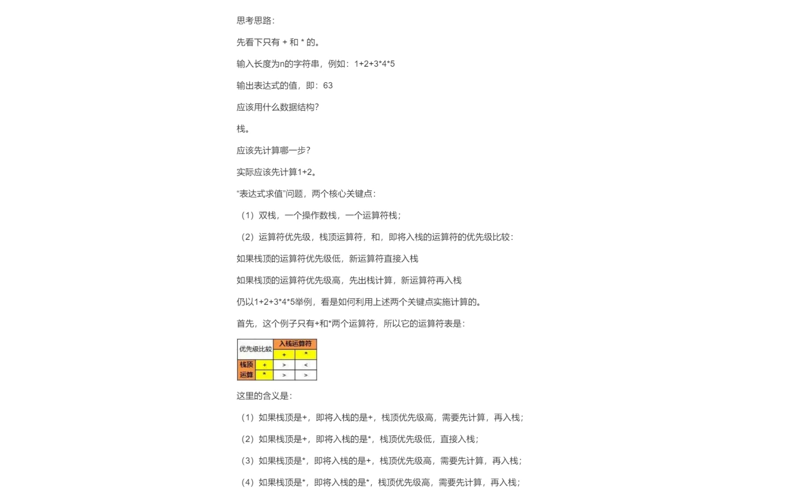
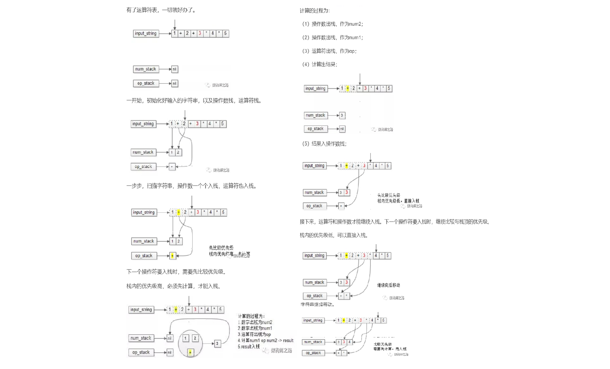
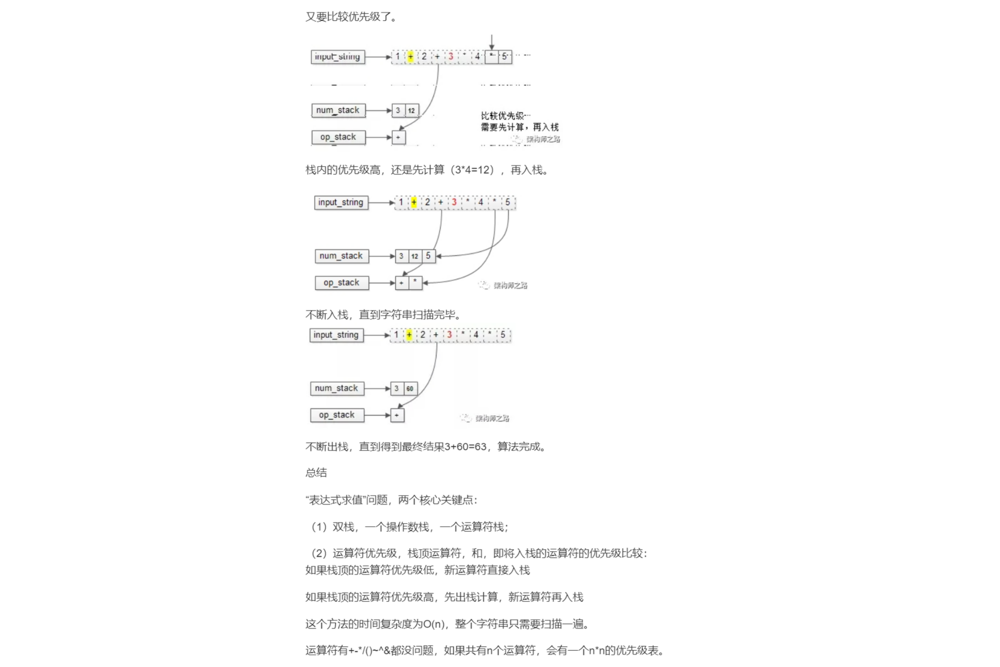
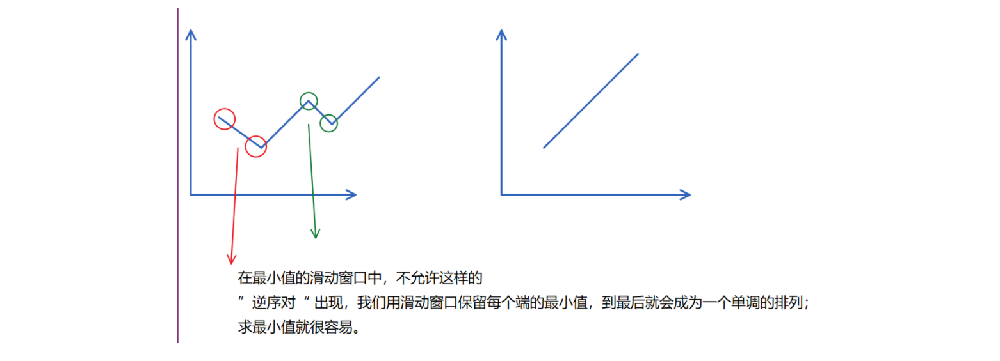
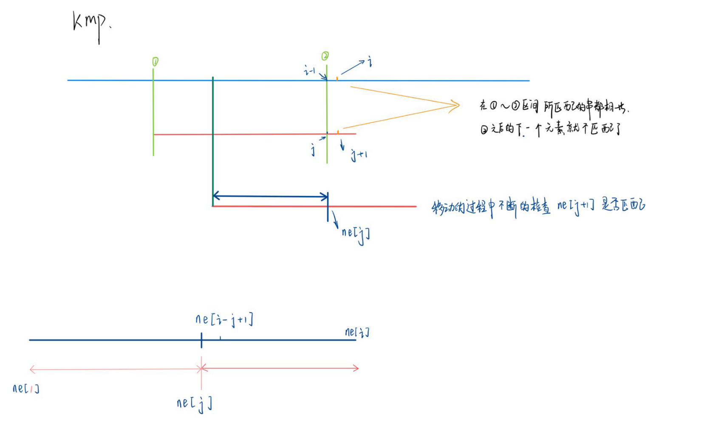
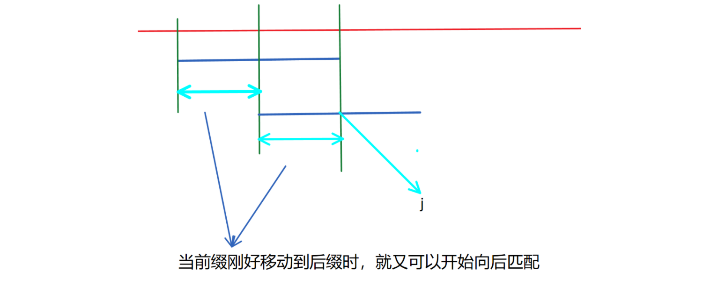

[TOC]


## 链表，栈，队列，Kmp

用数组去模拟链表，栈，队列，的实现。

### 链表

### 单链表

1. 单链表：邻接表：存储 树 和 图

```c++
使用数组模拟 链表 ，并且是静态数组。
    比使用结构体+指针更快，使用 new 这个关键字在堆上创建动态数组会很慢。
    
// head存储链表头，e[]存储节点的值，ne[]存储节点的next指针，idx表示 当前 用到了哪个节点
int head, e[N], ne[N], idx;

// 初始化
void init()
{
    head = -1;
    idx = 0;
}


// 在链表头插入一个数a
void insert_first(int a)
{
    // 将 oldFirst 的值赋为 a ,使其变为 newFirst
    e[idx] = a;
    
    // 将 head 的指向原来第一个指向的指向  替换成  新节点  要指向原先第一个节点的指向。
    // 断开 head --> Oldfirst    ===>   newFirst ---> oldFirst
    ne[idx] = head;
    
    // 创建 head ---> newFirst  从而达到 head --> newFirst  --> oldFirst  
    head = idx;
    
    // 使用完 idx 后节点 走向下一个节点，
    idx ++ ;
}


// 将 a 这个值 插入到下标是 k 的这个点
void insert_any(int a,int k)}{
    e[idx] = a;
    //  k-1 --> k    k-1 --> a -->k --> k+1
    ne[idx] = ne[k];
    ne[k] = idx;
    idx++;
}


// 将下标是  k  的这个点后面的节点 (k+1) 删掉
void delete_any(int k){
    //  k  k+1  k+2      
    //  打断 k --> k+1 ,创建 k--> k+2 
    ne[k] = ne[ne[k]];
}


// 将头结点删除，需要保证头结点存在
void remove()
{
    head = ne[head];
}
```

#### 826:单链表

https://www.acwing.com/problem/content/828/

```c++
//  acw 826
#include<iostream>
using namespace std;
const int N = 100010;
int head,node[N],next_node[N],idx;
void insert_head(int a){
    node[idx] = a;
    next_node[idx] = head;
    head = idx++;
}
void delete_node(int k){
    next_node[k] = next_node[next_node[k]];
}
void insert_any(int a,int k){
    node[idx] = a;
    next_node[idx] = next_node[k];
    next_node[k] = idx++;
}
void init(){
    head = -1;
    idx = 0;
}
int main(){
    cin.tie();
    init();
    int m;
    cin>>m;
    while(m--){
        char op[2];
        scanf("%s",op);
        if(*op == 'H'){
            int x;
            cin>>x;
            insert_head(x);
        }else if(*op == 'D'){
            int k;
            cin>>k;
            if(!k) head = next_node[head]; //  删除头节点时的特p
            delete_node(k-1);// 0 号点是第一个插入的点，所以要 k-1
        }
        else{
            int k,x;
            cin>>k>>x;
            insert_any(x,k-1);// 0 号点是第一个插入的点，所以要 k-1
        }
    }
    for(int i = head;i != -1;i = next_node[i]) cout<<node[i]<<' ';
    cout<<endl;
    
    return 0;
}
```


### 双链表 (循环双链表)

1. 双链表，用于优化问题

```c++
注意：我们使用数组模拟 静态链表 时，我们使用  0  1 作为了头节点和为尾节点；
   而我么使用  e[N]  来存储链表中元素，每次是根据当前位置  idx 作为下来来存的。并且删除时；
   idx 也必使用，这样就会使得在  e[N] 中，链表中元素存储位置 与 下标 并不一致。
   但是恰到好处的就是我们使用   l[N] , r[N] 去记录每个元素的下一个位置和上一个位置，
   我们只要知道头节点，就可以顺着链接找到所有的节点。
```

```c++

// e[]表示节点的值，l[]表示节点的左指针，r[]表示节点的右指针，idx表示当前用到了哪个节点
int e[N], l[N], r[N], idx;

// 初始化
void init()
{
    //规定 0是左端点，1是右端点
    r[0] = 1, l[1] = 0;
    idx = 2;
}

// 在节点a的右边插入一个数x    , 可以通过 insert( l[a] , x) 在 a 的左边加入数 x 
// 如果想要在 a 节点的左边插入一个节点 x ,可以直接使用插右操作，  insert(l[a],x) -->传参的时候直接传前一个数
void insert(int a, int x)   //  a <==> x <==> a+1
{
    //当前位置添加数 x ,     a  x  a+1
    e[idx] = x;
    // 建立 a <-- x
    l[idx] = a;
    // 建立 x --> a+1
    r[idx] = r[a];
    // 断键 a <-- a+1, 建立 x <-- a+1 
    l[r[a]] = idx;
    // 断键 a --> a+1, 建立 a --> x
    r[a] = idx;
    
    idx ++ ;
}

// 删除节点a
void remove(int a)      //  a-1 <==> a+1 
{
    // 断开 a-1 <-- a ,建立 a-1 <-- a+1
    l[r[a]] = l[a];
    
    // 断开 a-1 --> a ,建立 a-1 --> a+1
    r[l[a]] = r[a];
}
```

#### 827:双链表

https://www.acwing.com/problem/content/829/

```c++
//  acw827
#include<iostream>
#include<algorithm>
using namespace std;
const int N = 100010;
int e[N],l[N],r[N],idx;

void init(){
    l[1] = 0 , r[0] = 1;
    idx = 2;
}

void add(int k , int x){
    e[idx] = x;
    l[idx] = k;
    r[idx] = r[k];
    l[r[k]] = idx;
    r[k] = idx;
    idx++;
}

void remove(int k){
    r[l[k]] = r[k];
    l[r[k]] = l[k];
}

int main(){
	int n;
    cin >> n;
    init();
    while(n--){
        string op;
        int k,x;
        cin >> op;
        if(op == "L"){
            cin >> x;
            add(0 , x);
        }
        else if(op == "R"){
            cin >> x;
            add(l[1] , x);
        }
        else if(op == "D"){
            cin >> k;
            remove(k + 1);
        }
		else if(op == "IL"){
            cin >> k >> x;
            add(l[k + 1] , x);
        }
        else {
            cin >> k >> x;
            add(k + 1 , x);
        }
    }
    for(int i = r[0] ; i != 1 ; i = r[i]) cout << e[i] << " ";
    cout << endl;
    return 0;
}
```

### 栈

#### 828:模拟栈

https://www.acwing.com/problem/content/830/

```c++
栈：先进后出   

// stk[N] 表示栈，tt表示栈顶，
int stk[N], tt = 0;


// 向栈顶插入一个数 （插入）
stk[ ++ tt] = x;

// 从栈顶弹出一个数  （删除）
tt -- ;

// 栈顶的值  （取出栈顶元素的值）
stk[tt];

// 判断栈是否为空
 // tt > 0 则为 非空 ，tt <= 0 则为 空  
if (tt > 0) printf("NOT NULL");
else printf("NULL");
```

#### 3302:表达式求值

https://www.acwing.com/problem/content/3305/







```c++
// acw 3302   表达式求值
#include <iostream>
#include <cstring>
#include <algorithm>
#include<stack>
#include <unordered_map>
using namespace std;

stack<int> num; // 存储数字
stack<char> op; // 存储运算符


//  使用末尾的运算符去操作末尾的数字
void eval(){
    auto b = num.top(); num.pop(); 
    auto a = num.top(); num.pop();
    auto c = op.top();op.pop();
    
    int x;
    if(c == '+') x = a + b;
    else if(c == '-') x = a - b;
    else if(c == '*') x = a * b;
    else x = a / b;
    num.push(x);
}

int main()
{
    //  定义优先级
    unordered_map<char,int> pr = {{'+',1},{'-',1},{'*',2},{'/',2}};
    string str;
    cin >> str;
    
    // 分解表达式
    for(int i = 0 ; i < str.size() ; i++){
        
        auto c = str[i];
        // 过滤数字
        if(isdigit(c)){
            int x = 0 , j = i;
            //  从单个字符串中提取数字
            while(j < str.size() && isdigit(str[j])){
                x = x * 10 + str[j++] - '0'; 
            } 
            num.push(x); // 将数字加至数字栈中
            i = j - 1;
        }
        else if(c == '(') op.push(c); // 加至符号栈
        else if(c == ')'){
            while(op.top() != '(') eval();  // 括号内进行运算
            op.pop(); //  弹出左括号
        }
        //  一般运算符
        else {
            //  栈顶元素的优先级 大于等于 当前元素的优先级（即将入栈的运算符） 并且 不空
            while(op.size() && pr[op.top()] >= pr[c]) eval(); //  操作栈顶元素
            // 不然就将当前运算符插到栈中
            op.push(c); 
        }
    }
    //  将所有没有操作完的运算符从右我往左操作一遍
    while(op.size()) eval();
    cout << num.top() << endl;

    return 0;
}

```

#### 单调栈

```
单调栈和单调队列模型中：
	1：首先使用暴力的方式想问问题的解决办法；
	2：再去通过 单调栈和单调队列 去删除其中的一些元素，使得最后模型成为单调；
	3：单调栈 和 单调队列 中求极值（优化完后的首尾元素）或者查找某一个值（二分）等更多优化；
```


```c++
常见模型：找出给定序列中 每个数左边离它最近的 比它大/小的数
    
int tt = 0;
for (int i = 1; i <= n; i ++ )
{
    while (tt && check(stk[tt], i)) tt -- ;
    stk[ ++ tt] = i;
}


对于找 左边最小值时，我们对于每次确定要比较的元素 a[i] 之后，再到 a[0] ... a[i-1] 中去寻找这个最小值，
    
寻找最小值时，我们使用单挑栈来优化，将这些元素压入栈中，首先将 一种情况 a[x] >= a[x+1] 这种不满足的情况排查掉，这种情况就是我们如果要找的是 a[x+1] 的值，那么此时会忽略掉 a[x+1]
```

##### 830 : 单调栈

https://www.acwing.com/problem/content/832/

```c++
#include<iostream>
using namespace std;
const int N = 100010;
int n;
int stk[N];
int tt  = -1;

int main(){
    cin >> n;
   	for(int i = 0 ; i < n ; i++)
    {
        int x;
        cin >> x;
        
        while(tt && stk[tt] >= x) tt --;
        
        if(tt) cout << stk[tt] << " ";
        else cout << -1 << " ";
        
        stk[++tt] = x;
        
    }
   
    return 0;
}
```


### 队列

队列：先进先出

#### 普通队列

```c++
// hh 表示队头，tt表示队尾
int q[N], hh = 0, tt = -1;

// 向队尾插入一个数
q[ ++ tt] = x;

// 从队头弹出一个数   
hh ++ ;

// 队头的值
q[hh];

// 判断队列是否为空
if (hh <= tt)  // true 为非空
{  }
```

##### 829:模拟队列

https://www.acwing.com/problem/content/831/

#### 循环队列

```c++
// hh 表示队头，tt表示队尾的后一个位置
int q[N], hh = 0, tt = 0;

// 向队尾插入一个数
q[tt ++ ] = x;
if (tt == N) tt = 0;

// 从队头弹出一个数
hh ++ ;
if (hh == N) hh = 0;

// 队头的值
q[hh];

// 判断队列是否为空
if (hh != tt)  // true 是为 非空
{  }
```


##### 单调队列

###### 154:滑动窗口

https://www.acwing.com/problem/content/156/

```c++
常见模型：找出滑动窗口中的最大值/最小值
    
怎么判断队列中对头出队：因为我们的队列中存是 下标 ，不是元素，通过关系式限定队列。
设 i 为队列的右端点下标， k 为队列的长度；
    i+1-k  ~  i
    
队列里面存的是下标
int hh = 0, tt = -1;
for (int i = 0; i < n; i ++ )
{
    while (hh <= tt && check_out(q[hh])) hh ++ ;  // 判断队头是否滑出窗口
    while (hh <= tt && check(q[tt], i)) tt -- ;
    q[ ++ tt] = i;
}
```




```c++
#include<iostream>
using namespace std;

const int N = 1000010;
int n ,k;
int q[N],a[N];
int main()
{
    scanf("%d%d",&n,&k);
    for(int i = 0 ; i < n ; i++ ) scanf("%d",&a[i]);
    
    int hh = 0 , tt = -1;
    for(int i = 0 ; i < n ; i++ ){
        // 判断对头是否已经滑出窗口
        if(hh <= tt && i - k + 1 > q[hh]) hh++;
        
        while(hh <= tt && a[q[tt]] >= a[i]) tt--;
        
        // 先将 i 加进去队列。因为 i 也有可能是最小值
        q[++tt] = i; 
        
        if(i >= k - 1) printf("%d ",a[q[hh]]);
    }
    printf("\n");
    
    //   求最大值时和最小值时对称
    hh = 0 , tt = -1;
    for(int i = 0 ; i < n ; i++ ){
        // 判断对头是否已经滑出窗口
        if(hh <= tt && i - k + 1 > q[hh]) hh++;
        
        while(hh <= tt && a[q[tt]] <= a[i]) tt--;  // 判断是 <= 就行
        
        // 先将 i 加进去队列。因为 i 也有可能是最小值
        q[++tt] = i; 
        
        if(i >= k - 1) printf("%d ",a[q[hh]]);
    }
    return 0;
}
```


### Kmp

#### 831:kmp

https://www.acwing.com/problem/content/833/

<video id="video" controls preload="none">    
    <source id="mp4" src="image/Kmp.mp4" type="video/mp4">
</video>



```c++
1：关键就是 分离出 以ne[i] 这个元素为末尾的后缀 和 从 1 开始的 前缀 的一致的最大的长度是多少
    
    

2： ne[N]  的含义：    
ne[i] = j 表示得就是以 i 为终点的后缀 和 从 1 开始前缀的长度相等 (并且后缀的长度最长为 j )
  在模版串中表示就是：  p[1,j] = p[i-j+1,i]
    


3：前缀和后缀不能为串本身。   
    
  
//  acw831
#include<iostream>
using namespace std;
const int N = 100010, M = 1000010;

int n , m;
char p[N],s[M];
int ne[N];  

int main()
{
    cin >> n >> p + 1 >> m >> s + 1;   //  下标从 1 开始，所以加 1
    
    //  求 ne[N] 数组的过程，  ne[1] 是不用算的就是 ne[1] = 0; 
    for(int i = 2 ,j = 0 ; i <= n ; i++){
        
        while(j && p[i] != p[j + 1]) j = ne[j];
        
        if(p[i] == p[j + 1]) j++;
        
        ne[i] = j;
        
    }
    
    // kmp 匹配过程
    for(int i = 1 , j = 0 ; i <= m ; i++ ){  //  s[i] 要试图匹配的是 p[j + 1]
        
        // j 未退回起点，并且 s[i] 和 p[j+1] 不能匹配，那么向前移动 就p[j + 1] 移到 p[j]
        while( j && s[i] != p[j + 1]) j = ne[j];
        
        //  已经匹配，那么 p[j+1] 就会向后移动 
        if(s[i] == p[j + 1]) j++;
        
        if(j == n){
            // 匹配成功
            printf("%d ",i - n);
            j = ne[j];
            
        }
    }
    
    // for(int i = 1 ; i <= m ; i++) cout << ne[i] << " ";
    
    return 0;
}


j = ne[j];  的含义：
    当我们匹配成功之后。我们再去匹配下一段时，
我们把 p[j] 向后移动，最少可以移动就是将 最大的前缀移至 与 最大的后缀相等，此时就又可以开始匹配
 
```




