[TOC]


## Trie树，并查集 ，堆，哈希表

### Trie 树

```c++
/*
Trie树 的用法：
    1：用来高效  存储  和  查找字符串集合  的结构
使用	 Trie 树的存储结构存储的数据 一般都是 小写字母 或者 都是 大写字母，或者  0 和 1；
    并且数据量不会太大
*/  
    
int son[N][26], cnt[N], idx = 1; //  这里的  26 只是小写字母，也即每个节点最多有26条边
// idx = 0 的点既是根节点，又是空节点（即一个节点没有子节点的话也让会让它指向空结节点）
// son[][]存储树中每个节点的子节点   
// cnt[]存储以每个节点结尾的单词数量
// idx 就表示当前所用到下标
int end[N]; // 存储该字符串是否存在。

// 插入一个字符串
void insert(char *str)
{
    int p = 1;// 起始节点
    // 从根节点开始 遍历，寻找对应字母
	// 因为 字符串是以 \0 结尾的，所以可以作为是否到达字符串末尾的条件
	// 也可以使用 i < strlen(str)
    for (int i = 0; str[i] ; i ++ ) 
    {
        int u = str[i] - 'a';// 当前字母对应的子节点编号（即将 a~z  -->  0~25）
        
        // 如果该子节点不存在，就将其创建出来
        if (son[p][u] == 0) son[p][u] = ++ idx;
        
   		// 然后经过上面的创建或者本来就有该子节点，那么就向下走，
        //此时这个点就又会成为一个新
        p = son[p][u];
    }
    // 然后对统计以该节点为末尾的 字符串又多了一个
    cnt[p] ++ ;
}


// 查询字符串出现的次数
int query(char *str)
{
    int p = 1;
    for (int i = 0; str[i]; i ++ )
    {
        int u = str[i] - 'a';
        if (son[p][u] == 0) return 0; // 未查询到
        p = son[p][u]; // 查到并赋值给p , 再开始从下一个字母匹配
    }
    return cnt[p]; 
}


// 检索字符串是否存储
bool search(char *str) {
	int len = strlen(str), p = 1;
	for(int k = 0 ; k < len ; k++) {
		p = s[p][str[k] - 'a'];
		if(p == 0) return false;
	}
	return end[p];
}

```

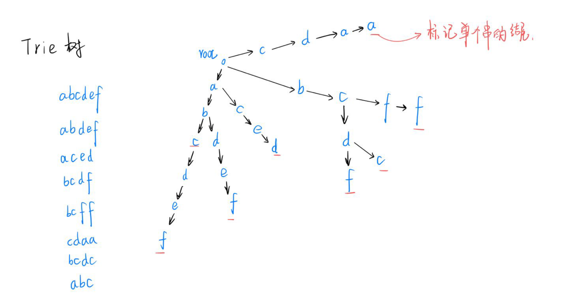

#### 835:Trie 字符串统计

 https://www.acwing.com/problem/content/837/

```c++
//  acw835
#include<iostream>
const int N = 100010;

int son[N][26],cnt[N],idx;
char str[N];

// son[idx][0]  son[idx][1] ...... 使用数组来模拟的指针，一个位存储位置，一个位存储字母

// 插入操作
void insert(char *str){
    int p = 0;
    for(int i=0;str[i];i++){
        int u = str[i] - 'a';
        if(!son[p][u]) son[p][u] = ++idx;
        p = son[p][u];
    }
    cnt[p]++;
}

//查找操作
int query(char *str){
    
    int p = 0;
    for(int i=0;str[i];i++){
        int u = str[i] - 'a';
        if(!son[p][u]) return 0;
        p = son[p][u];
    }
    return cnt[p];
}

int main(){
    int n;
    scanf("%d",&n);
    while(n--){
        // 用于存储两个操作的类型
        char operate_trie[2];
        
       // 要注意的是这里的 operate_trie 和 str 都是数组的首元素，就是地址名，不再需要&符号
        scanf("%s%s",operate_trie,str);
        
        if(operate_trie[0] == 'I') insert(str);
        else printf("%d\n",query(str));
    }
    
    return 0;
}
```

#### 143:最大异或对

https://www.acwing.com/problem/content/145/

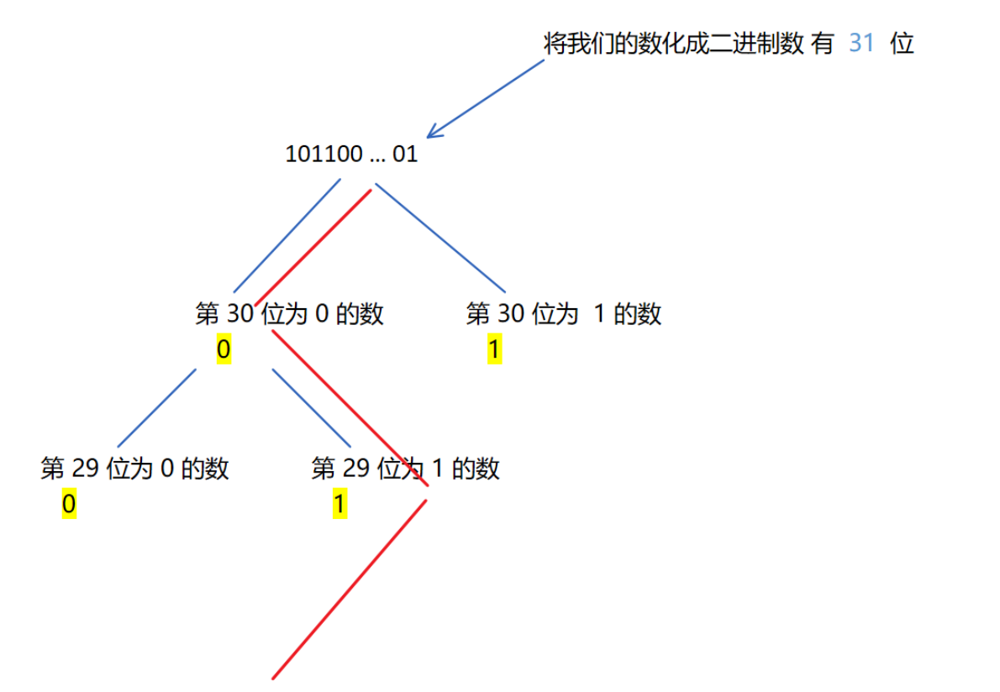

``` c++
//  acw  143
// 暴力枚举 o(n^2)
int res = 0;
for(int i = 0 ; i < n ; i++)      //  枚举第一个数
    for(int j = 0 ; j < i ; j++)   //  枚举第二个数
        res = max(res,a[i] ^ a[j]);
    
    
    
//  使用  trie树进行优化    o(nlogn)   使用 trie 来存储二进制数
/*
为什么可以优化：
    将数字转化位 二进制数，然后按位异或，从最高位开始：
  当第一个数 和 第二个数 对应二进制数的相应位置的  数都是  0 或 1 的话，异或结果为 0；
  如果不同，异或结果为 1 , 当更高位的结果更大时，也即为 1，那么结果一定是最大的。
 所以有 不同数的选择时，一定会选不同的数。
*/
```

```c++
#include<iostream>
using namespace std;
const int N = 100010 , M = 31 * N;
int n;
int a[N];
int son[M][2],idx;  //  每个节点最只有两个子节点

void insert(int x){
    int p = 0;
    for(int i = 30 ;i >= 0; i--){
        int u = x >> i & 1;
        //  插入时不存在的话就是插进去
        if(!son[p][u]) son[p][u] = ++ idx;
        p = son[p][u];
    }
}

int query(int x){
    int p = 0 , res = 0;
    for(int i = 30 ; i >= 0 ; i--){
        //  取出  x 二进制数的第 i 位
        int u = x >> i & 1;
        // 查找时不存在需要选择其他路径
        if(son[p][!u]){
            p = son[p][!u];
            res = res * 2 + !u;
        }
        else {
            p = son[p][u];
            res = res * 2 + u;
        }
    }
    return res;
    
}

int main()
{
    scanf("%d",&n);
    for(int i = 0 ; i < n ; i++ ) scanf("%d",&a[i]);
    
    int res = 0;
    
    for(int i = 0 ; i < n ;i++){
        insert(a[i]);
        int t = query(a[i]);
        res = max(res,a[i] ^ t);
    }
    printf("%d",res);
    return 0;
}
```

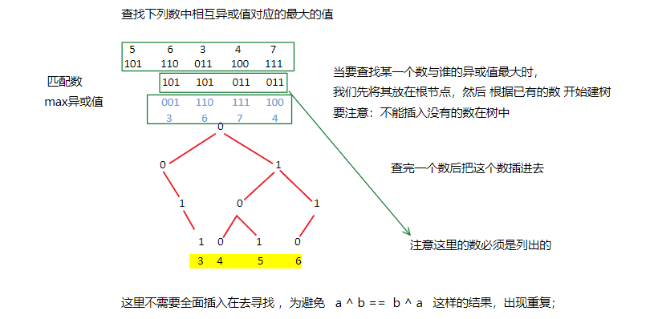

### 并查集基础

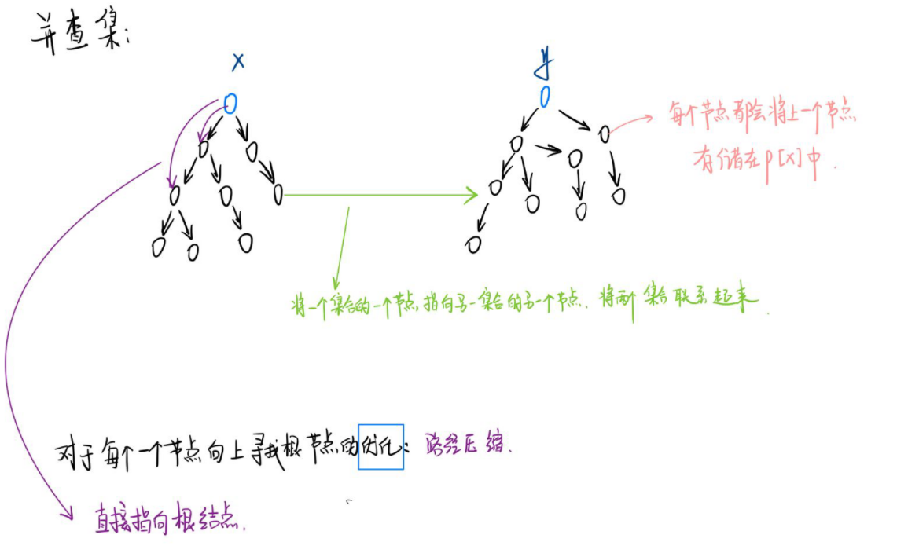

``` c++
/*
并查集的作用：
    1：将两个集合合并；
    2：询问两个元素是否在一个集合当中

    首先是使用 树 的方式来维护集合
基本原理：每个集合用一颗树来表示，树根的编号就是整个集合。每个节点都会存储其 父节点 ，用 p[x] 
就表示 x 的父节点
    
    1: 如何判断树根 if(p[x] == x)
        
    2: 如何来求 x 的集合编号 while(p[x] != x) x = p[x];  //  即寻找树根
当需要查找某个元素所在集合的时候我们就可以一直想上寻找父节点，一直找到根节点。
     
    
    3:如何合并两个集合： 只需要将某一个集合所表示的 树 的某一个节点直接 连接到另一个 树 的某个
节点下。这样就将两个集合合并。 px  是 x 集合的编号， py 是集合 y 的编号，令 p[x] = y; 即可
*/      
```

#### 朴素并查集

```c++
// 1：并查集的初始化：  初始化的并查集中每个节点都是都是单独的集合。因此根节点就是他本身。
int p[N];
    
inline void init(int n)
{
    for(int i = 1 ; i <= n ; i++)
        p[i] = i;
}

// 2：查询：递归的访问元素的上一个节点，直到根节点。  
int find(int x)
{
    if(p[x] == x)
        return x;
    else 
        return find(p[x]);
}
    
    
// 3：合并； 将两个节点合并到一个集合中，让俩节点的其中一个节点的根节点指向令一个节点即可。 
inline void merge(int i,int j) // 将 i 和 j 合并到一个集合中。 
{
    p[find[i]] = find(j);
}
```

#### 并查集的优化

``` c++
/*
朴素并查集的效率较低，主要体现在两个方面：
	1： 集合树太深，寻找根节点需要不断递归。
		解决方法： 使用路径压缩。
			可以在 该节点上 直接 引一条路径到根节点。
			
	由下图可以看出，当需要从 5 号节点查询根节点时，需要不断递归查询，当我们直接为 5 号节点
	加一条 直接通到根节点的边。
	
由于路径压缩只在查询时进行，也只压缩一条路径，所以并查集最终的结构仍然可能是比较复杂的，
并非会压缩成 菊花图。
*/
```

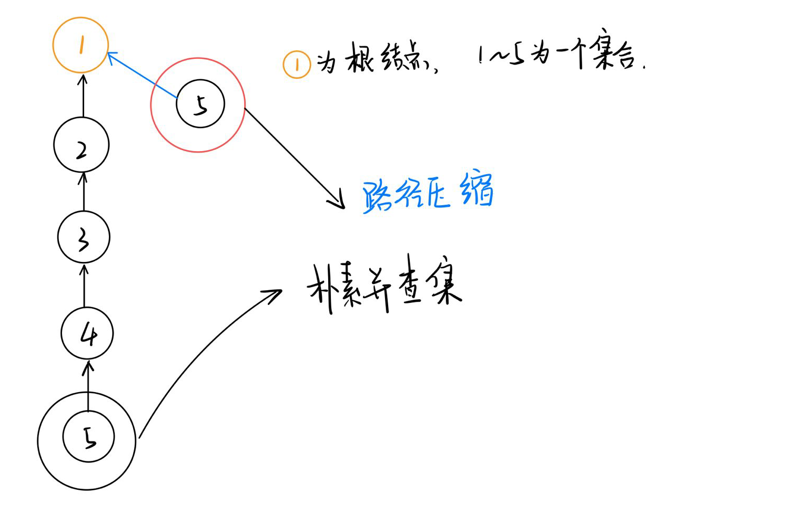

```c++
//  路径压缩体现在  查询
int find(int x)
{
    if(x == p[x]) return x;
    else
    {
        p[x] = find(p[x]);  //  将 x 的根节点设为父节点
        return p[x]; //  返回 父节点。(即 根节点)
    }
}
```

```c++
//  简化代码
int find(int x)
{
    return x == p[x] ? x : (p[x] = find(p[x]));  
}

//  注意这里的优先级问题，要加括号，  赋值运算符的优先级低于三元运算符。
```

``` C++
/*
2：  合并集合时的不确定性导致树 变深。
	解决方法：  按秩合并
	即将 简单的树往复杂的树上合并。这样可以尽量减少树的深度。
*/
```

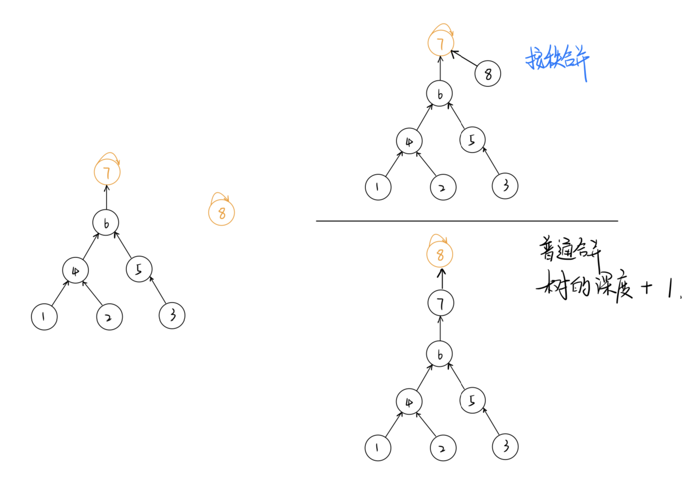

```c++
// 使用rank[] 数组记录每个 根节点 对应的树的深度。
// rank[] 初始值设为 1，合并时比较两个根节点，将 rank[]  较小者向较大者身上合并。

//  1：初始化
inline void init(int n)
{
    for(int i = 1 ; i <= n ; i++)
    {
        p[i] = i;
        rank[i] = i;
    }
}

//  2：合并
inline void merge(int i,int j)
{
    int x = find(i) , y = find(j);  //  先找到两个根节点
    if(rank[x] <= rank[y]) 
        p[x] = y;
    else 
        p[y] = x;
    
    if(rank[x] == rank[y] && x != y) //  若深度相同且根节点不同，则新的根节点 深度 + 1
        rank[y]++;
}
```

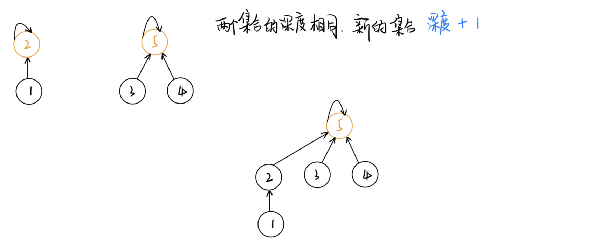


#### 并查集应用

```c++
// 朴素并查集：（有路径压缩）

    int p[N]; //存储每个点的祖宗节点

    // 返回x的祖宗节点,有路径压缩，
    int find(int x)
    {
        // 如果 x 节点不是根结点的话，那么就将其父节点设置为 根节点
        if (p[x] != x) p[x] = find(p[x]);
        return p[x];  // 返回父节点就可以了
    }

    // 初始化，假定节点编号是1 ~ n 
    for (int i = 1; i <= n; i ++ ) p[i] = i;

    // 合并a和b所在的两个集合：
    p[find(a)] = find(b);

```

#### 维护size的并查集

```c++
// (2) 维护size的并查集:  即同时维护集中中元素的个数

    int p[N], size[N];
    //p[]存储每个点的祖宗节点, size[]只有祖宗节点的有意义，表示祖宗节点所在集合中的点的数量

    // 返回x的祖宗节点
    int find(int x)···
    {
        if (p[x] != x) p[x] = find(p[x]);
        return p[x];
    }

    // 初始化，假定节点编号是1~n
    for (int i = 1; i <= n; i ++ )
    {
        p[i] = i;
        size[i] = 1;
    }

    // 合并a和b所在的两个集合：
    size[find(b)] += size[find(a)];
    p[find(a)] = find(b);


```

#### 维护到祖宗节点距离的并查集

```c++
//  (3) 维护到祖宗节点距离的并查集：

    int p[N], d[N];
    //p[]存储每个点的祖宗节点, d[x]存储x到p[x]的距离

    // 返回x的祖宗节点
    int find(int x)
    {
        if (p[x] != x)
        {
            int u = find(p[x]);
            d[x] += d[p[x]];
            p[x] = u;
        }
        return p[x];
    }

    // 初始化，假定节点编号是1~n
    for (int i = 1; i <= n; i ++ )
    {
        p[i] = i;
        d[i] = 0;
    }

    // 合并a和b所在的两个集合：
    p[find(a)] = find(b);
    d[find(a)] = distance; // 根据具体问题，初始化find(a)的偏移量
```

###### 836:合并集合

https://www.acwing.com/problem/content/838/

```c++
//  acw 836
#include<iostream>
using namespace std;
const int N =100010;
int n,m;
int p[N];

// 返回 x 
int find(int x){
    if(p[x] != x) p[x] = find(p[x]);
    return p[x];
}

int main(){
    scanf("%d%d",&n,&m);
    for(int i=1;i<=n;i++) p[i] = i;
    
    while(m--){
        // 我们通过scanf去读取一个字符的时候最好使用 字符串去读，因为其可以
        // 忽略一些 空格和回车，如果是单个的字符的话，空格容易被读入，不太安全
        char op[2];
        int a,b;
        scanf("%s%d%d",op,&a,&b);
        
        // 合并集合
        if(op[0] == 'M') p[find(a)] = find(b);
        else {
            if(find(a)==find(b)) puts("Yes");
            else puts("No");
        }
    }
    return 0;   
}

```

###### 837:连通块中点的数量

https://www.acwing.com/problem/content/839/

```c++
// acw 837
#include<iostream>
using namespace std;
const int N =100010;
int n,m;
int p[N],s[N];

//s[N] 表示我们联通块中的点的个数,对于s[N] 来说，我们只需去维护个根节点的s[N]就行，因为 根节点就标志着集合
// 连通块（集合）,根节点代表着我们的集合
//然后我们就通过s[N] 来维护我们每个集合中的节点的数目

// 返回 x 的根节点（由于我们只维护根节点的 s[x],所以 s[find(x)]   也就代表了我们对应集合的节点个数）
int find(int x){
    // 我们 根节点的父节点就是他本身，所以当未到达根节点时，我们就不断的向上寻找根节点
    if(p[x] != x) p[x] = find(p[x]);
    return p[x];
}

int main(){
    scanf("%d%d",&n,&m);
    for(int i=1;i<=n;i++){
        // 初始化的时候因为还没有连边，所以每个节点都是自己的根节点，所以我们就将 父节点直接赋为他们本身
         p[i] = i;
        // 初始化每个结点所在集合的个数，因为刚开始没有设定边，所以就只有一个节点
         s[i] = 1;
    }
    while(m--){
        char op[5];
        int a,b;
        scanf("%s",op);
        
        // 节点连边操作
        if(op[0] == 'C'){
            scanf("%d%d",&a,&b);
            // 首先判断我们的两个节点是否在同一个集合当中
            if(find(a) == find(b)) continue;
            
            // 将两个集合中的个数相加
            s[find(b)] += s[find(a)];
  			// 如果不在同一个集合当中我们就将节点的根节点合并，
            // 注意这里我们将b的根节点的父节点设置为 a的根节点的父节点
            p[find(a)] = find(b); 
        }
        
        
        // 判断是否在一个集合当中
        else if(op[1]=='1'){
            scanf("%d%d",&a,&b);
            if(find(a) == find(b)) puts("Yes");
            else puts("No");
        }
        
        
        
        // 统计该节点所在集合的节点个数
        else {
            scanf("%d",&a);
            printf("%d\n",s[find(a)]);
        }
    }
    return 0;   
}


上面程序中的输入注意点：
    我们在多次询问当中的输入是是不一样的，所以我们必须要在不同的条件下来书写不同的输入形式
```

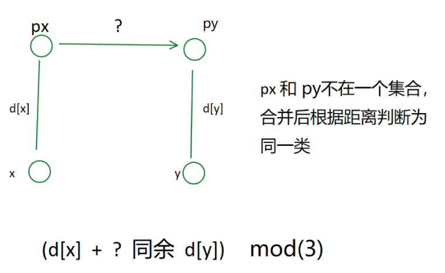

###### 240:食物链

https://www.acwing.com/problem/content/242/

``` c++
/*
通过集合中每个节点到根节点的距离来表示他们之间的相互关系；
    节点的数字与根节点数据 mod(3) 之后的关系。
    1：余 1：可以吃根节点；
    2：余 2：可以被根节点吃；
    3：余 0：与根节点是同类。
即将一个集合当中的节点与根节点的关系分为三类；
 
    
1：这里使用的 d[N] 数组中的距离有可能为负，这里只是区别类别问题；
    
    这里有一条：我们之前说过的话是真话，如果现在的话和之前的话矛盾，那么现在的话就是假话。
    
2：对于   if(px == py && (d[x] - d[y]) % 3)
我们知道 x 和 y 是同一类，初始状态中每个集合的根节点都只有一个，就是本身；
 若：px == py 表示它们在一个集合当中(根节点相同)
 并且(d[x] - d[y]) % 3   <==>   d[x] +  x到y的距离  与  d[y]  模3的余数；
    如果不同余，因为之前是 同类(t == 1) 是真话，所以这句话和之前的矛盾，即这句话为假。
*/
```

```c++
#include <iostream>
#include <cstring>
#include <algorithm>

using namespace std;
const int N = 50010;
int n, k;
int p[N] , d[N];

int find(int x){
    if(p[x] != x){
        int u = find(p[x]);
        d[x] += d[p[x]];
        p[x] = u;
    }
    return p[x];
}

int main()
{
    scanf("%d%d",&n,&k);
    
    for(int i = 1 ; i <= n ; i++) p[i] = i;
    
    int res = 0;
    while(k--){
        int t , x , y;
        scanf("%d%d%d", &t,&x,&y);
        
        if(x > n || y > n) res ++;
        else {
            int px = find(x), py = find(y);
            if(t == 1){
                if(px == py && (d[x] - d[y]) % 3) res++;
                else if(px != py){
                    p[px] = py;
    //  d[x] + d[px] 和 d[y]  同余 (此时的d[px] 表示 p[x] 到 p[y] 的距离)
                    d[px] = d[y] - d[x];  
                }
            }
            else {
                if(px == py && (d[x] - d[y] - 1) % 3) res++;
                else if(px != py){
                    p[px] = py;
                    d[px] = d[y] + 1 - d[x];
                }
            }
        }
    }
    
    printf("%d\n",res);
    
    return 0;
}    
```


### 堆

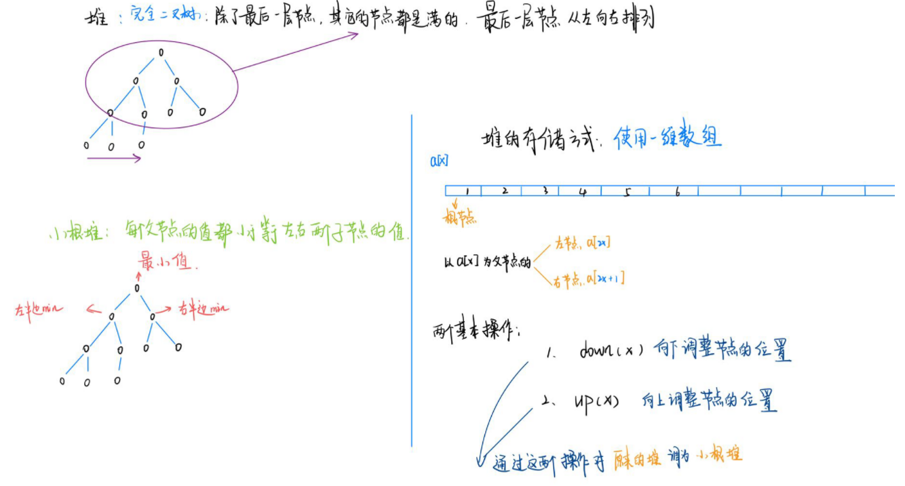

```c++
/*
堆是维护一个数据集合 -----> 完全二叉树
   
   小根堆： 每个父节点 都是 小于等于 子节点的值，那么根节点就是我们的最小值
    
   存储方式：使用一维数组a[N]来存储，第 1 个节点为根节点,(我们的下标是从一开始的)
    	对于 a[x] 来说，我们的左节点为 a[2x] ，右节点为 a[2x+1]。
    
    两个基本操作： 堆中某一个节点的位置不符合堆的标准。
        down(x)  向下调整节点的位置 
        up(x)  向上调整节点的位置
    时间复杂度都是与我们的树的高度成正比，所以是 (o)logn
    
    用 heap[] 表示堆，用 size 表示我们当前堆的大小。
    
操作：
    
 1：插入一个数   (在堆的最后一个位置，然后根据节点中元素的大小对其进行操作)   
    	heap[ ++size] = x ;    
		up(size);
    
 2：求集合当中的最小值   
        heap[1];
    
 3：删除最小值    (我们删除最后一个元素好删，只需 size-- ，所以)
     对于删除根节点就是删除一维数组的第一个元素，比较困难，首先是先将我们的堆的最后一个节点
直接覆盖 根节点， 再 size-- 删掉最后一个元素，再将堆顶 down(1);
		heap[1] = heap[size];
		size--;   
		down(1); //  将放在根节点尾节点下移

 4：删除任意一个元素 k
        heap[k] = heap[size];
	    size--;
		down(k); // 因为我们的元素的大小未知，所我们需要经过判断， down(k)，up(k);
		up(k); //  down(k) 和 up(k) 只会执行一个
        
    
 5：修改任意一个元素
        heap[k] = x;
		down(k);
		up(k);
*/
```

```c++
// h[N]存储堆中的值, h[1]是堆顶，x的左节点是2x, 右节点是2x + 1
// ph[k]存储第k个插入的点在堆中的位置
// hp[k]存储堆中下标是k的点是第几个插入的
int h[N], ph[N], hp[N], size;

// 交换两个点，及其映射关系
void heap_swap(int a, int b)
{
    swap(ph[hp[a]],ph[hp[b]]);
    swap(hp[a], hp[b]);
    swap(h[a], h[b]);
}
 
void down(int u)
{
    //  这里的 t 是 父节点和两个子节点 中最小数的下标
    int t = u;  
    if (u * 2 <= size && h[u * 2] < h[t]) t = u * 2;  //  左节点小
    if (u * 2 + 1 <= size && h[u * 2 + 1] < h[t]) t = u * 2 + 1;  //  右节点小
    if (u != t)
    {
        heap_swap(u, t);
        down(t);
    }
}

void up(int u)
{
    // u/2 >0 (可以简写为u/2) 盘判断节点是否有父节点，并且这个父节点的值 < 该节点的值，我们就做替换
    while (u / 2 && h[u] < h[u / 2])
    {
        heap_swap(u, u / 2);
        u >>= 1;
    }
}

// O(n)建堆
for (int i = n / 2; i; i -- ) down(i);
/*
n/2 个数，就是我们的最后一层数，依次向上一层是 n/4,再向上就是 n/8;n/16 ... 
时间复杂度就是：    n/4 * 1 + 8/n * 2 + n/16 * 3 + ...   约等于 n
*/
```

#### 838:推排序

https://www.acwing.com/activity/content/problem/content/888/

对于堆排序我们 每次就将我们的堆顶输出出来，我们再将堆顶删掉，就会出现新的堆顶，我们就将堆顶再输出，这样我们就可以进行排序

```c++
#include<iostream>

using namespace std;
const int N = 100010;
int n,m;
int h[N],s;


void down(int x){  // 传入的下标

    int min = x ;// 首先用一个值替换，为了后面要和本身作比较
    
    if(x*2 <= s && h[x*2] < h[min] ) min = x*2; // 左节点满足更小
    
    if(x*2+1 <=s && h[x*2 +1] < h[min]) min = x*2+1;  // 右节点满足更小
    
// 最后再和我们的原先的值进行比较，没有被替换的话，说明就是找到了更小的值来替换到根节点    
    if(x != min){    
        swap(h[x],h[min]);
        down(min);
    }   
}
int main(){
    scanf("%d%d",&n,&m);
    for(int i=1;i<=n;i++)  scanf("%d",&h[i]);

    // 堆中节点的数目就是 size 
    s = n;
    
    // 建堆
    for( int i = n / 2 ; i ; i-- ) down(i);

    // 输出我们要输出的数（排好序的）----> 每次输出最小的数，然后删掉
    while(m--){
        printf("%d ",h[1]);
        h[1] = h[s];
        s--;
        down(1);
    }
    
    return 0;
}    
    
```

#### 838:模拟堆

https://www.acwing.com/problem/content/841/

```c++
#include<iostream>
#include<algorithm>
#include<string.h>
using namespace std;

const int N = 100010;

int h[N],ph[N],hp[N];
int s;
int m;

// 不但对值要进行交换，还有映射关系要交换。
void heap_swap(int a,int b){
    swap(ph[hp[a]],ph[hp[b]]);
    swap(hp[a],hp[b]);
    swap(h[a],h[b]);
}

void down(int x){
    int min = x;
    if(x*2    <=s && h[x*2]    <  h[min]) min = x*2;
    if(x*2 +1 <=s && h[x*2 +1] <  h[min]) min= x*2 +1;
    if(x != min){
        heap_swap(x,min);
        down(min);
    }
}

void up(int x){
    while(x/2 && h[x/2] > h[x]){
        heap_swap(x/2,x);
        x /= 2;
    }
}


int main(){
    int n,m=0;
    scanf("%d%d",&n,&m);
    while(n--){
        char op[10];
        int k,x;
        scanf("%s",op);
        if(!strcmp(op,"I")){
            scanf("%d",&x);
            s++;
            m++;
            ph[m] = s,hp[s]= m;
            h[s] = x;
            up(s);
        }
        else if(!strcmp(op,"PM")) printf("%d\n",h[1]);
        else if(!strcmp(op,"DM")){
            heap_swap(1,s);
            s--;
            down(1);
        }
        else if(!strcmp(op,"D")){
            scanf("%d",&k);
            k = ph[k];
            heap_swap(k,s);
            s--;
            down(k),up(k);
        }
        else{
            scanf("%d%d",&k,&x);
            k = ph[k];
            h[k] = x;
            down(k),up(k);
        }
    }
    
    
    return 0;
}
```

### 哈希表


``` C++
/*
哈希表的作用：
    1:将大量的数据映射到从 0 ~ N 的数据（N 一般是 10^5 到 10^6）
	eg：  -10^9 < x < 10^9   哈希函数 h(x), 利用 h(x) 把 x 对应到 10^5 范围内的一个数
        注意点：
        	h(x) 的实现一般就是 x % 质数 得到即可  （质数 离 2 的整数次幂尽可能地远） 
        
        冲突：就是我们可能会就不同的数映射到同一个数，就会产生冲突  eg:h(5) = 2 ,h(10)= 2
	然后我们再来处理冲突的 
			处理的方式就是 拉链法和开放寻址法
      时间复杂度一般为 o(n) 
*/
```

#### 拉链法

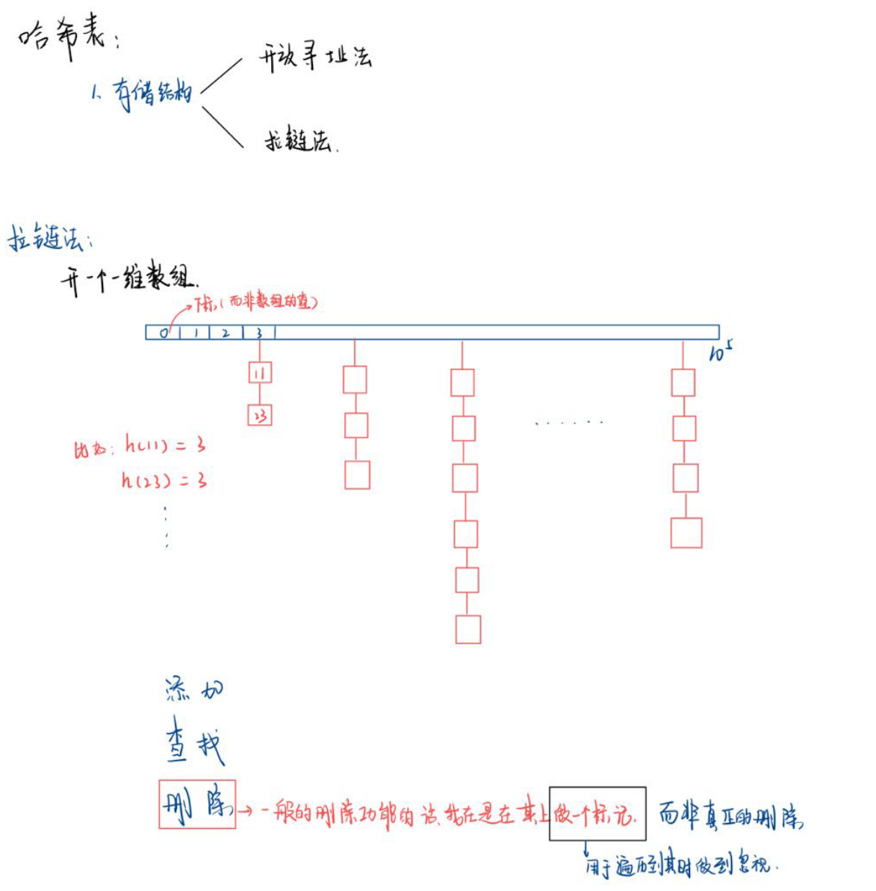

```c++
// (1) 拉链法
    int h[N], e[N], ne[N], idx;

    // 向哈希表中插入一个数
// 插入操作
// 我们这里插入的数x 都是那个大范围中的一个数，然后我们算出对应的 哈希值 K，要注意的我们会有多个
// 大范围的数 x ,对应到一个哈希值 k ，而我们这里的拉链法是将我们的开辟的 一维数组 h[N] 的每个元素的 下标 k   
// 作为哈希值,同时我们的一维数组的每个元素作为 链表的 head 节点，在 head 连接更多的 x 。
    void insert(int x)
    {
        int k = (x % N + N) % N;//哈希函数，k为哈希值,先模再加再模才可以使得我们的 k 值为正
    // 链表中插入 x （我们这里插入的位置是最近的位置）
        e[idx] = x;
        ne[idx] = h[k];
        h[k] = idx ++ ;
    }

    // 在哈希表中查询某个数是否存在
    bool find(int x)
    {
        int k = (x % N + N) % N;
        for (int i = h[k]; i != -1; i = ne[i])
            if (e[i] == x)
                return true;

        return false;
    }
```

#### 开放寻址法

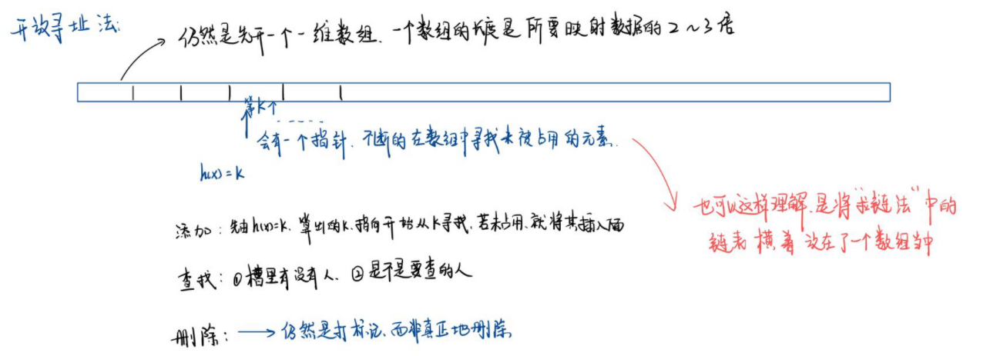

```c++
//  (2) 开放寻址法
    int h[N];
	const int null_h = 0x3f3f3f3f; //  使用数据范围之外的一个数来标记我们的数组的元素已经被添加进来

    // 如果x在哈希表中，返回 x 的下标；如果x不在哈希表中，返回x应该插入的位置
    int find(int x)
    {
        int t = (x % N + N) % N;
        while (h[t] != null_h && h[t] != x)  // 当 槽位上有数，并且这个数 != x的时候，我们就向下寻找
        {
            t ++ ;
            if (t == N) t = 0; // 满足 if 时，说明我们已经到达数组的末尾，这样的话我们需要从头再此寻找。
        }
        return t;
    }


一定要注意的就是我们的这里都是返还的是  下标

```

##### 840:模拟散列表

https://www.acwing.com/problem/content/842/

```c++
//  拉链法：
#include<iostream>
#include<cstring>
using namespace std;
const int N = 100003;  // 100000之后地第一个质数
int h[N];
// 节点下的链表
int e[N],ne[N],idx;

// 插入操作
// 我们这里插入的数x 都是那个大范围中的一个数，然后我们算出对应的 哈希值 K，要注意的我们会有多个
// 大范围的数 x ,对应到一个哈希值 k ，而我们这里的拉链法是将我们的开辟的 一维数组 h[N] 的每个元素的 下标 k   
// 作为哈希值,同时我们的一维数组的每个元素作为 链表的 head 节点，在 head 连接更多的 x 。
void insert(int x){
    int k = (x % N + N) % N;//哈希函数，k为哈希值,先模再加再模才可以使得我们的 k 值为正
    // 链表中插入 x （我们这里插入的位置是最近的位置） 
    e[idx] = x;
    ne[idx] = h[k]; 
    h[k] = idx++;
}

bool find(int x){
    int k = (x % N + N) % N; // 映射哈希值
    // 在对应链表中寻找对应值。
    for(int i = h[k] ; i != -1 ; i = ne[i]) // 这里的 i = ne[i],就相当于 i++ 在e[i]中；i != -1 就是不在头接节点寻找。在其下的链表中寻找。
        if(e[i] == x)
            return true;
    return false;
}

int main(){
    int n;
    scanf("%d",&n);
    memset(h,-1,sizeof h);//先将我们的这些节点下的 链表 清空
    while(n--){
        char op[5];
        int x;
        scanf("%s%d",op,&x);
        if(*op == 'I') insert(x);// 插入操作
        else {
            if(find(x)) puts("Yes");  // 查询操作
            else puts("No");
        }     
    }
    return 0;
}

```

```c++
 void memset(void *s, int v, size_t n);   // --->string.h 这个头文件下
/*
         是对 s 指向的 n 个字节，初始化为 v;
  memset(h,-1,sizeof h); 就是对我们的 一维数组地每个字节初始化为 -1 ,因为这个数组的每个元
素都有可能作为链表的头节点去存储冲突值，而我们在对链表的初始化的时候我们是先 将头节点置为 -1；

      
 memset() 内存赋值函数。
   在memset使用时要千万小心，在给char以外的数组赋值时，只能初始化为 0 或者 -1。// 未知正确
   我们的 memset() 中第二个参数是 的话就是每个字节都是0,这样也就会使得赋值为 0
  当参数 为 -1 的时候，就是每个字节存的都是 1 ，那么全为 1的二进制补码表示的就是 十进制的 -1
*/
```

```c++
 //   开发寻址法：
#include<iostream>
#include<cstring>
using namespace std;

const int N = 200003;
const int null_h = 0x3f3f3f3f;

int h[N];
// 返回 x 存储的位置，如果 x 存在哈希表中，返回 x 的下标，如果不存在，返回 x 应该插入的下标
int find_h(int x){
    int k = (x % N + N) % N;
    
    while(h[k] != null_h && h[k] != x){ // k 位置有元素并且不等于值 x,就一直寻找下去
        k++;
        if(k==N) k=0;// 寻找到末尾，我们再从回头寻找一遍，并且我们的 k 位置一定可以找到，所以不会陷入死循环
    }
    return k;
}

int main(){
    int n;
    scanf("%d",&n);
    // 这里是按 int 来搞，并且第二个参数是按字节来存的 所以我们每个字节都是 0x3f,
    // 4个字节就是 0x3f3f3f3f
    memset(h,0x3f,sizeof(h)); 
    
    
    while(n--){
        char op[5];
        int x;
        scanf("%s%d",op,&x);
        int k = find_h(x);
        if(*op =='I') h[k] = x;
        else{
            if(h[k] != null_h) puts("Yes");
            else puts("No");
        }
    }
    
    
    return 0;
}
```


### 字符串哈希

```c++
/*
字符串哈希（字符串前缀哈希法）

    str = "abcdefghigk"
    h[0] = 0     ---->  特殊定义
    h[1] = "a"的哈希值
    h[2] = "ab"的哈希值
    h[3] = "abc"的哈希值
    h[4] = "abcd"的哈希值
    .
    .
    .
    
核心思想：将字符串看成P进制数，P的经验值是131或13331，取这两个值的冲突概率低
小技巧：取模的数用2^64，这样直接用unsigned long long存储，溢出的结果就是取模的结果

    A B C D  ----->   (1 2 3 4)p     由 p 进制转换为 10 进制
   (1 2 3 4)p = 1xp^3 + 2xp^2 + 3xp^1 + 4xp^0   这样就会转换为数字，但是数字会比较大，所以我们需要mod一个数
注意点：我们一般不会将我们的字符映射为 0 ,
            因为： (0)p  --> 0       多个字符的映射值就会一样
                  (00)p  --->0
                   ...
      当我们已知前缀字符的哈希值之后，我们就可以利用一个公式来求得 每个 子串的哈希值。
typedef unsigned long long ULL;
ULL h[N], p[N]; // h[k]存储字符串前k个字母的哈希值, p[k]存储 P^k mod 2^64
*/

// 初始化
p[0] = 1;
for (int i = 1; i <= n; i ++ )
{
    h[i] = h[i - 1] * P + str[i];
    p[i] = p[i - 1] * P;
}

// 计算子串 str[l ~ r] 的哈希值
ULL get(int l, int r)
{
    return h[r] - h[l - 1] * p[r - l + 1]; 
}
```

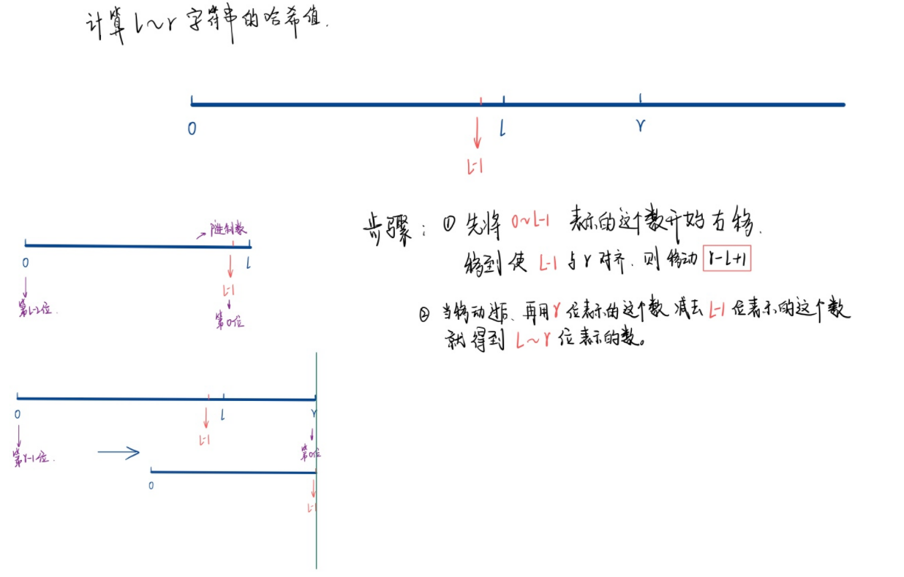

#### 841:字符串哈希

https://www.acwing.com/problem/content/843/

```c++
#include<iostream>
using namespace std;

const int N = 100010,P = 131;
typedef unsigned long long ULL;

int n,m;
char str[N];
ULL h[N],p[N];
// h[k]存储字符串前k个字母的哈希值, p[k]存储 P^k mod 2^64
//  p[N] 表示我们乘 P的次方的一个结果值,就是每个数 位数的权重，比如 
//  p[0] = 131*1 , p[1] = 131^2 = p[0] * 131 , p[2] = 131^3 = p[1] * 131 ...
ULL get(int l,int r){
    return h[r] - h[l-1] * p[r-l+1];// 区间和并
}

int main(){
    scanf("%d%d%s",&n,&m,str+1); // str[] 这里是从下标 1 开始的
    p[0] = 1; // 131^0
    for(int i=1;i <= n;i++){ // 映射哈希值
        p[i] = p[i-1] * P;
        h[i] = h[i-1] * P + str[i]; // 前缀和, 保证 str[i] != 0
// 这里我们的 h[N] 是int 的数组，所以我们 h[i] = h[i-1] * P + str[i];这里就会把str[i] 转换为整数
// h[1] = h[0] x 131 + str[1] ===>  h[1] = 0 x 131 + 97 = 97  
// h[2] = h[1] x 131 + str[2] ===>  h[2] = 97 x 131 + 97 = 12804 
// ...
        
    }
    while(m--){
        int l1,r1,l2,r2;
        scanf("%d%d%d%d",&l1,&r1,&l2,&r2);
        if(get(l1,r1) == get(l2,r2)) puts("Yes");
        else puts("No");
    }
    
    return 0;
}
```


