[TOC]


### 搜索与图论

```c++
1: dfs  和  bfs

		数据结构      空间
dfs:     stack        o(h)   
bfs:     queue        o(2^h)      有 “最短路” 的性质  eg: 在树底有个节点，搜到之后，我们为其与第二层的节点加								一条边，下次再搜索就可以从第一层直接 bfs 到 第二层，然后再搜到那个节点
    
    
```

### DFS

```c++
dfs        ---->当中不具有最短路的性质
    
   重要步骤：  回溯 和 剪枝

1：使用怎样的 顺序 来搜索  （搜索树）
    
    
    
```

#### 842：排列数字

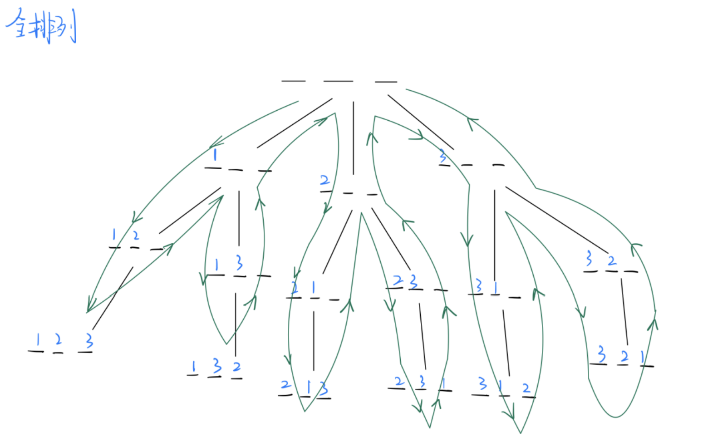

```c++
所有的路径合起来就是一棵树，但是我们存的只是每一次的路径，不需要整棵树存起来，并且我们的回溯不需
要开新的栈，系统会为我们做回溯，我们是写递归函数，在这个递归执行之后就会有系统自动的回溯。
    回溯的注意点：(恢复现场)
   		 一定要回的是我们之前的样子，就是我们下去的时候什么样，回来的时候就是什么样
    
    
```

[排列数字]:https://www.acwing.com/problem/content/844/

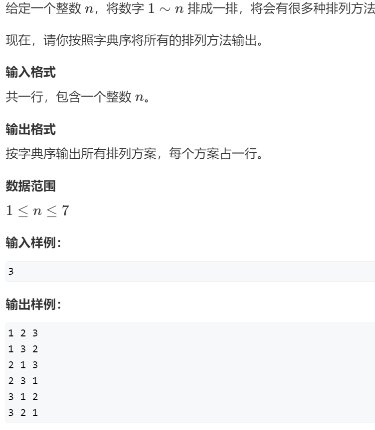

```c++
#include<iostream>
using namespace std;
const int N = 10;
int n;
int path[N];   // 储存我们当前的状态
bool st[N];    // 用来记录我们用过的点

void dfs(int u){
    // 走到了第 n 个位置，并且在 n 这个状态下我们已经将三个位置填满，将其输出即可
    if(u > n){
        for(int i = 1;i <= n;i++) printf("%d ",path[i]);
        puts("");
        return ;
    }
    //  u < n ,我们就开始枚举寻找
    for(int i = 1 ;i <= n;i++){   
        // 当前点为遍历过 时，我么们就可以使用该点
        if(!st[i]){
            path[u] = i;  // 将用过的 i 放到我们当前状态里面去，即插入到我们的剩余位置当中 
            st[i] = true;   // 然后记录该店已经被用过
            dfs(u+1);     // 继续再递归到下一个点
            
            // 恢复现场
            // path[i] = 0;  没有必要做，因为每一次都会有 path[i] 被覆盖
            st[i] = false;
        }
    }
}

int main(){
    cin >> n;
    dfs(1);   //  从第 0 位置开始向下走
    return 0;
}
```

#### 843：n-皇后问题

[n - 皇后]:https://www.acwing.com/problem/content/845/


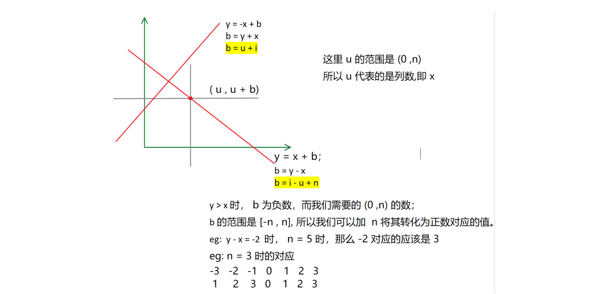

```c++
可以使用全排列的思路来做。可以先做完所有的搜索再进行判断
    也可以在搜索的同时就进行判断（剪枝）
    
剪枝：
    就是当我们判断到这条路走不通时，我们就直接回溯了，不再继续向下走了
 
    
//  全排序的思路   （一行一行的来做，因为每一行只有一个皇后,等所有的皇后都出来判断是否冲突）
#include<iostream>
using namespace std;
const int N = 20;
int n;
char g[N][N];
bool col[N],dg[N],udg[N];   // 判断并记录 皇后位置是否符合

void dfs(int u){
    // 找到方案
    if(u==n){
        for(int i = 0;i < n;i++) puts(g[i]);
        puts("");
        return;
    }
    //回溯 + 剪枝
    for(int i = 0;i < n;i++){   
        if(!col[i] && !dg[u+i] && !udg[n-u+i]){
            g[u][i] = 'Q';
            col[i] = dg[u+i] =udg[n-u+i] = true;
            dfs(u+1);
            
            //  恢复现场
            col[i] = dg[u+i] =udg[n-u+i] = false;
            g[u][i] = '.';
        }
    }
}

int main(){
    cin>>n;
    for(int i=0;i<n;i++){
        for(int j=0;j<n;j++){
            g[i][j] = '.';
        }
    }
    
    dfs(0);   
    return 0;
}


//  对每一个都进行检查 --->  就是边做边检查
//  就是 每个节点就是 放Q　与　不放Q  我们对每个节点都进行pai'cha
#include<iostream>
using namespace std;
const int N = 20;
int n;
char g[N][N];
bool row[N],col[N],dg[N],udg[N];   // 我们对每一个空位都进行检查

//  从左上角开始， s 记录当前的皇后数
void dfs(int x,int y,int s){
    if(y == n) y=0,x++;    // 每一行检查到头，将 y 置 0 ，即从第二行第一列开始遍历
    if(x == n){  // 检查到最后一行
        if(s == n){
            for(int i=0;i<n;i++) puts(g[i]);
            puts("");
        }
        return;
    }
    // 不放皇后  ， 就是不满足那些条件
    dfs(x,y+1,s);
    
    // 放皇后，满足条件
// 这里的 dg[x+y]  udg[n+x-y] 是我们的 对角线位置的值。 n 是防止我们的 x-y 为负数所添加的偏移量；
//  对角线分别是 x+y=b;  x-y=b，分别对应着截距，就是我们对角钱的坐标
    if(!row[x] && !col[y]  && !dg[x+y] && !udg[x-y+n]){
        g[x][y] = 'Q';
        row[x] = col[y] = dg[x+y] = udg[x-y+n] = true;
        dfs(x,y+1,s+1);
        // 恢复现场
        row[x] = col[y] = dg[x+y] = udg[x-y+n] = false;
        g[x][y] = '.';
    }
}
int main(){
    cin>>n;
    // 先将我们的输出全置为 .  后面再进行替换
    for(int i=0;i<n;i++){
        for(int j=0;j<n;j++){
            g[i][j] = '.';
        }
    }
    dfs(0,0,0);   
    return 0;
}
```

```c++
//  所有 8h

#include <iostream>
using namespace std;
 
const int N = 8;
int arr[10], total_cnt;
// arr记录每一行(X)皇后的Y坐标
 
bool isPlaceOK(int *a, int n, int c) {
    for (int i = 1; i <= n - 1; ++i) {
        if (a[i] == c || a[i] - i == c - n || a[i] + i == c + n)
            return false;
        //检查位置是否可以放
        //c是将要放置的位置
        //a[i] == c如果放在同一列，false
        //a[i] -+ i = c -+ n 如果在对角线上，false
    }
    return true;
}
 
void printSol(int *a) {
    for (int i = 1; i <= N; ++i) { //遍历每一行
        for (int j = 1; j <= N; ++j) { //遍历每一列
            cout << (a[i] == j ? "X" : "-") << " ";;
        } //如果标记数组中这一行的皇后放在j位置，则输出X，否则输出-，
        //用空格分隔
        cout << endl; //每一行输出一个换行
    }
    cout << endl; //每一组数据一个换行分隔
}
 
void addQueen(int *a, int n) {
    if (n > N) { //n代表从第一行开始放置
        printSol(a);
        total_cnt++;
        return ;
    }
    for (int i = 1; i <= N; ++i) { //i从第1列到第N列遍历
        if (isPlaceOK(a, n, i)) {
            a[n] = i; //如果可以放置，就把皇后放在第n行第i列
            addQueen(a, n + 1);
        }
    }
 
}
 
int main() {
    addQueen(arr, 1);
    cout << "total: " << total_cnt << " solutions.\n";
    return 0;
}
```

### BFS

```c++
BFS ：（搜最短路）
    一层一层的来搜（图中每个边的权重是一样的）
 
    
 最短路问题：包含 DP 问题（无环）
    
一般解法：
    初始化一个 queue
    while(queue 不为空 )
        将队头 t 拿出
        扩展 t
```

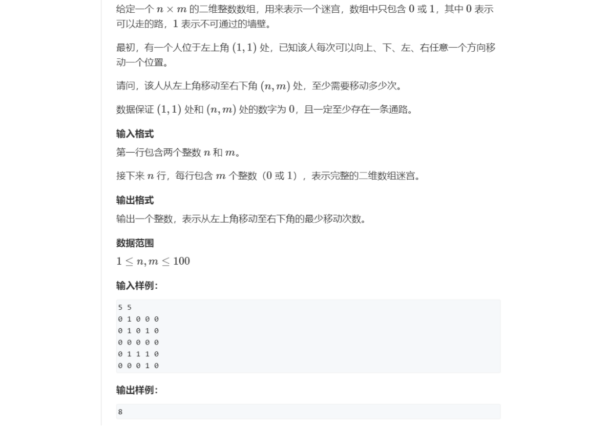

#### 使用邻接矩阵来存储图 ： 844：走迷宫

```c++
//  这里使用邻接矩阵来存储图，使用邻接矩阵要想向图中其他点遍历时就可使用方向数组；
//  偏移量
int dx[4] = {-1 , 0 ,  1 , 0};
int dy[4] = { 0 , 1 ,  0 , -1};

//  通过偏移量搜图
for(int i = 0 ; i < 4 ; i++){
    int x = t.first + dx[i];
    int y = t.second + dy[i];
}
```

```c++
#include<iostream>
#include<algorithm>
#include<cstring>
using namespace std;

typedef pair<int,int> PII;

const int N = 110;

int n,m;
int g[N][N]; // 存储 图
int d[N][N]; // 存储 每个点 到 起点的距离

PII q[N*N],Prev[N][N]; // 队列 和 路径存储

int bfs(){
    // 初始化队列
    int hh = 0,tt=0;
    q[0]={0,0};
    
    // 初始化距离
    memset(d,-1,sizeof d);  //  距离 -1 表示没有走国过
    d[0][0] = 0;  // 表示 走过
    
    // 用向量来表示 上下左右 移动
    int dx[4] = {-1,0,1,0}, dy[4] = {0,1,0,-1};
    
    while(hh<=tt){
        auto t = q[hh++];  // 取出对头
        
        // 枚举 4个方向
        for(int i=0;i<4;i++){
            // 上下左右 任一个方向的下一点
            int x = t.first + dx[i] , y = t.second + dy[i];
            
            // 边界内，是可以走的 图中的点，并且 这个点没有走过（距离 = -1）
            if(x >= 0 && y >= 0 && y < m && g[x][y] == 0 && d[x][y] == -1){ // 第一次搜到时
                
                d[x][y] = d[t.first][t.second] + 1; // 记录走过
                
                Prev[x][y] = t;
                
                q[++tt] = {x,y};
            }
        }
    }
    
    //  输出走过的路径
    int x = n - 1,y = m - 1;
    while(x || y){
        cout << x <<' '<< y << endl;
        auto t = Prev[x][y];
        x = t.first,y = t.second;
    }
    
    return d[n-1][m-1];
}


int main(){
    cin>>n>>m;
    
    for(int i=0;i<n;i++)
        for(int j=0;j<m;j++)
            scanf("%d",&g[i][j]);
    
    cout<< bfs() << endl;
    return 0;
}


```

#### 最小步数  845：八数码

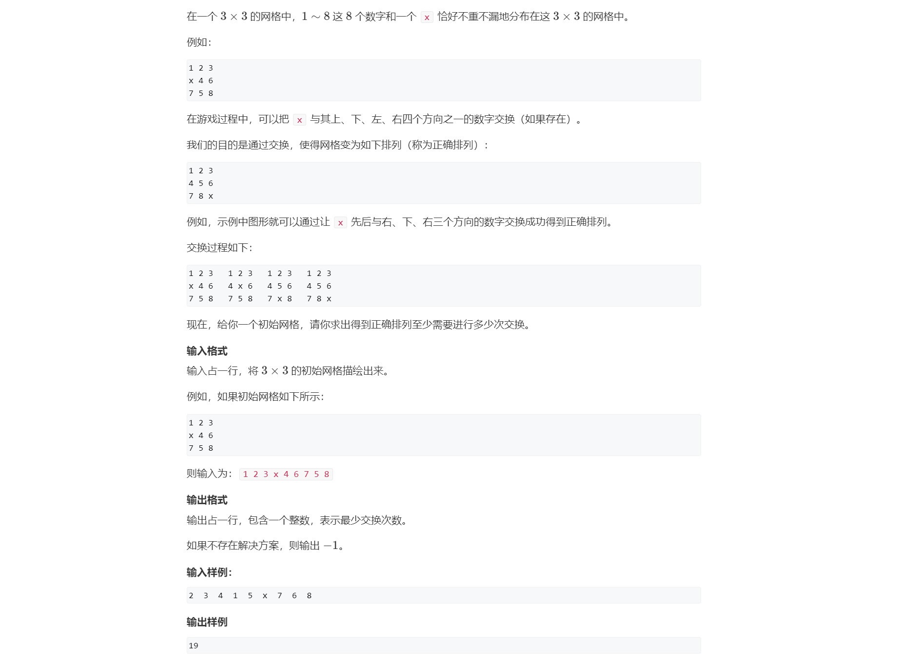

```
主要问题：如何状态表示？  (可以使用 string类型)   使用 queue<string>
    	如何记录每个状态的距离？unordered_map<string.int>
		如何进行状态转移？ (可以是 先从 string --> 3 * 3 的矩阵 --> string)
```

```c++
#include<bits/stdc++.h>
using namespace std;

int bfs(string start){
    //  定义末状态
    string end = "12345678x";
    
    queue<string> q;
    unordered_map<string,int> d;  //  使用哈希表来存储距离
    
    // 初始化队列和距离
    q.push(start);
    d[start] = 0;
    
    //  使用方向数组来进行移动
    int dx[4] = {-1, 0 , 1 ,0};
    int dy[4] = {0 , 1 , 0 ,-1};
    
    while(q.size()){
        // 每次循环的队头替换
        auto t = q.front();
        q.pop();
    
        int distance = d[t];
        
        if(t == end) return distance;
        
        //  状态转移：  
        int k = t.find('x'); //  找到 x 的位置；
        
        int x = k / 3, y = k % 3;  //  将一维坐标转化为 3 * 3 矩阵坐标
        
        for(int i = 0 ; i < 4  ; i++){
            int a = x + dx[i];
            int b = y + dy[i];
            
            if(a >= 0 && a < 3 && b >= 0 && b < 3){
                
                // 将移动后的状态交换，注意将 3 * 3 矩阵的坐标转换为一维坐标
                swap(t[k],t[a * 3 + b]); // 状态更新
                
                if(!d.count(t)){
                    
                    d[t] = distance + 1;
                    q.push(t);

                }
                
                swap(t[k],t[a * 3 + b]); // 恢复状态
                
            }
        }
    }
    return -1;
}


int main()
{
    string start;
    for(int i = 0 ; i < 9 ; i++){
        char c;
        cin >> c;
        start +=c ;
    }
    cout << bfs(start) << endl;
    return 0;
};

```


### 图

```c++
树 是 无环连通图
 
图： 有向图   和   无向图（特殊的有向图）
    
    a -> b       a - b (就是建两条边  a -> b , b -> a)
```

### 树和图的存储

```c++
有向图的存储：
    1：邻接矩阵    g[a][b] 存储 a->b 这条边的信息 （ 权重 或 布尔值（有边和无边））  
    	不能存储 重边 （所以只会保留一条）   空间复杂度 o(n^2)  适应于稠密图 
    
    2：邻接表  （单链表） 每个 点上 都有一个单链表 （单链表 存 这个点可以走向哪个点）
```

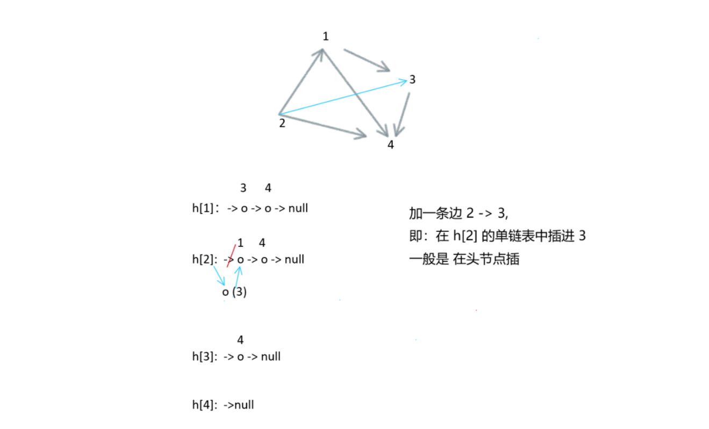

```c++
#include<bits/stdc++.h>
using namespace std;
const int N = 100010, M = N * 2;

int h[N],e[N],ne[N],idx;  // n 个头节点，链表存储边，指向下一个节点的指针，当前节点下标


void add(int a,int b){ //  a: 表示 图中的节点 , b 表示要插入的到以 a 主导的链表中的 节点
    e[idx] = b,ne[idx] = h[a],h[a] = idx++;
}


int main(){
    memset(h,-1,sizeof h);
    return 0;
}
```

### 树和图的遍历

#### 深度优先遍历

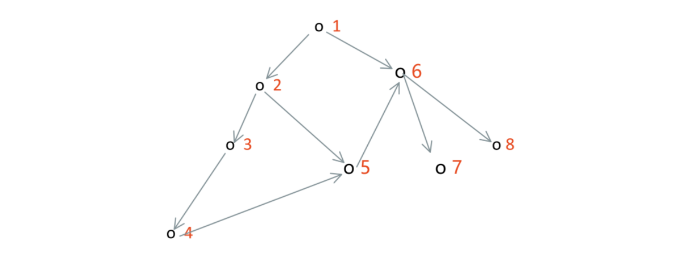

```
使用邻接表存储后，每个节点可以通过邻接表找到自己的邻接的节点。
```

```c++
// 基本写法
#include<bits/stdc++.h>
using namespace std;
const int N = 100010, M = N * 2;

int h[N],e[N],ne[N],idx;  
bool st[N]; //  深搜和宽搜的每个节点都只会遍历一次，所以我们需要 记录某个点 是否被搜过

void add(int a,int b){  
    e[idx] = b,ne[idx] = h[a],h[a] = idx++;
}

void dfs(int u){  // u  表示当前搜到的 点
    st[u] = true;  // 标记搜到的 点
    
    //  遍历一下 u 的所有  出边
    for(int i = h[u] ; i != -1 ; i = ne[i]){
        // 存一下 出边
        int j = e[i];
        if(!st[j])  //  判断这些点有没有被搜过
        {
            dfs(j);
            cout << j << endl;  //  输出 dfs 路径，是倒序的（栈）
        }
    }
}


int main(){
    memset(h,-1,sizeof h);
    
    int n ,m;
    cin >> n >> m;
    while(m--)
    {
        int a, b;
        scanf("%d%d",&a, &b);
        add(a,b), add(b,a);
    }
    
    dfs(1); //  从 1 号节点开始搜
    
    return 0;
}
```

##### 846:树的重心

https://www.acwing.com/problem/content/848/

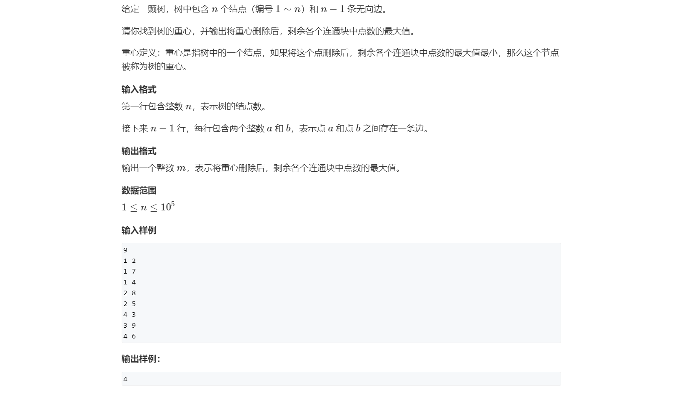

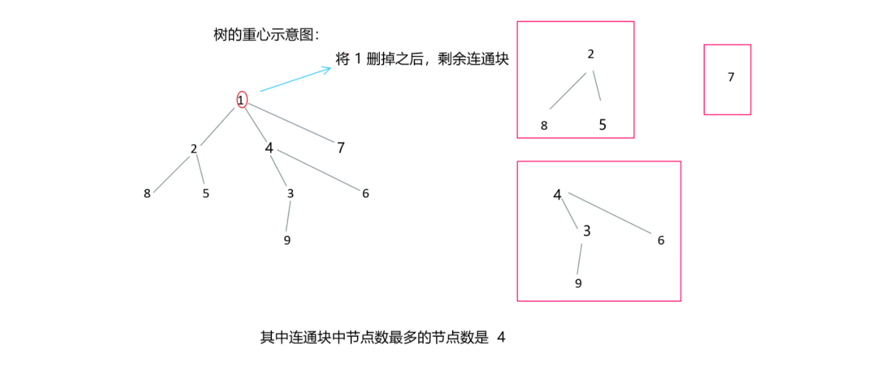

##### 使用邻接表来存储图

```
将每个点 分离 后剩余连通块的最大值  的 最小值 作为树的重心
    在深度优先遍历过程中就可以计算出每个点的分离后的连通块节点的个数   时间复杂度 o(n+m)
    
    eg: 4 的子节点的个数可以分别算出，再通过所有的节点的个数 n - size_4 的就可以算出父节点的个数
        那么其连通块中节点的个数也就算出了
```

```
 dfs 参数和返回值的设计：
 	1：首先的需求是遍历整个树。
 	2：在遍历的同时求得 去除重心之后 连通块中节点数量的最大值。
 		在实现 2 的时候可以在 枚举的时候将将枚举到的当前点删掉，并求 此时已有连通块的max
 		同时对 max 求 min 即可。
 
int dfs(int u) //  从 u 号节点开始搜，返回的是以 u 为根的子树的节点个数。 
```

```c++
#include<bits/stdc++.h>
using namespace std;

const int N = 100010,M = N * 2;
int n;
int h[N],e[M],ne[M],idx;
bool st[N];

int ans_min = N;

void add(int a,int b){
    e[idx] = b, ne[idx] = h[a],h[a] = idx++;
}


// 设  u  为根的子树中点的数量 , 返回的是以 u 为根的子树中节点个数。
int dfs(int u){
    st[u] = true;
    
    //  sum：当前子树的大小（从 1 开始）
    //  res：存储将 u 删除之后所剩连通块 节点个数的最大值。
   	int sum = 1,res = 0;
    
    for(int i = h[u] ; i != -1 ; i = ne[i]){
        int j = e[i];
         // 搜 左右 子节点
        if(!st[j]) {
            int s = dfs(j);// 暂存 左右子节点的数量
        	res = max(res,s);
            //s 是以 u 的儿子 j为根的子树中的节点个数，所以也是u 子树节点个数的一部分
            sum += s;  
        }
    }
    
    // n - sum 就是将当前节点删掉之后树上的节点个数 （也是一个连通块）
    res = max(res , n - sum); 
    
    // 求 max 中的 min
    ans_min = min(res,ans_min);
        
    return sum;
}

int main(){
    cin >> n 
    memset(h,-1,sizeof h);
    
    for(int i = 0;i < n-1;i++){
        int a,b;
        cin >> a >> b;
        add(a,b),add(b,a);
        
    }    
    dfs(1);
    cout << ans_min << endl;
    return 0;
}

        
```


#### 宽度优先遍历


树与图的广度优先遍历需要使用一个队列来实现。起初，队列中仅包含一个起点（eg: 1 号节点）。在广度优先遍历中，需要不断从队友取出一个节点 $x$ ，对于 $x$ 面对的多条分支，把沿着每支到达的下一个节点（如果尚未访问过）插入队尾。重复执行上述过程，直至队空。

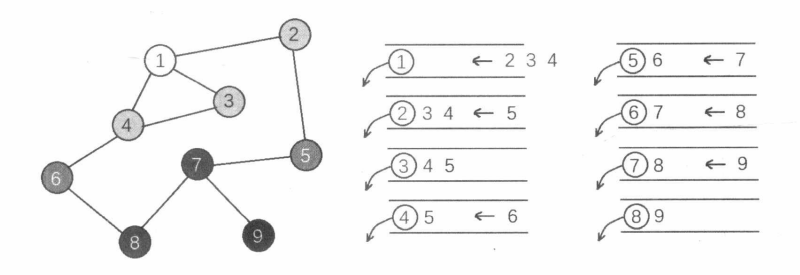

时间复杂度 $o(N + M)$ ， $N$ 为点数，$M$ 为边数。

**注意：普通的 BFS 是在入队时判重。**

```c++
int d[N]; // 即是距离数组，又可以用来判断该点是否被用过。
void bfs(){
    int hh = 0,tt = 0;
    q[0] = 1;
    
    memset(d,-1,sizeof d);
    d[1] = 0;  //  将起始状态添加到队列中
    
    while(hh <= tt){ //  队列不空时
        //  存队头
        int t = q[hh++];
        //  遍历 t 的所有邻节点
        for(int i=h[t];i != -1;i=e[i]){
            int j = e[i];
            //  如果 未被遍历
            if(d[j] == -1){
                d[j] = d[t] + 1; //  更新距离
                q[++t] = j;  //  入队
                
                cout << j << endl;
            }
        }
    }	
}
```


代码中 `d[N]` 数组，对于一个树来说，`d[x]` 就是 `x` 在树中的深度。

对于一张图来说（**边权均为** $1$），`d[x] ` 是点 `X` 的层次（从起点 $1$ 走到点 $x$ 需要经过的最少点数），也即**最短路**。也即解决的是 **初始状态 到  每个状态 最小步数的问题。**

从遍历的顺序来看，广搜是按照层序的遍历方式。具有下面**重要性质**。

**1：两段性**：在访问完所有第 $i$ 层节点之后，才会开始访问第 $i + 1$ 层节点。

**2：单调性**：任意时刻，队列中至少有两个层次的节点。若其中一部分节点属于第 $i$ 层，则另一部分节点属于第 $i + 1$ 层，并且所有第 $i$ 层节点排在第  $i + 1$ 层节点之前。


##### 847:图中点的层次

https://www.acwing.com/problem/content/849/

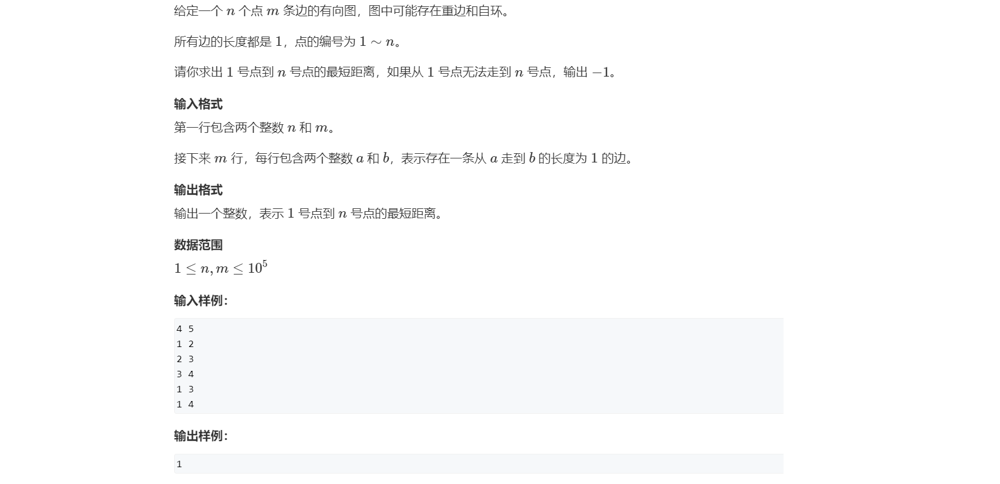

```c++
// 所有边的权重都等于 1 ，所以我们可以使用 宽搜 来求最短路
#include<iostream>
#include<algorithm>
#include<cstring>

using namespace std;
const int N = 100010;

int n, m;
int e[N],ne[N],h[N],idx;
int d[N],q[N];

void add(int a, int b) {
    e[idx] = b, ne[idx] = h[a], h[a] = idx ++ ;
}

int bfs(){
    // 初始化队列
    int hh = 0,tt = 0;
    q[0] = 1;
    
    // 初始化距离
    memset(d,-1,sizeof d);
    d[1] = 0;
	
    // 队列不空
    while(hh <= tt){
        int t = q[hh++];
        
        // 遍历 t 的所有邻节点
        for(int i = h[t]; i != -1;i = ne[i]){
            int j = e[i];
            //  有没有去过的邻节点
            if(d[j] == -1){
                d[j] = d[t] + 1;
                q[++tt] = j;// 入队
            }
        }
    }
    return d[n];
}
int main(){
    cin >>  n >> m;
    //  初始化邻接表
    memset(h , -1 ,sizeof h);
    
    for(int i = 0 ; i < m ; i++){
        int a ,b;
      	cin >> a >> b;
        add(a,b);
    }
    cout << bfs() << endl;
    return 0;
}
```

### 有向图的拓扑序列

```c++
有向无环图 被称为 拓扑图   （图的宽度优先遍历的一个应用）
    
    
    有向图
  入度： 当前节点有几条边 指向自己
    
  出度： 当前节点有几条指向 其他节点的边
```

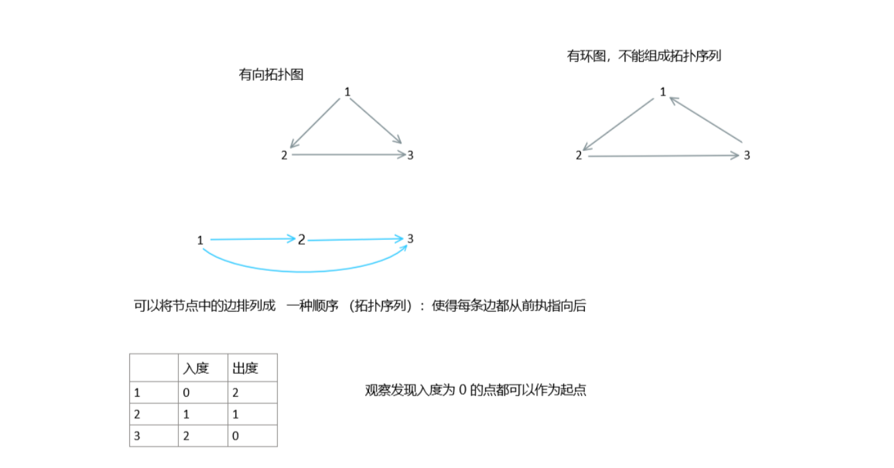


```c++
// 有一条边 t -> j

queue[N]    <--- 所有入度为 0 的点;

while (queue[N] != null)  {
    t  <--- 为对头;
    枚举 t 的所有 出边 t -> j ... ;
    删掉 t -> j;(就会使 j 的入度减 1 ，即d[j]--)
    if(d[j]==0) j 的入度为0
        让 j 进入 queue
    
}
在我们枚举 t 的所有出边之后，eg: t -> j ， t 和 j 的位置已经确定，所以我们不再需要这条边
    这样删掉之后就会影响 j 的入度，当 j 的入度为 0 , j 前面 就没有指向其的边，然后就让 j 入 queue
    然后循环的将所有的点就排进 queue 
    
    
一个无环图至少存在一个入度为 0 的点;
所以我们就可以以这个入入度为 0 点入手来进行拓扑排序。
    
    
这里求出来的 拓扑序列是任意一个，若要按照字典序进行输出的话，使用 小根堆ji

```

#### 848:有向图的拓扑序列

https://www.acwing.com/problem/content/850/

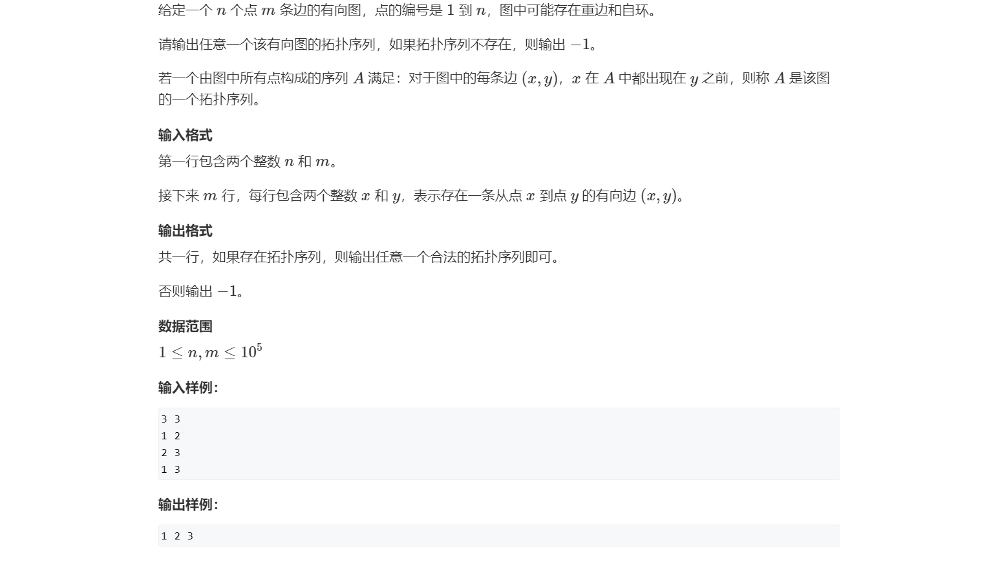

```c++
#include<iostream>
#include<cstring>
#include<algorithm>
using namespace std;


const int N = 100010;
int n ,m;
int h[N],e[N],ne[N],idx;
int q[N],d[N];

void add(int a,int b){
    e[idx] = b, ne[idx] = h[a] , h[a] = idx++;
}

bool topsort(){
    //  初始化队列
    int hh = 0 , tt = -1;
    
    //  将当前入度为 0 点加到队列中
    for(int i = 1; i <=  n ;i++ )
        if(!d[i])
            q[++tt] = i;            
    
    while(hh <= tt){
        int t = q[hh++];
        
        for(int i = h[t] ; i != -1 ; i = ne[i]){
            int j = e[i];
            d[j]--; // 将 t -> j 删掉
            if(d[j] == 0) q[++tt] = j; // j 的入度为 0 时，加到队列中去
        }
    }
    
    return tt == n - 1; 
}


int main()
{
    cin >> n >> m;
    
    memset(h , -1 ,sizeof h);
    
    for(int i = 0 ; i < m ; i++){
        int a, b;
        cin >> a >> b;
        add(a,b);
        d[b]++;  //  b 的入度增加
    }
    
    if(topsort()){
        for(int i = 0 ; i < n;i++) printf("%d ",q[i]);
        puts("");
    }
    else puts("-1");
    
    
    return 0;
}
```

#### 1639：拓扑顺序

https://www.acwing.com/problem/content/1641/

```
需求是判断 已有的顺序是否满足 拓扑排序。

我们只需要将每个状态 存储。单独进行判断
首先判断首节点 入度是否为 0，然后依次将 节点所到的节点的 入度-- ，然后循环完当前存储的状态即
可。
```

```c++
#include<iostream>
#include<cstring>
using namespace std;
const int N = 1010 , M = 100010;

int n, m;
int e[M * 2] , ne[M * 2], h[N], idx;   //  无向图
int d[N];
int dc[N]; // 入度
int ans[N];
bool v[110];

void add(int a, int b)
{
    e[idx] = b, ne[idx] = h[a], h[a] = idx++;
}

bool topsort()  
{
    for(int i = 1 ; i <= n ; i++)
    {
        // 每次判断传入的节点是否入度为 0
        if(dc[ans[i]] != 0) return 0;
        for(int j = h[ans[i]] ; j != -1 ;j = ne[j])
            dc[e[j]]--;
    }
    return 1;
}

int main()
{
    memset(h , -1 ,sizeof h);

    scanf("%d%d", &n, &m);
    for(int i = 1 ; i <= m ; i++)
    {
        int a, b;
        scanf("%d%d", &a, &b);
        add(a, b);
        d[b]++;
    }
    
    int k;
    scanf("%d",&k);
    for(int i = 0 ; i < k ; i++)
    {
        
        for(int j = 1 ; j <= n ; j++)
        {
            scanf("%d",&ans[j]);
            dc[j] = d[j];
        }
        if(topsort()) v[i] = 1;
        else v[i] = 0;
    }
    
    for(int i = 0 ; i < k ; i++)
        if(!v[i]) printf("%d ",i);

    return 0;
}
```


### 最短路

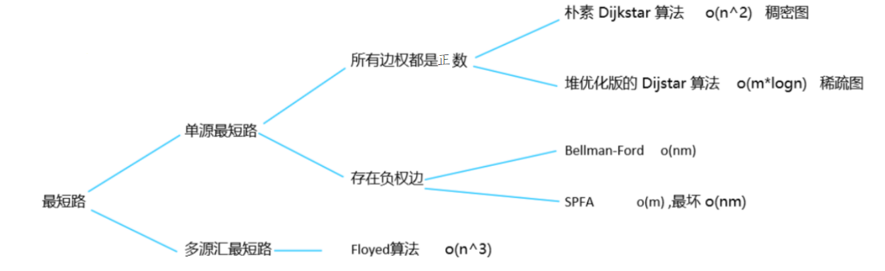

```c++
最短路问题的关键：  “建图”;
```

#### 朴素Dijstar 算法

**算法流程：**

1：初始化 `dist[1] = 0` ,其余节点正无穷大。

2：找出一个未标记的，`dist[t]` 最小的节点 `t` ，然后标记节点 `t`。

3： 扫描节点 `x` 的所有出 `(x ,y, z)` ，若  `dist[y] > dist[x] + z`,则使用 `dist[x] + z` 更新 `dist[y]`.

4：然后重复 2~3 步骤，直到所有节点被标记。

**注意：** Dijkstra 算法中时是在**节点出队的时标记**。即：其 到起点的最短路已经被确定。

```c++
bool st[N]; //  标记数组，用于该点已经被用过去更新最短路，当前点到起点的最短路已确定。
int dist[N];//  最短路数组

void Dijkstra()
{
    //  初始化距离    
    memset(dist,0x3f,sizeof dist);
    memset(st, 0 , sizeof st);
    //  初始化最短路的起点的距离
    dist[1] = 0; 
    
    // 遍历寻找 n - 1 次
    for(int i = 1 ; i < n ; i++){
        int x = -1;
        
        //  这里遍历的目的是要找到未标记 节点中 dist 最小的
        for(int j = 1 ; j <= n ; j++)
      // 未被使用去更新其他点 &&  (未在已更新的最短路上 || 当前距离大于可以被更新的距离)
            if(!st[j] && (t == -1 || dist[t] > dist[j])) 
                x = j; //  符合条件，替换
        
        if(x == n) break; // 如果找到，直接返回
        
        st[x] = true; // 当前点的最短路已确定。（已被用过去更新其他点）
        
        //  用全局最小值 去更新其他节点。
        for(int y = 1 ; y <= n ; y++)
            // 用 1 到 t 距离 + t到j的这条边来更新到 j 最短路
            dist[y] = min(dist[y],dist[x] + g[t][y]); 
    }
}

/*
1:关于 memset(dist, 0x3f,sizeof dist)
    memset 是按照字节来进行初始化， 我们这里的  int 是 4 个字节  
    所以初始化之后的  dist[N] 中的元素是  0x3f3f3f3f。

2:起点初始不能被标记。即 st[1] = 1 不写;

因为 标记数组 的作用就是当这个点的已经被用去跟新其他点后,该点到起点的最小值已经被确定,
但如果初始时就已经 st[1] = 1,那么就会导致不能进入循环更新最短路，从而不进行 Dijkstra的过程

上述疑惑的原因主要是 来源于 spfa 算法的  st[] 数组，spfa 算法中的 st[] 数组指的是
该点是否在队列中。

*/
```

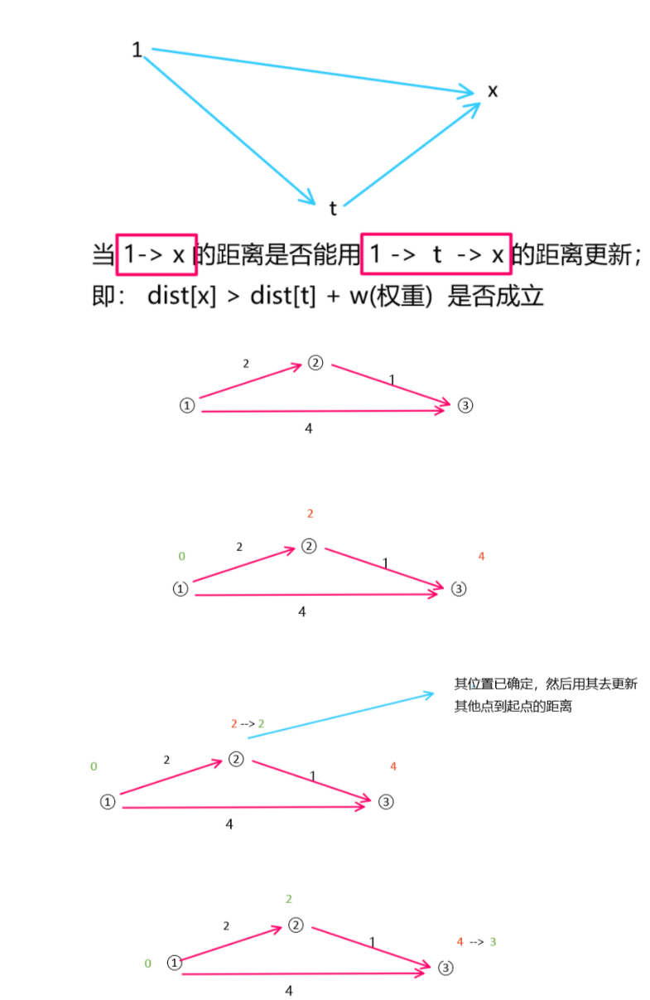

**Dijkstra 算法原理**

```c++
 Dijkstra 算法是不断的找 dist 最小的点去更新其他点到起点的距离，然后标记这个点，再去找下个
最小的未被标记的 dist，再去更新，直到所有的点都被标记。 
     某个最小的 dist 去更新是局部最优解，也即找到起点到这个点的最短路，然后通过这个局部最优
解的累加，以达到全局最优解。
```

**Dijkstra 算法不能求有负权最短路的原因**

```c++

```

##### 849:朴素Dijkstra

https://www.acwing.com/problem/content/851/

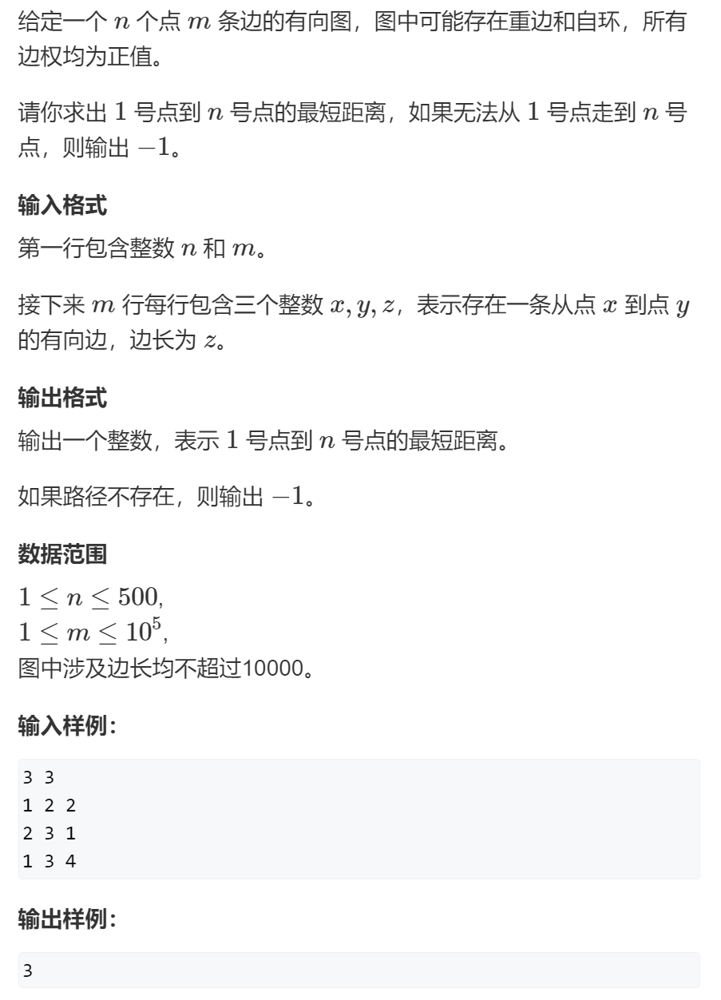

```c++
// acw 849
#include<iostream>
#include<algorithm>
#include<cstring>

using namespace std;

const int N = 510;

int n,m;
int g[N][N]; // 使用邻接矩阵来存储 稠密图
int dist[N]; // 当前的最短距离
bool st[N];  // 表示当前点的最短路是否已经确定

int dijkstra(){
    // 初始化距离
    memset(dist,0x3f,sizeof dist);
    dist[1] = 0;
    
    // 遍历寻找 n 次
    for(int i = 0 ; i < n ; i++){
        int t = -1;
        //  这里的遍历指的是 图 中点的个数
        for(int j = 1 ; j <= n ; j++)
            // 
            if(!st[j] && (t == -1 || dist[t] > dist[j])) 
                t = j;
        
        if(t == n) break; // 如果找到，直接返回
        
        st[t] = true;
        
        for(int j = 1 ; j <= n ; j++)
            // 用 1 到 t 距离 + t到j的这条边来更新到 j 最短路
            dist[j] = min(dist[j],dist[t] + g[t][j]); 
    }
    
    if(dist[n] == 0x3f3f3f3f) return -1;  // 最短路不存在
    return dist[n];
}

int main(){
    cin >> n >> m;
    
    memset(g,0x3f,sizeof g);
    
    while(m--){
        int a,b,c;
        scanf("%d%d%d",&a,&b,&c);
        g[a][b] = min(g[a][b],c);  // 处理重边和自环，只保留长度最短的那条边
    }
    
    int t = dijkstra();
    
    printf("%d\n",t);
    return 0;
}

```

#### 堆优化版的 Dijstar 算法

```c++

图中节点增多时,朴素的 Dijkstra 算法的 o(n^2) 会爆掉。
    
    朴素 Dijkstra 算法中寻找最小的 dist 是将所有的边都遍历一遍，这需要 o(n)o(n) 时间复杂
度。可以使用小根堆去优化。小根堆会将最小值置于堆顶，而小根堆自身堆调正将最小置于堆顶的时间复
杂度是 o(logm)

    
注意使用  priority_queue<PII , vector<PII> , greater<PII> > heap;时
    要将 dist 作为第一关键字，即 heap.first == dist;
因为使用  greater<PII> 时会先按照第一关键字排序，再按照第二关键字排序。
```

##### 850:Dijkstra求最短路 II

https://www.acwing.com/problem/content/852/

```c++
#include<iostream>
#include<algorithm>
#include<cstring>
#include<queue>

using namespace std;

typedef pair<int,int> PII;

const int N = 150010; 

int n,m;
int h[N],e[N],ne[N],idx,w[N]; // 使用邻接表 来存储稀疏图
int dist[N];
bool st[N];

void add(int a,int b,int c){
    e[idx] = b,w[idx] = c,ne[idx] = h[a],h[a] = idx++;
}

int dijkstra(){
    memset(dist,0x3f,sizeof dist);
    dist[1] = 0;
    
    // 使用优先队列来维护距离，小根堆
    priority_queue<PII,vector<PII>,greater<PII>> heap;   
    heap.push({0,1}); // 起点入队
    
    while(heap.size()){
        auto t = heap.top(); // 取出堆中 表示距离最小的点
        heap.pop(); 
        
        int ver = t.second,distance = t.first; // ver 是编号， distance 是距离
        if(st[ver]) continue;  // 说明这个点之前出现过，直接过
        
        st[ver] = true; // 优化操作，可以减少每次的判点数量
        
        for(int i = h[ver] ; i != -1 ; i = ne[i]){  // 再用当前的点来更新最短路
            int j = e[i];
            if(dist[j] > distance + w[i]){   // 如过当前距离大于之前的 距离就更新
                dist[j] = distance + w[i];
                heap.push({dist[j],j});   // 再将 j 这个点放到优先队列中
            }
        }
    }
    
    if(dist[n] == 0x3f3f3f3f) return -1;
    return dist[n];
}

int main(){
    cin >> n >> m;
    
    memset(h,-1,sizeof h);
    
    while(m--){
        int a,b,c;
        scanf("%d%d%d",&a,&b,&c);
        add(a,b,c);
    }
    
    int t = dijkstra();
    
    printf("%d\n",t);
    return 0;
}

```

#### Bellman-Ford 算法

```c++
for n 次            (k 次，就会实现不超过 k 条边的最短距离)
    进行一次备份，防止 使用上次迭代到的点 去更新最短距离
    for 所有边   , a  b  w  , a --w--> b   --->  可以使用结构体来存
    	dist[b] =  min(dist[b],dist[a] + w)   更新最短距离 （松弛操作） ，注意这里的dist[a]是之前拷贝的未更新的

循环完后 有：
        dist[b] <= dist[a] + w;   


可以用来找负环（时间复杂度很高，一般不用）
当循环 n 次之后，最短距离有 n 条边话，那么这条最短距离上就有 n+1 点，那么就肯定有环的存在


注意：负环 可能回造成最短路径不存在
    当 负环 不在最短路径所要经过的路径时就不会影响最短路（不能在负环中一直转，要限制）
    当我们限制最短路经过的边的时候，有负环也不会影响最短路
    
```

有边限制的最短路只能使用 Bell-man 算法

```c++
初始化 dist[1] = 0 , 其他的点是 INF;
1：松弛操作：
		对 点x,y的松弛操作： 相当于考察能否 经由x点 使起点到y 的距离变短
		dist[y] = min(dist[y], dist[x] + w);   // w 表示边权重。


```

```c++
void Bellman_Ford(int n,int m)   //  o(mn)
{
  for(int i = 0 ; i < n - 1 ; ++i)
    for(int j = 1 ; j <= m ; ++j)
        diat[edges[j].b] = min(dist[edges[j].b] , dist[edges[j].a] + edges[i].w);
    
}
```


##### 853:有边数限制的最短路

https://www.acwing.com/problem/content/855/

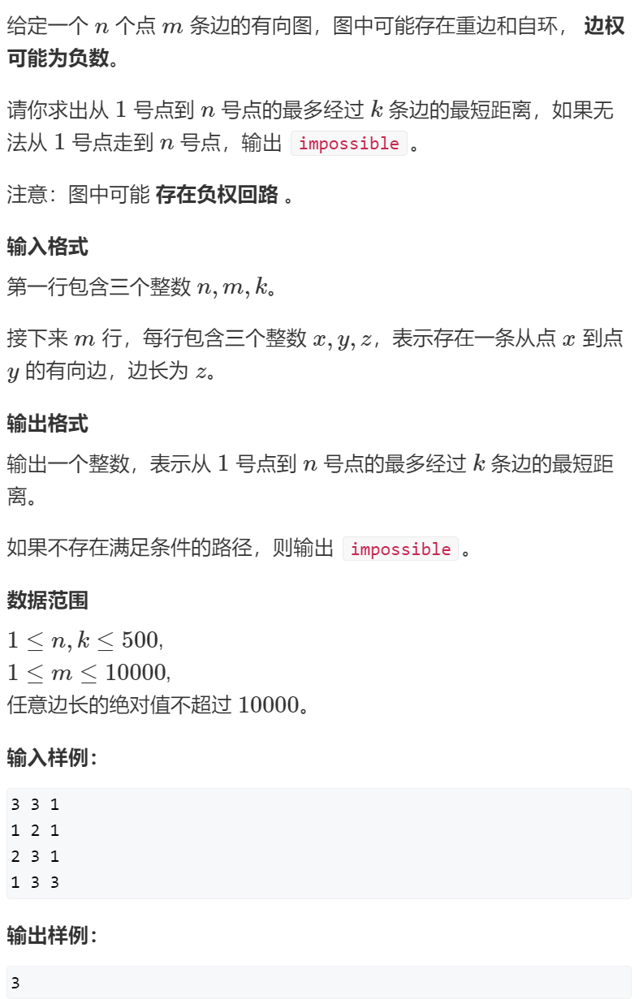

```
这里限制 最短路的边数之后，有负环也就无所谓了，应为不会一直在 负环中出不来。
```

```c++
// acw853

#include<iostream>
#include<cstring>
#include<algorithm>
using namespace std;

const int N = 510,M = 10010; 
int n,m,k;
// 这里使用 backup[N] 数组作为 dist[N] 的拷贝，防止当前的点去更新其他点的最短路
int dist[N],backup[N];   

//  使用结构体来存边
struct Edge{  
    int a,b,w;
}e[M];

int ballman_ford(){
    memset(dist,0x3f,sizeof dist);
    dist[1] = 0;
    
    for(int i = 0 ; i < k ; i++)
    {
        memcpy(backup,dist,sizeof dist);
        for(int j = 0 ; j < m ; j++){
            int a = e[j].a,b = e[j].b,w = e[j].w;
            dist[b] = min(dist[b],backup[a] + w);   
        }
    }
    
    if(dist[n] == 0x3f3f3f3f - 1) return -1;  // 应对只有 一条边，且权值为 -1
    // 因为我们使用的原来的 dist 来更新距离，并且边权可能是负值 
    else if(dist[n] > 0x3f3f3f3f / 2) return -2; 
    return dist[n];
}


int main(){
    scanf("%d%d%d",&n,&m,&k);
    
    for(int i = 0 ; i < m ; i++){
        int a,b,w;
        scanf("%d%d%d",&a,&b,&w);
        e[i] = {a,b,w};
    }
    
    int t = ballman_ford();
    
    if(t == -2) puts("impossible");
    else if(t == -1) printf("%d\n",t);
    else printf("%d\n",t);
    
    return 0;
}
```

```java
// java
import java.io.BufferedReader;
import java.io.IOException;
import java.io.InputStreamReader;
import java.util.Arrays;

public class Main {

    static int N = 510;
    static int M = 100010;
    static int n;//总点数
    static int m;//总边数
    static int k;//最多经过k条边
    static int[] dist = new int[N];//从1到点到n号点的距离
    static Node[] list = new Node[M];//结构体
    static int INF = 0x3f3f3f3f;
    static int[] back = new int[N];//备份dist数组
    public static void bellman_ford()
    {
        Arrays.fill(dist, INF);

        dist[1] = 0;
        for(int i = 0;i < k;i++)
        {
            back = Arrays.copyOf(dist, n + 1);//由于是从1开始存到n
            for(int j = 0;j < m;j++)
            {
                Node node = list[j];
                int a = node.a;
                int b = node.b;
                int c = node.c;
                dist[b] = Math.min(dist[b], back[a] + c);
            }
        }
        if(dist[n] > INF/2) System.out.println("impossible");
        else System.out.println(dist[n]);
    }
    public static void main(String[] args) throws IOException {
        BufferedReader reader = new BufferedReader(new InputStreamReader(System.in));
        String[] str1 = reader.readLine().split(" ");
        n = Integer.parseInt(str1[0]);
        m = Integer.parseInt(str1[1]);
        k = Integer.parseInt(str1[2]);
        for(int i = 0;i < m;i++)
        {
            String[] str2 = reader.readLine().split(" ");
            int a = Integer.parseInt(str2[0]);
            int b = Integer.parseInt(str2[1]);
            int c = Integer.parseInt(str2[2]);
            list[i] = new Node(a,b,c);
        }
        bellman_ford();
    }
}
class Node
{
    int a, b, c;
    public Node(int a,int b,int c)
    {
        this.a = a;
        this.b = b;
        this.c = c;
    }
}

```

### SPFA 算法

给定一张有向图，若对于图中某一条边 （x, y, z） 即：从 x 到 y 有一条边权为 z 的路径。有                              `dist[y] <= dist[x] + z`  成立，则称该边满足三角不等式。

**若所有的边都满足三角不等式，则 `dist` 数组就是所求的最短路** 

```c++
在 ballman_ford 算法当中， for 循环每次都要遍历所有的边来更新,但是不是每一次都会更新成功；
    
    更新步骤中 dist[b] = min(dist[b],dist[a] + w); --> 其中 只有当 dist[a] 变小才能达到优化的目的；
    
    而 spfa 就是在这里优化，使用 广搜 来优化；
    队列中存放就是 dist 变小的节点，用它去更新后面的节点。
    即只有那些 dist 变小的节点更新其他节点才不会是 无效操作。
   
    
    1: 先将起点放到队列中； queue <- 1;
	2:  while(queue != null){
        
        //  queue 中存放所有变小的节点
        t = queue.top()  // 取出队头 t 
        queue.pop();  // 删掉队头
        
      // 所有与 t 有连接的点都有可能被被更新; 所以要 更新 t 的所有 出边； eg : t -w-> b
        dist[b] = min(dist[b],dist[t] + w);
        
        // 如果更新成功的话；就把 b 加入队列; 
        queue.push(b);  
        
        // (加入之前还需判断 b 是否已经在 队列中)
        // 思路：更新过 b ， 再用 b 来更新其他的; 因为这里的 t 就是已经变小的，所以它才有资格去更新其他的点
    }

// 这里 queue 也是并不局限，也可以使用 priority_queue , heap 等等：

```

```
同时，当图中不存在长度为负数的边， 可以使用 小根堆 去优化 spfa 算法。这就类似与堆优化的
Dijkstra 算法。
```


#### 851:spfa 求最短路

https://www.acwing.com/problem/content/853/

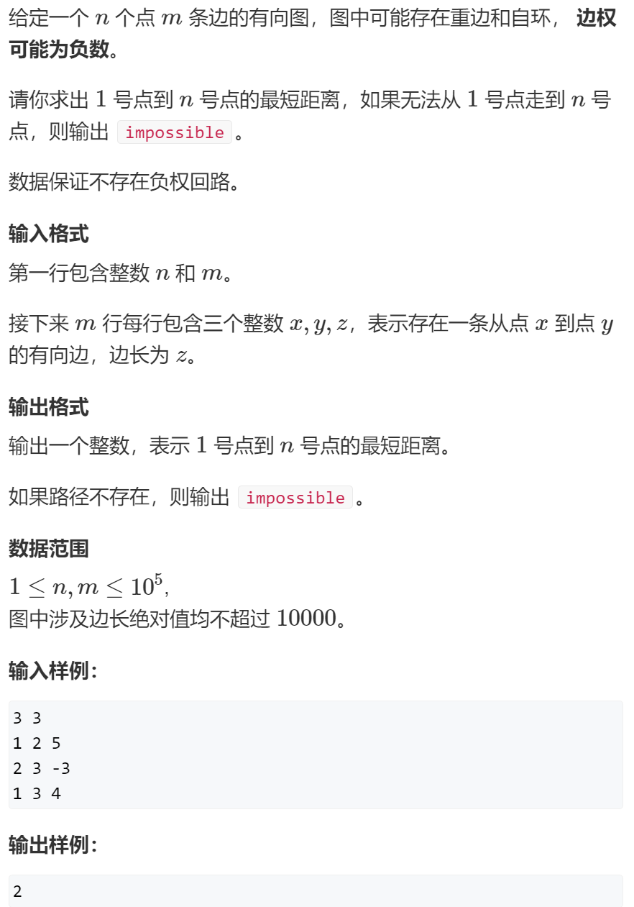

```c++
#include<iostream>
#include<queue>
#include<cstring>
using namespace std;

const int N = 100010;
int n , m;
int h[N],e[N],ne[N], w[N] ,idx ;
int dist[N];
bool st[N]; // 是判断 该点是否在队列中

void add(int a, int b,int c)
{
    e[idx] = b , w[idx] = c,ne[idx] = h[a],h[a] = idx++;
}

int spfa()
{
    memset(dist , 0x3f , sizeof dist);
    memset(st , 0 , sizeof st); // 初始所有点都不在队列中
    dist[1] = 0;
    
    queue<int> q;
    q.push(1);
    st[1] = true;
    
    while(q.size())
    {
        int t = q.front();
        q.pop();
        st[t] = false;  //  取出后记得 恢复判重数组。
        
        for(int i = h[t] ; i != -1 ; i = ne[i])
        {
            int j = e[i];
            if(dist[j] > dist[t] + w[i])
            {
                dist[j] = dist[t] + w[i];
                if(!st[j])
                {
                    q.push(j);
                    st[j] = true;
                }
            }
        }
        
    }
    
    return dist[n];  
}

int main()
{
    cin >> n >> m;
    
    memset(h, -1, sizeof h);
    
    while (m -- ){
        int a, b ,c;
        scanf("%d%d%d",&a,&b,&c);
        add(a,b,c);
    }
    
    int t = spfa();
    
    if(t == 0x3f3f3f3f) puts("impossible");
    else printf("%d",t);
    
    return 0;
}
```

#### spfa 算法求负环

```
求负环的时候需要 开一个记录每个边 从起点到这条边的路线数。
    int cnt[N];
当 cnt[t] >= n 的时候，由抽屉原理 ， cnt[t] = n 的时说明  1 - t 至少经过 n 条边，
    那么 1 - t 之间就会有 n + 1 个点；
    这就说明一定 有两个点的值是相同的，也就说明了存在负环。
    
    在 dist[j] = dist[t] + w[i]; 更新之后
       cnt[j] = cnt[t] + 1;
    
    

注意： 这里我们求负环的时候，这个 负环有可能不在 1 号点所在的最短路中，
    所以我们需要将所有点都加到队列中去。
    
```

##### 852:spfa 判断负环

https://www.acwing.com/problem/content/854/

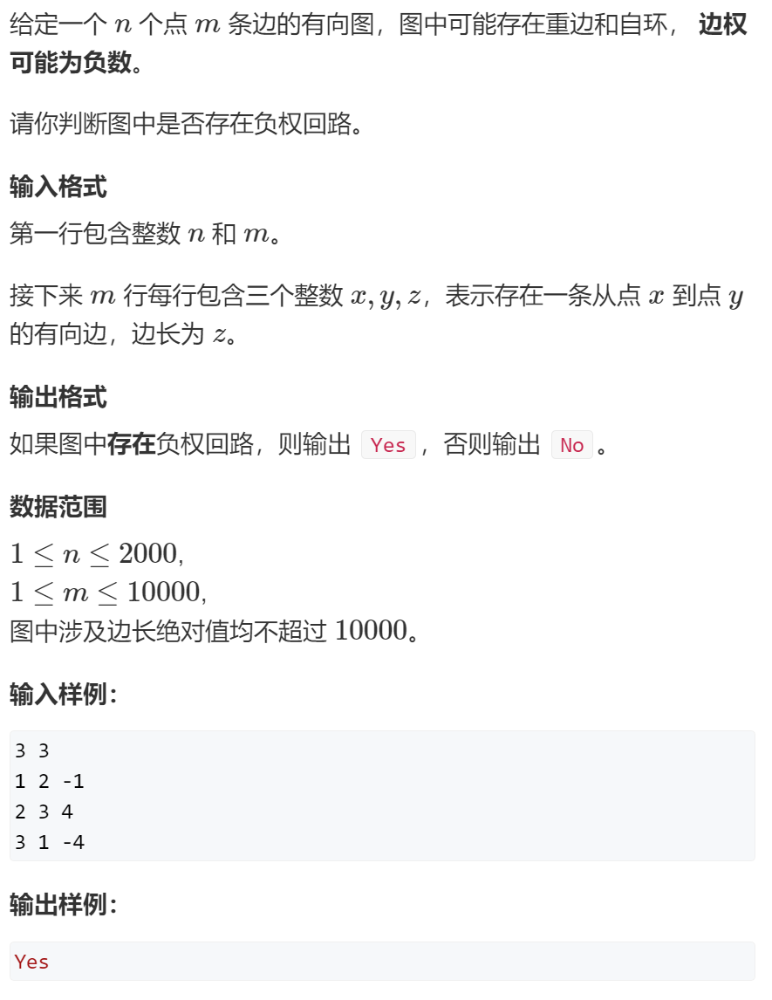

```c++
#include<iostream>
#include<queue>
#include<cstring>
using namespace std;

const int N = 100010;
int n , m;
int h[N],e[N],ne[N], w[N] ,idx ;
int dist[N], cnt[N];
bool st[N];

void add(int a, int b,int c)
{
    e[idx] = b , w[idx] = c,ne[idx] = h[a],h[a] = idx++;
}

bool spfa()
{  
    queue<int> q;
    
    for(int i = 1 ; i <= n ; i++)
    {
        st[i] = true;
        q.push(i);
    }
    
    while(q.size())
    {
        int t = q.front();
        q.pop();
        
        st[t] = false;
        
        for(int i = h[t] ; i != -1 ; i = ne[i])
        {
            int j = e[i];
            if(dist[j] > dist[t] + w[i])
            {
                dist[j] = dist[t] + w[i];
                cnt[j] = cnt[t] + 1;
                if(cnt[j] >= n) return true;
                if(!st[j])
                {
                    q.push(j);
                    st[j] = true;
                }
            }
        }
        
    }
    
    return false;  
}

int main()
{
    cin >> n >> m;
    
    memset(h, -1, sizeof h);
    
    while (m -- ){
        int a, b ,c;
        scanf("%d%d%d",&a,&b,&c);
        add(a,b,c);
    }

    if(spfa()) puts("Yes");
    else puts("No");
    
    return 0;
}
```

### Floyd 算法

```
用 Floyed 来求 多源汇最短路

void floyd()
{
    for(int k = 1 ; k <= n ; k++)
        for(int i = 1 ; i <= n ; i++)
            for(int j = 1 ; j <= n ; j++)
                d[i][j] = min(d[i][j],d[i][k] + d[k][j]);
    
}

Floyd本质上是一个动态规划的思想，每一次循环更新经过前k个节点，i到j的最短路径。

不需要特意存图，因为dist数组本身就可以从邻接矩阵拓展而来。
初始化的时候，我们把每个点到自己的距离设为0，
每新增一条边，就把从这条边的起点到终点的距离设为此边的边权（类似于邻接矩阵）。其他距离初始
化为INF（一个超过边权数据范围的大整数，注意防止溢出）····

```

#### 854:Floyd 算法

```
floyd 本身是个动态规划算法，在代码实现的时候省去了一维状态。
原状态是：f[i, j, k]表示从i走到j的路径上除了 i, j 以外不包含点k的所有路径的最短距离。

那么f[i, j, k] = min(f[i, j, k - 1), f[i, k, k - 1] + f[k, j, k - 1]。

因此在计算第 k 层的f[i, j]的时候必须先将第 k - 1 层的所有状态计算出来，
所以需要把k放在最外层。

```

```
这里直接 计算了最小值。
传递闭包问题中的  当 i 可达 k , 并且 k 可达 j 的情况下 再更新 d[i][j];
就可以 最终直接判断 d[i][j] 是否等于 INF 来判断 可达，即有无最小值。
```

https://www.acwing.com/problem/content/856/


```c++
#include<iostream>
using namespace std;
const int INF = 0x3f3f3f3f;
const int N = 210;

int n, m ,Q;

int d[N][N]; //  floyd() 之后的就是 a ,b 之间的最短距离

void floyd()
{
    for(int k = 1 ; k <= n ; k++)
        for(int i = 1 ; i <= n ; i++)
            for(int j = 1 ; j <= n ; j++)
                d[i][j] = min(d[i][j],d[i][k] + d[k][j]);
    
}

int main()
{
    scanf("%d%d%d", &n, &m,&Q);
    
    for(int i = 1 ; i <= n ; i++)
        for(int j = 1 ; j <= n ; j++)
            if(i == j) d[i][j] = 0;
            else d[i][j] = INF;
            
            
    while (m -- )
    {
        int a, b, c;
        scanf("%d%d%d",&a,&b,&c);
        
        d[a][b] = min(d[a][b], c);
    }
    
    floyd();
    
    while(Q--)
    {
        int a, b;
        scanf("%d%d", &a, &b);
        if(d[a][b] > INF / 2) puts("impossible"); //  可能存出负权边
        else printf("%d\n",d[a][b]);
    }
    
    
    return 0;
}
```


