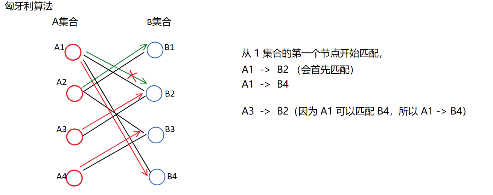

[TOC]

## 最小生成树，二分图


​	给定一张边带权的无向图 $G = (V,E)$，$n = |V|，m = |E|$。由 $V$ 中全部 $n$ 个顶点和 $E$ 中 $n - 1$ 条边构成的**无向连通子图**被称为 $G$ 的一棵生成树。边的权值之和最小的生成树被称为无向图 $G$ 的最小生成树（Minimum Spanning Tree,MST）。
**定理**
​			**任意一棵最小生成树一定包含无向图中权值最小的边。**
证明：
​	反证法。假设无向图 $G = (V,E)$ 存在一棵最小生成树不包含权值最小的边。设$e = (x,y,z)$ 是无向图中权值最小的边。把 $e$ 添加到树中，$e$会和树上从 $x$ 到 $y$ 的路径一起构成一个环，并且环上其他边的权值都比 $z$ 大。因此，用 $e$ 代替环上的其他任意一条边，会形成一棵权值和更小的生成树，与假设矛盾。故假设不成立，原命题成立。
​	证毕。

**推论**

给定一张无向图 $G=(V,E)$  ,  $n = |V| , m = |E|$。 从  $E$  中选出 $k < n-1$ 条边构成 $G$ 的一个生成森林。若再从剩余的  $m - k$  条边中选  $n-1-k$  条添加到生成森林中，使其成为 $G$  的生成树，并且选出边的权值之和最小，**则该生成树一定包含这  $m-k$  条边中连接生成森林的两个不连通节点的权值最小的边。**

### 朴素Prim 算法  

时间复杂度 $O(n^2)$ ，适用于**稠密图**。

​		Prim 算法同样基于上述推论，但思路略有改变。Prim 算法**总是维护最小生成树的部分**。最初，Prim算法仅确定 $1$ 号节点属于最小生成树。

​		在任意时刻，设**已经确定**属于最小生成树的节点集合为 $T$，**剩余节点**集合为 $S$。Prim 算法找到          $min_{x∈S,y∈T}(z)$，  即两个端点分别属于集合 $S,T$ 的权值**最小的边**，然后把点 $x$ 从集合 $S$ 中删除，加入到集合 $T$，并把 $z$ 累加到答案中。

​		具体来说，可以维护数组 $d$：若 $x∈S$，则 $d[x]$ 表示节点 $x$ 与集合 $T$ 中的节点之间权值最小的边的权值。若 $x∈T$，则 $d[x]$ 就等于 $x$ 被加入 $T$ 时选出的最小边的权值。

​		可以类比 Dijkstra 算法，用一个数组标记节点是否属于 $T$。每次从未标记的节点中选出 $d$ 值最小的，把它标记（新加入 $T$），同时扫描所有出边，更新另一个端点的 $d$ 值。最后，最小生成树的权值总和就是$\sum_{x=2}^{n}d[x]$  。

​		Prim算法的时间复杂度为$O(n^2)$，可以用二叉堆优化到 $O(mlogn)$。但用二叉堆优化不如直接使用 Kruskal 算法更加方便。因此，**Prim 主要用于稠密图**，尤其是**完全图**的最小生成树的求解。

```c++
int g[3010][3010]; // 存储图
int d[3010]; // 某点到部分最小生成树的最短bi'a
int n, m , ans = 0;
bool v[3010];

void prim()
{
    memset(d , 0x3f , sizeof d);
    memset(v , 0 , sizeof v);
    d[1] = 0; //  将 1 号点计入集合中
    
    for(int i = 1 ; i < n ; i++)
    {
        int x = 0;
        // 在剩余节点 S 中遍历寻找节点
        for(int j = 0 ; j <= n ; j++)
        	if(!v[j] && (x == 0 || d[j] < d[x]))
                x = j;
        // 该点已加入最小生成树集合 T
        v[x] = 1;
        // 用该点更新其他点到集合 T 的距离
        for(int y = 1 ; y <= n ; y++)
  			if(!v[y]) d[y] = min(d[y] , g[x][y]);
    }
}

int main()
{
    cin >> n >> m;
    memset(g , 0x3f , sizeof g);
    for(int i = 1 ; i <= n ; i++) g[i][i] = 0;
    
    for(int i = 1 ; i <= m ; i++)
    {
        int x, y, z;
        scanf("%d%d%d", &x,&y,&z);
        g[x][y] = g[y][x] = min(z, g[x][y]);
    }
    
    prim();
    for(int i = 2 ; i <= n ; i++) ans += d[i];
    cout << ans << endl;
}

```

```
最小生成树的图都是 无向图，并且边的正负没有影响，（即环没有影响）

1：初始化距离：
    dist[i] = +∞;
2:	for(i = 0 ; i < n ; i++)
    	t  <-  找到集合外距离最近 的点 
    	用 t 来更新其他点 集合 的距离         集合：已经 在连通块中的所有点
    	st[t] = true;  // 把 t 加到集合中去

Dijstra 算法中一开始就选中一点，所以需要迭代 n-1 次；
Prim 中初始化是不选点，所以需要迭代 n 个点     
```


#### 858:Prim 求最小生成树

https://www.acwing.com/problem/content/860/

```c++
// acw 858
#include<cstring>
#include<iostream>
#include<algorithm>
using namespace std;

// 注意这里的 无穷大 ,0x3f 在 memset 字节的初始化方式下会变成 0x3f3f3f3f
const int N = 510,INF = 0x3f3f3f3f; 

int n,m;
int g[N][N]; // 稠密图，使用邻接矩阵
int dist[N]; // 点到集合的距离
bool st[N];  // 点进入集合的标志

int prim(){
    memset(dist,0x3f,sizeof dist); //1: 初始化所有点的距离
    
    // 最小生成树的线路长度
    int res = 0;
    dist[1] = 0; // 任选一点加入集合
    
    for(int i = 1 ; i <= n ; i++){
        
        int t = -1; // 集合外的点 
        
        // 用 t 来更新其他点到集合的距离
        for(int j = 1 ; j <= n ; j++)
            
    // t未被标记&&(t不在集合当中 || 用t更新点到集合的距离大于原来点到集合的距离)
            if(!st[j] && (t == -1 || dist[t] > dist[j]))
                t = j; 
                
                
        if(i > 1 && dist[t] == INF) return INF;  // 出现 正无穷，没有最小生成树
        if(i > 1) res += dist[t]; // 加入集合的路径（即最小生成树的路径）  先累加
        st[t] = true; // 标志进入集合
        
    // 再更新（防止有闭环带来影响（闭环中有负环就是 g[t][j]为负会影响 累加操作所以要先累加））
        for(int j = 1;j <= n;j++) dist[j] = min(dist[j],g[t][j]);
    
        
    }
    
    return res;
}

int main(){
   scanf("%d%d",&n,&m);
    
   memset(g,0x3f,sizeof g); // 初始化邻接矩阵
   // 输入邻接矩阵
   while(m--){
       int a,b,c;
       scanf("%d%d%d",&a,&b,&c);
       g[a][b] = g[b][a] = min(g[a][b],c);  // 无向图的初始化，且将 a b 点之间的距离取 小
      
   }
   int t = prim();
   
   if(t==INF) puts("impossible");
   else printf("%d\n",t);        
   
   return 0;
}

```

### 堆优化版的 Prim 算法


### Kruskal 算法

**推论**

给定一张无向图 $G=(V,E)$  ,  $n = |V| , m = |E|$。 从  $E$  中选出 $k < n-1$ 条边构成 $G$ 的一个生成森林。若再从剩余的  $m - k$  条边中选  $n-1-k$  条添加到生成森林中，使其成为 $G$  的生成树，并且选出边的权值之和最小，**则该生成树一定包含这  $m-k$  条边中连接生成森林的两个不连通节点的权值最小的边。**

Kruskal算法就是基于上述推论的。Kruskal算法总是维护无向图的最小生成森林。最初，可认为生成森林由零条边构成，每个节点各自构成一棵仅包含一个点的树。在任意时刻，Kruskal算法从剩余的边中选出一条权值最小的，并且这条边的两个端点属于生成森林中两棵不同的树（不连通），把该边加入生成森林。图中节点的连通情况可以用**并查集**维护。

Krusakl 算法的流程：  时间复杂度 $O(mlogm)$ ， 主要应用 **稀疏图**

1. 建立并查集，每个点各自构成一个集合。
2. 把所有的边按照权值从小到大排序，依次扫描每条边 $(x, y,z)$.
3. 若 $x,y$ 属于同一集合（连通），则忽略这条边，继续扫描下一条。
4. 否则，合并 $x,y$ 所在的集合，并把 $z$ 累加到答案中。
5. 所有边扫描完之后，第 $4$ 的处理过的边即构成最小生成数。

```c++
//  Kruskal 算法
struct Edge{       // 节点
    int x, y, w;
    bool operator <(Edge a , Edge c){ //  重载小于号
        return  a.w < b.w;
    }
}e[M];

int find(int x) //  合并集合
{
    if(x != p[x]) p[x] = find(p[x]);
    return p[x];
}

int main()
{
    cin >> n >> m;
	for(int i = 1 ; i <= m ; i++)
        scanf("%d%d%d", &e[i].x , &e[i].y , &e[i].w);
    
    // 边权排序
    sort(e + 1, e + m + 1);
    
    // 初始化并查集
    for(int i = 1 ; i <= n ; i++) p[i] = i;
    
    // 求最小生成树
    int ans = 0;
    for(int i = 1 ; i <= m ; i++)
    {
        int x = find(e[i].x);
        int y = find(e[i].y);
        if(x == y) continue;
        p[x] = y;
        ans += e[i].z;
    }
    
    //  最小生成树的权值
    cout << ans << endl;
    
    return 0;
}
```


```
稀疏图。
    
基本思路：
    1：先将所有边按照权重从小到大排序   o(mlogm)
    2：枚举每条边  a -c-> b 
    	if a,b 不连通               o(m)      并查集的一部分
            就将这条边加入集合中     
```

####  859:Kruskal 求最小生成树

https://www.acwing.com/problem/content/861/


```c++
#include<iostream>
#include<algorithm>
using namespace std;

const int N = 100010 , M = 200010;
int n,m;
int p[N];

struct Edge{
    int a,b,w;
    
    bool operator< (const Edge &W){   // 重载小于号，方便排序
        return w < W.w;
    }
}e[M];

int find(int x){
    if(p[x] != x) p[x] = find(p[x]);
    return p[x];
}

int main(){
    scanf("%d%d",&n,&m);
    
    for(int i = 0 ; i < m ; i++){
        int a,b,w;
        scanf("%d%d%d",&a,&b,&w);
        e[i] = {a,b,w};
    }
    
    sort(e,e + m); // 排序所有的边
    
    for(int i = 0 ;i <= n ; i++) p[i] = i; // 初始化并查集
    
    int res = 0,cnt = 0;
    for(int i = 0 ;i < m ; i++){ // 枚举每条边
        int a = e[i].a , b = e[i].b , w = e[i].w;
        
        a = find(a),b = find(b);
        if(a != b){    // 如果两条边不连通，就把这条边加到集合中去
            p[a] = b;
            
            res += w;  // 最小生成树中所有边的权重之和
            cnt ++; // 存的是当前一共加了多少条边
        }
    }
    
    if(cnt < n-1) puts("impossible");
    else printf("%d\n",res);    
    
    return 0;
}                  			
```

### 染色法

```
二分图的定义：
    	可以被划分为两个集合的图，并且所有的边都在两个集合之间，集合之中没有边

使用 染色法判断是不是二分图： 一个图是 二分图 当且仅当图中不含 奇数环
由于图中含奇数环，所以染色过程中一定有矛盾    
    
直观的表示就是 每一条边的两个节点不能属于一个集合， （即染上不同的色）
 
使用 深度优先遍历 或者 广度优先遍历  染色
  
  算法步骤：
遍历所有的节点:
未被染色，送去 dfs 
   
dfs 也可以说为递归，染色中递归的关键就是使用 dfs 去染色;
dfs 步骤：
1：遍历每个节点的所有邻节点;
2：对每个邻节点判断：
    ①：未染色 
    	染色成功 -> 二分图
    	染色失败 -> 非二分图
    ②：已染色
    	邻节点的染色与节点颜色一致 -> 非二分图
    
```

#### 860:染色法判定二分图

https://www.acwing.com/problem/content/862/


```c++
// acw860
#include<cstring>
#include<iostream>
#include<algorithm>
using namespace std;

const int N = 100010,M = 200010;

int n,m;
int h[N],e[M],ne[M],idx;    // 邻接表存储图
int color[N];   

void add(int a,int b){
    e[idx] = b,ne[idx] = h[a],h[a] = idx++;
}

// u 代表当前节点，  c 是当前节点的颜色
bool dfs(int u,int c){
    color[u] = c;
    
   //遍历当前节点的所有邻点，使用的是邻接表存储 图，所以每个节点的和它的子节点会以链表的形式存储 
    for(int i = h[u]; i != -1; i = ne[i]){  
        
        int j = e[i]; // 存储当前 邻点的标号
        
        // 当前节点没有染色，就为其染色
        if(!color[j]){  
            
            // 1 , 2 代表两种颜色   !dfs(j,3-c) 表示染色不成功 ， dfs(j,3-c)就是染色
            if(!dfs(j,3 - c)) return false;    
            
        }
        else if(color[j] == c) return false;  // 当前节点已经染色，就只判断是否冲突
    }
    return true;  // 染色成功
}


int main(){
    
    memset(h , -1 , sizeof h);
    
    scanf("%d%d",&n,&m);
    while(m--){
        int a,b;
        scanf("%d%d",&a,&b);
        add(a,b),add(b,a);
    }
    
    
    // 判断每个节点是否染色
    bool flag = true;
    for(int i = 1 ; i <= n ;i++){
        if(!color[i]) {          // 未被染色  送去 dfs
            if(!dfs(i,1)){       // 如果产生矛盾，就将 i 染为 1 这个颜色
                flag = false;    // 不是 二分图
                break; 
            }
        }
    }
    

    if(flag) puts("Yes");
    else puts("No");
    
    return 0;
}
```

### 匈牙利算法

```
基本思路：（将二分图的两边集合中的每个节点进行一一匹配，然后将符合一一匹配的节点的数量全部挑选出来）
    <= o(n*m)
    
二分图的匹配：
   给定一个二分图 G，在 G 的一个子图 M 中，M 的边集 {E} 中的任意两条边都不依附于同一个顶点，则称 M 是一个匹配。

二分图的最大匹配：
    所有匹配中包含边数最多的一组匹配被称为二分图的最大匹配，其边数即为最大匹配数。
```



#### 861:二分图的最大匹配

https://www.acwing.com/problem/content/863/


```c++
// acw861
#include<iostream>
#include<cstring>
using namespace std;

const int N = 510,M = 1e5 + 10;
int n1,n2,m;
int e[M],ne[M],idx,h[N];
int match[N];  // 右半部点集 中对应 左半部点集 中的点
bool st[N]; // 判同，确保每个点不重复搜

void add(int a, int b){
    e[idx] = b,ne[idx] = h[a],h[a] = idx++;
}


bool find(int x){
    // 枚举这个 x 左半部点所有的边对应的右半部点
    for( int i = h[x] ; i != -1 ;i = ne[i]){ 
        int j = e[i];
        if(!st[j]){  // 右半部点不重复考虑
            st[j] = true;
            // 边对应的右半边点没有匹配 或者 这个右半边点已经匹配的左半点 可以有其他的选择
            if(match[j] == 0 || find(match[j])){ 
                match[j] = x;
                return true;
            }
        }
    }
    return false;
}

int main(){
    cin >> n1 >> n2 >> m;
    
    memset(h,-1,sizeof h);
    int a,b;
    while(m--){
    	scanf("%d%d",&a,&b);
        add(a,b);
    }
    
    int res = 0;
    
    for( int i = 1 ; i <= n1 ; i++){ // 右半部匹配左半部
        memset(st,false,sizeof st);
        if(find(i)) res++;
    }
    return 0;
}
```


