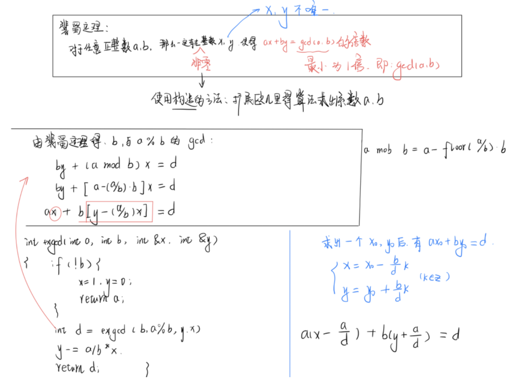

[TOC]

## 数论

#### 一些基础知识

1. 质因数（素因数，质因子）在数论当中是指能够整除给定正整数的质数。
2. 除 $1$ 之外，两个没有其他共同 质因数的 的正整数称为互质。
3. $1$ 与任何数互质。
4. 正整数的因数分解可将正整数表示为一连串的质因子相乘，质因子如重复可以用指数表示。

### 质数

**质数**：在大于 $1$ 的整数中，如果包含 $1$ 和 本身这两个约数，那么这个数就是质数（素数）

#### 质数的判定

##### 866:试除法判断质数

https://www.acwing.com/problem/content/868/

```c++
// o(n)
bool is_prime(){
    if(n < 2) return false;
    for( int i = 2; i < n ; i++){
        if(n % i == 0)   // n 可以被 2~n 的整数整除
            return false;
    return true;
}
```

**试除法**：

​		若一个正整数 $N$ 为合数，则存在一个能整除 $N$ 的数 $T$， 其中 $2≤T≤sqrt(n)$ 。

```c++
优化：  //  o(srqt(n))
优化的原理 ： d / n  ==  (n/d)/n  
             d <= (n/d)
    		d^2 <= n    
    
bool is_prime(i){
    if(n < 2) return false;
    for( int i = 2; i <= n/i  ; i++){  // sqrt() 函数比较慢，直接使用未变形的
        if( n % i == 0)   
            return false;
    return true;
}
```

#### 分解质因数

#### **算术基本定理**：

​		任何一个大于 $1$ 的自然数 $N$ , 如果  $N$  不为质数，那么 $N$ 可以唯一分解成有限个质数的乘积。
$$
N = p_1^{a_1}×p_2^{a_2}×p_3^{a_3}×...×p_n^{a_n}
$$


$$
这里p_i均为质数，其中指数a_i是正整数,且有p_1<p_2<p_3...<p_n
$$

**2：朴素筛法**

​		任意整数 $x$ 的倍数 $2x, 3x, ...$ 都不是质数。

**分解质因数做法：**

结合上述定理和筛法，以及质数判定的 “试除法”。

​		对 $2$ ~ $⌊sqrt(N)⌋$ 的每个数 $d$ ，若 $d$ 能够整除 $N$ (即 `N % d == 0`)，则从 $N$ 中除掉所有的因子 $d$ ，同时累计除去的 $d$  的个数。

特别地，若 $N$ 没有被任何 $2$ ~ $sqrt(N)$ 的数整除，则 $N$ 是质数，无需分解。


> **证明**：`N % d == 0` 成立时，$d$ 一定为质数。前提是 $d$ 要从 $2$ 开始枚举。

因为一个合数的因子一定在扫描到这个合数之前就从 $N$ 中除掉了，所以能整除 $N$ 的 $d$ 一定是质数。

eg:  $12$ 可以被 $4$ 这个合数整除掉，但是 $12$ 一定先会被 $4$ 之前的质数 $2$ 整出掉。


```
n % i == 0 成立：说明：   
n 是 i 的倍数 并且 n 当中不包含任何 2 ~ n-1的质因子。
因此 i 当中也不包含 2 ~ i-1 的质因子。所 i　必定为质数

```

```c++
//  o(sqrt(n))
int p[N]; // 质数数组
int c[N]; // 质数质数个数
int cnt;

void divide(int n){
    cnt = 0;
    for(int i = 2;i <= n/i ;i++){
        if( n % i == 0){   // true --> i为质数 
            p[++cnt] = i;
         	c[cnt] = 0;
        	while(n % i == 0){
                n /= i;
                c[cnt]++;
            }
        }
    }
    if( n > 1) // n 是质数 
        p[++cnt] = n , c[cnt] = 1;
    
    for(int i = 1 ; i <= cnt ; i++)
        cout << p[i] << " " << c[i] << endl;
    
}
```

##### 867:分解质因数

https://www.acwing.com/problem/content/869/

```c++
#include <iostream>
#include <cstring>
#include <algorithm>
using namespace std;
const int N = 105;
int n;
int p[N], c[N];
int cnt;

void divide(int x) {
    cnt = 0;
    for(int i = 2 ; i <= x / i ; i++) {
        if(x % i == 0) {
            p[++cnt] = i;
            c[cnt] = 0;
            while(x % i == 0) x /= i, c[cnt]++;
        }
    }
    if(x > 1)
        p[++cnt] = x, c[cnt] = 1;
        
    for(int i = 1 ; i <= cnt ; i++)
        cout << p[i] << " " << c[i] << endl;
}

int main(){
    cin >> n;
    int x = 0;
    while (n -- ){
        cin >> x;
        divide(x);
        cout << endl;
    }
    return 0;
}
```

#### 筛质数

##### 朴素筛质数

任意整数 $x$ 的倍数 $2x, 3x, ...$ 都不是质数。

每得到一个数，就将其所有的**倍数** 判掉。判掉的数中会有很多重复判掉的数，所以时间复杂度很高。

```c++
const int N = 1000010;
// v[i]记录 i 是否被筛过，即 v[i] = true 时证明 i 是合数，反之为合数
bool v[N];  
int primes[N],cnt;    // 质数数组 和 质数数量

void get_prime(int n){
    memset(v, 0, sizeof v); 
    for(int i = 2;i <= n;i++){
    	if(!v[i]){
            primes[cnt++] = i;
        }   
        for(int j = i + i ; j <= n ; j += i) v[j] = true;
    }
}
```

##### 埃氏筛法

一个**质数**的所有倍数都不是质数。

```
每得到一个质数，就将其所有的倍数 判掉。
··
因为不需要判掉 所有的数的倍数，所以会降低时间复杂度，但是质数的倍数仍有很多重复。
```

```c++
// o(nloglogn)   只删掉 2 ~ p-1 的质数的倍数 （优化原理就是算术基本定理）

const int N = 1000010;
// v[i]记录 i 是否被筛过，即 v[i] = true 时证明 i 是合数，反之为合数
bool v[N];           
int primes[N],cnt;    // 质数数组 和 质数数量

void get_prime(int n){
    memset(v, 0, sizeof v); 
    for(int i = 2 ; i <= n ; i++){
    	if(!v[i]){
            primes[cnt++] = i;
            for(int j = i + i;j <= n;j += i) v[j] = true;
        }
    }
}
```

##### 线性筛法

对于埃氏筛法来说，质数的倍数人会有重复，eg: $12$ 会被 $2$ 和 $3$ 都标记一次。

那么如何才能确定唯一产生某个数的方式呢？

**线性筛法做法**

​		通过 **“从大到小累计质因子”**的方式标记每个合数，eg: $12$ 只有 $3 × 2 × 2$ 一种产生方式。设数组  $V$ 记录每个数的**最小质因子**，按照下面步骤维护数组 $V$ .

1. 依次考虑 $2$ ~ $N$ 之间的每一个数 $i$ 。
2. 若 $V[i] = i$ ，说明 $i$ 是质数，把它保存下来。
3. 扫描**不大于** $V[i]$ 的每个质数  $p$ ，令 $V[i×p]=p$ 。也就是在   $i$  的基础上累积一个质因子 $p$ ，因为 $p≤V[i]$ ，所以 $p$ 就是合数 $i×p$ 的最小质因子。


每一个合数 $i×p$ 只会被它的最小质因子  $p$  筛一次，时间复杂度为 $O(N)$ 

```c++
int v[N];     // 记录每个质数的最小质因子
int prime[N]; // 记录质数

void get_primes(int n) {
    memset(0, v, sizeof v);  // 最小质因子
    m = 0; // 质数数量
    for(int i = 2 ; i <= n ; i++) {
        if(v[i] == 0){
            v[i] = i;
            prime[++m] = i; // i 为质数
        }
        // 给当前的数 i 乘上一个质因子
        for(int j = 1 ; j <= m ; j++) {
            // i 有比 prime[j] 更小的质因子，或者超出 n 的范围，停止循环
            if(prime[j] > v[i] || prime[j] > n / i) break;
            // prime[j] 是合数 i * prime[j] 的最小质因子
            v[i * prime[j]] = prime[j];
        }
    }
}
```


埃氏筛法中数会被 **质数 多次筛掉**，但其实我们**只需要被最小质因子筛掉**就可以，没有必要重复筛.

线性筛法的效率在数据量很大的情况  比埃氏筛法的效率高

```
1:    i % primes[j] == 0  -->  
priems[j]一定是 i 的最小质因子，primes[j] 一定是 primes[j] * i 的最小质因子

2：   i % primes[j] != 0 --> 
primes[j]一定小于 i 的所有质因子，primes[j]也一定是primes[j] * i 的最小质因子

```

```c++
const int N = 10000010;
// 判断当前数有没有被筛过, 被筛过就证明其是某个数的倍数，那么其就是合数
// 所以 st[i] = true 时证明其是 合数， st[i] = false 时证明其是 质数
bool st[N];           
int primes[N],cnt;    // 质数数组 和 质数数量

void get_prime(int n){
    for(int i = 2;i <= n;i++){
        // 当前数未被筛过，为质数。
    	if(!st[i]) primes[cnt++] = i;  
		
        // 从小到大 枚举所有的质数
        for(int j = 0 ; primes[j] * i <= n ; j++){ 
//primes[j] 的乘积一定是合数，并且primes[i] 是从小到大枚举的，所以一定是用最小质因子筛掉的。
            st[primes[j] * i] = true;
            // primes[j] 的最小质因子是 i (因为我们是从小到大遍历的)
            if(i % primes[j] == 0) break;  
        }
    }
}
```

```c++
const int N = 1000010;
int v[N];
int prime[N];
int cnt;
int min_p[N]; // 存每个数的最小质因子

void get_primes(int n) {
    for(int i = 2 ; i <= n ; i++) {
        if(!v[i]) min_p[i] = i, prime[cnt++] = i;
        for(int j = 0 ; prime[j] * i <= n ; j++) {
            v[prime[j] * i] = 1;
            min_p[prime[j] * i] =
            if(i % prime[j] == 0) break;
        }
    }
}
```

##### 868:筛质数

https://www.acwing.com/problem/content/870/

```c++
#include<bits/stdc++.h>
using namespace std;
const int N = 1000010;
int n;
int prime[N];
int v[N];
int cnt;

void get_primes(int n){
    for(int i = 2 ; i <= n ; i++){
        if(!v[i]) prime[cnt++] = i;
        
        for(int j = 0 ; prime[j] * i <= n ; j++) {
            v[prime[j] * i] = 1;
            if(i % prime[j] == 0) break;
        }
    }
}

int main(){
    cin >> n;
    get_primes(n);
    
    cout << cnt;
    return 0;
}
```

### 约数

#### 试除法求约数

​		若 $d$ 是 $N$ 的约数（$d≥sqrt(N)$），则 $N/d$ 也是 $N$ 的约数（$N/d≤N$）。即约数总是成对出现的（除了完全平方数，$sqrt(N)$ 会单独出现）。

​		因此，只需扫描 $d = 1$~$sqrt(N)$ ，尝试 $d$ 能否整除 $N$ ，若能整除，则 $N/d$ 也是 $N$ 的约数，时间复杂度： $O(sqrt(N))$ 。

##### 869:试除法求约数

https://www.acwing.com/problem/content/871/

```C++
//  int 范围内一个数约数的最多大概在 1500 ~ 1600

vector<int> get_divisors(int n){
    vector<int> res;
    
    for(int i = 1 ; i <= n/i ; i++){
        if(n % i == 0){
            res.push_back(i);
            // 避免 i == n/i, 重复放入 （此时 n 是完全平方数）
            if( i != n/i) res.push_back(n /i);   // 边界判断，避免重复输出
        }
    }
    sort(res.begin(),res.end());
    return res;
}
```

#### 约数个数 和 约数之和

#### **算术基本定理的推论**

​		在算术基本定理中，若整数 $N$ 被唯一分解为 $N=p_1^{c_1}×p_2^{c_2}...p_m^{c_m}$ ，其中 $c_i$ 都是正整数， $p_i$ 都是质数，且满足 $p_1<p_2<...<p_m$ ，则 $N$ 的正约数集合可写作：
$$
\{p_1^{b_1}×p_2^{b_2}×...×p_m^{b_m}\}, 其中 0≤b_i≤c_i
$$

1. $N$ 个**正约数个数**为:

$$
\prod\limits_{i=1}^{m}(c_i+1)=(c_1+1)×(c_2+1)×...×(c_m+1)
$$

证明：

​		 $b_1 ... b_m$ 不同取法就对应着 不同的约数。取法的个数就是 约数的个数。   $b_1$ 有  $0$ ~ $c_1$ 这些选择，共有 $c_1 + 1$ 中选法。由乘法原理就可以得出约数的个数。


2. $N$ 的**所有正约数的和**为：

$$
\prod\limits_{i=1}^{m} \Bigg(\sum_{j=0}^{c_i}(p_i)^j\Bigg) =(1+p_1+p_1^2+...p_1^{c_1})×...×(1+p_m+p_m^2+...+p_m^{c_m})
$$

##### 870:约数个数

https://www.acwing.com/problem/content/872/

算术基本定理的推论：**约数个数** 有：
$$
(a_1 + 1)×(a_2 + 1)×(a_3 + 1)×...×(a_n + 1) 个
$$

```
将相同的质数 以底数和指数的形式存储，
我们使用哈希表来存储，  pi^ai --> map[pi] = ai;  这样就把这些底数和指数存起来了
然后最终所有的约数个数就是 (a1 + 1)(a2 + 1)(a3 + 1)... (an + 1) 个
```

```c++
#include<bits/stdc++.h>
using namespace std;
typedef long long LL;
const int mod = 1e9 + 7;

int main(){
    int n;
    cin >> n;
    
    unordered_map<int,int> primes; // 每个质因数的指数
    while(n--){
        int x;
        cin >> x;
        
        for(int i = 2 ; i <= x / i ; i++){
            while(x % i == 0){
                x /= i;
                primes[i]++;
            }
            
        }
        if(x > 1) primes[x]++;
    }
    
    LL res = 1;
    
    for(auto prime : primes) res = res * (prime.second + 1) % mod;
    
    cout << res << endl;
    
    return 0;
}
```

##### 870:约数之和

 https://www.acwing.com/problem/content/873/
$$
N = p_1^{a_1}×p_2^{a_2}× ...×p_n^{a_n}
$$

$$
约数之和：(p_1^0 + p_1^1 + ... +p_1^{a_1})...(p_n^0 + p_n^1 + .., +p_n^{a_n})
$$

$$
可以展开为  约数个数  个乘积项 : (a_1 + 1)(a_2 + 1)(a_3 + 1)... (a_n + 1) 个
$$

$$
并且每个约数项都不同，第一项  p_1^{b_1}...p_k^{b_k}
$$

```c++
#include<bits/stdc++.h>
using namespace std;
typedef long long LL;
const int mod = 1e9 + 7;

int main(){
    int n;
    cin >> n;
    
    unordered_map<int,int> primes;
    while(n--){
        int x;
        cin >> x;
        
        for(int i = 2 ; i <= x / i ; i++){
            while(x % i == 0){
                x /= i;
                primes[i]++;
            }
            
        }
        if(x > 1) primes[x]++;
    }
    
    LL res = 1;
    
    for(auto prime : primes)
    {
        int p = prime.first , a = prime.second;
        
        LL t = 1; 
        // 秦九韶算法
        while(a--) t = (t * p + 1) % mod;  
        res = res * t % mod;
            
    }
    
    cout << res << endl;
    
    return 0;
}
//  t = 1           , t * p + 1 = p + 1
//  t = p + 1       , t * p + 1 = p^2 + p + 1
//  t = p^2 + p + 1 , t * p + 1 = p^3 + p^2 + + p + 1
```

#### 最大公约数

**定理：** 
$$
\forall a, b ∈ N, gcd(a, b) × lcm(a, b) = a × b
$$
证明：设 $d=gcd(a,b), a_0=a/d,b_0=b/d$。根据最大公约数的定义，有 $gcd(a_0, b_0)=1$   ，再根据最小公倍数的定义，有 $lcm(a_0×d,b_0×d)=lcm(a_0,b_0)×d=a_0×b_0×d=a×b/d$ 。

#### 最小公倍数

$$
lcm(a, b) = a × b / gcd(a, b)
$$

#### 欧几里得算法 —— 求最大公约数

#### 九章算术——更相减损术
$$
\forall a, b ∈ N,a≥b, 有 gcd(a,b) = gcd(b, a-b)=gcd(a, a-b)
$$

$$
\forall a, b ∈N,有 gcd(2a,2b)=2gcd(a,b)
$$

时间复杂度 $O(N)$ 。

```c++
// 更相减损术求 gcd
int gcd(int a, int b) {
    while(a != b) {
        if(a > b) a -= b;
        else b -= a;
    }
    return a;
}
```

> **定理**：对于任意的整数 $a, b$ ，如果 $d/a$ 成立，且 $d/b$ 成立，那么就有   $d / (ax + by)$ 的成立   ①

**欧几里得算法**
$$
\forall a, b≠0, gcd(a, b) = gcd(b, a\mod b)
$$
证明：

​		若 $a<b$ ，则 $gcd(b, a \mod b)=gcd(b,a)=gcd(a,b)$ 。

​		若 $a≥b$ ，有 $a \mod b=a-(a/b)×b$ ，设 $a/b=q$ ，那么 $a \mod b = a - q×b$ 。定理 ① 可得             $gcd(a, b) = gcd(b, a \mod b)$ 。（注意这里的 $a/b$ 是 $b$ 整除 $a$）

时间复杂度 $O(log(a + b))$ .

```c++
int gcd(int a,int b){
    return b ? gcd(b , a % b) : a;
}
// 判断 b == 0 是否成立，不成立就继续。成立则返回 a
//  原理就是  gcd(a,b) = gcd(b, a mod b) 
```

### 互质与欧拉函数

**互质**

定义
$$
\forall a, b∈N,若gcd(a, b) = 1,则称 a,b 互质
$$
​		对于三个数或更多个数的情况，我们把 $gcd(a,b,c)= 1$ 的情况称为 $a,b,c$ 互质。把 $gcd(a,b)= gcd(a,c)= gcd(b,c)=1$ 称为 $a,b,c$ **两两互质**。后者显然是一个更强的条件。

**欧拉函数**

$1$ ~ $N$ 中与 $N$ **互质的数的个数**被称为欧拉函数。记为 $\varphi(N)$ 。

在算术基本定理中：
$$
\varphi(N) = N(\frac {p_1-1}{p_1}×\frac {p_2-1}{p_2}...\frac{p_m-1}{p_m})=N×\prod\limits_{质数p|N} \big( 1-\frac{1}{p} \big)
$$

```
eg : N = 6 = 2 x 3
          f(6) = 6x(1 - 1/2)(1 - 1/3) = 2
```

证明：

​		设 $p$ 是 $N$ 的质因子， $[1,N]$ 中 $p$ 的倍数有 $p,2p,3p,...,(N/p)×p$ ，共 $N/p$ 个。同理，若 $q$ 也是 $N$ 的质因子，则 $[1,N]$ 中 $q$ 的倍数有 $N/q$ 个，如果我们把这 $N/p+N/q$ 个数去掉，那么 $p×q$ 的倍数就被排除了两次，需要再加回来一次，因此，$[1,N]$ 中不与 $N$ 含有共同质因子 $p$ 或 $q$ 的个数为：
$$
N-\frac{N}{p}-\frac{N}{q}-\frac{N}{pq}= N×\big(1-\frac{1}{p}-\frac{1}{q}+\frac{1}{pq}\big) = N \big( 1-\frac{1}{p}\big)\big( 1-\frac{1}{q}\big)
$$
证毕。

那么要求解欧拉函数就需要先分解质因数，当 `n % i ==0` 时, `i` 就为质数，由于 $1-\frac{1}{p}$ 可能出现浮点数错误，所以要对其进行转换，
$$
\frac{ans}{1-\frac{1}{i}} = \frac{ans}{\frac{i-1}{i}} = (ans/i)×(i-1)
$$

```c++
// 求解欧拉函数
int ola(int n) {
	int ans = n;
	for(int i = 2 ; i <= n / i ; i++) {
		if(n % i == 0) {
			ans = ans / i * (i - 1);  // ans / (1 - 1 / i)
			while(n % i == 0) n /= i;
		} 
	}
	if(n > 1) ans = ans / n * (n - 1);
	return ans;
}
```


##### 873:欧拉函数

https://www.acwing.com/problem/content/875/

```c++
#include<bits/stdc++.h>
using namespace std;

int ola(int n) {
    int ans = n;
    for(int i = 2 ; i <= n / i ; i++) {
        if(n % i == 0) {
            ans = ans / i * (i - 1);
            while(n % i == 0) n /= i;
        }
    }
    if(n > 1) ans = ans / n * (n - 1);
    return ans;
}
int main(){
    int T;
    cin >> T;
    int n;
    while(T--) {
        cin >> n;
        int oa = ola(n);
        cout << oa << endl;
    }
    
    return 0;
}
```

#### 欧拉函数的性质

1.  $\forall n > 1,1$ ~ $n$ 中与 $n$ 互质的数的和为 $n×\varphi(n)/2$ 
2.  若 $a, b$ 互质，则 $\varphi(ab) = \varphi(a)\varphi(b)$ 

证明 1：

​		因为 $gcd(n, x)=gcd(n,n-x)$ ，所以与 $n$ 不互质的数 $x,n-x$ 成对出现，平均值为 $n/2$ 。因此，与 $n$ 互质的数的平均值也是 $n/2$ 。

证明 2：

​		根据欧拉函数的计算式，对 $a,b$ 进行分解质因数，直接可得性质 2。

  将性质 2 推广到一般的函数上，可以得到 “积性函数”。

**积性函数**

如果当 $a, b$ 互质时，有 $f(a,b)=f(a)×f(b)$ ，那么称函数 $f$ 为积性函数。

3. 若 $f$ 是积性函数，且在算术基本定理中 $n = \prod\limits_{i=1}^mp_i^{c_i}$ ，则 $f(n) = \prod\limits_{i=1}^mf(p_i^{c_i})$ 。
4. 设 $p$ 为质数，若 $p|n$ ，且 $p^2|n$ ，则 $\varphi(n)=\varphi(n/p)×p$ 
5. 设 $p$ 为质数，若 $p|n$ ，但 $p^2$ 不能整除 $n$ ，则 $\varphi(n)=\varphi(n/p)×(p-1)$ 
6.  $\sum_{d|n}\varphi(d) = n$ 


#### 筛法求欧拉函数

​		使用公式求解 欧拉函数时，每一次都需要分解质因数，对于少量的数时间复杂度不会太高。
但是当求  $1$ ~ $n$ 中所有数的欧拉函数时，就需要 优化。

1. 当一个数是质数时，设这个数是 $p$,那么 $1$ ~ $p-1$ 中的所有数都是互质的，所以 $p$ 的欧拉函数就是 $p-1$ ，即 $gcd(1,...,p-1)=1$
2. `i % primes[j] == 0 -->  i 是 primes[j]的一个质因子` 。设 `primes[j]` 为  $p_i$ ，  $p_j * i$ 的质因子已经在 $f(i)$ 中出现过。

$$
①:f(i) = i × (1 - \frac{1}{p_1})×(1 - \frac{1}{p_2})×...×(1 - \frac{1}{p_k})
$$

$$
②:f(i×p_j) = p_j×i× (1 - \frac{1}{p_1})×(1 - \frac{1}{p_2})×...×(1 - \frac{1}{p_k})
$$

由 ① 和 ② 可得： $f(p_j×i) = p_j×i$ 。

3. `i % primes[j] != 0 时 ` ,

$$
③:f(i×p_j) = p_j×i× (1 - \frac{1}{p_1})×(1 - \frac{1}{p_2})×...×(1 - \frac{1}{p_k})×(1-\frac{1}{p_k})
$$

由 ① ，③ 可得：
$$
f(i×p_j) = p_j×f(i) ×(1-\frac{1}{p_j}) = f(i) × (p_j - 1)
$$

```c++
// 线性筛 欧拉函数
const int N = 1000010;

int prime[N], cnt;
int phi[N];
bool v[N];
LL get_eulers(int n) {
    phi[1] = 1;
	for(int i = 2 ; i <= n ; i++) {
		if(!v[i]) {
			prime[cnt++] = i;
			phi[i] = i - 1; // i为质数时，其 phi(i) = i - 1
		}

		for(int j = 0 ; prime[j] * i <= n ; j++) {
			int t = prime[j] * i;
			v[t] = 1;
			// prime[j] 为 i 的质因子  f(pj * i) = pj * f(i)
			if(i % prime[j] == 0) {
				phi[t] = prime[j] * phi[i];
				break;
			}
			// i % prime[j] != 0
			// prime[j] 不是 i 的质因子 f(pj * i) = f(i) * (pj - 1)
			phi[t] = phi[i] * (prime[j] - 1);
		}
	}
	LL ans = 0;
	for(int i = 1 ; i <= n ; i++) ans += phi[i];
	return ans;
}
```

##### 874:筛法求欧拉函数

https://www.acwing.com/problem/content/876/

```c++
#include<bits/stdc++.h>
using namespace std;
typedef long long LL;
const int N = 1000010;

int prime[N], cnt;
int phi[N];
bool v[N];

LL get_eulers(int n) {
    phi[1] = 1;
	for(int i = 2 ; i <= n ; i++) {
		if(!v[i]) {
			prime[cnt++] = i;
			phi[i] = i - 1; // i为质数时，其 phi(i) = i - 1
		}

		for(int j = 0 ; prime[j] * i <= n ; j++) {
			int t = prime[j] * i;
			v[t] = 1;
			// prime[j] 为 i 的质因子  f(pj * i) = pj * f(i)
			if(i % prime[j] == 0) {
				phi[t] = prime[j] * phi[i];
				break;
			}
			// i % prime[j] != 0
			// prime[j] 不是 i 的质因子 f(pj * i) = f(i) * (pj - 1)
			phi[t] = phi[i] * (prime[j] - 1);
		}
	}
	LL ans = 0;
	for(int i = 1 ; i <= n ; i++) ans += phi[i];
	return ans;
}


int main(){
    int n;
	cin >> n;
	cout << get_eulers(n) << endl;
    return 0;
}
```

### 快速幂

```
解决的问题：  快速求出  a^k mod p 的结果   o(logk)
核心思路： 
    1：预处理出  a^(2^0) mod p     a^(2^1) mod p  ...  a^(2^logk) mod p  共 logk 个，
    2：再组合出  a^k = a^(2 ^ (x1) + 2 ^ (x2) + ... + 2 ^ (xt))   t最大是logk

   eg:   4^5  mod  10   --->    4^5 = 4^(101)(2进制)
       							    = 4^(2^0 + 2^2)
       								= 24   === 4 (mod 10) 
       
      4^(2^0) = 4      (mdo 10)
      4^(2^1) = 6      (mdo 10)
      4^(2^2) = 6      (mdo 10)
```


$$
解决的问题：  快速求出  a^k \  \bmod \ p 的结果  \ \ \ o(logk) \\
核心思路： \\ 1：预处理出 \\
      a^{(2^0)} \bmod  \ \ p   \\ 
      a^{(2^1)} \bmod \ p  \\  
      . \\
      . \\
      . \\
      a^{(2^{logk})} \bmod p  \\ 
      共 logk 个，\\
     
      
    2：再组合出  a^k = a^{(2 ^{(x1)} + 2 ^{(x2)} + ... + 2 ^ {(xt)})}     \ \ \ t最大是logk \\
    
    我们将 k 分解为 预处理出来的数之和(即若干个2的次幂之和),我们只需要将 k 转化为二进制数，这再转化二的次幂之和。 \\
    

   eg:   4^5  mod  10  \ ->   4^5 = 4^{(101)}(2进制)  \\
       			 = 4^{(2^0 + 2^2)}  \\
       			 = 24   \equiv  4 (\bmod 10)  \\ 
       \\
      4^{(2^0)} \equiv 4      (\bmod 10) \\
      4^{(2^1)} \equiv 6      (\bmod 10) \\
      4^{(2^2)} \equiv 6      (\bmod 10) \\
$$

#### 875:快速幂

https://www.acwing.com/problem/content/877/

```c++
#include<iostream>
#include<algorithm>

using namespace std;
typedef long long LL;

// a^k % p 的结果
int qmi(int a,int k,int p)    //  最初的 a 存的是 a^*(2^0)
{
    int res = 1;
    while(k)   //  首先转化 2 的幂次方数相加
    {
        // 判断 k 的个位是否为 1，为 1 的话就将此时对应的 a 加上
        if(k & 1) res = (LL)res * a % p;   
        
        // 将 k 的最后一位删除，确保下次检测的最后一位
        k >>= 1;
        
        //将 a 递增，第一次由 a^(2^0) --> a^(2^1)实际运算就是 将原来的数平方再取余
        a = (LL)a * a % p;
    }
    return res;
}
int main(){
    int n;
    scanf("%d",&n);
    while(n--)
    {
        int a,k,p;
        scanf("%d%d%d",&a,&k,&p);
        
        printf("%d\n",qmi(a,k,p));
    }
    
    return 0;
}
```

#### 同余

定义：若整数 $a$ 和整数 $b$ 除以正整数 $m$ 的**余数相等**，则称 $a,b$ 模 $m$同余，记为$a ≡ b (\mod m)$。

**同余系与剩余系**

​		对于 $\forall a∈[0,m-1]$ ，集合 $\{a+km\}(k∈Z)$ 的所有数 模 $m$ 同余，余数都是 $a$ 。该集合被称为一个模 $m$ 的**同余类**，简记 $\bar{a}$ 。

​		模 $m$ 的同余类一共有 $m$ 个，分别为 $\bar{0},\bar{1},\bar{2},…,\bar{m一1}$。它们构成 $m$ 的完全剩余系。

​		$1$~$m$ 中与 $m$ 互质的数代表的同余类共有 $\varphi(m)$ 个，它们构成 m 的**简化剩余系**。例如，模 $10$ 的简化剩余系为  $\{\bar{1},\bar{3},\bar{7},\bar{9}\}$ 。

​		简化剩余系关于模 $m$ 乘法封闭。这是因为若 $a,b(1 ≤ a,b ≤ m)$ 与 $m$ 互质，则 $a × b$ 也不可能与 $m$ 含有相同的质因子，即 $a × b$ 也与 $m$ 互质。再由余数的定义即可得到 $a × b \mod m$ 也与 $m$ 互质，即 $a × b \mod m$ 也属于 $m$ 的简化剩余系。

#### 费马小定理 （为欧拉函数的一个特殊情况）

​		若 $p$ 是质数，则对于任意整数 $a$ ($a$ 不是 $p$ 的倍数),有 $a^p≡a(\mod p)\Rightarrow a^{(p-1)} \equiv  1(\bmod p)$ 。

#### 欧拉定理

​		若正整数 $p$ 互质，则 $a^{\varphi(n)}≡1(\mod n)$ ，其中 $\varphi(n)$ 为欧拉函数。

##### 欧拉定理的推论

1. 若正整数 $a,n$ 互质，则对于任意正整数 $b$ ，有 $a^b≡a^{b\mod\varphi(n)}(\mod n)$

### 关于结果取模

​		许多计算类的题目都需要将答案对一个质数 $p$ 取模后输出，面对 $a+b,a-b,a×b$ 这样的算式，可以直接在计算前先把 $a,b$ 对 $p$ 取模。

​		面对**乘方算式**，根据欧拉函数定理的推论，可以先把底数对 $p$ 取模，指数对 $\varphi(p)$ 取模，再计算乘方。

#### 876:快速幂求逆元

https://www.acwing.com/problem/content/878/


$$
b^{m-2} = b^{-1}  就是逆元
$$

$$
欧拉定理：\\
  若 a 与 n 互质，则有   \\
  a^{f(n)} \equiv 1( \bmod n) ; \\
  (a^{f(n)} \bmod n 同余1) \\
eg :  5^{f(6)} \bmod 6 = 5^2 \bmod 6= 1 \\
欧拉定理的推论：  （当 n 是质数时）  a^{(p-1)} \equiv  1(\bmod p)  为费马定理
$$

```c++
#include<iostream>
using namespace std;
typedef long long LL;

LL qmi(int a,int k,int p)
{
    LL res = 1;
    while(k)
    {
        if(k & 1) res = res * a % p;
        k >>= 1;
        res = a * (LL)a % p;
    }
    return res;
}

int main()
{
    int n;
    cin >> n;
    
    while(n--)
    {
        int a,p;
        scanf("%d%d",&a,&p);
        
        int res = qmi(a, p - 2,p);
        
        if(a % p) printf("%lld\n",res);
        else puts("impossible");
        
    }
    
    return 0;
}
```

### 扩展欧几里得算法

#### Bezout 定理

​		对于任意整数 $a, b$ ，存在一对整数 $x, y$ ，满足 $ax+by =gcd(a, b)$ 。



```
扩展欧几里得算法就是要  求 满足  ax + by = gcd(a,b)倍数的 中的  x ,y;
```

```c++
// 扩展欧几里得算法
int exgcd(int a, int b, int &x, int &y) {
    if(b == 0) { 
        x = 1, y = 0;
        return a;
    }
    int d = exgcd(b, a % b, y,x); // x, y 系数交换位置
    y -= a / b * x;  // a的系数为 x, b 的系数为 y - (a / b) * x
    r
}
```


#### 877:扩展欧几里得算法

https://www.acwing.com/problem/content/879/

```c++
#include<iostream>
using namespace std;

int exgcd(int a, int b, int &x ,int &y)
{
    if(!b)
    {
        x = 1 , y = 0;
        return a;
    }
    int d = exgcd(b , a % b ,y ,x); //  x ,y 系数也要交换位置
    y -= a / b * x;  // a 的系数是 x , b 的系数是 y - (a / b) * x
    return d;
}

int main()
{
    int n;
    scanf("%d", &n);
    
    while (n -- )
    {
        int a, b;
        scanf("%d%d", &a, &b);
        int x,y;
        exgcd(a,b,x,y);
        
        printf("%d %d\n",x, y);
    }
    
    
    return 0;
}

```

#### 线性同余方程

##### 878:线性同余方程

https://www.acwing.com/problem/content/880/


$$
这里要求的 x ; \\
首先求出 ax + my' = d \\
两边同时乘以 \frac {b}{d},d就会变成b, x 变成 x \frac {b}{d}
$$


```c++
#include<iostream>

using namespace std;
typedef long long LL;

int exgcd(int a, int b, int &x, int &y)
{
    if(!b)
    {
        x = 1 , y = 0;
        return a;
    }
    
    int d = exgcd(b , a % b ,y ,x);
    y -= a / b * x;
    return d;
}

int main()
{
    int n;
    scanf("%d", &n);
    
    while (n -- )
    {
        int a, b, m;
        scanf("%d%d%d", &a, &b,&m);
        int x, y;
        int d = exgcd(a,m,x,y);
        
        if(b % d) puts("impossible");
        else printf("%d\n", (LL)x * (b / d) % m);
    }
    
    
    return 0;
}
```

### 中国剩余定理


$$
S:
\begin{cases}
x \equiv a_1 ( \bmod m_1)\\
x \equiv a_2 ( \bmod m_2)\\
             . \\
             . \\
             . \\
x \equiv a_n ( \bmod m_n)\\

\end{cases} 

中国剩余定理说明：假设整数 m_1,m_2, ... ,m_n 两两互质。
$$

$$
方程组 S 有解; 并且通解可以用如下方式构造得到：\\
设 M=m_1  \cdot m_2 \cdot \ ... \ \cdot m_n = \prod_{i=1}^{n}m_i是整数 m_1,m_2, ... ,m_n的乘积。 \\
设M_i = \frac {M}{m_i} \\
M_i^{-1}表示 M_i \bmod m_i的逆 \\
所以通解就是：x=a_1\cdot M_1 \cdot M_1^{-1} +a_2\cdot M_2 \cdot M_2^{-1} + ... + a_n\cdot M_n \cdot M_n^{-1} + nM \\
= nM + \sum_{i=1}^{n}a_iM_iM_i^{-1} \\
在模M 的意义下，方程组只有一个解 x = (\sum _{i=1}^{n}a_iM_iM_i^{-1}) \bmod M
$$

$$
做等价变形
\begin{cases}
x = k_1 a_1 + m_1   \ \ \ \ \ \ \ 1式 \\
x = k_2 a_2 + m_2 \ \ \ \ \ \ \ 2式\\
             . \\
             . \\
             . \\
x = k_n a_n + m_n\\

\end{cases}
$$

$$
k_1a_1 + m_1 = k_2a_2 + m_2 \\
k_1a_1 - k_2a_2 = m_2 - m_1  \ \ \ \ \ ①,在使用扩展欧几里得算法进行求解\\
①式有解等价于  gcd(a,b) 能整数(m_2 - m_1)
$$

$$
x =k_1a_1 + m_1 \\
\begin{cases}
k_1 + k \frac {a_2}{d} \\
k_2 + k \frac {a_1}{d} \\
\end{cases} \\
x = (k_1 + k \frac {a_2}{d})a_1 + m_1 \\
x = a_1k_1+m_1+k \frac {a_1a_2}{d}, d 是最大公约数 \\
x = a_1k_1+m_1+k \cdot lcd(a_1,a_2) \\
记： x_0 = a_1k_1+m_1+k \ \ , \ \ \ a = k \cdot lcd(a_1,a_2) \\
所以 x = x_0 + ka  \ \ \ \ \ \ \ \ 3式 \\

所以就将两个式子1式和2式合并为一个3式 \\
将n个方程合并n-1次就可以要合并为1个式子。\\
$$

#### 204:表达整数的奇怪方式

https://www.acwing.com/problem/content/206/

```c++
#include<iostream>
#include<cmath>
using namespace std;

typedef long long LL;

LL exgcd(LL a, LL b, LL &x, LL &y)
{
    if(!b)
    {
        x = 1, y =0;
        return a;
    }
    LL d = exgcd(b , a % b , y ,x);
    
    y -= a / b * x;
    return d;
}

int main()
{
    int n;
    cin >> n;
    
    bool has_answer = true;
    LL a1 ,m1;
    
    cin >> a1 >> m1;
    
    for(int i = 0 ; i < n - 1 ; i++)
    {
        LL a2 , m2;
        cin >> a2 >> m2;
        
        LL k1 , k2;
        LL d = exgcd(a1 , a2 , k1 , k2);
        if((m2 - m1) % d)
        {
            has_answer = false;
            break;
        }
        
        k1 *= (m2 - m1) / d;
        LL t = a2 / d;
        k1 = (k1 % t + t) % t;
        
        m1 = a1 * k1 + m1;
        a1 = abs(a1 / d * a2);
    }
    
    if(has_answer)
    {
        cout << (m1 % a1 + a1) % a1 << endl;
    }
    else puts("-1");
    
        
    
    return 0;
}
```


### 高斯消元

化简的最终形式


$$
\begin{cases}
a_1X_1 + ... + a_nX_n = b_1\\
a_2X_2 + ... + a_nX_n = b_2\\
             . \\
             . \\
             . \\
 ... a_{n-1}X_{n-1} + anXn = b_{n-1}\\
  ...a_nx_n = b_n\\
\end{cases}
$$


```c++
可以在 n^3 的时间内求解出 n 元,n 个 方程的线性方程组；（方程组：无解，无穷解，唯一解）

对 系数矩阵 做初等变化，--> 转化为最简行列阶梯矩阵
a1X1 + ... + anXn = b1
   a2X2 +..+ anXn = b2
             .
             .
             .
  an-1Xn-1 + anXn = bn-1
        .....anxn = bn
当我们知道 bn 的值就可以递推求解方程
   有解：
      无穷多个解     an = 0    ,    bn = 0
      唯一解        a1 ... an != 0  ,   b1 ... bn != 0
   无解：
      an = 0 时 , bn != 0
    
    
    
    
  初等变化：  
①：将某一行（列）乘以 一个 非零的数
②：交换某两行（列）
③：把某行（列）的若干倍加到另一个行（列）
    
    
    
eg:解下来方程组
 1  2  -1  -6     	 1  0  0  1 
 2  1  -3  -9 	---> 0  1  0  -2
-1 -1   2   7     	 0  0  1  3
    
    算法步骤：
    1：枚举每一列：找到本列绝对值最大的一行
    2：将该行换到最顶端（相对的最顶端）
    3: 将本行 第一个变为 1（用乘法）
	4：将下边所有行的第 c 列变为 0 (以一定的倍数再相加相减)
   然后从第二列开始（做完这个操作的行固定）直至化为阶梯型
  化完之后，我们就开始将最后一行（如果有无穷解解）Xn 的 系数 an 化为 1 ,消掉上一行中 Xn 的系数；
  上一行就剩 an-1Xn-1 = bn-1,依次类推向上解，就将方程解出
        
       
```

#### 883:高斯消元解线性方程组

https://www.acwing.com/problem/content/885/

```c++
//acw 883
#include<iostream>
#include<algorithm>
#include<cmath>

using namespace std;
const int N = 110;
const double eps = 1e-6;   // 当浮点数小于 1e-6 时，我们认为 其 == 0；

int n;
double a[N][N];

int gauss()
{
    int r,c; // 行数，列数
    for(c = 0,r = 0;c < n;c++){  // 逐列处理
        
        int  t = r;
        for(int i = r;i < n;i++)      //遍历寻找出每一列种绝对值最大的那个值所在的行 
        	if(fabs(a[i][c]) > fabs(a[t][c]))
                t = i;
        
        if(fabs(a[t][c]) < eps)
            continue;
           
  // 将每一列种绝对值最大的移到最上面。不是第一行，这里的最上行 指的是所在 第几列 == 第几行
        for(int i = c;i <= n;i++) swap(a[t][i],a[r][i]);  
        // 将对应的绝对值最大的行的相对第一个数变为1
        for(int i = n;i >= c;i--) a[r][i] /= a[r][c];  
        // 将绝对值所在列的其他数都化为 0
        for(int i = r + 1 ; i < n ;i++){    // 将绝对值所在列的其他数都化为 0
            if(fabs(a[i][c]) > eps)         // 判断是否为 0
                // 初等变化：对应行的数减去 1 x 此行相对第一个不为0的数
                for(int j = n;j >= c;j--)    
                    a[i][j] -= a[r][j] * a[i][c];
        }
        r++;
    }
    if(r < n){
        for(int i = r;i < n;i++){
            if(fabs(a[i][n]) > eps)
                return 2;  // 对角线系数有为零的数,无解
        }
        return 1;   //没有为 0 的数，有无穷多解
    }
           
    for(int i = n - 1 ; i >= 0 ; i--){
        for(int j = i + 1 ; j < n ; j++){
            a[i][n] -= a[i][j] * a[j][n];
        }
    }
           
    return 0; // 有唯一解
}

int main(){
    cin >> n;
    for(int i = 0;i < n;i++)
        for(int j = 0;j < n + 1;j++)//输入的不是系数方阵，还有每个方程的值，n 行n+1 列
            cin >> a[i][j];
    
    int t = gauss();
    if(t == 0){
        // 将系数矩阵化为上三角形矩阵之后，输出对角线的值就是方程的解
        for(int i = 0;i < n;i++) printf("%.2lf\n",a[i][n]); 
    } 
    else if(t == 1) puts("Infinite group solutions");
    else puts("No solution");
    
    return 0;
}
```

#### 884:高斯消元解异或方程组

 https://www.acwing.com/problem/content/886/

```


```

```c++
#include<iostream>
#include<algorithm>
using namespace std;

const int N = 110;
int n;
int a[N][N];

int gauss()
{
    int r , c;
    for(r = 0, c = 0 ; c < n ; c++) // 枚举 行列
    {
        int t = r;
        for(int i = r; i < n ; i++) 
            if(a[i][c])
                t = i;
        
        if(!a[t][c]) continue;
        
        for(int i = c ; i <= n ; i++)swap(a[t][i] , a[r][i]);
        
        for(int i = r + 1 ; i < n ; i++)
            if(a[i][c])
                for(int j = n ; j >= c ; j--)
                    a[i][j] ^= a[r][j];
                    
        r++;
        
    }
    if(r < n)
    {
        for(int i = r ; i < n ; i++)
            if(a[i][n])
                return 2;
        return 1;
    }
    
    for(int i = n - 1 ; i >= 0 ; i--)
        for(int j = i + 1 ; j < n ; j++)
            a[i][n] ^= a[i][j] & a[j][n];
    
    return 0;
}

int main()
{
    scanf("%d", &n);
    for(int i = 0; i < n ; i++)
        for(int j = 0 ; j < n + 1; j++)
            scanf("%d", &a[i][j]);

    int res = gauss();
    
    if(res == 0)
    {
        for(int i = 0 ; i < n ; i++) cout << a[i][n] << endl;
    }
    else if(res == 1) puts("Multiple sets of solutions");
    else puts("No solution");
    
    return 0;
}

```


### 求组和数

#### 885:求组合数1

https://www.acwing.com/problem/content/887/
$$
C_a^b = \frac {a!} {b!(a-b)!} = C_{a-1}^b + C_{a-1}^{b-1}
$$

```c++
递推公式种就是将原来的 a 进行划分；
    包含某一个
    不包含某一个
```

```c++
//   10 万组数据，  1 <= b <= a <= 200;      使用递推公式
#iclude<iostream>
#incude<algorithm>
const int N = 2010,mod = 1e9 + 7;
int c[N][N];

void init(){
    for(int i = 0 ; i < N ;i++)
        for(int j = 0 ; j <= i;j++)
            if(!j) c[i][j] = 1;
    	    else c[i][j] = (c[i-1][j] + c[i-1][j-1]) % mod;
}
int main(){
    init();
    int n;
    scanf("%d",&n);
    while(n--){
        int a , b;
        scanf("%d%d",&a,&b);
        printf("%d\n",c[a][b]);
    }
    return 0;
}
```

#### 886:求组合数2

https://www.acwing.com/problem/content/888/

```
这里单次进行 组合数运算的数比较大，对于直接 预处理出 组合数就会超时，
所以我们直接使用阶乘公式，这里对 阶乘进行预处理即可。

 因为除法无法直接 使用 mod ，所以将 除法转化为 乘法，使用乘法逆元的形式
fact[] , infact[]; 
```

$$
fact[i] = i!  \bmod  10^9 + 7 , \\
infact[i] = (i!)^{-1} \bmod 10^9 + 7, \\
C_a^b = fact[a] * infact[b-a]*infact[b]
$$


```c++
#include<iostream>
#include<algorithm>
using namespace std;
const int N = 100010 , mod = 1e9 + 7;
typedef long long LL;

int fact[N] , infact[N];
int  n;
int qmi(int a ,int k, int p)
{
    int res = 1;
    while(k)
    {
        if(k & 1) res = (LL)res * a % p;
        a = (LL)a * a % p;
        k >>= 1;
    }
    return res;
}

int main()
{
    scanf("%d",&n);
    
    fact[0] = infact[0] = 1;
    for(int i = 1 ; i < N ;i++)
    {
        fact[i] = (LL)fact[i-1] * i % mod;
        infact[i] = (LL)infact[i-1] * qmi(i ,mod - 2, mod) % mod;
    }
    
    while(n--)
    {
        int a ,b;
        scanf("%d%d" , &a ,&b);
        
        printf("%lld\n" ,(LL)fact[a] * infact[b] % mod * infact[a-b] % mod);     
        
    }   
    return 0;
}

```

#### 卢卡斯定理

##### 887: 求组和数3

https://www.acwing.com/problem/content/889/


$$
C_a^b \equiv C_{a \mod p}^{b\mod p}\cdot C_{a/p}^{b/p}(\bmod  p)\\

时间复杂度：log_pN \cdot p \cdot logp \\
证明：\\
a = a_kp_k \ + \  a_{k-1}p_{k-1} \ + \ ... \ + \ a_0p_0 \\
b = b_kp_k \ + \  b_{k-1}p_{k-1} \ + \ ... \ + \ b_0p_0 \\
(1+x)^{p^k} \ = \ C_p^0 \ + \ C_p^1x \ + \ C_p^2 \ + \ ... \ + \ C_p^bx^p \equiv 1+x^{p^k} \ (\bmod  p)\\
(1+x)^a =(1+x)^{a_0}+((1+x)^{p^1})^{a_1}+ \ ... \ +((1+x)^{p^k})^{a_k} \\
(1+x)^a =(1+x)^{a_0}(1+x^p)^{a_1}(1+x^{p^2})^{a_2} \ ... \ (1+x^{p^k})^{a_k} \\
C_a^b \equiv C_{a_k}^{b_k} \cdot C_{a_{k-1}}^{b_{k-1}} \ ... \ C_{a_0}^{b_0} \ \ (\mod  p)
$$


```c++
//  20组  1 <= a <= b <= 10^18
#include<iostream>
using namespace std;
typedef long long LL;

int qmi(int a, int k, int p)  // 快速幂模板
{
    int res = 1 % p;
    while (k)
    {
        if (k & 1) res = (LL)res * a % p;
        a = (LL)a * a % p;
        k >>= 1;
    }
    return res;
}

int C(int a, int b, int p)  // 通过定理求组合数C(a, b)
{
    if (a < b) return 0;

    LL x = 1, y = 1;  // x是分子，y是分母
    for (int i = a, j = 1; j <= b; i --, j ++ )
    {
        x = (LL)x * i % p;
        y = (LL) y * j % p;
    }

    return x * (LL)qmi(y, p - 2, p) % p;
}

int lucas(LL a, LL b, int p)
{
    if (a < p && b < p) return C(a, b, p);
    return (LL)C(a % p, b % p, p) * lucas(a / p, b / p, p) % p;
}

int main()
{
    cin >> n;
    while (n -- )
    {
        LL a ,b;
        int p;
        cin >> a >> b >> p;
        cout << lucas(a , b ,p) << endl;
        
    }

    return 0;
}


```

#### 求组和数4

https://www.acwing.com/problem/content/890/

```
对于组合数的结果不再去 mod 一个很大的数，这样我们就需要高精度去表示我们组合数的结果.直接
使用高精度来从定义出发做

```

```c++
#include<iostream>
#include<algorithm>
#include <vector>
using namespace std;
const int N = 5010;

bool st[N];
int primes[N] ,cnt;
int sum[N];

void get_primes(int n)
{
    for(int i = 2 ; i <= n ; i++)
    {
        if(!st[i]) primes[cnt++] = i;
        for(int j = 0 ; primes[j] <= n / i ; j++)
        {
            st[primes[j] * i] = true;
            if(i % primes[j] == 0) break;
        }
        
    }
}

int get(int n ,int p)
{
    int res = 0;
    while (n)
    {
        res += n/p;
        n /= p;
    }
    return res;
}

vector<int> mul(vector<int> a, int b)
{
    vector<int> c;
    int t = 0;
    for(int i = 0 ; i < a.size() ; i++)
    {
        t += a[i] * b;
        c.push_back(t % 10);
        t /= 10;
    }
    
    while(t)
    {
        c.push_back(t % 10);
        t /= 10;
    }
    return c;
}


int main()
{
    int a , b;
    cin >> a >> b;
    
    get_primes(a);
    for(int i = 0 ; i < cnt ; i++)
    {
        int p = primes[i];
        sum[i] = get(a,p) - get(b,p) - get(a - b,p);
    }
    
    vector<int> res;
    res.push_back(1);
    
    for(int i = 0 ; i < cnt ; i++)
        for(int j = 0 ; j < sum[i] ; j++)
            res = mul(res , primes[i]);
            
    
    for(int i = res.size() - 1 ; i >= 0 ; i--)
        printf("%d",res[i]);
    
    puts("");
    
    return 0;
}
```


##### 889:满足条件的 01 序列

https://www.acwing.com/problem/content/891/

```c++
0 的个数都要大于等于 1 的个数
```


```c++
每一条路径走到碰到红线时，最后都对这个相交那个点后半段路径做关于红线的轴对称，最后的终点都是 (5,7)
```

$$
这些路径都是不合格的 (从 (0,0) --> (5,7) ) 路径共有  C_{12}^5
$$

$$
首先从 (0,0) -->  (6,6)  的所有边的合数一共是  C_{12}^6  - C_{12}^5  \  \ 通用公式在下面\\
$$

$$
卡特兰数：  C_{2n}^n - C_{2n}^{n-1}  =  \frac {1} {n+1} C_{2n}^n
$$


```
从 (0,0)  --->  (5,7)  一共需要走12步，向上 7 步，向右 5 步
```

```c++
#include<iostream>
#include<algorithm>
using namespace std;

typedef long long LL;


const int mod = 1e9 + 7;
int qmi(int a,int k,int p){`
    int res = 1;
    while(k){
        if(k & 1) res = (LL)res * a % p;
        a = (LL)a * a % p;
        k >>= 1;
    }
    return res;
}

int main(){
    int n;
    cin >> n;
    int a = 2 * n, b = n;
    int res = 1;
    
    for(int i = a ; i > a - b ; i--) res = (LL)res * i % mod;
    for(int i = 1 ; i <= b ; i++ ) res = (LL)res * qmi(i,mod - 2,mod) % mod;
    res = (LL)res * qmi(n+1,mod - 2,mod) % mod;
    cout << res << endl;
    return 0;
}


```

### 容斥原理


$$
区域面积：S_1 + S_2 + S_3 - S_1 \bigcap S_2  - S_1 \bigcap S_3 - S_2 \bigcap S_3 + S_1\bigcap S_2\bigcap S_3 \\

广义加法： \\
P(A \bigcup B \bigcup C) = P(A) + P(B) + P(C)-p(A \bigcap B)-P(A \bigcap c)-P(B \bigcap C) + P(A \bigcap B \bigcap C) \\

项数： C_n^1 + C_n^2 + C_n^3 + \ ... \ + C_n^n = 2^n - C_n^0 = 2^n - 1 \\
C_k^1 - C_k^2 + C_k^3 - C_k^4 + \ ... \ + (-1)^{k-1}C_k^k = 1\ \ \ (1 <= k <= n)所以这里的每个元素都会被统计一次
$$

```
 容斥原理的应用：求 1 ~ n 中能被 p1 .. pn 这些质数整除的数的个数：
  然后总的时间复杂度是 ： o(2^n)  这里的 n 就是 集合的个数
```

$$
S_2 = \{ 2,4,6,8,10\} -->  1 - n中能被 2 整除的数\\
S_3 = \{ 3,6,9\}  --> 1 ~ n中能被 3 整除的数 \\
那么求 1 - n中能被 2 整除和能被 3 整除的数有：\\
S_2 \bigcup S_3  = S_1 + S_2 - S_2 \bigcap S_3
$$

$$
S_p = 1 - n 中 p 的倍数的个数  = floor(n/p) \\
S_{p_1} \bigcap S_{p_2} \bigcap  \ ... \ S_{p_n}在1-n的P_1,P_2,..,P_n 倍数的个数 = floor(\frac {n} {P_1P_2...P_n}) \\
\\
floor(n/p) 的正确性：\\ 
\begin{cases}
n能整除 p  \ \ \  ----> 倍数的个数就是n/p \  \ \ \ \ \ 1P,2P,3P,4P,...,nP\\
n不能整除 p \ \ \  ----> 倍数的个数就是floor(n/p) \ \ \ \ \ \   1P,2P,3P,4P,...,kP ,..., n\\
\end{cases}
$$

```
对于每一个集合的交集来说，如果其中有 n 个集合，那么计算其的时间复杂度就是 o(n) --->  n 次乘法(分母位置)；
总的时间复杂度就是   o(2^n * n)
```

#### 890:能被整除的数

https://www.acwing.com/problem/content/892/

```c++
#include<iostream>
using namespace std;
typedef long long LL;

const int N = 20;
int n,m;
int p[N];

int main()
{
    cin >> n >> m;
    for(int i = 0 ; i < m ; i++) cin >> p[i];
    
    int res = 0;
    for(int i = 1; i < 1 << m ; i++)
    {
        int t = 1 ,cnt = 0;
        for(int j = 0 ; j < m ; j++)
            if(i >> j & 1)
            {
                cnt++;
                if((LL)t * p[j] > n)
                {
                    t = -1;
                    break;
                }
                t *= p[j];
            }
            
        if(t != -1)
        {
            if(cnt % 2) res += n / t;
            else res -= n / t;
        }    
    }
    
    cout << res << endl;

    return 0;
}

```


### 博弈论

```
NIM 游戏： 有 a1,a2,a3 .. an 堆石子
 
先手必胜状态：可以走到某一个必败状态;
先手必败状态：走不到任何一个必败状态；
    
    性质：
    a1 ^ a2 ^ a3 ^ ... ^ an = 0 时，先手必败；
    a1 ^ a2 ^ a3 ^ ... ^ an != 0 时，先手必胜；
    
异或： 相同为 0，相异为 1;


1： 需证明：
某一堆石子数的异或值不是 0 的时候，我们可以通过某种方式，让其变成 0 ；
即我们在某一堆石子当中拿走一些石子之后，一定可以让剩下的这些石子数异或为 0 ；
    (即先手操作完之后，使得状态成为必败状态)
    
证明：   0 ^ 0 ^ 0 ^ ... ^ 0 = 0;
		a1 ^ a1 ^ a3 ^ ... ^ an = x != 0;
	 设 x 二进制表示中最高位是 1 在第 k 位；
     a1 ~ an 中必然存在 一个 ai , ai 的第 k 位是 1；
     ai ^ x < ai。   所以 ai - (ai ^ x) 是正确的 
      我们从 ai 中拿走 ai - (ai ^ x) 个石子 ，所以会剩下来  ai - (ai - (ai - x)) 个石子
         
    ai - (ai - (ai ^ x)) =  ai ^ x;---> 剩余的石子数
	a1 ^ a1 ^ a3 ^ ... ^ ai ^ x ^ a_(i+1) ^ ... ^ an = x ^ x  = 0 得证
	
	
2： 需证明：
当 a1 ^ a2 ^ a3 ^ ... ^ an = 0   ①  时，不管怎么拿石子 | >= 0 个石子，剩下的所有石子数异或值一定不为 0 
         
证明：   反证：     假设我们在 ai 这堆石子中拿了一些石子，在ai中还剩下 ai' 个石子   
   a1 ^ a2 ^ a3 ^ ... ^ ai' ^ a(i+1) ^ ... ^ an = 0;    ②
   
 将 ① ， ②  上下异或异或之后，会剩下 ai ^ ai' = 0,只有当 ai = ai' 时成立，所以矛盾；得证。
 
   
分析：
	1: 当先手初始的石子异或值不为 0 时，先手将拿走一些石子使得石子数异或值变为 0,那么就会创造对手必败的状态
并且后手怎么拿都不会再次创造出石子数异或值 为 0 的状态。
	2: 当先手的初始石子为 0 时，那么就是必输状态
```

```c++
// acw891
#include<iostream>
using namespace std;
int main(){
    int n;
    int res = 0;
    scanf("%d",&n);
    while(n--){
        int x;
        scanf("%d",&x);
        res ^= x;   //  将输入进来的每个数直接异或
    }
	if(res) puts("Yes");
    else puts("No");
    
    return 0;
}
```

```c++
//  有向图游戏
给定一个有向无环图，图中有唯一的起点，在起点上放有一枚棋子，两名玩家交替地将这枚棋子沿着边进行移动，每次可以移
动一步，无法移动判负；
    任何一个公平组合游戏都可以转化为有向图游戏，具体的方法是：
    	把每个局面都看作是图中的一个节点，并且从每个局面向沿着合法行动能够到达下一个局面连有向边。


//  SG 函数
在有向图游戏中，对于每个节点 x ，设从 x 出发共有 k 条有向边，分别到达 y1 , y2 ,y3 ,... yk的SG函数
值构成的集合再执行 mex(S)运算的结果，即：
    SG(x) = mex(SG(y1) , SG(y2) , SG(y3) , ... ,SG(yk))
 特别的：整个有向图游戏 G 的 SG 函数值被定义为有向图游戏 s 的SG 函数值，  即  SG(G) = SG(s);


// Mex 运算
设 S 表示一个非负整数集合，定义 mex(S) 为求出不属于集合 s 的最小非负整数的运算；即：
    Mex(S) = min(x) , x 是属于自然数，且 x 不属于 S;


```


```c++
1： 如果只有一个 图时：       （0是必败态，非 0 是必胜态）
        SG(x) = 0   必败
        SG(x) != 0  必胜
        任何一个 非 0 的状态总是能到达   0 
        任何一个 为 0 的状态总是不能到达  0

2:  当我们不止有一个图可以行走时：
    	玩家可以在任意一个图中进行下一步；
    	这时候的输赢就是靠 SG(x) 函数来计算；
    将每个图的起点的SG(x)函数异或；(假设我们有 n 个图可以使用)
    SG(x1) ^ SG(x2) ^ SG(x3) ^ ... ^ SG(xn) = 0 必败     ！= 0 时必胜
证明与 NIM 游戏一致。

    
3：定理：
	有向图游戏的某个局面 必 胜，当且仅当该局面对应节点的 SG 函数值 > 0;
	有向图游戏的某个局面 必 败，当且仅当该局面对应节点的 SG 函数值 = 0;

    
```


```c++
将集合NIM 游戏转化为有向图，   10 是我们石子的个数，2 ，5 是属于我们集合 s 中的步数；
蓝色的数字表示每个节点的  SG函数的值；这样我们可以递推求出开始节点 SG(10) 的值；
多个图叠加之后，按照上述方法算出每个开始节点的  SG 函数值；最后异或。
    
// acw 839   
#include<iostream>
#include<cstring>
#include<unordered_set>
#include<algorithm>
using namespace std;

const int N = 110, M = 10010;
int n,m;
int s[N],f[M];   // f[N]来暂存状态  ， s[N]表示 集合

int sg(int x){       // 使用记忆化搜索
    // 使用一个数组来存一下每个状态是否被算过。避免重复计算，可以避免指数级的时间复杂度，10^6 次方次计算
    if(f[x] != -1) return f[x]; 
    
    
    unordered_set<int> S;   // 使用 哈希表 来存所有可以到的局面
    
    for(int i = 0 ; i < m ; i++){
        int sum = s[i];
        // 目前节点的数大于集合中的数时就可以走下去，并加进去新的状态
        if(x >= sum) S.insert(sg(x - sum)); 
    }
    
    // 在图中不在哈希表中的 节点的 SG 函数值
    for(int i = 0 ; ; i++){
        if(!S.count(i))
            return f[x] = i;
    }
    
}

int main(){
    
    cin >> m;
    for(int i = 0 ; i < m ; i++) cin >> s[i];
    
    cin >> n;
    
    memset(f , -1 , sizeof f); // 初始化 SG 函数状态，方便判断是否被s
    
    int res = 0;
    for(int i = 0 ; i < n ; i++ ){
        int x;
        cin >> x;
        res ^= sg(x);
    }
    
    if(res) puts("Yes");
    else puts("No");
    
    return 0;
}

```


