[TOC]

### 背包问题

一类特殊的线性 DP问题。

####  01 背包

0，1背包模型：  (**每件物品仅用一次**)

给定 $N$ 个物品，其中第  $i$ 个物品的体积为 $V_i$ ,价值为 $W_i$ 。有一容积为  $M$ 的背包，要求选择一些物品放入背包，使得物品总体积不超过 $M$ 的前提下，物品的总价值和**最大**。

依次考虑每个物品是否放入背包。

用 “**已经处理的物品数**”作为 DP 的  “ **阶段** ”， 以  “ **背包中已经放入的物品总体积** ”  作为附加维度 。

 

$F[i,j]$ 表示从前 $i$  个物品中选出总体积为 $j$ 的物品放入背包，物品的最大价值和。

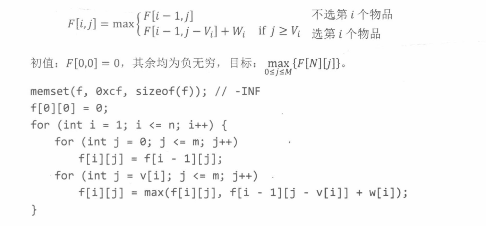

通过 DP 状态转移方程, 每一阶段 $i$ 的状态只与上一阶段  $i-1$ 的状态有关 。使用 “滚动数组”的进行优化，降低空间开销。

```c++
int f[2][MAX_M+1];
memset(f, 0xcf, sizeof f);
f[0][0] = 0;

for(int i = 1 ; i <= n ; i++)
    for(int j = 0 ;  j <= m ; j++)
        f[i & 1][j] = f[(i-1) & 1][j];
	for(int j = v[i] ; j <= m ; j++)
        f[i & 1][j] = max(f[i & 1][j] , f[(i-1) & 1][j - v[i] + w[i]]);


int ans = 0;
for(int j = 0 ; j <= m ; j++)
    ans = max(ans, f[n & 1][j]);
```

在上面程序中，将阶段 $i$ 的状态存储在第一维下标为  $i$ & $1$ 的二维数组中，当  $i$  为奇数 时， $i$ & $1$ 

等于 1；当 $i$ 为偶数时，  $i$ & $1$  等于 0 。因此，DP 的状态就相当于在 $F[0][ ]$ 和  $F[1][]$  两个数组中

交替转移，空间复杂度从 $O(MN)$ 变成 $o(M)$ 。

分析上面代码，可以看到，在每个阶段开始时，实际上执行了一次从 $F[i-1][]$ 到 $F[i][]$ 的拷贝

操作，这提示我们可以进一步省去 $F$ 数组的第一位，只用一维数组。

**当外层循环到第 $i$ 个物品的时候， $F[j]$ 表示背包中放入总体积为 $j$ 的物品最大价值和。**

```c++
int f[MAX_M+1];
memset(f, 0xcf, sizeof f); // -INF
f[0] = 0;
for(int i = 1 ; i <= n ; i++)
    for(int j = m ; j >= v[i] ; j--)
      	f[j] = max(f[j], f[j - v[i]] + w[i]);

int ans = 0;
for(int j = 0 ; j <= m ; j ++)
    ans = max(ans, f[j]);
```

对 $j$ 倒序循环。循环到 $j$  时：

1：$F$ 数组的后半部分 $F[j \sim M]$ 处于 “第 $i$ 个阶段”，也就是已经考虑过放入 第 $i$  个物品的情况。

2：前半部分 $F[0\sim j-1]$ 处于 “第 $i-1$ 个阶段”，也就是还没有第 $i$ 个物品的更新。

接下来 $j$ 不断减小，意味着我们总用 “第 $i-1$ 个阶段”的状态向 “第 $i$ 个阶段” 的状态进行转移，符合线性 DP 的原则，进而保证第 $i$  个物品只会被放入背包。一次。如下图：

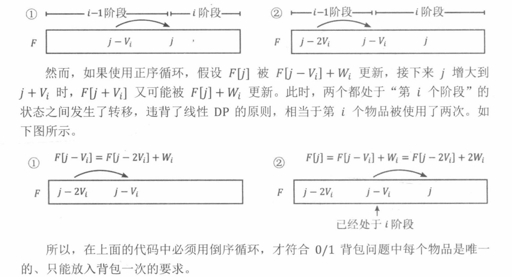


##### 2 ：01背包模板题

https://www.acwing.com/problem/content/2/

```
背包的容量有限。每件物品只能放进背包一次。

特点：每件物品最多只能用一次； (使用次数 <= 1 )
```

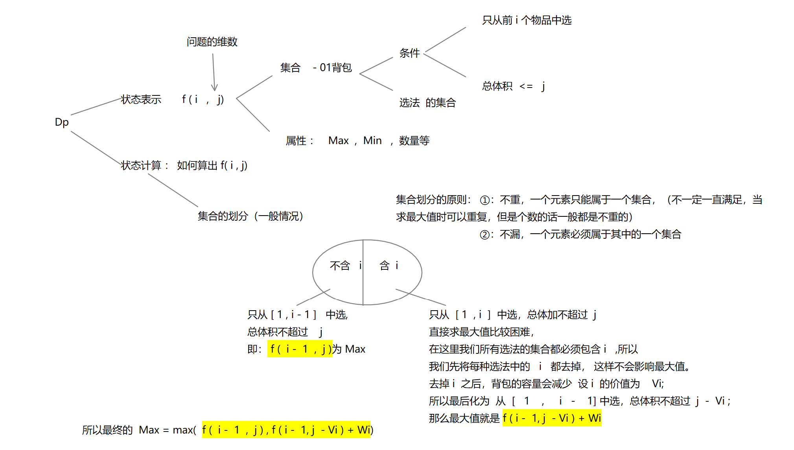

$f[i][j]$  就表示从**前 $i$ 个物品**中选择出可以装进背包的选法集合价值的  **最大值**

```c++
#include<iostream>
#include<algorithm>
using namespace std;
const int N = 1010;
int n ,m;
int v[N],w[N];
int f[N][N];

int main(){
    cin >> n >> m;
    
    for(int i = 1 ; i <= n ; i++) cin >> v[i] >> w[i];
    
    //  二维
    for(int i = 1 ; i <= n ; i++){
        for(int j = 0 ; j <= m ; j++){
            f[i][j] = f[i-1][j];
            if(j >= v[i]) f[i][j] = max(f[i][j],f[i-1][j - v[i]]+ w[i]);
        }
    }
    cout << f[n][m] << endl;
    return 0;
}   
// 可以优化的原因：
f[i] 只用到了 f[i-1];
j , j - v[i]  <= j;


int f[N];
// 一维
for(int i = 1 ; i <= n ; i++){ 
    for(int j = m ; j >= v[i] ; j--){  
        f[j] = max(f[j],f[j - v[i]] + w[i])     
    }
}

//  优化时注意的问题：
for(int i = 1 ; i <= n ; i++)
    for(int j = v[i] ; j <= m ; j++)
    {
        //  f[i]  是由 f[i-1] 转换过来的。  
		f[i-1][j] = f[i-1][j]; 
        // f[j] = f[j];
        
        // 由于 j 是从小到达枚举的 ，j - v[i] < j ，所以 f[j - v[i]] 已经被算过，
        // 那么这维状态就是不包含 i 的 f[i][j - v[i]] 状态。那么这就矛盾了
        // 将 j 倒序进行即可。
		f[i][j] = max(f[i-1][j],f[i][j - v[i]] + w[i]);
// f[i] = max(f[j], f[j - v[i]] + w[i]); == f[i] = max(f[i][j], f[i][j - v[i]] + w[i]);
        
    }		

```

##### 278：数字组合

https://www.acwing.com/problem/content/280/

```
N 个正整数就是 N 个物品，M 就是背包的容积。
在外层循环到 i 的时候（表示从 前 i 个数中选），设 F[j] 表示 “和为 j” 有多少种方案。
```


```c++
#include<iostream>
#include<cstring>
using namespace std;
const int N = 10010;
int n ,m;
int f[N];
int a[N];

int main()
{
    cin >> n >> m;
    for(int i = 1 ; i <= n ; i++) scanf("%d", &a[i]);
    
    memset(f, 0 , sizeof f);
    f[0] = 1;
    for(int i = 1 ; i <= n ; i++)
        for(int j = m ;  j >= a[i] ; j--)
            f[j] += f[j - a[i]];
   
   	cout << f[m] << endl;
    
    return 0;
}
```


#### 完全背包

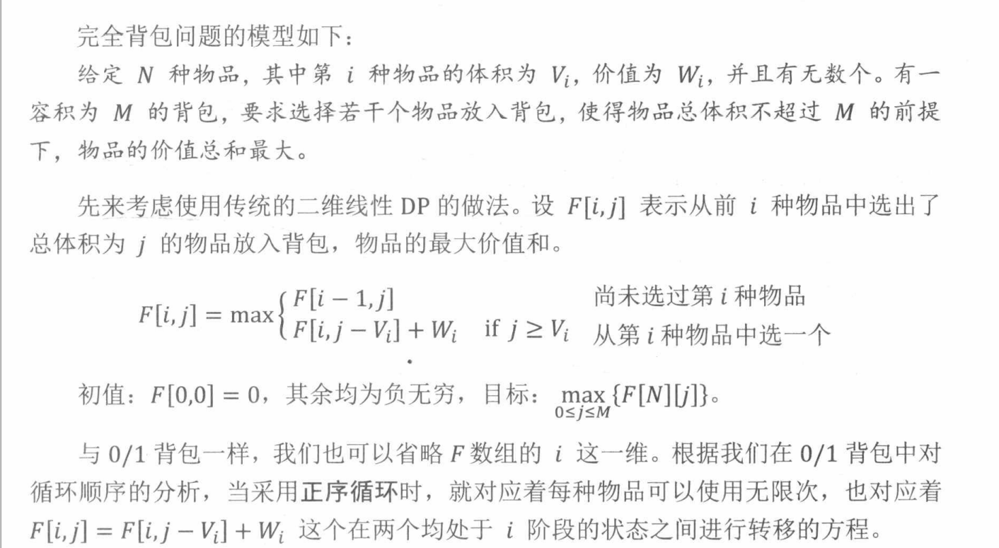

```c++
int f[MAX_M+1];
meset(f, 0xcf, sizeof f);
f[0] = 0;

for(int i = 1 ; i <= n ; i++)
{
    for(int j = v[i] ; j <= m ;j --)
        f[j] = max(f[j] ,f[j - v[i]] + w[i]);
}
int ans = 0;
for(int j = 0 ; j <= m ; j++)
    ans = max(ans, f[j]);

```


##### 3：完全背包模板题

https://www.acwing.com/problem/content/3/

```
特点：每件物品有无限个。

在 01背包中，按照的是第 i 个物品选 1 个 还是选 0 个来分；
完全背包中，物品的个数不限，那么就可以使用 第 i 个物品选 若干个来进行划分。
```

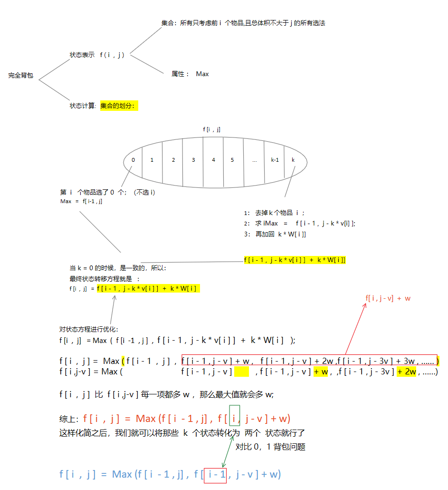


```c++
#include<iostream>
#include<algorithm>
using namespace std;
const int N = 1010;
int n,m;
int v[N], w[N];
int f[N][N];

int main(){
    cin >> n >> m;
    
    for(int i = 0 ; i <= n ; i++ ) cin >> v[i] >> w[i];
    
    //  原始状态方程，数据量的增加会超时
    for(int i = 1 ; i <= n ; i++)
        for(int j = 0 ; j <= m ; j++)
            for(int k = 0 ; k * v[i] <= j ; k++)      //  限制完全背包的r
                f[i][j] = max(f[i][j] , f[i-1][j - v[i] * k] + w[i] *k);
    
    cout << f[n][m] << endl;
    
    return 0;
}


//  优化后的状态转移方程；(二维)
for(int i = 1 ; i <= n ; i ++ )
    for(int j = 0 ; j <= m ;j++){
        f[i][j] = f[i-1][j];
        if(j >= v[i]) f[i][j] = max(f[i][j],f[i][j - v[i]] + w[i]);
    }


//  再次优化 (一维)
int f[N];
for(int i = 1 ; i <= n ; i++)
    for(int j = v[i] ; j <= m ; j++){
        f[j] = max(f[j] , f[j - v[i]] + w[i]);
    }

cout << f[m] << endl;            
```


#### 多重背包

**直接拆分法：**

求解多重背包问题最直接的方法是把第 $i$ 种物品看作独立的 $C_i$ 个物品。转换为共有 $\sum_{i=1}^N$ 个物品的 

0/1背包问题进行计算，时间复杂度是  $o(M * \sum_{i=1}^N C_i)$ 。

```c++
int v[N] , w[N], c[N];
int f[N];

memset(f, 0xcf ,sizeof f);  // oxcf 是 -INF
f[0] = 0;

for(int i = 1 ; i <= n ; i++)
    for(int j = 1 ; j <= c[i] ; j++)
        for(int k = m ; k >= v[i]; k--)
            	f[k] = max(f[k],f[k-v[i]] + w[i]);
int ans = 0;
for(int i = 0 ; i <= m ; i++) ans = max(ans , f[i]);
```

**二进制拆分**

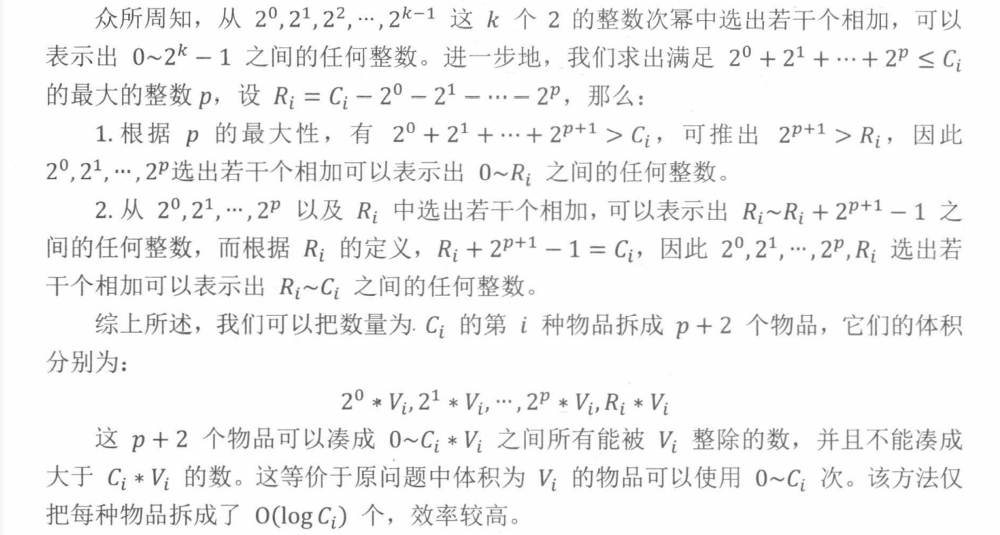


##### 4：多重背包模板题1

https://www.acwing.com/problem/content/4/

```
特点：每个物品的个数有限制；
```

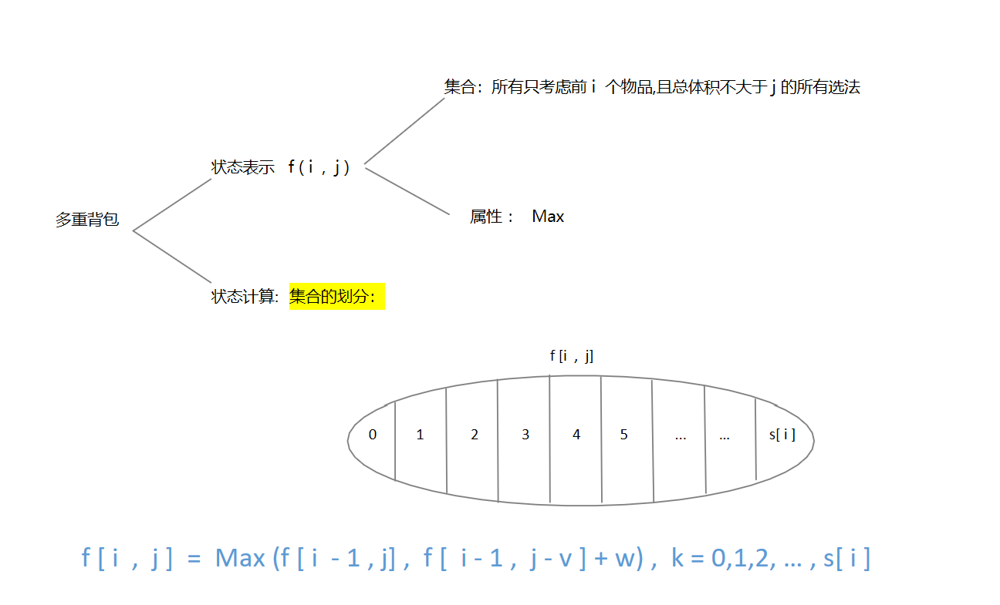

```c++
const int N = 110;
int n,m;
int v[N], w[N],s[N];
int f[N][N];

int main(){
    cin >> n >> m;
    
    for(int i = 1 ; i <= n ; i++ ) cin >> v[i] >> w[i] >> s[i];
    
    //  原始状态方程，数据量的增加会超时
    for(int i = 1 ; i <= n ; i++)
        for(int j = 0 ; j <= m ; j++)
            // 多重背包的个数的限制：k <= s[i]
            for(int k = 0 ;k <= s[i] &&  k * v[i] <= j ; k++)              
                f[i][j] = max(f[i][j] , f[i-1][j - v[i] * k] + w[i] *k);
                
    cout << f[n][m] << endl;
    
    return 0;
}    

普通优化时的问题：
f[i][j]=max(f[i-1][j],f[i-1][j-v]+w , f[i-1][j-2v]+2w ,...,f[i-1][j-sv] + sw)
f[i][j-v]=max(        f[i-1][j-v],f[i-1][j-1]+w,...,f[i-1][j-(s-1)v]+(s-1)w + f[i-1][j-sv]+(s+1)w)
// 最后多余的一项会使我们无法正常的转移， max() 无法使用

// 使用 二进制 来进行优化
1 , 2 , 4 , ... , 2^k , c  (c < 2^(k+1))
可以凑出 0 ~  2^(k+1) -1 的数 + c  ==  0 ~ s

```

##### 5：多重背包模板题2

https://www.acwing.com/problem/content/5/

**二进制优化**

```
对于某一整数  s;
将 s 用 2的幂次方数进行拆分。
    1 , 2 , ... , 2^(k-1) , ... , c , ... ,s, ... 2^(k+1)

1到 2^(k-1) 可以凑出 1 到 2^(k-1) + 2^(k-1) - 1 = k 的数。
    需要 c + k 恰好等于 整数 s。

其中的 s 就是我们每个物品的个数限制。
使用原先的枚举方式，需要我们从 0 一直枚举到 s ，而这样处理之后。
就可以将 o(n) 优化到 o(logn)

```

```c++
#include <iostream>
#include <cstring>
#include <algorithm>

using namespace std;
const int N = 25000 , M = 2010; // N = 2000 * log_2 (2000)

int n ,m;
int v[N] , w[N];
int f[N];

int main()
{
    cin >> n >> m;
    
    int cnt = 0;  // 划分组后（新的物品）
    for(int i = 1 ; i <= n ; i++)
    {
        int a, b, s;
        cin >> a >> b >> s;
        int k = 1;   
        while(k <= s)
        {
            cnt ++;
            v[cnt] = a * k;
            w[cnt] = b * k;
            s -= k ,k *= 2;
        }
        // k 已经走到小于s的最大的2的幂次方数
        // s 也已经累减，再将剩余的 s 的作为一组即可
        if(s > 0)  
        {
            cnt ++;
            v[cnt] = a *s;
            w[cnt] = b *s;
        }
    }
    
    n = cnt;
    
    for(int i = 1 ; i <= n ; i++)
        for(int j = m ; j >= v[i] ; j--)
            f[j] = max(f[j] , f[j - v[i]] + w[i]);
    
    cout << f[m] << endl;
    return 0;
}
```


#### 分组背包

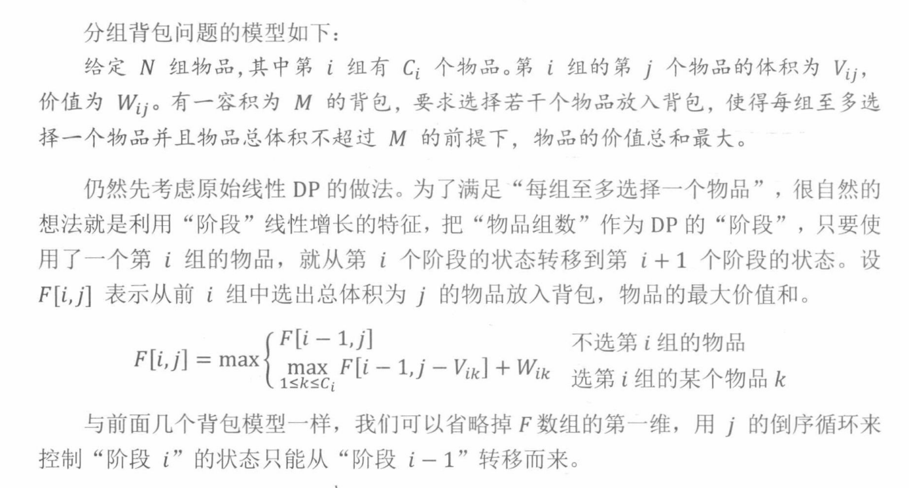

```c++
memset(f, 0xcf , sizeof f);
f[0] = 0;

for(int i = 1 ; i <= n ; i++)
	for(int j = m ; j >= 0 ; j--)
		for(int k = 1 ; k <= c[i] ; k++)
			if(j >= v[i][k])
				f[j] = max(f[j],f[j-v[i][k]] + w[i]);
```

除了倒序循环 $j$ 之外吗，**注意**

对于**每一组内  $c[i]$ 个物品的循环 $k$** 应该放在 $j$ 的**内层**。从背包的角度看，这是因为每组内至少选择一个物品，若将 $k$  置于 $j$ 的外层，就会类似于多重背包，每组物品在 $F$ 的祖上的转移会产生累积，最终可以选择超过 1 个物品。从动摇规划的角度，$i$ 是 **阶段** ， $i$ 和 $j$ 共同过程  **状态** 而 $k$ 是**决策**，

——在第 $i$ 组内是u哦那个哪一个物品，这三者的顺组不能乱。

```c++
特点：每一组当中每个物品最多只能有一个
```

##### 9：分组背包模板题

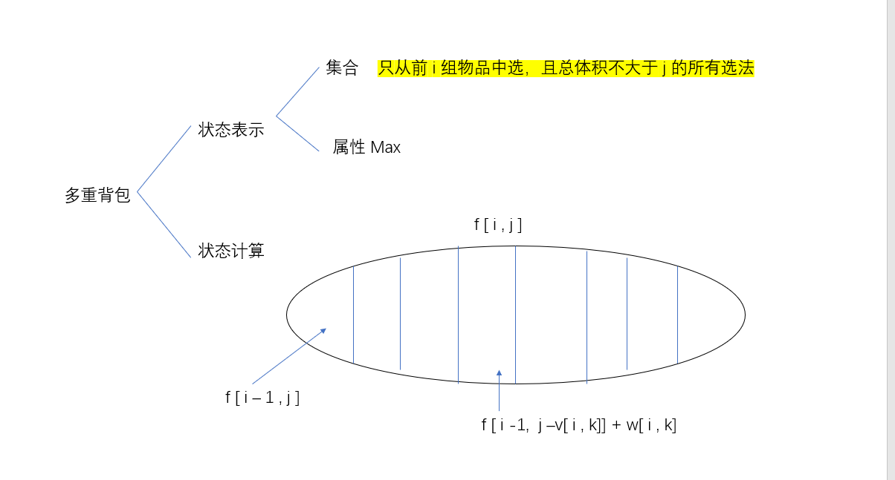

枚举第 $i$ 组物品选 或 不选，

从第 $i$ 组物品当中选择第 $k$ 个物品：$f[i-1,j-v[i][k]] + w[i][k]$

https://www.acwing.com/problem/content/9/

```c++
#include <iostream>
#include <cstring>
#include <algorithm>
using namespace std;
const int N = 110;

int n, m;
int v[N][N] , w[N][N] , s[N]; //  s[N] 表示每一组物品的个数。
int f[N];

int main()
{
    cin >> n >> m;
    
    for(int i = 1 ; i <= n ; i++)
    {
        cin >> s[i];
        for(int j = 0 ; j < s[i] ; j++)
            cin >> v[i][j] >> w[i][j];
    }     
    
    for(int i = 1 ; i <= n ;i++)
        for(int j = m ; j >= 0; j--)
            for(int k = 0 ; k < s[i] ; k++)
                if(v[i][k] <= j)
                    f[j] = max(f[j] ,f[j - v[i][k]] + w[i][k]);
     
    cout << f[m] << endl;
    
    return 0;
} 
```


#### 线性DP

##### 898:数字三角形

https://www.acwing.com/problem/content/900/

```
状态方程中的下标 从 1 或者 0 开始的是由 状态计算过程需要使用的数决定。
eg:  f[i - 1] 这种使用下标从 1 开始就不会出现越界问题。
```

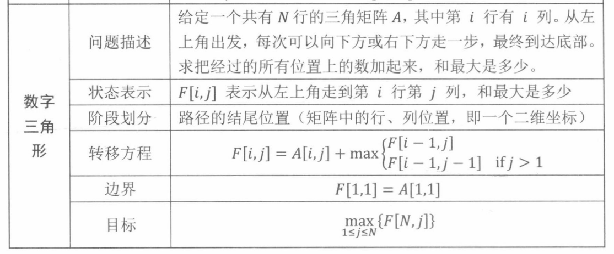

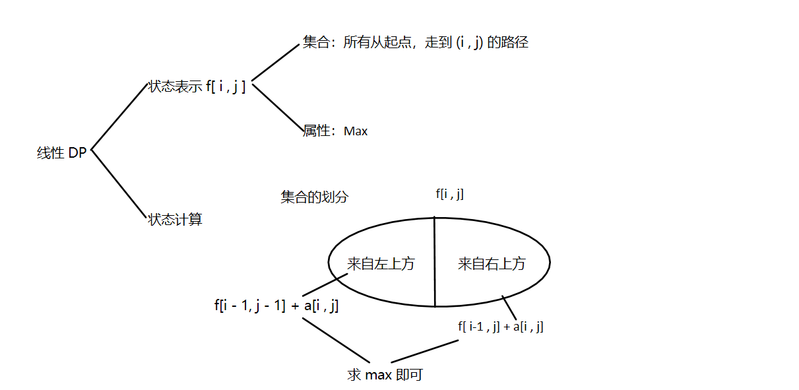

```
           f[1][1]
      f[2][1]   f[2][2]
 f[3][1]   f[3][2]   f[3][3]
 
所以f[i][j]的左上是f[i - 1][j - 1]，右上是 f[i - 1, j]

```

```c++
//  二维 从上到下 考虑
#include<iostream>
#include<algorithm>
#include<cstring>

using namespace std;
const int N = 510;
const int INF = 1e9;

int n;
int a[N][N];
int f[N][N];


int main()
{
    cin >> n;
    
    for(int i = 1 ; i <= n; i++)
        for(int j = 1 ; j <= i ; j++)
            scanf("%d", &a[i][j]);
    
    
    for(int i = 0 ; i <= n ; i++)
        for(int j = 0 ; j <= i + 1; j++) // 右上角不存在的点也要初始化
            f[i][j] = -INF;
    
    
    f[1][1] = a[1][1];
    //  左上 和 右上 l
    for(int i = 2 ;i <= n ; i++)
        for(int j = 1 ; j <= i ;j++)
            f[i][j] = max(f[i-1][j-1]+a[i][j] , f[i-1][j] + a[i][j]);
            
    
    int res = -INF;
    for(int i = 1 ; i <= n ; i++)
        res = max(res , f[n][i]);
    
    printf("%d\n",res);
    
    
    return 0;
}
```


```c++
//  一维，从底至上 考虑
#include<iostream>
using namespace std;
const int N = 503;
int n;
int a[N][N];
int f[N];

int main()
{
    scanf("%d", &n);
    for(int i = 1;i<=n;i++)
        for(int j = 1;j<=i;j++)
            scanf("%d", &a[i][j]);
    
    for(int j = 1;j <= n;j++)
        f[j] = a[n][j];
    
    for(int i = n - 1;i>=1;i--)
        for(int j = 1;j<=i;j++)
            f[j] = a[i][j] + max(f[j],f[j+1]);

    cout << f[1] << endl;
    return 0;
}

```

##### 895:最长上升子序列

https://www.acwing.com/problem/content/897/

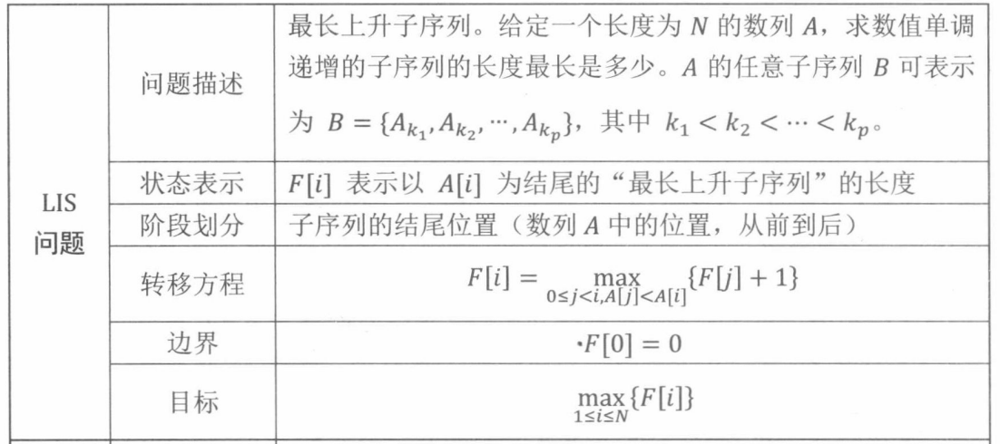

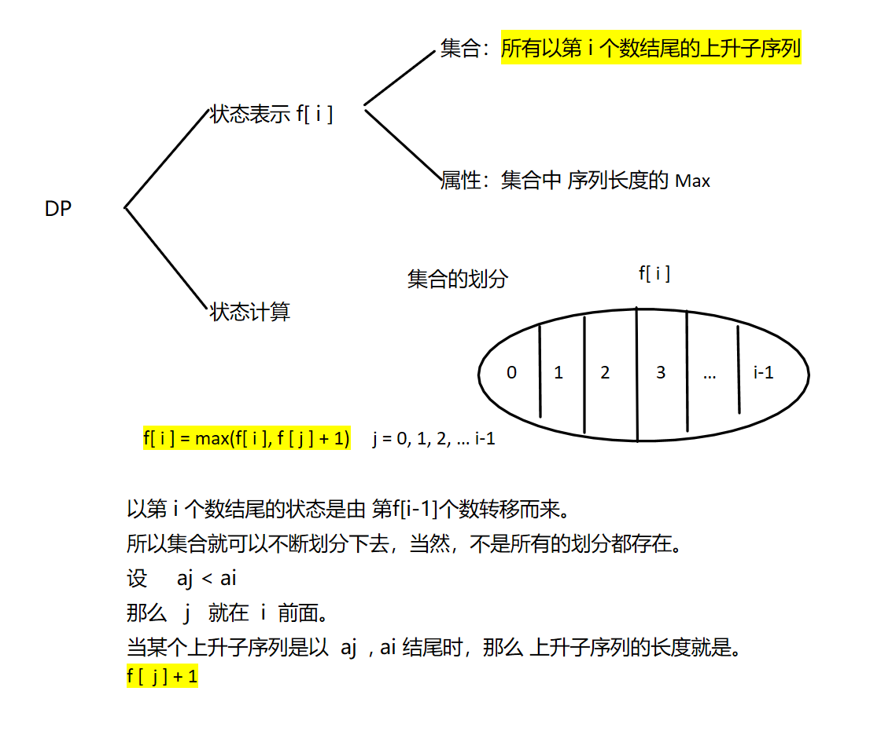

```c++
#include<iostream>

using namespace std;
const int N = 1010;
int n;
int a[N] , f[N];

int main()
{
    scanf("%d", &n);
    for(int i = 1 ; i <= n ; i++)
        scanf("%d", &a[i]);
    
    for(int i = 1 ; i <= n ; i++)
    {
        f[i] = 1; //  以　i 结尾的数只有 a[i] 一个
        for(int j = 1 ;  j < i ; j++)
            if(a[j] < a[i])
                f[i] = max(f[i],f[j] + 1);
    }
    
    int res = 0;
    for(int i = 1 ;i <= n ; i++)
        res = max(res , f[i]);
    
    cout << res << endl;
    
    return 0;
}
```

```c++
//  记录方案
#include<iostream>
using namespace std;
const int N = 1010;
int n;
int a[N] ,f[N] ,g[N]; //  g[N] 记录过程

int main(){
    scanf("%d",&n);
    for(int i = 1 ; i <= n ; i++)
        scanf("%d",&a[i]);
   
    for(int i = 1 ; i <= n ; i++)
    {
        f[i] = 1;
        g[i] = 0;
        for(int j = 1 ; j < i ; j++)
            if(a[j] < a[i])
                if(f[i] < f[j] + 1)
                {
                    f[i] = f[j] + 1;
                    g[i] = j; 
                }
    }
    
    int k = 1;  //  下标
    for(int i = 1 ; i <= n ; i++)
        if(f[k] < f[i])
            k = i;
    
    printf("%d\n",f[k]);
    
    for(int i = 0 , len = f[k]; i < len ; i++)
    {
        printf("%d ",a[k]);
        k = g[k];
    }
    
    return 0;
}
```

##### 896:最长上升子序列 (优化)

https://www.acwing.com/problem/content/898/

```
检查一下  上一步思想的冗余之处。
对于  不同长度的  上升子序列，序列中最后一个元素的值决定它的扩展能力。
当  较短上升子序列的最后一个值 ， 比   较长上升子序列的最后一个值还要大的时候。
那么前者就可以被淘汰。

也即： 将所以的 上升子序列的 长度 排成单调递增的时候，其对应得最后一个值而必须是 单调递增的

当满足严格的单调递增时，就可以达到 一个优化的状态

```

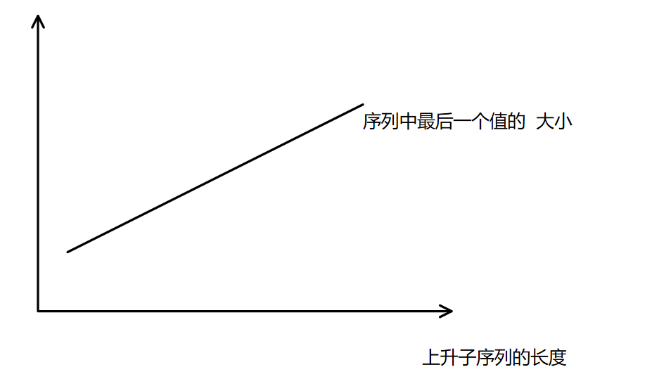

```c++
// 优化
#include<iostream>
using namespace std;
const int N = 100010;
int n;
int a[N];
int s[N]; //  存不同长度的  上升子序列的的结尾的最小值

int main()
{
    scanf("%d", &n);
    for (int i = 0; i < n; i ++ ) scanf("%d", &a[i]);
    
    int len = 0;
    s[0] = -2e9; //  保证 d
    for(int i = 0 ; i < n ; i++)
    {
        int l = 0 , r = len; // 寻找 小于 a[i] 的最大的数
        while(l < r)
        {
            int mid = (l + r + 1) >> 1;
            if(s[mid] < a[i]) l = mid;
            else r = mid - 1;
        }
        
        len = max(len , r + 1); //  找完之后，长度 + 1
        s[r + 1] = a[i]; //  将 该值作为 该上升子序列的 的最后一个值。
    }
        
    printf("%d",len);
    
    return 0;
}
```

```c++
//  用栈 优化
#include<iostream>
using namespace std;

const int N = 100010;
int n;
int a[N];

int st[N];
int tt = 0;

int main()
{
    scanf("%d", &n);
    for (int i = 0; i < n; i ++ ) scanf("%d", &a[i]);
    
    st[tt] = a[0];
    for(int i = 1 ; i < n ; i++)
    {
        if(a[i] > st[tt])
        {
            st[++ tt] = a[i];
        }
        else 
        {
            int l = 0 , r = tt;
            while(l < r)
            {
                int mid = (l + r) >> 1;
                if(st[mid] >= a[i]) r = mid;
                else l = mid + 1;
            }
            st[l] = a[i];
        }
    }
    
    printf("%d",tt + 1);
    return 0;
}
```


##### 897:最长公共子序列

https://www.acwing.com/problem/content/899/

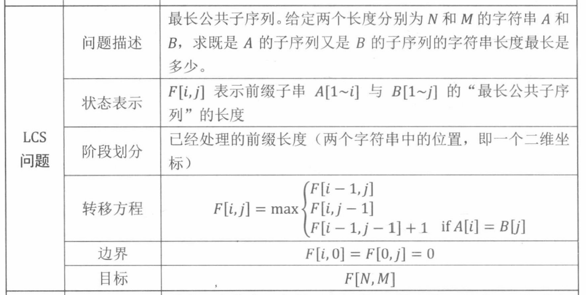

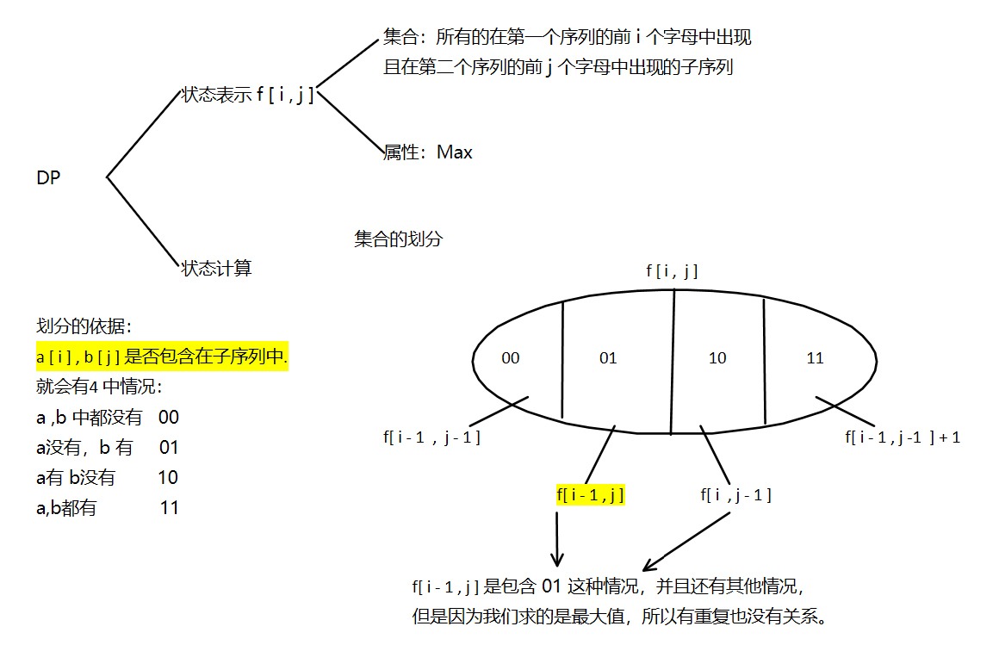

```
f[i - 1][j - 1] 这种情况是包含在 f[i-1][j] 和 f[i][j-1] 这两种情况之中。

```

```c++
#include<iostream>
#include<cstring>
using namespace std;
const int N = 1010;
int n ,m;
char a[N], b[N];
int f[N][N];

int main()
{
    scanf("%d%d",&n,&m);
    scanf("%s%s",a + 1 ,b + 1);
    
    for(int i = 1 ; i <= n ; i++)
        for(int j = 1 ; j <= m ; j++)
        {
            f[i][j] = max(f[i - 1][j],f[i][j-1]);
            if(a[i] == b[j])
                f[i][j] = max(f[i][j],f[i-1][j-1] + 1);
            
        }

    printf("%d",f[n][m]);
    
    return 0;
}
```

##### 902:最短编辑距离

https://www.acwing.com/problem/content/904/

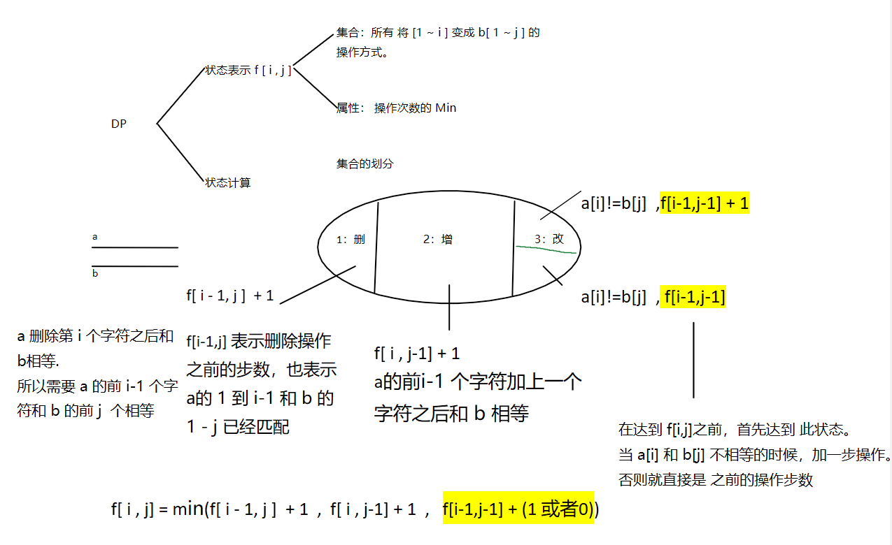

```c++
#include<iostream>
using namespace std;

const int N = 1010;
int n ,m;
char a[N] , b[N];
int f[N][N];

int main()
{
    scanf("%d%s", &n , a + 1);
    scanf("%d%s", &m , b + 1);
    
    //  处理边界
    //  用 a 的前 0 个 字母去匹配 b 的前 i 个字母 的时候，只能用 添加操作，做 m 次添加
    for (int i = 0 ; i <= m ; i++  ) f[0][i] = i; 
    //  用 a 的前 i 个 字母去匹配 b 的前 0 个字母 的时候，只能用 删除操作，做 n 次删除
    for (int i = 0 ; i <= n ; i ++ ) f[i][0] = i;
    
    for(int i = 1 ; i <= n ; i++)
        for(int j = 1 ; j <= m ; j++)
        {
            f[i][j] = min(f[i-1][j]+1 ,f[i][j-1]+1);
            f[i][j] = min(f[i][j],f[i-1][j-1] + (a[i] != b[j]));
        }
    
    printf("%d\n",f[n][m]);
    
    return 0;
}

```

##### 899:编辑距离

https://www.acwing.com/problem/content/901/

```c++
#include <iostream>
#include <cstring>
#include <algorithm>
using namespace std;
const int N = 15 , M = 1010;
int n, m;
int f[N][N];
char str[M][N];

int edit_distance(char a[] ,char b[])
{
    int la = strlen(a + 1) , lb = strlen(b + 1);
    
    for(int i = 0 ; i <= lb ; i++) f[0][i] = i;
    for(int i = 0 ; i <= la ; i++) f[i][0] = i;
    
    for(int i = 1 ; i <= la ; i++)
        for(int j =  1 ; j <= lb ; j++)
        {
            f[i][j] = min(f[i-1][j] + 1, f[i][j-1] + 1);
            f[i][j] = min(f[i][j] ,f[i-1][j-1] + (a[i] != b[j]));
        }

    return f[la][lb];
}

int main()
{
    scanf("%d%d",&n ,&m);
    for(int i = 0 ; i < n ; i++) scanf("%s", str[i] + 1);
    
    while(m--)
    {
        char s[N];
        int limit;
        scanf("%s%d", s + 1 , &limit);
        
        int res =  0;
        for(int i = 0 ; i < n ; i++)
            if(edit_distance(str[i], s) <= limit)
                res ++;
        printf("%d\n",res);
    }
    
    
    return 0;
} 
```


#### 区间DP

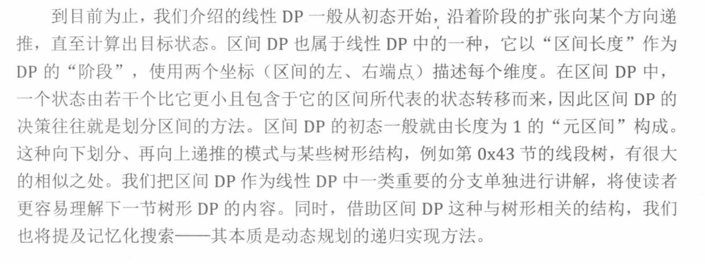

##### 282:石子合并

https://www.acwing.com/problem/content/284/

```
1 ： 当要合并 端点 l , r 之间的果子，就必须要将 区间 [l , r] 之间的果子都合并。
使用前缀和来 计算   区间 [l , r] 之间合并所需要代价。

2： 一定存在一个 整数 k(l <= k <= r) 在这对石子形成之前，先有 区间 [l ,k] 被合并为一堆，
再有 区间 [k + 1 , r] 堆石子被合并。然后 才有  两堆石子合并成 [l , r]

```

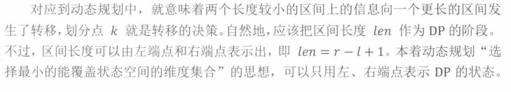

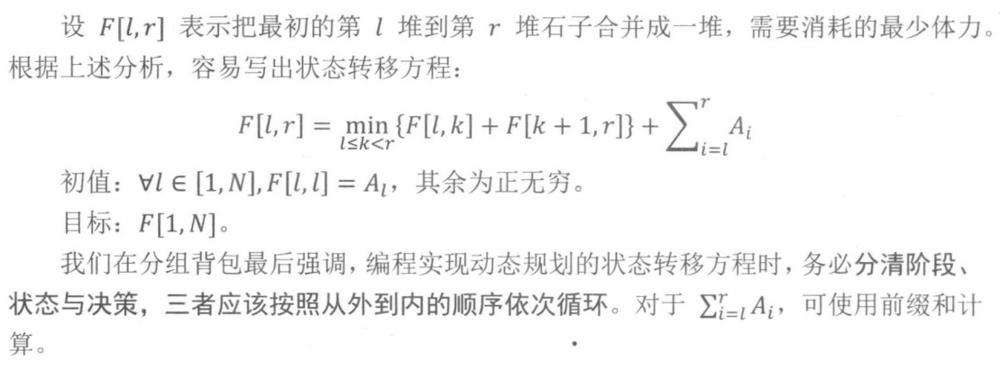

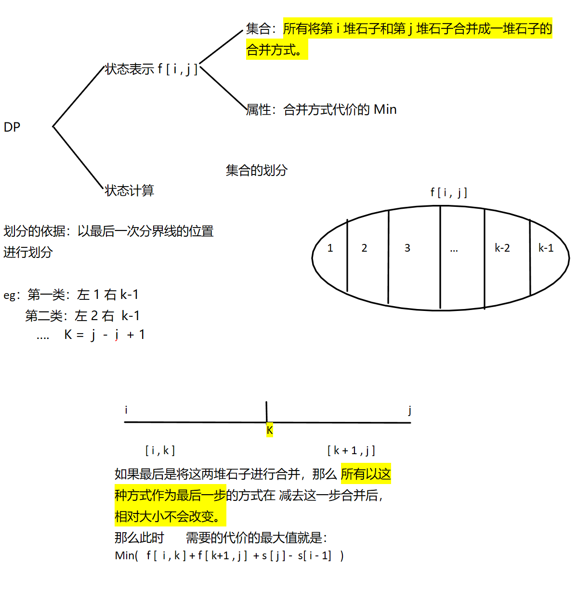

```c++
#include<iostream>
#include<cstring>
using namespace std;
const int N = 310;

int n;
int a[N];
int f[N][N];
int sum[N];

int main()
{
    scanf("%d", &n);
    for(int i = 1 ; i <= n ; i++)
        scanf("%d", &a[i]);
        
    for(int i = 1 ; i <= n ; i++) //  求前缀和
    {
        f[i][i] = 0;
        sum[i] = sum[i-1] + a[i];
    }
    
    for(int len = 2 ; len <= n ; len ++)
        for(int l = 1 ; l  <= n - len + 1 ; l++)
        {
            int r = l + len - 1;
            
            f[l][r] = 1e8; //  初始化为较大值
            
            for(int k = l ; k < r ; k++)
                f[l][r] = min(f[l][r],f[l][k] + f[k+1][r]);
            
            f[l][r] += sum[r] - sum[l-1];
        }
    
    printf("%d\n",f[1][n]);
    
    return 0;
}
```

```c++
#include<iostream>
#include<cstring>
using namespace std;

const int N = 310;

int n;
int s[N];
int f[N][N];

int main()
{
    scanf("%d", &n);
    for(int i = 1 ; i <= n ; i++)
        scanf("%d", &s[i]);
        
    for(int i = 1 ; i <= n ; i++) s[i] += s[i-1];
    
    
    for(int len = 2 ; len <= n ; len ++)
        for(int l = 1 ; l  <= n - len + 1 ; l++)
        {
            int r = l + len - 1;
            
            f[l][r] = 1e8;
            
            for(int k = l ; k < r ; k++)
                f[l][r] = min(f[l][r],f[l][k] + f[k+1][r] + s[r] - s[l-1]);
        }
    
    printf("%d\n",f[1][n]);
    
    
    return 0;
}
```

#### 计数类 DP

##### 900:整数划分

https://www.acwing.com/problem/content/902/

```
完全背包做法：
	n 是背包的容量， 物品的体积是 1 ~ n， 每种物品有无限个。
	求解的是恰好装满背包的方案数。

状态标识：
f[i][j] 表示从 1 ~ i 中选，且总和等于 j 的方案数。

状态转移方程：
f[i][j] = f[i-1][j] + f[i][j-i]; //  二维
f[j] = f[j] + f[j-i]
```

```c++
#include<iostream>
#include<algorithm>
using namespace std;

const int N = 1010 , mod = 1e9 + 7;

int n;
int f[N];

int main()
{
    cin >> n;
    
    f[0] = 1;
    for(int i = 1 ; i <= n ; i++)
        for(int j = i ; j <= n ; j++)
            f[j] = (f[j] + f[j - i]) % mod;
            
    cout << f[n] << endl;
    return 0;
}
```

```
计数 DP写法：

集合： 所有总和是 i ,并且恰好表示成 j 个数的和的方案。
状态表示：

集合的划分：
	1：方案中的最小值为 1 (即 j 个数中的最小值为 1)
		将这种方案的去掉一个最小值 1，方案就会变成和是 i-1, 个数为 j - 1的方案。
		f[i-1][j-1]
	2：方案中的最小值大于 1 
		将每个数都减去 1. 一共有 j 个数。
		将状态变成 总和 i - j , 一共有 j 个数的状态。
		然后反过来，将每个数都加上 1 ，就会又回到 总和为 i ，一共有 j 个数的状态。
		f[i-j][j]
		
状态转移方程：
f[i][j] = f[i-1][j-1] + f[i-j][j]
ans = f[n][1] + f[n][2] + ... +f[n][n]
```

```c++
#include<iostream>
#include<cstring>
using namespace std;
const int N = 1010 , mod = 1e9 + 7;
int n ;
int f[N][N];

int main()
{
    scanf("%d",&n);
    
    f[0][0] = 1;
    for(int i = 1 ;i <= n ; i++)
        for(int j = 1; j <= i; j++)
            f[i][j] = (f[i-1][j-1] + f[i-j][j]) % mod;
    
    int ans = 0;
    for(int i = 1 ; i <= n ; i++) ans = (ans + f[n][i])% mod;
            
    printf("%d\n",ans);     
    
    return 0;
}
```


#### 数位统计 DP

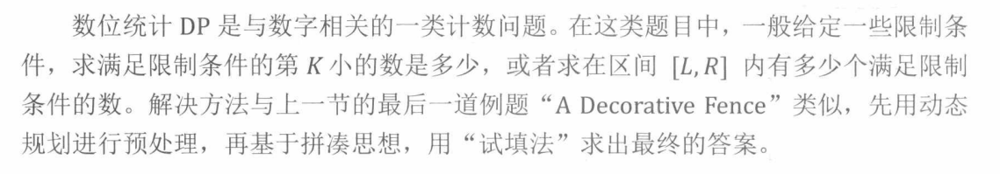

##### 338:计数问题

https://www.acwing.com/problem/content/340/

**重点是 分情况讨论 ！**

```
[a , b]  0 ~ 9

实现一个函数 count(n , x)   统计 1 ~ n 中 x 出现的次数

然后通过 “前缀和”思想 求某个区间中  x 出现的次数
count(b ,x) - count(a - 1 , x )   统计 (a, b)中 x 出现的次数
```


#### 状态压缩 DP

动态规划的过程是随着“阶段”的增长，在每个状态维度上不断扩展的。在任意时刻，已经求出最优解的状态与尚未求出最优解的状态在各维度上的分界点组成DP 扩展的“轮廓”。对于某些问题，我们需要在动态规划的 “状态” 中记录一个集合，保存这个 ”轮廓“的详细信息，以便进行状态转移。若集合大小不超过 N ， 集合中每个元素都是小于 K 的自然数，则我们可以**把这个集合看作一个 N 位 K 进制数。**

**以一个 [ 0 , K^N -  1] 之间的十进制整数的形式作为  DP状态集合的一维。**

这种**把集合转化为整数记录在 DP 状态中**的一类算法，被称为  **状态压缩 DP**。

##### 291：蒙德里安德梦想

https://www.acwing.com/problem/content/293/

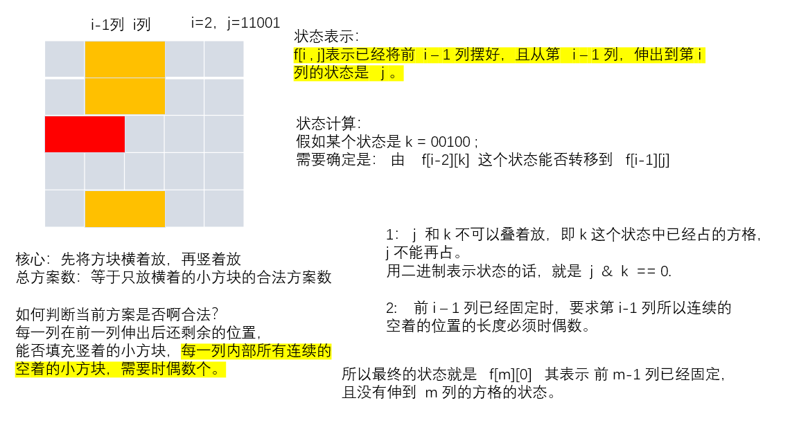

```
核心：先将方块横着放，再竖着放
总方案数：等于只放横着的小方块的合法方案数

如何判断当前方案是否啊合法？
每一列在前一列伸出后还剩余的位置，
能否填充竖着的小方块，每一列内部所有连续的
空着的小方块，需要时偶数个。

状态表示：
f[i , j]表示已经将前  i – 1 列摆好，且从第   i – 1 列，伸出到第 i 列的状态是   j 。

状态计算：
假如某个状态是 k = 00100 ;
需要确定是： 由    f[i-2][k]  这个状态能否转移到   f[i-1][j]

1： j  和 k 不可以叠着放，即 k 这个状态中已经占的方格，j 不能再占。
用二进制表示状态的话，就是  j  &  k  == 0.

2:    前 i – 1 列已经固定时，要求第 i-1 列所以连续的
空着的位置的长度必须时偶数。

所以最终的状态就是   f[m][0]   其表示 前 m-1 列已经固定，
且没有伸到  m 列的方格的状态。
```

```
优化：
	预处理一下：对于每个状态 j 而言 ,哪些状态可以更新到 j。
```

```c++
#include <iostream>
#include <cstring>
#include <algorithm>
#include <vector>
using namespace std;
typedef long long LL;

const int N = 12 , M = 1 << N;

int n, m;
LL f[N][M];
vector<int> state[M];  //  存储所有的合法状态
bool st[M]; //  判断当前这一列空着的连续小方格是不是偶数个

int main()
{
    while(cin >> n >> m, n || m)
    {
        for(int i = 0 ; i < 1 << n ; i++)
        {
            int cnt = 0;
            bool is_valid = true;
            for(int j = 0 ; j < n ; j++)
                if(i >> j & 1)
                {
                    if(cnt & 1) 
                    {
                        is_valid = false;
                        break;
                    }
                    cnt = 0;
                }
                else cnt++;
            if(cnt & 1) is_valid = false;
            st[i] = is_valid;
        }
        for(int i = 0 ; i < 1 << n ; i++)
        {
            state[i].clear();
            for(int j = 0 ; j < 1 << n ; j++)
                if((i & j) == 0 && st[i | j])
                    state[i].emplace_back(j);
        }
    
        memset(f, 0 ,sizeof f);
        f[0][0] = 1;
        
        for(int i = 1 ; i <= m ; i++)
            for(int j = 0 ; j < 1 << n ; j++)
                for(auto k : state[j])
                    f[i][j] += f[i-1][k];
        
        cout << f[m][0] << endl;
    }
    return 0;
}
```

##### 最短Hamilton路径

https://www.acwing.com/problem/content/93/

首先从暴力角度思考： $0$  ~  $n-1$  共有  $ n$ 个点。数据范围是  $20$

那么直接暴力排列，一共就有  $20!$ 种可能。

eg:  有 $5$ 个数据。 $0,1,2,3,4$

在暴搜的时候，会枚举一下六种路径情况，（只算对答案有贡献的情况的话）

- $case$ $1$ :   $0\to1\to2\to3\to4$
- $case$ $2$ :   $0 \to 1 \to3 \to 2 \to 4$
- $case$ $3$ :   $0\to 2 \to 3 \to 1 \to 4$
- $case$ $4$ :   $0\to2\to1\to3\to4$
- $case$ $ 5 $ :   $0\to3\to1\to2\to4$
- $case$ $6$ :   $0\to3\to2\to1\to4$

观察 $case1$ 个$cas3$ ，在计算 $0$ 到  $3$ 的路径时，其实并不关心路径种经过点的顺序，而只是判断这两种路径的 代价的较小值，只有较小值才可能成为路径。

所以在枚举路径时，记录两个属性：

1. 当前经过了哪些点
2. 当前点到了哪个点

对于当前经过的状态使用 二进制数来表示：

其中这个二进制数的第  $i$ 位为 `1/0` 表示 `是/否` 经过点 $i$.

```
状态表示：
	f[state][j] 其中 state 是二进制数
	
	集合： 在 state 状态下，当前到了点 j 上的所有路径。
	属性： 路径总长度的最小值。
	
状态计算：
	假设当前要从点 k 转移到 j, 根据 Hamilton路径的定义，走到点 k 的点就不能经过 j.
	所以由状态 f[state_k][k] 转移到 f[state_j][j] 要 + w[k][j](k到j的距离) ,
	所以状态转移方程就是：
f[state][j] = min(f[state ^ (1 << j)][k] + w[k][j])

state^(1 << j) 是将 state 的第 j 位改变之后的值。也就是到达了 j的state 状态。

由于到达点 j 的路径一定经过点 j , 也就是说当 state 的第 j 位为 1 的时候，
f[state][j] 才能被转移。所以 state ^ (1 << j) 就是将 state 的第 j 位改为 0.
这样也就符合了 走到点 k 的路径就不能经过点 j 这个条件。

所有状态转移完后，根据 f[state][j] 的定义，要输出 f[111⋯11(n个1)][n−1]。
那么怎么构造 n 个 1 呢，可以直接通过 1 << n 求出 100⋯0(n个0)，然后减一即可。
```

```
枚举所有 state 的时间复杂度是 O(2^n)
枚举 j 的时间复杂读是 O(n)
枚举 k 的时间复杂度是 O(n)
所以总的时间复杂度是 O(n^2 * 2^n)
```

```c++
#include<iostream>
#include<cstring>
using namespace std;
const int N = 20 , M = 1 << 20;
int n;
int f[M][N],w[N][N];

int main()
{
    cin >> n;
    for(int i = 0 ; i < n ; i++)
        for(int j = 0 ; j < n ; j++)
            cin >> w[i][j];
            
    memset(f ,0x3f ,sizeof f);
    f[1][0] = 0;
    
    for(int i = 0 ; i < 1 << n ; i++)
        for(int j = 0 ; j < n ; j ++)
            if(i >> j & 1) //  判断 i 的第 j 为是否为 1
            {
                for(int k = 0 ; k < n ; k++)
                {
                    if(i - (1 << j) >> k & 1)
                        f[i][j] = min(f[i][j] ,f[i-(1<<j)][k]+w[k][j]);
                }
            }
            
    cout << f[(1 << n) - 1][n-1] << endl;
    
    return 0;
}
```

```c++
/*
	在两次枚举 0 ~ n-1 中的所有点时，只枚举点集中包含的点。
*/

#include<iostream>
#include<cstring>
using namespace std;
const int N = 20 , M = 1 << 20;
int n;
int f[M][N],w[N][N];
// 存 1 到 M / 2 中，所有 2 的整次幂的数以 2 为底的对数
int log_2[M >> 1]; 

int main()
{
    cin >> n;
    for(int i = 0 ; i < n ; i++)
        for(int j = 0 ; j < n ; j++)
            cin >> w[i][j];
            
    for (int i = 0; i < 20; i ++ ) // 预处理 log_2
        log_2[1 << i] = i;

    memset(f ,0x3f ,sizeof f);
    f[1][0] = 0;
    
    for (int state = 1; state < 1 << n; state ++ )
        if (state & 1)
        {    // 只枚举 state 所包含的点集
            for (int t = state; t; t &= t - 1)     
            {
                // 将集合 t 中最小的点取出
                int j = log_2[t & -t];   
                // 只枚举 state 中去掉点 j 的点集
                for (int u = state ^ t & -t; u; u &= u - 1) 
                {
                    // 将集合 u 中最小的点取出
                    int k = log_2[u & -u];         
                    if (f[state ^ t & -t][k] + w[k][j] < f[state][j])
                        f[state][j] = f[state ^ t & -t][k] + w[k][j];
                }
            }
        }
            
    cout << f[(1 << n) - 1][n-1] << endl;
    
    return 0;
}
```

```
按照状态更新的拓扑序，应第一维枚举状态，第二维枚举到达的点。
举个例子，比如我们在计算 f[111][1] （111是二进制下的数，点的编号从00开始）的时候，
我们会用 f[101][2] + w[2][1] 来更新该状态。

如果先枚举到达的点的话，我们会先计算 f[111][1]，再计算 f[101][2]。
那么我们在用 f[101][2] 更新 f[111][1] 的时候，f[101][2] 还是正无穷，
那么更新的 f[111][1] 的值就是错误的。

如果 f[111][1] 的最优决策恰好是 f[101][2] 的话，这个程序就挂掉了。
所以我们应该先计算 f[101][2]，再计算 f[111][1]，

```

#### 树形DP

给定一颗有 $N$个节点的数 （通常是无根树，也就是有 $N-1$ 条无向边）我们可以任选一个节点为根节点，从而定义出每个节点的深度和每个子树的根，在树上设计的 DP 算法时，一般就以**节点从深到浅（子树从小到大）的顺序作为 DP 的 “阶段”** 。DP 的状态表示中，**第一维通常都是节点编号**（代表以该节点为根的子树）。大多数时候，采用递归的方式实现树形DP,对于每个节点 $x$，先递**归在它的每个子节点上进行 DP, 在回溯的时候，从子节点向节点 $x$ 进行状态转移。** 


```

```


