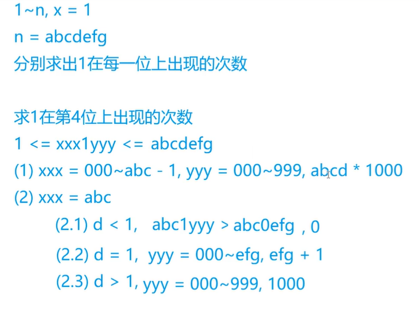

[TOC]

### 背包问题

一类特殊的线性 DP问题。

####  01 背包

0，1背包模型：  (**每件物品仅用一次**)

给定 $N$ 个物品，其中第  $i$ 个物品的体积为 $V_i$ ,价值为 $W_i$ 。有一容积为  $M$ 的背包，要求选择一些物品放入背包，使得物品总体积不超过 $M$ 的前提下，物品的总价值和**最大**。

依次考虑每个物品是否放入背包。

用 “**已经处理的物品数**”作为 DP 的  “ **阶段** ”， 以  “ **背包中已经放入的物品总体积** ”  作为附加维度 。

 

$F[i,j]$ 表示从前 $i$  个物品中选出总体积为 $j$ 的物品放入背包，物品的最大价值和。


通过 DP 状态转移方程, 每一阶段 $i$ 的状态只与上一阶段  $i-1$ 的状态有关 。使用 “滚动数组”的进行优化，降低空间开销。

```c++
int f[2][MAX_M+1];
memset(f, 0xcf, sizeof f);
f[0][0] = 0;

for(int i = 1 ; i <= n ; i++)
    for(int j = 0 ;  j <= m ; j++)
        f[i & 1][j] = f[(i-1) & 1][j];
	for(int j = v[i] ; j <= m ; j++)
        f[i & 1][j] = max(f[i & 1][j] , f[(i-1) & 1][j - v[i] + w[i]]);


int ans = 0;
for(int j = 0 ; j <= m ; j++)
    ans = max(ans, f[n & 1][j]);
```

在上面程序中，将阶段 $i$ 的状态存储在第一维下标为  $i$ & $1$ 的二维数组中，当  $i$  为奇数 时， $i$ & $1$ 

等于 1；当 $i$ 为偶数时，  $i$ & $1$  等于 0 。因此，DP 的状态就相当于在 $F[0][ ]$ 和  $F[1][]$  两个数组中

交替转移，空间复杂度从 $O(MN)$ 变成 $o(M)$ 。

分析上面代码，可以看到，在每个阶段开始时，实际上执行了一次从 $F[i-1][]$ 到 $F[i][]$ 的拷贝

操作，这提示我们可以进一步省去 $F$ 数组的第一位，只用一维数组。

**当外层循环到第 $i$ 个物品的时候， $F[j]$ 表示背包中放入总体积为 $j$ 的物品最大价值和。**

```c++
int f[MAX_M+1];
memset(f, 0xcf, sizeof f); // -INF
f[0] = 0;
for(int i = 1 ; i <= n ; i++)
    for(int j = m ; j >= v[i] ; j--)
      	f[j] = max(f[j], f[j - v[i]] + w[i]);

int ans = 0;
for(int j = 0 ; j <= m ; j ++)
    ans = max(ans, f[j]);
```

对 $j$ 倒序循环。循环到 $j$  时：

1：$F$ 数组的后半部分 $F[j \sim M]$ 处于 “第 $i$ 个阶段”，也就是已经考虑过放入 第 $i$  个物品的情况。

2：前半部分 $F[0\sim j-1]$ 处于 “第 $i-1$ 个阶段”，也就是还没有第 $i$ 个物品的更新。

接下来 $j$ 不断减小，意味着我们总用 “第 $i-1$ 个阶段”的状态向 “第 $i$ 个阶段” 的状态进行转移，符合线性 DP 的原则，进而保证第 $i$  个物品只会被放入背包。一次。如下图：


#### 2 ：01背包问题

https://www.acwing.com/problem/content/2/

```
背包的容量有限。每件物品只能放进背包一次。

特点：每件物品最多只能用一次； (使用次数 <= 1 )
```


$f[i][j]$  就表示从**前 $i$ 个物品**中选择出可以装进背包的选法集合价值的  **最大值**

```c++
#include<iostream>
#include<algorithm>
using namespace std;
const int N = 1010;
int n ,m;
int v[N],w[N];
int f[N][N];

int main(){
    cin >> n >> m;
    
    for(int i = 1 ; i <= n ; i++) cin >> v[i] >> w[i];
    
    //  二维
    for(int i = 1 ; i <= n ; i++){
        for(int j = 0 ; j <= m ; j++){
            f[i][j] = f[i-1][j];
            if(j >= v[i]) f[i][j] = max(f[i][j],f[i-1][j - v[i] ]+ w[i]);
        }
    }
    cout << f[n][m] << endl;
    return 0;
}   
// 可以优化的原因：
f[i] 只用到了 f[i-1];
j , j - v[i]  <= j;


int f[N];
// 一维
for(int i = 1 ; i <= n ; i++){ 
    for(int j = m ; j >= v[i] ; j--){  
        f[j] = max(f[j],f[j - v[i]] + w[i])     
    }
}

//  优化时注意的问题：
for(int i = 1 ; i <= n ; i++)
    for(int j = v[i] ; j <= m ; j++)
    {
        //  f[i]  是由 f[i-1] 转换过来的。  
		f[i-1][j] = f[i-1][j]; 
        // f[j] = f[j];
        
        // 由于 j 是从小到达枚举的 ，j - v[i] < j ，所以 f[j - v[i]] 已经被算过，
        // 那么这维状态就是不包含 i 的 f[i][j - v[i]] 状态。那么这就矛盾了
        // 将 j 倒序进行即可。
		f[i][j] = max(f[i-1][j],f[i][j - v[i]] + w[i]);
// f[i] = max(f[j], f[j - v[i]] + w[i]); == f[i] = max(f[i][j], f[i][j - v[i]] + w[i]);
        
    }		

```

#### 278：数字组合

https://www.acwing.com/problem/content/280/

```
N 个正整数就是 N 个物品，M 就是背包的容积。
在外层循环到 i 的时候（表示从 前 i 个数中选），设 F[j] 表示 “和为 j” 有多少种方案。
```

```c++
#include<iostream>
#include<cstring>
using namespace std;
const int N = 10010;
int n ,m;
int f[N];
int a[N];

int main()
{
    cin >> n >> m;
    for(int i = 1 ; i <= n ; i++) scanf("%d", &a[i]);
    
    memset(f, 0 , sizeof f);
    f[0] = 1;
    for(int i = 1 ; i <= n ; i++)
        for(int j = m ;  j >= a[i] ; j--)
            f[j] += f[j - a[i]];
   
   	cout << f[m] << endl;
    
    return 0;
}
```


#### 完全背包

https://www.acwing.com/problem/content/3/

```
特点：每件物品有无限个；
```


```c++
#include<iostream>
#include<algorithm>
using namespace std;
const int N = 1010;
int n,m;
int v[N], w[N];
int f[N][N];

int main(){
    cin >> n >> m;
    
    for(int i = 0 ; i <= n ; i++ ) cin >> v[i] >> w[i];
    
    //  原始状态方程，数据量的增加会超时
    for(int i = 1 ; i <= n ; i++)
        for(int j = 0 ; j <= m ; j++)
            for(int k = 0 ; k * v[i] <= j ; k++)           //  限制完全背包的r
                f[i][j] = max(f[i][j] , f[i-1][j - v[i] * k] + w[i] *k);
    
    cout << f[n][m] << endl;
    
    return 0;
}


//  优化后的状态转移方程；(二维)
for(int i = 1 ; i <= n ; i ++ )
    for(int j = 0 ; j <= m ;j++){
        f[i][j] = f[i-1][j];
        if(j >= v[i]) f[i][j] = max(f[i][j],f[i][j - v[i]] + w[i]);
    }


//  再次优化 (一维)
int f[N];
for(int i = 1 ; i <= n ; i++)
    for(int j = v[i] ; j <= m ; j++){
        f[j] = max(f[j] , f[j-v[i]] + w[i]);
    }
cout << f[m] << endl;        
    
```


#### 多重背包

https://www.acwing.com/problem/content/4/

```
特点：每个物品的个数有限制；
```


```c++
const int N = 110;
int n,m;
int v[N], w[N],s[N];
int f[N][N];

int main(){
    cin >> n >> m;
    
    for(int i = 1 ; i <= n ; i++ ) cin >> v[i] >> w[i] >> s[i];
    
    //  原始状态方程，数据量的增加会超时
    for(int i = 1 ; i <= n ; i++)
        for(int j = 0 ; j <= m ; j++)
            // 多重背包的个数的限制：k <= s[i]
            for(int k = 0 ;k <= s[i] &&  k * v[i] <= j ; k++)              
                f[i][j] = max(f[i][j] , f[i-1][j - v[i] * k] + w[i] *k);
                
    cout << f[n][m] << endl;
    
    return 0;
}    

普通优化时的问题：
f[i][j] = max(f[i-1][j] , f[i-1][j-v]+w , f[i-1][j-2v]+2w ,...,f[i-1][j-sv] + sw)
f[i][j-v]=max(         f[i-1][j-v],f[i-1][j-1]+w,...,f[i-1][j-(s-1)v]+(s-1)w + f[i-1][j-sv]+(s+1)w );  
// 最后多余的一项会使我们无法正常的转移， max() 无法使用

// 使用 二进制 来进行优化
1 , 2 , 4 , ... , 2^k , c  (c < 2^(k+1))
可以凑出 0 ~  2^(k+1) -1 的数 + c  ==  0 ~ s

```


#### 分组背包

https://www.acwing.com/problem/content/9/

```c++
特点：每一组当中每个物品最多只能有一个
```


#### 线性DP

##### 898:数字三角形

https://www.acwing.com/problem/content/900/

```
状态方程中的下标 从 1 或者 0 开始的是由 状态计算过程需要使用的数决定。
eg:  f[i - 1] 这种使用下标从 1 开始就不会出现越界问题。
```


```
           f[1][1]
      f[2][1]   f[2][2]
 f[3][1]   f[3][2]   f[3][3]
 
所以f[i][j]的左上是f[i - 1][j - 1]，右上是 f[i - 1, j]

```

```c++
//  二维 从上到下 考虑
#include<iostream>
#include<algorithm>
#include<cstring>

using namespace std;
const int N = 510;
const int INF = 1e9;

int n;
int a[N][N];
int f[N][N];


int main()
{
    cin >> n;
    
    for(int i = 1 ; i <= n; i++)
        for(int j = 1 ; j <= i ; j++)
            scanf("%d", &a[i][j]);
    
    
    for(int i = 0 ; i <= n ; i++)
        for(int j = 0 ; j <= i + 1; j++) // 右上角不存在的点也要初始化
            f[i][j] = -INF;
    
    
    f[1][1] = a[1][1];
    //  左上 和 右上 l
    for(int i = 2 ;i <= n ; i++)
        for(int j = 1 ; j <= i ;j++)
            f[i][j] = max(f[i-1][j-1]+a[i][j] , f[i-1][j] + a[i][j]);
            
    
    int res = -INF;
    for(int i = 1 ; i <= n ; i++)
        res = max(res , f[n][i]);
    
    printf("%d\n",res);
    
    
    return 0;
}
```


```c++
//  一维，从底至上 考虑
#include<iostream>
using namespace std;
const int N = 503;
int n;
int a[N][N];
int f[N];

int main()
{
    scanf("%d", &n);
    for(int i = 1;i<=n;i++)
        for(int j = 1;j<=i;j++)
            scanf("%d", &a[i][j]);
    
    for(int j = 1;j <= n;j++)
        f[j] = a[n][j];
    
    for(int i = n - 1;i>=1;i--)
        for(int j = 1;j<=i;j++)
            f[j] = a[i][j] + max(f[j],f[j+1]);

    cout << f[1] << endl;
    return 0;
}

```

##### 895:最长上升子序列

https://www.acwing.com/problem/content/897/


```c++
#include<iostream>

using namespace std;
const int N = 1010;
int n;
int a[N] , f[N];

int main()
{
    scanf("%d", &n);
    for(int i = 1 ; i <= n ; i++)
        scanf("%d", &a[i]);
    
    for(int i = 1 ; i <= n ; i++)
    {
        f[i] = 1; //  以　i 结尾的数只有 a[i] 一个
        for(int j = 1 ;  j < i ; j++)
            if(a[j] < a[i])
                f[i] = max(f[i],f[j] + 1);
    }
    
    int res = 0;
    for(int i = 1 ;i <= n ; i++)
        res = max(res , f[i]);
    
    cout << res << endl;
    
    return 0;
}
```

```c++
//  记录方案
#include<iostream>
using namespace std;
const int N = 1010;
int n;
int a[N] ,f[N] ,g[N]; //  g[N] 记录过程

int main(){
    scanf("%d",&n);
    for(int i = 1 ; i <= n ; i++)
        scanf("%d",&a[i]);
   
    for(int i = 1 ; i <= n ; i++)
    {
        f[i] = 1;
        g[i] = 0;
        for(int j = 1 ; j < i ; j++)
            if(a[j] < a[i])
                if(f[i] < f[j] + 1)
                {
                    f[i] = f[j] + 1;
                    g[i] = j; 
                }
    }
    
    int k = 1;  //  下标
    for(int i = 1 ; i <= n ; i++)
        if(f[k] < f[i])
            k = i;
    
    printf("%d\n",f[k]);
    
    for(int i = 0 , len = f[k]; i < len ; i++)
    {
        printf("%d ",a[k]);
        k = g[k];
    }
    
    return 0;
}
```

##### 896:最长上升子序列 (优化)

https://www.acwing.com/problem/content/898/

```
检查一下  上一步思想的冗余之处。
对于  不同长度的  上升子序列，序列中最后一个元素的值决定它的扩展能力。
当  较短上升子序列的最后一个值 ， 比   较长上升子序列的最后一个值还要大的时候。
那么前者就可以被淘汰。

也即： 将所以的 上升子序列的 长度 排成单调递增的时候，其对应得最后一个值而必须是 单调递增的

当满足严格的单调递增时，就可以达到 一个优化的状态

```


```c++
// 优化
#include<iostream>
using namespace std;
const int N = 100010;
int n;
int a[N];
int s[N]; //  存不同长度的  上升子序列的的结尾的最小值

int main()
{
    scanf("%d", &n);
    for (int i = 0; i < n; i ++ ) scanf("%d", &a[i]);
    
    int len = 0;
    s[0] = -2e9; //  保证 d
    for(int i = 0 ; i < n ; i++)
    {
        int l = 0 , r = len; // 寻找 小于 a[i] 的最大的数
        while(l < r)
        {
            int mid = (l + r + 1) >> 1;
            if(s[mid] < a[i]) l = mid;
            else r = mid - 1;
        }
        
        len = max(len , r + 1); //  找完之后，长度 + 1
        s[r + 1] = a[i]; //  将 该值作为 该上升子序列的 的最后一个值。
    }
        
    printf("%d",len);
    
    return 0;
}
```

```c++
//  用栈 优化
#include<iostream>
using namespace std;

const int N = 100010;
int n;
int a[N];

int st[N];
int tt = 0;

int main()
{
    scanf("%d", &n);
    for (int i = 0; i < n; i ++ ) scanf("%d", &a[i]);
    
    st[tt] = a[0];
    for(int i = 1 ; i < n ; i++)
    {
        if(a[i] > st[tt])
        {
            st[++ tt] = a[i];
        }
        else 
        {
            int l = 0 , r = tt;
            while(l < r)
            {
                int mid = (l + r) >> 1;
                if(st[mid] >= a[i]) r = mid;
                else l = mid + 1;
            }
            st[l] = a[i];
        }
    }
    
    printf("%d",tt + 1);
    return 0;
}
```


##### 897:最长公共子序列

https://www.acwing.com/problem/content/899/


```
f[i - 1][j - 1] 这种情况是包含在 f[i-1][j] 和 f[i][j-1] 这两种情况之中。

```

```c++
#include<iostream>
#include<cstring>
using namespace std;
const int N = 1010;
int n ,m;
char a[N], b[N];
int f[N][N];

int main()
{
    scanf("%d%d",&n,&m);
    scanf("%s%s",a + 1 ,b + 1);
    
    for(int i = 1 ; i <= n ; i++)
        for(int j = 1 ; j <= m ; j++)
        {
            f[i][j] = max(f[i - 1][j],f[i][j-1]);
            if(a[i] == b[j])
                f[i][j] = max(f[i][j],f[i-1][j-1] + 1);
            
        }

    printf("%d",f[n][m]);
    
    return 0;
}
```

##### 902:最短编辑距离

https://www.acwing.com/problem/content/904/


```c++
#include<iostream>
using namespace std;

const int N = 1010;
int n ,m;
char a[N] , b[N];
int f[N][N];

int main()
{
    scanf("%d%s", &n , a + 1);
    scanf("%d%s", &m , b + 1);
    
    //  处理边界
    //  用 a 的前 0 个 字母去匹配 b 的前 i 个字母 的时候，只能用 添加操作，做 m 次添加
    for (int i = 0 ; i <= m ; i++  ) f[0][i] = i; 
    //  用 a 的前 i 个 字母去匹配 b 的前 0 个字母 的时候，只能用 删除操作，做 n 次删除
    for (int i = 0 ; i <= n ; i ++ ) f[i][0] = i;
    
    for(int i = 1 ; i <= n ; i++)
    {
        for(int j = 1 ; j <= m ; j++)
        {
            f[i][j] = min(f[i-1][j] + 1 , f[i][j-1] + 1);
            if(a[i] == b[j]) 
                f[i][j] = min(f[i][j] , f[i-1][j-1]);
            else f[i][j] = min(f[i][j] , f[i-1][j-1] + 1);
        }
    }
    
    printf("%d\n",f[n][m]);
    
    return 0;
}

```

899:编辑距离

https://www.acwing.com/problem/content/901/

```


```


#### 区间DP


##### 282:石子合并

https://www.acwing.com/problem/content/284/

```
1 ： 当要合并 端点 l , r 之间的果子，就必须要将 区间 [l , r] 之间的果子都合并。
使用前缀和来 计算   区间 [l , r] 之间合并所需要代价。

2： 一定存在一个 整数 k(l <= k <= r) 在这对石子形成之前，先有 区间 [l ,k] 被合并为一堆，
再有 区间 [k + 1 , r] 堆石子被合并。然后 才有  两堆石子合并成 [l , r]

```


```c++
#include<iostream>
#include<cstring>
using namespace std;
const int N = 310;

int n;
int a[N];
int f[N][N];
int sum[N];

int main()
{
    scanf("%d", &n);
    for(int i = 1 ; i <= n ; i++)
        scanf("%d", &a[i]);
        
    for(int i = 1 ; i <= n ; i++) //  求前缀和
    {
        f[i][i] = 0;
        sum[i] = sum[i-1] + a[i];
    }
    
    for(int len = 2 ; len <= n ; len ++)
        for(int l = 1 ; l  <= n - len + 1 ; l++)
        {
            int r = l + len - 1;
            
            f[l][r] = 1e8; //  初始化为较大值
            
            for(int k = l ; k < r ; k++)
                f[l][r] = min(f[l][r],f[l][k] + f[k+1][r]);
            
            f[l][r] += sum[r] - sum[l-1];
        }
    
    printf("%d\n",f[1][n]);
    
    return 0;
}
```

```c++
#include<iostream>
#include<cstring>
using namespace std;

const int N = 310;

int n;
int s[N];
int f[N][N];

int main()
{
    scanf("%d", &n);
    for(int i = 1 ; i <= n ; i++)
        scanf("%d", &s[i]);
        
    for(int i = 1 ; i <= n ; i++) s[i] += s[i-1];
    
    
    for(int len = 2 ; len <= n ; len ++)
        for(int l = 1 ; l  <= n - len + 1 ; l++)
        {
            int r = l + len - 1;
            
            f[l][r] = 1e8;
            
            for(int k = l ; k < r ; k++)
                f[l][r] = min(f[l][r],f[l][k] + f[k+1][r] + s[r] - s[l-1]);
        }
    
    printf("%d\n",f[1][n]);
    
    
    return 0;
}
```

#### 计数类 DP

##### 900:整数划分

https://www.acwing.com/problem/content/902/

```
完全背包做法：
	n 是背包的容量， 物品的体积是 1 ~ n， 每种物品有无限个。
	求解的是恰好装满背包的方案数。
```

```c++
#include<iostream>
#include<algorithm>
using namespace std;

const int N = 1010 , mod = 1e9 + 7;

int n;
int f[N];

int main()
{
    cin >> n;
    
    f[0] = 1;
    for(int i = 1 ; i <= n ; i++)
        for(int j = i ; j <= n ; j++)
            f[j] = (f[j] + f[j - i]) % mod;
            
    cout << f[n] << endl;
    return 0;
}
```

```
计数 DP写法：

```


```c++
 


```


#### 数位统计 DP


##### 338:计数问题

https://www.acwing.com/problem/content/340/

**重点是 分情况讨论 ！**

```
[a , b]  0 ~ 9
 
实现一个函数 count(n , x)   统计 1 ~ n 中 x 出现的次数

然后通过 “前缀和”思想 求某个区间中  x 出现的次数
count(b ,x) - count(a - 1 , x )   统计 (a, b)中 x 出现的次数。

```




#### 状态压缩 DP

动态规划的过程是随着“阶段”的增长，在每个状态维度上不断扩展的。在任意时刻，已经求出最优解的状态与尚未求出最优解的状态在各维度上的分界点组成DP 扩展的“轮廓”。对于某些问题，我们需要在动态规划的 “状态” 中记录一个集合，保存这个 ”轮廓“的详细信息，以便进行状态转移。若集合大小不超过 N ， 集合中每个元素都是小于 K 的自然数，则我们可以把这个集合看作一个 N 位 K 进制数。

以一个 [ 0 , K^N -  1] 之间的十进制整数的形式作为  DP状态集合的一维。

这种**把集合转化为整数记录在 DP 状态中**的一类算法，被称为  **状态压缩 DP**。

##### 291：蒙德里安德梦想

https://www.acwing.com/problem/content/293/


