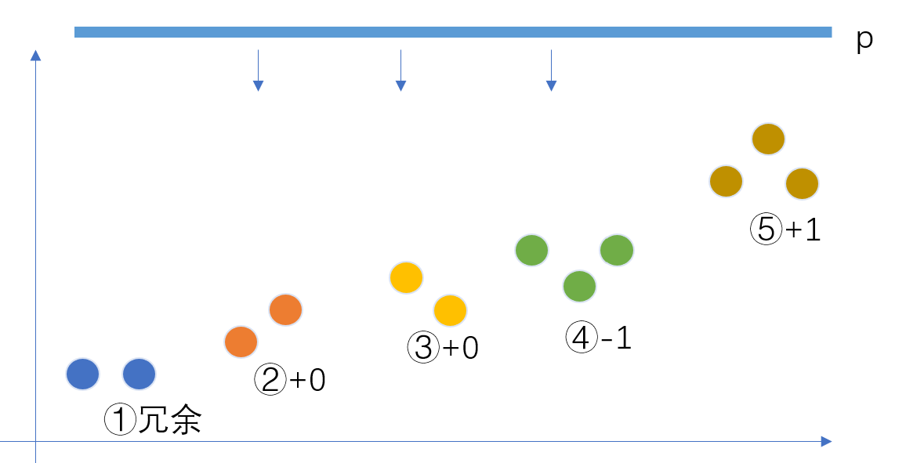
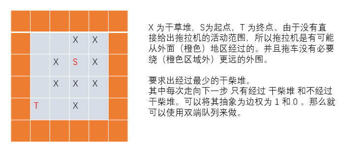
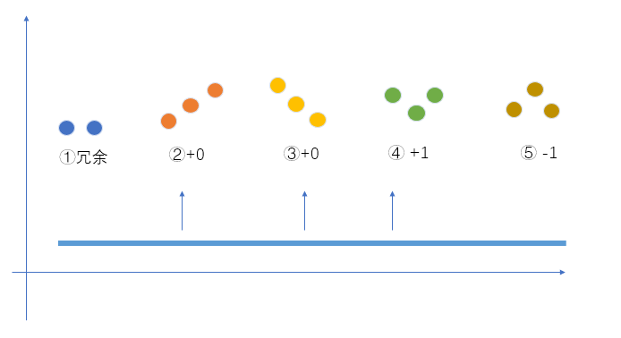
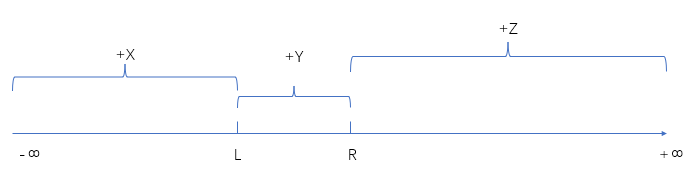
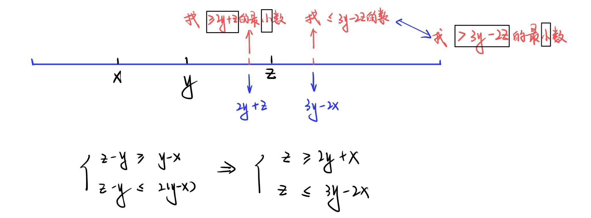
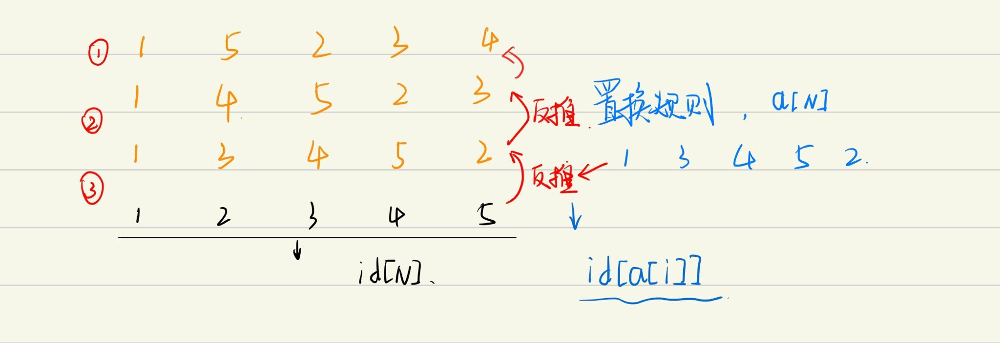

[TOC]

#### 尼文数

https://zoj.pintia.cn/problem-sets/91827364500/problems/91827364653

##### 任意进制数字转换为十进制

$\sum_{i=0}^{k}x_i * b^i$    $k$ 为数的位数，$b$ 为任意进制。其结果就是十进制数。

根据秦九韶算法：
$$
f(x) = a_nx^n + a_{n-1}x^{n-1} + ... + a_1x + a_0
$$

$$
=(...((a_nx + a_{n-1})x)+a_{n-2})x+...+a_1)x+a_0
$$

那么就可以使用迭代的方式来求。

要注意是**从最高项向外迭代**，所以要从数字的最高位开始迭代计算。

```c++
// 输入进制和字符串  转 十进制数字：
string s;
int b;

cin >> b >> s;

int num = 0;

for(int i = 0 ; i < s.size() ; i++) // 这里的s[0] 为数字最高项
{
	num = (s[i] - '0') + num * b;
}
```


```c++
#include <stdio.h>
#include <cstring>
#include <iostream>
using namespace std;

string s;

int main()
{
    int t, b;
    scanf("%d", &t);
    while(t--) {
        while(~scanf("%d", &b) && b) {
            int sum = 0, num = 0, i;
            cin >> s;
            for(i = 0; i < s.size(); i++) {
                sum += s[i] - '0';
                num = num * b + s[i] - '0';
            }
            printf("%s\n", num % sum == 0 ? "yes" : "no");
        }
        if(t) printf("\n");
    }
    return 0;
}
```


#### 第 k 个除数

https://www.acwing.com/problem/content/description/3786/

```
n 的数据范围在  10^15 次方， 不能直接暴力的 遍历 n。
并且会爆 int ，使用 long long 来存储。

注意题目描述：
	可与 整数 n 的第 k 小正整数。
	整数 n ，n 是做为被除数。
	
	可以整除 n 的数集是指 n 的所有约数。
	n / i == 整数， 指的是  n  可以整除以  i

通过试除法找到 所有的约数。
数据范围 最大在  sqrt(10^15) 。这样就不会 TLE了。   o(sqrt(n))
因为找 第 k 个数，将其 排序后找出即可。 o(nlogn)

```

```c++
#include <bits/stdc++.h>
using namespace std;
typedef long long ll;

int main() {
    ll n, k;
    cin >> n >> k;

    vector<ll> v;

    for(ll i = 1; i <= n / i; i++) { 
        if(n % i == 0) {
            v.push_back(i);
            if(i != n / i) v.push_back(n / i);
        }
    }

    sort(v.begin(), v.end());

    if(k > v.size()) cout << -1 << endl;
    else cout << v[k - 1];

}
```

#### A+B

https://www.acwing.com/problem/content/description/3609/

```
char             -128 ~ +127        (1 Byte)
short             -32767 ~ + 32768    (2 Bytes)
unsigned short     0 ~ 65536        (2 Bytes)
int             -2147483648 ~ +2147483647   (4 Bytes)
unsigned int         0 ~ 4294967295    (4 Bytes)
long == int
long long         -9223372036854775808 ~ +9223372036854775807    (8 Bytes)
double         1.7 * 10^308        (8 Bytes)
```

```c++
// 预处理字符串： 
//  字符串转数字    -999,999,999 -->  -999999999
int int_to_string(string s)
{
    int front = 1 , i = 0;
    if(s[0] == '-') front = -1 , i++; //  负数处理
    
    int res = 0;
    while(i < s.size()){
        if(s[i] != ',') res = res * 10 + (s[i] - '0');
    	i++;
    }
    return res * front;
}
```

```c++
#include <iostream>
#include <sstream>   //  字符流
using namespace std;

int str2int(string s) {
    int a = 0, minus = 1, i = 0;
    if (s[0] == '-') {
        minus = -1;
        i = 1;
    }
    while (i < s.size()) {
        if (s[i] != ',') {
            a = a * 10 + (s[i] - '0');
        }
        i++;
    }
    return a * minus;
}

int main() {
    string str;
    while (getline(cin, str)) {
        stringstream ssin(str);  //  字符流加速
        
        string str1, str2;
        ssin >> str1 >> str2;

        cout << (str2int(str1) + str2int(str2)) << endl;
    }
    return 0;
}

```

#### 最长&最短文本

https://www.acwing.com/problem/content/description/3616/

```
map 的使用
```

```c++
#include <vector>
#include <iostream>
#include <map>
using namespace std;

map<int , vector<string>> mp;

int main()
{
    string str;
    while(cin >> str)
        mp[str.size()].emplace_back(str);
    
    
    for(auto i : mp.begin() -> second)
        cout << i << endl;
    
    auto it = mp.end();
    it--;
    for(auto i :  it -> second)
        cout << i << endl;
    
    
    return 0;
}

```


#### 数组推导

https://www.acwing.com/problem/content/4009/

$B_i = max \{ A_1 ,A2 , ... , A_i \}$

求  $MaxSum $ 时， 因为 $B_i$ 是前缀最大值。 要求预测的 $A_1 ... A_n$ 的最大值。

所以 $MaxSum$ 就是  $B_1 ... B_n $ 的和。

求 $MinSum$  时我们只需要求解拐点的和，其他的值全置为 $0$ 即可。

$b[i] > b[i-1]$ 时， $b[i]$  为拐点。

```c++
#include<iostream>
using namespace std;
const int N = 100010;
int n;
int b[N];
int main()
{
    cin >> n;
    for(int i = 0 ; i < n ; i++) cin >> b[i];
    
    int maxs = 0 ,mins = 0;
    for(int i = 0 ; i < n ; i++)
    {
        maxs += b[i];
        if(!i || b[i] > b[i-1])
            mins += b[i];
    }
    
    cout << maxs << endl << mins << endl;
    return 0;
}
```

#### 非零段划分

https://www.acwing.com/problem/content/4010/



```
从最高处向下取 p。
1：相邻山峰，对同一 P 下的山峰数无影响。所以先将整个数组去重。
2，3：延长左右山峰，山峰数不变
4：出现低谷，山峰数 – 1
5：出现山峰，山峰数 +1
```

```c++
#include<bits/stdc++.h>
using namespace std;
const int N = 500010 , M = 10010;

int n;
int a[N];
int cnt[N];

int main()
{
    scanf("%d", &n);
    for (int i = 1; i <= n; i ++ ) scanf("%d", &a[i]);
    
    n = unique(a + 1 , a + 1 + n) - (a + 1);
    a[0] = a[n + 1] = 0;
    
    for(int i = 1 ; i <= n ; i++)
    {
        int x = a[i - 1] , y = a[i] , z = a[i + 1];
        if(x < y && z < y) cnt[y]++;
        else if(x > y && z > y) cnt[y]--;
    }
    
    int res = 0 , sum = 0;
    for(int i = M - 1 ; i ; i--)
    {
        sum += cnt[i];
        res = max(res , sum);
    }
    printf("%d\n",res);
    return 0;
}
```

#### 1969：品种邻近 

https://www.acwing.com/problem/content/1971/

根据题意我们要找出在连续的输入数字中距离不超过 `k` 的两个相同数字来。可以用双指针或者滑动窗口来做。用滑动窗口的话。可以维护队列，队列元素始终为 `k` 个。

```c++
#include<iostream>
#include<cstring>
#include<algorithm>
#include<queue>
using namespace std;
const int M = 1000010;
int cnt[M];
int n, k;

int main()
{
    scanf("%d%d", &n, &k);
    
    int res = -1;
    queue<int> q;
    for(int i = 0 ; i < n ; i++)
    {
        int id;
        scanf("%d", &id);
        
        // 当前滑动窗口中有这个数字。
        if(cnt[id] > 0) res = max(res , id); 
        cnt[id]++; 
        
        q.push(id); //  入队
        
        if(q.size() > k) // 超过滑动窗口的长度限制c
        {
            cnt[q.front()] --;
            q.pop();
        }
    }
    printf("%d\n",res);
    return 0;
}
```

#### 2058:笨拙的手指

https://www.acwing.com/problem/content/2060/

数据范围是 $[0,10^9]$ ，输入的数据是二进制和三进制，分别有一位错误。$10^9$ 的大概是 $2^{32}$ , 或者 $3^{20}$ 

因为只有一位不同，所以可以直接枚举。不同的位。 将他们转化为十进制的时间复杂度是 $o(logn)$ 

所以直接枚举就行。枚举的时候可将数据存储在哈希表中，方便在其中**快速查找**。`unordered_set`

位运算：因为使用 string 读入，所以是字符， ‘0’ 是 48 , ‘1’ 是49。 可直接使用异或运算。

相同为 $0$ ,相异为 $1$ 。即有： `0 ^ 1 = 1` , `1 ^ 1 = 0`

```c++
#include<bits/stdc++.h>
using namespace std;

int ToD(string a, int b)
{
    int num = 0;
    for(auto c : a)
    {
        num = num * b + c - '0';
    }
    return num;
}

int main()
{
    string a, b;
    cin >> a >> b;
    
    unordered_set<int> SA;
    
    for(auto& c :  a)  //  每次只改一位
    {
        c ^= 1;
        SA.insert(ToD(a , 2));
        c ^= 1;
    }
    
    for(auto& c :  b) // 使用引用才能在 增强 for 循环中改变 b, 不然只是拿出去遍历
    {
        char t = c;
        for(int i = 0 ; i < 3 ; i++)
            if(i + '0' != t) // 当前数字和不一样
            {
                c = i + '0'; // 就将其变成 该数字
                int x = ToD(b, 3);
                if(SA.count(x))
                {
                    cout << x << endl;
                    return 0;
                }
            }
        c = t;
    }
    
    
    return 0;
}
```

#### 2041：干草堆

https://www.acwing.com/problem/content/2043/

**基础算法：差分**

```c++
#include<bits/stdc++.h>
using namespace std;
const int N = 1000010;
int n, k;
int a[N];

int main()
{
    scanf("%d%d", &n, &k);
    
    while(k--)
    {
        int l ,r;
        scanf("%d%d", &l, &r);
        a[l]++ , a[r + 1]--;
    }
    
    // 求差分数组的前缀和，也就是原数组。
    for(int i = 1 ; i <= n ; i++) a[i] += a[i - 1];

    // sort(a + 1 , a + 1 + n);
    
    // 直接使用库函数，其原理是 快排的变形。
    nth_element(a + 1, a + n / 2 + 1 , a + 1 + n);
    
    printf("%d\n" , a[n / 2 + 1]);

    return 0;
}
```

#### 2060：奶牛选美

https://www.acwing.com/problem/content/2062/

思路：先使用 Flood Fill 算法，求得连通块中点的坐标，然后去求两个连通块中任意两点的曼哈顿距离，取最小即可，注意曼哈顿距离 $- 1$ 。

```c++
#include<bits/stdc++.h>
#define x first
#define y second
using namespace std;
const int N = 55;
typedef pair<int, int> PII; // 存坐标

int n, m;
char g[N][N];
vector<PII> points[2];

int dx[4] = {-1 , 0 , 1 , 0 } , dy[4] = {0 , 1 , 0 , -1};

// Flood Fill DFS
void dfs(int x ,int y ,vector<PII>& ps)
{
    g[x][y] = '.'; //  已经搜过 X , 就将其变成 '.'
    ps.emplace_back(x , y);
    
    for(int i = 0 ; i < 4 ; i++)
    {
        int a = x + dx[i] , b = y + dy[i];
        if (a < 0 || a >= n || b < 0 || b >= m || g[a][b] != 'X') continue;
        dfs(a, b, ps);
    }
}

int main()
{
    scanf("%d%d", &n, &m);
    
    for (int i = 0; i < n; i ++ ) scanf("%s", g[i]);
    for(int i = 0 , k = 0; i < n ; i++)
        for(int j = 0 ; j < m ; j++)
            if(g[i][j] == 'X')
                dfs(i, j , points[k++]);
                
    
    int res = 1e8;
    for(auto& a : points[0])
        for(auto& b : points[1])
            res = min(res , abs(a.x - b.x) + abs(a.y - b.y) - 1);
            
    printf("%d\n",res);
    
    return 0;
}
```


#### 2019：拖拉机

https://www.acwing.com/problem/content/2021/



```c++
#include<bits/stdc++.h>
#define x first
#define y second
using namespace std;
typedef pair<int, int> PII;
const int N = 1010;
int n;
bool g[N][N];
int dist[N][N];
bool st[N][N];
int dx[4] = {-1 , 0 , 1 , 0} , dy[4] = {0 , 1,  0 , -1}; // 上右下左的顺序

int bfs(int sx, int sy)
{
    deque<PII> q;
    q.push_back({sx, sy});
    memset(dist , 0x3f , sizeof dist);
    dist[sx][sy] = 0;
    
    while(q.size())
    {
        auto t = q.front();
        q.pop_front();
        
        if(st[t.x][t.y]) continue;
        st[t.x][t.y] = 1;
        
        if(!t.x && !t.y) break; // 如果已经走到终点，直接退出就行
        
        for(int i = 0 ; i < 4 ; i++)
        {
            int x = t.x + dx[i] , y = t.y + dy[i];
            if(x >= 0 && x <= 1001 && y >= 0 && y <= 1001 )
            {
                int w = 0;
                if(g[x][y]) w = 1;
                if(dist[x][y] > dist[t.x][t.y] + w)
                {
                    dist[x][y] = dist[t.x][t.y] + w;
                    if(!w) q.push_front({x, y});
                    else q.push_back({x, y});
                }
            }
        }
        
    }
    return dist[0][0];
}

int main()
{
    int sx , sy;
    scanf("%d%d%d", &n , &sx , &sy);
    while(n--)
    {
        int x, y;
        scanf("%d%d", &x, &y);
        g[x][y] = 1;
    }
    
    printf("%d\n",bfs(sx, sy));
    
    return 0;
}
```

#### 2014：岛

https://www.acwing.com/problem/content/2016/



岛的情况一共有上述五种情况，其中第 ① 种情况中，连续的相等的平面对于岛屿的数量是一样的，所以可以用离散化将重复的删掉即可。

```c++
#include<bits/stdc++.h>
#define x first
#define y second
using namespace std;
typedef pair<int, int> PII;
const int N = 100010;
int n;
int h[N];
PII q[N];

int main()
{
    scanf("%d", &n);
    for(int i = 1 ; i <= n ; i++) scanf("%d", &h[i]);
    
    n = unique(h + 1, h + 1 + n) - h - 1; // 判重
    // 后续代码可能会用到第n + 1个位置，需要把第n + 1个位置清空
    // 后续每次需要判断 三个位置的元素，所以需要这里需要清空
    h[n + 1] = 0;  
    
    for(int i = 1 ; i <= n ; i++) q[i] = {h[i] , i};
    
    sort(q + 1 , q + n + 1);
    
    int res = 1 , cnt = 1;
    for(int i = 1 ; i <= n ; i++)
    {
        int k = q[i].y;
        if(h[k - 1] < h[k] && h[k + 1] < h[k]) cnt--;
        else if(h[k-1] > h[k] && h[k + 1] > h[k]) cnt++;
        
        // 相同高度中，b最后一个高度被淹没才可去取。
        if(q[i].x != q[i + 1].x)
            res = max(res, cnt);
    }
    printf("%d\n",res);
    
    return 0;
}
```

#### 1952：金发姑娘和 N 头牛

https://www.acwing.com/problem/content/1954/

数据范围在 $-10^9$ ~ $10^9$ ,然后点数大概是 $20000 * 2$ ,所以要使用离散化。



每头奶牛对应一个区间，$n$ 个奶牛对应 $n$ 个区间 , 因为要计算是的所有奶牛的产量之和。

构造差分数组，然后在每个 区间输入 之后直接作用差分数组。

```
(-INF , L - 1]  ==>  b[-INF] += x ,  b[L + 1] -= x;
[L , R]         ==>  b[L] += y    ,  b[R + 1] -= y;
[R + 1, INF]    ==>  b[R + 1] += z , b[INF + 1] -= z;

综上：
        b[-INF] += x;
        b[l] += y - x;
        b[r + 1] += z - y;
        b[INF] -= z;
```

使用 `map` 的话，因为 `map`本身是平衡二叉树，然后会帮助我们自动离散化，但是对 `map`的操作是 $O(logn)$ 级别的。会增加时间复杂度。

```c++
#include<bits/stdc++.h>
using namespace std;
const int INF = 2e9;

int n, x, y, z;

int main()
{
    // 使用 map 做差分数组. 第一个 int 是对应每头牛的编号
    // 第二个 int 对应的是其产的牛奶
    map<int ,int> b; 
    
    scanf("%d%d%d%d", &n, &x, &y, &z);
    
    while(n--)
    {
        int l, r;
        scanf("%d%d", &l, &r);
        b[-INF] += x;
        b[l] += y - x;
        b[r + 1] += z - y;
        b[INF] -= z;
    }
    
    int res = 0 , sum = 0;
    for(auto& [k, v] : b) // 求差分数组的前缀和
    {
        sum += v;
        res = max(res , sum);
    }
    
    printf("%d\n", res);
    return 0;
}
```

手动实现离散化

```c++
#include<bits/stdc++.h>
using namespace std;
const int N = 20010 , INF = 2e9;

int n, x, y, z;
int l[N] , r[N] , b[N * 2];
vector<int> a;

int find(int x)
{
    int l = 0 , r = a.size() - 1;
    while(l < r)
    {
        int mid = l + r >> 1;
        if(a[mid] >= x) r = mid;
        else l = mid + 1;
    }
    return l;
}

int main()
{
    
    scanf("%d%d%d%d", &n, &x, &y, &z);
    
    a.emplace_back(-INF);
    for(int i = 0 ; i < n ; i++)
    {
        scanf("%d%d", &l[i], &r[i]);
        a.emplace_back(l[i]);
        a.emplace_back(r[i] + 1);
    }
    
    sort(a.begin() , a.end());
    a.erase(unique(a.begin() , a.end()) , a.end());
    
    for(int i = 0 ; i < n ; i++)
    {
        int L = find(l[i]) , R = find(r[i] + 1);
        b[0] += x;
        b[L] += y - x;
        b[R] += z - y;
        b[a.size() - 1] -= z;
    }
    
    int res = 0 , sum = 0;
    for(int i = 0 ; i < a.size() - 1 ; i++)
    {
        sum += b[i];
        res = max(sum , res);
    }
    
    printf("%d\n", res);
    return 0;
}
```

#### 1945：奶牛棒球

https://www.acwing.com/problem/content/1947/

**使用双指针算法的前提： **  时间复杂度 $O(N)$

当且仅当两个指针都是单调的：其中一个指针向后移动时，另一个指针是否是 单调的移动（要么一直向前走，要么一直向后走）



```c++
#include<bits/stdc++.h>
using namespace std;
const int N = 1010;
int n;
int p[N];

int main()
{
    scanf("%d",&n);
    for(int i = 0 ; i < n ; i++) scanf("%d",&p[i]);

    sort(p , p + n);

    int res = 0;
    for(int i = 0 ; i < n + 2 ; i++)
        for(int j = i + 1 , l = j + 1, r = j + 1 ;j + 1 < n ; j++)
        {
            while(l < n && p[l] - p[j] < p[j] - p[i]) l++;
            while(r < n && p[r] - p[j] <= 2 * (p[j] - p[i])) r++;
            res += r - l;
        }
    printf("%d\n", res);

    return 0;
}

```

二分： $O(N^2logN)$

```c++
#include <bits/stdc++.h>
using namespace std;
int n, res= 0;
vector<int> a;
int main ()
{
    cin >> n;
    for (int & x : a) cin >> x;
    
    sort(a.begin(), a.end());
    
    for (int i = 0; i < n; i ++ )
        for (int j = i + 1; j < n; j ++ )
            res += upper_bound(a.begin(), a.end(), 3 * a[j] - 2 * a[i]) - lower_bound(a.begin(), a.end(), 2 * a[j] - a[i]);
    
    cout << res << endl;
    return 0;
}
```

#### 1922: 懒惰的牛

https://www.acwing.com/problem/content/description/1924/

```c++
#include<bits/stdc++.h>
#define x first
#define y second

using namespace std;
typedef pair<int, int> PII;
const int N = 100010;
int n, m;
PII q[N];

int main()
{
    scanf("%d%d", &n, &m);
    for(int i = 0 ; i < n ; i++) scanf("%d%d", &q[i].y , &q[i].x);
    
    sort(q , q + n);
    
    int res = 0 , sum = 0;
    for(int i = 0 , j = 0; i < n ; i++)
    {
        sum += q[i].y;
        //  将区间控制在 [i , 2i] 之间
        while(q[i].x - q[j].x > m * 2) sum -= q[j++].y;
        res = max(res, sum);
    }
    printf("%d\n", res);
    
    return 0;
}
```

#### 1913：公平摄影

https://www.acwing.com/problem/content/1915/

题解 ： https://www.acwing.com/solution/content/85577/

首先：注意题目中的希望二字，并不是绝对。照片中的牛的种类情况分为三种：

1. 全是 第一种 品种
2. 全是 第二种 品种。
3. 第一种和第二种品种数量是相同的。

怎样快速的判断这个 区间 是合法的呢 ？ 

设品种 `G = 1` , `H = -1`  , 那么当 **区间和 == $0$** 时就是合法的情况。要求区间和使用前缀和即可。

首先解决第 $1,2$ 种情况，其都必是连续的区间，可以使用双指针扫一遍。

也可以记录一个  `last` 记录前一个位置上的种类。

- 如果前一个位置上的种类和当前位置的种类不相同，那么用当前位置 替换 `last` , 这样就能把连续区间的起始坐标记住，便于求解 位置之差。

然后是第三种情况：

由于区间和是  $S[r] - S[l-1]$ , 而我们求的是 距离，所以希望在满足区间条件的同时 ，  $r$ 固定时， $l$

越小越好，对于 区间和 $S[r] - S[l-1]$ ，我们求解距离是 $x[r] - x[l]$。 要注意的时此时的  $i$ 在前缀和上是开区间，而此时是闭区间。没有直接对应上。可以将其映射为 $S[r] - S'[l]$,这里的 $S'[l] = w_1+...+w_{l-1}$ , $w$ 是指品种。

那么现在的问题就转换为寻找使得在  $1$ ~  $r$ 上 $s[r] - s'[j] == 0$ 时，最小的 $l$ 时多少。

```c++
#include<bits/stdc++.h>
#define x first
#define y second
using namespace std;
typedef pair<int, int> PII;
const int N = 100010;
int n;
PII q[N];

int main()
{
    scanf("%d", &n);
    for(int i = 1 ; i <= n ; i++)
    {
        int x;
        char str[2];
        scanf("%d%s", &x, str);
        if(*str == 'G') q[i] = {x , 1};
        else q[i] = {x, -1};
    }
    
    sort(q + 1  , q + 1 + n);
    unordered_map<int,int> h;
    int res = 0 , sum = 0 , last;
    for(int i = 1 ; i <= n ; i++)
    {
        // 记录第一次最早出现的位置
        if(!h.count(sum)) h[sum] = q[i].x;
        sum += q[i].y;
        //  寻找第一次最早出现的位置
        if(h.count(sum)) res = max(res , q[i].x - h[sum]);
        
        if(i == 1 || q[i].y != q[i - 1].y) last = q[i].x;
        res = max(res , q[i].x - last);
    }
    
    printf("%d\n" , res);
    
    return 0;
}
```

#### 1904：奶牛慢跑

https://www.acwing.com/problem/content/1906/

$x_i < x_j$ ，当  $v_i$ > $v_j$ 时，$i$ 会追尾 $j$ 。

第 $i$ 头牛会不会追尾 $j$ 所在的队伍等价于 $v_i$ 是否 `<=`  以 $j$   为队尾队伍的  $v_{min}$。

判断有多少个队伍等价于判断有多少个队长，判断队长等价于判断该队长会不会追尾前面的牛，等价于判断该队长速度是不是大于它前面队伍中 牛速度的最小值。

```c++
#include<bits/stdc++.h>
using namespace std;
const int N = 100010;
int n;
int v[N];

int main()
{
    scanf("%d", &n);
    for(int i = 0 ; i < n ; i++) scanf("%*d%d", &v[i]);
    
    int ans = 0;
    int vmin = 2e9;
    //  从大到小枚举最小值，然后不断更新 vmin 
    for(int i = n - 1 ; i >= 0 ; i--)
    {
        if(v[i] <= vmin){
            ans ++;
            vmin = v[i];
        }
    }
    printf("%d\n" , ans);
    
    return 0;
}
```

#### 1875：贝茜的报复

https://www.acwing.com/problem/content/1877/

这里只是判断结果的 奇偶性。并不计算结果。所以枚举所有的情况即可，一个 $7$ 个字母，，每个字母的数组有 奇偶两种情况。共有 $2^7$ 种结果。

所以直接枚举数字  $0$ ~ $127$ 即可，再用  `i >> j & 1` 

要使 `(B + I + S + S + E + E)*(G + O + E + S)*(M + O + O)` 为偶数，

即 `(B + I + S + S + E + E)*(G + O + E + S)*(M + O + O) % 2 == 0`

化简后为 `(B + I)*(G + O + E + S)*(M) % 2 == 0`

只要乘积只要有一个是偶数，结果就是偶数。

**二进制**

```c++
#include<bits/stdc++.h>
using namespace std;

int n;
char str[] = "BESIGOM";
unordered_map<char , int> mp[2]; // 存储每个字母 是奇数 和 是偶数的个数
unordered_map<char , int> v;
int ans = 0;

int main()
{   
    cin >> n;
    while (n -- )
    {
        char c;
        int x;
        cin >> c >> x;
        if(x % 2 == 0) mp[0][c]++;
        else mp[1][c]++;
    }
    
    for(int i = 0 ; i < 1 << 7 ; i++)
    {
        for(int j = 0 ; j < 7 ; j++)
            v[str[j]] = i >> j & 1;
        
        
        if((v['B']+v['I']) * (v['G']+v['O']+v['E']+v['S']) * v['M'] % 2 == 0)
        {
            int sum = 1;
            for(int j = 0 ; j < 7 ; j++)
                sum *= mp[i >> j & 1][str[j]];
            ans += sum;
        }
    }
    
    
    printf("%d\n" , ans);
    
    return 0;
}
```

**DFS**

```c++
#include<bits/stdc++.h>
using namespace std;

int n;
char str[] = "BESIGOM";
unordered_map<char , int> mp[2]; // 存储每个字母 是奇数 和 是偶数的个数
unordered_map<char , int> v;
int ans = 0;

// u 表示枚举到第几个字母， x 表示这个字母这个取值下
void dfs(int u , int x)
{
    if(u == 7)
    {
        if((v['B'] + v['I']) % 2 && (v['G'] + v['O'] + v['E'] + v['S']) % 2 && v['M'] % 2) return;
        ans += x;
        return;
    }
    
    char ch = str[u];
    v[ch] = 1 , dfs(u + 1 , x * mp[1][ch]);
    v[ch] = 0 , dfs(u + 1 , x * mp[0][ch]);
}

int main()
{   
    cin >> n;
    while (n -- )
    {
        char c;
        int x;
        cin >> c >> x;
        if(x % 2 == 0) mp[0][c]++;
        else mp[1][c]++;
    }
    
    dfs(0 , 1);
    
    printf("%d\n" , ans);
    
    return 0;
}
```

#### 1801：蹄子剪刀布

https://www.acwing.com/problem/content/1803/

本题思路简单，但是注意在**枚举两头牛所作手势**的时候保持一种规则。

```c++
#include<bits/stdc++.h>
using namespace std;
const int N = 105;
int n;
int a[N] , b[N];
int win[4];
bool v[N];
int ans;
/*
    对于 a[N] 枚举出一套赢它的规则，
    只要 b[N] == win[a[n]] 即可。
    
    首先 不存在一赢多现象，即：它们三个互相克制。
    这才保证可以去通过 b[N] == win[a[N]] 去判断输赢
    
    注意数字相等是平局，只枚举不同的即可。
    
    本质只有两个分支
    win[1] = 2 , win[2] = 3 , win[3] = 1;
    win[1] = 3 , win[2] = 1 , win[3] = 2;
*/

void dfs(int u){
    if(u == 4){
        int num = 0;
        for(int i = 0 ; i < n ; i++){
            if(win[a[i]] == b[i]) num ++;
        }
        ans = max(ans , num);
        return;
    }
    
    for(int i = 1 ; i <= 3 ; i++){
        if(u != i && !v[i]){
            v[i] = 1;
            win[u] = i;
            dfs(u + 1);
            v[i] = 0;
        }
    }
}

int main()
{
    scanf("%d", &n);
    for (int i = 0; i < n; i ++ ) cin >> a[i] >> b[i];
    
    dfs(1);
    cout << ans;
   
    return 0;
}
```

继续观察上面的两个分支

```
    win[1] = 2 , win[2] = 3 , win[3] = 1;
    win[1] = 3 , win[2] = 1 , win[3] = 2;
```

两种情况分别中的核心是 数字相邻（不相等）和相邻后前后数字大小关系 的两种情况：

- 前者大于后者并相邻
- 后者大于前者并相邻

注意这里 1 , 3 相邻，类似循环队列的机制。

将数字 1, 2, 3 映射成 0 , 1, 2。就可以通过 $(x+1)\%3$ 获取 $x$ 的下一个手势。

```c++
#include<bits/stdc++.h>
using namespace std;

int main()
{
    int  n;
    cin >> n;
    int ans1 = 0 , ans2 = 0;
    for (int i = 0; i < n; i ++ ){
        int a , b;
        cin >> a >> b;
        a-- , b--;
        if(a == (b + 1) % 3) ans1++;
        if((a + 1) % 3 == b) ans2++;
    }
    
    cout << max(ans1 , ans2) << endl;
    
    return 0;
}
```

#### 1789：牛为什么过马路 II

https://www.acwing.com/problem/content/1791/

枚举相同字母之间的字母的下标位置关系即可。

```c++
#include<bits/stdc++.h>
using namespace std;

vector<int> p[26];

int main()
{
    string str;
    cin >> str;
    
    for(int i = 0 ; i < str.size() ; i++)
        p[str[i] - 'A'].emplace_back(i);
        
    
    int ans = 0;
    for(int i = 0 ; i < 26 ; i++)
        for(int j = i + 1 ; j < 26 ; j++)
        {
            int cnt = 0;
            for(auto y : p[j])
                if(p[i][0] < y && y < p[i][1])
                    cnt++;
            
            if(cnt == 1) ans++;
        }
    cout << ans << endl;
    
    return 0;
}
```

#### 1776：牛的基因组学

https://www.acwing.com/problem/content/1778/

核心问题：判断两个集合中是否有交集 （使用哈希表）

先将第一个集合中的元素插入哈希表，再判断第二个集合中的元素的是否在第一个集合的哈希表中。

```c++
#include<bits/stdc++.h>
using namespace std;
const int N = 105;
int n , m;
char a[N][N] , b[N][N];

int main()
{
    cin >> n >> m;
    for (int i = 0; i < n; i ++ ) cin >> a[i];
    for (int i = 0; i < n; i ++ ) cin >> b[i];
    
    string gins = "ACGT";
    
    int ans = 0;
    // 枚举每一列
    for (int i = 0; i < m; i ++ ){
        // 用数组定义哈希表，将基因组出现的字母加入哈希表
        bool hash[4] = {};
        for (int j = 0; j < n; j ++ )
            hash[gins.find(a[j][i])] = 1;
        
        // 遍历普通组并去哈希表中查询有没有交集
        bool flag = 1;
        for(int j = 0 ; j < n ; j++)
            if(hash[gins.find(b[j][i])])
                flag = 0;
                
        if(flag) ans ++;
    }
    
    cout << ans << endl;
    
    return 0;
}
```

```c++
// 状压写法
#include<bits/stdc++.h>
using namespace std;

int a[105] , b[105] , n ,m ,ans;

int main()
{   
    char c;
    cin >> n >> m;
    map<char , int> mp;
    // 0001  0010  0100  1000
    mp['A'] = 1 , mp['C'] = 2 , mp['G'] = 4 , mp['T'] = 8;
    
    for(int i = 0 ; i < n ; i++)
        for(int j = 0  ; j < m ; j++)
            if(cin >> c) a[j] |= mp[c];
    
    for(int i = 0 ; i < n ; i++)
        for(int j = 0  ; j < m ; j++)
            if(cin >> c) b[j] |= mp[c];
    
    for(int i = 0 ; i < m ; i++)
        ans += !(a[i] & b[i]);
    
    cout << ans ;
   
    return 0;
}
```

#### 1750：救生员

https://www.acwing.com/problem/content/1752/

维护一段连续的区间长度，将有交集的区间合并在一起最大长度。

```
记录维护区间的末尾为 last;
	        last
	|_________|

①： st >= last 由于摆放原因只有 st > last
1:            st |________| ed
2:          st|_____________| ed

②： last > ed && st <= last
3:       |____________| ed    

```

```c++
#include<bits/stdc++.h>
using namespace std;
typedef long long LL;
typedef pair<int, int> PII;
int n;

int main()
{
    cin >> n;
    vector<PII> t(n);
    for(int i = 0 ; i < t.size() ; i++)
        cin >> t[i].first >> t[i].second;
    sort(t.begin() , t.end());
    
    int ans = 0;
    for(int i = 0 ; i < n ; i++){
        int last = -1 , sum = 0;
        for(int j = 0 ; j < n ; j++){
            if(j == i) continue;
            int start = t[j].first;
            int end = t[j].second;
            if(start > last){
                sum += end - start;
                last = end;
            }else if(last < end && last >= start){
                sum += end - last;
                last = end;
            }
        }
        ans = max(ans , sum);
    }
    
    cout << ans << endl;
    
    return 0;
}

```

```c++
#include<bits/stdc++.h>
using namespace std;

typedef pair<int, int> PII;
int n;
int main()
{
    cin >> n;
    vector<PII> t(n);
    for(int i = 0 ; i < t.size() ; i++)
        cin >> t[i].first >> t[i].second;
        
    sort(t.begin() , t.end());
    
    int ans = 0;
    // 枚举一下删除哪个线段
    for(int i = 0 ; i < n ; i++){
        int sum = 0  , st = -1 , ed = -1;
        
        // 按顺序枚举每个线段
        for(int j = 0 ; j < n ; j++){
            if(i == j) continue;
            
            if(t[j].first <= ed) ed = max(ed , t[j].second);
            else {
                sum += ed - st;
                st = t[j].first;
                ed = t[j].second;
            }
        }
        sum += ed - st;
        ans = max(ans , sum);
    }
    
    cout << ans << endl;
    
    return 0;
}
```

#### 1762：牛的洗牌

https://www.acwing.com/problem/content/1764/



```c++
#include<bits/stdc++.h>
using namespace std;
const int N = 105;
int n;
int a[N]; // i 去 a[i] 这个位置
int id[N]; // 洗牌后的位置

int main(){
    cin >> n;
    for (int i = 1; i <= n; ++i ) cin >> a[i];
    for (int i = 1; i <= n; ++i ) cin >> id[i];
    
    for(int k = 0 ; k < 3 ; ++k){
        int tmp[N];
        for (int i = 1; i <= n; ++i) tmp[i] = id[a[i]];
        memcpy(id, tmp, sizeof id);
    }
    
    for (int i = 1; i <= n; ++i )
        cout << id[i] << endl;
    
    return 0;
}
```


