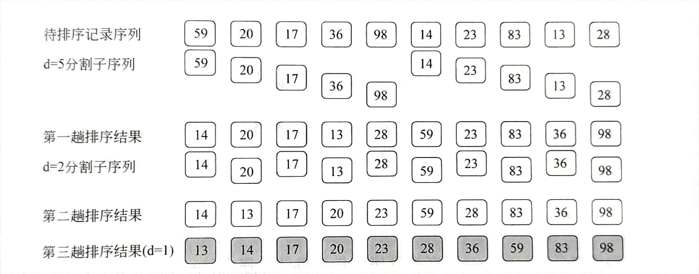

## 排序技术

**各类排序技术的比较**


### 插入排序

#### 直接插入排序


**算法思路**
依次将待排序序列中的每一个数插入已经排好的序列中即可。

**代码描述**

```c++
void InsertSort(int a[] , int n) //  元素个数存储在  1 ~ n 
{
    for(int i = 1 ; i < n ; i++)
    {
        int temp = a[i];
        for(int j = i - 1 ; j >= 0 && temp < a[j] ; j++)
            a[i] = a[j];
        a[j + 1] = temp; 
    }
}

```

#### 希尔排序


**算法思路**
先将整个待排序列划分成 若干个 子序列，在子序列中分别进行直接插入排序。待整个序列基本有序时，对整个序列再进行一次直接插入排序。
需要解决的关键问题：
1：怎样分割待排序记录，才能保证整个序列逐步向基本有序发展
2：子序列内如何进行直接插入排序

```c++
void ShellSort(int a[] , int n)
{
    int d; // 增量
    for(d = n / 2; d >= 1; d = d / 2)
    {
        for(int i = d ; i < n ; i++) //  进行一趟希尔排序
        {
            int temp = a[i];
            for(int j = i - d ; j >= 0 && temp < a[i] ; j = j - d)
                a[j + d] = a[j];  //  记录后移

            a[j + d] = temp;
        }

    }
}

```

### 交换排序

#### 冒泡排序


**代码描述**

```c++


```

#### 快速排序


```c++


```
