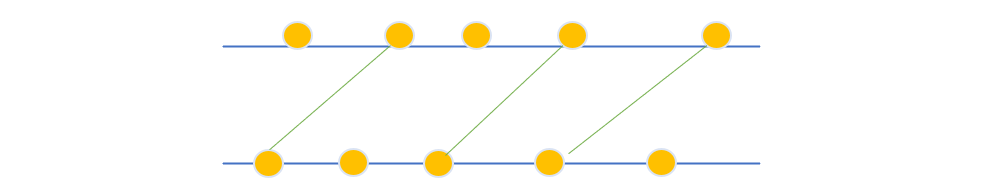
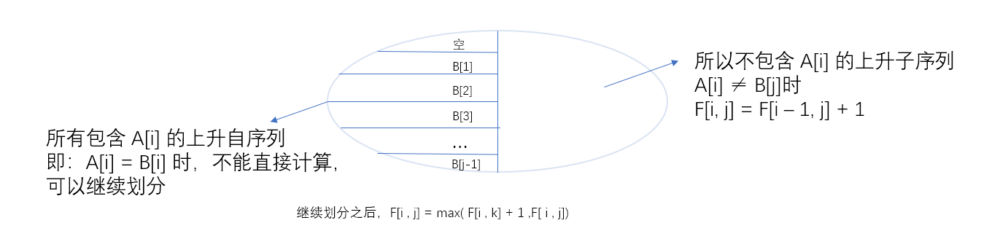

[TOC]

#### $LIS$ 问题原型

**问题描述**：最长上升子序列，给定一个长度为 $N$ 的数列 $A$ ，求数值单调递增的子序列的长度最长是多少。 $A$ 的任意子序列 $B$ 可表示为 $B= \{A_{k_1}, A_{k_2},...,A_{k_p} \}$ ，其中 $k_1<k_2<...<k_p$ 。

**状态表示**： `f[i]` 表示以 `A[i]` 为结尾的 “最长上升子序列” 的长度。

- 集合： 所有以第 $i$ 个数结尾的上升子序列。
- 属性： 集合中 序列长度的 Max。

**集合的划为：**（阶段的划分）

子序列的结尾位置（数列 $A$ 中的位置，从前到后）

即第 $i$ 个状态是由第 $i-1$ 个状态转移过来的，而第 $i-1$ 个状态是由 $i-2$ 转移而来，….一直到初始状态 $0$ 

**状态转移方程**

$f[i]=max_{0≤j≤i,A[j]<A[i]}(f[j] + 1)$ 

> 边界： $f[0]=0$ 
>
> 目标：$max_{1≤i≤N}(f[i])$ 

```c++
// O(n^2)
for(int i = 1 ; i <= n ; i++) {
    f[i] = 1; // 以 i 结尾的数只有 a[i] 一个
    for(int j = 0 ; j < i ; j++)
        if(a[i] < a[j])
            f[i] = max(f[i], f[j] + 1);
}
int ans = 0;
for(int i = 1 ; i <= n ; i++) ans =max(ans, f[i]);
```

**$LIS$ 贪心解法**

贪心思路：较小的数开头作为子序列 比 较大的数作为开头的子序列 更好。

贪心策略：

- 开一个数组 `q[i]`，存的是以长度为 `i` 的上升子序列末尾元素最小的数
- `q[]` 一开始是空集，长度为 `0` 
- 遍历每个数 `x` ，对于当前数 `x` ，先找到一个最大的小于 `x` 的数 `c` 
    - 情况1：若找不到 `c` ，扩大 `q[]` 的长度并记录当前数 `x`
    - 情况2：若找到 `c` ，就存在一个不等式 `c < x <= a < b` ，则将 `x` 覆盖在 `a` 的位置。

因为 `q[i]` 数组单调，所有可以使用二分来寻找 最大的小于 `x` 的数。

时间复杂度 $O(nlogn)$

```c++
int len = 0;
q[1] = -2e9;
for(int i = 1 ; i <= n ; i++) {
    int l = 0, r = len;
    while(l < r) {
        int mid = l + r + 1 >> 1;
        if(q[mid] < a[i]) l = mid;
        else r = mid + 1;
    }
    // r + 1 > len 时就会越界，需要增大 len
    len = max(len , r + 1);
    // 覆盖
    q[r + 1] = a[i];
}
// len 即为答案
```

#### $LCS$ 问题原型

**问题描述：** 最长公共子序列，给定两个长度分别为 $N$ 和 $M$ 的字符串 $A$ 和 $B$ ，求既是 $A$ 的子序列，又是 $B$ 的子序列的字符串长度最长是多少？

**状态表示：** `f[i][j]` 表示前缀子串 $A[1]$~$A[i]$ 与 $B[1]$~$B[j]$ 的 “最长公共子序列” 

-  集合：所有的在 $A$ 序列出现的前 $i$ 个字母中出现且在 $B$ 序列的前 $j$ 个字母中出现的子序列。
- 属性：最大值。

**集合的划分：**

已经处理的前缀长度（两个字符串中的位置，即一个二维坐标）

对于二维的状态来说， `f[i][j]` 可以由 `f[i-1][j]` 或 `f[i][j-1]`  或 在 `a[i] == b[i]`

的情况下由 `f[i-1][j-1] + 1` 转换过来。

**状态转移方程**
$$
f[i, j]=max
\begin{cases}
f[i-1, j]\\
f[i, j-1]\\
f[i-1, j-1] + 1, if(A[i] = B[j])
\end{cases}
$$

> 边界：$f[i, 0] = f[0,j] = 0$ ;
>
> 目标： $f[N, M]$ 

时间复杂度 $O(n^2)$ 

```c++
for(int i = 1 ; i <= n ; i++)
    for(int j = 1 ; j <= m ; j++) {
        f[i][j] = max(f[i-1][j], f[i][j-1]);
        if(a[i] == b[j])
            	f[i][j] = max(f[i][j], f[i-1][j-1] + 1);
    }
```


#### 1017：怪盗基德的滑翔翼

https://www.acwing.com/problem/content/1019/

> 1：高柱向低柱飞去
>
> 2：可以有两个方向飞，但是必须是在初始的时候选择好方向，中途不能改变方向

那么根据上面性质就可以转化为 $LIS$ 问题。并且是双方向的 $LIS$ 的问题。

```c++
#include<bits/stdc++.h>
using namespace std;
const int N = 1010;

int n;
int w[N];
int f[N];

int main(){
    int T;
    scanf("%d", &T);
    while (T -- ) {
        scanf("%d", &n);
        for (int i = 1; i <= n; ++ i ) scanf("%d", &w[i]);

        int ans = 0;
        // 递增  " / "
        for (int i = 1; i <= n; i++ ) {
            f[i] = 1;
            for (int j = 1; j < i; j++ )
                if(w[i] > w[j]) 
                    f[i] = max(f[i], f[j] + 1);
            ans = max(ans, f[i]);
        }
        // 递减   " \ "
        memset(f, 0, sizeof f);
        for(int i = n ; i >= 1 ; i--){
            f[i] = 1;
            for(int j = n ; j > i ; j--)
                if(w[i] > w[j])
                    f[i] = max(f[i], f[j] + 1);
            ans = max(ans, f[i]);
        }
        printf("%d\n", ans);
    }
}
```

#### 1014：登山

https://www.acwing.com/problem/content/1016/

> 1：不能有连续的相同高度的景点
>
> 2：一旦开始向下走，就不能再向上走了
>
> 3：浏览的景点编号是递增的

根据上面条件可以得出。浏览的路径一定是严格的单峰形状。


最高点的左右两边一定是严格单调的。

求解以每个景点作为最高点时，递增列与递减列和 的 $Max$。

如果每个景点 都进行一遍对于 递增列与递减列。$N$ 个景点的时间复杂度就到了 $O(N^3)$ 

> 对递增列和递减列分别进行预处理，这样就可以在使用时查表，将时间复杂度控制在 $O(N^2)$

```c++
#include<bits/stdc++.h>
using namespace std;
const int N = 1010;
int n;
int w[N];
int f[N], g[N];

int main() {
    scanf("%d", &n);
    for (int i = 1; i <= n; ++i ) scanf("%d", &w[i]);
    
    for(int i = 1 ; i <= n ; ++i){
        f[i] = 1;
        for(int j = 1 ; j < i ; ++j)
            if(w[i] > w[j])
                f[i] = max(f[i], f[j] + 1);
    }
    
    for (int i = n; i >= 1; --i ){
        g[i] = 1;
        for(int j = n ; j > i ; --j)
            if(w[i] > w[j])
                g[i] = max(g[i] ,g[j] + 1);
    }
    int ans = 0;
    for (int i = 1; i <= n; ++i) 
        ans = max(ans , g[i] + f[i] - 1);
    
    printf("%d\n", ans);
    return 0;
}
```

#### 482：合唱队形

https://www.acwing.com/problem/content/484/ 

> 仍然需要 $K$ 位同学从左到右的身高满足 $T_1<...<T_i>T_{i+1}>T_k(1≤i≤K)$ 。
>
> 计算最少需要几位同学出列才能排好  与  在队伍中最多满足条件的同学问题 相通。

与 [登山](https://www.acwing.com/activity/content/code/content/2747518/) 的问题一致。

```c++
#include<bits/stdc++.h>
using namespace std;
const int N = 110;

int n;
int h[N];
int f[N], g[N];

int main(){
    scanf("%d", &n);
    for (int i = 1; i <= n; ++i ) scanf("%d", &h[i]);

    for(int i = 1 ; i <= n ; ++i){
        f[i] = 1;
        for(int j = 1 ; j < i ; ++j )
            if(h[i] > h[j])
                f[i] = max(f[i], f[j] + 1);
    }
    
    for (int i = n; i >= 1; --i ){
        g[i] = 1;
        for(int j = n ; j > i; --j)
            if(h[i] > h[j])
                g[i] = max(g[i], g[j] + 1);
    }
    int ans = 0;    
    for (int i = 1; i <= n; ++i )
        ans = max(ans, f[i] + g[i] - 1);
    
    printf("%d\n", n - ans);
    return 0;
}
```

#### 1012：友好城市

https://www.acwing.com/problem/content/1014/



条件：

> 1：航线不能交叉
>
> 2：每个城市只能和与其对应的友好城市通航

对于 $LIS$ 问题来说，本身的索引和索引对应的值在本题中被换成两排城市。

可将一排城市作为 索引/自变量（要排序），另一排作为索引对应的值。城市对应之后。

我们只需在 **因变量** 中求解 $LIS$，因为只有当  自变量靠后对应的因变量  **大于** 自变量在前对应的因变量时，航线才不会交叉。

```c++
#include<bits/stdc++.h>
using namespace std;
typedef pair<int, int> PII;
const int N = 5010;
int n;
PII q[N];
int f[N];

int main(){
    scanf("%d", &n);
    for (int i = 1; i <= n; ++i) scanf("%d%d", &q[i].first, &q[i].second);
    sort(q + 1 , q + 1 + n);
    
    int ans = 0;
    for(int i = 1 ; i <= n ; ++i){
        f[i] = 1;
        for(int j = 1 ; j < i ; ++j)
            if(q[i].second > q[j].second)
                f[i] = max(f[i], f[j] + 1);
        ans = max(ans, f[i]);
    }
    printf("%d\n", ans);
    
    return 0;
}
```

#### 1016：最大上升子序列和

https://www.acwing.com/problem/content/1018/ 

将 个数 转换为 和。将每次的 `+1` 换成 `+w[i]` 即可。

```c++
#include<bits/stdc++.h>
using namespace std;
const int N = 1010;
int n;
int w[N];
int f[N];

int main(){
    scanf("%d", &n);
    for (int i = 1; i <= n; ++i ) scanf("%d", &w[i]);
    
    int ans = 0;
    for (int i = 1; i <= n; ++i ){
        f[i] = w[i];
        for(int j = 1 ; j < i ; ++j)
            if(w[i] > w[j])
                f[i] = max(f[i], f[j] + w[i]);
        ans = max(ans, f[i]);
    }
    printf("%d\n", ans);
    
    return 0;
}
```

#### 1010：拦截导弹

https://www.acwing.com/problem/content/1012/

由反链定理得：

求最少用多少个非严格下降子序列可以将整个序列覆盖掉 与 整个序列的最长上升子序列结果一致。

**贪心流程**

​		从前往后扫描每个数。对于某个数：

1. 如果现有的子序列的结尾都小于当前数，则创建新的子序列
2. 将当前数与每个子序列的最后一个数比较。选择出子序列的最后一个大于等于当前数中最小的那个数对应的子序列。

```c++
389 207 155 300 299 170 158 65
/*
	首先扫描389, 创建为一个新的总序列；然后扫描到 207.
	对于 207 就开始执行 贪心流程。
*/
```

第一问求得是 最长不严格下降子序列。第二问求得是最长上升子序列。所以两次开头的哨兵分别为 最大值/最小值。

```c++
#include<bits/stdc++.h>
using namespace std;
const int N = 1010;
int n;
int a[N], f[N];
int q[N];
int main(){
    while(cin >> a[n])n++;
    
    int ans = 0, len = 0;
    for (int i = 0; i < n; i ++ ) {
        f[i] = 1;
        for (int j = 0; j < i; j ++ )
            if(a[i] <= a[j])   // 最长不严格下降子序列
                f[i] = max(f[i], f[j] + 1);
        ans = max(ans, f[i]);
        
        int k = 0;
        while(k < len && q[k] < a[i]) k++;
        if(k == len) q[len++] = a[i];
        else q[k] = a[i];
    }
    printf("%d\n%d", ans, len);
    return 0;
}
```

```c++
#include<bits/stdc++.h>
using namespace std;
const int N = 1005;
int n;
int a[N], f[N];
int tot;
int main(){
    // while(cin >> a[n]) n++;
    // scanf在读到 EOF 时会返回 -1, ~ 等价于 != -1
    while(~scanf("%d", &a[++n]));
    
    // 求不严格最长下降子序列
    f[0] = 1e9; --n;
    for (int i = 1; i <= n; i ++ ){
        if(a[i] <= f[tot]) f[++tot] = a[i];
        else {
            int l = 0, r = tot;
            while(l < r) {
                int mid = l + r >> 1;
                if(f[mid] < a[i]) r = mid;
                else l = mid + 1;
            }
            f[r] = a[i];
        }
    }
    printf("%d\n", tot);
    
    // 求最长上升子序列
    tot = f[0] = 0;
    for(int i = 1 ; i <= n ; i++) {
        if(a[i] > f[tot]) f[++tot] = a[i];
        else {
            int l = 0, r = tot;
            while(l < r){
                int mid = l + r >> 1;
                if(f[mid] >= a[i]) r = mid;
                else l = mid + 1;
            }
            f[r] = a[i];
        }
    }
    printf("%d\n", tot);
    return 0;
}
```

#### 187：导弹防御系统

https://www.acwing.com/problem/content/189/

本题中由于可以选择 上升或下降 ，那么只能使用暴搜去枚举。这里相当于求最小步数。记录一个 最大值，不断替换它。

**上升的贪心思路**

1. 如果当前已有的上升拦截系统的高度都**小于**第 u 个导弹的高度，则继续使用这套系统
2. 否则，使用新的上升拦截系统去拦截这颗导弹

**下降的贪心思路**

1. 如果当前已有的下降拦截系统的高度都**小于**第u个导弹高度，则需要使用新的下降拦截系统。
2. 否则，继续使用原来的系统。

```c++
#include<bits/stdc++.h>
using namespace std;
const int N = 55;
int n;
int h[N];
// up[k] 记录第 k 套上升子序列目前所拦截的最后一个导弹
int up[N], down[N];
int ans;
// u为递归层数
// su 和 sd 表示有 su个上升， sd 个下降系统
void dfs(int u, int su, int sd){
    if(su + sd >= ans) return;
    if(u == n + 1){
        ans = min(ans, su + sd);
        return;
    }
    
    // 1: 将当前数放到上升子序列中
    int k = 0;
    // 找到这个数 放至的位置
    while(k < su && up[k] >= h[u]) k++;
    int t = up[k];
    up[k] = h[u]; // 替换
    
    // 当前导弹的高度小于之前使用的上升子序列的最后一个
    if(k < su) dfs(u + 1, su, sd);
    else dfs(u + 1, su + 1, sd);
    
    up[k] = t; // 恢复现场
    
    // 2：将当前数放到下降子序列中
    k = 0;
    while(k < sd && down[k] <= h[u]) k++;
    t = down[k];
    down[k] = h[u];
    
    if(k < sd) dfs(u + 1, su , sd);
    else dfs(u + 1, su , sd + 1);
    
    down[k] = t;
}

int main(){
    while(cin >> n , n) {
        for (int i = 1; i <= n; i ++ ) cin >> h[i];
        
        ans = n;
        dfs(1, 0, 0);
        cout << ans << endl;
    }
    return 0;
}
```

#### 272：最长公共上升子序列 （$LICS$问题）

https://www.acwing.com/problem/content/274/

**状态表示**： `f[i][j]` 表示 $A[1]$~$A[i]$ 与 $B[1]$~$B[j]$ 可以构成**以 $B[j]$ 结尾**的 $LCIS$ 的长度。

 **属性：** 最大值

**状态划分：**

1. 当 $A[i]≠B[j]$ 时，有 $F[i, j]=F[i-1, j]$ 

2. 当 $A[i]=B[j]$ 时，有
    $$
    F[i,j] = max_{0≤k<j,B_k<B_j}(F[i-1,k]) + 1=max_{0≤k<j,B_k<A_i}(F[i-1,k])+1
    $$



时间复杂度 $O(n^3)$ 

```c++
#include<bits/stdc++.h>
using namespace std;
const int N = 3005;
int n;
int a[N], b[N];
int f[N][N];

int main(){
    scanf("%d", &n);
    for (int i = 1; i <= n; i ++ ) scanf("%d", &a[i]);
    for (int i = 1; i <= n; i ++ ) scanf("%d", &b[i]);

    for(int i = 1 ; i <= n ; i++)
        for(int j = 1 ; j <= n ; j++) {
            if(a[i] == b[j]){
                for(int k = 0 ; k < j ; k++)
                    if(b[k] < a[i])
                        f[i][j] = max(f[i][j], f[i-1][k] + 1);
            }else f[i][j] = f[i - 1][j];
        }
    
    int ans = 0;
    for (int i = 1; i <= n; i ++ )
        ans = max(ans, f[n][i]);
        
    printf("%d\n", ans);
    
    return 0;
}
```


时间复杂度 $O(n^2)$ 

```c++
#include<bits/stdc++.h>
using namespace std;
const int N = 3005;
int n;
int a[N], b[N];
int f[N][N];

int main(){
    scanf("%d", &n);
    for (int i = 1; i <= n; i ++ ) scanf("%d", &a[i]);
    for (int i = 1; i <= n; i ++ ) scanf("%d", &b[i]);

    for(int i = 1 ; i <= n ; i++) {
        // val是决策集合S(i,j)中f[i-1][k]的最大值
        int val = 0;
        // j=1 时，0可以作为k的取值
        if(b[0] < a[i]) val = f[i - 1][0];
        for(int j = 1 ; j <= n ; j++) {
            if(a[i] == b[j]) f[i][j] = val + 1;
            else f[i][j] = f[i - 1][j];
            // j 即将增大为j+1，检查j能否进入新的决策集合
            if(b[j] < a[i]) val = max(val, f[i-1][j]);
        }
    }
    
    int ans = 0;
    for (int i = 1; i <= n; i ++ )
        ans = max(ans, f[n][i]);
        
    printf("%d\n", ans);
    
    return 0;
}
```


