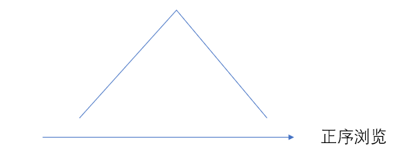

[TOC]

#### $LIS$ 问题原型

**问题描述**：最长上升子序列，给定一个长度为 $N$ 的数列 $A$ ，求数值单调递增的子序列的长度最长是多少。 $A$ 的任意子序列 $B$ 可表示为 $B= \{A_{k_1}, A_{k_2},...,A_{k_p} \}$ ，其中 $k_1<k_2<...<k_p$ 。

**状态表示**： `f[i]` 表示以 `A[i]` 为结尾的 “最长上升子序列” 的长度。

- 集合： 所有以第 $i$ 个数结尾的上升子序列。
- 属性： 集合中 序列长度的 Max。

**集合的划为：**（阶段的划分）

子序列的结尾位置（数列 $A$ 中的位置，从前到后）

即第 $i$ 个状态是由第 $i-1$ 个状态转移过来的，而第 $i-1$ 个状态是由 $i-2$ 转移而来，….一直到初始状态 $0$ 

**状态转移方程**

$f[i]=max_{0≤j≤i,A[j]<A[i]}(f[j] + 1)$ 

> 边界： $f[0]=0$ 
>
> 目标：$max_{1≤i≤N}(f[i])$ 

```c++
// O(n^2)
for(int i = 1 ; i <= n ; i++) {
    f[i] = 1; // 以 i 结尾的数只有 a[i] 一个
    for(int j = 0 ; j < i ; j++)
        if(a[i] < a[j])
            f[i] = max(f[i], f[j] + 1);
}
int ans = 0;
for(int i = 1 ; i <= n ; i++) ans =max(ans, f[i]);
```


#### 1017：怪盗基德的滑翔翼

https://www.acwing.com/problem/content/1019/

> 1：高柱向低柱飞去
>
> 2：可以有两个方向飞，但是必须是在初始的时候选择好方向，中途不能改变方向

那么根据上面性质就可以转化为 $LIS$ 问题。并且是双方向的 $LIS$ 的问题。

```c++
#include<bits/stdc++.h>
using namespace std;
const int N = 1010;

int n;
int w[N];
int f[N];

int main(){
    int T;
    scanf("%d", &T);
    while (T -- ) {
        scanf("%d", &n);
        for (int i = 1; i <= n; ++ i ) scanf("%d", &w[i]);

        int ans = 0;
        // 递增  " / "
        for (int i = 1; i <= n; i++ ) {
            f[i] = 1;
            for (int j = 1; j < i; j++ )
                if(w[i] > w[j]) 
                    f[i] = max(f[i], f[j] + 1);
            ans = max(ans, f[i]);
        }
        // 递减   " \ "
        memset(f, 0, sizeof f);
        for(int i = n ; i >= 1 ; i--){
            f[i] = 1;
            for(int j = n ; j > i ; j--)
                if(w[i] > w[j])
                    f[i] = max(f[i], f[j] + 1);
            ans = max(ans, f[i]);
        }
        printf("%d\n", ans);
    }
}
```

#### 1014：登山

https://www.acwing.com/problem/content/1016/

> 1：不能有连续的相同高度的景点
>
> 2：一旦开始向下走，就不能再向上走了
>
> 3：浏览的景点编号是递增的

根据上面条件可以得出。浏览的路径一定是严格的单峰形状。



最高点的左右两边一定是严格单调的。

求解以每个景点作为最高点时，递增列与递减列和 的 $Max$。

如果每个景点 都进行一遍对于 递增列与递减列。$N$ 个景点的时间复杂度就到了 $O(N^3)$ 

> 对递增列和递减列分别进行预处理，这样就可以在使用时查表，将时间复杂度控制在 $O(N^2)$

```c++
#include<bits/stdc++.h>
using namespace std;
const int N = 1010;
int n;
int w[N];
int f[N], g[N];

int main() {
    scanf("%d", &n);
    for (int i = 1; i <= n; ++i ) scanf("%d", &w[i]);
    
    for(int i = 1 ; i <= n ; ++i){
        f[i] = 1;
        for(int j = 1 ; j < i ; ++j)
            if(w[i] > w[j])
                f[i] = max(f[i], f[j] + 1);
    }
    
    for (int i = n; i >= 1; --i ){
        g[i] = 1;
        for(int j = n ; j > i ; --j)
            if(w[i] > w[j])
                g[i] = max(g[i] ,g[j] + 1);
    }
    int ans = 0;
    for (int i = 1; i <= n; ++i) 
        ans = max(ans , g[i] + f[i] - 1);
    
    printf("%d\n", ans);
    return 0;
}
```

#### 482：合唱队形

https://www.acwing.com/problem/content/484/ 


#### 1012：友好城市

https://www.acwing.com/problem/content/1014/


#### 1016：最大上升子序列和

https://www.acwing.com/problem/content/1018/


#### 1010：拦截导弹

https://www.acwing.com/problem/content/1012/


#### 187：导弹防御系统

https://www.acwing.com/problem/content/189/


#### 272：最长公共上升子序列

https://www.acwing.com/problem/content/274/


