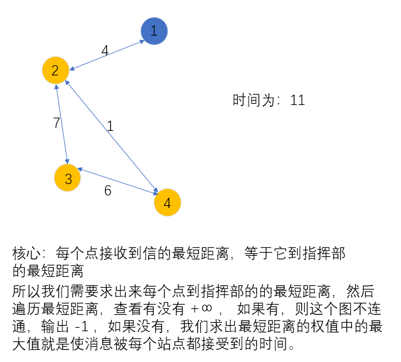
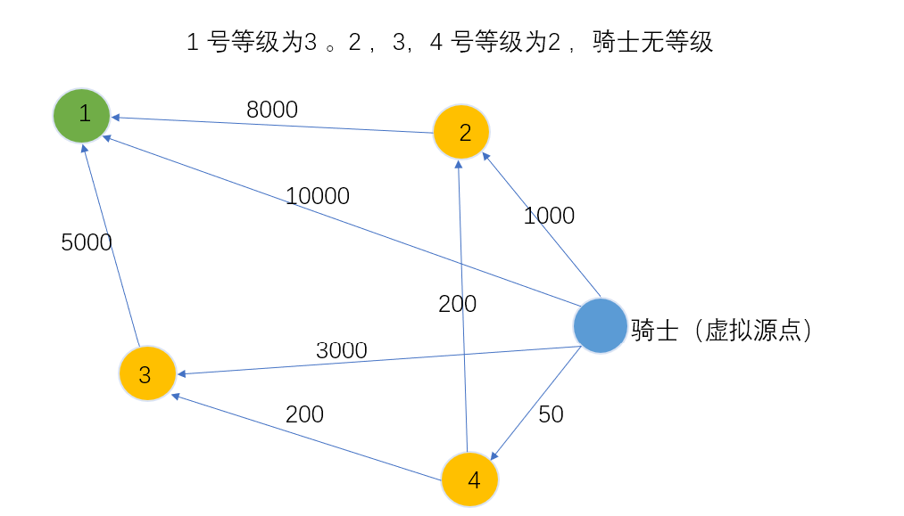

[TOC]

#### 单源最短路的建图方式

**算法选用**

根据数据范围反推算法：https://www.acwing.com/blog/content/32/

```
根据数据范围先看可以使用的 算法。
1：Dijkstra 算法： 只有所有边权为正时才使用。
	朴素 Dijkstra 算法  o(n^2)     --> 稠密图 ， 一般用 邻接矩阵建图
		数据范围 <= 1000 时使用
	
    堆优化 Dijkstra 算法 o(mlogn)  --> 稀疏图 ， 一般用 邻接表建图
    	数据范围 <= 100000 时使用
    
2：spfa 算法 ：边权正负没有限制。
	o(km) 
      数据范围比较大的情况下先使用该算法，但是如果被卡，及使用 堆优化 Dijkstra 算法。


3：floyd 算法： 一般由于多源最短路，也可求取其中一个条 单源最短路。-->  邻接矩阵存图
	o(n^3)   数据范围一般 <= 100 时使用
	
```

**算法及建图使用的数据结构**

1：邻接矩阵

2：邻接表

3： 循环队列

4：小根堆

…

**一些注意点：**

```
1：下面使用的 spfa 算法使用的数组模拟的循环队列，也可以直接使用 STL 中的 queue 也是循环队
列。注意循环队列非空的条件是  hh != tt

2：注意清除 重边 ，建图的时候求 min 即可。

3：最短路起点 到自身的距离的初始化一定要记得。 
	eg: dist[1] = 0 , dist[1][1] = 0;
```

**建图时的要点：**

```


```

#### 1129：热浪

https://www.acwing.com/problem/content/1131/

```
无向图。
```

```c++
#include<iostream>
#include<algorithm>
#include<cstring>
using namespace std;

const int N = 2510, M = 6200 * 2 + 10;
int  n , m , S , T;
int h[N] , e[M] , ne[M] , w[M] , idx;
int dist[N] , q[N];
bool st[N];

void add(int a , int b , int c)
{
    e[idx] = b , ne[idx] = h[a] , w[idx] = c ,h[a] = idx++;
}

void spfa()
{
    memset(dist  , 0x3f , sizeof dist);
    memset(st , 0 , sizeof st);
    dist[S] = 0;
    
    int hh = 0 , tt  = 1;
    q[0] = S , st[S] = true;
    
    while(hh != tt)
    {
        int t = q[hh++];
        if(hh == N) hh = 0;
        st[t] = false;
        
        for(int i = h[t] ; ~i ; i = ne[i])
        {
            int j = e[i];
            if(dist[j] > dist[t] + w[i])
            {
                dist[j] = dist[t] + w[i];
                if(!st[j])
                {
                    q[tt++] = j;
                    if(tt == N) tt = 0;
                    st[j] = true;
                }
            }
        }
    }
}


int main()
{
    cin >> n >> m >> S >> T;
    
    memset(h, -1, sizeof h);
    
    for(int i = 0  ; i < m ; i++)
    {
        int a  , b , c;
        cin >> a >> b >> c;
        add(a, b, c)  , add(b , a ,c);
    }
    
    spfa();
    
    cout << dist[T] << endl;
    
    return 0;
}
```

#### 1128：信使

https://www.acwing.com/problem/content/1130/



```c++
题目的数据范围很小，所以直接使用 folyd 即可。
```

```c++
#include<iostream>
#include<algorithm>
#include<cstring>
using namespace std;
const int N = 105 , INF = 0x3f3f3f3f;

int n ,m ;
int dist[N][N];

int main()
{
    cin >> n >> m;
    
    memset(dist , 0x3f , sizeof dist);

    for(int i = 0 ; i < m ; i++)
    {
        int a , b ,c;
        cin >> a >> b >> c;
        dist[a][b] = dist[b][a] = min(dist[a][b] ,c);
    }
    
    for(int k = 1 ; k <= n ; k++)
        for(int i = 1 ; i <= n ; i++)
            for(int j = 1 ; j <= n ; j++)
                dist[i][j] = min(dist[i][j] , dist[i][k] + dist[k][j]);
                
    
    int res = 0;
    dist[1][1] = 0;// 注意 d[1][1] = 0;
    for(int i = 2 ; i <= n ; i++) 
    {
        if(dist[1][i] == INF)
        {
            res = -1;
            break;
        }
        else res = max(res, dist[1][i]);
    }
        
    cout << res << endl;
    
    return 0;
}
```


#### 1127：香甜的黄油

https://www.acwing.com/problem/content/1129/

```
牛在不同牧场，要想使所有的牛走的路最短，所以 要将求出以每个牧场为中心的最短路即可。
```

```c++
#include<iostream>
#include<algorithm>
#include<cstring>
using namespace std;

const int N = 810 , M = 3000 , INF = 0x3f3f3f3f;
int n , p , m;
int id[N];
int h[N] , e[M] , ne[M] , w[M] , idx;
int dist[N] , q[N];
bool st[N];

void add(int a ,int b ,int c)
{
    e[idx] = b , ne[idx] = h[a] ,w[idx] = c , h[a] = idx++;
}

int spfa(int start)
{
    memset(dist , 0x3f , sizeof dist);
    dist[start] = 0;
    int hh = 0 , tt = 1;
    q[0] = start , st[start] = 1;
    
    while(hh != tt)
    {
        int t = q[hh++];
        if(hh == N) hh = 0;
        st[t] = 0;
        
        for(int i = h[t] ; ~i ; i = ne[i])
        {
            int j = e[i];
            if(dist[j] > dist[t] + w[i])
            {
                dist[j] = dist[t] + w[i];
                if(!st[j])
                {
                    q[tt++] = j;
                    if(tt == N)  tt = 0;
                    st[j] = 1;
                }
            }
        }
        
    }
    
    int res = 0;
    for(int i = 0 ; i < n ; i++)
    {
        int j = id[i];
        // 如果这头牛不能到达某个点，那这点一定不能为中心
        if(dist[j] == INF) return INF; 
        res += dist[j];
    }
    return res;
}


int main()
{
    cin >> n >> p >> m;
    
    for(int i = 0 ; i < n ;i++) cin >> id[i];
    
    memset(h , -1 , sizeof h);
    for(int i = 0 ; i < m ; i++)
    {
        int a , b, c;
        cin >> a >> b >> c;
        add(a, b, c)  ,add(b , a , c);
    }
    
    int res = INF;
    //  以每个点为中心，求最短路 的最短路 （这里的最短路是 最短路的和）
    for(int i = 1 ; i <= p ; i++) res = min(res , spfa(i));
    
    cout << res << endl;
    
    return 0;
} 
```


#### 1126：最小花费

https://www.acwing.com/problem/content/1128/

$100 = d(A) ×w_1 ×w_2 ×w_3 ×...× w_n $  现在要是最终转过去后是100元 ，并且使 $d(A)$ 最小，也是

$w_1 × w_2 × w_3 ×...× w_n$ 最大即可。

平时普通的最短路径都是 加法 ，这里需要求的是 乘法。可以对乘法做一个变换。即取对数，这样可以使得乘法变成加法。

$log(w_1×w_2×w_3×...×w_n) = logw_1 + logw_2 + logw_3 + ... + logw_n$ ,所以我们求的就是取对数下和的最大值，又因为 w 都是小于 1 的，所以 取对数后的边权值就会变成负数，然后可以求**绝对值的最小值** 求最大值。

```
上面的证明仅用于证明可以将问题转化为 无负权边 的 单源最短路问题。
实际操作时，直接将边权值乘起来求最大即可。
```

```c++
#include<iostream>
#include<algorithm>
#include<cstring>
using namespace std;
const int N = 2010 , M = 100010;
int n ,m , S ,T;
double g[N][N];
double dist[N];
bool st[N];

void dijkstra()
{
    dist[S] = 1;
    for(int i = 1 ; i <= n ; i++)
    {
        int t = -1;
        for(int j = 1 ; j <= n ; j++)
            if(!st[j] && (t == -1 || dist[t] < dist[j])) // 用大的边更新
                t = j;
                
        st[t] = 1;
        for(int j = 1 ; j <= n ; j++)
            dist[j] = max(dist[j] , dist[t] * g[t][j]); // 求最大
    }

}

int main()
{
    scanf("%d%d", &n, &m);
    
    memset(g , 0 ,sizeof g);
    while (m -- )
    {
        int a , b, c;
        scanf("%d%d%d", &a, &b ,&c);
        double z = (100.0 - c) / 100;
        g[a][b] = g[b][a] = max(g[a][b] , z);
    }
    
    cin >>  S >> T;
    dijkstra();
    
    printf("%.8lf\n" , 100 / dist[T]);
    
    return 0;
}
```


#### 920：最优乘车 （好题）

https://www.acwing.com/problem/content/922/


```
换车次数就等于 坐车次数 - 1 ， 我们将各点 用坐车次数建图后求起点到终点的的最短路即可。
```

```c++
#include<iostream>
#include<algorithm>
#include<cstring>
#include<sstream>
using namespace std;

const int N = 510;

int  m, n;
bool g[N][N];
int dist[N];
int stop[N];
int q[N];

void bfs()
{
    int hh = 0 , tt = 0;
    memset(dist , 0x3f , sizeof dist);
    q[0] = 1;
    dist[1] = 0;
    
    while(hh <= tt) // 普通队列不为空
    {
        int t = q[hh++];
        
        for(int i = 1 ; i <= n ; i++)
            if(g[t][i] && dist[i] > dist[t] + 1)
            {
                dist[i] = dist[t] + 1;
                q[++tt] = i;
            }
    }
}

int main()
{
    cin >> m >> n;
    
    string line;
    getline(cin , line);
    while(m--)
    {
        getline(cin , line);
        stringstream ssin(line);
        int cnt = 0 , p;
        while(ssin >> p) stop[cnt++] = p;
        
        //  以坐车次数建 有向图
        for(int j = 0 ; j < cnt ; j++)
            for(int k = j + 1 ; k < cnt ; k++)
                g[stop[j]][stop[k]] = 1;
    }
    
    //  边权值都为 1, 直接用 bfs.
    bfs();
    
    if(dist[n] == 0x3f3f3f3f) cout << "NO" << endl;
    else cout << max(dist[n] - 1 , 0) << endl;
    
    return 0;    
}
```

#### 903：昂贵的聘礼

https://www.acwing.com/problem/content/922/



```
对于 等级的限制，我们可以根据 1 号点的等级和等价差距限制 求出限制区间。
eg: 等级差距是 1 ， 1 号点的等级是 3.
然后 [2 , 2] , [2 , 3] 就是这个等级限制区间。只有等级符合其中一个时
```

```c++
#include<iostream>
#include<algorithm>
#include<cstring>
using namespace std;
const int N = 105 , INF = 0x3f3f3f3f;

int m , n;
int w[N][N] , level[N];
int dist[N];
bool st[N];

int dijkstra(int down , int up)
{
    memset(dist , 0x3f , sizeof dist);
    memset(st , 0 , sizeof st);
    
    dist[0] = 0;
    for(int i = 1 ; i <= n ; i++)
    {
        int t = -1;
        //  因为 0 也需要在图中，所以要枚举 n + 1 次。
        for(int j = 0 ; j <= n ; j++)
            if(!st[j] && (t == -1 || dist[t] > dist[j]))
                t = j;
                
        st[t] = 1;
        for(int j = 1 ; j <= n ; j++)
            if(level[j] >= down && level[j] <= up) // 等级限制
                dist[j] = min(dist[j] , dist[t] + w[t][j]);
    }
    
    return dist[1];
}

int main()
{
    cin >> m >> n;
    memset(w , 0x3f , sizeof w);
    
    for(int i = 1 ; i <= n ; i++) w[i][i]=  0;
    
    for(int i = 1 ; i <= n ; i++)
    {
        int price ,cnt;
        cin >> price >> level[i] >> cnt;
        w[0][i] = min(price , w[0][i]);
        
        while(cnt--)
        {
            int id , cost;
            cin >> id >> cost;
            w[id][i] = min(w[id][i] , cost);
        }
        
    }
    
    int res = INF;
    // 枚举等级区间，这里必须要将 level[1] 包含进去。
    for(int i = level[1] - m ; i <= level[1] ; i++) 
        res = min(res , dijkstra(i , i + m));
    
    cout << res << endl;
    
    return 0;
}
```


