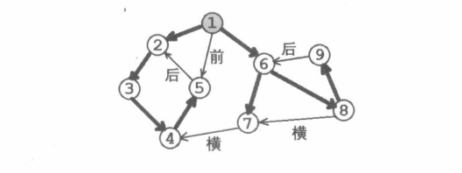
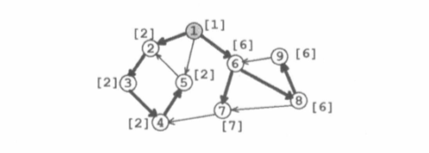

[TOC]

### Tarjan 算法与有向图连通性

​		给定有向图 $G = (V,E)$，若存在 $r∈V$，满足从 $r$ 出发能够到达 $V$ 中所有的点，则称 $G$ 是一个  “流图”(Flow Graph)，记为 $(G , r)$，其中 $r$ 称为流图的源点。
​		与无向图的深度优先遍历类似，我们也可以定义“流图”的搜索树和时间戳的概念：
​		在一个流图  $(G,r)$  上从 $r$ 出发进行深度优先遍历，每个点只访问一次。所有发生递归的边 $(x,y)$（换言之，从 $x$ 到 $y$ 是对 $y$ 的第一次访问）构成一棵以 $r$ 为根的树，我们把它称为**流图   $(G,r)$  的搜索树**。

​		同时，在**深度优先遍历**的过程中，按照每个节点第一次被访问的时间顺序，依次给予流图中  $N$  个节点 $1$~$N$ 的整数标记，该标记被称为**时间戳**，记为 $dfn[x]$。

​	流图中的每条有向边  $(x,y)$  必然是以下四种之一：

1. 树枝边，指搜索树中的边，即 $x$ 是 $y$ 的父节点。
2. 前向边，指搜索树中 $x$ 是 $y$ 的祖先节点。
3. 后向边，指搜索树中 $y$ 是 $x$ 的祖先节点。
4. 横叉边，指除了以上三种情况之外的边，它一定满足 $dfn[y]< dfn[x]$。

​		下图画出了一个“流图”以及它的搜索树、时间戳、边的分类。圆圈中的数字是时间戳。粗边是树枝边，并构成一棵搜索树。前向边、后向边与横叉边用第一个汉字标注。



#### **有向图的强连通分量**

​		给定一张有向图。若对图中任意两个节点  $x,y$  ，即存在从 $x$ 到 $y$ 的路径，也是存从 $y$  到  $x$ 的路径，则称该有向图是  ” 强连通图 “。

​		有向图的**极大强连通子图**被称为  ”**强连通分量**“ ，简记为 $SCC$。此处  “极大” 的含义与双连通分量  ”极大“  的含义类似。

​		$Tarjan$ 算法基于有向图的深度优先遍历，能够在线性时间内求出一张有向图的各个强连通分量。

​		一个  ”环” 一定是强连通图，如果存在从  $x$  到  $y$ 的路径，也存在从 $y$ 到 $x$ 的路径，那么  $x,y$ 显然在一个环中。因此， $Tarjan$ 算法的基本思路就是对于每个点，尽量找到与它一起构成环的所有节点。

容易发现，

​		“前向边” $(x,y)$ 没有什么用处，因为搜索树上本来就存在 $x$ 到 $y$ 的路径。

​		“后向边” $(x,y)$ 非常有用，因为它可以和搜索树上从 $y$ 到 $x$ 的路径一起构成环。

​		“横叉边“ $(x,y)$ 视情况而定，如果从  $y$  出发能找到一条回到 $x$ 的祖先节点，那么 $(x,y)$ 就是有用的。

**判定节点是否在强连通分量中的话，就判断该节点能不能走到它的祖先。**

​		为了找到通过 ”后向边“ 和 “横叉边” 构成的环， $Tarjan$ 算法在深度优先遍历的同时维护了一个**栈**，当访问到节点 $x$ 的时候，栈中需要保存以下两类节点：

1. 搜索树上 $x$ 的祖先节点，记为集合  $anc(x)$。 设 $y∈anc(x)$。若存在后向边 $(x,y)$ ，则 $(x,y)$ 与 $y$ 到 $x$ 的路径一起形成环。
2. 已经访问过，并且存在一条路径到达 $y∈anc(x)$ 的节点。设  $z$ 是一个这样的节点，从 $z$ 出发存在一条路径到达  $y∈anc(x)$ 。若存在横叉边 $(x,z)$ ，则 $(x,z)$ ，$z$ 到 $y$ 的路径， $y$ 到 $x$ 的路径形成一个环。

​		综上，栈中的节点就是能与从 $x$ 出发的 “后向边” 和 “横叉边” 形成环的节点。进而可以引入  “追溯值” 的概念。

#### **追溯值**

​		设 $subtree(x)$ 表示流图的搜索树中以 $x$ 为根的子树。$x$ 的追溯值 $low[x]$定义为满足以下条件的节点的最小时间戳：

1. 该点在栈中。
2. 存在一条从 $subtree(x)$ 出发的有向边，以该点为终点。

即：**$low[x]$ 表示从 $x$ 开始走，所能遍历到的最小时间戳是什么** 。 $x$ 是其所在的强连通分量的深度最小的点，等价于 $dfn[x]=low[x]$ 。


根据定义，Tarjan算法按照以下步骤计算 “ 追溯值 ”  ：

1. 当节点 $x$ 第一次被访问时，把 $x$ 入栈，初始化 $low[x] = dfn[x]$。
2. 扫描从 $x$ 出发的每条边  $(x,y)$ 。

​		(1) 若 $y$ 没被访问过，则说明  $(x,y)$  是树枝边，递归访问 $y$，从 $y$ 回溯之后，令                                    											$low[x] = min(low[x],low[y])$。
​		(2) 若 $y$ 被访问过并且 $y$ 在栈中，则令   $low[x] = min(low[x],dfn[y])$。

	3. 从 $x$ 回溯之前，判断是否有 $low[x] = dfn[x]$。若成立，则不断从栈中弹出节点，直至 $x$ 出栈。
下页图中的中括号 `[ ]` 里的数值标注了每个节点的“追溯值”  $low$。可以尝试在图中模拟 $low$ 的计算过程。 



#### **强连通分量判定法则**

​		在追溯值的计算过程中，若从 $x$ 回溯前，有 $low[x] = dfn[x]$  成立，则栈中的从 $x$ 到栈顶的所有节点构成一个强连通分量。

​		在计算追溯值的第三步中，如果  $low[x]=dfn[x]$ ，那么说明 $subtree(x)$ 中的节点不能与栈中其他节点一起构成环，另外，因为横叉边的终点时间戳必定小于起点时间戳，所以 $subtree(x)$ 中的节点也不可能直接到达尚未访问的节点（时间戳更大）。综上：栈中从 $x$ 到栈顶的所有节点不能于其他节点一起构成环。

​		又因为我们及时进行了判定和出栈操作，所以从 $x$ 到栈顶的所有节点独立构成一个强连通分量。

**对于有向无环图来说，其深度优先遍历是逆拓扑排序**

$Tarjan$算法

```c++


```


#### 1174：受欢迎的牛

https://www.acwing.com/problem/content/1176/

​		对于某个节点来说，要想知道自已是否被其他节点欢迎的 核心问题是**其他节点能不能走到该点**。玻璃来做的话就是在 每个点做搜索，去最终所能到达的交集。

​		如果该图是一张拓扑图的话，那么当这个拓扑图中**只有一个出度为 $0$ 的点**的话，说明其他点都可以走向该点，若出度为 $0$ 的点不止一个那么无解。

​		通过 $Tarjan$ 算法找到原图所有的 **强连通分量** ，然后通过缩点将原图转换为  $DAG$ ，那么出度为 $0$ 的那个点所在的强连通分量中的点就可以被其他点走到。

```c++
#include<bits/stdc++.h>
using namespace std;
const int N = 10010 , M = 50010;

int n , m;
int h[N], e[M], ne[M], w[M], idx;
int dfn[N] , low[N] , timestamp;
int stk[N] , tt = 0;
bool in_stk[N];
// 强连通分量编号, 强连通分量的数量 , 每个强连通分量中点的数量
int id[N] , scc_cnt , Size[N];
int dout[N]; // 出度

void add(int a, int b){
    e[idx] = b, ne[idx] = h[a], h[a] = idx ++ ;
}

void tarjan(int x){
    dfn[x] = low[x] = ++ timestamp;
    stk[++ tt] = x , in_stk[x] = 1;
    
    for(int i = h[x] ; ~i ; i = ne[i]){
        int y = e[i];
        if(!dfn[y]){
            tarjan(y);
            low[x] = min(low[x] , low[y]);
        }
        else if(in_stk[y]) low[x] = min(low[x],dfn[y]);
    }
    
    if(dfn[x] == low[x]){
        
        ++ scc_cnt;
        int k;
        do{
            k = stk[tt --];
            in_stk[k] = 0;
            id[k] = scc_cnt;
            Size[scc_cnt]++;
        }while(k != x);
    }
}


int main()
{
    scanf("%d%d", &n, &m);
    memset(h, -1, sizeof h);
    
    while (m -- ) {
        int a, b;
        scanf("%d%d", &a, &b);
        add(a, b);
    }   
    
    for(int i = 1 ; i <= n ; i++)
        if(!dfn[i])
            tarjan(i);
    
    
    for(int i = 1 ; i <= n ; i++)
        for(int j = h[i] ; ~j ; j = ne[j]){
            int k = e[j];
            int a = id[i] , b = id[k];
            if(a != b) dout[a]++;
        }
    
    int zeros = 0 , sum = 0;
    for(int i = 1 ; i <= scc_cnt ; i++){
        if(!dout[i]){
            zeros++;
            sum += Size[i];
            if(zeros > 1){
                sum = 0;
                break;
            }
        }
    }
    printf("%d\n" , sum);
    
    return 0;
}
```

#### 367：学校网络

https://www.acwing.com/problem/content/369/


#### 1175：最大半连通子图

https://www.acwing.com/problem/content/1177/


#### 368：银河

https://www.acwing.com/problem/content/370/


#### 练习：

##### 369：北大ACM队的远足

https://www.acwing.com/problem/content/371/


##### 370：卡图难题

https://www.acwing.com/problem/content/372/


##### 371：牧师约翰最忙碌的一天

https://www.acwing.com/problem/content/373/


