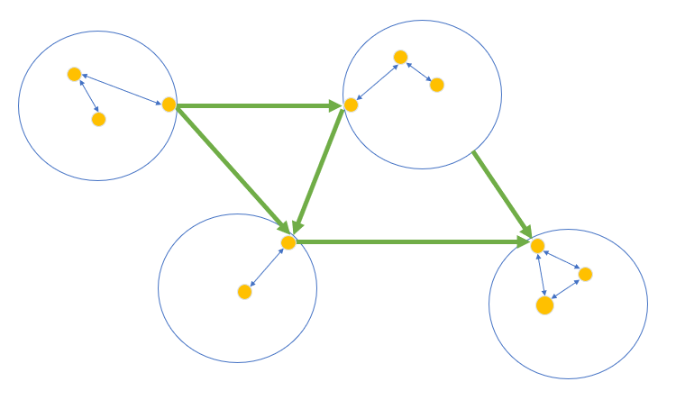

[TOC]


#### 单源最短路的综合应用


#### 1135：新年好 （DFS + 单源最短路）

https://www.acwing.com/problem/content/1137/

**关键语句：**拜访每个亲戚的顺序任意。要求时间最短。

**最短路分析：**

因为访问亲戚是**连续的**：从家出发之后，到达另一个亲戚家时，我们就又要考虑从该亲戚家到下一下亲戚的最短距离，所以需要我们求出  **以每个亲戚及自家为起点到其它点的最短距离**。（即：找到图中 6 个节点互相的最短路，然后就是 `tsp` 问题。一般用状压Dp解决，数据少，直接 DFS就好了）

**DFS分析：**

然后我们因为访问顺序任意，所以我们并不能确定 走完当前节点之后去哪个节点，我们只有一个原则：访问完所有时间最少。再看下数据，有 5 个节点，全排列枚举是 `5! = 120` 

$120 * 5*10^5 = 6 * 10^7$ 如果使用 spfa 的化，很可能被卡，所以可直接使用 堆优化Dijkstra 算法。

```c++
#include<iostream>
#include<algorithm>
#include<cstring>
#include<queue>
using namespace std;
typedef pair<int, int> PII;
const int N = 50010 , M = 200010 , INF = 0x3f3f3f3f;

int n ,m;
int source[6];
int dist[6][N]; //  需要分别求从6 个起点开始的最短路。
bool st[N];
int h[N] , e[M] , ne[M] , w[M] ,idx;

void add(int a ,int  b ,int c)
{
    e[idx] = b , ne[idx] = h[a] , w[idx] = c , h[a] = idx++;
}

void dijkstra(int start , int dist[])
{
    memset(dist , 0x3f , N * 4);
    dist[start] = 0;
    memset(st , 0 , sizeof st);
    
    //  注意 dist 作为 第一关键字
    priority_queue< PII , vector<PII> , greater<PII>> heap;
    heap.push({0 , start});
    
    while(heap.size())
    {
        auto t = heap.top();
        heap.pop();
        
        int ver = t.second ;
        if(st[ver]) continue;
        st[ver] = 1;
        
        for(int i = h[ver] ; ~i ; i = ne[i])
        {
            int j = e[i];
            if(dist[j] > dist[ver] + w[i])
            {
                dist[j] = dist[ver] + w[i];
                heap.push({dist[j] , j});
            }
        }
    }
    
}

// u是拜访了到第几个亲戚 ， start 是从第几个开始拜， d 是当前距离
int dfs(int u, int start , int d)
{
    if(u > 5) return d;
    
    int res = INF;
    for(int i = 1 ; i <= 5 ; i++)
    {
        if(!st[i])
        {
            int next = source[i];
            
            st[i] = 1;
            res = min(res , dfs(u + 1 , i , d + dist[start][next]));
            st[i] = 0;
        }
    }
    return res;
}


int main()
{
    scanf("%d%d", &n, &m);
    source[0] = 1;
    for(int i = 1 ; i <= 5 ; i++) scanf("%d", &source[i]);
    memset(h, -1 ,sizeof h);
    while(m--)
    {
        int a, b, c;
        scanf("%d%d%d", &a, &b , &c);
        add(a, b, c) , add(b, a, c);
    }
    
    // 枚举 6 个点作为起点的 单源最短路。
    for(int i = 0 ; i < 6 ; i++) dijkstra(source[i] , dist[i]);
    
    memset(st, 0, sizeof st);
    printf("%d\n" , dfs(1 ,0 , 0));

    return 0;
}

```

#### 340：通信线路 （二分 + 双端队列BFS）

https://www.acwing.com/problem/content/342/

**样例解释**


**二分+ 双端队列BFS 做法**

答案具有明显的单调性，答案问的是 **至少需要多少线**才能升级成功。当 支付的钱更多时，合法的升级方案一定包含了花费更少的升级方案。

将问题转换为  **是否存在一种合法的升级方法，使得花费不超过 $mid$。**

转化为的判定问题，只需要把升级价格大于 $mid$ 的电缆看作长度为 $1$ 的边，把升级价格不超过 $mid$ 的电缆看作长度为 $0$ 的边，然后**求 $1$ ~ $N$ 的最短路是否不超过 $K$ 即可。**

时间复杂度 $O(N + P)log MAX_l$

**二分边界问题**

因为  $L_i$ 的长度的范围是  `1 <= ` $L_i$ `<= 1000000`

而这里二分的范围选择是 `[0 , 1000001]`,  $0$ 可能会作为答案出现，$K=3时$， 如果 $1$ 到 $N$ 这条路径上有三条边，并且这三条边都 `<= mid` 那么这就会使得其为 $0$ ；取到`1000001` 是因为 应对无解模糊的问题。当 $K$ 取到上限 `1000000` 时就会出现判断异常的情况，因为此时并不知道是因为有解还是由于 $1$ 到 $N$ 之间不连通的问题（无解）导致的，当 K 取 `10000000` ，如果有 `1000001` 条，那么再加的这 一 就有有解的情况，然而要是不连通的话，再加也是无解的。

**问题的转换过程**

至少花费多少钱完成升级  —— 这意味着要求 **最大值最小** (答案的单调性)—— 然后就通过二分去寻找那个值 $X$ , ` >= X`的都是符合条件的， `< X`都是不符合条件的。

二分这个分段函数，符合条件的为 1 ， 不符合条件的置 0 。结合到  $1$ 到 $N$ 的路径上，每条边要么是 $0$,要么是 $1$,那么问题中的至少花费自然转换成最短路问题。

二分的是第 $i$ 条电缆需要花费的$L_i$，而 有 `<= K`  条电缆会被免费升级。这两者之间没有直接的关系，然后如果我们设立某个电缆的花费为  $X$ , `>= X`都是符合条件的。若有该边 `>= X` ,则可能就是花费的钱之一，就可将其置为 $1$ ；而`< X` 的方案不符合条件，置 $0$。

```c++
#include<bits/stdc++.h>
using namespace std;
const int N = 1010 , M = 200010;
int n , m , k;
int h[N] , e[M] , ne[M] , w[M] ,idx;
deque<int> q;
int dist[N];
bool st[N];

void add(int a, int b ,int c)
{
    e[idx] = b, ne[idx] = h[a] ,w[idx] = c, h[a] = idx++;
}

bool check(int mid)
{
    memset(dist , 0x3f3f3f3f , sizeof dist);
    memset(st, 0, sizeof st);
    dist[1] = 0;
    q.push_back(1);
    
    while(q.size())
    {
        int t = q.front();
        q.pop_front();
        
        if(st[t]) continue;
        st[t] = 1;
        
        for(int i = h[t] ; ~i ; i = ne[i])
        {
            int j = e[i] , v = w[i] > mid;
            if(dist[j] > dist[t] + v)
            {
                dist[j] = dist[t] + v;
                if(!v) q.push_front(j);
                else q.push_back(j);
            }
        }
    }
    return dist[n] <= k; // 选择的该花费（该路径）是否有解 。
}

int main()
{
    cin >> n >> m >> k;
    
    memset(h, -1, sizeof h);
    while(m--)
    {
        int a, b, c;
        cin >> a >> b >> c;
        add(a, b, c) , add(b, a, c);
    }
    
    int l = 0 , r = 1e6 + 1; // 二分 路径花费
    while(l < r)
    {
        int mid = l + r >> 1;
        if(check(mid)) r = mid;
        else l = mid + 1;
    }
    
    if(r == 1e6 + 1) r = -1;
    cout << r << endl;
    
    return 0;
}
```

#### 342：道路与航线  (拓扑序 + Dijkstra)

https://www.acwing.com/problem/content/344/

本题是一道明显的单源最短路问题，但图中带有负权边，不能使用Dijkstra算法。若直接用SPFA算法求解，因为测试数据经过了特殊构造，所以程序无法在规定时限内输出答案。

题目中有一个特殊条件**双向边都是非负**的，只有**单向边可能是负的**，并且**单向边不构成环**。我们应该利用这个性质来解答本题。

如果只把双向边（也就是）成若干个连通块。若把每个连通块整体看作一个“点”，再把单向边（也就是题目中的“航线”）添加到图里，会得到一张**有向无环图**。在有向无环图上，无论边权正负，都可以按照**拓扑序**进行扫描，在**线性时间内求出单源最短路**。这启发我们用拓扑序的框架处理整个图，但在双向边构成的每个连通块内部使用堆优化的 Dijkstra 算法快速计算该块内的最短路信息。

**整体的一个框架**

1. 各个连通块内使用  堆优化Dijkstra 算法，时间复杂度  $O(,mlogn)$
2. 各个连通块之间使用 拓补序 （边权不论正负，连通块之间是有向无环图），时间复杂度  $O(n)$



**一些细节的处理**

1. 先输入所有的双向道路，然后 DFS 出来所有的连通块，计算两个数组 : `id[N]`:存储每个点属于哪个连通块； `vector<int> block[]` 存储每个连通块里有哪些点。
2. 输入所有的航线，同时统计出每个连通块的入度。
3. 按照**拓扑序**依次处理每个连通块。先将所有入度为 $0$ 的连通块加入队列中。
4. 每次从队头取出一个连通块的编号 `block_id`。
5. 将该 `block[block_id]`的中所有的点加入堆中，然后对堆中所有点做 DIjkstra 算法。
6. 在 Dijkstra 算法中，每次取出堆中最小的点 `ver`,然后遍历 `ver` ，如果 `id[ver] == id[j]` ,那么如果 `j` 能被更新，则将 `j`插入堆中；如果 `id[ver] != id[j]`,则将 `id[j]` 这个连通块的入度减 $1$ ,如果减到入度已经为 $0$ 了，则将其插入拓扑排序的队列中。

```c++
#include<bits/stdc++.h>
#define x first
#define y second
using namespace std;
typedef pair<int, int> PII;
const int N = 25010 , M = 150010 , INF = 0x3f3f3f3f;

int n, mr , mp , S;
int id[N];
int h[N] , e[M] , ne[M] ,w[M] , idx;
int dist[N] , din[N];
vector<int> block[N];
int bcnt;
bool st[N];
queue<int> q;

void add(int a, int b, int c)
{
    e[idx] = b, w[idx] = c , ne[idx] = h[a] , h[a] = idx++;
}
// DFS 搜索
void dfs(int u , int bid) // u表示搜到哪一个连通块， bid 表示当前连通块 个数。
{
    id[u] = bid;
    block[bid].push_back(u);
    
    for(int i = h[u] ; ~i ; i = ne[i])
    {
        int j = e[i];
        if(!id[j])
            dfs(j , bid);
    }
}

void dijkstra(int bid)
{
    priority_queue<PII , vector<PII> , greater<PII>> heap;
    for(auto u : block[bid])
        heap.push({dist[u] , u});
        
    while(heap.size())
    {
        auto t = heap.top();
        heap.pop();
        
        int ver = t.y;
        if(st[ver]) continue;
        st[ver] = 1;
        
        for(int i = h[ver] ; ~i ; i = ne[i])
        {
            int j = e[i];
            if(id[j] != id[ver] && --din[id[j]] == 0)// 不在一个连通块中
                q.push(id[j]);
                
            if(dist[j] > dist[ver] + w[i])
            {
                dist[j] = dist[ver] + w[i];
                // 在 一个连通块中
                if(id[j] == id[ver]) heap.push({dist[j] ,j});
            }
        }
    }
}

void topsort()
{
    memset(dist , 0x3f , sizeof dist);
    dist[S] = 0;
    
    for(int i = 1 ; i <= bcnt ; i++)
        if(!din[i])
            q.push(i);
            
    while(q.size())
    {
        int t = q.front();
        q.pop();
        
        dijkstra(t);
    }
}

int main()
{
    scanf("%d%d%d%d", &n, &mr, &mp , &S);
    memset(h, -1, sizeof h);
    
    while(mr--)
    {
        int a ,b , c;
        scanf("%d%d%d", &a, &b , &c);
        add(a, b, c) , add(b, a, c);
    }
    
    for(int i = 1 ; i <= n ; i++)
        if(!id[i])
        {
            bcnt ++;
            dfs(i , bcnt);
        }
    
    while(mp--)
    {
        int a, b, c;
        scanf("%d%d%d" ,&a, &b ,&c);
        add(a, b, c);
        din[id[b]] ++;
    }
    
    topsort();
    
    for(int i = 1 ; i <= n ; i++)
        if(dist[i] > INF / 2) 
            printf("NO PATH\n");
        else 
            printf("%d\n" , dist[i]);
            

    return 0;    
}
```

#### 341：最优贸易

https://www.acwing.com/problem/content/343/


