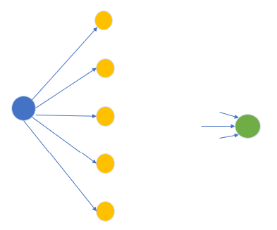
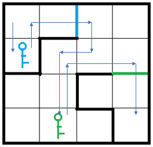
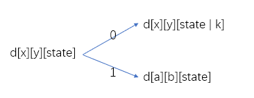

[TOC]

#### 单源最短路的扩展应用


#### 1137：选择最佳线路 （虚拟源点）

https://www.acwing.com/problem/content/1139/

问题：在**起点未知**的情况下，**终点已知**的情况下求最短路。

有 $1000$ 个点，$20000$ 条边，如果直接暴力求每个起点的最短路，时间复杂度是 $1000 * 20000 * log_{1000}$,一定会超时。

那么可以添加一个**虚拟源点**。可以直接求虚拟源点到中终点的最短路就可以了



蓝色为虚拟源点，绿色为终点。

```c++
#include<bits/stdc++.h>
using namespace std;
const int N = 1010 , M = 21010;  // 注意加虚拟源点的 1000条边
int n, m ,T;
int h[N] , e[M] , ne[M] , w[M] , idx;
int dist[N] , q[N];
bool v[N]; // spfa 中的这个数组 标记的是该点是否在队列中

void add(int a, int b, int c)  // 添加一条边a->b，边权为c
{
    e[idx] = b, w[idx] = c, ne[idx] = h[a], h[a] = idx ++ ;
}

int spfa()
{
    memset(dist , 0x3f , sizeof dist);
    dist[0] = 0;
    
    int hh = 0 , tt = 1;
    q[0] = 0 ,v[0] = 1;
    
    while(hh != tt)
    {
        int t = q[hh++];
        if(hh == N) hh = 0;
        v[t] = 0;
        
        for(int i = h[t] ; ~i ; i = ne[i])
        {
            int j = e[i];
            if(dist[j] > dist[t] + w[i])
            {
                dist[j] = dist[t] + w[i];
                if(!v[j])
                {
                    q[tt++] = j;
                    if(tt == N) tt = 0;
                    v[j] = 1;
                }
            }
        }
    }
    
    if(dist[T] == 0x3f3f3f3f) return -1;
    return dist[T];
}

int main()
{
    while(scanf("%d%d%d", &n, &m , &T) != -1)
    {
        memset(h, -1 , sizeof h);
        idx = 0;
        while(m--)
        {
            int a, b, c;
            scanf("%d%d%d", &a, &b , &c);
            add(a, b, c);
        }
        
        int s;
        scanf("%d", &s);
        while(s--)
        {
            int ver;
            scanf("%d", &ver);
            add(0 , ver , 0); // 加入虚拟源点
            
        }
        printf("%d\n" , spfa());
    }
    
    return 0;
}
```

#### 1131：拯救大兵瑞恩 （分层图）

https://www.acwing.com/problem/content/1133/

**样例解释**



如果没有钥匙的约束，那么就是 BFS 的问题。但是此时多了一个限制：**钥匙**。这就迫使我们每次在到达门之后要多考虑一个 **state**。

**状态表示**： `d[x][y][state]`

​		集合：所以从起点走到 `(x, y)`这个格子，且当前已经拥有的钥匙是 `state`的路线集合。

​		属性：最小值（最短距离）

**状态计算**：(考虑当前状态可以更新哪些状态)

​	1：`(x, y)` 这里本身就有 $K$ 把钥匙,可以直接拿起,那么当前状态就可以更新状态：                                   `d[x][y][state | K] = min(d[x][y][state] , d[x][y][state|K])`

​    2：向上下左右四个方向走，走到点是 `(a,b)`

​			①：没有任何 门 或 墙。

  		  ②：有门，且有匹配的钥匙`d[a][b][state] = min(d[a][b][state]  , d[x][y][state] + 1)`

只是用Dp来考虑问题（Dp要想解决最短路解决的都是有拓扑序 的图）而本图中可能存在环，所以不能直接使用 Dp 去解决这个问题。 用 Dp 分析完问题之后，再将问题转化回最短路的问题进行求解。	  

根据 Dp 的分析结果来看，图中就只存在两种边 $0$ 或 $1$ 。那么就可以转化为 双端队列 BFS 问题。



**分析过程**

利用 Dp 分析状态之间的 **转移关系** ——— 再将这种转移关系转换成图中 **点和点之间的关系（边）**。

**输入输出注意点**

```c++
#include<bits/stdc++.h>
#define x first
#define y second

using namespace std;
typedef pair<int, int> PII;
const int N = 11 , M = N * N, E = 400 , P = 1 << 10;

int n, m, k, p;
int h[M] , e[E] , w[E] , ne[E] ,idx;
int g[N][N] , key[M];
int dist[M][P];
bool v[M][P];

set<PII> edges; // 用于存储当前 那些边已经加入

void add(int a , int b, int c)
{
    e[idx] = b, ne[idx] = h[a] , w[idx] = c, h[a] = idx++;
}

void build()
{
    int dx[4] = {-1 , 0 , 1, 0} , dy[4] = {0 , 1, 0 , -1};
    
    for(int i = 1 ; i <= n ; i++)
        for(int j = 1 ; j <= m ; j++)
            for(int u = 0 ; u < 4 ; u++)
            {
                int x = i + dx[u], y = j + dy[u];
                if(!x || x > n || !y || y > m) continue;
                int a = g[i][j] , b = g[x][y];
                
                // 这条边没有出现过，那它就是没有门也没有墙,用0表示
                if(edges.count({a,b}) == 0) add(a, b, 0);
            }
}

int bfs()
{
    memset(dist, 0x3f , sizeof dist);
    dist[1][0] = 0; 
    deque<PII> q;
    q.push_back({1, 0});
    
    while(q.size())
    {
        PII t = q.front();
        q.pop_front();
        
        
        if(v[t.x][t.y]) continue;
        v[t.x][t.y] = 1;
        
        if(t.x == n * m) return dist[t.x][t.y];
        
        if(key[t.x]) // 当前有钥匙
        {
            int state = t.y | key[t.x];
            if(dist[t.x][state] > dist[t.x][t.y])
            {
                dist[t.x][state] = dist[t.x][t.y];
                q.push_front({t.x , state});
            }
        }
        
        // 正常边
        for(int i = h[t.x] ; ~i ; i = ne[i])
        {
            int j = e[i];
            // 有门, 没钥匙。
            if(w[i] && !(t.y >> (w[i] - 1) & 1)) continue;
            if(dist[j][t.y] > dist[t.x][t.y] + 1)
            {
                dist[j][t.y] = dist[t.x][t.y] + 1;
                q.push_back({j , t.y});
            }
        }
    }
    return -1;
}

int main()
{
    cin >> n >> m >> p >> k;
    memset(h, -1, sizeof h);
    
    // 编号
    for(int i = 1 , t = 1; i <= n ; i++)
        for(int j = 1 ; j <= m ; j++)
            g[i][j] = t++;
    
    while(k--)
    {
        int x1 , y1 , x2, y2 , c;
        cin >> x1 >> y1 >> x2 >> y2 >> c;
        int a = g[x1][y1] , b = g[x2][y2];
        edges.insert({a, b}), edges.insert({b, a});
        
        // 这里 c 表示的是门的类型
        if(c) add(a, b, c) , add(b, a, c); 
    }
    

    build(); 

    int s;
    cin >> s;
    while(s--)
    {
        int x, y, id;
        cin >> x >> y >> id;
        key[g[x][y]] |= 1 << id - 1; // -1 让编号从一开始
    }
        
    cout << bfs() << endl;
    
    return 0;
}
```

#### 1134：最短路数计数

https://www.acwing.com/problem/content/1136/


#### 383：观光

https://www.acwing.com/problem/content/385/


