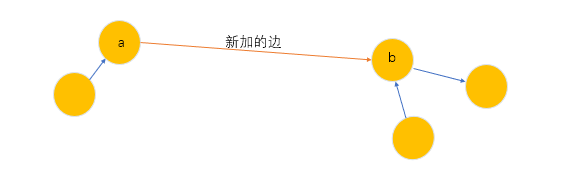

[TOC]


#### Floyed算法

时间复杂度  $O(N^3)$

设 **$D[k,i,j]$** 表示  “**经过若干个编号不超过 k 的节点**”从 $i$ 到  $j$  的最短路长度。该问题可划分为两个子问题，经过编号不超过$ k－1$ 的节点从 $i$  到 $j$，或者从 $i$ 先到  $k$  再到 $j$。于是：
$$
D[k,i,j] = min(D[k-1,i,j],D[k-1,i,k] + D[k-1,k,j])
$$
初值为 $D[k,i,j]$  = $A[i,j]$,其中 $A$ 为邻接矩阵。

可以看到,Floyd算法的本质是动态规划。**$k$ 是阶段,所以必须置于最外层循环中**。$i$ 和 $j$  是附加状态,所以应该置于内层循环。这也解释了为何很多初学者按照  $i$ ,  $j$ , $k$ 的顺序执行循环，会得到错误的结果。
	与背包问题的状态转移方程类似，**$k$ 这一维可被省略**。最初，我们可以直接用 $D$ 保存邻接矩阵，然后执行动态规划的过程。当最外层循环到 $k$ 时，内层有状态转移：
$$
D[i,j] = min(D[i,j],D[i,k]+ D[k,j])
$$
最终 $D[i,j]$ 就保存了 $i$  到  $j$  的最短路长度。

```c++
int d[310][310], n , m;
int main()
{
    cin >> n >> m;
    // 将 d 数组初始化为邻接矩阵
    memset(d, 0x3f , sizeof d);
    for(int i = 1 ; i <= n ; i++) d[i][i] = 0;
    
    for(int i = 1 ; i <= m ; i++){
        int x, y, z;
        scanf("%d%d%d", &x, &y ,&z);
        d[x][y] = min(d[x][y] , z);
    }
    
    //  floyd 求任意两点间的最短路径
    for(int k = 1 ; k <= n ; k++)
        for(int i = 1 ; i <= n ; i++)
            for(int j = 1 ; j <= n ; j++)
                d[i][j] = min(d[i][j] , d[i][k] + d[k][j]);
    
    //  输出
    for(int i = 1 ; i <= n ; i++){
        for(int j = 1 ; j <= n ; j++) printf("%d " , d[i][j]);
    	puts("");	
    }
}
```

#### Floyd算法应用

1. 最短路
2. 传递闭包
3. 找最小环
4. 恰好经过 $K$ 条边的最短路 （倍增）

##### **传递闭包**   时间复杂度 $O(N^3)$

在交际网络中，给定若干个元素和若干对二元关系，且关系具有传递性①。通过传递性推导出尽量多的元素之间的关系”的问题被称为传递闭包。

① 传递性：设 $R$ 是定义在集合 $S$ 上的二元关系，若对于 $a,b$  属于 $S$，只要有  $aRb$   且  $bRc$ ，就必然
有 $aRc$，则称关系 $R$ 具有传递性。

建立邻接矩阵 $d$,其中 $d[i][j] = 1$,表示 $i$ 和 $j$ 有关系，$d[i][j] = 0$ 表示 $i$ 和  $j$ 没有关系。并且始终有     $d[i][i] = 1$.

```c++
// 使用 Floyd 算法解决传递闭包问题
bool d[310][310];
int n , m;

int main()
{
    cin >> n >> m;
    for(int i = 1 ; i < n ; i++) d[i][i] = 1;
    
    for(int i = 0 ; i < m ; i++){
        int x, y;
        scanf("%d%d" , &n ,&m);
        d[x][y] = d[y][x] = 1;
    }
    
    //  求解传递闭包
    for(int k = 1 ; k <= n ; k++)
        for(int i = 1 ; i <= n ; i++)
            for(int j = 1 ; j <= n ; j++)
                d[i][j] |= d[i][k] & d[k][j];
    
 	return 0;   
}

/*

d[i][k] & d[k][j] 是短路与，当同时为 1 时，结果为 1.
d[i][j] | ( d[i][k] & d[k][j] )

*/
```

#### 1125：牛的旅行 (Floyd 求最短路)

https://www.acwing.com/problem/content/1127/


不同的牧场有不同的直径，现在需要将两个牧场合在一起，并且有多个牧场，现在需要将其两两组合组成不同的牧场，并且需要组成的这些牧场的**最大直径尽可能的小**。

对于任意的两个连通块的最大直径分别是 $d_1$ 和  $d_2$，设最大直径为 $D$，两个连通块相互连通的点分别为$a$ 和$b$，$1$ 连通块中距离 $a$ 最远的点为 $g_1$,2连通块中距离 $b$ 最远的点为 $g_2$，不管怎么添加边，则有：

-  $D_1≥max(d_1,d_2)$
- $D = max(D_1 ,(d_{a}^{g_1} + d_{b}^{g_2} + 1))$


- 首先使用 Floyd 算法求得所有点之间的最短距离，这样也就求得某个连通块内两点之间的距离，也就求得每个连通块的直径。
- 求 $maxd[i]$，表示和 $i$  连通且距离  $i$  最远的点的距离。

​			1：求所有的 $maxd[N]$ 的最大值

​			2：枚举在哪个点之间连边， $i$ ,$j$ ,需要满足  $d[i][j] = INF$ ,(即不连通) 
$$
D = maxd[i] + dist[i][j] + maxd[j]
$$
综上： $D = max(D, maxd[N])$

```c++
#include<bits/stdc++.h>
#define x first
#define y second
using namespace std;
typedef pair<double, double> PDD;
const int N = 155;
const double INF = 1e20;

int n;
PDD q[N]; // 存牧区点的坐标
double d[N][N] , maxd[N];
char g[N][N];

double get_d(PDD a ,PDD b) // 获取不连通的两点的距离
{
    double dx = a.x - b.x;
    double dy = a.y - b.y;
    return sqrt(dx * dx + dy * dy);
}

int main()
{
    cin >> n;
    for(int i = 0 ; i < n ; i++) cin >> q[i].x >> q[i].y;
    for(int i = 0 ; i < n ; i++) cin >> g[i];
    
    // 将所点之间的距离置为正无穷
    for(int i = 0 ; i < n ; i++)
        for(int j = 0 ; j < n ; j++)
            if(i == j) d[i][j] = 0;
            else if(g[i][j] == '1') d[i][j] = get_d(q[i] ,q[j]);
            else d[i][j] = INF;
            
    // 做一遍 Floyd
    for(int k = 0 ; k < n ; k++)
        for(int i = 0 ; i < n ; i++)
            for(int j = 0 ; j < n ; j++)
                d[i][j] = min(d[i][j] , d[i][k] + d[k][j]);
    
    // 1: 求 maxd[] 中的最大值
    double res1 = 0;
    for(int i = 0 ; i < n ; i++)
    {
        for(int j = 0 ; j < n ; j++)
            if(d[i][j] < INF / 2) // 连通
                maxd[i] = max(maxd[i] , d[i][j]);
        res1 = max(res1 , maxd[i]);
    }
    
    // 2: 不同选择的最小值
    double res2 = INF;
    for(int i = 0 ; i < n ; i++)
        for(int j = 0 ; j < n ; j++)
            if(d[i][j] > INF / 2)
                res2 = min(res2 , maxd[i] + maxd[j] + get_d(q[i] , q[j]));
                

    printf("%.6lf\n" , max(res1 , res2));

    return 0;
} 
```

#### 343：排序 （传递闭包）

https://www.acwing.com/problem/content/345/

通过传递闭包来判断 图中 点的关系

分为三种情况：

1. 矛盾 ， $d[i][i] = 1$
2. 关系唯一确定,  `(d[i][j] != d[j][i]) && (d[i][j] || d[j][i] == 1)`
3. 不能判断出矛盾，并且不能确定唯一关系。

每次读入一条边之后，计算一次传递闭包。 时间复杂度 $O(mn^3)$

**怎样确定顺序：** 每次输出时输出已有中最小的即可。

```c++
#include<bits/stdc++.h>
using namespace std;

const int N = 26;

int n ,m;
bool g[N][N] , d[N][N];
bool v[N];

//  传递闭包
void floyd()
{
    memcpy(d, g, sizeof d);
    
    for(int k = 0 ; k < n ; k++)
        for (int i = 0; i < n; i ++ )
            for (int j = 0; j < n; j ++ )
                d[i][j] |= d[i][k] & d[k][j];
}

//  判断 关系
int check()
{
    for(int i = 0 ; i < n ; i++)
        if(d[i][i])
            return 2;
    
    for(int i = 0 ; i < n ; i++)
        for(int j = 0 ; j < i ; j++)
            if(!d[i][j] && !d[j][i])
                return 0;
                
    return 1;
}
//  排序
char get_min()
{
    for (int i = 0; i < n; i ++ )
        if(!v[i])
        {
            bool flag = 1;
            for (int j = 0; j < n; j ++ )
                if(!v[j] && d[j][i])
                {
                    flag = 0;
                    break;
                }
            if(flag)
            {
                v[i] = 1;
                return 'A' + i;
            }
        }
        
}

int main()
{
    while(cin >> n >> m , n || m)
    {
        memset(g, 0 , sizeof g);
        int type = 0 , t;
        for(int i = 1 ; i <= m ; i++)
        {
            char str[5];
            cin >> str;
            int a = str[0] - 'A', b = str[2] - 'A';
            
            if(!type)
            {
                g[a][b] = 1;
                floyd();
                
                type = check();
                if(type) t = i;
            }
        }
        if(!type) puts("Sorted sequence cannot be determined.");
        else if(type == 2) 
            printf("Inconsistency found after %d relations.\n" , t);
        else 
        {
            memset(v , 0 , sizeof v);
            printf("Sorted sequence determined after %d relations: " , t);
            for(int i = 0 ; i < n ; i++)
                printf("%c" , get_min());
            printf(".\n");
        }
    }
    
    return 0;
} 
```

**增量算法 $o(mn^2)$**



如果每一次加一条边的话就需要做 $m$ 次 floyd 算法，然后已经存在的传递关系会被重复枚举。

所以每次只需要  枚举新加的边的两个点 ， 

加一条边  `a -> b`

- 枚举一个 $x$ , 若 `x -> a ` , 则有 `x -> b`

- 枚举一个 $x$ , 若 `b -> x ` , 则有 `a -> x`
- 枚举  $x$ , $y$ ,若 `x -> a && b -> y` ,则有 `x -> y`

```c++
#include<bits/stdc++.h>
using namespace std;

const int N = 26;

int n ,m;
bool d[N][N];
bool v[N];

int check()
{
    for(int i = 0 ; i < n ; i++)
        if(d[i][i])
            return 2;
    
    for(int i = 0 ; i < n ; i++)
        for(int j = 0 ; j < i ; j++)
            if(!d[i][j] && !d[j][i])
                return 0;
                
    return 1;
}

char get_min()
{
    for (int i = 0; i < n; i ++ )
        if(!v[i])
        {
            bool flag = 1;
            for (int j = 0; j < n; j ++ )
                if(!v[j] && d[j][i])
                {
                    flag = 0;
                    break;
                }
            if(flag)
            {
                v[i] = 1;
                return 'A' + i;
            }
        }
        
}

int main()
{
    while(cin >> n >> m , n || m)
    {
        memset(d , 0 , sizeof d);
        
        int type = 0 , t;
        for(int i = 1 ; i <= m ; i++)
        {
            char str[5];
            cin >> str;
            int a = str[0] - 'A', b = str[2] - 'A';
            
            if(!type)
            {
                d[a][b] = 1;
                
                // 每加一条边时
                // 只对连接 a  和 由 b 扩展出来的 点进行传递
                for (int x = 0; x < n; x ++ )
                {
                    // x -> a , a -->  b ,所以 x -> b
                    if (d[x][a]) d[x][b] = 1;
                    // b -> x , a -->  b ,所以 a -> x
                    if (d[b][x]) d[a][x] = 1;
                    for (int y = 0; y < n; y ++ )
                        if (d[x][a] && d[b][y])
                            d[x][y] = 1;
                }
                
                
                type = check();
                if(type) t = i;
            }
        }
        if(!type) puts("Sorted sequence cannot be determined.");
        else if(type == 2) 
            printf("Inconsistency found after %d relations.\n" , t);
        else 
        {
            memset(v , 0 , sizeof v);
            printf("Sorted sequence determined after %d relations: " , t);
            for(int i = 0 ; i < n ; i++)
                printf("%c" , get_min());
            printf(".\n");
        }
    }
    
    return 0;
}
```

#### 344：观光之旅 (找最小环)

https://www.acwing.com/problem/content/346/

​		首先题目是一个最优化问题，这需要从很多方案中去选择一个方案，此时就有一个问题，怎样去划分这些方案才能不重不漏，可以从集合的角度去考虑问题，并且可以想到**用节点编号去划分**。

这里想到用节点标号去划分是源于 Floyd 的算法过程，当 Floyd 算法的最外层循环 $k$ 刚开始时, **$d[i][j]$ 保存着编号不超过 $k-1$ 的节点**，从 $i$ 到 $j$  的最短路长度。

所以 ,  $min_{1≤i＜j＜k}(d[i,j] + a[i,k] + d[k.j])$  就是满足以下两个条件的最小环长度。

1. 由编号不超过 k 的节点构成。
2. 经过节点 k。

​		上式中的 $i$ ， $j$，相当于枚举了环上与 $k$ 相邻的两个点。故以上结论显然成立。对于任意的 $k$ 存在$ [1,n]$，都对上式进行计算，取最小值，即可得到整张图的最小环。在该算法中，我们对每个 $k$ 只考虑了由编号不超过 $k$ 的节点构成的最小环，没有考虑编号大于 $k$ 的节点。事实上，由对称性可知，这样做并不会影响结果。

```c++
#include<bits/stdc++.h>
using namespace std;
typedef long long LL;

const int N = 110 , INF = 0x3f3f3f3f;
int n , m;
int d[N][N] ,g[N][N];
int pos[N][N]; // 记录两点之间 是否存在 k 去
int path[N] , cnt; // path 时当前最小环的方案 ， cnt 是 path 的长度


void get_path(int i ,int j)  //  递归求解 [i ,j] 之间编号
{
    if(pos[i][j] == 0) return;
    
    int k = pos[i][j];
    get_path(i , k); //  递归求解 [i ,k]
    path[cnt ++] = k;  //  把 k 加进去
    get_path(k , j); //  递归求解 [j ,k]
}

int main()
{
    cin >> n >> m;
    memset(g, 0x3f , sizeof g);
    for(int i = 1 ; i <= n ; i++) g[i][i] = 0;
    
    while(m--)
    {
        int x, y, z;
        scanf("%d%d%d", &x, &y , &z);
        g[x][y] = g[y][x] = min(g[x][y] , z);
    }
    
    memcpy(d , g , sizeof d);
    int ans = INF;
    for(int k = 1 ; k <= n ; k++)
    {
        //  因为是对称的，所以只需要枚举一半即可
        for(int i = 1 ; i < k ; i++)
            for(int j = i + 1 ; j < k ; j++)
                if((LL)d[i][j] +g[j][k] +g[k][i] < ans)
                {
                    // 环的长度
                    ans = d[i][j] +g[j][k] +g[k][i];
                    cnt = 0;
                    //  把所有的编号加入 path
                    path[cnt ++] = i;
                    get_path(i, j);
                    path[cnt ++] = j;
                    path[cnt ++] = k;
                }
        
        for(int i = 1 ; i <= n ; i++)
            for(int j = 1 ; j <= n ; j++)
                if(d[i][j] > d[i][k] + d[k][j])
                {
                    d[i][j] = d[i][k] + d[k][j];
                    pos[i][j] = k; //  存下更新 i , j 点，以便后面求路径
                }
    }
    
    if(ans == INF)
    {
        puts("No solution.");
        return 0;
    }
    
    for(int i = 0 ; i < cnt ; i++)
        printf("%d " , path[i]);
    puts("");
    
    return 0;
}
```

#### 345：牛站  (可达矩阵)

https://www.acwing.com/problem/content/347/

​	虽然点的编号在 $1$~$1000$ 之间，但边最多只有 $100$ 条。我们可以先对点的编号进行离散化，把点的编号映射为 $1$~$P$ 的整数，其中 $P ≤ 2T$。

在离散化之后，设 $P * P$ 的邻接矩阵 $A$ 存储了图中的边，考虑以下方程：

​						对于任意的 $i$ , $j$ 属于 $[1.P]$ ,  $B[i,j] = min_{1≤k≤P}(A[i,k] + A[k,j])$ 

​	我们可以认为 $A[i , j]$ 表示从 $i$到 $j$ 经过一条边的最短路。在上面的方程中，对于每对二元组$(i ,j)$，我们枚举了中转点 $k$，从$i$ 先到 $k$，然后再到 $j$。因此 $B[i,j]$ 表示从 $i$ 到  $j$ 经过两条边的最短路。
一般地，**若矩阵 $A^m$ 保存任意两点之间恰好经过 $m$ 条边的最短路**，则：

​						对于任意的 $i$ , $j$ 属于 $[1,P]$ ,  $A^{r+m}[i,j]=min_{1≤k≤P}\{(A^r)[i,k]+(A^m)[k,j]\}$

我们发现上式其实等价于一个关于 $min$ 与加法运算的广义 “矩阵乘法”。显然，这个广义的”矩阵乘法“也满足结合律。因此，我们可以用快速幂计算出 $A^N$ ,具体的实现方式就是，在计算一般矩阵幂的基础上，把原来的乘法用加法代替，把原来的加法用 $min$ 代替。

最后答案即为 $(A^N)[S,E]$ .时间复杂度 $O(T^3log_N)$

题目要求的是 求恰好经过 $k$ 条边的最短路。

那么我们通过 $A^1$ 一条通路可达矩阵和矩阵乘法就可以求出  $k$ 条通路可达的矩阵 $A^k$ .

但是只由一个可达矩阵是不能求得最短路的，由上式可知需要两个式子，即 $r + m = k$ 时，求最短路。  

对于 Floyd 算法来说，`d[i,j,k]` 表示的是从 $i$ 到 $j$ 只经过 $1$ ~ $k$ 的最短路径。

对于本题来说， `d[i,j,k]` 表示的是从 $i$ 到 $j$  只经过 $k$ 条边的最短路径。

```c++

```


