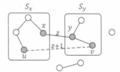

[TOC]

#### 1146：新的开始 （虚拟源点）

https://www.acwing.com/problem/content/1148/

这里的费用有两部分，一部分是在 **某个点** 上，一部分在边上，那么可以建立一个虚拟源点，**将这个虚拟源点到图中点上边的权值 设为该点建站的费用**，这样的话，问题就转换成在原图 加上 虚拟源点的基础上求最小生成树的问题。

```c++
#include<bits/stdc++.h>
using namespace std;
const int N = 305;

int n;
int w[N][N];
int d[N];
bool v[N];

int prim()
{
    int res = 0;
    memset(d , 0x3f , sizeof d);
    memset(v, 0 ,sizeof v);
    d[0] = 0;
    // 0 ~ n 是 n + 1 点。循环 n + 1次
    for(int i = 0 ; i < n + 1; i++)
    {
        int x = -1;
        for(int j = 0 ; j <= n ; j++) // 注意不要循环出界
            if(!v[j] && (x == -1 || d[x] > d[j]))
                x = j;
                
        v[x] = 1;
        res += d[x];
        
        for(int y = 0 ; y <= n; y++)
            d[y] = min(d[y] , w[x][y]);
    }
    return res;
}

int main()
{
    scanf("%d", &n);
    //  初始化虚拟源点到每个节点距离，即每个点建站的费用
    for (int i = 1; i <= n; i ++ )
    {
        scanf("%d", &w[0][i]);
        w[i][0] = w[0][i];
    }
    
    for(int i = 1 ; i <= n ; i++)
        for(int j = 1 ; j <= n ; j++)
            scanf("%d", &w[i][j]);
            
    printf("%d\n" ,prim());
    
    return 0;
}
```

#### 1145：北极通信网络

https://www.acwing.com/problem/content/1147/

有 $k$ 个卫星，这 $k$  个卫星可以将原图的连通块划成  $≤k$ 个。并且我们希望在连通的情况下 $d$ 值尽可能小，那么就去**最大值最小**。在对边权排序之后，通过并查集向后枚举即可找到 不超过 $k$ , 且此时可以知道连通块的数量，那么问题就转化为： 

找一个最小的 $d$ 值，使得将所有权值大于 $d$ 的边删去之后，整个图形的连通块数**不超过**  $k$。

随着连通块的减少， d 是不断增加的。

```c++
#include<bits/stdc++.h>
#define x first
#define y second
using namespace std;
typedef pair<int, int> PII;

const int N = 505 , M = N * N / 2;
int n ,k , cnt;
struct Edge{
    int x, y;
    double w;
    bool operator<(const Edge& T) const{
        return w < T.w;
    }
}e[M];
int p[M];
PII q[N];

int find(int x)  // 并查集
{
    if (p[x] != x) p[x] = find(p[x]);
    return p[x];
}

double get_d(PII a , PII b)
{
    int dx = a.x - b.x;
    int dy = a.y - b.y;
    return sqrt(dx * dx + dy * dy);
}

int main()
{
    scanf("%d%d", &n, &k);
    for(int i = 0 ; i < n ; i++) scanf("%d%d", &q[i].x, &q[i].y);
    for (int i = 1; i <= n; i ++ ) p[i] = i;
    
    for (int i = 0; i < n; i ++ )
        for (int j = 0; j < i; j ++ )
            e[cnt ++] = {i , j ,get_d(q[i] ,q[j])};
            
    sort(e , e + cnt);
    
    int num = n; //  纵坐标 (连通块个数)
    double ans = 0; //  横坐标 (d 值)
    //  从小到大枚举横坐标 (d 值)
    for(int i = 0 ; i < cnt ; i++)
    {
        if(num <= k) break; // 满足条件时
        
        int a = find(e[i].x) , b = find(e[i].y);
        double c = e[i].w;
        if(a != b){
            p[a] = b;
            num--; // 每增加一个连通块，连通块数 -1
            ans = c; // 最大的 d
        }
    }
    
    printf("%.2f\n" , ans);
    
    return 0;
}
```

#### 346：走廊泼水节

https://www.acwing.com/problem/content/348/

​		$N$ 个节点的树有 $N-1$ 条边。把这 $N-1$ 条边按照权值从小到大排序，依次扫描每条边，执行一个类似于 Kruskal 算法的过程。
​		设当前扫描到边  $(x,y,z)$，$x$所在的并查集为 $S_x$，$y$ 所在的并查集为$S_y$ ,此时应该合并 $S_x$ 与 $S_y$。合并后的集合 $S_x∪S_y$ 构成一棵树的结构。

​		任意的 $u∈S_x, v∈S_y$，则在最终的完全图中，我们肯定需要在$(u, v)$之间增加一条边。于是，无向边 $(u,v)$ 、$S_x$ 中从 $u$ 到 $x$ 的路径、无向边 $(x,y)$ 以及 $S_y$ 中从  $v$  到  $y$  的路径共同构成一个环。如下图示。



​		根据之前提到的推论,为了保证  $(x,y)$  一定在最小生成树中，就必须让  $(x,y)$  是连接集合  $Sx$  与 $Sy$ 的**权值最小**的边 ( 否则就有 “ 用  $(u,v)$ 替换 $(x,y)$  ” 的方案）。因此，$(u,v)$  的边权应该定为  **$z+1$**。

$S_x$ 与 $S_y$ 之间一共会增加  $|S_x| * |S_y| - 1$条边，所以我们把  $(z+1) * (|S_x|*|S_y|-1)$ 累加到答案中即可。事件复杂度   $O(NlogN)$

为什么是 $z + 1$ 呢？

因为等于的时候 最小生成树(权值不变)就不唯一了。小于的时候最小生成树一定会杯替换，不符合题意。

```c++
#include<bits/stdc++.h>
using namespace std;
typedef long long LL;
const int N = 6010;

int n;
int p[N] , s[N];
struct Edge{
    int x, y, w;
    bool operator<(const Edge& T) const{
        return w < T.w;
    }
}e[N];

int find(int x)  // 并查集
{
    if (p[x] != x) p[x] = find(p[x]);
    return p[x];
}

int main()
{
    int t;
    scanf("%d", &t);
    while(t--)
    {
        scanf("%d", &n);
        for(int i = 1 ; i < n ; i++)
            scanf("%d%d%d", &e[i].x, &e[i].y , &e[i].w);
        for (int i = 1; i <= n; i ++ ) p[i] = i , s[i] = 1;
        
        sort(e + 1, e + n);
        
        LL ans = 0;
        for(int i = 1 ; i < n ; i++)
        {
            int a = find(e[i].x) , b = find(e[i].y);
            if(a != b) {
                ans += (LL)(e[i].w + 1) * (s[a] * s[b] - 1);
                p[a] = b;
                s[b] += s[a];
            }
        }
        
        cout << ans << endl;
    }
    return 0;
}
```


#### 1148：秘密的牛奶运输  (次小生成树)

https://www.acwing.com/problem/content/1150/

次小生成树： 给一个带权的图，把图上所有的生成树按权值从小到大排序，第二小的称为次小生成树。

第一种定义：次小生成树的权值必须大于最小生成树。

第二种定义：最小生成树不唯一


#### 练习：

##### 347：野餐规划

https://www.acwing.com/problem/content/349/


##### 348：沙漠之王

https://www.acwing.com/problem/content/350/


##### 349：黑暗城堡

https://www.acwing.com/problem/content/351/


