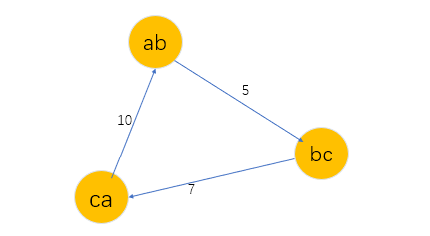

[TOC]

​		给定一张有向图  ( 无向图的每条边可以看作两条方向相反的有向边,从而按照有向图处理 ），每条边都有一个权值（长度）。若一条边的权值是负数，则称它是负权边。若图中存在一个环，环上各边的权值之和是负数，则称这个环为 “ **负环** ” 。
​		多种求解单源最短路径问题的算法。这里回顾它们的适用条件：

|       算法名称       |                        能否处理负权边                        |   时间复杂度    |
| :------------------: | :----------------------------------------------------------: | :-------------: |
|     Dijstra 算法     |  **不能**，负权可能导致当前最小的 $dist[x]$ 以后不一定最小   |    $O(n^2)$     |
| 堆优化 Dijkstra 算法 | **不能**，该算法仅当每个点第一次从堆中取出时执行，等价于选最小的 $dist[x]$ |   $O(mlogn)$    |
|  Bellman-Ford 算法   | **能**，无负环时，最短路包含的边数 $<n$ ,$n-1$ 轮迭代后一定收敛 |     $O(nm)$     |
|         SPFA         | **能**，本质就是队列优化的 Bellman-Ford, 负环只是会增加出入队的速度 | $O(km)$~$O(nm)$ |

如果图中存在负环，那么直观表现为：无论经过多少轮迭代，总存在有向边 $(x,y,z)$，使得                            $dist[y] > dist[x] + z$ ，Bellman-Ford 与 SPFA 算法永远不能结束。

​		根据抽屉原理，若存在一个 $dist[x]$，**从起点 $1$ 到节点 $x$ 的最短路包含 $≥n$ 条边**，则这条路径必然**重复经过**了某个节点 $p$ ， 换言之，这条最短路径上**存在一个环**，环上各点都能更新下一个点的 $dist$ 值。$p$ 绕这个环一圈，最终能更新它自己。因此，这个环的总长度是负数。每绕一圈，最短路长度只会越来越小，不可能收敛到每条边都满足三角不等式。基于这个理论有以下判定法则：

**Bellman-Ford 算法判断负环**

​		若经过 $n$ 轮迭代，算法仍未结束（仍有能力产生更新的边），则图中存在负环。                                                                                       

​		若 $n - 1$ 轮迭代之内，算法结束（所有边满足三角不等式），则图中无环。

**SPFA 判定负环**

- 设  $cnt[N]$  表示从  $1$ 到 $x$  的**最短路径包含的边数**， $cnt[1]=0$ 。 当执行更新 $dist[y] = dist[x] + z$ 时，同样更新 $cnt[y] = cnt[x] + 1$ 。若发现  $cnt[y]≥n$ ，则图中有负环。若算法正常结束，则图中没有负环。
- 统计**每个点入队的次数**，如果某个点入队 $n$  次，则存在负环。

在处理负环时， SPFA 一般是效率比较低的，时间复杂度在  $O(nm)$左右，此时一般都会超时，经验之谈：可以在 当所有点的入队次数超过 $2n$ 时，我们认为图中有很大可能存在负环。

**使用 SPFA 判负环时的两个点：**

- 所有节点在初始化全部入队
- $dist[N]$ 数组可以初始化为 $0$。 

​		假想一个虚拟源点，向图中每个点连一条边权值为 $0$  的边，原图中存在负环等价于加上虚拟源点后也存在负环，在新图中，负环一定是可以从 虚拟源点 走到的。在新图中一开始将 虚拟源点 插入队列，并且由于虚拟源点和所有点都是相连的，所以接下来会将 其他所有点加入队列中。那么在新图上的第一次迭代之后就等价于在原图上第一次就将所有点都加到队列中。

​		$dist[N]$ 一开始可以被初始化 $0$ 的原因是 如果图中存在负环，那么无论是 $0$ 还是 `0x3f3f3f3f` ,都会被这个负环最后减成 **负无穷**。并且次数是无限次，那么更新也就会超过 $n$ 次，也就会达到求负环的目的。所以不管初值是多大的有限值，在经过无限次的负环后都会变成负无穷。

#### 904：虫洞

https://www.acwing.com/problem/content/906/

```c++
#include<bits/stdc++.h>
using namespace std;

const int N = 510 , M = 5210;

int n, m1, m2;
int h[N], e[M], w[M] ,ne[M], idx;
int d[N];
bool v[N];
int q[N] ,cnt[N];

void add(int a, int b, int c)  // 添加一条边a->b，边权为c
{
    e[idx] = b, w[idx] = c, ne[idx] = h[a], h[a] = idx ++ ;
}

bool spfa()  // 如果存在负环，则返回true，否则返回false。
{
    // 不需要初始化dist数组
    // 原理：如果某条最短路径上有n个点（除了自己），那么加上自己之后一共有n+1个点，
    // 由抽屉原理一定有两个点相同，所以存在环。
    memset(d, 0, sizeof d);
    memset(v, 0, sizeof v);
    memset(cnt , 0 , sizeof cnt);
    
    int hh = 0, tt = 0;
    
    for (int i = 1; i <= n; i ++ ) q[tt ++ ] = i, v[i] = true;
    
    while (hh != tt)
    {
        int t = q[hh ++ ];
        if (hh == N) hh = 0;
        v[t] = false;
        
        for (int i =  h[t]; ~i; i = ne[i])
        {
            int j = e[i];
            if (d[j] > d[t] + w[i])
            {
                d[j] = d[t]  + w[i];
                
                cnt[j] = cnt[t] + 1;
                // 负环的条件
                if (cnt[j] >= n) return true;
                
                if (!v[j])
                {
                    v[j] = true;
                    q[tt ++ ] = j;
                    if (tt == N) tt = 0;
                }
            }
        }
    }
    
    return false;
}

int main()
{
    int F;
    cin >> F;
    while(F--)
    {
        cin >> n >> m1 >> m2;
        memset(h, -1, sizeof h);
        idx = 0;
        
        while (m1 -- ){
            int a ,b, c;
            cin >> a >> b >> c;
            add(a, b, c) , add(b, a ,c);
        }
        
        while (m2--){
            int a, b, c;
            cin >> a >> b >> c;
            add(a, b, -c);
        }
        if(spfa()) puts("YES");
        else puts("NO");
    }
    
    return 0;   
}
```

#### 361：观光奶牛  (0 / 1分数规划问题)

https://www.acwing.com/problem/content/363/

0 / 1 分数规划问题。 https://blog.csdn.net/niiick/article/details/80925267

​		对于一个节点 $\{v_1,v_2 ,...,v_n\}$ ，以及它们之间的有向边  $\{e_1(v_1,v_2),...,e_t = (v_t,v_1)\}$ 构成的环，记为 $S=(\{v_i\},\{e_i\})$ 。

​		首先对于 $\frac{\sum f_i}{\sum t_i}$  来说，其取值范围是 $[L,R]$ ，并且需要求解最大值。那么此时就可以利用二分来查找。每次二分都会在下面两种情况中选择一种，以此来判定 最大值 所在的区间，然后根据题目的精度求得最终的最大值（最大值其实不存在，只是精度取到这个范围）。

1. 如果图中存在一个环 $S$ ，使得 $\sum_{i=1}^{t}(mid*t[e_i]-f[v_i]) < 0$ ，那么可知：                                                
    $$
    存在 S=(\{v_i\},\{e_i\}) ，使得   \frac {\sum_{i=1}^{t}f[v_i]}{\sum_{i=1}^{t}t[e_i]} > mid
    $$
    也就是说，最大值一定大于 $mid$

2. 如果对于图中任意的环 $S$ ，都有 $\sum_{i=1}^{t}(mid*t[e_i]-f[v_i]) ≥ 0$ ，同理可得：                                                 
    $$
    任意的S=(\{v_i\},\{e_i\}) ，使得   \frac {\sum_{i=1}^{t}f[v_i]}{\sum_{i=1}^{t}t[e_i]} ≤ mid
    $$
    也就是说，最大值不超过 $mid$

对于每轮二分，我们建立一张新图，结构与原图一致，将点权放在 出边或者入边上。那么有向边的权值 $e(x,y)$ 的**权值就是 $mid * t[e] - f[v]$** ,即：本来的边权呈上 $mid$ 再减去入点的权值。

​		  那么这张新图上，$\sum_{i=1}^{t}(mid*t[e_i]-f[v_i])<0$ 的含义就是图中存在负环。因此，用 SPFA 算法在新图上求最短路，若有负环，说明 $mid$ 比答案小，应该令 $l=mid$ 。若最短路的求解正常结束，则令 $r=mid$ 。二分结束时就求出了答案。

​		对于上述权值来说：也可以化成 $f[v]-mid*t[e]$ ，那么在新图上 $\sum_{i=1}^{t}(f[v_i]-mid*t[e_i]])>0$ 就等价于求图中的正环，若有正环，说明答案比 $mid$ 大，令 $r=mid$ 即可。若无，则令 $l=mid$ ，一直到二分结束。

​		通过 0/1 规划问题模型得到二分表达式，然后通过表达式对图中的边权重新进行定义，然后在解决图论相关的问题

```c++
#include<bits/stdc++.h>
using namespace std;

const int N = 1010 , M = 5010;
int n , m;
int wf[N];
int h[N] ,e[M] , ne[M] , wt[M] ,idx;
double d[N];
int q[N] ,cnt[N];
bool v[N];

void add(int a ,int b, int c){
    e[idx] = b, ne[idx] = h[a] , wt[idx] = c , h[a] = idx++;
}

bool check(double mid)
{
    memset(v, 0 , sizeof v);
    memset(cnt , 0 , sizeof cnt);
    
    int hh = 0 ,tt = 1;
    for(int i = 1 ; i <= n ; i++) q[tt++] = i , v[i] = 1;
    
    while(hh != tt)
    {
        int x = q[hh++];
        if(hh == N) hh = 0;
        v[x] = 0;
        
        for(int i = h[x] ; ~i ; i = ne[i])
        {
            int y = e[i];
            if(d[x] + wf[x] - mid * wt[i] > d[y])
            {
                d[y] = d[x] + wf[x] - mid * wt[i];
                cnt[y] = cnt[x] + 1;
                
                if(cnt[y] >= n) return 1;
                
                if(!v[y]){
                    q[tt++] = y;
                    if(tt == N) tt = 0;
                    v[y] = 1;
                }
            }
        }
    }
    return 0;
}

int main()
{
    cin >> n >> m;
    memset(h ,-1, sizeof h);
    
    for (int i = 1; i <= n; i ++ ) cin >> wf[i];
    while (m -- ){
        int x, y, w;
        cin >> x >> y >> w;
        add(x, y, w);
    }
    
    
    double l = 0 , r = 1010; 
    while(r - l > 1e-4) // 两位小数 1e-4 , 三位小数 1
    {
        double mid = (l + r) / 2;
        if(check(mid)) l = mid;
        else r = mid;
    
    }
    printf("%.2lf\n" , r);
    
    return 0;
}
```

#### 1165：单词环 

https://www.acwing.com/problem/content/1167/

**1：建图**：首先可以直接想到以每个单词作为一个点，数据范围是 $10^5$ ，以后缀的情况数作为边那么在极限情况下，如果所有的单词的都为 相同字母，那么就会有 $(10^5)^2$ 条边，这样的话，空间和时间都会爆掉，所以不行。 

​		根据单词连接的特点，可以将 **两位字母不同的组合建为点，单词的长度建为边**。这样建的话会有 $26*26=676$个点 和 $10^5$ 条边。 

eg ： `abcabc` , `bckjaca`  ,  `caahoynaab`  




并且这建图终的环与问题中环等价。

2：求 环上$\frac {\sum w_i}{\sum e_i}$  最大（因为此时单词的数量等价于环上边的个数 $\sum e_i$, 这里的 $e_i$ 从计算方面上都取 $1$）。  0/1 分数规划问题。

答案的有解范围是 $(0,1000]$。设一个 $mid$  ，那么边权值就等价于 $w-mid*1$ ，那么要求                                $mid* 1-\sum w_i<0$ ，就等价于图中存在负环，

```c++
#include<bits/stdc++.h>
using namespace std;

const int N = 700l, M = 100010;
int n;
int h[N], e[M], ne[M], w[M], idx;
double d[N];
int q[N] , cnt[N];
bool v[N];

void add(int a, int b, int c)  // 添加一条边a->b，边权为c
{
    e[idx] = b, w[idx] = c, ne[idx] = h[a], h[a] = idx ++ ;
}


bool check(double mid)
{
    memset(v, 0 , sizeof v);
    memset(cnt , 0 , sizeof cnt);
    
    int hh = 0 , tt = 1;
    for(int i = 0 ; i < 676 ; i++) q[tt++] = i ,v[i] = 1;
    
    int count= 0;
    while(hh != tt)
    {
        int x = q[hh++];
        if(hh == N) hh = 0;
        v[x] = 0;
        
        for(int i = h[x] ; ~i ; i = ne[i])
        {
            int y = e[i];
            if(d[y] < d[x] + w[i] - mid)
            {
                d[y] = d[x] + w[i] - mid;
                cnt[y] = cnt[x] + 1;
                
                if(++count > 10000) return 1; // 经验
                
                if(cnt[y] >= N) return 1; 
                
                if(!v[y])
                {
                    q[tt++] = y;
                    if(tt == N) tt = 0;
                    v[y] = 1;
                }
            }
        }
    }
    return 0;
}

int main()
{
    char str[1010];
    while(scanf("%d",&n) , n)
    {
        memset(h, -1, sizeof h);
        idx = 0;
        
        for(int i = 0 ; i < n ; i++)
        {
            scanf("%s", str);
            int len = strlen(str);
            if(len >= 2)
            {
                int left = (str[0] - 'a') * 26 + str[1] - 'a';
                int right = (str[len-2] - 'a') * 26 + str[len-1] - 'a';
                add(left, right, len);
            }
        }
        
        if(!check(0)) puts("No solution");
        else 
        {
            double l = 0 , r = 1000;
            while(r - l > 1e-4)
            {
                double mid = (l + r)/2;
                if(check(mid)) l = mid;
                else r = mid;
            }
            printf("%lf\n" , r);
        }
    }
    
    return 0;
}
```

**对于上述题目中的经验值可能在一些情况下不是很好用。将 SPFA 的循环队列的换成栈。**

```c++
#include<bits/stdc++.h>
using namespace std;

const int N = 700l, M = 100010;
int n;
int h[N], e[M], ne[M], w[M], idx;
double d[N];
int q[N] , cnt[N];
bool v[N];

void add(int a, int b, int c)  // 添加一条边a->b，边权为c
{
    e[idx] = b, w[idx] = c, ne[idx] = h[a], h[a] = idx ++ ;
}


bool check(double mid)
{
    memset(v, 0 , sizeof v);
    memset(cnt , 0 , sizeof cnt);
    
    int tt = 0; 
    for(int i = 0 ; i < 676 ; i++) q[tt++] = i ,v[i] = 1;
    
    int count= 0;
    while(tt != 0) //  将队列换成 栈 
    {
		int x = q[-- tt];
        v[x] = 0;
        
        for(int i = h[x] ; ~i ; i = ne[i])
        {
            int y = e[i];
            if(d[y] < d[x] + w[i] - mid)
            {
                d[y] = d[x] + w[i] - mid;
                cnt[y] = cnt[x] + 1;
                
                if(cnt[y] >= N) return 1; 
                
                if(!v[y])
                {
                    q[tt++] = y;
                    v[y] = 1;
                }
            }
        }
    }
    return 0;
}

int main()
{
    char str[1010];
    while(scanf("%d",&n) , n)
    {
        memset(h, -1, sizeof h);
        idx = 0;
        
        for(int i = 0 ; i < n ; i++)
        {
            scanf("%s", str);
            int len = strlen(str);
            if(len >= 2)
            {
                int left = (str[0] - 'a') * 26 + str[1] - 'a';
                int right = (str[len-2] - 'a') * 26 + str[len-1] - 'a';
                add(left, right, len);
            }
        }
        
        if(!check(0)) puts("No solution");
        else 
        {
            double l = 0 , r = 1000;
            while(r - l > 1e-4)
            {
                double mid = (l + r)/2;
                if(check(mid)) l = mid;
                else r = mid;
            }
            printf("%.2lf\n" , r);
        }
    }
    
    return 0;
}
```


 


