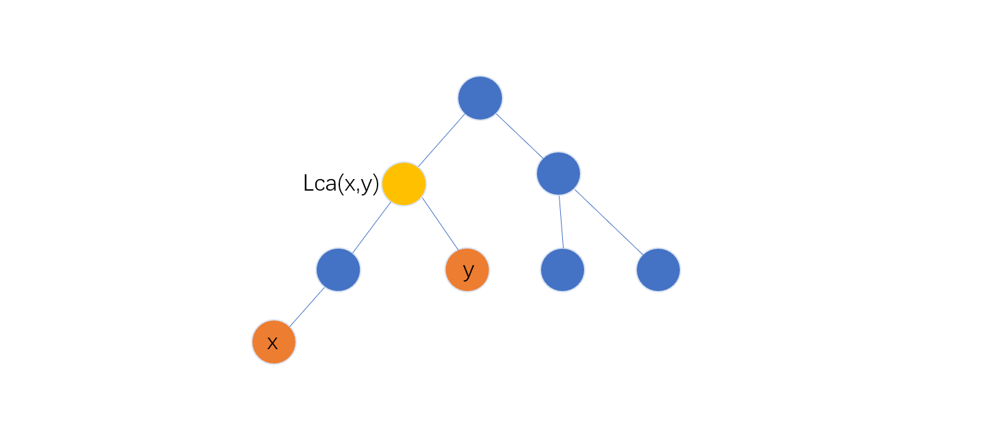

[TOC]

### **树的直径**

​		给定一棵树，树中每条边都有一个权值，树中两点之间的距离定义为连接两点路径上边权之和。树中最远的两个节点之间的距离被称为**树的直径**，连接这两点的路径被称为**树的最长链**。后者通常也可称为直径，即直径即是一个数值概念，也可以代指一条路径。

​		树的直径一般有两者求法，时间复杂度均是  $O(N)$ 。假设树以  $N$ 个点  $N-1$ 条边的无向图形式给出，并储存在邻接矩阵中。

#### **树形DP求解树的直径**

​		设 $1$ 号节点为根，$N$ 个点  $N-1$ 条边的无向图可以看作是 ”有根树“。

​		设 $D[x]$  表示从节点  $x$  出发走向以  $x$  为根的子树，能够到达的最远节点的距离。设  $x$  的子节点为   $y_1,y_2,...,y_t$ ，$edge(x, y)$ 表示边权，显然有：
$$
D[x]=max_{1≤i≤t}(D[y_i]+edge(x,y_i))
$$
​		考虑对每个节点  $x$  求出  ”经过节点  $x$  的最长链的长度 “   $F[x]$ ，那么整颗树的直径就是                $max_{1≤i≤n}(F[x])$ 。

​		如何求出 $F[x]$ ？对于  $x$  的任意两个节点   $y_i$ 和  $y_j$ ，” 经过节点  $x$  的最长链的长度  “ 可以通过四个部分构成：

1. 从  $y_i$  到  $y_i$  子树中的最短距离
2. 边  $(x , y_i)$
3. 边  $(x, y_j)$
4. 从  $y_j$   到  $y_j$ 子树中的最短距离 

设  $j<i$ ,因此有：
$$
F[x]=max_{1≤j≤i≤t}(D[y_i]+D[y_j]+edge(x,y_i)+edge(x,y_j))
$$
​		结合 $D[x]$ 的计算过程，在子节点的循环将要枚举到  $i$ 时， $D[x]$ 恰好保存了从节点  $x$  出发走向 ”以  $y_j(j<i)$  为根的子树，能够达到的最短节点的距离，这个距离是  $max_{1≤j<i}(D[y_j]+edge(x,y_j))$  ，所以我们先使用  $D[x]+D[y_i]+edge(x,y_i)$ 更新  $F[x]$ ，再用  $D[y_i] + edge(x,y_i)$ 更新 $D[x_i]$ 即可。

```c++
// v[N] 为标记数组 , h[N] ,e[N] ,ne[N] ,w[N] 均为模拟链表的数组
void dp(int x)
{
    v[x] = 1;
    for(int i = h[x] ; ~i ; i = ne[x])
    {
        int y = e[i];
        if(!v[y]){
            dp(y);
            ans = max(ans , d[x] + d[y] + w[i]);
            d[x] = max(d[x] , d[y] + w[i]);
        } 
    }
}
```

#### **两次 BFS 求解树的直径**

​		通过两次 BFS 或者两次  DFS 也能求出树的直径，并且容易计算出直径上的具体节点。做法包括两步。

1. 从任意一个节点出发，通过 BFS 或者 DFS 对树进行一次遍历，求出与出发点距离最远的节点，记为  $p$ 。
2. 从节点  $p$  出发，通过  BFS  或者  DFS  再进行一次遍历，求出与  $p$  距离最远的节点记为  $q$ 。

​		从  $p$  到  $q$  的路径就是树的一条直径，这是因为  $p$  一定是直径的一段，否则总能找到一个更长的链，与直径的定义矛盾。既然  $p$  是直径的一段，那么与  $p$  距离最远的  $q$  当然就是直径的另一端。

​		在第二步遍历过程中，可以记录下来每个点第一次被访问时的前驱节点，最后从  $q$  递归回到  $p$ ，即可得到直径的方案。

**注意**：

两次  BFS  求直径的方法 **只适用于边权均非负的情况** 。如果树上存在负权边，那么就不能成立。此时只能通过树形 DP 来求解。


### **最近公共祖先 (LCA)**

​		给定一棵有根树，若节点  $z$  既是节点  $x$  的祖先，也是节点   $y$   的祖先，则称  $z$  是  $x,y$
的公共祖先。在  $x,y$  的所有公共祖先中，**深度最大**的一个称为  $x,y$  的最近公共祖先，记为 $LCA(x,y)$。


​		$LCA(x,y)$ 是 $x$ 到根的路径与 $y$ 到根的路径的交会点。它也是 **$x$ 与 $y$ 之间的路径上深度最小的节点**。求最近公共祖先的方法通常有三种：

#### **向上标记法**

​		从 $x$ 向上走到根节点，并标记所有经过的节点。
​		从 $y$ 向上走到根节点，当第一次遇到已标记的节点时，就找到了 $LCA(x,y)$。
​		对于每个询问，向上标记法的时间复杂度最坏为 $O(n)$。

#### **树上倍增法**

​		树上倍增法是一个很重要的算法。除了求 $LCA$ 之外，它在很多问题中都有广泛应用。

​		设 $F[x,k]$  表示  $x$  的 $2^k$ 辈祖先 ，即从 $x$ 向根节点走 $2^k$  步到达的节点。特别地，若该节点不存在，则令 $F[x,k] = 0$。$F[x,0]$ 就是 $x$ 的父节点。除此之外，

​						任意的 $k∈[1, logn], F[x,k] = F[F[x,k - 1],k - 1]$ 。

​		这类似于一个动态规划的过程，“阶段” 就是节点的**深度**。因此，我们可以对树进行广度优先遍历，按照层次顺序，在节点入队之前，计算它在 $F$ 数组中相应的值。以上部分是预处理，时间复杂度为 $O(n logn)$，之后可以多次对不同的 $x,y$  计算 $LCA$，每次询问的时间复杂度为 $O(logn)$。
基于 $F$ 数组计算 $LCA(x,y)$ 分为以下几步：

1. 设 $d[x]$ 表示 $x$ 的深度。不妨设 $d[x]≥ d[y]$（否则可交换  $x,y$ )。
2. 用二进制拆分思想，把 $x$ 向上调整到与 $y$ 同一深度。具体来说，就是依次尝试从 $x$ 向上走 $k = 2^{logn} , … , 2^1 , 2^0$ 步，检查到达的节点是否比 $y$ 深。在每次检查中，若是，则令 $x = F[x,k]$。
3. 若此时 $x = y$，说明已经找到了 $LCA$，$LCA$ 就等于  $y$。

这就是上面的图中的第三种情况。

  4：用二进制拆分思想，把 $x,y$ 同时向上调整，并保持深度一致且二者不相会。具体来说，就是依次尝试把 $x,y$ 同时向上走  $k = 2^{logn} , … , 2^1 , 2^0$  步，在每次尝试中，若 $F[x,k]≠F[y,k]$（即仍未相会），则令 $x = F[x,k],y = F[y,k]$。
  5：此时 $x,y$ 必定只差一步就相会了，它们的父节点  $F[x,0]$  就是 $LCA$。

**多次查询树上两点之间的距离，时间复杂度为 $O((n + m)logn)$**。

```c++
//  多次查询树上两点之间的距离板子
//  树上倍增
const int N = 50010 , M = 2 * N;
int f[N][20] , d[N] , dist[N]; // d[]是 depth[], dist[] 存储该点到根节点的最短距离
int T  ,t , n , m; 
int h[N] , e[M] , ne[M] , w[M] , idx; 
int q[N];  

void add(int a, int b, int c){
    e[idx] = b, ne[idx] = h[a], w[idx] = c, h[a] = idx++;
}

//  预处理  f[x, k]不存在时=0; f[x, k] = f[f[x, k - 1] ,k - 1]
void bfs(int){
    memset(dist , 0x3f , sizeof dist);
   	d[0] = 0; // 哨兵
    d[root] = 1;  
    int hh = 0 , tt = 0;
    q[0] = root;   
    while(hh <= tt)
    {
        int x = q[hh++];       
        for(int i = h[x] ; ~i ; i = ne[i])
        {
            int y = e[i];
            if(d[y]) continue;
            d[y] = d[x] + 1;         // 深度 + 1        
            dist[y] = dist[x] + w[i];// 新距离            
            f[y][0] = x;
            for(int j = 1 ; j <= t ; j++)  // t = (int)(log(n) / log(2)) + 1;
                f[y][j] = f[f[y][j-1]][j-1];
            q[++tt] = y;
        }
    }
}
// 查询 x , y 的公共祖先
int lca(int x , int y){ // d[x] <= d[y]
    if(d[x] > d[y]) swap(x, y);
    // 将 y 向上调整 至与 x 同一深度
   	for(int k = t ; k >= 0 ; k--)
		if(d[f[y][k]] >= d[x]) y = f[y][k];
    
    if(x == y) return x;
    // 将 x , y 同时向上调整，并且保证深度一致且不会相会
    for(int k = t ; k >= 0 ; k--)
    	if(f[x][k] != f[y][k]){
            x = f[x][k];
            y = f[y][k];
        }
   	return f[x][0];
}

int main()
{
    cin >> T;
    while(T--)
    {
        cin >> n >> m;
        t = (int)(log(n) / log(2)) + 1;
        
        memset(h, -1, sizeof h);
        idx = 0;
        memset(d , 0 , sizeof d);
        
        // 读入一颗树树
        for(int i = 1 ; i <= n ; i++){
            int x, y, z;
            scanf("%d%d%d" ,&x, &y ,&z);
            add(x, y, z) , add(y, x, z);
        }
        bfs();
        
        // 回答询问
        for(int i = 1 ;  <= m ; i++){
            int x, y;
            scanf("%d%d" , &x ,&y);
            // x, y 两点之间的距离
            printf("%d\n" , dist[x]+dist[y] - 2 * dist[lca(x, y)]);
        }
    }
    return 0;
}
```

#### **LCA 的Tarjan 算法**

​		Tarjan 算法本质上是使用并查集对 “ 向上标记法”  的优化。它是一个**离线算法**，需要把 $m$ 个询问一次性读入，统一计算，最后统一输出。时间复杂度为 $O(n+m)$。在深度优先遍历的任意时刻，树中节点分为三类：

1. 已经访问完毕并且回溯的节点。在这些节点上标记一个整数 $2$。
2. 已经开始递归，但尚未回溯的节点。这些节点就是当前正在访问的节点 $x$ 以及 $x$ 的祖先。在这些节点上标记一个整数 $1$。
2. 尚未访问的节点。这些节点没有标记。

​		对于正在访问的节点  $x$，它到根节点的路径已经标记为  $1$。若 $y$ 是已经访问完毕并且回溯的节点，则 $LCA(x，y)$ 就是从 $y$ 向上走到根，第一个遇到的标记为 $1$ 的节点。

​		可以利用并查集进行优化，当一个节点获得整数 $2$ 的标记时，把它所在的集合合并到它的父节点所在的集合中（合并时它的父节点标记一定为 $1$，且单独构成一个集合）。

​		这相当于每个完成回溯的节点都有一个指针指向它的父节点，只需查询所在集合的代表元素（并查集的 $find$ 操作），就等价于从 $y$ 向上一直走到一个开始递归但尚未回溯的节点（具有标记 $1$），即$LCA(x,y)$。
​		在 $x$ 回溯之前，标记情况与合并情况如下图所示。黑色表示标记为 $1$，灰色表示标记为  $2$，白色表示没有标记，箭头表示执行了合并操作。


​		此时扫描与 $x$ 相关的所有询问，若询问当中的另一个点  $y$  的标记为 $2$，就知道了该询问的回答应该是 $y$ 在并查集中的代表元素（并查集中  $find(y)$  函数的结果)。
多次查询树上两点之间的距离，时间复杂度为 $O(n+m)$。


合并操作是在回溯完当前节点之后进行合并

```c++
const int N = 50010 , M = N * 2;

int T, n , m , t;
int h[N] , e[M] , ne[M] ,w[M] ,idx;
int p[N] , dist[N] , v[N] , lca[N] , ans[N];
vector<int> query[N]; // 存 询问的另一节点
vector<int> query_id[N]; // 存 询问的编号

void add(int a, int b, int c){
    e[idx] = b, ne[idx] = h[a] , w[idx] = c , h[a] = idx++
}

void add_query(int x, int y, int id){ 
    query[x].emplace_back(y) , query_id[x].emplace_back(id);
    query[y].emplace_back(x) , query_id[y].emplace_back(id);
}

int find(int x){
    if(x != p[x]) p[x] = find(p[x]);
    return p[x];
}
//  处理 x 节点到其他节点的距离
void tarjan(int x){ 
    // 处理在 遍历的分支
    v[x] = 1;
    for(int i = h[x] ; ~i ; i = ne[i]){
        int y = e[i];
        if(v[y]) continue;
        dist[y] = dist[x] + w[i]; 
        tarjan(y);
        p[y] = x;
    }
    // 计算距离
    for(int i = 0 , i < query[x].size ; i++)
    {
        int y = query[x][i] , id = query_id[x][i];
        if(v[y] == 2){
            int lca = find(d);
            ans[id] = min(ans[id] , d[x] + d[y] - 2 * d[lca]);
        }
    }
    v[x] = 2;
}

int main()
{
    cin >> T;
    while(T--)
    {
        cin >> n >> m;
		memset(h, -1, sizeof h);
        idx = 0;
        for(int i = 1 ; i <= n ; i++){
            int x, y, z;
            scanf("%d%d%d" ,&x, &y, &z);
            add(x, y, z) , add(y, x, z);
        }
        // 询问
        for(int i = 1 ; i <= m ; i++){
            int x , y;
            scanf("%d%d" , &n, &m);
            if(x == y) ans[i] = 0;
            else {
                add_query(x, y,i);
                ans[i] = 1 << 30;
            }
        }
        tarjan(1);
        for(int i = 1 ; i <= m ; i++) printf("%d\n" , ans[i]);
    }
    return 0;
}
```

#### 1172：祖孙询问

https://www.acwing.com/problem/content/1174/

```c++
#include<bits/stdc++.h>
using namespace std;

const int N = 40010 , M = 2 * N;
int F[N][16] , d[N];

int n , m;
int h[N] , e[M] , ne[M] , idx;
int q[N];

void add(int a, int b) {
    e[idx] = b, ne[idx] = h[a], h[a] = idx++;
}
//  预处理  F[x, k]不存在时=0; F[x, k] = F[F[x, k - 1] ,k - 1]
void bfs(int root){   
    memset(d , 0x3f , sizeof d);
    d[0] = 0 , d[root] = 1;
    int hh = 0  , tt = 0;
    q[0] = root;
    while(hh <= tt){
        int x = q[hh++];
        for(int i = h[x] ; ~i ; i =  ne[i])
        {
            int y = e[i];
            if(d[y] > d[x] + 1)
            {
                d[y] = d[x] + 1;
                q[++ tt] = y;
                F[y][0] = x;
                for(int k = 1; k <= 15 ; k++)
                    F[y][k] = F[ F[y][k-1] ][k-1];
            }
            
        }
    }
}

int lca(int a, int b){
    
    if(d[a] < d[b]) swap(a , b);
    for(int k = 15 ; k >= 0; k--)
        if(d[F[a][k]] >= d[b])
            a = F[a][k];
            
    if(a == b) return a;
    
    for(int k = 15 ; k >= 0 ; k--)
        if(F[a][k] != F[b][k])
        {
            a = F[a][k];
            b = F[b][k];
        }
    return F[a][0];
}

int main()
{
    scanf("%d", &n);
    int root = 0;
    memset(h, -1, sizeof h);
    idx = 0;
    for(int i = 0 ; i < n ; i++)
    {
        int a , b;
        scanf("%d%d", &a, &b);
        if(b == -1) root = a;
        else add(a ,b) , add(b, a);
    }
    
    bfs(root);
    
    scanf("%d",  &m);
    while (m -- )
    {
        int a , b;
        scanf("%d%d", &a, &b);
        int p = lca(a, b);
        if(p == a) puts("1");
        else if(p == b) puts("2");
        else puts("0");
    }
    
    return 0;
}
```

#### 1171：距离 （树上两点之间的距离）

https://www.acwing.com/problem/content/1173/

树上两点之间的距离： $dist[x]-dist[y]-2*dist[lca(x,y)]$



```c++
#include<bits/stdc++.h>
#define x first
#define y second

using namespace std;
typedef pair<int, int> PII;

const int N = 10010 , M = 2 * N;
int n, m;
int h[N], e[M], ne[M] ,w[M] ,idx;
int dist[N];
int p[N];
int ans[M];
int v[N];

vector<PII> query[N]; // x: 存查询的另一点 , y:存查询编号

void add(int a, int b, int c)  // 添加一条边a->b，边权为c
{
    e[idx] = b, w[idx] = c, ne[idx] = h[a], h[a] = idx ++ ;
}

void dfs(int u ,int fa)
{
    for(int i = h[u];  ~i ; i = ne[i])
    {
        int j = e[i];
        if(j == fa) continue;
        dist[j] = dist[u] + w[i];
        dfs(j , u);
    }
}

int find(int x)  // 并查集
{
    if (p[x] != x) p[x] = find(p[x]);
    return p[x];
}

void tarjan(int u)
{
    v[u] = 1;
    for(int i = h[u] ; ~i ; i = ne[i])
    {
        int j = e[i];
        if(!v[j]){
            tarjan(j);
            p[j] = u;
        }
    }
    
    for(auto item : query[u])
    {
        int r = item.x , id = item.y;
        if(v[r] == 2){
            int lca = find(r);
            ans[id] = dist[u] + dist[r] - dist[l] * 2;
        }
    }
    v[u] = 2;
}

int main()
{
    scanf("%d%d", &n, &m);
    memset(h , -1 , sizeof h);
    
    for(int i = 0 ; i < n - 1; i++)
    {
        int a, b ,c;
        scanf("%d%d%d", &a, &b , &c);
        add(a, b ,c) ,add(b, a ,c);
    }
    
    for(int i = 0 ; i < m ; i++)
    {
        int a, b;
        scanf("%d%d", &a, &b);
        if(a != b)
        {
            query[a].emplace_back(b, i);
            query[b].emplace_back(a, i);
        }
    }
    
    for(int i = 1 ; i <= n ; i++) p[i] = i;
    
    dfs(1 , -1);
    tarjan(1);
    
    for(int i = 0 ; i < m ; i++) printf("%d\n" , ans[i]);
    
    return 0;
}
```

#### 356：次小生成树

https://www.acwing.com/problem/content/description/358/

注意求的是严格次小生成树

```c++
#include <iostream>
#include <cstring>
#include <algorithm>

using namespace std;
typedef long long LL;

const int N = 100010  , M = 300010 , INF = 0x3f3f3f3f;
int n , m;
struct Edge{
    int x, y, w;
    bool Is_tree_edge; // 该边是否是树边
    bool operator<(const Edge& T) const{
        return w < T.w;
    }
}edge[M];
int h[N], e[M], ne[M], w[M] ,idx;
int p[N] , f[N][18] , depth[N] , d1[N][17] ,d2[N][17];
int q[N];

void add(int a, int b, int c){
    e[idx] = b, w[idx] = c, ne[idx] = h[a], h[a] = idx ++ ;
}

int find(int x){
    if (p[x] != x) p[x] = find(p[x]);
    return p[x];
}

LL kruskal(){
    
    for (int i = 1; i <= n; i ++ ) p[i] = i;
    sort(edge , edge + m);
    
    LL res = 0;
    for(int i = 0  ; i < m  ; i++){
        int a = find(edge[i].x) , b = find(edge[i].y) , w = edge[i].w;
        if(a == b) continue;
        p[a] = b;
        res += w;
        edge[i].Is_tree_edge = true;
    }
    return res;
}

void build(){
    memset(h, -1 , sizeof h);
    for(int i = 0 ; i < m ; i++){
        if(edge[i].Is_tree_edge){
            int a =  edge[i].x , b = edge[i].y ,w = edge[i].w;
            add(a, b, w) , add(b, a, w);
        }
    }
}

void bfs()
{
    memset(depth, 0x3f, sizeof depth);
    depth[0] = 0, depth[1] = 1;
    q[0] = 1;
    int hh = 0, tt = 0;
    while (hh <= tt)
    {
        int t = q[hh ++ ];
        for (int i = h[t]; ~i; i = ne[i])
        {
            int j = e[i];
            if (depth[j] > depth[t] + 1)
            {
                depth[j] = depth[t] + 1;
                q[ ++ tt] = j;
                f[j][0] = t;
                d1[j][0] = w[i], d2[j][0] = -INF;
                for (int k = 1; k <= 16; k ++ )
                {
                    int anc = f[j][k - 1];
                    f[j][k] = f[anc][k - 1];
                    int d0[4] = {d1[j][k - 1], d2[j][k - 1], d1[anc][k - 1], d2[anc][k - 1]};
                    d1[j][k] = d2[j][k] = -INF;
                    for (int u = 0; u < 4; u ++ )
                    {
                        int d = d0[u];
                        if (d > d1[j][k]) d2[j][k] = d1[j][k], d1[j][k] = d;
                        else if (d != d1[j][k] && d > d2[j][k]) d2[j][k] = d;
                    }
                }
            }
        }
    }
}


int lca(int a, int b, int w){
    
    static int d[N * 2]; int cnt = 0;
    if(depth[a] < depth[b]) swap(a, b);
    for(int k = 16 ; k >= 0 ; k--){
        if(depth[f[a][k]] >= depth[b])
        {
            // 每次跳的边加进去
            d[cnt++] = d1[a][k];
            d[cnt++] = d2[a][k];
            a = f[a][k];
        }
    }
    
    if(a != b){
        for(int k = 16 ; k >= 0 ; k--){
            if(f[a][k] != f[b][k]){
                // 每次跳的边加进去
                d[cnt++] = d1[a][k];
                d[cnt++] = d2[a][k];
                d[cnt++] = d1[b][k];
                d[cnt++] = d2[b][k];
                a = f[a][k];
                b = f[b][k];
            }
        }
        // a , b 连接 LCA 的边
        d[cnt++] = d1[a][0];
        d[cnt++] = d1[b][0];
    }
    
    int max1 = -INF , max2 = -INF;
    for(int i = 0 ; i < cnt ; i++){
        if(d[i] > max1) max2 = max1 , max1 = d[i];
        else if(d[i] != max1 && d[i] > max2) max2 = d[i];
    }
    
    if(w > max1) return w - max1;
    if(w > max2) return w - max2;
    return INF;
}

int main()
{
    scanf("%d%d", &n, &m);
    for (int i = 0; i < m; i ++ ){
        int a , b, c;
        scanf("%d%d%d", &a, &b, &c);
        edge[i] = {a, b, c};
    }
    
    LL sum = kruskal();
    build();
    bfs();
    
    LL ans = 1e18;
    for(int i = 0 ; i < m ; i++){
        if(!edge[i].Is_tree_edge){
            int a = edge[i].x , b = edge[i].y ,w = edge[i].w;
            ans = min(ans , sum + lca(a, b, w));
        }
    }
    
    printf("%lld\n" , ans);
    
    return 0;
}
```

#### 352：闇の連鎖

https://www.acwing.com/problem/content/description/354/

```c++
#include<bits/stdc++.h>
using namespace std;

int main(){
    
    
    
    return 0;
}

```


#### 练习：

##### 350：巡逻

https://www.acwing.com/problem/content/352/


##### 351：树网的核

https://www.acwing.com/problem/content/353/


##### 353：雨天的尾巴

https://www.acwing.com/problem/content/355/


##### 354：天天爱跑步

https://www.acwing.com/problem/content/356/


##### 355：异像石

https://www.acwing.com/problem/content/357/


##### 357：疫情控制

https://www.acwing.com/problem/content/359/


