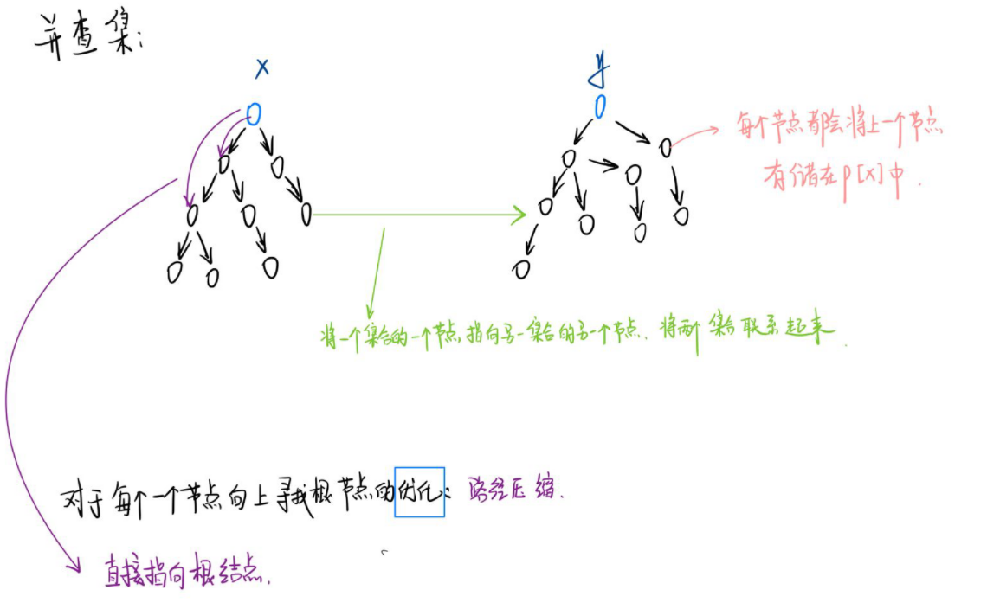
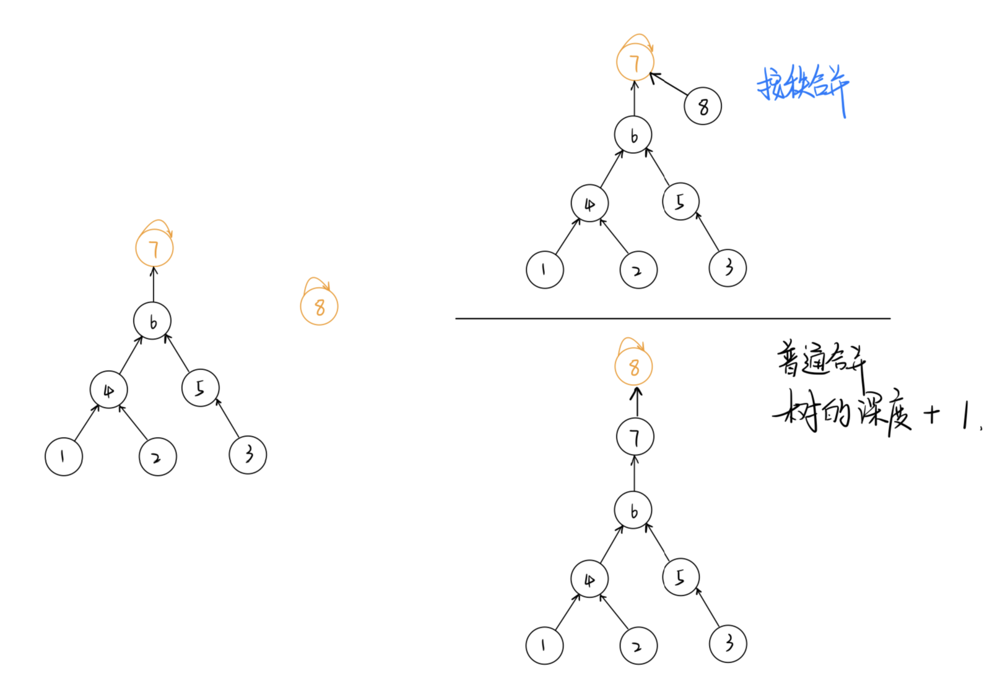
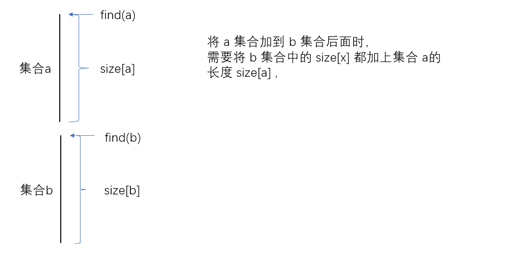
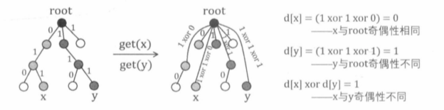
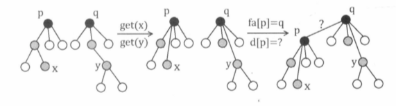

[TOC]
## 并查集
Disjoint-Set 是一种可以动态维护若干个不重叠的集合，并支持查询与合并数据结构。
#### 朴素并查集

```c++
// 1：并查集的初始化：  初始化的并查集中每个节点都是都是单独的集合。因此根节点就是他本身。
int p[N];
    
inline void init(int n) {
    for(int i = 1 ; i <= n ; i++) p[i] = i;
}

// 2：查询：递归的访问元素的上一个节点，直到根节点。  
int find(int x) {
    if(p[x] == x)
        return x;
    else 
        return find(p[x]);
}
    
    
// 3：合并； 将两个节点合并到一个集合中，让俩节点的其中一个节点的根节点指向令一个节点即可。 
inline void merge(int i,int j) // 将 i 和 j 合并到一个集合中。 
{
    p[find[i]] = find(j);
}
```

#### 并查集的优化
1. **路径压缩**

``` c++
/*
朴素并查集的效率较低，主要体现在两个方面：
	1： 集合树太深，寻找根节点需要不断递归。
		解决方法： 使用路径压缩。
			可以在 该节点上 直接 引一条路径到根节点。
			
			
	由下图可以看出，当需要从 5 号节点查询根节点时，需要不断递归查询，当我们直接为 5 号节点
	加一条 直接通到根节点的边。
	
由于路径压缩只在查询时进行，也只压缩一条路径，所以并查集最终的结构仍然可能是比较复杂的，
并非会压缩成 菊花图。
*/
```


```c++
//  路径压缩体现在  查询
int find(int x) {
	if(x != p[x]) p[x] = find(p[x]); //  将 x 的根节点设为父节点
	return p[x]; //  返回 父节点。(即 根节点)
}
```

```c++
//  简化代码
int find(int x) {
    return x == p[x] ? p[x] : (p[x] = find(p[x]));  
}

//  注意这里的优先级问题，要加括号，  赋值运算符的优先级低于三元运算符。
```
``` c++
// 如果数据太大，担心爆栈，使用非递归
int find(int x) {
	int r = x;
	while(p[r] != r) r = p[r];  // 找到根节点
	
	int i = x, j;
	while(i != r) {
		j = p[i];     // 临时变量存储
		p[i] = r;	  // 把路径上元素的的父节点 改为根节点。 
		i = j;
	}
	return r;
}

```
2.**按秩合并** 
``` C++
/*
2：  合并集合时的不确定性导致树 变深。
	解决方法：  按秩合并
	即将 简单的树往复杂的树上合并。这样可以尽量减少树的深度。
*/
```

```c++
// 使用rank[] 数组记录每个 根节点 对应的树的深度。
// rank[] 初始值设为 1，合并时比较两个根节点，将 rank[]  较小者向较大者身上合并。

//  1：初始化
inline void init(int n) {
    for(int i = 1 ; i <= n ; i++)
    {
        p[i] = i;
        rank[i] = i;
    }
}

//  2：合并
inline void merge(int i,int j) {
    int x = find(i) , y = find(j);  //  先找到两个根节点
    if(rank[x] <= rank[y]) 
        p[x] = y;
    else 
        p[y] = x;
    
    if(rank[x] == rank[y] && x != y) // 若深度相同且根节点不同，则新的根节点 深度 + 1
        rank[y]++;
}
```


#### 并查集应用

```c++
// 朴素并查集：（有路径压缩）

    int p[N]; //存储每个点的祖宗节点

    // 返回x的祖宗节点,有路径压缩，
    int find(int x)
    {
        // 如果 x 节点不是根结点的话，那么就将其父节点设置为 根节点
        if (p[x] != x) p[x] = find(p[x]);
        return p[x];  // 返回父节点就可以了
    }

    // 初始化，假定节点编号是1 ~ n 
    for (int i = 1; i <= n; i ++ ) p[i] = i;

    // 合并a和b所在的两个集合：
    p[find(a)] = find(b);

```

#### 维护size的并查集

```c++
// (2) 维护size的并查集:  即同时维护集中中元素的个数

    int p[N], size[N];
    //p[]存储每个点的祖宗节点, size[]只有祖宗节点的有意义，表示祖宗节点所在集合中的点的数量

    // 返回x的祖宗节点
    int find(int x)
    {
        if (p[x] != x) p[x] = find(p[x]);
        return p[x];
    }

    // 初始化，假定节点编号是1~n
    for (int i = 1; i <= n; i ++ )
    {
        p[i] = i;
        size[i] = 1;
    }

    // 合并a和b所在的两个集合：
    size[find(b)] += size[find(a)];
    p[find(a)] = find(b);


```

#### 维护到祖宗节点距离的并查集

```c++
//  (3) 维护到祖宗节点距离的并查集：

    int p[N], d[N];
    //p[]存储每个点的祖宗节点, d[x]存储x到p[x]的距离

    // 返回x的祖宗节点
    int find(int x)
    {
        if (p[x] != x)
        {
            int u = find(p[x]);
            d[x] += d[p[x]];
            p[x] = u;
        }
        return p[x];
    }

    // 初始化，假定节点编号是1~n
    for (int i = 1; i <= n; i ++ )
    {
        p[i] = i;
        d[i] = 0;
    }

    // 合并a和b所在的两个集合：
    p[find(a)] = find(b);
    d[find(a)] = distance; // 根据具体问题，初始化find(a)的偏移量
```


``` c++
/*
一： 并查集实现的操作：
    
    1： 将两个集合进行合并；

    2： 查询某个节点的祖宗节点；

        扩展操作：

    3： 维护 1 ，2 操作的同时， 记录每个集合的大小： (一般会将集合的大小绑定在根节点之上)
            集合的大小是固定的，是本身的属性，与集合中的元素无关。

    4： 每个点到根节点的距离。 (绑定于每个元素之上)
            可以将这个距离定义为 此子节点与根节点之间的关系。
    
    
二：并查集的优化：
    1：路径压缩；  o(logn)
    2：按秩合并：  o(logn)
    3：上述两者合并使用 ， o(a(n)) --> 基本等同于线性的时间复杂度。
    
三：边权并查集 和 扩展域并查集。
    
    时间复杂度：边权并查集是与维护的 节点数k 无关。
    		  扩展域并查集是与 维护的节点数 k 有关。 o(k);
	思想：
        边权并查集： 维护 "相对关系"，即 "相对距离"  (处理多分类问题)
        
        扩展域并查集： "枚举"的思想。对于不同的分类全部枚举。

*/        
```

#### 1250：格子游戏

https://www.acwing.com/problem/content/1252/

``` c++
/*
需要判断的是输赢的问题：当图形封闭的时候就应该结束游戏。
    关键点：当一条边的两个端点都在同一个集合（连通块）中时，就会形成封闭图形。

这里数据的时候使用 一维数组 来迎合我们的并查集数组， (x,y) -->  x*n + y (前提是下标从0 开始)
*/
```

```c++
#include<iostream>
using namespace std;

const int N = 40010;
int n, m;
int p[N];

int find(int x) {
    if(p[x] != x) p[x] = find(p[x]);
    return p[x];
}

int get(int x,int y) {  // 将 二维坐标转换为 一维坐标
    return x * n  + y;
	// return (x - 1) * n + y; // 下标从 1 开始
}

int main() {
    cin >> n >> m;
    //  初始化并查集数组
    for(int i = 0 ; i < n * n ; i++) p[i] = i;
    
    int res = 0;
    for(int i = 1 ; i <= m ; i++ )
    {
        int x , y;
        char d;
        cin >> x >> y >> d;
        
        // 下标映射为从 0 开始
        x-- ,y--;
        int a = get(x,y); //  a 是 (x,y) 的一维坐标
        
        //  终点编号
        int b;
        if(d == 'D') b = get(x + 1 ,y);
        else b = get(x, y + 1);
        
        //  判断是否成环（既 连个节点祖宗节点都是同一个）
        int pa = find(a),pb = find(b);
        if(pa == pb)
        {
            res = i;
            break;
        }
        p[pa] = pb;
   
    }
    
    if(!res) puts("draw");
    else cout << res << endl;
    return 0;
}
```

#### 1251：搭配购买

https://www.acwing.com/problem/content/1254/

``` c++
/*
关键点: 当买一件物品的时候，就必须搭配购买。
    所以就相当于 购买某个集合中的某个物品时，整个集合中的物品都要买。

	1：将所有搭配购买的节点组成一个集合。找出这个
    2：将每个集合作为 一个物品，做 01 背包。
    
  在分出集合时，可以算出一些附加属性： 总体积，总价值。（绑定在合）
*/  
```

```c++
#include<bits/stdc++.h>
using namespace std;
const int N = 10010;
int n , m , vol;
int price[N], w[N];
int p[N];
int f[N];
int find(int x) {
    if(x != p[x]) p[x] = find(p[x]);
    return p[x];
}

int main() {
    scanf("%d%d%d", &n, &m, &vol);
    for (int i = 1; i <= n; i ++ ) p[i] = i;
    for (int i = 1 ; i <= n ; i++) cin >> price[i] >> w[i];
    while(m--) {
        int a, b;
        cin >> a >> b;
        int pa = find(a), pb = find(b);
        if(pa != pb) {
            w[pb] += w[pa];
            price[pb] += price[pa];
            p[pa] = pb;   // 注意这里 pb 作为根节点，上面的信息要记录在根节点
        }
    }
    // 01 背包
    for(int i = 1 ; i <= n ; i++) {
        if(p[i] == i) 
            for(int j = vol ; j >= price[i] ; j--) 
                f[j] = max(f[j], f[j - price[i]] + w[i]);
    }
    cout << f[vol] << endl;
    
    return 0;
}
```
#### 237：程序自动分析
https://www.acwing.com/problem/content/239/

每个变量相当于节点，每个相等约束条件相当于无向边，那么就可以将所有相等的变量连通成为一个连通块，也即将它们放在一个集合当中。然后检查一遍 不相等的约束条件是否与集合相矛盾即可。
注意点：
1.  数据范围是 $10^5$ ，而数据最大在 $10^9$ ，那么就可以使用离散化。并且是无序的离散化。 
从本题可以看出，并查集能**在一张无向图中维护节点之间的连通性。并查集擅长动态维护许多具有传递性的关系**。（传递性的问题还可以使用传递闭包来解决，传递闭包更加通用，也适用于有向图，但其时间复杂度在 $O(n^3)$。
``` c++
#include<bits/stdc++.h>
using namespace std;
const int N = 2000010;
int n, m;
int p[N];
unordered_map<int ,int> hp;
struct Query {
    int x, y, e;
}query[N];
int get(int x) {
    if(hp.count(x) == 0) hp[x] = ++ n;
    return hp[x];
}
int find(int x) {
    return p[x] == x ? p[x] : (p[x] = find(p[x]));
}
int main(){
    int T;
    scanf("%d", &T);
    while(T--) {
        n = 0;
        hp.clear();
        scanf("%d", &m);
        for (int i = 0; i < m; i ++ ) {
            int x , y, e;
            scanf("%d%d%d", &x, &y, &e);
			// 获取离散化后的坐标
            query[i] = {get(x) , get(y) , e};
        }
        for (int i = 1; i <= n; i ++ ) p[i] = i;
    
        // 合并相等的约束条件
        for(int i = 0 ; i < m ; i++) {
            if(query[i].e == 1) {
                int pa = find(query[i].x);
                int pb = find(query[i].y);
                p[pa] = pb;
            }
        }
        
        // 查询矛盾
        bool flag = 0;
        for(int i = 0 ; i < m ; i++) {
            if(query[i].e == 0) {
                int pa = find(query[i].x);
                int pb = find(query[i].y);
                if(pa == pb) {
                    flag = 1;
                    break;
                }
            }
        }
        if(flag) puts("NO");
        else puts("YES");
    }
    return 0;
}
```
#### 238：银河英雄传说 (同时维护 $size，d$ 的并查集)
https://www.acwing.com/problem/content/240/

显然适用并查集来维护战舰组成的集合，但同时需要维护其他信息。
要维护两个战舰之间的战舰数量，可以使用 $d[x]$ 记录战舰 $x$ 与 $p[x]$ 之间边的权值。在路径压缩把 $x$ 直接指向树根的同时，将 $d[x]$ 更新为从 $x$ 到树根路径上的所有边权之和。
``` c++
int find(int x) {
	if(x != p[x]) {
		int root = find(p[x]);
		d[x] += d[p[x]];	
		p[x] = root;  			// 路径压缩
	}
	return p[x];
}
```
。需要一个 $size[x]$ 来维护 $x$ 到其跟根节点的路径长度。在合并集合的时候需要注意对合并在后面的集合的 $size[x]$ 进行更新

``` c++
void merge(int a , int b) {
	int pa = find(a), pb = find(b);
	p[pa] = pb;
	d[pa] = size[pb];	 
	size[pb] += size[pa];
}
```

``` c++
#include<bits/stdc++.h>
using namespace std;
const int N = 30010;
int p[N];
int d[N], s[N];
int find(int x) {
    if(x != p[x]) {
        int root = find(p[x]);
        d[x] += d[p[x]];
        p[x] = root;
    }
    return p[x];
}
void merge(int a, int b) {
    int pa = find(a), pb = find(b);
    p[pa] = pb;
    d[pa] = s[pb];
    s[pb] += s[pa];
}

int main(){ 
    int T;
    scanf("%d", &T);
    for (int i = 1; i < N; i ++ ){
        p[i] = i;
        s[i] = 1;
    }
    
    char op[2];
    int a, b;
    while (T -- ) {
        scanf("%s%d%d", op ,&a, &b);
        if(*op == 'M') merge(a, b);
        else {
            int pa = find(a), pb = find(b);
            if(pa != pb) puts("-1");
            else printf("%d\n", max(0, abs(d[a]-d[b])-1));
        }
    }
    return 0;
}
```

#### “扩展域”与“边带权”的并查集
并查集实际上是若干颗树构成的森林，可以在树中的每条边上记录一个权值，即维护一个数组 $d$ , 用 $d[x]$ 保存节点 $x$ 到父节点 $p[x]$ 之间的边权。在每次路径压缩后，每个访问过的节点都会直接指向树根，如果同时更新这些节点的 $d$ 值，就可以利用路径压缩过程来统计每个节点到树根之间的路径上的一些信息。这就是所谓 “边带权” 的并查集。

#### 239: 奇偶游戏
https://www.acwing.com/problem/content/241/
使用$sum$ 数组表示序列 $s$ 的前缀和，$sum[l$~$r]$ 中含含有多少个 $1$, 那么在每个回答中：
1.  $s[l$~$r]$ 有偶数个 $1$, 等价于 $sum[l-1]$ 与 $sum[r]$ 的奇偶性相同
2.  $s[l$~$r]$有奇数个 $1$, 等价于 $sum[l-1]$ 与 $sum[r]$ 奇偶性不同

这样就将 对于区间上的统计转为单点的统计。又转化为给定若干个变量和关系，判定这些关系可满足性的问题。但此时的传递关系不止一种。
1. 若 $x_1$ 与 $x_2$ 奇偶性相同，$x_2$ 与 $x_3$ 奇偶性也相同，那么 $x_1$ 与 $x_3$ 奇偶性相同。
2. 若 $x_1$ 与 $x_2$ 奇偶性相同，$x_2$ 与 $x_3$ 奇偶性不同，那么 $x_1$ 与 $x_3$ 奇偶性不同。
3. 若 $x_1$ 与 $x_2$ 奇偶性不同，$x_2$ 与 $x_3$ 奇偶性也不同，那么 $x_1$ 与 $x_3$ 奇偶性相同。
 
问题数相较于序列长度很小，可以先使用离散化。

**处理多种传递关系的解决方法**
1.  使用 “边带权“ 的并查集

边权 $d[x]$ 为 $0$ ，表示 $x$ 与 $p[x]$ 奇偶性相同；为 $1$，表示 $x$ 与 $p[x]$ 奇偶性不同。
在路径压缩的同时，对 $x$ 到树根路径上的所有边权做 异或运算（模 2 运算），即可得到 $x$ 与 树根的奇偶性关系。
对于每个问题，设在离散化后的 $l-1$ 和 $r$ 的值分别是 $x$ 和 $y$ ，设 $ans$ 表示该问题的回答（ $0$ 代表偶数个，$1$ 代表奇数个）。
先检查 $x$ 和 $y$ 是否在同一个集合当中（奇偶性关系是否已知），$find(x)$ 和 $find(y)$ 都执行完成后， $d[x]$ xor $d[y]$即为 $x$ 和 $y$ 的奇偶性关系。若 $d[x]$ xor $d[y]$ != $ans$ （该问题与回答矛盾）。则在问题之后即可确定小 $A$  撒谎。

若 $x$,$y$ 不在同一个集合内，则合并两个集合。此时应该先通过 $find$ 操作得到两个集合的树根(设为 $p$ 和 $q$) ，令 $p$ 为 $q$ 的子节点。如下图。已知 $d[x]$ 与 $d[y]$ 分别表示路径上 $x$ ~ $p$ 与 $y$ ~ $q$ 之间所有边权的 "xor 和 " ，$p$ ~ $q$ 之间的边权 $d[p]$ 是待求的值。显然，路径 $x$ ~ $y$ 有路径 $x$ ~ $p$, $p$ ~ $q$  与 $q$ ~ $y$ 组成，因此 $x$ 与 $y$ 奇偶关系 $ans=(d[x])xor(d[y])xor(d[p])$ 。进而推得新连接的边权 $d[p]=(d[x])xor(d[y])xor(ans)$

``` c++

```
2. **使用”扩展域“ 的并查集**

把变量 $x$ 拆成两个节点 $x_{odd}$ 和 $x_{even}$，其中 $x_{odd}$ 表示 $sum[x]$ 是奇数， $x_{even}$ 表示 $sum[x]$ 是偶数。将这两个节点称为 $x$ 的 ”奇数域“ 和 ”偶数域“ 。
对于每个问题，设在离散化后的 $l-1$ 和 $r$ 的值分别是 $x$ 和 $y$ ，设 $ans$ 表示该问题的回答（ $0$ 代表偶数个，$1$ 代表奇数个）。
1. 若 $ans=0$ ，则合并 $x_{odd}$ 与 $y_{odd}$ ， $x_{even}$ 与 $y_{even}$。这表示 ”$x$ 为奇数“ 与 "$y$ 为奇数" 可以相互推断出，”$x$ 为偶数“ 和 "$y$ 为偶数" 也可以相互推断出，它们是等价的。
2. 若 $ans=1$，则合并 $x_{odd}$ 与 $y_{even}$ ， $x_{even}$ 与 $y_{odd}$。这表示 ”$x$ 为奇数“ 与 "$y$ 为偶数" 可以相互推断出，”$x$ 为偶数“ 和 "$y$ 为奇数" 也可以相互推断出，它们是等价的。

上述合并的同时还维护了关系的传递性，在处理完 $(x, y,0)$ 和 $(y, z, 1)$ 两个回答之后， $x$ 和 $z$ 之间的关系也就已知了。这种情况相当于在无向图上维护节点之间的连通情况，只是扩展了多个域来应对多种传递关系。

在处理每个问题之前，我们应当检查是否存在矛盾，
若两个变量 $x$ 和 $y$ 对应的 $x_{odd}$ 和 $y_{odd}$ 节点之间在同一集合内，则已知二者奇偶性相同。
若两个变量 $x$ 和 $y$ 对应的 $x_{odd}$ 和 $y_{even}$ 节点之间在同一集合内，则已知二者奇偶性不同。


 