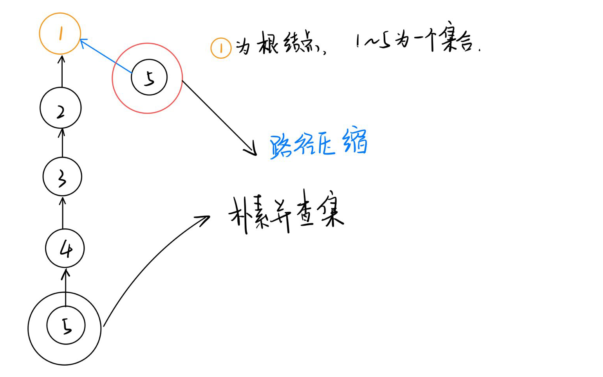

[TOC]
## ：并查集
Disjoint-Set 是一种可以动态维护若干个不重叠的集合，并支持查询与合并数据结构。
#### 朴素并查集

```c++
// 1：并查集的初始化：  初始化的并查集中每个节点都是都是单独的集合。因此根节点就是他本身。
int p[N];
    
inline void init(int n) {
    for(int i = 1 ; i <= n ; i++) p[i] = i;
}

// 2：查询：递归的访问元素的上一个节点，直到根节点。  
int find(int x) {
    if(p[x] == x)
        return x;
    else 
        return find(p[x]);
}
    
    
// 3：合并； 将两个节点合并到一个集合中，让俩节点的其中一个节点的根节点指向令一个节点即可。 
inline void merge(int i,int j) // 将 i 和 j 合并到一个集合中。 
{
    p[find[i]] = find(j);
}
```

#### 并查集的优化
1. **路径压缩**

``` c++
/*
朴素并查集的效率较低，主要体现在两个方面：
	1： 集合树太深，寻找根节点需要不断递归。
		解决方法： 使用路径压缩。
			可以在 该节点上 直接 引一条路径到根节点。
			
			
	由下图可以看出，当需要从 5 号节点查询根节点时，需要不断递归查询，当我们直接为 5 号节点
	加一条 直接通到根节点的边。
	
由于路径压缩只在查询时进行，也只压缩一条路径，所以并查集最终的结构仍然可能是比较复杂的，
并非会压缩成 菊花图。
*/
```


```c++
//  路径压缩体现在  查询
int find(int x) {
	if(x != p[x]) p[x] = find(p[x]); //  将 x 的根节点设为父节点
	return p[x]; //  返回 父节点。(即 根节点)
}
```

```c++
//  简化代码
int find(int x) {
    return x == p[x] ? p[x] : (p[x] = find(p[x]));  
}

//  注意这里的优先级问题，要加括号，  赋值运算符的优先级低于三元运算符。
```
``` c++
// 如果数据太大，担心爆栈，使用非递归
int find(int x) {
	int r = x;
	while(p[r] != r) r = p[r];  // 找到根节点
	
	int i = x, j;
	while(i != r) {
		j = p[i];     // 临时变量存储
		p[i] = r;	  // 把路径上元素的的父节点 改为根节点。 
		i = j;
	}
	return r;
}

```
2.**按秩合并** 
``` C++
/*
2：  合并集合时的不确定性导致树 变深。
	解决方法：  按秩合并
	即将 简单的树往复杂的树上合并。这样可以尽量减少树的深度。
*/
```

```c++
// 使用rank[] 数组记录每个 根节点 对应的树的深度。
// rank[] 初始值设为 1，合并时比较两个根节点，将 rank[]  较小者向较大者身上合并。

//  1：初始化
inline void init(int n) {
    for(int i = 1 ; i <= n ; i++)
    {
        p[i] = i;
        rank[i] = i;
    }
}

//  2：合并
inline void merge(int i,int j) {
    int x = find(i) , y = find(j);  //  先找到两个根节点
    if(rank[x] <= rank[y]) 
        p[x] = y;
    else 
        p[y] = x;
    
    if(rank[x] == rank[y] && x != y) // 若深度相同且根节点不同，则新的根节点 深度 + 1
        rank[y]++;
}
```


#### 并查集应用

```c++
// 朴素并查集：（有路径压缩）

    int p[N]; //存储每个点的祖宗节点

    // 返回x的祖宗节点,有路径压缩，
    int find(int x)
    {
        // 如果 x 节点不是根结点的话，那么就将其父节点设置为 根节点
        if (p[x] != x) p[x] = find(p[x]);
        return p[x];  // 返回父节点就可以了
    }

    // 初始化，假定节点编号是1 ~ n 
    for (int i = 1; i <= n; i ++ ) p[i] = i;

    // 合并a和b所在的两个集合：
    p[find(a)] = find(b);

```

#### 维护size的并查集

```c++
// (2) 维护size的并查集:  即同时维护集中中元素的个数

    int p[N], size[N];
    //p[]存储每个点的祖宗节点, size[]只有祖宗节点的有意义，表示祖宗节点所在集合中的点的数量

    // 返回x的祖宗节点
    int find(int x)···
    {
        if (p[x] != x) p[x] = find(p[x]);
        return p[x];
    }

    // 初始化，假定节点编号是1~n
    for (int i = 1; i <= n; i ++ )
    {
        p[i] = i;
        size[i] = 1;
    }

    // 合并a和b所在的两个集合：
    size[find(b)] += size[find(a)];
    p[find(a)] = find(b);


```

#### “扩展域”与“边带权”的并查集
并查集实际上是若干颗树构成的森林，可以在树中的每条边上记录一个权值，即维护一个数组 $d$ , 用 $d[x]$ 保存节点 $x$ 到父节点 $p[x]$ 之间的边权。在每次路径压缩后，每个访问过的节点都会直接指向树根，如果同时更新这些节点的 $d$ 值，就可以利用路径压缩过程来统计每个节点到树根之间的路径上的一些信息。这就是所谓 “边带权” 的并查集
#### 维护到祖宗节点距离的并查集

```c++
//  (3) 维护到祖宗节点距离的并查集：

    int p[N], d[N];
    //p[]存储每个点的祖宗节点, d[x]存储x到p[x]的距离

    // 返回x的祖宗节点
    int find(int x)
    {
        if (p[x] != x)
        {
            int u = find(p[x]);
            d[x] += d[p[x]];
            p[x] = u;
        }
        return p[x];
    }

    // 初始化，假定节点编号是1~n
    for (int i = 1; i <= n; i ++ )
    {
        p[i] = i;
        d[i] = 0;
    }

    // 合并a和b所在的两个集合：
    p[find(a)] = find(b);
    d[find(a)] = distance; // 根据具体问题，初始化find(a)的偏移量
```


``` c++
/*
一： 并查集实现的操作：
    
    1： 将两个集合进行合并；

    2： 查询某个节点的祖宗节点；

        扩展操作：

    3： 维护 1 ，2 操作的同时， 记录每个集合的大小： (一般会将集合的大小绑定在根节点之上)
            集合的大小是固定的，是本身的属性，与集合中的元素无关。

    4： 每个点到根节点的距离。 (绑定于每个元素之上)
            可以将这个距离定义为 此子节点与根节点之间的关系。
    
    
二：并查集的优化：
    1：路径压缩；  o(logn)
    2：按秩合并：  o(logn)
    3：上述两者合并使用 ， o(a(n)) --> 基本等同于线性的时间复杂度。
    
三：边权并查集 和 扩展域并查集。
    
    时间复杂度：边权并查集是与维护的 节点数k 无关。
    		  扩展域并查集是与 维护的节点数 k 有关。 o(k);
	思想：
        边权并查集： 维护 "相对关系"，即 "相对距离"  (处理多分类问题)
        
        扩展域并查集： "枚举"的思想。对于不同的分类全部枚举。

*/        
```

#### 1250：格子游戏

https://www.acwing.com/problem/content/1252/

```
需要判断的是输赢的问题：当图形封闭的时候就应该结束游戏。
    关键点：当一条边的两个端点都在同一个集合（连通块）中时，就会形成封闭图形。

这里数据的时候使用 一维数组 来迎合我们的并查集数组， (x,y) -->  x*n + y (前提是下标从0 开始)
```

```c++
#include<iostream>
using namespace std;

const int N = 40010;
int n, m;
int p[N];

int find(int x)
{
    if(p[x] != x) p[x] = find(p[x]);
    return p[x];
}

int get(int x,int y)
{
    return x * n  + y;
}

int main()
{
    cin >> n >> m;
    //  初始化并查集数组
    for(int i = 0 ; i < n * n ; i++) p[i] = i;
    
    int res = 0;
    for(int i = 1 ; i <= m ; i++ )
    {
        int x , y;
        char d;
        cin >> x >> y >> d;
        
        // 将 二维坐标转换为 一维坐标
        x-- ,y--;
        int a = get(x,y); //  a 是 (x,y) 的一维坐标
        
        //  终点编号
        int b;
        if(d == 'D') b = get(x + 1 ,y);
        else b = get(x, y + 1);
        
        //  判断是否成环（既 连个节点祖宗节点都是同一个）
        int pa = find(a),pb = find(b);
        if(pa == pb)
        {
            res = i;
            break;
        }
        p[pa] = pb;
   
    }
    
    if(!res) puts("draw");
    else cout << res << endl;
    return 0;
}
```

#### 1251：搭配购买

https://www.acwing.com/problem/content/1254/

```
关键点: 当买一件物品的时候，就必须搭配购买。
    所以就相当于 购买某个集合中的某个物品时，整个集合中的物品都要买。

	1：将所有搭配购买的节点组成一个集合。找出这个
    2：将每个集合作为 一个物品，做 01 背包。
    
  在分出集合时，可以算出一些附加属性： 总体积，总价值。（绑定在集h）
    
```

```c++

```


