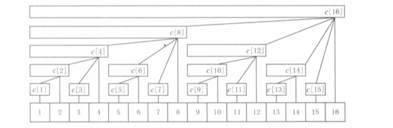
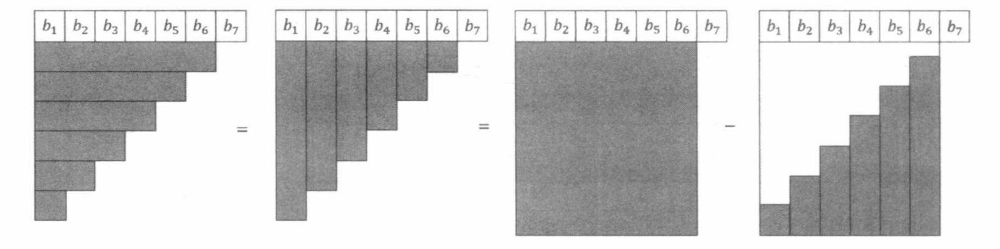

[TOC]

https://zhuanlan.zhihu.com/p/93795692

### 树状数组

**BIT(二进制下标树)**

​			根据任意正整数关于 $2$ 的不重复次幂的唯一分解性质，若一个正整数 $x$ 的二进制表示为 $a_{k-1}a_{k-2}…a_2a_1a_0$ ，其中等于 $1$ 的位是 ${a_{i_1},a_{i_2},...,a_{i_m}}$ 。则正整数 $x$ 可以被 “二进制分解” 成：
$$
x=2^{i_1}+2^{i_2}+...+2^{i_m}
$$
不妨设 $i_1 > i_2 > …> i_m$ ，进一步地，区间 $[1,x]$ 可以分成 $O(logx)$ 个小区间：

1. 长度为 $2^{i_1}$ 的小区间 $[1,2^{i_1}]$ 。
2. 长度为 $2^{i_2}$ 的小区间 $[2^{i_1}+1,2^{i_1}+2^{i_2}]$。
3. 长度为 $2^{i_3}$ 的小区间 $[2^{i_1}+2^{i_2}+1,2^{i_1}+2^{i_2}+2^{i_3}]$ 。

……

  m. 长度为 $2^{i_m}$ 的小区间 $[2^{i_1}+2^{i_2}+...+2^{i_{m-1}} + 1 , 2^{i_1}+2^{i_2}+...+2^{i_{m}} ]$ 

​		这些小区间的共同特点是：若区间结尾为 $R$，则区间长度就等于 $R$ 的“二进制分解”下最小的 $2$ 的次幂，即 $lowbit(R)$。例如 $x = 7 = 22 + 21 + 20$，区间 $[1,7]$ 可以分成 $[1,4]、[5,6]$ 和 $[7,7]$  三个小区间，长度分别是 $lowbit(4) = 4$、$lowbit(6) = 2$ 和  $lowbit(7)= 1$。类似地，给定一个整数 $x$，下面这段代码可以计算出区间 $[1,x]$ 分成的 $O(logx) $个小区间：

```c++
while(x > 0){
    printf("[%d , %d]\n" , x - (x & -x) + 1 , x );
    x -= x & -x;
}
```

​		树状数组 （Binary Indexed Trees） 就是一种基于上述思想的数据结构，其基本用途是**维护序列的前缀和**。对于给定的序列 $a$ ，建立一个数组 $c$ ，其中 $c[x]$  **保存序列 $a$  的区间  $[x - lowbit(x)+1,x]$  中所有数的和**。即 $\sum_{i=x-lowbit(x)+1}^xa[i]$， 也就是保存**以 $x$ 为根的子树中叶节点的值的和**。

​		事实上，数组 $c$ 可以看作一个如下图所示的树形结构，图中最下边一行是 $N$ 个叶节点（$N = 16$），代表数值 $a[1$~$N]$。
​		该结构满足以下性质：

1. 每个内部节点 $c[x]$ 保存以它为根的子树中所有叶节点的和。
2. **每个内部节点 $c[x]$ 的子节点个数等于 $lowbit(x)$ 的位数。**
3. 除树根外，每个内部节点 $c[x]$ 的父节点是 $c[x+lowbit(x)]$。
4. 树的深度为 $O(log N)$。准确为 $log_2n+1$ 

如果 $N$ 不是 $2$ 的整次幂，那么树状数组就是一个具有同样性质的森林结构。



#### **树状数组的基本操作**

- 单点修改：更改数组中一个元素的值。
- 区间查询：查询一个区间内所有元素的和。**查询前缀和**

​		查询前缀和，即序列 $a$ 第 $1$ ~ $x$ 个数的和。按照我们刚才提出的方法，应该求出 $x$ 的二进制表示中每个等于 $1$ 的位，把 $[1,x]$ 分成 $O(logN)$ 个小区间，而每个小区间的区间和都已经保存在数组  $c$ 中。所以，把上面的代码稍加改写即可在 $O(logN)$  的时间内查询前缀和：

查询序列 $a$ 的区间  $[l,r]$  中所有数的和，只需计算  $ask(r)-ask(l-1)$ 。

```c++
int lowbit(int x){
    return x & -x;
}

int ask(int x){
    int ans = 0;
    for (;x ; x -= lowbit(x)) ans += c[x];
    return ans;
}
```


​		树状数组支持的第二个基本操作是**单点修改**,意思是给序列中的一个数 $a[x]$ 加上 $y$，同时正确维护序列的前缀和。根据上面给出的树形结构和它的性质，只有节点 $c[x]$ 及其所有祖先节点保存的“区间和”包含 $a[x]$，而任意一个节点的祖先至多只有 $log N$ 个，我们逐一对它们的 $c$ 值进行更新即可。下面的代码在 $O(logN)$  时间内执行单点修改操作：

```c++
int lowbit(int x){
    return x & -x;
}

void add(int idx , int num){
    for (; idx <= N ; idx += lowbit(idx)) c[idx] += num;
}
```

​		在执行所有操作之前，我们需要对树状数组进行初始化针对原始序列  $a$ 构造一个树状数组。
为了简便，比较一般的初始化方法是：

​		直接建立一个全为 $0$ 的数组 $c$，然后对每个位置 $x$ 执行 $add(x,a[x])$，就完成了对原始序列 $a$ 构造树状数组的过程，时间复杂度为 $O(N log N)$。通常采用这种初始化方法已经足够。
​		更高效的初始化方法是：

​		从小到大依次考虑每个节点 $x$，借助 $lowbit$ 运算扫描它的**子节点**并求和。若采用这种方法，上面树形结构中的每条边只会被遍历一次，时间复杂度为  $O(\sum_{k=1}^{logN}k*N/2^k)$ 。

#### **树状数组和逆序对**

​		任意给定一个集合 $a$  ，如果用 $t[val]$  **保存数值 $val$ 在集合 $a$ 中出现的次数**，那么数组 $t$ 在 $[l,r]$  上的区间和 (即 $\sum_{i=1}^xt[i]$)  就表示集合 $a$ 中范围在  $[l,r]$ 内数有多少个。

​		 我们可以在集合 $a$ 的数值方位上建立一个树状数组，来维护 $t$ 的前缀和。这样即使在集合 $a$ 中插入或者删除一个数，也可以高效地进行统计。

​		逆序对：对于一个序列 $a$ ，若 $i<j$ 且  $a[i]>a[j]$ ，则称  $a[i]$ 与  $a[j]$ 构成逆序对。按照上述思路，利用树状数组也可以求出一个序列的逆序对个数。

1. 在序列 $a$ 地数值范围上建立树状数组，初始化全为零。
2. 倒序扫描给定地序列 $a$ ，对于每个数  $a[i]$ ：

（1）在树状数组中查询前缀和 $[1,a[i]-1]$，类加到答案  $ans$ 中。

（2）执行 “单点增加” 操作，即把位置 $a[i]$ 上的数加  $1$ ，（相当于 $t[a[i]]++$），同时正确维护 $t$ 的前缀和。这表示数值 $a[i]$ 又出现 $1$ 次。

3.  $ans$ 即为所求。

```c++
for(int i = n ; i ; i--){
    ans += ask(a[i] - 1);
    add(a[i] , 1);
}
```

​		在这个算法中，**因为倒序扫描，“已经出现过的数”就是在 $a[i]$ 后边的数，所以我们通过树状数组查询的内容就是“每个 $a[i]$ 后边有多少个比它小”**。每次查询的结果之和当然就是逆序对个数。时间复杂度为 $O((N + M)log M)$,$M$ 为数值范围的大小。当数值范围较大时，当然可以先进行离散化，再用树状数组进行计算。不过因为离散化本身就要通过排序来实现，所以在这种情况下就不如直接用归并排序来计算逆序
对数了。


#### **树状数组的扩展应用**

扩展操作 1：

- 区间增加
- 单点查询


**区间增加**, 为 数列中下标为  $[l, r]$  的区间都加上 $d$   , 对于区间增加的操作，通过**差分数组**将区间操作转换为单点操作：

1.  把 $b[l]$ 加上 $d$ 
2. 再把 $b[r+1]$ 减去 $d$ 

```c++
add(l, d), add(r + 1, -d); // 将区间的增加单独记下，最后查询区间时 再加上原来的数组 a[]
```

**单点查询**，

使用树状数组来维护数组 $b$ 的前缀和（即 $a[ \ ]$ 每个元素的增量 ），因为各次操作之间具有可累加性，所以在树状数组上查询前缀和 $b[1$ ~ $x]$ ，就得出到目前为止所有的 **区间增加**  指令在 $a[x]$ 上增加的数值总和。再加上 $a[x]$ 的初始值，就得到 **单点查询** 的答案。

```c++
int ask(int x) {
    int ans = a[x];
    for(;x; x -= lowbit(x)) ans += c[x];
}

// 单点查询的值
ask(x);
```


扩展操作 2：

1. 查询区间和
2. 区间增加

差分数组 $b$ 的前缀和为 $\sum_{i=1}^{x}b[i]$ 就是经过这些指令操作之后的 $a[x]$  增加的值（**$a[x]$ 的增量**）。那么序列 $a$ 的的前缀和 $a[1$ ~ $x]$ ，整体增加的值就是：
$$
\sum_{i=1}^{x}\sum_{j=1}^{i}b[j]
$$
上式经过化简：
$$
\sum_{i=1}^{x}\sum_{j=1}^{i} = \sum_{i=1}^{x}(x-i+1)*b[i] \\
= (x+1)\sum_{i=1}^{x}b[i]-\sum_{i=1}^{x}i*b[i]
$$
上式推到等价下图：



使用树状数组 $c_1$ 维护 $i*b[i]$ 的前缀和 $\sum_{i=1}^{x}i*b[i]$ 。使用树状数组 $c_0$ 维护 $b[i]$ 的前缀和 $\sum_{i=1}^{x}b[i]$ 

建立两个树状数组 $c0$ 和 $c1$ .初始值全为 $0$ 。

**区间增加**

1. 在树状数组 $c0$ 中，把位置 $l$ 上的数加 $d$ 。
2. 在树状数组 $c0$ 中，把位置 $r+1$ 上的数加 $-d$ 。
3. 在树状数组 $c1$ 中，把位置 $l$ 上的数加 $l*d$ 。
4. 在树状数组 $c1$ 中，把位置 $r+1$ 上的数加 $-(r+1)*d$ 。

**查询区间和**

建立数组 $sum$ 存储 $a$ 的原始前缀和，对于每条 **区间求和**  $Q(l, r)$，拆成 $1$~$r$， $1$~$l-1$ 两部分，二者相减，写成  
$$
(sum[r]+(r+1)*ask(c_0,r)-ask(c_1,r))-(sum[l-1]+l*ask(c_0,l-1)-ask(c_1,l-1))
$$

```
原数组的前缀和 + 增量的前缀和
```


#### 241：楼兰图腾

https://www.acwing.com/problem/content/243/

​		首先对于两个图腾的  横坐标 来说，均有 $x_1<x_2<x_3$ ，那么就可以将输入的坐标按照 横坐标进行排序即可，本题中已经  在横坐标排好序的情况下给出 纵坐标。

​		对于 `v` 图来说，是 $y_1>y_2$ `&&` $y_2<y_3$ 。对于 `∧` 图来说，是 $y_1<y_2$ `&&` $y_2>y_3$ 。

对于这样的不等关系，即 逆序对 或者 ”反“逆序对。

```c++
#include<bits/stdc++.h>
using namespace std;
typedef long long LL;
const int N = 200010;
int n;
int a[N], c[N];
int G[N], L[N];

int lowbit(int x){
    return x & -x;
}

void add(int idx, int num) {
    for(;idx <= n; idx += lowbit(idx)) c[idx] += num;
}

int ask(int idx){
    int ans = 0;
    for(;idx ; idx -= lowbit(idx)) ans += c[idx];
    return ans;
}

int main()
{
    scanf("%d", &n);
    for (int i = 1; i <= n; i ++ ) scanf("%d", &a[i]);
    
    for(int i = 1 ; i <= n ; i++) {
        G[i] = ask(n) - ask(a[i]);
        L[i] = ask(a[i] - 1);
        add(a[i], 1);
    }
    
    memset(c, 0, sizeof c);
    LL ans_1 = 0, ans_2 = 0;
    for(int i = n ; i ; i--){
        ans_1 += G[i] * (LL)(ask(n) - ask(a[i]));
        ans_2 += L[i] * (LL)(ask(a[i] - 1));
        add(a[i], 1);
    }
    
    printf("%lld %lld", ans_1, ans_2);
    
    return 0;
}
```

```c++
#include<bits/stdc++.h>
using namespace std;
typedef long long LL;
const int N = 200010;
int n;
int a[N];
int c[N];
int L[N]; // 记录 a[i] 前面有几个数比 a[i] 小
int G[N]; // 记录 a[i] 前面有几个数比 a[i] 大

int lowbit(int x) {
    return x & -x;
}

int add(int idx, int num){ // 单点修改
    for(; idx <= n ; idx += lowbit(idx)) c[idx] += num;
}

int ask(int x) { // 区间查询
    int ans = 0;
    for(;x ; x -= lowbit(x)) ans += c[x];
    return ans;
}

int main(){
    scanf("%d", &n);
    for (int i = 1; i <= n; i ++ ) scanf("%d", &a[i]);
    
    // 逆序对
    memset(c, 0, sizeof c);
    for(int i = n; i; i--){
        G[i] = ask(a[i] - 1);
        add(a[i], 1);
    }
    // 正序对
    memset(c, 0, sizeof c);
    for(int i = 1; i <= n; i++){
        L[i] = ask(a[i] - 1);
        add(a[i], 1);
    }
    
    LL ans_1 = 0, ans_2 = 0;
    // ^ 图案
    for (int i = 1; i <= n; i ++ )
        ans_1 += (LL)L[i] * G[i];
    // v 图案
    for (int i = 1 ; i <= n ; i++)
        ans_2 += (LL)(n - i - G[i]) * (i - 1 - L[i]);
    
    cout << ans_2 << " " << ans_1 << endl;
    
    return 0;
}
```

#### 242：一个简单的整数问题

https://www.acwing.com/problem/content/248/

```c++
#include<bits/stdc++.h>
using namespace std;
typedef long long LL;

const int N = 100010;
int n, m;
int a[N], b[N], c[N];

int lowbit(int x) {
    return x & -x;
}
void add(int idx, int num) {
    for(;idx <= n; idx += lowbit(idx)) c[idx] += num;
}
int ask(int x) {
    int ans = a[x];
    for(;x ; x -= lowbit(x)) ans += c[x];
    return ans;
}

int main()
{
    scanf("%d%d", &n, &m);
    for (int i = 1; i <= n; i ++ ) scanf("%d", &a[i]);
    // 要么初始化成差分数组， 要么 ask 时， ans初始 + a[x]。
    // for (int i = 1; i <= n; i ++ ) add(i, a[i] - a[i - 1]);
    char op[2];
    while(m--) {
        scanf("%s", op);
        if(op[0] == 'Q') {
            int idx;
            scanf("%d",&idx);
            printf("%d\n", ask(idx));
        }else {
            int l, r, d;
            scanf("%d %d %d",&l, &r, &d);
            add(l, d), add(r + 1, -d);
        }
    }
   
    return 0;
}
```

#### 243: 一个简单的整数问题2

https://www.acwing.com/problem/content/description/244/

```c++
#include<bits/stdc++.h>
using namespace std;
typedef long long LL;
const int N = 100010;
int a[N], n, m;
LL c[2][N], sum[N];
int lowbit(int x){
    return x & -x;
}
LL ask(int k, int x) {
    LL ans = 0;
    for(;x ; x -= lowbit(x)) ans += c[k][x];
    return ans;
}
void add(int k, int x, int num) {
    for (;x <= n ; x+= lowbit(x)) c[k][x] += num;
}

int main(){
    scanf("%d%d", &n, &m);
    for(int i = 1; i <= n ; i++) {
        scanf("%d", &a[i]);
        sum[i] = sum[i - 1] + a[i];
    }
    while (m -- ) {
        char op[2];
        int l, r, d;
        scanf("%s%d%d", op,&l,&r);
        /*
        	这里的树状数组维护的是 区间的增量
        */
        if(op[0] == 'C') {
            scanf("%d", &d);
            add(0, l, d);
            add(0, r + 1, -d);
            add(1, l, l * d);
            add(1, r + 1, -(r + 1) * d);
        }
        else {
            LL ans = sum[r] + (r+1)*ask(0,r)-ask(1,r);
            ans -= sum[l-1] + l *ask(0, l-1) - ask(1, l-1);
            cout << ans << endl;
        }
    }
    
    return 0;
}
```

```c++
#include<bits/stdc++.h>
using namespace std;
typedef long long LL;
const int N = 100010;
int n, m;
int a[N];
LL c[2][N];

int lowbit(int x) {
    return x & -x;
}

void add(int k , int idx, LL num) {
    for(;idx <= n ;idx += lowbit(idx))
        c[k][idx] += num;
}

LL ask(int k, int idx) {
    LL ans = 0;
    for(;idx;idx -= lowbit(idx))
        ans += c[k][idx];
    return ans;
}
LL prefix_sum(int x) {
    return ask(0, x) * (x + 1) - ask(1, x);
}

int main(){
    scanf("%d%d", &n, &m);
    for (int i = 1; i <= n; i ++ ) scanf("%d", &a[i]);
    
    // 初始化差分序列
    for(int i = 1 ; i <= n ; i++){
        int b = a[i] - a[i - 1];
        add(0, i, b);
        add(1, i, (LL)b * i);
    }
    
    while (m -- ) {
        char op[2];
        int l, r, d;
        scanf("%s%d%d", op ,&l, &r);
        if(op[0] == 'Q') {
            printf("%lld\n", prefix_sum(r) - prefix_sum(l-1));
        }else {
            scanf("%d", &d);
            add(0, l, d);
            add(0, r + 1, -d);
            add(1, l, l * d);
            add(1, r + 1, -(r + 1)*d);
        }
    }
}
```

#### 244:谜一样的牛

https://www.acwing.com/problem/content/245/


