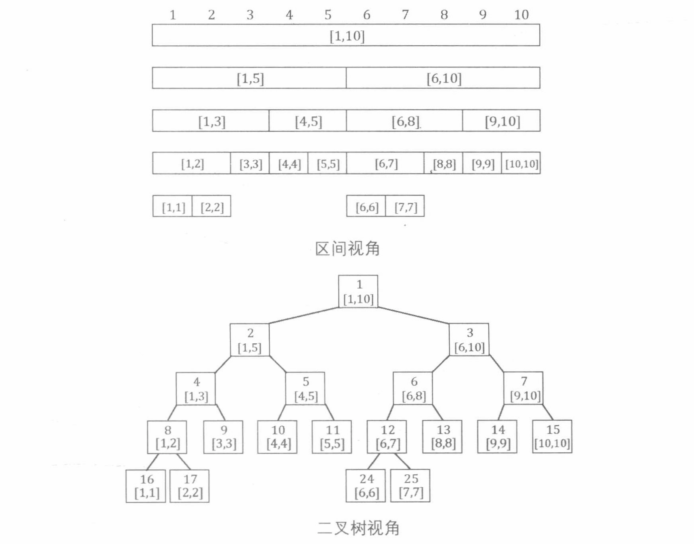
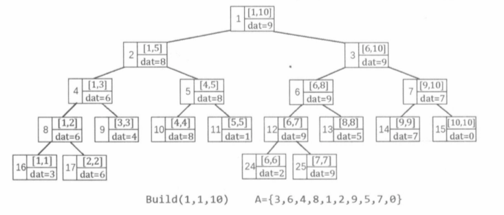
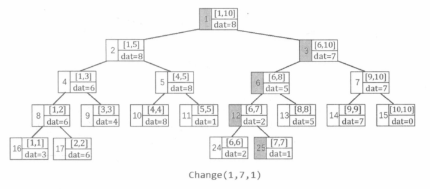
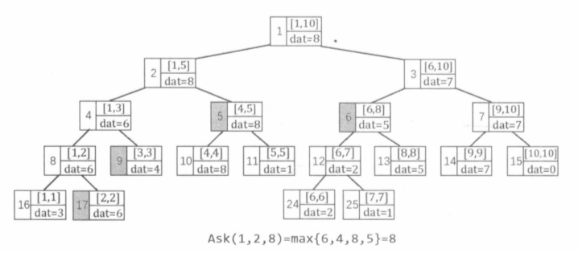
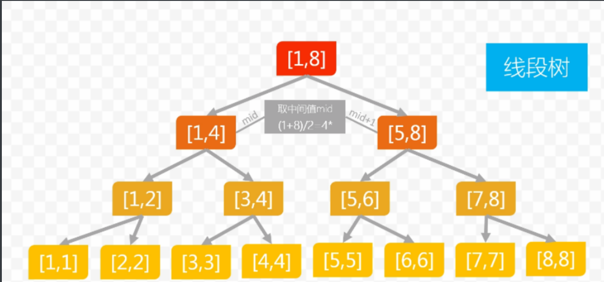

[TOC]

### 线段树

Segment Tree, **是一种基于分治思想的二叉树结构**，用于在区间上进行信息统计。与树状数组相比，线段树是一种更加通用的结构：

1.  线段树的每个节点都代表一个区间。
2.  线段树具有唯一的根节点，代表的区间是整个统计范围，如 $[1, N]$ 。
3.  线段树的每个叶节点都代表一个长度为 $1$ 的元区间。
4.  对于每个**内部节点 $[l, r]$ ，它的左子节点是 $[l, mid]$ ，右子节点是 $[mid + 1, r]$ ，其中 $mid=floor((l+r)/2)$** 



如上图为一颗线段树，可以发现，除去树的最后一层，整颗线段树一定是一颗完全二叉树，树的深度为 $O(logN)$ 。因此，可以按照与二叉堆类似的 **“父子 $2$ 倍 ” 节点编号** 方法：

1. 根节点编号为 $1$ 。
2. 编号为 $x$ 的节点的 左子节点编号为 $x *2$， 右子节点编号为 $x*2+1$。

然后使用 $struct$ 数组 来存储线段树。

由于线段树最后一层节点个数不定，所以按照 $N$ 个叶节点的满二叉树有 $N+N/2+N/4+...+2+1=2N+1$ 个节点。因为在上述存储方式下，最后还会有一层产生了空余，所以**保存线段树的数组长度要不小于 $4N$ 才能保证不会越界。**

#### **线段树的建树**

​		线段树的基本用途：**对序列进行维护，支持查询与修改指令**。

给定长度为 $N$ 的序列 $A$ ，我们可以在区间 $[1, N]$ 上建立一颗线段树，每个叶节点 $[i, i]$ 保存 $A[i]$ 的值。

线段树的二叉树结构可以很方便的**从下往上传递信息**。

​		例如：区间最大值问题：

记 $dat(l, r)$ 等于 $max_{l≤i≤r}(A[i])$ ，显然 $dat(l,r)=max(dat(l, mid), dat(mid+1, r))$ 。



建立线段树并在每个节点保存了对应区间的最大值。

```c++
struct SegmentTree {
    int l, r;
    int dat;
} t[N * 4];  // struct数组存储线段树

void build(int p, int l, int r) {
    t[p].l = l, t[p].r = r;				  // 节点 p 代表区间 [l,r]
    
    if(l == r) { t[p].dat = a[l];return;} // 叶节点
    int mid = (l + r) / 2;				  // 折半
    
    build(p*2 ,l ,mid);					  // 左子节点[l, mid], 编号 p*2
    build(p*2+1 ,mid + 1, r);			  // 右子节点[mid + 1, r],编号 P*2 + 1
    
    t[p].dat = max(t[p*2].dat , t[p*2 + 1].dat); // 存储区间的最大值
}

build(1, 1 ,n); // 调用入口
```

#### **线段树的单点修改**

- 指令 $C \ x \ v$ 的指令，表示把 $A[x]$ 的值修改为 $v$ 。

​		在线段树中，根节点（编号为 $1$ 的节点）是执行各种指令的入口，需要从根节点出发，递归找到代表区间 $[x, x]$ 的叶节点 ，然后**从下往上更新 $[x, x]$ 以及它的所有祖先节点上保存的信息**，如下图所示，时间复杂度为 $O(logN)$ 。

```c++
void modify(int p, int x, int v) {
    if(t[p].l == t[p].r) { t[p].dat = v;return;} // 找叶节点
    
    int mid = (t[p].l+t[p].r)/2;
    if(x <= mid) modify(p*2 ,x, v);				 // x 属于左半区间
    else modify(p*2+1, x, v);					 // x 属于右半区间
    
    t[p].dat = max(t[p*2].dat, t[p*2+1].dat);	 // 从下往上更新信息 pushup
}
change(1 , x , v); // 调用入口
```



#### **线段树的区间查询**

- $Q \ l \ r$ 指令，查询序列 $A$ 在区间 $[l,r]$ 上的最大值，即 $max_{l≤i≤r}(A[i])$  。只需要从根节点开始，递归执行以下过程：

1. 若 $[l,r]$ 完全覆盖了当前节点代表的区间，则立即回溯，并且该节点的 $dat$ 值为候选答案。
2. 若左子节点与 $[l,r]$ 有重叠部分，则递归访问左子节点。
3. 若右子节点与 $[l,r]$ 有重叠部分，则递归访问右子节点。

```c++
int ask(int p, int l, int r) {
    if(l <= t[p].l && r >= t[p].r) return t[p].dat; // 完全包含在区间中
    int mid = (t[p].l + t[p].r) / 2;
    int val = -(1<<30); 
    if(l <= mid) val = max(val, ask(p*2, l, r)); // 左子节点 有重叠
    if(r > mid) val = max(val, ask(p*2+1,l,r));    // 右子节点 有重叠
    return val;
}   
cout << ask(1 , l , r) << endl;
```



该查询过程会把询问区间 $[l,r]$ 在线段树上分成 $O(logN)$ 个节点，取它们的最大值作为的答案。

​		时间复杂度为 $O(logN)$ 的证明：

在每个节点 $[p_l,p_r]$ 上，设 $mid = floor((p_l+p_r)/2)$ ，可能会出现下面几种情况：

1.   $l≤p_l≤p_r≤r$ ，即完全覆盖了当前节点，不进行递归直接返回

    ```
     	pl |________________________|  pr
    		  l |________|  r
    ```

2.   $p_l≤l≤p_r≤r$ ，即只有 $l$ 处于节点之内。

    1.   $l>mid$ ，只会递归右子树

        ```
          pl |________|_________| pr
          				l |___________|	r
        ```

    2.   $l≤mid$ ，虽然递归两个子树，但是右子节点会在递归后直接返回

        ```
          pl |________|_________| pr
          		l |_________________|	r
        ```

3.   $l≤p_l≤r≤p_r$ ，即只有 $r$ 处于节点之内，类似情况 $2$ 

4.   $p_l≤l≤r≤p_r$ ，即 $l$ 与 $r$ 都位于节点之内。

    1.  $l,r$ 都位于 $mid$ 的一侧，只会递归一颗子树

        ```
           	 pl |________|________| pr
           		l |_____| r
           		
        或
        
            pl |________|________| pr
                        l |_____| r
        ```

    2.  $l,r$ 分别位于 $mid$ 的两侧，递归左右子树

        ```
        pl |________|________| pr
               l |_____| r
        ```

对于 $4(2)$ 来说会产生对左右两个子树的递归，但是这种情况至多只发生一次，之后在子节点上的情况 $2或3$ 。因此，上述查询过程的时间复杂度为 $O(2logN) = O(logN)$ 。

​		从宏观上理解， 相当于 $l,r$ 两个端点分别在线段树上划分出一条递归路径，情况 $4(2)$ 在两条路径上从下往上的第一次见会出产生。


#### 1275: 最大数

https://www.acwing.com/problem/content/1277/

```c++
#include<bits/stdc++.h>
using namespace std;
const int N = 200010;
typedef long long LL;

int m , p;
struct Node{
    int l, r;
    int v;
}t[N * 4];

void pushup(int u) {
    t[u].v = max(t[u << 1].v , t[u << 1 | 1].v);
}
void build(int u, int l, int r) {
    t[u].l = l ,t[u].r = r;
    if(l == r) return;
    int mid = l + r >> 1;
    build(u << 1, l, mid);
    build(u << 1 | 1 , mid + 1, r);
}
int ask(int u, int l, int r) {
    if(t[u].l >= l && t[u].r <= r) return t[u].v;
    int mid = t[u].l + t[u].r >> 1;
    int v = 0;
    if(l <= mid) v = ask(u << 1, l, r);
    if(r > mid) v = max(v, ask(u << 1 | 1, l, r));
    return v;
}
void modify(int u, int x, int v) {
    if(t[u].l == x && t[u].r == x) t[u].v = v;
    else {
        int mid = t[u].l + t[u].r >> 1;
        if(x <= mid) modify(u << 1, x, v);
        else modify(u << 1 | 1, x, v);
        pushup(u);
    }
}

int main(){
    int n , last = 0;
    scanf("%d%d", &m, &p);
    build(1 , 1 , m);
    
    int x;
    char op[2];
    while(m--) {
        scanf("%s%d", op, &x);
        if(*op == 'Q') {
            last = ask(1, n - x + 1, n);
            printf("%d\n", last);
        }else {
            modify(1, n + 1, ((LL)last + x) % p);
            n++;
        }
    }
    return 0;
}
```

#### 245: 你能回答这些问题吗 (需要左右区间的信息结合)

https://www.acwing.com/problem/content/246/

​		本题中区间查询的 **最大连续字段和** 即区间 $[x, y]$ 上的 $max_{x≤l≤r≤y}(\sum_{i=l}^{r}A[i])$  ,这里的连续字段可以是区间 $[x, y]$ 的任意子区间。

那么对于 $[x,y]$ 和线段树上的区间来说会有以下情况。

设线段上的两端区间分别为 $p1_l,p1_r$ 和 $p2_l,p2_r$ ，两端区间为某一个区间的左右子区间

1.  $p1_l≤x≤y≤p1_r$ 或者 $p2_l≤x≤y≤p2_r$ 。

    ```
      p1l  |______________|  p1r
            x |________| y
            
    或者
    						p2l |_______________| p2r
    							  x	|_______| y
    ```

    此时的最大前缀和就是左区间或右区间的最大连续字段和

2.  $p1_l≤x≤p1_r≤p2_l≤y≤p2_r$ 

    ```
    		  p1l	|__________| p1r  p2l |____________|  p2r
    		  			  x	|________________|  y
    ```

    此时最大连续子段和就是左区间的最大后缀和加上右区间的最大前缀和 

3.  $p1_l=x≤p1_r≤p2_l≤y≤p2_r$  或者  $p1_l≤x≤p1_r≤p2_l≤p2_r=y$ 

    ```
    		  p1l |_____________|  p1r  p2l  |_____________| p2r
    		  	x |____________________________| y
    		  	  	
    		  	  或
    		  	  
    		  	  			x |____________________________| y
    ```

    这种请况的为 **左区间的和 加上 右区间的最大前缀和** 或者  **左区间的最大后缀和 加上 右区间的和**。

综上： 对于线段树的节点来说，需要记录 区间和 $sum$ ，最大前缀和 $lmax$ ，最大后缀和 $rmax$ ，区间中的最大连续字段和 $tmax$ 。

所以需要**从下往上**传递信息 （pushup）

```c++
t[p].sum = t[p >> 1].sum + t[p >> 1 | 1].sum;
t[p].lmax = max(t[p >> 1].lmax, t[p >> 1].sum + t[p >> 1 | 1].lmax);
t[p].rmax = max(t[p >> 2 | 1].rmax, t[p >> 1].rmax + t[p >> 1 | 1].sum);
t[p].tmax = max(t[p >> 1].tmax, t[p >> 1 | 1].tmax, t[p >> 1].rmax + t[p >> 1 |1].lmax);
```

```c++
#include<bits/stdc++.h>
using namespace std;
const int N = 500010;
int n , m;
int a[N];
struct Node {
    int l, r;
    int sum; // 区间和
    int tmax; // 最大连续字段和
    int lmax, rmax; // 最大前缀和， 最大后缀和
}t[N * 4];
void pushup(Node &u, Node &l, Node &r) { 	// 需要传递的信息
    u.sum = l.sum + r.sum;
    u.lmax = max(l.lmax , l.sum + r.lmax);
    u.rmax = max(r.rmax, l.rmax + r.sum);
    u.tmax = max(max(l.tmax ,r.tmax), l.rmax + r.lmax);
}

void pushup(int u) {
    pushup(t[u], t[u << 1], t[u << 1 | 1]);
}
void build(int u, int l, int r) { // 建树
    if(l == r) 
        t[u] = {l, r, a[r],a[r],a[r],a[r]};
    else {
        t[u].l = l, t[u].r = r;
        int mid= l + r >> 1;
        build(u << 1, l, mid);
        build(u << 1 | 1, mid + 1, r);
        pushup(u);
    }
}
void modify(int u, int x, int v) { // 单点修改
    if(t[u].l == x && t[u].r == x) 
        t[u] = {x, x, v, v, v, v};
    else {
        int mid = t[u].l + t[u].r >> 1;
        if(x <= mid) modify(u << 1, x, v);
        else modify(u << 1 | 1, x, v);
        pushup(u);
    }
}
Node query(int u, int l, int r) { // 区间查询
    if(t[u].l >= l && t[u].r <= r) return t[u];
    else {
        int mid = t[u].l + t[u].r >> 1;
        if(r <= mid) return query(u << 1, l , r);
        else if(l > mid) return query(u << 1 | 1 , l, r);
        else { // 注意对 l,r 横跨左右区间的情况也要进行递归
            auto left = query(u << 1, l, r);
            auto right = query(u << 1 | 1, l, r);
            Node ans;
            pushup(ans, left, right);
            return ans;
        }
    }
}

int main(){
    scanf("%d%d", &n, &m);
    for (int i = 1; i <= n; i ++ ) scanf("%d", &a[i]);
    build(1, 1, n);
    
    int k, x, y;
    while(m--) {
        scanf("%d%d%d", &k, &x, &y);
        if(k == 1) {
            if(x > y) swap(x, y);
            printf("%d\n", query(1, x, y).tmax);
        }else modify(1, x, y);
    }
    
    return 0;
}
```

#### 246：区间最大公约数

https://www.acwing.com/problem/content/247/


线段树

```
1：介绍：
    	是一种二叉搜索树。 （除最后一排节点，是一颗满二叉树）
    类似区间树，会将区间划分为一些单元区间，每个的单元区间对于线段树中的叶节点。
    
2：应用：    
    	使用线段树可以快速查找某一个节点在若干条线段中的出现次数。
```

```
常用操作：
	1：pushup
	
	2：pushdown
	
	3：build    将一段初始化为线段树
	
	4：modify   修改单点/区间
	
	5：query    查询
```



**线段树的存储及开区间范围**

```c++
存储：
    满二叉树的结构，类似于 堆。所以使用 一维数组来存储二叉树。
    
    存储原则：
    当前节点编号为 x ,那么
    		父节点：x/2 ,    (x >> 1)
    		左子节点：2x ,   (x << 1)
    		右子节点：2x+1   (x << 1 | 1)
    
长度为 n 的区间形成的线段树，节点数目：
    次最后一层节点最坏会有 n 个节点，那么除最后一层节点外总共大概有 2n-1 个节点
    而最后一层最多是 有 2n 个节点，所以大概就会有  4n 个节点
即：通常会开 4n 的空间存储线段树，避免越界。
      
```

```
查询过程：
	[L,R] 是指要查询的区间。    [tl,tr]指的是当前向下查询时遇到的 叶子区间。
 步骤：
 	1： [L,R] 包含 [tl，tr]
 	2： [L,R] 和 [tl,tr] 有交集，和哪边有交集就会像哪边递归，两边同时有交集就会像两边递归。
 	3： 不会出现没有交集：
 			因为我们从根节点开始向下递归查询，并且每一次都是在向有交集的节点递归。
 			所以不会出现没有交集的情况
 			
访问区间的时间复杂度 是在 o(logn)之内


```

```
动态的修改区间中的某个数。
动态的查询某个区间的最大值。

1：添加操作：
	每次动态的添加会带来比较大的开销，所以我们初始化所有的区间。（将动态的操作改为静态的操作）
	将每一次的添加操作转换为 修改操作。修改完之后，标记 n+1 这个位置被修改（证明已添加）
2：求某个区间的最大值
	[n-L+1 , n] 区间中的最大值。

```

**线段树节点的存储**

```
	线段树的节点一般由结构体来存。
	
结构体中要存储的属性一般会有：
	1：左右端点。
	2：可以通过左右节点中属性信息的叠加来算出两者父节点的某些属性 的属型。
	
如何判断线段树地节点中应该存储的属性：
	通过线段树要解决的问题可能是 求某个区间的某种属性。
	1：首先是 这种属性。
	2：其次是附加属性。（是由左右子节点中的属性信息能不能算出父节点的这个属性决需要附加属性）
```


