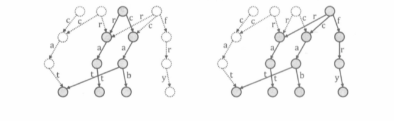

[TOC]

之前的数据结构维护的都是 "数据集的最新状态"。若想知道数据集在任意时间的历史状态（即 任意的$i∈[1, M]$，执行完操作序列中第 $i$ 项操作后数据集的状态），
一种朴素的做法就是 任意的$i∈[1,M]$ ,在 $i$ 项操作结束后，把整个数据结构拷贝一遍，存储在 $history[i]$ 中，多耗费 $M$ 倍的空间。
而 “可持久化” 提供了一种思想，在每项操作结束后，仅创建数据结构中发生该百年的部分的普本，不拷贝其他部分。
数据结构可持久化的前提：
**数据结构本身的拓扑序不发生变化。**

#### 可持久化 $Trie$
与 $Trie$ 的节点一样，可持久化 $Trie$ 的每个节点也有若干字符指针指向子节点，可以使用 $trie[x, c]$ 保存节点 $x$ 的字符指针 $c$ 指向的子节点的编号（$0$ 代表指向空），可持久化 $Trie$ 按照以下步骤插入一个新的字符串 $s$ :
1.  设当前可持久化 $Trie$ 的根节点为 $root$ ，令 $p=root,i=0$ 。
2.  建立一个新的节点 $q$，令 $root' = q$。
3.  若 $p≠0$，则对于每种字符 $c$，令 $trie[q, c]=trie[p, c]$ 。
4.  建立一个新节点 $q'$ ，令 $trie[q, s_i]=q'$ 。换言之，除了字符指针 $s_i$ 不同之外，节点 $q$ 与节点 $p$ 的其他信息完全相同。
5.  令   $p=trie[p,s_i]$，$q=trie[q,s_i]$ ，$i=i+1$ 。
6.  重负步骤 $3$~$5$，直至 $i$ 到达字符串末尾。

从 $root$ 出发沿着字符指针向下能够访问到的节点构成插入 $s$ 之前的 $Trie$，而从 $root'$ 出发沿着字符指针向下能够访问到的节点构成插入 $s$ 之后的 $Trie$。
下图展示在可持久化 $Trie$ 中依次插入字符串 $cat,rat,cab,fat$ 的过程。

可持久化 $Trie$ 的本质就是一张有向图，我们将每次插入字符串后得到的新的根节点记录在数组 $root[1$~$4]$ 中，那么在可持久化 $Trie$ 中从 $root[i]$ 出发能够访问到的点和字符指针就组成了由前 $i$ 个字符串构成的 $Trie$。如下图所示。

构建可持久化 $Trie$ 的时间和空间复杂度都是字符串长度的线性函数。

#### 256：最大异或和
https://www.acwing.com/problem/content/258/

