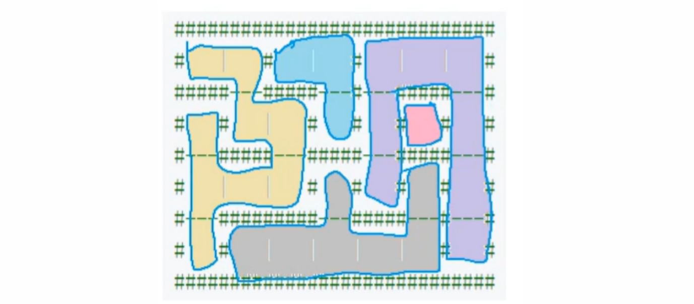

[TOC]


### BFS

```
特点：
1：求 “ 最小 ”
2：基于迭代 （开在 堆空间中 ） 不会爆栈。
问题分类：
1：最短距离    ---> 走迷宫
2：最小步数    ---> 图的某种状态向另一种状态的转移
```

#### Blood Fill 整合到BFS 


```
池水向空地覆盖，每次覆盖一层节点，直到找到当前节点的连通块

实现的效果：线性时间复杂度之内：找到某个点所在的 连通块。

两种连通：4 连通 和 8 连通。
```


##### 1097：池塘计数

池塘计数 :https://www.acwing.com/problem/content/1099/

```
只需要宽搜遍历去判断这片区域是否是 -- 连通块 ;
```

```c++
// acw 1097
#include<iostream>
#define x first
#define y second
using namespace std;
typedef pair<int, int> PII;

const int N = 1010 ,  M = N * N;
int n , m;
char g[N][N]; // 使用邻接矩阵来存储图

PII q[M]; // 宽搜使用队列
bool st[N][N]; // 判重数组 --> 防止重复遍历，提升时间复杂度

void bfs(int sx,int sy){
    //  模拟队列
    int hh = 0 , tt = 0;
    q[0] = {sx , sy};
    st[sx][sy] = true;
    
    // 使用队列存储连通块
    while( hh <= tt){
        
        PII t = q[hh++];
        
        //  遍历 8 连通
        for(int i = t.x - 1 ; i <= t.x + 1 ; i++)
            for(int j = t.y - 1 ; j <= t.y + 1 ; j++){
                
                if(i == t.x && j == t.y) continue; //  挖去中心点
                if(i < 0 || i >= n || j < 0 || j >= m) continue; // 判掉边界
                if(g[i][j] == '.' || st[i][j]) continue; // 跳过不是连通块的区域
                
                q[++ tt] = {i,j};
                st[i][j] = true;
            }

    }
}


int main()
{
    scanf("%d%d", &n, &m);
    for (int i = 0; i < n; i ++ ) scanf("%s", g[i]); //  每次读入一行
    
    int cnt = 0;
    for(int i = 0 ; i < n ; i++)
        for(int j = 0 ; j < m ; j++)
         // 是连通块的一部分，并且未到达过
           if(g[i][j] == 'W' && !st[i][j]){
                
                bfs(i,j);// 搜索连通块
                cnt++; // 连通块 + 1
                
            }
    
    printf("%d\n",cnt);
    
    return 0;
}

```

##### 1098：城堡问题

城堡问题 ： https://www.acwing.com/problem/content/1100/



```c++
在寻找连通块的基础之上求连通块的 -- 面积
    
注意题目中对于城堡地图的输入;

   方向：       1  2  4  8
最高二进制位:    0  1  2  3  
所以使用 n >> i & 1  获取方向上的最高二进制位来判断该方向是否有墙。
    
```

```c++
#include <iostream>
#include <cstring>
#include <algorithm>
#define x first
#define y second

using namespace std;

typedef pair<int, int> PII;  //  注意 typedef 的位置问题
const int N = 55 , M = N * N;

int n,m;
int g[N][N];
PII q[M];
bool st[N][N];


//  注意题目中数据存储的的方式是当前节点的可以走的方向（但这个方向是由数字代替各个方向相加而得的）这就意味着我们要去输入的数
//  进行分解，而在分解的时候就会出问题：
//     eg: 11 = 4 + 4 + 2 + 1  -->(东 ，东， 北 ，西) --> 显然这种分解是矛盾的，而矛盾的原因就是最开始不是从
//													   数字最小的边开始分解。
//     eg: 11 = 1 + 2 + 8      -->(西，北，南)

int dx[4] = {0, -1, 0, 1}, dy[4] = {-1, 0, 1, 0}; // 西 ，北 ，东 ，南


int bfs(int sx,int sy){
    // 模拟队列
    int hh = 0 , tt = 0;
    int area = 0;
   
    q[0] = {sx,sy};
    st[sx][sy] = true;
    
    while(hh <= tt){
        
        PII t = q[hh++];
        area++;
        
        for(int i = 0 ; i < 4 ;i++){
            
            int a = t.x + dx[i] , b = t.y + dy[i];
            
            if(a < 0 || a >= n || b < 0 || b >= m) continue;
            if(st[a][b]) continue;
            // 判断该方向是否为墙（即最高二进制位是否为 1）
            if(g[t.x][t.y] >> i & 1) continue;
            
            q[++ tt] =  {a,b};
            st[a][b] = true;
        }
    }
    return area;
}
int main()
{
    cin >> n >> m;
    
    for (int i = 0; i < n; i ++ )
        for (int j = 0; j < m; j ++ )
            cin >> g[i][j];
    
    
    int cnt = 0 , area = 0;
    for(int i = 0 ; i < n ; i++)
        for(int j = 0 ; j < m ; j++)
            if(!st[i][j])
            {
                area = max(area,bfs(i,j)); // 求最大面积
                cnt ++;
            }
    
    cout << cnt << endl;
    cout << area << endl;
    
    
    return 0;
}
```

##### 1099：山谷和山峰

山峰和山谷 ： https://www.acwing.com/problem/content/1108/


```c++
#include<iostream>
#define x first
#define y second
using namespace std;

typedef pair<int, int> PII;

const int N = 1010 , M = N * N;
int n;
int g[N][N];
PII q[M];
bool st[N][N];

void bfs(int sx,int sy,bool &has_hight,bool &has_low){
    
    int tt = 0 , hh = 0;
    q[0] = {sx,sy};
    st[sx][sy] = true;
    
    while(hh <= tt)
    {
        PII t = q[hh++];
        
        for(int i = t.x - 1 ; i <= t.x + 1 ; i++)
            for(int j = t.y - 1 ; j <= t.y + 1 ;j++){
                if(i < 0 || i >= n || j < 0 || j >= n) continue;
                
                // 比较当前节点和周围节点的大小
        		if(g[i][j] != g[t.x][t.y]){
                    if(g[i][j] > g[t.x][t.y]) has_hight = true;
                    else has_low = true;
                }
                else if(!st[i][j]){
                    q[++tt] = {i,j};
                    st[i][j] = true;
                }
        
            }
    } 
    
}

int main()
{
    cin >> n;
    
    for(int i = 0 ; i < n ; i++)
        for(int j = 0 ; j < n ; j++)
            scanf("%d",&g[i][j]);
      
    int peak = 0, valley = 0;
    for(int i = 0 ; i < n; i++)
        for(int j = 0 ; j < n ; j++)
            if(!st[i][j]){
                bool has_hight = false , has_low = false;
                bfs(i,j,has_hight,has_low);
                if(!has_hight) peak ++;
                if(!has_low) valley ++;
           		
            }
    cout << peak << " " << valley;
    
    return 0;
}

```

#### Flood Fill 练习


##### 643：动态网络

https://www.acwing.com/problem/content/645/

```

```


##### 687：扫雷

https://www.acwing.com/problem/content/689/

```

```


##### 1233：全球变暖

https://www.acwing.com/problem/content/1235/

```

```


##### 1402：星空之夜

https://www.acwing.com/problem/content/1404/

```

```


#### 
