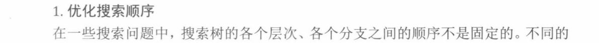
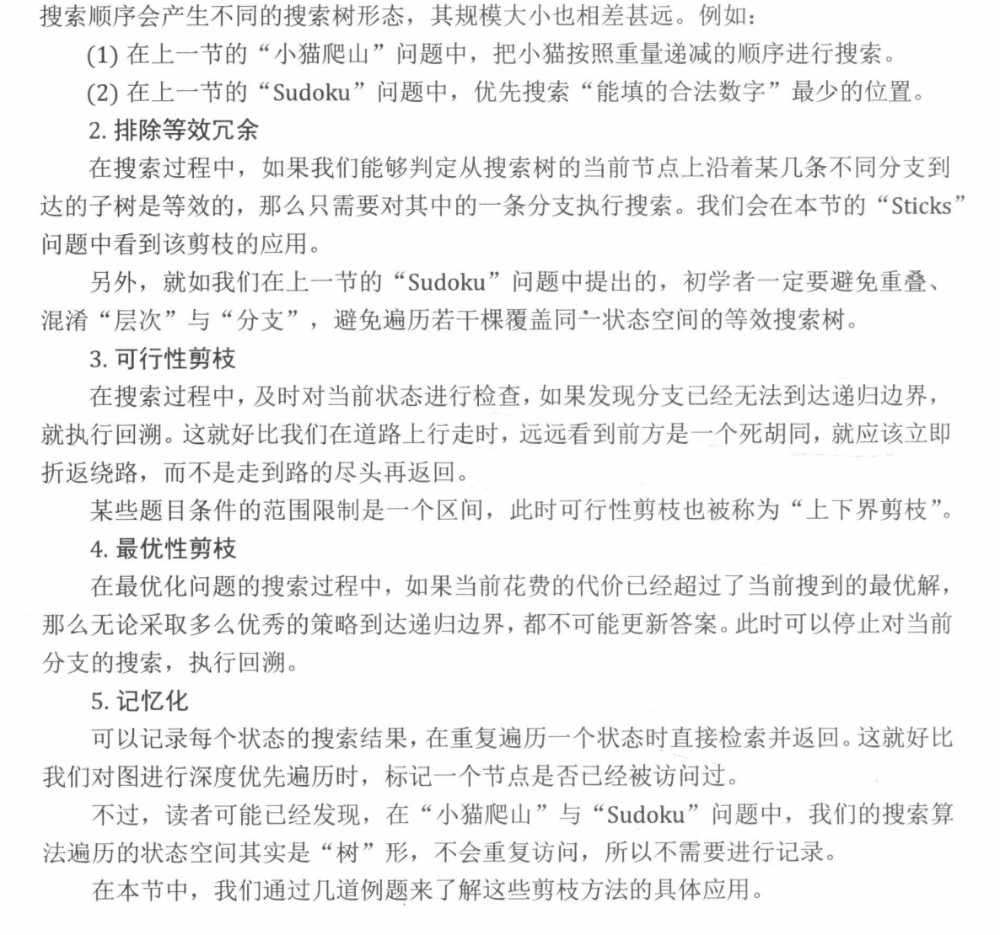
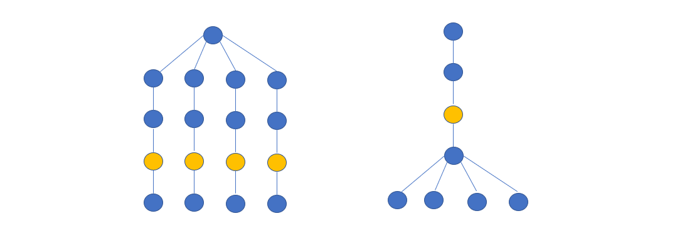
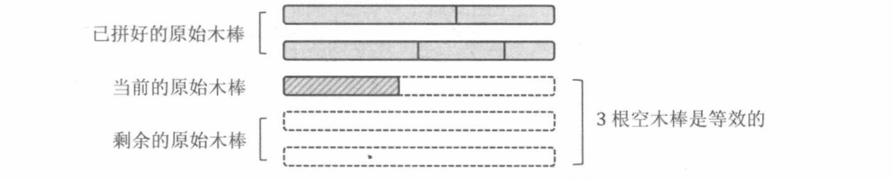
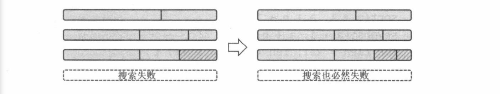
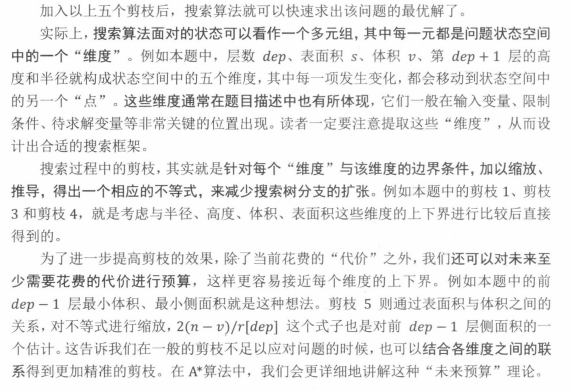

[TOC]

#### DFS剪枝概述

剪枝，就是减少搜索树的规模，尽早排除搜索树中不必要的分支的一种手段，形象地看，就好像剪掉了搜索树的枝条，故被称为“剪枝”。在 DFS 问题中，有以下几类剪枝方法。





优化搜索顺序



```
优选选择分支较少的路径进行搜索，可能会提前找到结果
```


#### 165：小猫爬山

https://www.acwing.com/problem/content/167/

对当前的小猫来说：

1：放在当前已有的缆车中

2：再租一辆缆车将其放到其中

所以我们实时关心的状态有：已经运送了多少只小猫，已经租用的缆车有多少，每辆缆车上搭载的小猫重量之和。

**优化搜索顺序：** 体重较大的小猫会使得当前缆车可以搭载的小猫数量更少，也即当前 节点下的分支就会更少。就达到一个剪枝过程。所以将小猫的体重从大到小排序即可。

```c++
#include<iostream>
#include<algorithm>
#include<cstring>
using namespace std;

const int N = 20;
int n ,m;
int w[N];
int sum[N]; //  表示每一辆缆车上已有的小猫的重量 
int ans = N;

// 处理 第 u 只小猫，k 表示已经租用的缆车的数量
void dfs(int u , int k) 
{
    // 最优性剪枝
    if(k >= ans) return;
    if(u == n)
    {
        ans = k;
        return;
    }
    //  将第u只小猫放在已有的缆车上
    for(int i = 1 ; i <= k ; i++)
    {
        if(sum[i]  + w[u] <= m) //  可行性剪枝
        {
            sum[i] += w[u];
            dfs(u + 1 , k);
            sum[i] -= w[u];   //  恢复现场
        }
    }
    
    //  新租缆车
    sum[k + 1] = w[u];
    dfs(u + 1 , k + 1);
    sum[k ] = 0;
}

int main()
{
    scanf("%d%d", &n, &m);
    for(int i = 0 ; i < n ; i++) scanf("%d", &w[i]);
    
    //  优化搜索顺序
    sort(w , w + n);
    reverse(w , w + n);
    
    dfs(0,0);
    
    cout << ans << endl;
    
    return 0;
}
```


#### 166：数独

https://www.acwing.com/problem/content/168/

```
在数独中，我们需要 选择格子并对其进行填数。
1：选择分支数最少的格子  （优化搜索顺序）
2：行，列，九宫格中1-9的数字不重不漏。 （可行性剪枝）
	这里可以使用位运算进行 判定。     （位运算优化）
	行，列，九宫格，都可以使用 01 串来表示对应位置是否

位运算优化：
1：	可以使用一个二进制数来表示当前行的状态：
eg:      1 2 3 4 5 6 7 8 9
		 0 1 0 0 1 0 1 0 1    --> 二进制数
	表示其中 2 5 7 9 这几个数可以使用。
推广到	 列 和 九宫格中 , 都使用 二进制数来表示 当前状态中 1 - 9 中数字的使用。
并且因为我们 要同时满足 行 ，列 ， 九宫格，对表示其的三个 二进制数进行 与 运算。

2： 找 1 操作
使用二进制数进行表示的时候，我们需要寻找 其中 1 的个数来确定 这个数是否被使用，、
所以要用到  lowbit()  运算。来查找 当前二进制数中1个的个数。
这样就不会循环 9 次来寻找，只需要循环 1 的个数次即可.
```

```c++
#include<iostream>
#include<cstring>
#include<algorithm>
using namespace std;

const int N = 9, M = 1 << N;

// ones[M] 表示一个数的二进制表示中有多少个 1
// map 表示 以 2 为底 i 的对数 是 map[i];
int ones[M] , map[M]; 

int row[N] , col[N] , cell[3][3];
char str[100];

void init() //  预处理 行，列 ，九宫格
{
    //  (1 << N) - 1 = 511, 即 9 个位置 都是 1
    for(int i = 0 ; i < N ; i++) row[i] = col[i] = (1 << N) - 1;
    for(int i = 0 ; i < 3 ; i++)
        for(int j = 0 ; j < 3 ; j++)
            cell[i][j] = (1 << N) - 1;
}
//在 x,y 这个位置填 t，is_ste == true 是填数， is_set == false 是恢复现场，即删数
void draw(int x,int y, int t,bool is_set)
{
    //  转过来的 二维坐标，要存到一维数组， x * N + y 
    if(is_set) str[x * N + y] = '1' + t;
    else str[x * N + y] = '.';
    
    int v = 1 << t;
    if(!is_set) v = -v;
    
    row[x] -= v;
    col[y] -= v;
    cell[x / 3][y / 3] -= v;
}

int lowbit(int x)
{
    return x & -x;
}
int get(int x, int y)
{
    return row[x] & col[y] & cell[x/3][y/3];
}

bool dfs(int cnt)
{
    if(!cnt) return true;
    int minv = 10;
    int x,y;
    for(int i = 0 ; i < N ; i++)
        for(int j = 0 ; j < N ; j++)
            if(str[i * N + j] == '.')
            {
                int state = get(i,j);
                if(ones[state] < minv)
                {
                    minv = ones[state];
                    x = i, y = j;
                }
            }
    
    int state = get(x, y);  //  枚举当前状态中所有的 1
    for(int i = state ; i ; i -= lowbit(i))
    {
        int t = map[lowbit(i)];  //  将需要填的数处理出来（
        draw(x , y , t ,true);
        if(dfs(cnt - 1)) return true;
        draw(x, y , t, false);
    }
    return false;
}


int main()
{
    //  初始化 ones[]  和  map[]
    for(int i = 0 ; i < N ; i++) map[1 << i] = i;
   	
    for(int i = 0 ; i < 1 << N ; i++)  
        for(int j = 0 ; j < N ; j++)
            ones[i] += i >> j & 1;
    
    while(cin >> str , str[0] != 'e')
    {
        init();
        
        int cnt = 0; //  . 数
        for(int i = 0 , k = 0 ; i < N ; i++)
            for(int j = 0 ; j < N ; j++, k ++)
                if(str[k] != '.')
                {
                    int t = str[k] - '1';
                    draw(i ,j , t , true);
                }
                else cnt ++;
                
        dfs(cnt);
        puts(str);
    }
    return 0;
}
```


#### 167：木棒

https://www.acwing.com/problem/content/169/

```
剪枝：
	1：木棍的 长度一定是 sum 的约数
	2：优化搜索顺序，从小到大枚举
	3：排除等效冗余，按照 组合数 的方式枚举。
				  如果当前木棍加到当前棒中，失败了，则直接略过后面所有长度相等的木棍。
				  如果是 木棒的第一根木棍失败了，则当前方案一定失败，直接回溯。
				  如果是 木棒的最后一根木棍失败了，则当前方案一定失败，直接回溯。
```

```
dfs 的参数：
	因为未知木棍的长度 len ，所以需要对len从小到大开始枚举。所以每一次搜索要面对的状态有：
    1：已经拼好的原始大木棒的根数
    2：正在拼的原始大木棒的当前长度
    3：每根小木棍的使用情况。
  在每个状态中，我们 从尚未使用的小木棍中选择一个，尝试拼到原始大木棒中。然后不断向新的状态
  递归。递归的边界就是 sum / len 数
```

```
1： 剪枝优化：
	①： 大木棒的长度一定和木棒的总长是倍数关系。 sum % len == 0
			因为每一组当中每个大木棒的长度都相等。
	②： 优化搜索顺序： 将小木棍从大到小进行排序，优先尝试较长的 小木棍。
	③： 排除等效冗余：
		1：可以限制先后加入的一根原始大木棒的小木棍长度是 递减的。
			因为 对于已经拼好的部分，其中木棒的顺序无所谓，我们需要的是 组合数，
			不是排列数。
		2：对于原始木棒，记录最近一次尝试拼接的木棍长度，如果分支搜索失败回溯，不再尝试
		向该木棒拼接其他 相同长度的木棒，（必定会失败）
		3：如果在 当前的原始大木棒中“尝试拼接的第一根小木棍”的递归分支失败，那么直接判定
		当前分支失败，直接回溯。
			因为在拼入这些小木棍之前，面对的原始 大木棒都是 空的,（还未向其中拼接木棍）
			这些木棒是等效的。小木棍拼在当前大木棒中失败，那么拼到其他的木棒中，也一定会
			失败。
			
```



```
		4：如果在 原始大木棒中拼入一根小木棍之后，大木棒恰好拼接完整，并且“ 接下来拼接
		剩余原始大木棒”的递归分支返回失败，那么直接判定当前分支失败，直接回溯。
			因为：贪心：再用 1 根小木棍恰好拼完当前原始木棒 必然 比 再用若干根木棍拼接好
				当前原始大木棒 更好。
```



```
利用 同一木棒上木棍顺序的等效性， 等长木棒的等效性 ， 空木棒的等效性， 和 贪心 剪枝
```

```c++
#include<iostream>
#include<cstring>
#include<algorithm>
using namespace std;
const int N = 70;

int n;
int w[N], sum, length; 
bool st[N];  //  标记数组

// u是已经拼好的原始大木棒根数 ， cur 是正在拼的原始大木棒的当前长度，
// start 是木棍的使用情况
//   正在拼第 u 根原始大木棒。已经拼好 u - 1根
//   第 u 根木棒的当前长度为 cur
//   拼接到第 u 根木棒中上的一根 小木棍的下标为 start
bool dfs(int u, int cur ,int start)
{
    if(u * length == sum) return true;
    if(cur == length) return  dfs(u + 1, 0 ,1);
    
    for(int i = start ; i < n ; i++)
    {
        //  用过 或者 加上后大于当前使用的 len
        if(st[i] || cur + w[i] > length) continue;
        
        st[i] =  true;
        if(dfs(u, cur + w[i], i + 1)) return true;
        st[i] = false;
        
        //  当前小木棍是该木棒的第一根或最后一根 并未成功的话，直接剪掉
        if(!cur || cur + w[i] == length) return false;
        
        // 因为已经排好序，所以所有的长度相等的排在一起，这些等效，加一个直接跳过其他的
        int j = i;
        while(j < n && w[i] == w[j]) j++;
        i = j - 1;  
        
    }
    return false;
}

int main()
{
    while(cin >> n , n)
    {
        memset(st, 0 ,sizeof st);
        sum = 0;
        
        for(int i = 0 ; i < n ; i++)
        {
            cin >> w[i];
            sum += w[i];
        }
        
        // sort(w, w + n, greater<int>())
        sort(w,  w + n);
        reverse(w, w + n);
        
        length = 1;
        while(true)
        {
            if(sum % length == 0 && dfs(0,0,0))
            {
                cout << length << endl;
                break;
            }
            length++;
        }
        
    }
    return 0;
}

```


#### 168：生日蛋糕

https://www.acwing.com/activity/content/problem/content/1488/

圆柱体体积 $ V = \pi R^2 h$ 。

侧面积  $ A = 2 \pi R H$

底面积  $ A' = \pi R^2 $

其中题目要求 $\pi$ 不参加计算（防止小数异常）

根据： $ R_i > R_{i+1} , H_i > H_{i+1}$  (  $ i ( 1 < i < M)$ )    $ i $ 是从下往上的。

```
搜索的框架：
从下往上搜索，枚举每层的 半径 和 高度作为分支。

搜索面对的状态：
正在搜索 第 dep 层， 当前外表面面积为 S ， 当前体积为 V , 第 dep + 1层的高度和半径。
使用 H[N] , R[N] 分别记录 每一层的高度和半径。

面积 S： 整个  “上表面”  的面积之和等于 ”最底层“  的底面积，所以在其他层时， 只需要计算
侧面积即可。

1： 优化搜索顺序：
在搜索中，先搜索 “决策少” 的部分。因为这里的总体积是确定的。并且体积收到 R 和 H  两个因素
决定，其中 R 的 平方级别的，  H 是线性级别的，所以 先搜索 R 大 和 H 大 的模块。

也即：从下往上搜索。

2： 上下界剪枝。
在第  dep 层时。
```

去掉 $\pi$ 之后， $V = R^2 H$ ,所以  $H = \frac {V}{R^2}$

首先，枚举  $ R \in [ dep , \ \  min(⌊ \sqrt{N - v}⌋ , R[dep+1] - 1)] $

其次，枚举  $H \in [dep , min (⌊ \frac {N -v}{R^2}⌋ , H[dep + 1] - 1)]$

```
这里的 N 时限制的总体积，  v 是其他层已经使用的蛋糕体积。
R 和  H 的边界是  R[dep + 1] - 1 和 H[dep + 1] - 1的原因是：
```

$R_i 严格小于 R_{i - 1}$ 且  $ H_i 严格小于 H_{i-1}$

```
从顶层第一枚举时， 即从 M 倒序枚举时， 
R 最小可以可取当前层数 dep , 最大 可取剩余体积的的半径，但不能超过，下一层的 半径的最小。
H 也是同样。
```

```
3： 可行性剪枝
可以预处理出 从上往下前 i 层的  最小体积和侧面积。
显然，当第 1 ~ i 层的半径分别取 1,2,3...i,高也分别取 1,2,3...i 时，有最小体积和侧面积。

如果当前体积 v 加上 1 ~ dep - 1 层的最小体积 >  N ， 可以剪枝。
```

```
4： 最优性剪枝一：
如果当前表面积 s 加上 1 ~ dep - 1层的最小侧面积大于已经搜到的答案，剪枝。
```

```
5：  最优性剪枝二：
```

利用 h 和 r 数组，

$1 $ ~ $ dep -1 $层的体积可表示为： $ n - v = \sum ^{dep-1}_{k=1} h[k] * r[k] ^2$

$1 $ ~ $ dep -1 $层的面积可表示为： $ 2 \sum ^{dep-1}_{k=1} h[k] * r[k]$

因为 
$$
2 \sum ^{dep-1}_{k=1} h[k] * r[k] = \frac{2}{r[dep]} * \sum_{k=1}^{dep-1}h[k]*r[k]*r[dep] \geqslant \frac{2}{r[dep]} * \sum_{k=1}^{dep-1}h[k]*r[k]^2
$$

$$
\geqslant \frac {2(n - v)}{r[dep]}
$$

所以当  $\frac {2(n-v)}{r[dep]} + s $  大于已经搜到的答案时，可以剪枝。



```c++
#include<iostream>
#include<cmath>
#include<algorithm>
using namespace std;
const int N = 25 , INF = 1e9;

int  n ,m;
int R[N] , H[N];
int minv[N] , mins[N];

int ans = INF;

// u 是当前这层的层号
// v 是当前已经枚举的总体积
// s 是当前已经枚举的总面积
void dfs(int u, int v, int s)
{
    if(v + minv[u] > n) return;
    if(s + mins[u] >= ans) return;
    if(s + 2 * (n - v) / R[u + 1] >= ans) return;
    
    if(!u) //  处理到最底层
    {
        if(n == v) ans = s;
        return;
    }
    
    for(int r = min((int)sqrt(n-v),R[u+1]-1); r >= u ; r--)
        for(int h = min((n-v) / r / r,H[u+1]-1); h >= u ; h--)
        { 
            int t = 0;
            if(u == m) t = r * r;
            R[u] = r , H[u] = h;
            dfs(u-1 , v + r*r*h , s + 2 * r *h + t);
        }
    
}

int main()
{
    cin >> n >> m;
    
    //  预处理 minv 和 mins 的值
    for (int i = 1; i <= m; i ++ )
    {
        minv[i] = minv[i - 1] + i * i * i; // R^2 * H + 之前的面积 
        mins[i] = mins[i - 1] + 2 * i * i;
    }
    
    R[m + 1]  = H[m + 1] = INF;
    dfs(m , 0 , 0);
    
    if(ans == INF) ans = 0;
    cout << ans << endl;
    
    return 0;
}

```


