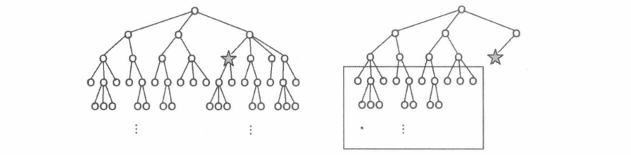
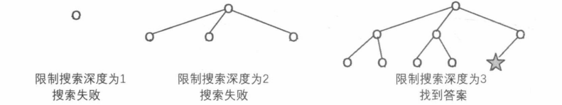

[TOC]

#### **迭代加深的思想**

深度优先搜索每次选定一个分支，不断深入，直至到达递归边界才回溯。这种策略带有一定的缺陷。试想以下情况：**搜索树每个节点的分支数目非常多，并且问题的答案在某个较浅的节点上。如果深搜在一开始选错了分支，就很可能在不包含答案的深层子树上浪费许多时间。**

如果下图左半部分是问题的状态空间，五角星标识着答案，那么深度优先搜索算法产生的搜索树就如下图右半部分所示，算法在矩形圈出的深层子树上浪费了很多时间。



此时，我们可以**从小到大限制搜索的深度**，**如果在当前深度限制下搜不到答案，就把深度限制增加，重新进行一次搜索，这就是迭代加深思想**。所谓“迭代”，就是**以上一次的结果为基础**，重复执行以逼近答案的意思。迭代加深DFS的过程如下：



虽然该过程在深度限制为 d 时，会重复搜索第 1~d－1 层的节点，但是当搜索树节点分支数目较多时，随着层数的深入，每层节点数会呈指数级增长，这点重复搜索与深层子树的规模相比，实在是小巫见大巫了。
总而言之，**当搜索树规模随着层次的深入增长很快，并且我们能够确保答案在一个较浅层的节点**时，就可以**采用迭代加深**的深度优先搜索算法来解决问题。

可以进行大致的估算,有些题目描述甚至会包含   “ 如果10步以内搜不到结果就算无解 ”  的字样。

在迭代加深中，会对上层节点反复的进行搜索，但是这相较于搜到答案的时间时间是很微弱的。

```
eg: 在满二叉树中 第 i 层的节点个数是 2^(i-1) ， 而一共才  2^i - 1，所以最后一层实际占比
很大，所以上层节点的搜索时间基本忽略不计。
```

#### **迭代加深 和  BFS 的区别**

```
迭代加深本质上还是 dfs ，每次只会记录一条分支节点的信息。空间复杂度是 o(N)
而 BFS 则是每一次会记录一层节点的信息， 空间复杂度是 O(m^n) （指数级别）
```

#### 170：加成序列

https://www.acwing.com/problem/content/172/

```
题目中 n 的限制是 <= 100 。可以 以 2 的指数作为例子来看：
1  2  4  8  16  32  64  128 >= 100  ，所以答案本身就处于比较 浅 的层当中。
那么使用 迭代加深 是可行的。
```

```
搜索框架：
依次搜索序列中的每个位置 k , 枚举 i 和 j 作为分支，把 X[i] 和 X[j] 的和填到  X[k] 上，
然后递归填写下一个位置。
```

```
剪枝：
1：  优化搜索顺序：
为了让序列中的数尽快逼近 n, 在枚举 i 和 j 时从大到小枚举。

2：  排除等效冗余。
对于不同的 i 和 j，  X[i] 和 X[j] = 可能是相等的。我们可以在枚举的时用一个 bool 数组
对  X[i] + X[j] 进行判重，避免重复搜索某一个和。
```

```c++
#include<iostream>
#include<algorithm>
using namespace std;

const int N = 105;
int n;
int path[N];

bool dfs(int depth , int max_depth)
{
    if(depth > max_depth) return false;
    if(path[depth - 1] == n) return true;
    
    bool st[N] = {0}; // 判重数组。
    //  从大到小的枚举
    for(int i = depth - 1 ; i >= 0 ; i--)
        for(int j = i ; j >= 0 ; j--) //j <= i ，防止出现i=0,j=1和j=0,i=1的重复出现
        {
            int s = path[i] + path[j];
            //  保证总和        s <= n 
            //  保证单调递增.   s > path[depth -1] 
            //  保证未被搜索过.  st[s] = 0;
            if(s <= n && s > path[depth - 1] && !st[s])
            {
                st[s] = 1; // 标志已经被搜索
                path[depth] = s; // 记录 和
                if(dfs(depth + 1 , max_depth)) return true;
            }
        }
    return false;
}

int main()
{
    path[0] = 1;
    while (cin >> n , n)  // 这里输入个数并不确定。只需判断 n 是否 != 0即可
    {
        int depth = 1;
        while(!dfs(1 , depth )) depth++; //  迭代加深
        for(int i = 0 ; i < depth ; i++) cout << path[i] << ' ';
        cout << endl;
    }
    return 0;
}

```


