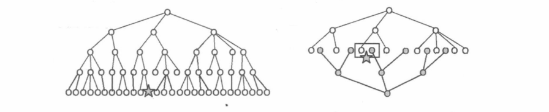

[TOC]

#### 双向 DFS 思路

除了迭代加深之外，双向搜索也可以避免在深层子树上浪费时间。在一些题目中，问题不但具有“初态”,还具有明确的“终态”,并且从初态开始搜索与从终态开始逆向搜索产生的搜索树都能覆盖整个状态空间。在这种情况下，就可以采用双向搜索从初态和终态出发各搜索一半状态，产生两棵深度减半的搜索树，在中间交会、组合成最终的答案。
	如下图所示，左侧是直接进行一次搜索产生的搜索树，右侧是双向搜索的两棵搜索树，避免了层数过深时分支数量的大规模增长。



#### 171：送礼物

https://www.acwing.com/problem/content/173/

```
首先如果要使用背包问题来解决的话，背包问题的时间复杂度是   O(n * w) 
但是这里的 w 的范围在 2^31 ，所以用背包一定会超时。
这里的 n 是比较少的，可以暴搜一试。
```

如果直接去枚举的话 —— 搜索每个礼物选还是不选，时间复杂度就是 $ o(2^N)$  

本题中 $ N\leqslant 45$ ,  $ 2^{45}$ 的复杂度过高，这时可以**使用双向搜索的思想，将礼物分成两半。**


①：我们搜索出从前一半礼物中选出若干个，可能达到的 $0$~$W$ 之间的所有重量值，存放在一个数组 $A$ 中，并对数组A进行排序、去重。

②：我们进行第二次搜索，尝试从后一半礼物中选出一些。对于每个可能达到的重量值 $t$，在第一部分得到的数组 $A$ 中二分查找 $\leqslant W - t$ 的数值中最大的一个，（注意这里寻找的是 <= W - t 的值，不能使用哈希来存，哈希之能确切的判断某一个数是不是存在的）

用二者的和更新答案。

此时算法的时间复杂度就只有   $O(2^{N/2}log2^{N/2}) = O(N * 2^{N/2})$ 。

然后再加入一些剪枝。

```
1：   优化搜索顺序：
把礼物按照重量降序后再 分半，搜索。

2：   选择适当的 “折半划分点”
因为第二次搜索需要在第一次搜索得到的数组中进行二分查找，效率相对较低。
所以我们应该稍微增加第一次搜索的礼物数，减少第二次搜索的礼物数。经过本地随机数
据的实验，我们发现取第 1 ~ N/2 ＋ 2 个礼物为“前一半”，取第 N/2 ＋ 3 ~ N 个礼物.
为“后一半”时，搜索的速度最快。
```


```c++
#include<iostream>
#include<cstring>
#include<algorithm>
using namespace std;

const int N = 46;
typedef long long LL;

int n , m , k;
int w[N];
int weights[1 << 25] , cnt = 1; //  weights 用来存储所有凑出来的重量
int ans;

// u 表示枚举到的当前的数,s 表示枚举到当前的和 
void dfs1(int u, int s)
{
    if(u == k) //  已经枚举到第 k 个数
    {
        weights[cnt++] = s;  //  将当前和 存储 weights 中
        return;
    }
    
    dfs1(u + 1 ,s); //  不用当前这个 物品
    if((LL)s + w[u] <= m ) dfs1(u + 1 ,s + w[u]); //  用当前这个 物品
    
}

void dfs2(int u , int s)
{
    if(u >= n)
    {
        //  二分出  <= m - s 最大的数
        int l = 0 , r = cnt - 1;
        while(l < r)
        {
            int mid = l + r + 1 >> 1;
            if(weights[mid] <= m - s) l = mid;
            else r = mid - 1;
        }
    	
        ans = max(ans , weights[l] + s); 
        return;
    }
    dfs2(u + 1 , s); //  不用当前的 物品
    if((LL)s + w[u] <= m ) dfs2(u + 1 ,s + w[u]); //  用当前的 物品
}

int main()
{
    cin >> m >> n;
    for(int i = 0 ; i < n ; i++) cin >> w[i];

    //  倒序
    sort(w , w + n);
    reverse( w , w + n);
    
    k = n / 2 + 2; //  k 取这个值效果好
    dfs1(0,0);
    
    //  排序，判重
    sort(weights, weights + cnt);
    cnt = unique(weights , weights + cnt) - weights;
    
    dfs2(k , 0); // 第二段搜索从 k 开始
    
    cout << ans << endl;
    
    return 0;
}
```


