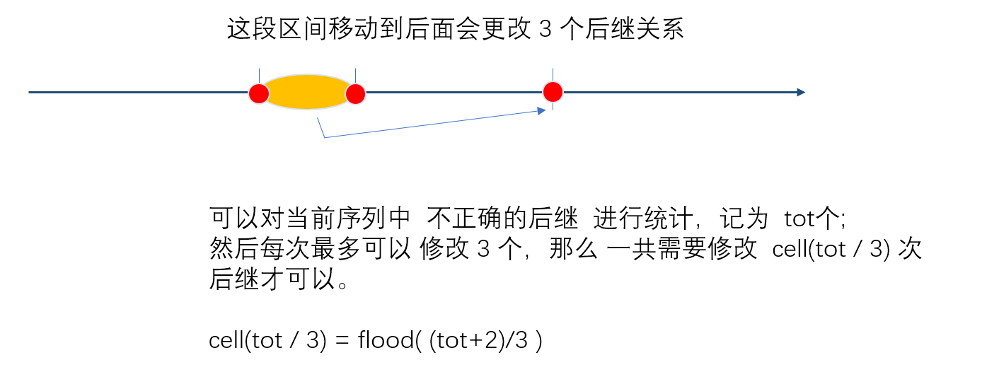
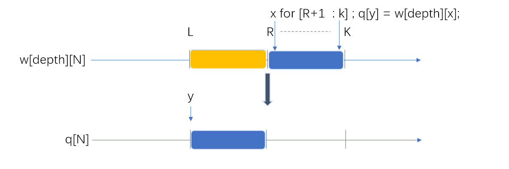
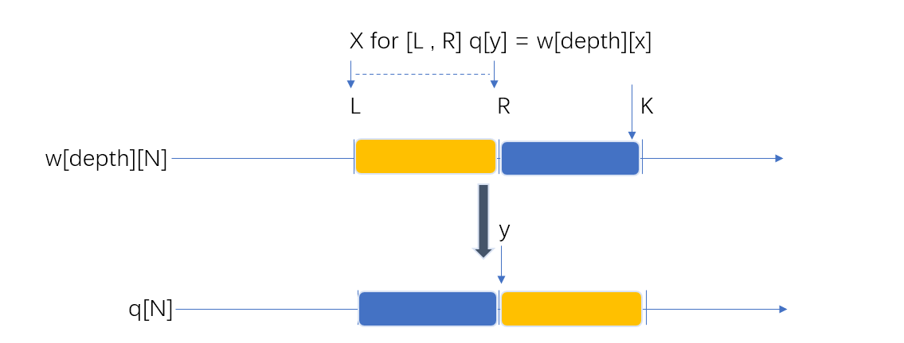

[TOC]

#### **IDA* 算法的思路**

A* 算法是 BFS 和 估价函数的结合。 估价函数和 DFS 的结合时，由于 DFS 有个缺点：一旦估价出现失误，容易导致向下递归进一个不能产生最优解的分支。那么使用 **迭代加深** 正好可以避免 DFS 盲目的搜索一个分支而浪费时间。

将  **迭代加深和估价函数** 结合的算法就是 **IDA *算法 **

设计一个估价函数，**估计从每个状态到目标状态需要的步数。**。当然，与 A* 算法一样，估价函数需要遵守                  “ **估计值不大于未来实际步数** ” 的准则。然后，以迭代加深 DFS 的搜索框架为基础，将原来简单的深度限制加强为    **若当前深度 +  未来估计步数  >  深度限制，则立即从当前分支回溯。**


#### 180：排书

https://www.acwing.com/problem/content/182/

先估算一下每个状态的分支数量。

在每个状态下，可以抽取连续的一段书，移动到另一个位置。对于任意整数  $i$ ,当抽取的长度为   $i$ 时，有  $n-i+1$ 种选择方式，有  $n-i$ 个可插入的位置。另外，把一段书移动到更靠前的位置，等价于把  “跳过” 的那段书移动到靠后的某个位置，所以上面的计算方法 把每种移动情况 算了两遍。每个状态的分支数量约为 :

 $\sum_{i=1}^{n} (n-i)*(n-i+1) \leqslant (15*14+14*13+...+2*1)/2 = 560$   

$1*2 + 2*3 + ... + n(n+1) = \frac {n*(n+1) *(n+2)}{3}$

题目中要求时在 4 次操作中能否实现目标，所以我们只考虑搜索树的前 4 层，4 层的搜索树的规模能够达到 $560^4$ ,会超时。

1：使用双向BFS，可以将时间复杂度降到  $560^2$ 

2：使用 IDA* ,对于任意一个状态，考虑整个排列中树的错误后继的总个数为 （记为 $tot$）可以发现每次操作至少更改  $3$ 本书的后继，即使在最理想的情况下，每次操作都能把某 $3$ 个错误后继全部改对，消除所有错误后继的操作次数 也至少需要  $⌈ tot/3 ⌉$ 次。

因此，我们将一个状态 $s$ 的估价函数设计为  $f(s) = ⌈ tot/3 ⌉$ , 其中 $tot$ 表示在状态 $s$ 下书的错误后继总数。

再采用迭代加深的方法，从 $1$  ~  $4$  依次限制搜索深度，然后从起始状态出发 DFS.

DFS时，在每个状态下直接枚举抽取哪一段，移动到更靠后的哪个位置，沿着该分支深入即可，注意在进入任何状态  $s$ 后，我们先进行判断，**如果当前操作次数加上 $f(s)$ 已经大于深度限制，直接从当前分支回溯。**







```
每次移动的操作。
首先是要使用 拷贝 部分去做。

memcopy(w[depth] , q ,sizeof q);
int y = L;
for(int x = R + 1 ; x <= k ; x++ , y++) q[y] = w[depth][x];
for(int x = l ; x <= r ; x++ , y++) q[y] = w[depth][x];


memcopy(q , w[depth] , sizeof q);

```


```c++
#include<iostream>
#include<algorithm>
#include<cstring>
using namespace std;

const int N = 15;

int n;
int q[N];
int w[5][N];

int f() //  估价函数
{
    int tot = 0;
    for(int i = 0 ; i + 1 < n ; i++ )
        if(q[i + 1] != q[i] + 1)
            tot ++;
    
    return (tot + 2) / 3;
}

bool dfs(int depth , int max_depth)
{
    if(depth + f() > max_depth) return false; 
    if(f() == 0) return true;
    
    //  枚举决策 ， 这里的 len 是指每次移动的书的数目。
    for(int len = 1 ; len <= n ; len++)
        for(int l = 0 ; l + len - 1 <  n ; l++) //  共有 n - len + 1 种方案
        {
            int r = l + len - 1;    // 移动 l 后该区间的右端
            for(int k = r + 1 ; k < n ; k++)
            {
                memcpy(w[depth] , q , sizeof q);
                
                int y = l;
                for(int x = r + 1 ; x <= k ; x++ , y++) q[y] = w[depth][x];
                for(int x = l ; x <= r ; x++ , y++) q[y] = w[depth][x];
                if(dfs(depth + 1 , max_depth)) return true;
                
                memcpy(q , w[depth] , sizeof q);
            }
        }
    return false;
}

int main()
{
    int T;
    cin >> T;
    while(T--)
    {
        cin >> n;
        for(int i = 0 ; i < n ; i++) cin >> q[i];
        
        int max_depth = 0;
        while(max_depth < 5 && !dfs(0 , max_depth)) max_depth++;
        
        if(max_depth >= 5) puts("5 or more");
        else cout << max_depth << endl;
    }
    return 0;
}
```

#### 181：回转游戏

https://www.acwing.com/problem/content/183/

DFS 的框架—— 在每个状态下枚举执行哪种操作，然后沿着该分支深入即可。剪枝：需要记录一下上一次的操作，不执行上一个操作的逆操作，避免冗余。

估价函数的设计：

由于最终的目标是中间的数字一致，所以可以用 8 - 中间数字出现次数最多的个数作为估价函数，                即   $f() = max(8 - x_i)$  ，$x_i$ 是每个数字出现的次数。  将中间的 $8$ 个格子中的数都变成 $k$ 至少需要 $f()$次。就把这个值作为估价函数。

采用迭代加深，由 $1$ 开始从小到大依次限制（搜索深度）在 DFS 的每个状态下，若 

“当前操作次数 + 估价函数值  >  深度限制” 则当前分支回溯。

```
可以将 # 盘上的元素的位置进行 记录，方便后面寻找。

```

```c++
/*
            0     1
            A     B
            0     1
            2     3
 7  H 4  5  6  7  8  9  10  C  2
            11    12
 6  G 13 14 15 16 17 18 19  D  3
            20    21
            22    23
            F     E
            5     4
*/

#include <iostream>
#include <cstring>
#include <algorithm>
using namespace std;

const int N = 24;

int op[8][8] = {
    {0 , 2 , 6 , 11 , 15 , 20 , 22}, // A
    {1 , 3 , 8 , 12 , 17 , 21 , 23}, // B
    {10 , 9 , 8 , 7 , 6 , 5 , 4 , 3},// C
    {19 , 18 , 17 , 16, 15 , 14 , 13},// D
    {23 , 21 , 17 , 12 , 8 , 3 , 1},// E
    {22 , 20 , 15 , 11 ,6 , 2 , 0},//F
    {13 , 14 , 15 ,16 , 17, 18 ,19 }, //G
    {4 , 5 , 6 , 7 , 8 , 9 , 10}, //H
};

//  逆操作
int opposite[8] = {5 , 4 , 7 , 6 , 1 , 0 , 3 , 2 };
int center[8] = {6 , 7 , 8 , 11 , 12 , 15 , 16 ,17}; 

int q[N]; // 整个序列
int path[100]; //  方案

int f()
{
    static int sum[4];
    memset(sum ,0 , sizeof sum);
    //  求出每个数字出现的个数
    for(int i = 0 ; i < 8 ; i++) sum[q[center[i]]]++; 
    
    int s = 0;
    for(int i = 1 ; i <= 3 ; i++) s = max(sum[i] , s);
    return 8 - s;
    
}

void operate(int x)   //  操作
{
    int t = q[op[x][0]];
    for(int i = 0  ; i < 6 ; i++) q[op[x][i]] = q[op[x][i+1]];
    q[op[x][6]] = t;
}

bool dfs(int depth , int max_depth , int last)
{
    if(depth + f() > max_depth) return false;
    if(f() == 0) return true;
    
    for(int  i = 0; i < 8 ; i++)
        if(opposite[i] != last)  //  不互为逆操作时才去进行
        {
            operate(i);
            path[depth] = i; //  记录方案
            if(dfs(depth + 1 , max_depth , i)) return true;
            operate(opposite[i]);  // 恢复现场
        }
    return false;
}


int main()
{
    while(cin >> q[0] ,q[0])
    {
        for(int i = 1 ; i < N ; i++) cin >> q[i];
        
        int max_depth = 0;
        while(!dfs(0 , max_depth , -1)) max_depth++;
        
        if (!max_depth) printf("No moves needed");
        else
        {
            for (int i = 0; i < max_depth; i ++ ) printf("%c", 'A' + path[i]);
        }
        printf("\n%d\n", q[6]);
        
    }
    
    return 0;
}
```


