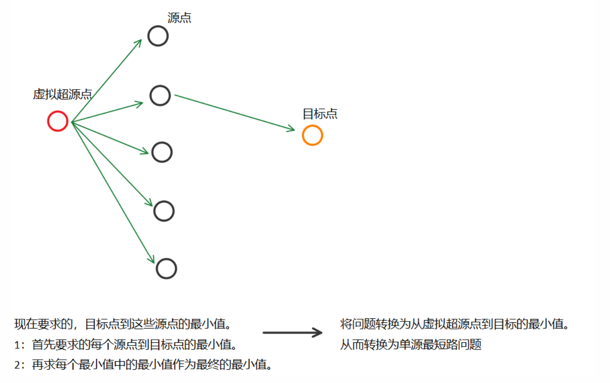
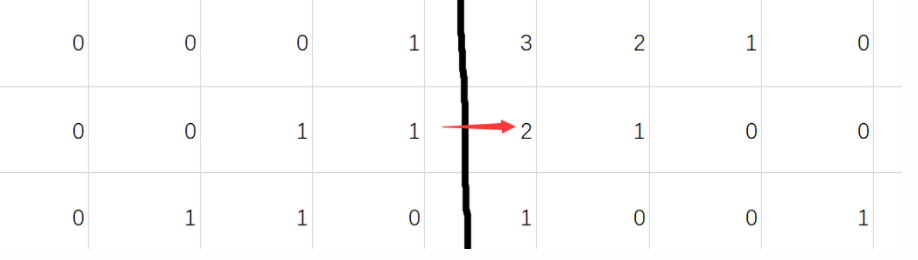

[TOC]

### 多源 BFS



#### 173：矩阵距离

https://www.acwing.com/problem/content/175/




```
dist[ A,A'] 之间的距离称为曼哈顿距离,不是直接距离，是指 行列距离 之和

将所有为 1 点的距离初始化为 0 ,在队列中第一层存的是就是 这些节点。


```

```c++
#include<iostream>
#include<cstring>
#define x first
#define y second
using namespace std;
typedef pair<int, int> PII;
const int N = 1010, M = N * N;

int n ,m;
char g[N][N];
PII q[M];
int dist[N][N];
int dx[4] = {-1, 0, 1, 0}, dy[4] = {0, 1, 0, -1};

void bfs()
{
    memset(dist, -1, sizeof dist);
    int hh = 0 , tt = -1;
    
    //  将图中 为 1 的点 入队。
    for(int i = 1 ; i <= n ; i++)
        for (int j = 1; j <= m; j ++ )
            if(g[i][j] == '1')
            {
                // 由于求的是到最近的1节点距离，所以每个1点距离为0
                dist[i][j] = 0; 
                q[++ tt] = {i,j};// 入队
            }
    
    
    while(hh <= tt)
    {
        auto t = q[hh++];
        
        for (int i = 0; i < 4; i ++ )
        {
            int a = t.x + dx[i] , b = t.y + dy[i];
            
            // 界内 和 没有被 遍历到过 ，继续
            if(a < 1 || a > n || b < 1 || b > m) continue;
            if(dist[a][b] != -1) continue;
            
            //  更新距离
            dist[a][b] = dist[t.x][t.y] + 1;
            q[++ tt] = {a,b};
        }
        
    }
    
}

int main()
{
    scanf("%d%d", &n, &m);
    for (int i = 1; i <= n; i ++ ) scanf("%s", g[i] + 1);
    
    bfs();
    
    for (int i = 1; i <= n; i ++ )
    {
        for (int j = 1; j <= m; j ++ )
            printf("%d ", dist[i][j]);
            
        puts("");
    }
    
    return 0;
}

```

#### 3205：最优配餐

https://www.acwing.com/problem/content/3208/

```c++
#include <iostream>
#include <cstring>
#include <algorithm>
#include <queue>
#define x first
#define y second

using namespace std;
typedef long long LL;
typedef pair<int, int> PII;

const int N = 1010;

int n ,m ,k,d;
bool g[N][N];
int dist[N][N];
queue<PII> q;
struct Target
{
    int x,y,c;
}tg[N * N];

void bfs()
{
    int dx[4] = {-1, 0, 1, 0}, dy[4] = {0, 1, 0, -1};

    while(q.size())
    {
        auto t = q.front();
        q.pop();
        
        for (int i = 0; i < 4; i ++ )
        {
            int a = t.x + dx[i] ,b =  t.y + dy[i];
            if( a < 1 || a > n || b < 1 || b > n || g[a][b]) continue;
            
            // 距离未更新，更新距离
            if(dist[a][b] > dist[t.x][t.y] + 1)
            {
                dist[a][b] = dist[t.x][t.y] + 1;
                q.push({a,b});
            }
            
        }
    }
}

int main()
{
    scanf("%d%d%d%d", &n, &m,&k,&d);
    
    memset(dist , 0x3f ,sizeof dist);
    
    while(m--)
    {
        int x,y;
        scanf("%d%d", &x, &y);
        dist[x][y] = 0;
        q.push({x,y});
    }
    
    for (int i = 0; i < k; i ++ ) 
        scanf("%d%d%d",&tg[i].x,&tg[i].y,&tg[i].c);
    
    while (d -- )
    {
        int x, y;
        scanf("%d%d",&x,&y);
        g[x][y]  =  true;
    }
    
    bfs();
    
    LL res = 0;
    for (int i = 0; i < k; i ++ )
        res += dist[tg[i].x][tg[i].y] * tg[i].c;
    
    printf("%lld\n",res);
    
    return 0;
}
```

#### 3317：重力球

https://www.acwing.com/problem/content/3320/

```

```


```c++

```


