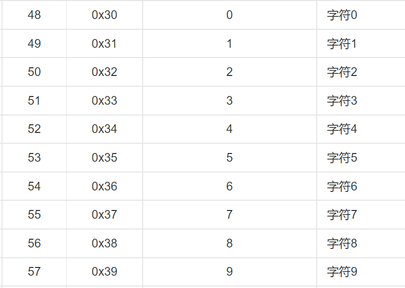
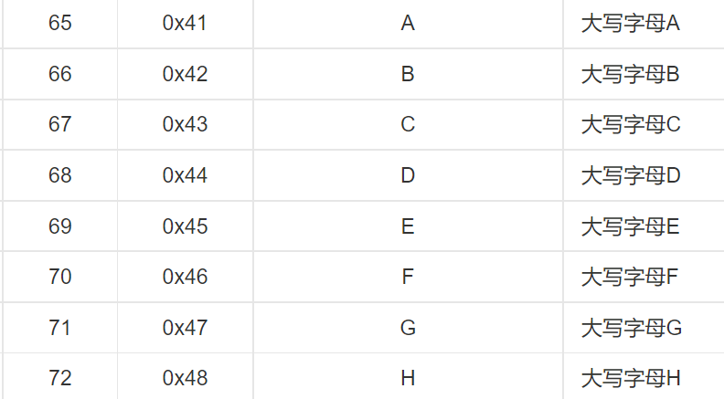
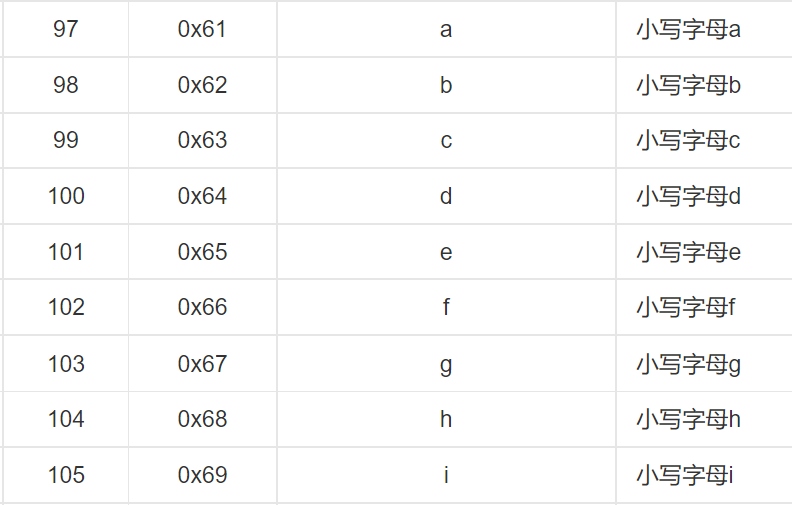

[TOC]

### 最小步数模型

```
一般 会给出 初态 和 终态。
我们从 初态到终态 有很多种 步骤和方法。
需要我们 在每一步选择不同的方法，然后 最少使用多少步到达 终态。


一般需要我们将 每个状态进存储，一般 使用 哈希表 来存储。

```


#### 1107：磨板

https://www.acwing.com/problem/content/1109/

```
因为需要按照字典序进行输出 ， 所以按照 a ,b , c , 这样的顺序进行 入队操作，这样就可以保证
字典序。 因为 普通的 bfs 在 入队时只是同一层 按照存储顺序 进队，而在在这里需要按照
字典序进行操作。

// 其中 string 为键 ， int 为值。
unordered_map<string ,int> dist;
string t;
int i;

dist[t] = i;
```

**数字 和 字符的转换**

```
1：数字转字符：
	 数字 + '0' 
  因为 '0' = 48 , 在 ASCII码中 ， 字符 '0' ~ '9' 为 48 ~ 57
  
2：字符 递增时
	'A' + i (0 ~ n)
	'A' = 65 ,
	'a' = 97
	
```







```c++
#include <iostream>
#include <cstring>
#include <algorithm>
#include<unordered_map>
#include<queue>

using namespace std;
char g[2][4];
//pair<char,string>   char 表示 操作， string表示当前状态
unordered_map<string,pair<char , string>> pre;

// dist负责记录当前状态 是否走过 和 记录步数。
unordered_map<string,int> dist;

void set(string state) // 将 state[] -> g[][]
{
    for(int i = 0 ; i < 4 ; i++) g[0][i] = state[i];
    for (int i = 7, j = 0; j < 4; i --, j ++ ) g[1][j] = state[i];
}

string get() //  将 g[][] -> state[]
{
    string res;
    for(int i = 0 ; i < 4 ; i++) res += g[0][i];
    for(int i = 3 ; i >= 0 ; i--) res += g[1][i];
    return res;
}

string op1(string state) // A 操作
{
    set(state);
    // 交换第 0 , 1 行
    for(int i = 0 ; i < 4 ; i++) swap(g[0][i] ,g[1][i]);
    
    return get();
}

string op2(string state) //  B 操作
{
    set(state);
    // g[0][0] <- g[0][3] ,g[1][0] <- g[1][3]
    int v0 = g[0][3], v1 = g[1][3];
    for (int i = 3; i >= 0; i -- )
    {
        g[0][i] = g[0][i - 1];
        g[1][i] = g[1][i - 1];
    }
    g[0][0] = v0, g[1][0] = v1;
    
    return get();
}

string op3(string state) //  C 操作
{
    set(state);
    c v = g[0][1];
    g[0][1] = g[1][1];
    g[1][1] = g[1][2];
    g[1][2] = g[0][2];
    g[0][2] = v;
    return get();
}
int bfs(string start , string end)
{
    if(start == end) return 0;
    
    queue<string> q;
    q.push(start);
    dist[start] = 0;
    
    while(q.size())
    {
        auto t = q.front();
        q.pop();
        
        string op[3]; // 三种操作
        op[0] = op1(t);
        op[1] = op2(t);
        op[2] = op3(t);
        
        //  遍历三种操作
        for(int i = 0 ; i < 3 ; i++)
        {
            // 当前操作，没有走过
            if(dist.count(op[i]) == 0)
            {
                dist[op[i]] = dist[t] + 1;
                
                pre[op[i]] = {'A' + i, t};
                
                q.push(op[i]);
                
                if(op[i] == end) return dist[end];
            }
        }
    }
    return -1;
}


int main()
{
    int x;
    string start , end;
    for(int i = 0 ; i < 8 ; i++)
    {
        cin >> x;
        //  注意 数字转字符
        end += char(x + '0');
    }
    
    // 创建 初态
    for(int i = 1; i <= 8 ; i++) start += char('0' + i);

    int step = bfs(start , end);
    
    cout << step << endl;
    
    string res;
    while(end != start)
    {
        res += pre[end].first; //  char,操作 步骤
        end = pre[end].second; // string，状态。
    }
    
    //  pre 是 最后一步开始记录的，输出的时候反转
    reverse(res.begin(),res.end());
    
    if(step > 0) cout << res << endl;
    
    return 0;
}


```

