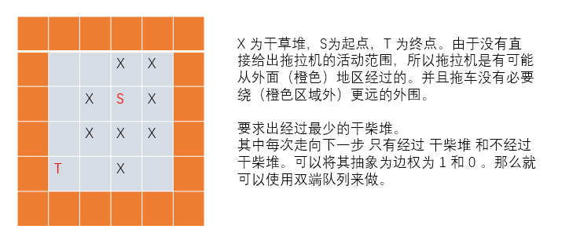

[TOC]

#### 双端队列BFS

对于广搜来说，**队列中状态的层数满足两端性和单调性。**

如果**无向图**中的**边权**不全是 $1$ ，并且**只有 $0$ 和 $1$ 两种状态**。这种情况适用于**使用双端队列BFS**.

双端队列使用 `deque` 来实现。算法整体与广搜类似。在每个分支扩展时稍作改变。即：

1：如果这条边的分支是**边权为 $0$** 的边，就把该分支到达新节点 **从对队头入队**。

2：如果这条边的分支是**边权为 $1$** 的边，就把该分支到达新节点 **从对队尾入队**。

这样一来，任然能保证任意时刻广搜队列中的节点对应的距离值都具有单调性和两段性。

由于这样做的缘故，每个点可能被更新多次，这里的更新多次是指被不同的节点进行更新。                          这里就类似于 堆优化的Dijkstra 算法，只不过这里使用的是  双端队列 `deque`.所以这里也需要

**标记数组** `st[N][N]` 来防止某个节点多次入队。  


所以，需要在做题时对问题进行转换，以达到适用于 双端队列广搜。

**标记数组不在入队时置 1 的原因：** （Dijkstra 的标记数组的原理也是如此）

```
不能在入队的时候置标记数组。
原因如下：

假设 x, y 是在队列中点，并且 dist[x] = dist[y] = 5;
然后现在要 扩展 z 这个点， x -> z 的距离是 1。 y -> z 的距离是0。
并且此时 z 的标记数组置 1


因为 x -> z = 1，所以 z 会被扩展到 队尾。 现在队列的状态是  y , z。
此时 y 再出队， y 再扩展去 z 。并且此时 z 的标记数组已经是 1。 那么他就不能再被扩展。
那么它的最终距离就不对了。

综上： 不能在入队的时候 将标记数组 置 1。这样会导致该节点不能再被更新。节点是可能被更新多次
的。
```

**双端队列 BFS 和 Dijkstra 算法都是出队的时侯才判重。**


#### 175:电路维修

https://www.acwing.com/problem/content/177/

```
可以将 电路图 进行抽象。
转换成 边权 只有 0 , 1 的 无向图。

这个 无向图中只有0 ，1 这两种边，通过对 对角线 电线的的转动，可以将 0 -> 1 
即： 将 不通的路 转换为 通的路。
并且 最终找到 一条连通的 最短路 就行
```


每个点 每个点方向上的边  通过   该点的坐标 再加 **该点边权值对应的四个坐标上的值** 就可以到达

周围的四个点，这里要注意的是  边权值 个 图是 分开存储的。所以需要这一步的转换。

```c++
#include<iostream>
#include<algorithm>
#include<deque>
#include<cstring>
#define x first
#define y second

using namespace std;
typedef pair<int, int> PII;
const int N = 510 ,M = N * N;

int T , n , m;
char g[N][N];
int dist[N][N];
PII q[M];
bool st[N][N];

int bfs(){
    deque<PII> q;
    q.push_back({0,0});
    
    memset(st , 0 ,sizeof st);
    memset(dist , 0x3f ,sizeof dist);
    dist[0][0] = 0;
    
    // 存储的是 四个方向上对应正确通路的 字符形式。 
    char cs[5] = "\\/\\/";   //  本应为 \/\/ ， 有两个转义字符  
    //  某个点 对应周围 四个点的坐标
    int dx[4] = {-1 ,-1 ,1 , 1} ,dy[4] = {-1 , 1 , 1 ,-1};
    // 某个点 每个 方向上边（权值）对应的坐标。 
    int ix[4] = {-1 ,-1 ,0 ,0 }, iy[4] = {-1 ,0 , 0 ,-1};
    
    while(q.size())
    {
        auto t  = q.front(); // 取出队头 元素
        q.pop_front(); 
        
        int x = t.x , y = t.y; // 横纵坐标
        
        if(x == n && y == m)return dist[x][y];
        
        if(st[x][y]) continue;
        st[x][y] = true;
        
        for(int i = 0 ; i < 4 ; i++)
        {
            int a = x + dx[i] ,b = y + dy[i];
            //  因为 点在 行列上 都比边多 一，所以起始是 (0,0) 截至是 (n,m)
            if(a < 0 || a > n || b < 0 || b > m)continue;
            // 指这个方向在 g 数组中坐标 
            int ga = x + ix[i] ,gb = y + iy[i];
            
            int w = g[ga][gb] != cs[i]; //  shi'f
            int d = dist[x][y] + w;
            if(d <= dist[a][b])
            {
                dist[a][b] = d;
                if(!w) q.push_front({a , b});
                else q.push_back({a , b});
            }
        }
    }
    return -1;
}

int main()
{
    scanf("%d", &T);
    while(T--)
    {
        //这里输入的是 边权值，行列要比 点数少一
        scanf("%d%d", &n, &m);
        for(int i = 0 ; i < n ; i++) scanf("%s",g[i]);
        
        if(n + m & 1) puts("NO SOLUTION"); // 终点是奇数点的时候 一定无解
        else printf("%d\n",bfs());
    }
    return 0;
}

```

#### 习题：

##### 2019：拖拉机

https://www.acwing.com/problem/content/2021/



```c++
#include<bits/stdc++.h>
#define x first
#define y second
using namespace std;
typedef pair<int, int> PII;
const int N = 1010;
int n;
bool g[N][N];
int dist[N][N];
bool st[N][N];
int dx[4] = {-1 , 0 , 1 , 0} , dy[4] = {0 , 1,  0 , -1}; // 上右下左的顺序

int bfs(int sx, int sy)
{
    deque<PII> q;
    q.push_back({sx, sy});
    memset(dist , 0x3f , sizeof dist);
    dist[sx][sy] = 0;
    
    while(q.size())
    {
        auto t = q.front();
        q.pop_front();
        
        if(st[t.x][t.y]) continue;
        st[t.x][t.y] = 1;
        
        if(!t.x && !t.y) break; // 如果已经走到终点，直接退出就行
        
        for(int i = 0 ; i < 4 ; i++)
        {
            int x = t.x + dx[i] , y = t.y + dy[i];
            if(x >= 0 && x <= 1001 && y >= 0 && y <= 1001 )
            {
                int w = 0;
                if(g[x][y]) w = 1;
                if(dist[x][y] > dist[t.x][t.y] + w)
                {
                    dist[x][y] = dist[t.x][t.y] + w;
                    if(!w) q.push_front({x, y}); // 加队头
                    else q.push_back({x, y}); // 加队尾
                }
            }
        }
        
    }
    return dist[0][0];
}

int main()
{
    int sx , sy;
    scanf("%d%d%d", &n , &sx , &sy);
    while(n--)
    {
        int x, y;
        scanf("%d%d", &x, &y);
        g[x][y] = 1;
    }
    
    printf("%d\n",bfs(sx, sy));
    
    return 0;
}
```


