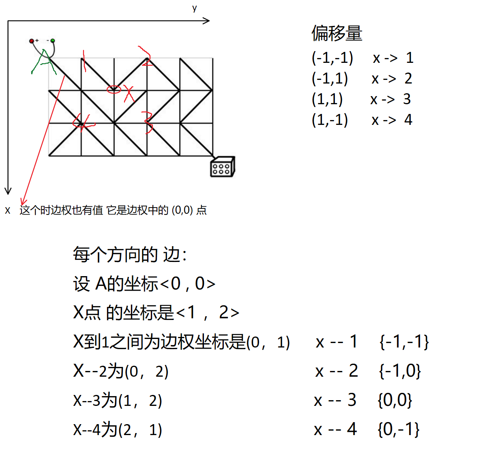

[TOC]

#### 双端队列BFS

```
对于只有 0 ,1 的 两种边权的 图来说；
可以使用 双端队列来做。

对于维护的  双端队列  dequeue 来说：

扩展的时候 只从 队头取：

当扩展到边权为 0 的节点时，将其加到队头。
扩展到边权值 为 1 的节点时，将其 加到队尾。

每个点 可能被 更新多次。但是更新多次是指 被不同的节点更新多次（类似 Dijkstra 算法）
所以我们需要一个判重数组 st[N][N] 防止某个点 多次入队。

这样扩展的目的 就是为了保证单调性 和 两段性。然后就可以使用 BFS.来做。

```


#### 175:电路维修

https://www.acwing.com/problem/content/177/

```
可以将 电路图 进行抽象。
转换成 边权 只有 0 , 1 的 无向图。

这个 无向图中只有0 ，1 这两种边，通过对 对角线 电线的的转动，可以将 0 -> 1 
即： 将 不通的路 转换为 通的路。
并且 最终找到 一条连通的 最短路 就行
```



每个点 每个点方向上的边  通过   该点的坐标 再加 **该点边权值对应的四个坐标上的值** 就可以到达

周围的四个点，这里要注意的是  边权值 个 图是 分开存储的。所以需要这一步的转换。

```c++
#include<iostream>
#include<algorithm>
#include<deque>
#include<cstring>
#define x first
#define y second

using namespace std;
typedef pair<int, int> PII;
const int N = 510 ,M = N * N;

int T , n , m;
char g[N][N];
int dist[N][N];
PII q[M];
bool st[N][N];

int bfs(){
    deque<PII> q;
    q.push_back({0,0});
    
    memset(st , 0 ,sizeof st);
    memset(dist , 0x3f ,sizeof dist);
    dist[0][0] = 0;
    
    // 存储的是 四个方向上对应正确通路的 字符形式。 
    char cs[5] = "\\/\\/";   //  本应为 \/\/ ， 有两个转义字符  
    //  某个点 对应周围 四个点的坐标
    int dx[4] = {-1 ,-1 ,1 , 1} ,dy[4] = {-1 , 1 , 1 ,-1};
    // 某个点 每个 方向上边（权值）对应的坐标。 
    int ix[4] = {-1 ,-1 ,0 ,0 }, iy[4] = {-1 ,0 , 0 ,-1};
    
    while(q.size())
    {
        auto t  = q.front(); // 取出队头 元素
        q.pop_front(); 
        
        int x = t.x , y = t.y; // 横纵坐标
        
        if(x == n && y == m)return dist[x][y];
        
        if(st[x][y]) continue;
        st[x][y] = true;
        
        for(int i = 0 ; i < 4 ; i++)
        {
            int a = x + dx[i] ,b = y + dy[i];
            //  因为 点在 行列上 都比边多 一，所以起始是 (0,0) 截至是 (n,m)
            if(a < 0 || a > n || b < 0 || b > m)continue;
            // 指这个方向在 g 数组中坐标 
            int ga = x + ix[i] ,gb = y + iy[i];
            
            int w = g[ga][gb] != cs[i]; //  shi'f
            int d = dist[x][y] + w;
            if(d <= dist[a][b])
            {
                dist[a][b] = d;
                if(!w) q.push_front({a , b});
                else q.push_back({a , b});
            }
        }
    }
    return -1;
}

int main()
{
    scanf("%d", &T);
    while(T--)
    {
        //这里输入的是 边权值，行列要比 点数少一
        scanf("%d%d", &n, &m);
        for(int i = 0 ; i < n ; i++) scanf("%s",g[i]);
        
        if(n + m & 1) puts("NO SOLUTION"); // 终点是奇数点的时候 一定无解
        else printf("%d\n",bfs());
    }
    return 0;
}

```


