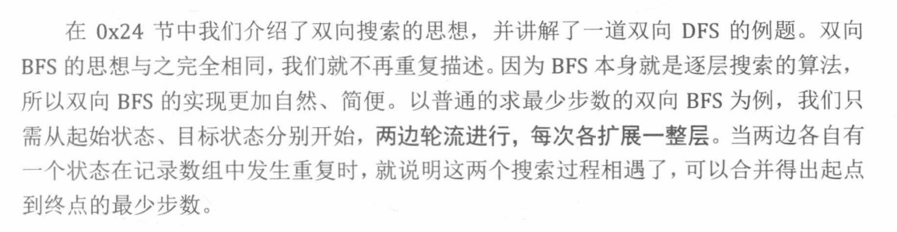
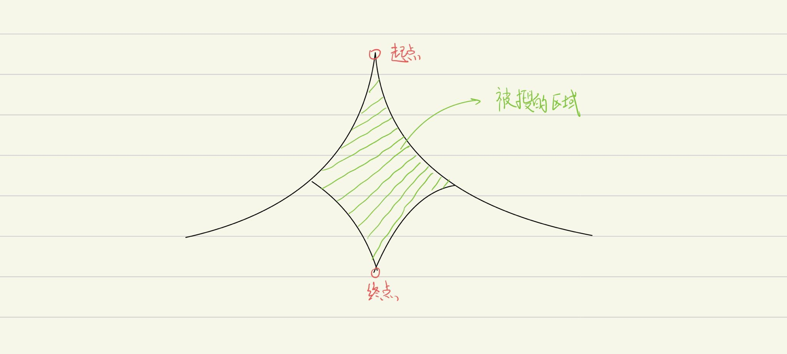
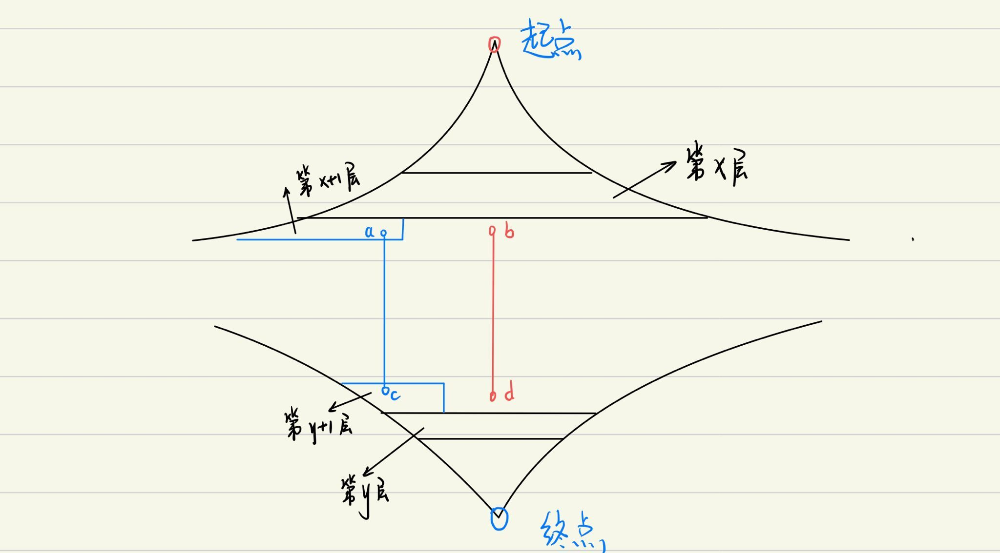

[TOC]


### 双向广搜



广搜 的优化之一：一般使用于  **最少步数** 模型中，并不是适用于所有的模型。

```
在 最小步数模型中 从 初始状态到最终状态。
在其形成的状态空间中有非常多的 状态。
而这些状态的数量 往往都是非常多，如果直接使用暴搜，很大概率就会超时。

```





**每一次扩展时一层一层的扩展。** 不是一个点一个点的来扩展，eg:

如上图，如果每次不是扩展完整一层，而是只扩展一个点。此时上面该扩展点 aa 了，点 aa 搜到了下半部分的点 cc，此时算出的最短路长度是 x+1+y+1+1=x+y+3。但是最优解可能是后面还没扩展到的点 bb 和点 dd 之间的路径，这条路径的长度是 x+1+y+1=x+y+2。


搜索的时候可以加一步**优化**：

双向扩展的时候，每一次扩展 选择当前队列元素较少的方向来扩展。

#### 190：字符变换

https://www.acwing.com/problem/content/192/

```c++
#include<iostream>
#include<cstring>
#include<unordered_map>
#include<algorithm>
#include <queue>
using namespace std;

const int N = 6;
string a[N] , b[N]; //  记录规则
int n;

int extend(queue<string>& q, unordered_map<string ,int> &da,unordered_map<string,int>& db, string a[], string b[])
{
    //  每次扩展 一层。首先找到  到队首的的距离，就可以找到这一层节点
    int d = da[q.front()];  
    //  遍历这一层。
    while (q.size() && da[q.front()] == d)
    {
        auto t = q.front();
        q.pop();
		
        // n 是指 拥有的 规则数
        for (int i = 0; i < n; i ++ )
            // 对当前字符串每一位枚举规则
            for (int j = 0; j < t.size(); j ++ )
                //  判断规则是否可以使用
                if (t.substr(j, a[i].size()) == a[i])
                {
                    string r = t.substr(0, j) + b[i] + t.substr(j + a[i].size());
                    if (db.count(r)) return da[t] + db[r] + 1;
                    if (da.count(r)) continue;
                    da[r] = da[t] + 1;
                    q.push(r);
                }
    }

    return 11;
}

int bfs(string A ,string B)
{
    if(A == B) return 0;
    queue<string> qa, qb;
    // 分别记录 每个状态到起点和终点的 距离
    //从起点扩展是到起点的距离，从终点扩展时是到终点的距离
    unordered_map<string ,int> da , db;
    qa.push(A) , da[A] = 0; //  从起点开始搜
    qb.push(B) , db[B] = 0; //  从终点开始搜
    
    int step = 0;
    while(qa.size() && qb.size())
    {
        int t; //  判断相遇
        if(qa.size() <= qb.size()) t = extend(qa, da, db, a, b);
        else t = extend(qb, db, da, b, a);
        
        if(t <= 10) return t;
        if(++ step == 10) return -1;
    }
    return -1;
}

int main()
{
    string A , B;
    cin >> A >> B;
    
    while( cin >> a[n] >> b[n] ) n++;
    
    int step = bfs(A , B);
    if(step  == -1) puts("NO ANSWER!");
    else printf("%d\n",step);
    return 0;
}


```


