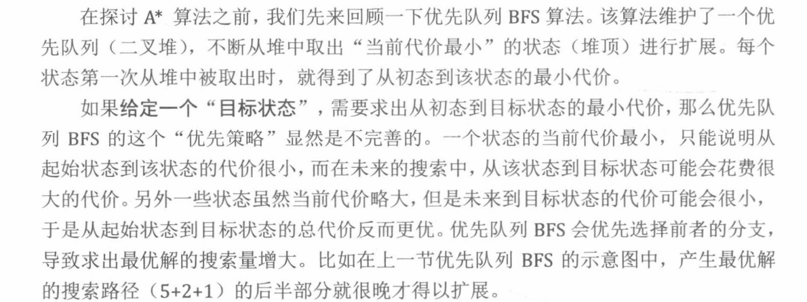
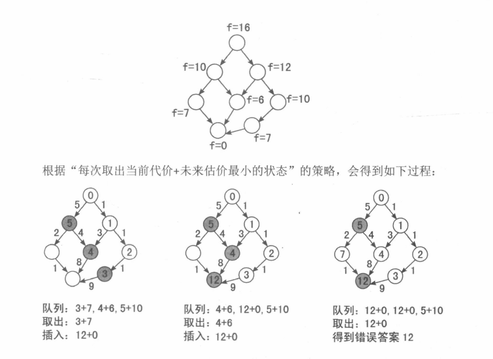
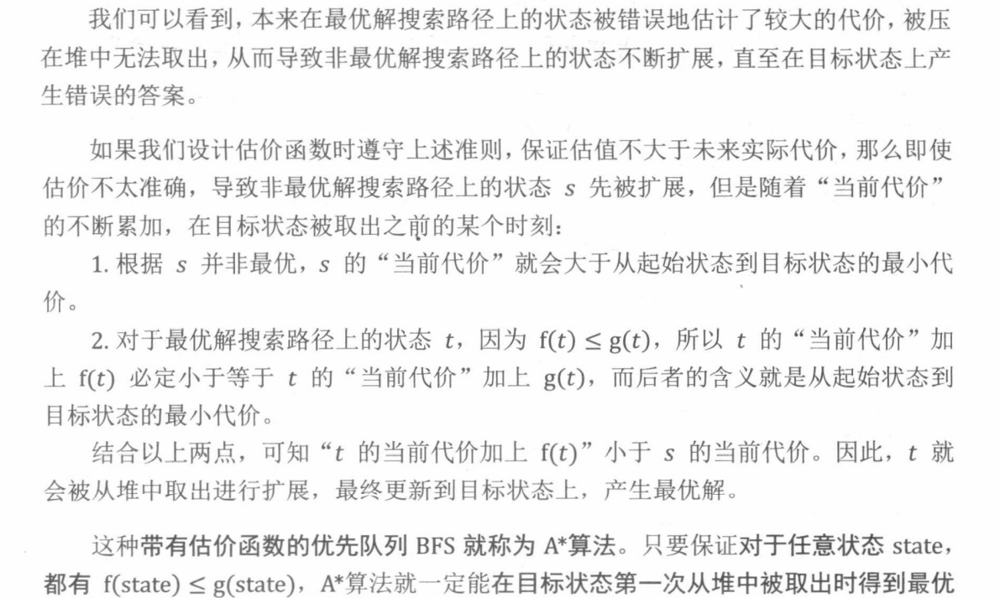
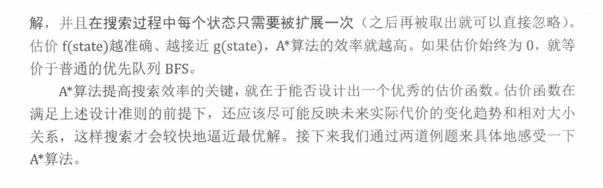
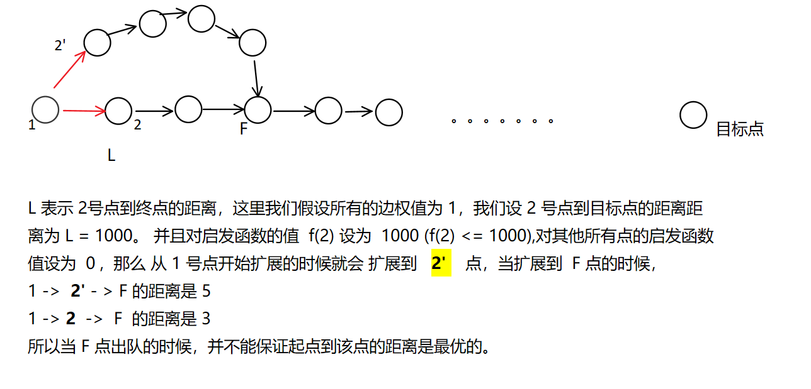

[TOC]

### A* 算法

**优先队列BFS**的缺陷




在最短路问题中，如果**所有边权值**都是**非负**的，并且这个问题有解。那么就可以 通过 **启发函数** 来优化 BFS

```
对比 Dijkstra 算法来说，Dijstra 算法是没有“启发函数”的加持，就与优化队列BFS有一样的局限性
而 A* 算法会 根据 “启发函数值” + 当前距离值 进行搜索。
```

该启发函数， 会以**任意 “状态”作为输入，计算从该状态到目标状态所需代价的估计值。**
在搜索中，仍然维护一个堆，不断从中取出 **“当前代价 + 未来估计（启发函数的值）”最小状态**进行扩展

#### **启发函数的基本准则**

​							—— 为保证第一次从堆中取出目标状态时达到最优解。

```
设当前状态 state 到目标状态所需代价的估计值为 f(state).
设在未来的搜索算法中，实际求出的从当前状态 state 到目标状态的最小代价为 g(state)

对于任意的 state ， 应该有  f(state) <=  g(state)
```

即：**启发函数的值（估价）不能大于未来实际代价**，估价比实际代价更优。

#### **这个基本准则为什么成立 ？**







**A* 算法只能保证 在终点出队之后，到终点的距离是最优的，并不能保证在中间某个状态下是最优的，并且每个点不是只被 扩展一次**。




#### 179：八数码

https://www.acwing.com/problem/content/181/

八数码问题有解的必要条件

```
1 3 6
4 2 8
7 5

写在一行的时候，  1 3 6 4 2 8 7 5   只要保证逆序对的数量为 偶数时，就一定有解。
逆序对数量为 奇数时，就一定无解。

```

A* 算法写法

```c++
#include<iostream>
#include<algorithm>
#include <queue>
#include<cstring>
#include<unordered_map>
#define x first
#define y second

using namespace std;

typedef pair<int,string> PIS; //  这里int是估计距离，string 是状态。

int f(string state) // 当前状态到达最终状态代价的 估计值
{
    int res = 0;
    for(int i = 0 ; i < state.size() ; i++)
    {
        if(state[i] != 'x')
        {
            int t = state[i] - '1';
            res += abs(i / 3 - t / 3) + abs(i % 3 - t % 3);
        }
    }
    return res;
}

string bfs(string start)
{
    //  注意偏移量和移动方向的对应
    int dx[4] = {-1, 0, 1, 0}, dy[4] = {0, 1, 0, -1};
    char op[4] = {'u', 'r', 'd', 'l'};

    string end = "12345678x";
    unordered_map<string, int> dist;
    // 用于记录当前方案从哪个状态转移过来，并且 这一步转移的操作是什么
    unordered_map<string, pair<char, string>> prev; 
    priority_queue<PIS, vector<PIS>, greater<PIS>> heap;
	
    heap.push({f(start) , start});//  初始状态入队。
    dist[start] = 0;

    while (heap.size())
    {
        auto t = heap.top();
        heap.pop();
		
        /*————————出队，比较，找 'x'————*/
        
        string state = t.y; //  取出当前状态
        if (state == end) break;

        int x, y;
        //   找 'x' 的位置 ,存在 (x,y) 中
        for (int i = 0; i < 9; i ++ )
            if (state[i] == 'x')
            {
                x = i / 3, y = i % 3; //  转化成 二维
                break;
            }
        
        /*——————————状态转换————————*/
        
        string source = state;//  存储原状态
        //  将 'x' 进行移动。
        for (int i = 0; i < 4; i ++ )
        {
            int a = x + dx[i], b = y + dy[i];
            if (a < 0 || a >= 3 || b < 0 || b >= 3) continue;
            
            state = source;
            //   交换 扩展到的位置。
            swap(state[x * 3 + y], state[a * 3 + b]);
            
            //  未被扩展 或者 扩展到的点的代价比之前小，那就扩展 它。 
            if (!dist.count(state) || dist[state] > dist[source] + 1)
            {
                dist[state] = dist[source] + 1;
                prev[state] = {op[i],source};
                heap.push({dist[state] + f(state), state});
            }
        }
    }
	
    /*————————倒推方案——————————*/
    
    string res;
    while (end != start)
    {
        res += prev[end].x;
        end = prev[end].y;
    }
    reverse(res.begin(), res.end());
    return res;
}
int main()
{
    string start , seq;
    char c;
    
    while(cin >> c)
    {
        start += c;
        if(c != 'x') seq += c;
    }
    
    int cnt = 0;
    for(int i = 0 ; i < 8;i++)
        for(int j = i ; j < 8;j++)
            if(seq[i] > seq[j])
                cnt ++;
                
    if(cnt % 2) puts("unsolvable");
    else cout << bfs(start)<<endl;
    
    return 0;
}

```

```c++
#include<iostream>
#include<vector>
#include<algorithm>
#include <queue>
#include<cstring>
#include<unordered_map>
#define x first
#define y second

using namespace std;

typedef pair<int, string> PIS;

int f(string state)
{
    int res = 0;
    for(int i = 0 ; i < state.size() ; i++)
    {
        if(state[i] != 'x')
        {
            int t = state[i] - '1';
            res += abs(i / 3 - t / 3) + abs(i % 3 - t % 3);
        }
    }
    return res;
}

string bfs(string start)
{
    int dx[4] = {-1, 0, 1, 0}, dy[4] = {0, 1, 0, -1};
    char op[4] = {'u', 'r', 'd', 'l'};

    string end = "12345678x";
    unordered_map<string, int> dist;
    unordered_map<string, pair<char, string>> prev;
    priority_queue<PIS, vector<PIS>, greater<PIS>> heap;

    heap.push({f(start) , start});
    dist[start] = 0;

    while (heap.size())
    {
        auto t = heap.top();
        heap.pop();

        string state = t.y;
        if (state == end) break;


        int x, y;
        //   找 'x' 的位置 ,存在 (x,y) 中
        for (int i = 0; i < 9; i ++ )
            if (state[i] == 'x')
            {
                x = i / 3, y = i % 3;
                break;
            }
        
        
        string source = state;//  存储原状态
        //  枚举方向
        for (int i = 0; i < 4; i ++ )
        {
            int a = x + dx[i], b = y + dy[i];
            if (a < 0 || a >= 3 || b < 0 || b >= 3) continue;
            
            state = source;
            swap(state[x * 3 + y], state[a * 3 + b]);
            if (!dist.count(state) || dist[state] > dist[source] + 1)
            {
                dist[state] = dist[source] + 1;
                prev[state] = {op[i],source};
                heap.push({dist[state] + f(state), state});
            }
        }
    }

    string res;
    while (end != start)
    {
        res += prev[end].x;
        end = prev[end].y;
    }
    reverse(res.begin(), res.end());
    return res;
}

int main()
{
    string start , seq;
    char c;
    
    while(cin >> c)
    {
        start += c;
        if(c != 'x') seq += c;
    }
    
    //  求解逆序对的数量
    int cnt = 0;
    for(int i = 0 ; i < 8;i++)
        for(int j = i ; j < 8;j++)
            if(seq[i] > seq[j])
                cnt ++;
                
             
    //  逆序对数量为 奇数的时候，直接判掉。
    if(cnt & 1) puts("unsolvable");
    else cout << bfs(start)<<endl;
    
    return 0;
}

```


#### 178：第k 短路

https://www.acwing.com/problem/content/description/180/

```c++
#include<iostream>
#include<algorithm>
#include<cstring>
#include<unordered_map>
#include<queue>
#define x first
#define y second
using namespace std;
typedef pair<int,int> PII;
typedef pair<int,PII> PIII;
const int N = 1010 , M = 200010;

int n , m , S , T, K;
int h[N], rh[N], e[M], ne[M], w[M], idx; //  正向邻接表，反向邻接表
int dist[N];  //  存放 每个点到终点的最短路，作为 启发函数的值。  
bool st[N];

void add(int h[],int a, int b,int c)
{
    e[idx] = b ,w[idx] = c,ne[idx] = h[a],h[a] = idx ++;
}

void dijkstra()   // 使用 dijkstra 处理 启发函数。
{
    priority_queue<PII,vector<PII>,greater<PII>> heap;
    heap.push({0, T}) //  加入终点
    
    memset(dist , 0x3f , sizeof dist);
    dist[T] = 0;
    
    while(heap.size())
    {
        auto t = heap.top();
        heap.pop();
        
        int ver = t.y;
        if(st[ver]) continue;
        st[ver] = true;
        
        //  因为求的是 每个点到终点的距离，使用 dijkstra 算法求终点到每个点的最短路
        //  所以使用 反向邻接表，并且 先把终点加进去了。
        for(int i = rh[ver] ; ~i ; i = ne[i])
        {
            int j = e[i];
            if(dist[j] > dist[ver] + w[i])
            {
                dist[j] = dist[ver] + w[i];
                heap.push({dist[j],j});
            }
        }
    }
}

int Astar()
{
    //  起点的启发函数值，真实值，节点编号
    priority_queue<PIII,vector<PIII>,greater<PIII>> heap;
    heap.push({dist[S] , {0 , S}});
    
    int cnt = 0;  //  表示终点出队 的次数
    while(heap.size())
    {
        auto t = heap.top();
        heap.pop();
        
        int ver = t.y.y , distance = t.y.x;
        if(ver == T) cnt ++;
        if(cnt == K) return distance; //  返回第 k 条最短路
        
        // 在这里 是要将所有的路径都进行扩展，所以不用判断，
        for(int i = h[ver] ; ~i ; i = ne[i])
        {
            int j = e[i];
            heap.push({distance + w[i] + dist[j] , {distance + w[i] ,j}});
            
        }
    }
    return -1;
}


int main()
{
    scanf("%d%d", &n, &m);
    memset(h, -1, sizeof h);
    memset(rh, -1, sizeof rh);
    
    while(m--)
    {
        int a , b, c;
        scanf("%d%d%d", &a, &b, &c);
        add(h , a, b ,c);
        add(rh, b, a, c);
    }
    
    scanf("%d%d%d",&S,&T,&K);
    if(S == T) K++;  //  至少包含一条边
    
    dijkstra();
    printf("%d\n",Astar());
    
    return 0;
}

```


