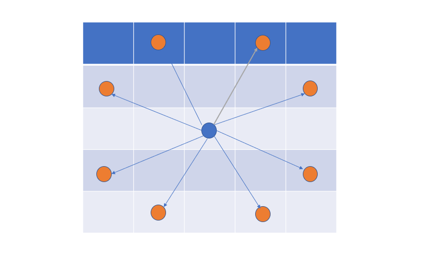

[TOC]

在 DFS 搜索当中，对于一些问题需要 确定搜索顺序，才可以不重不漏的搜到。

#### 1116：马走日

https://www.acwing.com/problem/content/1118/



```c++
#include<iostream>
#include<cstring>
using namespace std;

const int N = 10;
int n, m;
bool st[N][N];
int ans;

int dx[8] = {-2 , -1 , 1 , 2 ,  2 ,  1 , -1 , -2};
int dy[8] = { 1 ,  2 , 2 , 1 , -1 , -2 , -2 , -1};

void dfs(int x, int y,int num) // num  代表当前走了多少个点
{
    if(num == n * m)
    {
        ans ++;  //  记录搜索答案的数量
        return;
    }
    
    st[x][y] = true;
    
    for(int i = 0 ; i < 8 ; i++)
    {
        int a = x + dx[i] , b = y + dy[i];
        if(a < 0 || a >= n || b < 0 || b >= m) continue;
        if(st[a][b]) continue;
        
        dfs(a , b , num + 1);
    }
    
    st[x][y] = false;   //  恢复现场
}

int main()
{
    
    int T;
    scanf("%d", &T);
    
    while(T--)
    {
        int sx, sy;
        scanf("%d%d%d%d", &n, &m,&sx,&sy);
        
        memset(st, 0, sizeof st);
        ans = 0;
        dfs(sx , sy , 1);
        
        printf("%d\n",ans);
        
    }
    return 0;
}

```

#### 1117：单词接龙

https://www.acwing.com/problem/content/description/1119/

重点：

1. 重合部分的长度我们可以任意选择；
2. 每个单词我们最多使用两次，并非在”龙“中最多出现两次；

```
因为每个点最多搜索两次，所以树的最大深度 为单词数量的二倍： 40
```

```c++
#include<iostream>
#include<cstring>
using namespace std;

const int N = 21;
int n;
string word[N];
//  单词之间的关系，用图来存储,因为需要的'龙'尽可能地长，
//  所以存储两个单词之间 重叠长度地最小值（>0）
int g[N][N];  
int used[N];   //  记录每个单词使用的次数
int ans;

void dfs(string dragon , int last) // 龙 ，上一个单词的 编号
{
    ans = max((int)dragon.size() , ans); // 更新龙的最大长度
    
    used[last] ++;
    
    for(int i = 0 ; i < n ; i++)
        //某单词只有用的次数<=1的情况下可以再dfs去接龙一次
        // 上一个单词 last 和 当前 单词 i 有关系 g[last][i] != 0
        if(g[last][i] && used[i] < 2)
            dfs(dragon + word[i].substr(g[last][i]),i);
    
    used[last] --;  //  恢复现场
}

int main()
{
    cin >> n;
    for(int i = 0 ; i < n ; i++) cin >> word[i];
    
    char start;
    cin >> start;
    
    //  建立单词之间地关系
    for(int i = 0 ; i < n ; i++)
        for(int j = 0 ; j < n ; j++)
        {
            string a = word[i], b = word[j];
            // k 是不能小于 1，并且不能大于等于某个单词本身
            for(int k = 1 ; k < min(a.size(),b.size()) ; k ++)
                //  a 地后缀匹配 b 的前缀
                if(a.substr(a.size() - k , k) == b.substr(0,k))
                {
                    g[i][j] = k;
                    break;
                }
        }
    
    //  找到龙头，开始深搜
    for(int i = 0 ; i < n ; i++)
        if(word[i][0] == start)
            dfs(word[i] , i);
    
    
    cout << ans << endl;
    return 0;
}
```

#### 1118：分解互质组

https://www.acwing.com/problem/content/1120/

一般解法： 要考虑的问题：

一：对于当前的一个数来说，我们可以有两种选择：

1. 把这个加到最后一个组中
2. 新开一个组

如果这个数 在满足题目要求的同时，这两种情况均成立。

我们可以将这个数加到  **已经存在的组当中**，而避免新开一个组，这样就可以 决策树就可以少开一个分支，达到一个（小的）剪枝优化。

当我们新开一个组时，此时的最后一个组 就是这个 要加的数，并且在上一个组当中再不会添加任何元素，所以我们直接加到 之前的最后一组中。

二：考虑那些数放在当中组中：

这是这一个组合的过程，不需要顺序。所以按照组合的方式来搜索。

对于这类问题，我们可以按照某种 在搜索的时候比较好控制的顺序：eg: 按照下标顺序的方式。

即：可以在  DFS 参数中 加上一个 位置参数，表示当中搜到第几个数了。然后按照顺序将所以的加入这一组，判断是否满足要求。

```c++
#include<iostream>
#include<cstring>
#include<algorithm>
using namespace std;

const int N = 10;
int n;
int p[N];
int group[N][N];
bool st[N];
int ans = N;    //  最坏情况下 每个数是一组。

int gcd(int a,int b)
{
    return b ? gcd(b , a % b ) : a;
}
// 判断 g[]中的数和 p[x] 是否 互质,gc是 g[] 中数的个数
bool check(int g[], int gc , int x)  
{
    for(int j = 0 ; j < gc ; j++)
        if(gcd(p[g[j]] ,  p[x]) > 1)
            return false;
    return true;
}

// u:当前所在组的序号，gc:当前组内数的个数
// tc: 当前一共搜了多少个数, start ，第u组从 start下标开始搜
void dfs(int u, int gc, int tc,int start)
{
    if(u >= ans) return; //  组数 大于 数个个数
    if(tc == n) ans = u; //  所有数都被搜到了
    
    bool flag = true; //  标志但当前组内是否可以添加元素。
    for(int i = start ; i < n ; i++)
    {
        
        if(!st[i] && check(group[u], gc , i))
        {
            st[i] = true;
            group[u][gc] = i;
            dfs(u, gc + 1 , tc + 1, i + 1);
            st[i] = false;
            flag = false;
        }
    }
    if(flag) dfs(u + 1, 0, tc, 0);
}

int main()
{
    cin >> n;
    for(int i = 0 ; i < n ; i++) cin >> p[i];
    
    // 从第一组开始搜，当前组内 0 个数，
    //  当前一共搜了 0 个数，这一组从 0 号下标开始搜
    dfs(1 , 0 , 0 , 0);
    
    cout << ans << endl;
    return 0;
}
```

```c++
//  优化
#include <iostream>
#include <vector>
#include <algorithm>
using namespace std;

const int N = 15;
vector<int> g[N];
int nums[N];
int ans = N;
int n;

int gcd(int a, int b)
{
    return b ? gcd(b, a % b) : a;
}
bool check(vector<int>& vec, int x)
{
    for (int i = 0; i < vec.size(); i++)
        if (gcd(vec[i], x) > 1) return false;
    return true;
}

// u是当前处理到序列的下标，used是目前使用到的组数
void dfs(int u, int used)
{
    // 剪枝：如果当前使用的组已经>=目前获得的最优解，停止当前分支的搜索
    if (used + 1 >= ans) return;

    if (u >= n)
    {
        ans = min(ans, used + 1);
        return;
    }

    // 先在已经使用的组里面找，看看能不能插进去
    for (int i = 0; i <= used; i++)
    {
        if (check(g[i], nums[u]))
        {
            g[i].push_back(nums[u]);
            dfs(u + 1, used);
            g[i].pop_back();
        }
    }

    // 剪枝：因为n个数最多只放进n个组，所以只要总组数<=n，允许尝试放进新的组
    if (used + 1 <= n)
    {
        g[used + 1].push_back(nums[u]);
        dfs(u + 1, used + 1);
        g[used + 1].pop_back();
    }
}

int main()
{
    scanf("%d", &n);

    for (int i = 0; i < n; i++) scanf("%d", &nums[i]);

    // 初始处理nums[0], 初始放入g[0]
    dfs(0, 0);

    printf("%d\n", ans);

    return 0;
}
```


