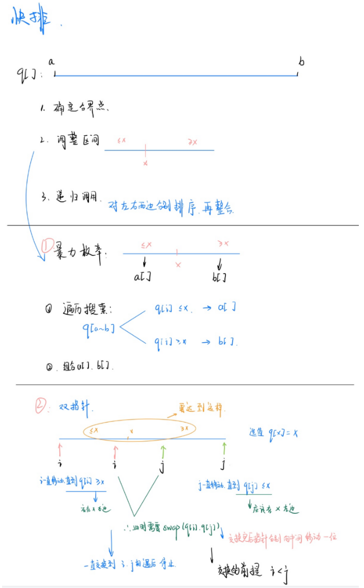
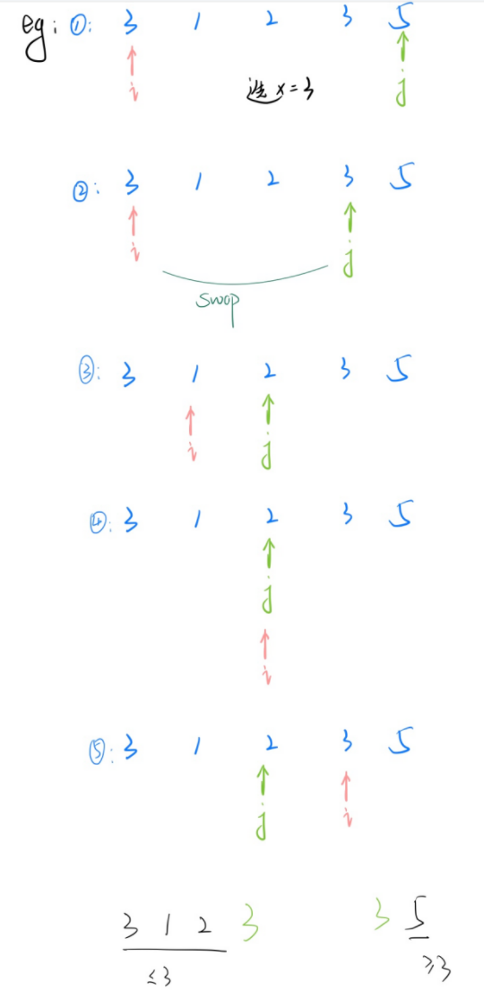
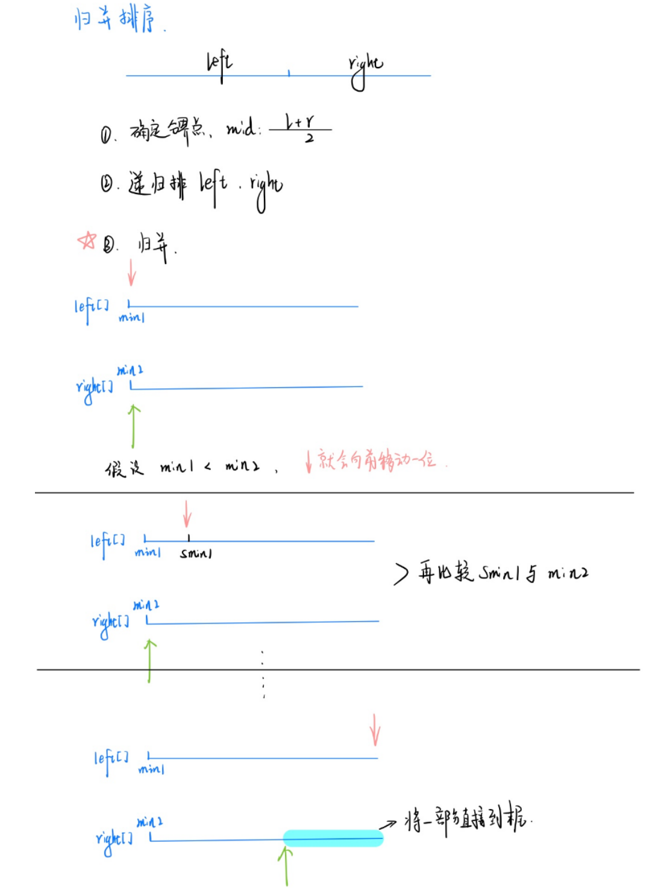

[TOC]


## 排序

1. 两种排序：快速排序和归并排序
2. 二分查找（整数，浮点数） 

### 1.1:快排





```c++
快排   ---->主要思想：分治
  
  1：确定分界点
			确定的分界点可以随机确定，但是后续使用双指针时一定要注意分界点的选取
  2：调整区间
  3：递归排序
  
void quick_sort(int q[], int l, int r)
{
    if (l >= r) return;
    int i = l - 1, j = r + 1, x = q[l + r >> 1];
    while (i < j)
    {
        do i ++ ; while (q[i] < x);
        do j -- ; while (q[j] > x);
        if (i < j) swap(q[i], q[j]);
    }
    quick_sort(q, l, j);
  	quick_sort(q, j + 1, r);
}


关于边界问题都是由于 x 的取值造成的:以下都是会出限边界问题。
比如，在递归的时候使用
  ①：	int x = l;   //  l 为左边界。
      quick_sort(q,l,i-1);
      quick_sort(q,i,r);
 上面以 i 作为边界时，并且选取 l 作为 x 的时候，
     
  ②：  int x = r;   // r 时左边界
				quick_sort(q,l,j);
				quick_sort(q,j+1,r);

  
```

```c++
// ACW 785
#include<iostream>
using namespace std;
const int N = 1e6 + 10;
int q[N];

void q_sort(int q[],int l,int r){
    if(l>=r) return;
    int x = q[l+r >> 1],i=l-1,j=r+1;
    while(i<j){
        do i++;while(q[i]<x);
        do j--;while(q[j]>x);
        if(i<j) swap(q[i],q[j]);
    }
    q_sort(q,l,j);
    q_sort(q,j+1,r);
    
}

int main(){
    int n;
    scanf("%d",&n);
    
    for(int i=0;i<n;i++) scanf("%d",&q[i]);
    
    q_sort(q,0,n-1);
    
    for(int i=0;i<n;i++) printf("%d ",q[i]);
    
    return 0;
    
}


#include <bits/stdc++.h>
using namespace std;
const int N=1000000+100;
int a[N],n,m,i,j;
int main()
{
    ios::sync_with_stdio(false);
    cin>>n;
    for(int i=1;i<=n;i++)
        cin>>a[i];
    sort(a+1,a+1+n);
    for(int i=1;i<=n;i++)
        cout<<a[i]<<" ";
    cout<<endl;
}
```

```java
import java.util.Scanner;
public class Main {
    static final int N = 100010;
    static int a[] = new int[N];
    public static void main(String[] args) {
        var scan = new Scanner(System.in);
        var n = scan.nextInt();
        for (int i = 0; i < n; i++) {
            a[i] = scan.nextInt();
        }
        q_sort(a, 0, n - 1);
        for(int i=0;i<n;i++){
            System.out.printf("%d ",a[i]);
        }
    }
    public static void q_sort(int a[], int l, int r) {
        if (l >= r) return;
        int i = l - 1, j = r + 1, x = a[l + r >> 1];
        while (i < j) {
            while (a[++i] < x) ;
            while (a[--j] > x) ;
            if (i < j) {
                int t = a[i];
                a[i] = a[j];
                a[j] = t;
            }
        }
        q_sort(a, l, j);
        q_sort(a, j + 1, r);
    }
}


注意 : 使用 增强 for 循环时，不能用于遍历动态数组
    eg:  
	final int N = 100010;
	int a = new int[N];
	int n = scan.nextInt();
	for(int i=0;i<n;i++){
        a[i] = scan.nextInt();
    }
    // 下面的这个循环会将我们的 a 全部遍历，这会导致与所要数据不符
	for(int it : a){
        System.out.printf("%d ",item);
    }
```


### 1.2 归并排序



```c++
void merge_sort(int q[], int l, int r)
{
    // 判断左右边界输入是否正确
    if (l >= r) return;
	// 1: 确定分界点， 归并排序是 (l+r)/2;
    int mid = l + r >> 1;
    // 2: 递归排左右
    merge_sort(q, l, mid);
    merge_sort(q, mid + 1, r);

    // 3: 归并
    int k = 0, i = l, j = mid + 1;
    
    while (i <= mid && j <= r) // 判断两个指针是否在都在界内
        if (q[i] <= q[j]) tmp[k ++ ] = q[i ++ ]; // 升序排列
        else tmp[k ++ ] = q[j ++ ];
	
    
    // 两个指针中有一个指针到达末尾了，就将另一个指针指向的数组的剩余直接接到末尾
    while (i <= mid) tmp[k ++ ] = q[i ++ ]; // 左半边没有循环完
    while (j <= r) tmp[k ++ ] = q[j ++ ];   // 右半边没有循环完

    // 将 tmp[] 的数转到 q[];
    for (i = l, j = 0; i <= r; i ++, j ++ ) q[i] = tmp[j];
}
```

### 2.1 整数二分

```c++
如何选择：
  	选择时，一定要根据所要查找的数的所在的范围来进行查找
  		看是选左半边还是右半边（并且保证区间中有答案）
  		
  
bool check(int x) {/* ... */} // 检查x是否满足某种性质

// 区间[l, r]被划分成[l, mid]和[mid + 1, r]时使用：
int bsearch_1(int l, int r)
{
    while (l < r)
    {
        int mid = l + r >> 1;
        if (check(mid)) r = mid;    // check()判断mid是否满足性质
        else l = mid + 1;
    }
    return l;
}
// 区间[l, r]被划分成[l, mid - 1]和[mid, r]时使用：
int bsearch_2(int l, int r)
{
    while (l < r)
    {
        int mid = l + r + 1 >> 1; 
        if (check(mid)) l = mid;
        else r = mid - 1;
    }
    return l;
}


//   int mid = l + r + 1 >> 1;  这里的 l+r后再加 1 的原因:
如果 l = r-1,那么 mid = (l+r)/2 = (l + l + 1)/2 = l;  //  因为 c++ 向下取整的语法
那么更新方式 l = mid 后，[mid,r] --> [l,r] 这不就是没有变吗，所以就会陷入死循环
```


```c++
// 数的范围 ACW 789:
#include<iostream>
using namespace std;
const int N = 100010;
int m,n,q[N];
int main(){
  	scanf("%d%d",&m,&n);
  	for(int i=0;i<n;i++) scanf("%d",&q[i]);
  	while(m--){
      	int x;
      	scanf("%d",&x);
      	int l = 0,r = n - 1;
      	while(l < r){
          	int mid = l + r >> 1;
          	if(q[mid] >= x) r = mid;
          	else l = mid + 1;
        }
      	if (q[l] != x) cout << "-1 -1"<<endl;
      	else{
          	cout<< l << ' '; //这里的话 l == r 所以都一样
          	while(l < r){
                int mid = l + r + 1 >> 1;
                if(q[mid] <= x) l = mid;
                else r = mid - 1;
            } 	
          	cout << l <<endl;
        }
    }
		return 0;
}
```


### 2.2 浮点数二分

```c++

bool check(double x) {/* ... */} // 检查x是否满足某种性质

double bsearch_3(double l, double r)
{
    const double eps = 1e-6;   // eps 表示精度，取决于题目对精度的要求
    while (r - l > eps)
    {
        double mid = (l + r) / 2;
        if (check(mid)) r = mid;
        else l = mid;
    }
    return l;
}

		// 第二种写法
		for(int i=0;i<100;i++)
    {
        double mid = (l + r) / 2;
        if (check(mid)) r = mid;
        else l = mid;
    }


// 一般精度要比 要求保留的值多2，就不会有太多问题，比如：4位 -> 1e-6 
```

```c++

#include<iostream>
using namespace std;

int main(){
  	double x;
  	cin >> x;
  	
  	double l =-10000,r = 10000;
  	while(l<r){
      	double mid = (l+r)/2;
        if(mid*mid >= x) r = mid;
  		else l=mid;
    
    }
  	printf("%f\n",l);
  	return 0;
}
```

