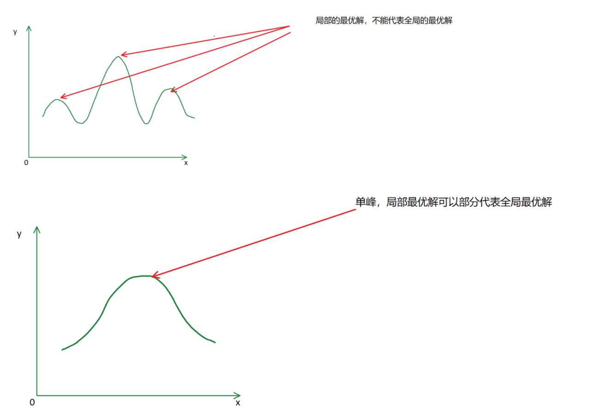
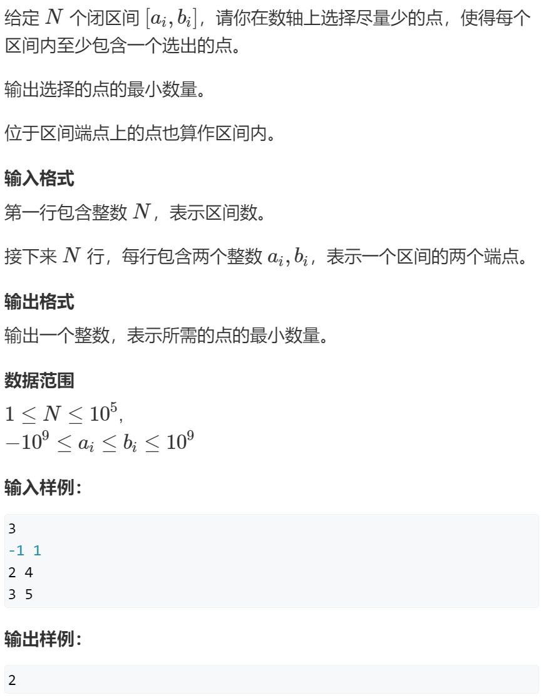

[TOC]

### 区间问题

```
1: 将每个空间的  右端点  按照 从小到大 的排序；
2: 依次枚举每个空间
    	如果当前区间中已经包含点，则直接 pass;
		否则，选择当前区间的右端点。             
                        
    贪心的想法就会每个阶段选择局部最优解，从而来获得最终的最优解，所以在贪心求解的问题当中，不能
是那种多个极值点函数变化的趋势问题。
```



```c++
对于不同的两个策略 Ans  ， cnt，对其进行比较时，我们会分成：
    // 在 Ans 个区间下，每个区间至少包含一个点，并且是再 少就不满足，所以 Ans 就是最优解
    Ans <= cnt;   
	
 	//当各个区间互不相交的时候，每个区间至少需要一个点，所有我们的区间数至少是 cnt
	Ans >= cnt

    //  所以 Ans = cnt
	Ans = cnt;    
```

[区间选点]:https://www.acwing.com/problem/content/description/907/



```c++
#include<iostream>
#include<algorithm>

using namespace std;
const int N = 100010;

int n;
struct Range{
    int l,r;
    bool operator<(const Range & R)  //  重载 小于号，排序是按照 右端点排
    {
        return r < R.r;
    }
}range[N];

int main(){
    scanf("%d",&n);
    
    for(int i = 0 ; i < n ; i++)
    {
        int l,r;
        scanf("%d%d",&l,&r);
        range[i] = {l,r};
    }
    
    sort(range , range + n);  //  排序
    
    int res = 0 , ed = -2e9;   //  初始
    for(int i = 0 ; i < n ; i++)
    {
        if(range[i].l > ed) //  每次当前区间的 左端点 大于 之前区间的  右端点。
        {
            res++;
            ed = range[i].r;
        }
    }
    printf("%d",res);
   
    return 0;
}

```

[最大不相交区间数量]:https://www.acwing.com/problem/content/910/

```
  与区间选点问题是一样的，也可以 按照区间的 左端点来排序。
  即排完序后的线段，在数组位置靠前线段左端点 < 数组位置靠后线段的 左端点。
  对于每个线段 i , 要找到一个 j 使得  Li > Rj  (上一个选的线段的位置 + 1 <= j < i)
```

```c++
#include<iostream>
#include<algorithm>
using namespace std;
const int N = 100010;
typedef pair<int, int> PII;

int n;
PII p[N];

int main()
{
    scanf("%d", &n);
    
    for (int i = 1; i <= n; i ++ ) 
        scanf("%d%d", &p[i].first, &p[i].second);
        
    sort(p + 1 , p + 1 + n);
    
    int ans = 1 , maxR = p[1].second;
    for (int i = 2; i <= n ; i ++ )
    {
        //  区间相交，舍弃 右区间
        if(p[i].first <= maxR) maxR = min(maxR , p[i].second);
        else ans ++, maxR = p[i].second;
    }
    printf("%d",ans);
    return 0;
}
```

[区间分组]:https://www.acwing.com/problem/content/908/

```
1：将所有的区间按照 左端点排序从小到大拍序。
2：从后往前处理每个区间
		判断能否将其放到某个区间现有的组中。 是否 L[i] > maxR
			①：能放进去，更新  maxR
			②：不能放进去，将该区间放到新组。


```

```c++
#include<iostream>
#include<algorithm>
#include<queue>

using namespace std;

const int N = 100010;
int n;

struct Range
{
    int l,r;
    bool operator<(const Range & R)
    {
        return l < R.l;
    }
    
}range[N];


int main()
{
    scanf("%d", &n);
    
    for (int i = 0; i < n; i ++ )
    {
        int l,r;
        scanf("%d%d", &l, &r);
        range[i] = {l,r};
    }
    
    sort(range , range + n);
    //使用小根堆来存储区间 ，使用小根堆方面我们寻找区间左端点的最小值
    //  即相对当前区间 最靠进它的那个区间
    priority_queue<int,vector<int>,greater<int>> heap;
    
    for(int i = 0 ; i < n ; i++)
    {
        auto r = range[i];
        //  分新租
        if(heap.empty() || heap.top() >= r.l) heap.push(r.r);
        else     // 加旧组
        {
            auto t = heap.top();
            heap.pop();
            heap.push(r.r);
        }
    }
    
    printf("%d\n",heap.size());
    
    return 0;
}
```

[区间覆盖]:https://www.acwing.com/problem/content/909/

```
     start ->  |____________|  <- end  需要覆盖的区间

1：将所有的区间按照 左端点 从小到达排序
  
2：从后往前依次枚举每个区间，在所有能覆盖 start 的区间当中，选择右端点最大 的区间。
		将 start 更新成右端点的最大值。

证明：   Ans <= cnt
     当我们每一次选择区间的时候，（无解除外）区间的左端点都排在end 的右边，
那么这样排出来的方案 cnt 一定 >= 最优的可行方案。
	 |_________|           |___________|
  |_____|                |_______|
      |___|                      |________|
        |_______|

证明：   Ans >= cnt
  对于任何一个 最优解都可以等价换为 算出来的一种， 所以  cnt = ans ，所以 ans >= cnt
  
  	
```

```c++
#include<iostream>
#include<algorithm>

using namespace std;

const int N = 100010;
int n;
 
struct Range
{
    int l,r;
    bool operator<(const Range & R)
    {
        return l < R.l;
    }
}range[N];

int main()
{
    int st ,ed;
    scanf("%d%d", &st, &ed);
    
    scanf("%d", &n);
    
    for (int i = 0; i < n; i ++ )
    {
        int l,r;
        scanf("%d%d", &l, &r);
        range[i] = {l,r};
    }
    
    sort(range , range + n);
    
    int res = 0;
    bool success = false;
    
    for (int i = 0; i < n; i ++ )
    {
        int j = i , r = -2e9;
        //  遍历所有 左端点 <= 前一区间右端点的，找到这些区间中右端点最大的区间
        while(j < n && range[j].l <= st)
        {
            r = max(r,range[j].r);
            j++;
        }
        
        if(r < st)  //  无解
        {
            res = -1;
            break;
        }
        
        res ++;
        if(r >= ed)  // 找到
        {
            success = true;
            break;
        }
        
        st = r;
        
        i = j - 1;
        
    }
    
    if(!success) res = -1;
    printf("%d\n",res);
    
    return 0;
}
```

### Huffman 树

```
经典的哈夫曼树问题：
	每次将权值最小的两个点合并一下。
	
 1：一定存在一组最优解，使得权值最小的两个点可以位于完全二叉树的最下面一层，且互为兄弟节点。
 2：n 个点的 Huffman树问题，在合并最小的两个点之后，可以转化为 n - 1 个点的 Huffman 问题。
   
 

```

[合并果子]:https://www.acwing.com/problem/content/150/


```
任何一种合并顺序，都可以转化为 一颗完全二叉树。
转化之后的代价就是所有的叶子节点上的权值乘以它到根节点的距离再相加。
   每次将权值最小的两个点合并一下。（ Huffman树问题）
```

```C++
#include<iostream>
#include<algorithm>
#include<queue>

using namespace std;

int main()
{
    int n;
    cin >> n;
    
    //  使用小根堆来存储，找最小值比较方便
    priority_queue<int,vector<int>,greater<int>> heap;
    
    for(int i = 0 ; i < n ; i++)
    {
        int w;
        scanf("%d",&w);
        heap.push(w);
    }
    
    
    int res = 0;
    while (heap.size() > 1)
    {
        //  去除最小树，相加再返回 x
        int x = heap.top() ; heap.pop();
        int y = heap.top() ; heap.pop();
        res += x + y;
        heap.push(x + y);
    
    }
    
    cout << res << endl;
  
    return 0;
}
```


