[TOC]


## 高精度，前缀和，差分，双指针 ，位运算，离散化，区间合并

### 高精度 (C++)

```
两个数的级数 为 10^6  ， 两个数运算的结果不超过 10^9。

模拟的思想。
```


```c++
大整数会被存到 数组 当中，会将 个位 存到 第 0 位；便于我们的计算。

    
    
   1：高精度加法
A + B;（模拟小数相加）
    
    A3 A2 A1 A0
  +    B2 B1 B0   t(进位)
  ————————————————
  	*  *  *   *
    
    
// C = A + B, A >= 0, B >= 0
vector<int> add(vector<int> &A, vector<int> &B)
{
    if (A.size() < B.size()) return add(B, A);
    vector<int> C;
    int t = 0;
    for (int i = 0; i < A.size(); i ++ )
    {
        t += A[i];
        if (i < B.size()) t += B[i];
        C.push_back(t % 10);
        t /= 10;
    }
    if (t) C.push_back(t);
    return C;
}


   2：高精度减法
// C = A - B, 满足A >= B, A >= 0, B >= 0
//  t 为借位  
//  Ai - Bi >= 0 时 , 正常减。     Ai - Bi - t
//  Ai - Bi < 0 时，向前面一位借位， Ai + 10 - Bi - t

//  A >= B 时 A - B,  A < B时， -(B - A)
vector<int> sub(vector<int> &A, vector<int> &B) 
{
    vector<int> C;
    for (int i = 0, t = 0; i < A.size(); i ++ )
    {
        t = A[i] - t;
        if (i < B.size()) t -= B[i];
        
        //  t >= 0  -->  t  ,  t < 0   --> t + 10
        C.push_back((t + 10) % 10); 
        if (t < 0) t = 1;
        else t = 0;
    }
    //  把 前面多余的 0 去掉。
    while (C.size() > 1 && C.back() == 0) C.pop_back();
    return C;
}


   3：高精度乘法
// C = A * b, A >= 0, b >= 0
vector<int> mul(vector<int> &A, int b)
{
    vector<int> C;

    int t = 0;
    for (int i = 0; i < A.size() || t; i ++ )
    {
        if (i < A.size()) t += A[i] * b;
        C.push_back(t % 10);
        t /= 10;
    }
    while (C.size() > 1 && C.back() == 0) C.pop_back();
    return C;
}


   4：高精度除以低精度
#include<algorithm>
// A / b = C ... r, A >= 0, b > 0
vector<int> div(vector<int> &A, int b, int &r)
{
    vector<int> C;
    r = 0;
    for (int i = A.size() - 1; i >= 0; i -- )
    {
        r = r * 10 + A[i];
        C.push_back(r / b);
        r %= b;
    }
    reverse(C.begin(), C.end());
    while (C.size() > 1 && C.back() == 0) C.pop_back();
    return C;
}
```

#### 791：高精度加法

```C++
//  acwing 791
#include<iostream>
#include<vector>
using namespace std;

vector<int> add(vector<int> &A,vector<int> &B)  // 这里使用引用是为了提高效率
{
  	vector<int> c;
    
  	int t = 0; // 表示 A[i] + B[i] 的和
  	for(int i=0;i < A.size() || i < B.size();i++){
      	if(i < A.size())  t += A[i];
      	if(i < B.size())  t += B[i];
      	c.push_back( t % 10); //  处理 A[i] + B[i] 进位后的结果
      	t /= 10; //  进位
    }
    //  当最高位还有进位时，位数再加一
  	if(t) c.push_back(1);
  	return c;
}

int main(){
  	string a,b;
 	vector<int> A,B;
  	
  	cin >> a >> b;
  	for(int i = a.size() - 1; i >= 0;i--) A.push_back(a[i] - '0');
    for(int i = b.size() - 1 ;i >= 0;i--) B.push_back(b[i] - '0');
  
  	auto C = add(A,B);   //  自动推断类型
  	// 等价于： vector<int> C = add(A,B);
    for(int i = C.size() - 1 ; i >= 0 ; i--) cout << C[i];
    
  
  	return 0;
  
}
```

#### 792：高精度减法

```c++
#include <iostream>
#include <cstring>
#include <algorithm>

using namespace std;

//  判断是否有 A >= B
bool cmp(vector<int> &A,vector<int> &B)
{
    if(A.size() != B.size()) return A.size() > B.size();
    
    for(int i = A.size() - 1 ; i >= 0 ; i--)
    {
        if(A[i] != B[i])
            return A[i] > B[i];
    }
    return true;
}


vector<int> sub(vector<int> &A , vector<int> &B)
{
    vector<int> c;
    for(int i = 0 , t = 0; i < A.size(); i++)
    {
        t = A[i] - t;
        if(i < B.size()) t -= B[i];
        c.push_back((t + 10) % 10);
        
        if( t < 0 ) t = 1;
        else t = 0;
    }
    while(c.size() > 1 && c.back() == 0) c.pop_back();
    return c;
}


int main()
{
    string a;
    string b;
    
    cin >> a >> b;
    
    vector<int> A,B;
    
    for (int i = a.size() -1 ; i >= 0; i -- ) A.push_back(a[i] - '0');
    for (int i = b.size() -1 ; i >= 0; i -- ) B.push_back(b[i] - '0');
    
    if(cmp(A,B))
    {
        auto C = sub(A,B);
        for (int i = C.size() -1 ; i >= 0; i -- ) cout << C[i];
        
    }
    else {
        
        auto C = sub(B,A);
        printf("-");
        for (int i = C.size() -1 ; i >= 0; i -- ) cout << C[i];
    }
    
    return 0;
}
```

#### 793：高精度乘法

```c++

```

#### 794：高精度除法

```c++

```


### 前缀和 

```c++
1：一维前缀和
S[i] = a[1] + a[2] + ... a[i]
    
创建前缀和数组的每个元素：s[i] = s[i-1] + a[i];    
    
a[l] + ... + a[r] = S[r] - S[l - 1] // 前缀和

    
2：二维前缀和
    
创建前缀和数组的每个元素：
    s[i][j] = s[i - 1][j] + s[i][j - 1] -s[i - 1][j - 1] + a[i][j]
    
    
S[i, j] = 第i行j列格子左上部分所有元素的和
以(x1, y1)为左上角，(x2, y2)为右下角的子矩阵的和为：
S[x2, y2] - S[x1 - 1, y2] - S[x2, y1 - 1] + S[x1 - 1, y1 - 1]
    
```

#### 795 ：前缀和

```c++
一维数组的前缀和。
#include<iostream>
using namespace std;

const int N = 100010;

int q[N];
int s[N];

int n,m;

int main(){
    cin >> n >>m;
    //  避免 l-1 出界，下标从 1 开始
    for(int i=1;i<=n;i++) cin>>q[i];
    
    // 前缀和数组
    for(int i=1;i<=n;i++) s[i] = s[i-1] + q[i];
    
    while(m--){
        int l,r;
        cin >> l >> r;
        //  a[r] ~ a[l] 之和
        printf("%d\n",s[r] - s[l-1]);
    }
    return 0;
}
```

#### 796. 子矩阵的和

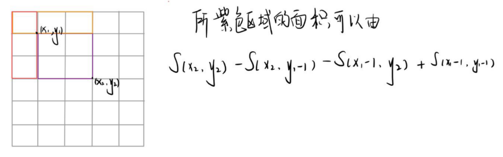

```c++
#include<iostraem>
using namespace;
const int N = 1010;
int n,m,q;
int a[N][N],s[N][N];

int main(){
    cin >> n >> m >> q;
    for(int i = 1;i <= n;i++)                
        for(int j = 1;j <= m;j++)
            	scanf("%d",&a[i][j]);
    
    for(int i = 1;i <= n;i++)
        for(int j = 1;j <= m;j++)
            s[i][j] = s[i-1][j] + s[i][j-1] -s[i-1][j-1] + a[i][j];// 求前缀和数组
    
    while(q--){
        int x1,y1,x2,y2;
        scanf("%d%d%d%d",&x1,&y1,&x2,&y2);
        //求部分和 (子矩阵的和)
        printf("%d\n",s[x2][y2] - s[x1-1][y2] -s[x2][y1-1] +s[x1-1][y1-1]);
        
    }
        
    return 0;
}

```

### 差分

```
差分：前缀和的逆运算

1：一维差分    
给区间[l, r]中的每个数加上c： B[l] += c, B[r + 1] -= c
  eg:  给定 a[1] , a[2] ...  a[n]
       构造 差分数组 b[N] ,使得 a[i] = b[1] + b[2] + ... +b[i]
        (即： a数组是 b数组的前缀和 ， 反过来 b 是 a 的差分)

        
    核心操作：将 a[l ~ r] 全部加上 c ,等价于： b[l] += c,b[r+1] -= c
 从而将 o(n) 的操作转为 o(1)   
    
    
2：二维差分
给以(x1, y1)为左上角，(x2, y2)为右下角的子矩阵中的所有元素加上c：
S[x1, y1] += c, S[x2 + 1, y1] -= c, S[x1, y2 + 1] -= c, S[x2 + 1, y2 + 1] += c 
```


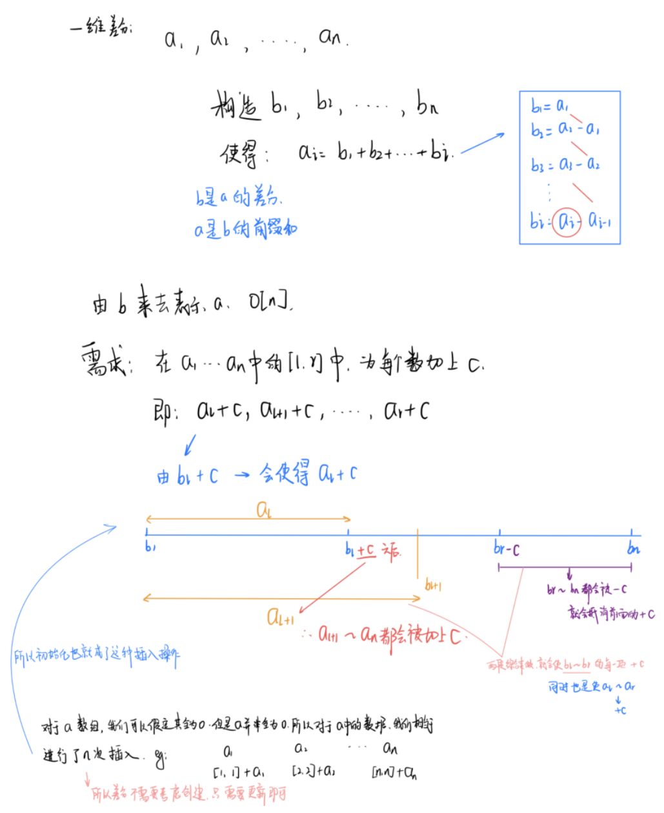

```
对b数组的b[i]的修改，会影响到a数组中从a[i]及往后的每一个数。

首先让差分b数组中的 b[l] + c ,a数组变成 a[l] + c ,a[l+1] + c,,,,,, a[n] + c;

然后我们打个补丁，b[r+1] - c, a数组变成 a[r+1] - c,a[r+2] - c,,,,,,,a[n] - c;
```


```
b[l] + c，效果使得a数组中 a[l]及以后的数都加上了c(红色部分)，但我们只要求l到r区间加上c, 
因此还需要执行 b[r+1] - c,让a数组中a[r+1]及往后的区间再减去c(绿色部分)，
这样对于a[r] 以后区间的数相当于没有发生改变。
                                                                             
因此我们得出一维差分结论：给a数组中的[ l, r]区间中的每一个数都加上c, 
只需对差分数组b做 b[l] + = c, b[r+1] - = c。时间复杂度为O(1), 大大提高了效率。
```


#### 797：差分

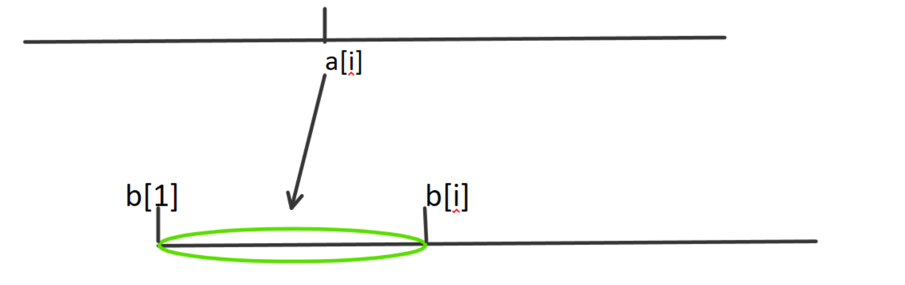

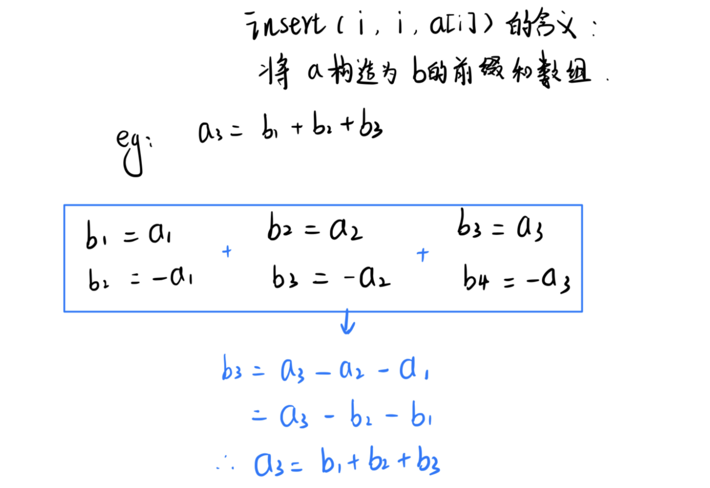

```c++
#include<iostream>
using namespace std;
const int N = 100010;
int a[N];
int b[N];
int n ,m;
 
void insert(int l,int r,int c)
{
    b[l] +=c;
    b[r+1] -= c;
}

int main(){
	cin >> n >> m;
    
    for(int i = 1 ; i <= n ; i++){
        cin >> a[i];
    	insert(i,i,a[i]);   // 将 a[N] 构造为 b[N] 的前缀和数组
    }
    
    while(m--)
    {
        int l ,r ,c;
        cin >> l >> r >> c;
        insert(l,r,c);
    }
    
    for(int i = 1 ; i <= n ; i++){
        a[i] = a[i-1] + b[i];
    	printf("%d ",a[i]);
    }
    
    return 0;
}


```

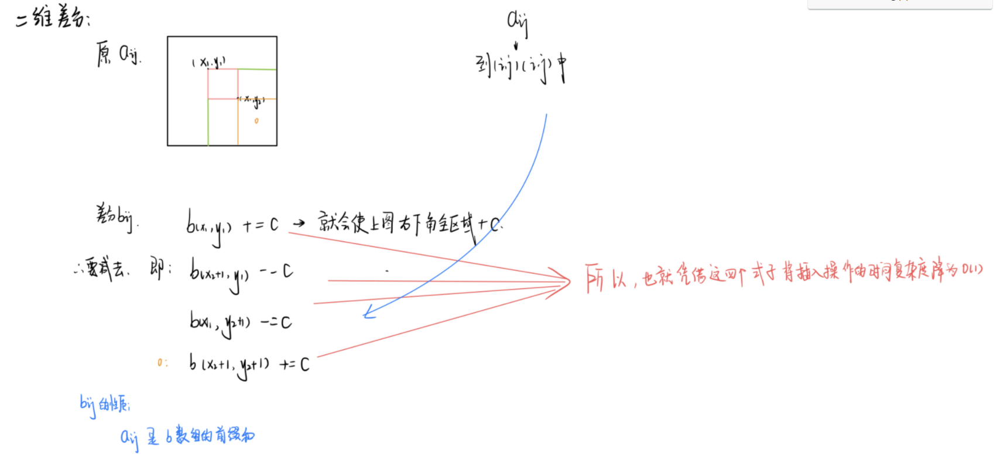

#### 798：差分矩阵

```
同样类比一维差分；
差分矩阵也是 构造数组，使得它是二维原数组的矩阵前缀和。
	给定原矩阵 a[i][j] ,构造差分矩阵 b[i][j], 使得 a[i][j] 是 b[i][j] 的二维前缀和；
差分的核心操作：
	给 (x1,y1) 为左上角， (x2,y2)为右下角的子矩阵中的所有数 a[i][j],加上 c;
对于差分数组的影响：
				b[x1][y1] += c;
				b[x1][y2 + 1] -= c;
				b[x2 + 1][y1] -= c;
				b[x2 + 1][y2 + 1] += c;


```

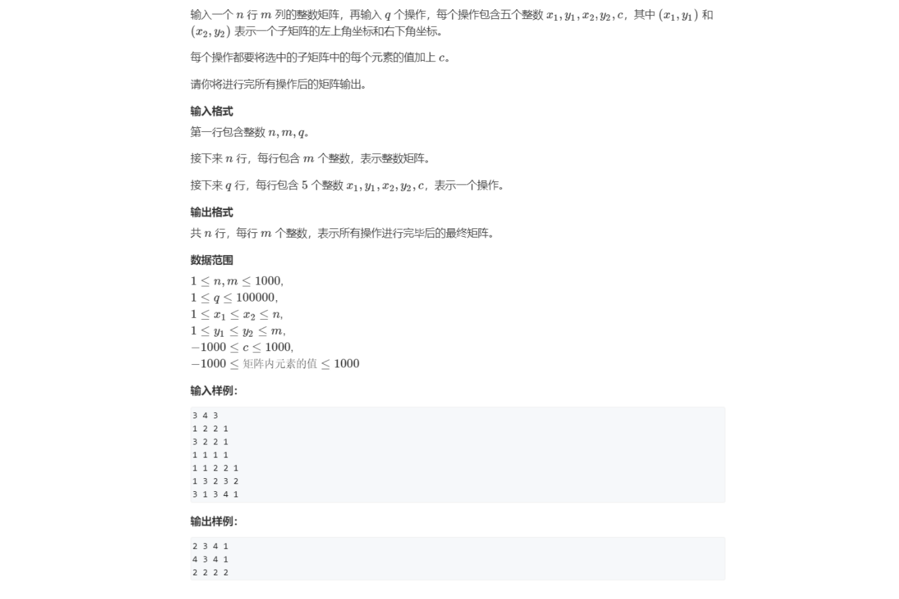

```c++
#include<iostream>
using namespace std;
const int N = 1010;

int n, m ,q;
int a[N][N], b[N][N];

//  差分的核心操作
void insert(int x1,int y1,int x2,int y2,int c){
    b[x1][y1] += c;
    b[x1][y2 + 1] -= c;
    b[x2 + 1][y1] -= c;
    b[x2 + 1][y2 + 1] += c;
}


int main()
{
    scanf("%d%d%d", &n,&m,&q);
    
    for (int i = 1; i <= n; i ++ )
        for (int j = 1; j <= m; j ++ )
            scanf("%d",&a[i][j]);
            
    //  将 a[i][j] 数组构造为 b[i][j]  前缀和数组      
    for (int i = 1; i <= n; i ++ )
        for (int j = 1; j <= m; j ++ )
            insert(i,j,i,j,a[i][j]);
    
    //  对 b[N][N] 的数组进行改变
    while(q--)
    {
        int x1,y1,x2,y2,c;
        scanf("%d%d%d%d%d",&x1,&y1,&x2,&y2,&c);
        insert(x1,y1,x2,y2,c);
        
    }
    
    //  对 a[N][N] 数组进行改变
    for (int i = 1; i <= n; i ++ )
        for (int j = 1; j <= m; j ++ )
            a[i][j] = a[i-1][j] + a[i][j-1] -a[i-1][j-1] + b[i][j];
            
    
    for (int i = 1; i <= n; i ++ ){
        for (int j = 1; j <= m; j ++ ) printf("%d ", a[i][j]);
        puts("");  
    }
          
    
    return 0;
}
```


### 位运算

```c++
//   1：求 n 的二进制的第k位数字:  
		n >> k & 1
    
	// 返回 n 的二进制表示
    int n = 10;
    for(int k = 31 ; k >= 0; k--) cout << (n >> k & 1);    
    
    
//   2：返回 n的二进制 的最后一位 1 及其以后的所有 0
       lowbit(n)   等价于   n & -n   
  即返回最后一个 1 及以后的 0 表示的数；   --->  树状数组的基本操作。
    
c++ 中 -n (二进制) 就是 n 的补码：即 ~n + 1    

       n:  1 0 1 0 0 0 0     
      ~n:  0 1 0 1 1 1 1
    ~n+1:  0 1 1 0 0 0 0      
n&(~n+1):  0 0 1 0 0 0 0 
        
                
        
//   应用： 统计 n 中 1 个数；
   
#include<iostream>
using namespace std;

int lowbit(int x){
    return x & -x;
}

int main()
{
    int x;
    cin >> x;
    while(x--){
        int n;
        cin >> n;
        int res = 0;
        while(n) n -= lowbit(n),res++; // 每次减去 x 的最后一位 1 
        cout << res << ' ';
    }
    return 0;
}

// 求一个数的 补码
    int n = 10;
    unsigned int x = -n;
    for(int i = 31 ; i >= 0 ; i--) cout << (x >> i & 1);

补码的来由：	 x + (-x) = 0;
			-x = 0 - x;
		 	就是 32 位的 0 减去 x 但是 0 减不过就会向前借 1；
            就相当于 1000...00 - x 等价于  ~x + 1
```

### 双指针

```c++
for (int i = 0, j = 0; i < n; i ++ )
{
    while (j < i && check(i, j)) j ++ ;
    // 具体问题的逻辑
}
常见问题分类：
    (1) 对于一个序列，用两个指针维护一段区间
    (2) 对于两个序列，维护某种次序，比如归并排序中合并两个有序序列的操作

双指针算法的核心就是 优化其他问题：
    	for(int i = 0 ; i < n ; i++)
           	for(int j = 0; j < n ; j++)
				o(n^2)
      将 o(n^2)  --->  o(n);

```

```c++
// 双指针算法的一个应用：	
// 求一个字符串中的单独单词  eg:  abc  def  gh

#include<iostream>
#include<cstring>
using namespace std;

int main(){
    char str[100];
    cin.getline(str,100);
    
    int n = strlen(str);
    
    for(int i = 0 ; i < n ; i++ ){
        int j = i
        while(j < n && str[j] != ' ') j++;
        
        for(int k = i ; k < j ; k++) cout << str[k];
        cout << endl;
        i = j;
    }
   
    return 0;
}
```

#### 799： 最长连续不重复子序列

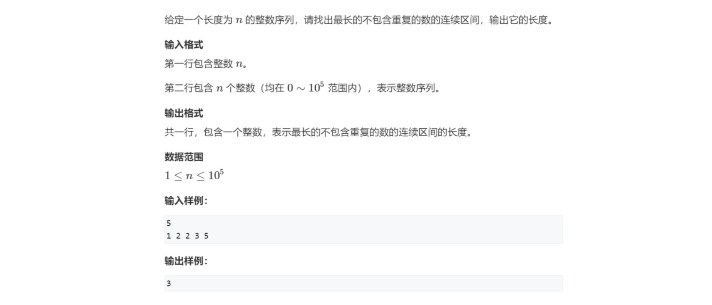

```c++
//  acw 799
// 朴素做法  o(n^2)
for(int i = 0 ; i < n  ; i++){   //  终点
    for(int j = 0 ; j <= i ; j++){  // 起点
        if(check(i,j)){
            res = max(res,i - j +1);  //  返回长度
        }
    }
}

// 双指针优化  o(n)
for(int i = 0,j = 0; i < n ; i++){
    while(j <= i && check(i,j)) j++;
    res = max(res,i - j + 1); 
}

eg:  1 2 2 3 5
     
	 i=0 	        i=1  	      i=2		  i=2            i=3           i=4
     1 2 2 3 5    1 2 2 3 5   1 2 2 3 5   1 2 2 3 5    1 2 2 3 5   1 2 2 3 5
     j=0		  j=0		    j=1		      j=2          j=2         j=2   
    
  s[1]=1         s[2]=1       s[2] = 2    s[2] = 1     s[3] = 1      s[5]=1
    							j+1		   j+1			
        

    
#include<iostream>
using namespace std;

const int N = 100010;
int n ;
int a[N];
int s[N];  //  使用数组 记录当前区间中 每个数出现的次数

int main()
{
    cin >> n;
    for(int i = 0 ; i < n ; i++) cin >> a[i];
    
    int res = 0;
    for(int i = 0 ,j = 0; i < n ; i++){
        
        s[a[i]]++;  // [j,i] 区间中加入了一个新的数
        while(s[a[i]] > 1) {  // 有重复的数
            s[a[j]]--;  // [j,i] 区间中删掉了一个原来的数,一直删到在 i 和 j指向同一个数时
            j++;
        }
        res = max(res, i - j + 1);
    }
    
    cout << res << endl;
    
    return 0;
    
}

```

#### 800：数组元素的目标和

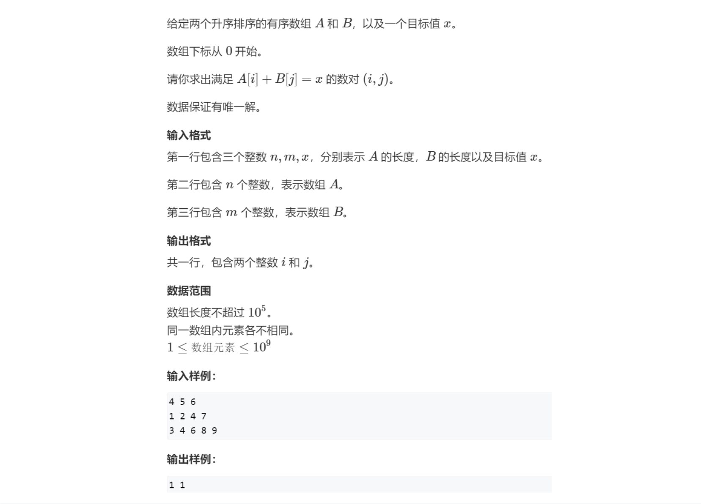

```c++
// 暴力枚举 o(n * m)
for(int i = 0 ; i < n ; i++)
    for(int j = 0 ; j < m ; j++)
        if(a[i] + b[j] == x)
        {
            cout << i <<  " " << j << endl;
			break;
        }
            

// 双指针优化 o(n + m)
#include<iostream>
using namespace std;
const  int N = 100010;
int n ,m, x;
int a[N], int b[N];

int main(){
    cin >> n >> m >> x;
    for(int i = 0 ; i < n ; i++) cin >> a[i];
    for(int i = 0 ; i < m ; i++) cin >> b[i];
    
    for(int i = 0  ,j = m - 1 ; i < n ; i++)
    {
        while( j >= 0 && a[i] + b[j] > x) j--;
        if(a[i] + b[j] == x){
            printf("%d %d\n", i ,j);
            break;
        }
    }
    
    retrun 0;
}
```

#### 2816：判断子序列

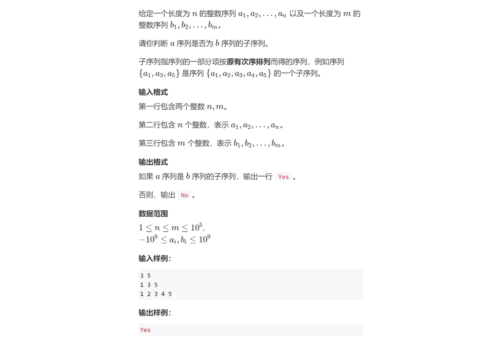

```c++
#include<iostream>
using namespace std;
const int N = 100010;
int n, m;
int a[N], b[N];
int main(){
    scanf("%d%d",&n,&m);
    for(int i = 0 ; i < n ; i++) scanf("%d",&a[i]);
    for(int i = 0 ; i < m ; i++) scanf("%d",&b[i]);
    
    int i = 0,j = 0;
    while(i < n && j < m)
    {
        if(a[i] == b[j]) i++;
        j++;
    }
    if(i == n) puts("Yes");
    else puts("No");
    

    return 0;
}

```


### 离散化

```c++
离散化：
    有一个数组：其中每个数的值域是  (0 , 10^9); 个数为 10^5
    对其存储的一个优化问题。
  eg:  a[]  中有    1  4  100   20000   50000;
	将其中的数映射为  0  1   2      3       4；
        
 离散化会遇到的问题：
     1：去重：     a[] 中可能会有重复元素。所以需要我们的去重。
        a.sort(a.begin(),a.end());
        a.erase(unique(a.begin(),a.end()),a.end());
      说明：
	   unique() 会将数组中的重复元素全部移到到数组的最后面，并且返回重复元素部分的 begin()
     	在使用 erase 擦除

     2：映射值：   如何算出 a[i] 离散化后的值。     ----->  二分 (有序的离散化)
        由于是保序的离散化，所以 元素之间映射之前后的相对大小不变。
      // 找到第一个  >= x 的位置 + 1 
	  int find(int x)
      {
			int l = 0, r = a.rise() - 1l;
            while(l < r)
            {
                int mid = l + r >> 1;
                if(a[mid] >= x) r = mid;
                else l = mid + 1;
            }
          	return r + 1; // 映射到1, 2, ...n，不加 1 的话就是 0 ，1 2 3 
      }
```

```c++
保序的离散化：

vector<int> alls; // 存储所有待离散化的值
sort(alls.begin(), alls.end()); // 将所有值排序
alls.erase(unique(alls.begin(), alls.end()), alls.end());   // 去掉重复元素

// 二分求出x对应的离散化的值
int find(int x) // 找到第一个大于等于x的位置
{
    int l = 0, r = alls.size() - 1;
    while (l < r)
    {
        int mid = l + r >> 1;
        if (alls[mid] >= x) r = mid;
        else l = mid + 1;
    }
    return r + 1; // 映射到1, 2, ...n，不加 1 的话就是 0 ，1 2 3 
}
```

#### 802：区间和

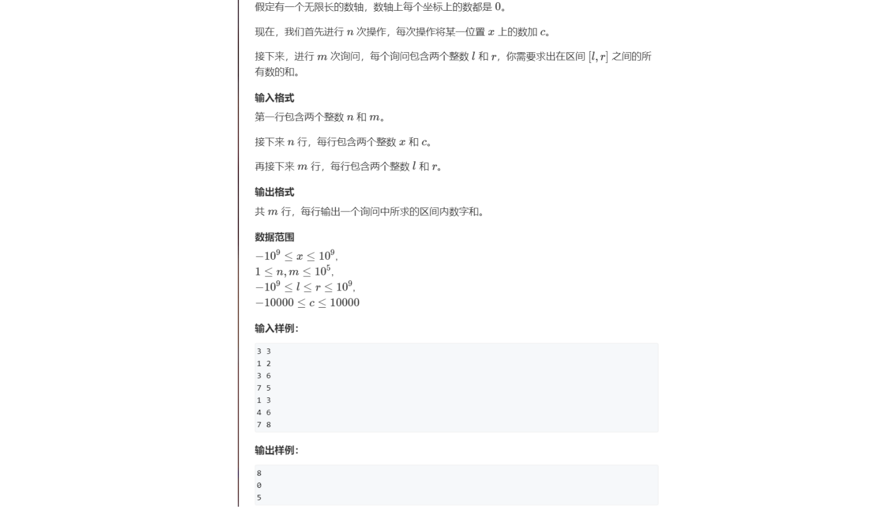

```c++
#include<iostream>
#include<vector>
#include<algorithm>
using namespace std;

//用来存储我们两种访问的输入的数，并且我们的对于两种输入还有要对其使用的操作，所以我们就得储存起来
typedef pair<int,int> PII;

const int N = 300010;

vector<int> alls;// 储存离散化后的数

int a[N],s[N];// a[N] 中存储离散化之后的值，s[N] 是前缀和
int n,m;

vector<PII> add,query;// 要进行的两种操作

int find(int x){
    int l=0,r=alls.size()-1;
    while(l<r){
        int mid = (l+r) >>1;
        if(alls[mid] >= x) r = mid;
        else l = mid+1;
    }
    return r+1;// 映射到从 1 开始的数值
}

int main(){
    scanf("%d%d",&n,&m);
    for(int i=0;i<n;i++){
        int x,c;
        cin >> x >>c;
        add.push_back({x,c}); // 将 x 位置和 要加的数 c 存储起来
        alls.push_back(x);   // 将被离散化的数 x 存起来
    }
    for(int i=0;i<m;i++){
        int l,r;
        cin >> l >> r;
        query.push_back({l,r}); // 将区间 l ~ r 的两端存储起来，以便后面求和
        
 // 因为我们的求取的区间和是在离散化后的数组当中，所以我们也需要把我们的区间端点也要加入我们的要离散化的数当中，并且后面使用 find() 去离散化到 a[] 的一个数，从而求取 a[l] ~ a[r]  之间的和
        alls.push_back(l);
        alls.push_back(r);
    }
    
    // 有序的离散化，排序 + 去重,后面会使用到 alls.size()
    sort(alls.begin(),alls.end());
    alls.erase(unique(alls.begin(),alls.end()),alls.end());
    
    // 第一种操作，为 x (add.first) + c(add.second)
    for(auto item : add){
        int x = find(item.first);
        a[x] += item.second;
    }
    //预处理前缀和
    for(int i=1;i<=alls.size();i++) s[i] = s[i-1] + a[i];
    
    // 处理询问
    for(auto item : query){
        int l = find(item.first);
        int r = find(item.second);
        cout << s[r] - s[l-1]<<endl; 
    }
    return 0;
    
}
```


### 区间合并

```
将 有交集的区间进行合并。
	1：两个区间中有只有 端点是交集的时候，我们认定区间也可以合并。
            |______|
                   |______|
合并后       |_____________|
	2:  一般的区间合并。
            |_____|           |________|
                |_____|       |____|
合并后       |_________|       |________|

思路：类似于 贪心
	1：将所有分散区间 先按照 区间的左端点排序。
	2：扫描整个区间，对有交集的进行合并。
	       st --> |_______| <--ed
	   [st,ed] 是我们当前维护的区间。
	  考虑第 i 个区间于当前维护区间的关系：
	          st --> |_______________| <--ed    当前维护的区间
	         
             第 i 个区间的情况：
	  	①：               |______|
	  	
		②：            |__________________| <--ed (new)
		
		③：                  (new)st --> |________|  <--ed (new)
		
		
	①：维护的区间完全包含第 i 个区间。  维护区间不变
    ②：维护的区间与第 i 个区间的并区间大于 当前维护的区间。  维护区间扩展。
    ③：维护的区间 与 第 i 个区间交集为 空。  维护区间更新为 第 i 个区间。
		
```

```c++
// 将所有存在交集的区间合并
void merge(vector<PII> &segs)
{
    vector<PII> res;

    sort(segs.begin(), segs.end());

    int st = -2e9, ed = -2e9;
    for (auto seg : segs)
        if (ed < seg.first)
        {
            if (st != -2e9) res.push_back({st, ed});
            st = seg.first, ed = seg.second;
        }
        else ed = max(ed, seg.second);

    if (st != -2e9) res.push_back({st, ed});

    segs = res;
}

```

#### 803：区间和并

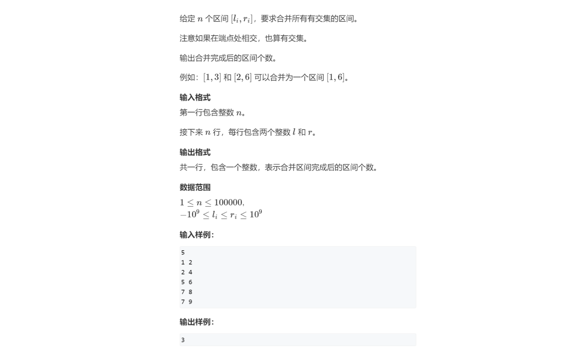

```c++
#include<iostream>
#include<algorithm>
#include<vector>
using namespace std;
typedef pair<int,int> PII;


const int N = 100010;

vector<PII> s;
int  n;

void merge(vector<PII> &s)
{
    vector<PII> res;
    
    //  pair 排序时 优先排 first 的
    sort(s.begin(),s.end());

    int st = -2e9 , ed = -2e9;
    
    for(auto i : s)
    {
        if(ed < i.first)
        {
            if(ed != -2e9) res.push_back({st,ed});
            st = i.first, ed = i.second;
        }
        else ed = max(ed,i.second);
    }
    if(st != -2e9) res.push_back({st,ed});
    s = res;
}


int main()
{
    cin >> n;
    for(int i = 0 ; i < n ; i++)
    {
        int l,r;
        cin >> l >> r;
        s.push_back({l,r});
    }
    
    merge(s);
    
    cout << s.size() << endl;
    
    
    return 0;
}

```

