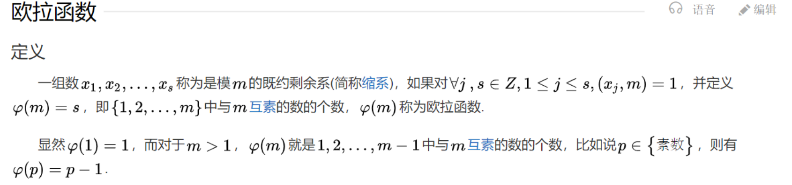
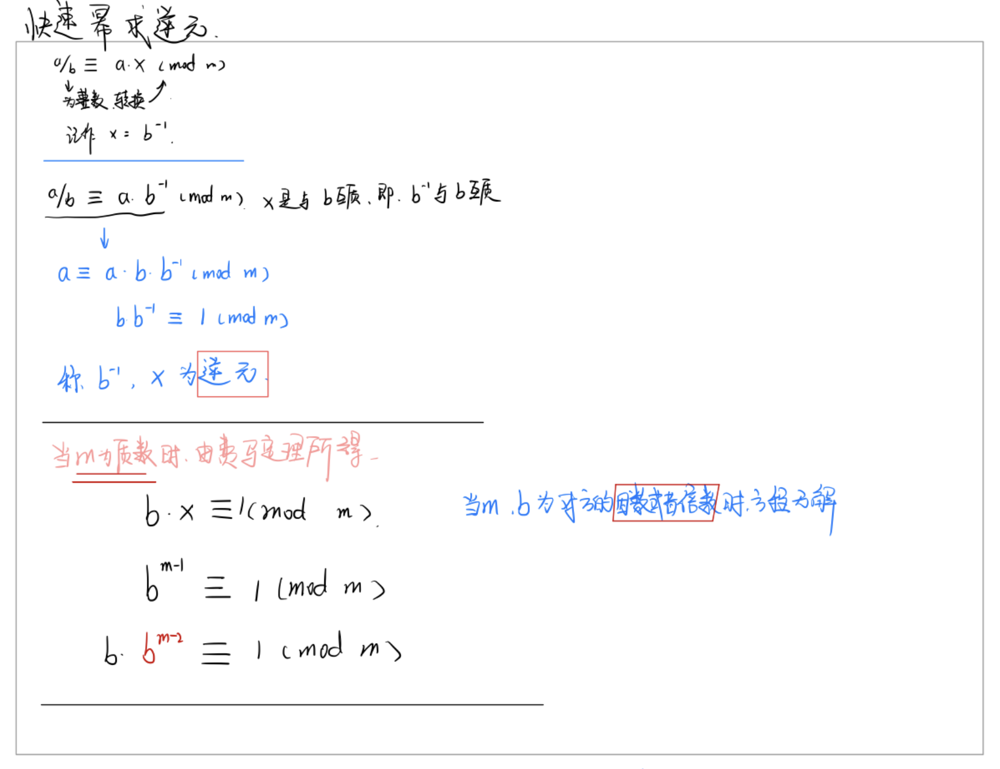
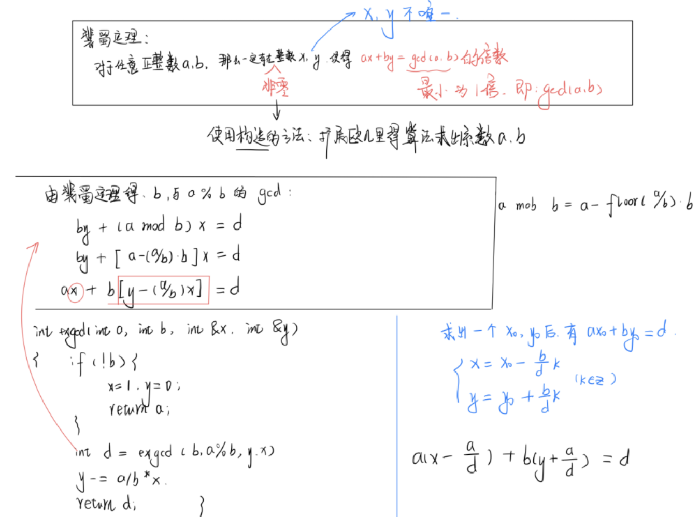
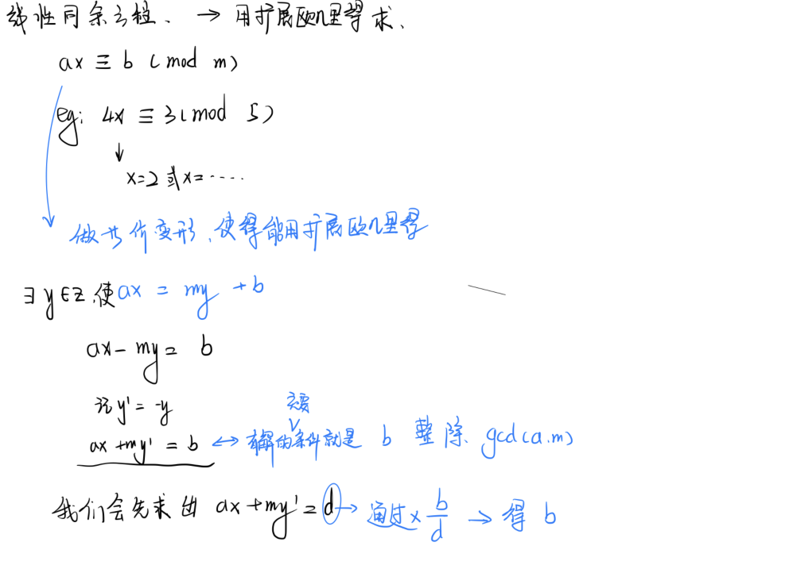
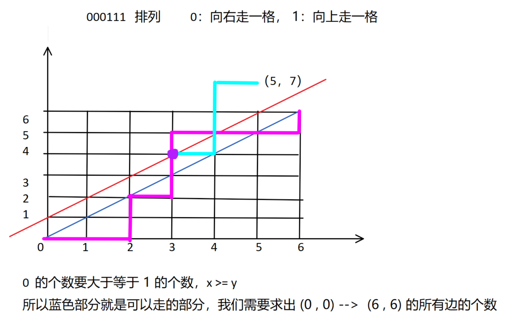
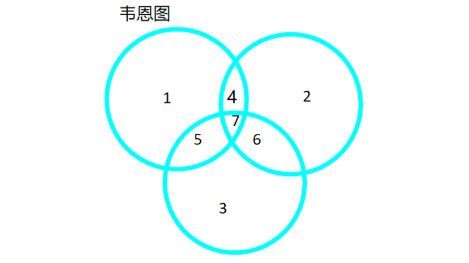
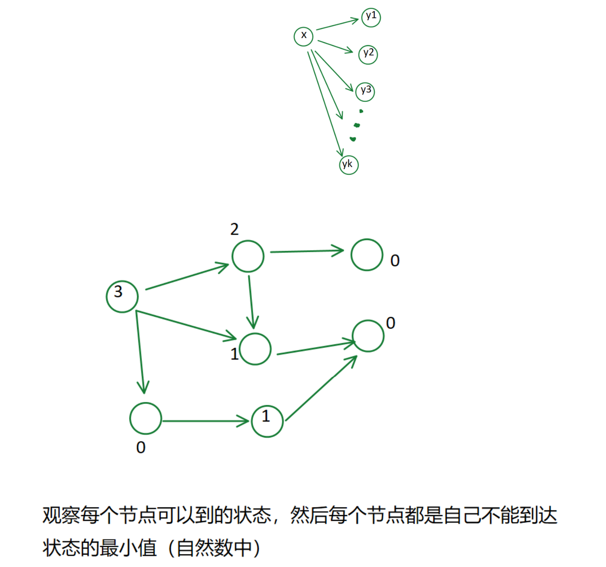
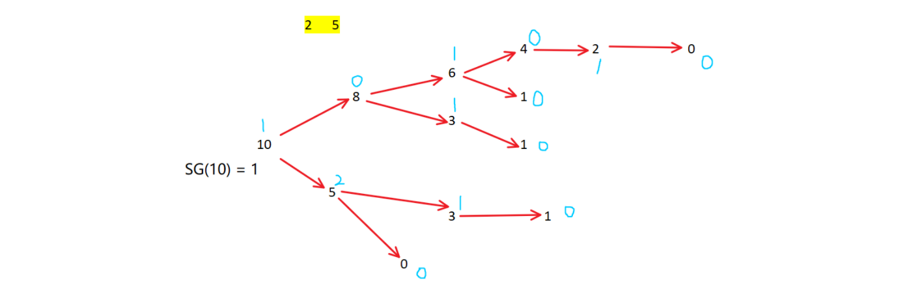

[TOC]

## 数论

#### 一些背景知识

```
质因数（素因数，质因子）在数论当中是指能够整除给定正整数的质数。

除 1 之外，两个没有其他共同 质因数的 的正整数称为互质。

1 与任何数互质。

正整数的因数分解可将正整数表示为一连串的质因子相乘，质因子如重复可以用指数表示。


算术基本定理：
	算术基本定理可表述为：任何一个大于1的自然数 N,如果N不为质数，那么N可以唯一分解成有限个质数的乘积。
```

$$
算术基本定理
\\ N = P_1^{a1} \ P_2^{a2} \ P_3^{a3} \ ... \ P_n^{an}
\\ 这里P_1<P_2<P_3...<P_n均为质数，其中指数ai是正整数。
$$

### 质数

```
质数：在大于 1 的整数中，如果包含 1 和 本身这两个约数，那么这个数就是质数（素数）

```

#### 质数的判定 —— 试除法

[试除法判断质数]:https://www.acwing.com/problem/content/868/

```c++
// o(n)
bool is_prime(){
    if(n < 2) return false;
    for( int i = 2; i < n ; i++){
        if( n % i == 0)   // n 可以被 2~n 的整数整除
            return false;
    return true;
}
```

```c++
优化：  //  o(srqt(n))
优化的原理 ： d / n  ==  (n/d)/n  
             d <= (n/d)
    		d^2 <= n    
    
bool is_prime(){
    if(n < 2) return false;
    for( int i = 2; i <= n/i  ; i++){  // sqrt() 函数比较慢，直接使用未变形的
        if( n % i == 0)   
            return false;
    return true;
}
```

#### 分解质因数 —— 试除法

```

```

```
从 2 开始枚举 n 的所有约数（其中既有质数，又有合数）
根据算术基本定理，n 就可以表示为有限个质数的乘积。


n % i == 0 成立：说明：   
n 是 i 的倍数 并且 n 当中不包含任何 2 ~ n-1的质因子。
因此 i 当中也不包含 2 ~ i-1 的质因子。所 i　必定为质数

eg:   12 可以 被 4 这个合数整除，但是能在 4 被整除之前， 就会 被 2 这个质数整除， 
因数中的合数并且是所要分解数的倍数 在被遍历到之前就会 被质数分解掉。


   n 中最多只包含一个大于 sqrt(n) 的 质因子。
   先将所有的 <= sqrt(n) 的质因子枚举，并且整除之后 n > 1 , 所以 再将这个 大于 sqrt(n) 的
   质因子处理。

```

[分解质因数]:https://www.acwing.com/problem/content/869/

```c++
//  o(sqrt(n)) ~ o(logn)
void divide(int n){
    for(int i = 2;i <= n/i ;i++){
        if( n % i == 0){   // true --> i为质数 
            int s = 0;
        	while(n % i == 0){
                n /= i;
                s++;
            }
            printf("%d %d\n",i,s);
        }
    }
    if( n > 1) printf("%d %d\n",n,1);
    puts("");
}
```

#### 筛质数

[筛质数]:https://www.acwing.com/problem/content/870/

##### 朴素筛质数

```
一个数的所有倍数都不是 质数。
每得到一个数，就将其所有的倍数 判掉。判掉的数中会有很多重复判掉的数，所以时间复杂度很高。
```

```c++
const int N = 1000010;
bool st[N];           // 判断 i 是否为质数
int primes[N],cnt;    // 质数数组 和 质数数量

void get_prime(int n){
    for(int i = 2;i <= n;i++){
    	if(!st[i]){
            primes[cnt++] = i;
        }    
        for(int j = i + i ; j <= n ; j += i) st[j] = true;
    }
}
```

##### 埃氏筛法

```
一个质数的所有倍数 都不是质数。
每得到一个质数，就将其所有的倍数 判掉。
··
因为不需要判掉 所有的数的数，所以会降低时间复杂度，但是质数的倍数仍有很多重复。
```

```c++
// o(nloglogn)   只删掉 2 ~ p-1 的质数的倍数 （优化原理就是算术基本定理）

const int N = 1000010;
bool st[N];           // 判断 i 是否为质数
int primes[N],cnt;    // 质数数组 和 质数数量

void get_prime(int n){
    for(int i = 2;i <= n;i++){
    	if(!st[i]){
            primes[cnt++] = i;
            for(int j = i + i;j <= n;j += i) st[j] = true;
        }
    }
}
```

##### 线性筛法

```
1: i % primes[j] == 0  -->  
priems[j]一定是 i 的最小质因子，primes[j] 一定是 primes[j] * i 的最小质因子

2：i % primes[j] != 0 --> 
primes[j]一定小于 i 的所有质因子，primes[j]也一定是primes[j] * i 的最小质因子

```

```c++
//        线性筛法的效率在数据量很大的情况  比埃氏筛法的效率高
//   埃氏筛法中数会被 质数 多次筛掉，但其实我们只需要被最小质因子筛掉就可以，没有必要重复筛

const int N = 10000010;
bool st[N];           // 判断 i 是否为质数
int primes[N],cnt;    // 质数数组 和 质数数量

void get_prime(int n){
    for(int i = 2;i <= n;i++){
    	if(!st[i]) primes[cnt++] = i;  
        
        for(int j = 0;primes[j] <= n/i;j++){ // 枚举所有的质数
            st[primes[j] * i] = true;
            // primes[j] 的最小质因子是 i (因为我们是从小到大遍历的)
            if(i % primes[j] == 0) break;  
        }
    }
}
```

### 约数

#### 试除法求约数

[试除法求约数]:https://www.acwing.com/problem/content/871/

```C++
vector<int> get_divisors(int n){
    vector<int> res;
    
    for(int i = 1;i <= n/i;i++){
        if(n % i == 0){
            res.push_back(i);
            // 避免 i==n/i, 重复放入 （n是完全平方数）
            if( i != n/i) res.push_back(n /i);   // 边界判断，避免重复输出
        }
    }
    sort(res.begin(),res.end());
    return res;
}


//  int 范围内一个数约数的最多大概在 1500 ~ 1600
```

#### 约数个数 和 约数之和

[约数个数]:https://www.acwing.com/problem/content/872/

```
约束个数为 
```

$$
(a_1 + 1)(a_2 + 1)(a_3 + 1)...(a_n + 1) 个
$$

```
基于算数基本定理,
N  的任何一个约数可以表示为  d , 所以 b1 ... bn 不同取法就对应着 不同的约数。
取法的个数就是 约束的个数。   b1 有  0 ~ a1 这些选择，共有 a1 + 1 中选法。
由乘法原理就可以得出约数的个数。
```

$$
N = P_1^{a_1} \ P_2^{a_2} \ P_3^{a_3} \ ... \ P_n^{a_n}
$$

$$
d = p_1^{b_1} \ . \ p_2^{b_2} \ . \ p_3^{b_3} \ . \ ... \ . p_n^{b_n} \ \ (0 \le b_i \le a_i)
$$

```
再由乘法原理：b1 有  [0,a1] 中 a1 + 1 个选法。
```

```
(a1 + a2 + a3 + ... + an) --> 分解为质因式乘积的形式，实际就是将每一个数都分解质因式，
    将相同的质数 以底数和指数的形式存储，
    我们使用哈希表来存储，  pi^ai --> map[pi] += ai;  这样就把这些底数和指数存起来了
    然后最终所有的约数个数就是 (a1 + 1)(a2 + 1)(a3 + 1)... (an + 1) 个
```

```c++
// acw 870
#include<iostream>
#include<algorithm>
#include<unordered_map>

using namespace std;

typedef long long LL;

const int mod = 1e9 + 7;

int main(){
    int n;
    cin >> n;
    
    unordered_map<int,int> primes;
    while(n--){
        int x;
        cin >> x;
        
        for(int i = 2 ; i <= x / i ; i++){
            while(x % i == 0){
                x /= i;
                primes[i]++;
            }
            
        }
        if(x > 1) primes[x]++;
    }
    
    LL res = 1;
    
    for(auto prime : primes) res = res * (prime.second + 1) % mod;
    
    cout << res << endl;
    
    return 0;
}
```

[约数之和]: https://www.acwing.com/problem/content/873/

$$
N = P_1^{a_1} \ P_2^{a_2} \ P_3^{a_3} \ ... \ P_n^{a_n}
$$

$$
约数之和：(p_1^0 + p_1^1 + ... +p_1^{a_1})...(p_n^0 + p_n^1 + .., +p_n^{a_n}) \\
可以展开为 \ 约数个数 \ 个乘积项 : (a_1 + 1)(a_2 + 1)(a_3 + 1)... (a_n + 1) 个 \\
并且每个约数项都不同，第一项 \ \ p_1^{b_1}...p_k^{b_k}
$$

```c++
// acw 871
#include<iostream>
#include<algorithm>
#include<unordered_map>

using namespace std;

typedef long long LL;

const int mod = 1e9 + 7;

int main(){
    int n;
    cin >> n;
    
    unordered_map<int,int> primes;
    while(n--){
        int x;
        cin >> x;
        
        for(int i = 2 ; i <= x / i ; i++){
            while(x % i == 0){
                x /= i;
                primes[i]++;
            }
            
        }
        if(x > 1) primes[x]++;
    }
    
    LL res = 1;
    
    for(auto prime : primes)
    {
        int p = prime.first , a = prime.second;
        
        LL t = 1; 
        
        while(a--) t = (t * p + 1) % mod;  
        res = res * t % mod;
            
    }
    
    cout << res << endl;
    
    return 0;
}
//  t = 1           , t * p + 1 = p + 1
//  t = p + 1       , t * p + 1 = p^2 + p + 1
//  t = p^2 + p + 1 , t * p + 1 = p^3 + p^2 + + p + 1
```

#### 欧几里得算法 —— 最大公约数

```
如果 d/a 成立，且 d/b 成立，那么就有   d / ax + by 的成立   ①
    a,b 的最大公约数 == a % b 的最大公约数
    gcd(a,b) == gcd(b , a mod b)
    
    a mod b == a - (a/b)*b , 把 a/b 看作 c
    就有
    gcd(a,b) == gcd(a,a - c*b)   此式子由 ① 可以证明左右两边的最大公约数相同是 d
    
    d / a 成立， d / (a - c*b   +   c*b) 就成立 --->  d / b 成立
```

```c++
int gcd(int a,int b){                          //  o(logn)
    return b ? gcd(b , a % b) : a;
}

// 判断 b == 0 是否成立，不成立就继续。成立则返回 a

//  原理就是  (a,b) = (b, a mod b) 
```

### 欧拉函数

```
对正整数 n ，欧拉函数求的是 小于 n  的正整数中 与 n 互质 的数的数目。

```

$$
对于一个正整数 \  N  \ 分解质因式 \\
N = p_1^{a_1} + p_2^{a_2} + ... + p_n^{a_n};
欧拉函数 ：\ \ \ f(N) = N(1 - \frac {1}{p_1} )(1 - \frac {1}{p_2}) ... (1 - \frac {1}{p_n})
$$

```
eg : N = 6 = 2 x 3
          f(6) = 6x(1 - 1/2)(1 - 1/3) = 2
```


$$
欧拉函数的证明：求：[1 , N] 中和 N 互质的数的个数。 \\
1：从 [1 , N] 中去掉 \ \ \  p_1 , p_2 , ... , p_k  \ \ \ \ 的所有的倍数 的个数。 \\
 N - \frac {N}{p_1}-\frac {N}{p_2}-...-\frac {N}{p_n} \ \  \ \ ,因为有的质数的倍数一样，所以会多减去了一些因数个数。 \\
 \\
 
 2:加上所有 p_i \   \cdot \  p_j 的倍数 的个数。(由于 p_i \ \cdot \  p_k 等于 p_j \ \cdot \  p_i) \\
 
 3: 减去所有的 p_i \ \cdot \ p_j \ \cdot \ p_k 的倍数的个数 \\
 \\
 
 综上可得：(容斥原理)\\
 N - \frac {N}{p_1}-\frac {N}{p_2}-...-\frac {N}{p_n}\\
 + \frac {N}{p_1p_2} + \frac {N}{p_2p_3} + \frac {N}{p_1p_3} +... \\
 - \frac {N}{p_1p_2p_3}  - \frac {N}{p_2p_3p_4} - \frac {N}{p_1p_3p_4} - \frac {N}{p_1p_2p_4} - ... \\
 .  \\
 . \\
 . \\
 
 \\
 化简之后就可得到 欧拉函数： \\
 f(N) = N(1 - \frac {1}{p_1} )(1 - \frac {1}{p_2}) ... (1 - \frac {1}{p_n})
$$




[欧拉函数]:https://www.acwing.com/problem/content/875/

```c++
// acw 873
#include<iostream>
using namespace std;

int main(){
    int n;
    cin >> n;
    
    while(n--){
        int a;
        cin >> a;
        
        int res = a;
        for(int i = 2;i <= a / i;i++){   // 公式求解
            if(a % i == 0){
                //  res = res / ( 1 -  1 / i )
                //  为防止出现浮点数，化简公式。
                res = res / i * (i - 1);
                while(a % i == 0) a /= i;
            }
        }
        if(a > 1) res = res / a * (a-1);
        cout << res << endl;
    }
    
    return 0;
}
```

#### 筛法求欧拉函数

```
使用公式求解 欧拉函数时，每一次都需要分解质因数，对于少量的数时间复杂度不会太高。
但是当求  1 ~ n 中所有数的欧拉函数时，就需要 优化。
```


```
1: 当一个数是质数时，设这个数是 p,那么 1 ~ p-1 中的所有数都是互质的，所以 p的欧拉函数就是 p-1

2:  i mod primes[j] == 0 -->  i 是 primes[j]的一个质因子，
    然后我们在求 f(primse[j] * i) 的时候， pj * i的质因子已经在 f(i) 中出现过。
    f(i) = i * (1 - 1/p)(1 - 1/p2) ... (1 - 1/pk)         ①
    f(pj * i) = pj * i(1 - 1/p)(1 - 1/p2) ... (1 - 1/pk)    ②
    f(pj * i) = pj * f(i)                                  由 ① ， ②得

    
3:  i mod primes[j] != 0 时 
    f(i) = i * (1 - 1/p)(1 - 1/p2) ... (1 - 1/pk)                      
    f(pj * i) = pj * i(1 - 1/p)(1 - 1/p2) ... (1 - 1/pk) * (1 - 1/pj)    
    f(pj * i) = pj * f(i) * (1 - 1/pj) = f(i) * (pj - 1)
    
```

[筛法求欧拉函数]:https://www.acwing.com/problem/content/876/

```c++
#include<iostream>
#include<algorithm>
using namespace std;

typedef long long LL;

const int N = 1000010;

int primes[N],cnt;
int phi[N];
bool st[N];

LL get_eulers(int n){
    
    phi[1] = 1; // 1 d
    for(int i = 2; i <= n ;i++)
    {
        if(!st[i])
        {
            primes[cnt ++] = i;
            phi[i] = i - 1;             //  i 为质数时，其欧拉函数值就是 i - 1
            
        }
        for(int j = 0 ; primes[j] <= n / i ; j++)
        {
            st[primes[j] * i] = true;
            if(i % primes[j] == 0)
            {
                //pj 为 i 的质因子, 其欧拉函数就是  pj * phi[i];
                phi[primes[j] * i] = primes[j] * phi[i]; 
                break;  //  线性筛法的优化之处
            }
             
            //  pj 不是 i 的质因子,
            phi[primes[j] * i] = phi[i] * (primes[j] - 1);
        }
    }
    LL res = 0;
    for(int i = 1;i <= n;i++) res += phi[i];
    return res;
}

int main(){
    int n;
    cin >> n;
    cout << get_eulers(n) << endl;
    return 0;
}

```

### 快速幂

```
解决的问题：  快速求出  a^k mod p 的结果   o(logk)
核心思路： 
    1：预处理出  a^(2^0) mod p     a^(2^1) mod p  ...  a^(2^logk) mod p  共 logk 个，
    2：再组合出  a^k = a^(2 ^ (x1) + 2 ^ (x2) + ... + 2 ^ (xt))   t最大是logk

   eg:   4^5  mod  10   --->    4^5 = 4^(101)(2进制)
       							    = 4^(2^0 + 2^2)
       								= 24   === 4 (mod 10) 
       
      4^(2^0) = 4      (mdo 10)
      4^(2^1) = 6      (mdo 10)
      4^(2^2) = 6      (mdo 10)
```

$$
解决的问题：  快速求出  a^k   \bmod  p 的结果  o(logk) \\
核心思路： \\ 
1：预处理出 \\
      a^{(2^0)} \bmod   p   \\ 
      a^{(2^1)} \bmod   p  \\  
      . \\
      . \\
      . \\
      a^{(2^{logk})} \bmod p  \\ 
      共 logk 个，\\
     
      
    2：再组合出  a^k = a^{(2 ^{(x1)} + 2 ^{(x2)} + ... + 2 ^ {(xt)})}      t最大是logk \\
    
    我们将 k 分解为 预处理出来的数之和(即若干个2的次幂之和),我们只需要将 k 转化为二进制数，这再转化二的次幂之和。 \\
    

   eg:   4^5  \bmod   10   \rightarrow   4^5 = 4^{(101)}(2进制)  \\
       			 = 4^{(2^0 + 2^2)}  \\
       			 = 24   \equiv  4 (\bmod 10)  \\ 
       \\
      4^{(2^0)} \equiv 4      (\bmod 10) \\
      4^{(2^1)} \equiv 6      (\bmod 10) \\
      4^{(2^2)} \equiv 6      (\bmod 10) \\
$$

[快速幂]:https://www.acwing.com/problem/content/877/

```c++
#include<iostream>
#include<algorithm>

using namespace std;
typedef long long LL;

// a^k % p 的结果
int qmi(int a,int k,int p)    //  最初的 a 存的是 a^*(2^0)
{
    int res = 1;
    while(k)   //  首先转化 2 的幂次方数相加
    {
        // 判断 k 的个位是否为 1，为 1 的话就将此时对应的 a 加上
        if(k & 1) res = (LL)res * a % p;   
        
        // 将 k 的最后一位删除，确保下次检测的最后一位
        k >>= 1;
        
        //将 a 递增，第一次由 a^(2^0) --> a^(2^1)实际运算就是 将原来的数平方再取余
        a = (LL)a * a % p;
    }
    return res;
}
int main(){
    int n;
    scanf("%d",&n);
    while(n--)
    {
        int a,k,p;
        scanf("%d%d%d",&a,&k,&p);
        
        printf("%d\n",qmi(a,k,p));
    }
    
    return 0;
}
```

[快速幂求逆元]:https://www.acwing.com/problem/content/878/


$$
b^{m-2} = b^{-1}  就是逆元
$$

$$
欧拉定理：\\
  若 a 与 n 互质，则有   \\
  a^{f(n)} \equiv 1( \bmod n) ; \\
  (a^{f(n)} \bmod n 同余1) \\
  
	eg :  5^{f(6)} \bmod 6
        = 5^2 \bmod 6
        = 1
\\
欧拉定理的推论：  （当 n 是质数时）  a^{(p-1)} \equiv  1(\bmod p)  为费马定理
$$

```c++
#include<iostream>
using namespace std;
typedef long long LL;

LL qmi(int a,int k,int p)
{
    LL res = 1;
    while(k)
    {
        if(k & 1) res = res * a % p;
        k >>= 1;
        res = a * (LL)a % p;
    }
    return res;
}

int main()
{
    int n;
    cin >> n;
    
    while(n--)
    {
        int a,p;
        scanf("%d%d",&a,&p);
        
        int res = qmi(a, p - 2,p);
        
        if(a % p) printf("%lld\n",res);
        else puts("impossible");
        
    }
    
    return 0;
}
```

### 扩展欧几里得算法

[扩展欧几里得算法]:https://www.acwing.com/problem/content/879/



```
扩展欧几里得算法就是要  求 满足  ax + by = gcd(a,b)倍数的 中的  x ,y;


```

```c++
#include<iostream>
using namespace std;

int exgcd(int a, int b, int &x ,int &y)
{
    if(!b)
    {
        x = 1 , y = 0;
        return a;
    }
    int d = exgcd(b , a % b ,y ,x); //  x ,y 系数也要交换位置
    y -= a / b * x;  // a 的系数是 x , b 的系数是 y - (a / b) * x
    return d;
}

int main()
{
    int n;
    scanf("%d", &n);
    
    while (n -- )
    {
        int a, b;
        scanf("%d%d", &a, &b);
        int x,y;
        exgcd(a,b,x,y);
        
        printf("%d %d\n",x, y);
    }
    
    
    return 0;
}

```

#### 线性同余方程

[线性同余方程]:https://www.acwing.com/problem/content/880/


$$
这里要求的 x ; \\
首先求出 ax + my' = d \\
两边同时乘以 \frac {b}{d},d就会变成b, x 变成 x \frac {b}{d}
$$


```c++
#include<iostream>

using namespace std;
typedef long long LL;

int exgcd(int a, int b, int &x, int &y)
{
    if(!b)
    {
        x = 1 , y = 0;
        return a;
    }
    
    int d = exgcd(b , a % b ,y ,x);
    y -= a / b * x;
    return d;
}

int main()
{
    int n;
    scanf("%d", &n);
    
    while (n -- )
    {
        int a, b, m;
        scanf("%d%d%d", &a, &b,&m);
        int x, y;
        int d = exgcd(a,m,x,y);
        
        if(b % d) puts("impossible");
        else printf("%d\n", (LL)x * (b / d) % m);
    }
    
    
    return 0;
}
```

### 中国剩余定理

$$
S:
\begin{cases}
x \equiv a_1 ( \bmod m_1)\\
x \equiv a_2 ( \bmod m_2)\\
             . \\
             . \\
             . \\
x \equiv a_n ( \bmod m_n)\\

\end{cases} 

中国剩余定理说明：假设整数 m_1,m_2, ... ,m_n 两两互质。
$$
--
$$
方程组 S 有解; 并且通解可以用如下方式构造得到：\\
设 M=m_1  \cdot m_2 \cdot \ ...  \cdot m_n = \prod_{i=1}^{n}m_i是整数 m_1,m_2, ... ,m_n的乘积。 \\
设M_i = \frac {M}{m_i} \\
M_i^{-1}表示 M_i \bmod m_i的逆 \\
所以通解就是：x=a_1\cdot M_1 \cdot M_1^{-1} +a_2\cdot M_2 \cdot M_2^{-1} + ... + a_n\cdot M_n \cdot M_n^{-1} + nM \\
= nM + \sum_{i=1}^{n}a_iM_iM_i^{-1} \\
在模M 的意义下，方程组只有一个解 x = (\sum _{i=1}^{n}a_iM_iM_i^{-1}) \bmod M
$$
--
$$
做等价变形
\begin{cases}
x = k_1 a_1 + m_1   , 1式 \\
x = k_2 a_2 + m_2   , 2式\\
             . \\
             . \\
             . \\
x = k_n a_n + m_n\\

\end{cases}
$$ 
--
$$
k_1a_1 + m_1 = k_2a_2 + m_2 \\
k_1a_1 - k_2a_2 = m_2 - m_1  \  ①,在使用扩展欧几里得算法进行求解\\
①式有解等价于  gcd(a,b) 能整数(m_2 - m_1)
$$
--
$$
x =k_1a_1 + m_1 \\
\begin{cases}
k_1 + k \frac {a_2}{d} \\
k_2 + k \frac {a_1}{d} \\
\end{cases} \\
x = (k_1 + k \frac {a_2}{d})a_1 + m_1 \\
x = a_1k_1+m_1+k \frac {a_1a_2}{d}, d 是最大公约数 \\
x = a_1k_1+m_1+k \cdot lcd(a_1,a_2) \\
记： x_0 = a_1k_1+m_1+k  ,  a = k \cdot lcd(a_1,a_2) \\
所以 x = x_0 + ka ,  3式 \\

所以就将两个式子1式和2式合并为一个3式 \\
将n个方程合并n-1次就可以要合并为1个式子。\\
$$
--
[表达整数的奇怪方式]:https://www.acwing.com/problem/content/206/

```c++
#include<iostream>
#include<cmath>
using namespace std;

typedef long long LL;

LL exgcd(LL a, LL b, LL &x, LL &y)
{
    if(!b)
    {
        x = 1, y =0;
        return a;
    }
    LL d = exgcd(b , a % b , y ,x);
    
    y -= a / b * x;
    return d;
}

int main()
{
    int n;
    cin >> n;
    
    bool has_answer = true;
    LL a1 ,m1;
    
    cin >> a1 >> m1;
    
    for(int i = 0 ; i < n - 1 ; i++)
    {
        LL a2 , m2;
        cin >> a2 >> m2;
        
        LL k1 , k2;
        LL d = exgcd(a1 , a2 , k1 , k2);
        if((m2 - m1) % d)
        {
            has_answer = false;
            break;
        }
        
        k1 *= (m2 - m1) / d;
        LL t = a2 / d;
        k1 = (k1 % t + t) % t;
        
        m1 = a1 * k1 + m1;
        a1 = abs(a1 / d * a2);
    }
    
    if(has_answer)
    {
        cout << (m1 % a1 + a1) % a1 << endl;
    }
    else puts("-1");
    
        
    
    return 0;
}
```


### 高斯消元

化简的最终形式
$$
\begin{cases}
a_1X_1 + ... + a_nX_n = b1\\
a_2X_2 + ... + a_nX_n = b2\\
             . \\
             . \\
             . \\
 ... a_{n-1}X_{n-1} + anXn = bn-1\\
  ...a_nx_n = b_n\\
\end{cases}
$$


```c++
可以在 n^3 的时间内求解出 n 元,n 个 方程的线性方程组；（方程组：无解，无穷解，唯一解）

对 系数矩阵 做初等变化，--> 转化为最简行列阶梯矩阵
a1X1 + ... + anXn = b1
   a2X2 +..+ anXn = b2
             .
             .
             .
  an-1Xn-1 + anXn = bn-1
        .....anxn = bn
当我们知道 bn 的值就可以递推求解方程
   有解：
      无穷多个解    an = 0  bn != 0
      唯一解        a1 ... an != 0  b1 ... bn != 0
   无解 
      an = 0 时
    
    
    
    
  初等变化：  
①：将某一行（列）乘以 一个 非零的数
②：交换某两行（列）
③：把某行（列）的若干倍加到另一个行（列）
    
    
    
eg:解下来方程组
 1  2  -1  -6     1  0  0  1 
 2  1  -3  -9 --->0  1  0  -2
-1 -1   2   7     0  0  1  3
    
    算法步骤：
    1：枚举每一列：找到本列绝对值最大的一行
    2：将这样换到最顶端（相对的最顶端）
    3: 将本行 第一个变为 1（用乘法）
	4：将下边所有行的第 c 列变为 0 (以一定的倍数再相加相减)
   然后从第二列开始（做完这个操作的行固定）直至化为阶梯型
  化完之后，我们就开始将最后一行（如果有无穷解解）Xn 的 系数 an 化为 1 ,消掉上一行中 Xn 的系数；
  上一行就剩 an-1Xn-1 = bn-1,依次类推向上解，就将方程解出
        
       
```

```c++
//acw 883
#include<ioatresam>
#include<algorihm>
#include<cmath>

using namespace std;
const int N = 110;
const double eps = 1e-6; // 当浮点数小于 1e-6 时，我们认为 其 == 0；

int n;
double a[N][N];

int gauss(){
    int r,c; // 行数，列数
    for(c = 0.r = 0;c < n;c++){  // 逐列处理
        
        int  t = r;
        for(int i = r;i < n;i++)      //遍历寻找出每一列种绝对值最大的那个值所在的行 
        	if(fabs(a[i][c]) > fabs(a[t][c]))
                t = i;
        
        if(fabs([t][c] < eps) continue; 
           
        // 将每一列种绝对值最大的移到最上面。不是第一行，这里的最上行 指的是所在 第几列 == 第几行
        for(int i = c;i <= n;i++) swap(a[t][i],a[r][i]);  
        
        for(int i = n;i >= c;i--) a[r][i] /= a[r][c];  // 将对应的绝对值最大的行的相对第一个数变为1
        
        for(int i = r + 1 ; i < n ;i++){    // 将绝对值所在列的其他数都化为 0
            if(fabs(a[i][c]) > eps)         // 判断是否为 0
                for(int j = n;j >= c;j--)    // 初等变化：对应行的数减去 1 x 此行相对第一个不为0的数
                    a[i][j] -= a[r][j] * a[i][c];
        }
        r++;
    }
    if(r < n){
        for(int i = r;i < n;i++){
            if(fabs(a[i][n]) > eps)
                return 2;// 对角线系数有为零的数,无解
        }
        return 1;   //没有为 0 的数，有无穷多解
    }
    for(int i = n - 1 ; i >= 0 ; i--){
        for(int j = i + 1 ; j < n ; j++){
            a[i][n] -= a[i][j] * a[j][n];
        }
    }          
    return 0; // 有唯一解
}

int main(){
    cin >> n;
    for(int i = 0;i < n;i++)
        for(int j  =`0;j < n + 1;j++) //  输入的不是系数方阵，还有每个方程的值，n 行 n+1 列
            cin >> a[i][j];
    
    int t = gauss();
    if(t == 0){
        // 将系数矩阵化为上三角形矩阵之后，输出对角线的值就是方程的解
        for(int i = 0;i < n;i++) printf("%.2lf\n",a[i][n]); 
    } 
    else if(t == 1) puts("Infinite group solutions");
    else puts("No solution");
    
    return 0;
}
```


### 求组和数

$$
C_a^b = \frac {a!} {b!(a-b)!} = C_{a-1}^b + C_{a-1}^{b-1}
$$

```c++
递推公式种就是将原来的 a 进行划分；
    包含某一个
    不包含某一个
```

```c++
//   10 万组数据，  1 <= b <= a <= 200;      使用递推公式
#iclude<iostream>
#incude<algorithm>
const int N = 2010,mod = 1e9 + 7;
int c[N][N];

void init(){
    for(int i = 0 ; i < N ;i++)
        for(int j = 0 ; j <= i;j++)
            if(!j) c[i][j] = 1;
    		else c[i][j] = (c[i-1][j] + c[i-1][j-1]) % mod;
}
int main(){
    init();
    int n;
    scanf("%d",&n);
    while(n--){
        int a , b;
        scanf("%d%d",&a,&b);
        printf("%d\n",c[a][b]);
    }
    return 0;
}
```

```c++
// 1 万组数据（数据量可以再加，java 不行），   a <= b <= a <= 10^5     使用阶乘公式，必须预处理
#include<iostream>
#include<algorithm>
using namespace std;
typedef long long LL:
const int N = 100010,mod = 1e9 - 7;

int favt(),infact();

int qmi(int a.int k,int p){
    int res = 1;
    while(k){
        if(k & 1) res = (LL)res * a % b;
        a = (LL)a * a % b;
        k >>= 1;
    }
    return res;
}


int main(){
    fact[0] = infact[0] = 1;
    for(int i = ;i < N;i++){
        fact[i] = (LL)fact[i-1] * i % mod;
        infact[i] = (LL)infact[i-1] * qmi(i,mod-2,mod) % mod;
    }
    int n;
    scanf("%d",&n);
    while(n--){
    	int a,b;
        scanf("%d%d",&a,&b);
        printf("%d\n",(LL)fact[a] * infact[b] % mod * infact[a - b] % mod);
    }
    return 0;
}

```

#### 卢卡斯定理

$$
C_a^b   \equiv   C_{a \bmod  p}^{b \bmod  p} \cdot C_{a/p}^{b/p} (\bmod \ p)  \\

时间复杂度：log_pN \cdot p \cdot logp \\
证明：\\
a = a_kp_k  +   a_{k-1}p_{k-1}  +  ...  +  a_0p_0 \\

b = b_kp_k  +   b_{k-1}p_{k-1}  +  ...  +  b_0p_0 \\
(1+x)^{p^k}  =  C_p^0  +  C_p^1x  +  C_p^2  +  ...  +  C_p^bx^p \equiv 1+x^{p^k}  (\bmod \ p)\\
(1+x)^a =(1+x)^{a_0}+((1+x)^{p^1})^{a_1}+  ...  +((1+x)^{p^k})^{a_k} \\
(1+x)^a =(1+p)^{a_0}(1+x^p)^{a_1}(1+x^{p^2})^{a_2}  ...  (1+x^{p^k})^{a_k} \\
C_a^b \equiv C_{a_k}^{b_k} \cdot C_{a_{k-1}}^{b_{k-1}}  ...  C_{a_0}^{b_0}  (\bmod \ p)
$$


```c++
//  20组  1 <= a <= b <= 10^18


```


```c++
// 对于组合数的结果不再去 m 一个很大的数，这样我们就需要高精度去表示我们组合数的结果.直接使用高精度来从定义出发做
#include<iostream>
#include<algorithm>


```


```c++
0 的个数都要大于等于 1 的个数
```



```c++
每一条路径走到碰到红线时，最后都对这个相交那个点后半段路径做关于红线的轴对称，最后的终点都是 (5,7)
```

$$
这些路径都是不合格的 (从 (0,0) \rightarrow (5,7) ) ,路径共有  C_{12}^5
$$

$$
首先从 (0,0) -->  (6,6)  的所有边的合数一共是  C_{12}^6  - C_{12}^5  , 通用公式在下面\\
卡特兰数：  C_{2n}^n - C_{2n}^{n-1}  =  \frac {1} {n+1} C_{2n}^n
$$


```
从 (0,0)  --->  (5,7)  一共需要走12步，向上 7 步，向右 5 步
```

```c++
#include<iostream>
#include<algorithm>
using namespace std;

typedef long long LL;


const int mod = 1e9 + 7;
int qmi(int a,int k,int p){
    int res = 1;
    while(k){
        if(k & 1) res = (LL)res * a % p;
        a = (LL)a * a % p;
        k >>= 1;
    }
    return res;
}

int main(){
    int n;
    cin >> n;
    int a = 2 * n, b = n;
    int res = 1;
    
    for(int i = a ; i > a - b ; i--) res = (LL)res * i % mod;
    for(int i = 1 ; i <= b ; i++ ) res = (LL)res * qmi(i,mod - 2,mod) % mod;
    res = (LL)res * qmi(n+1,mod - 2,mod) % mod;
    cout << res << endl;
    return 0;
}


```

### 容斥原理


$$
区域面积：S_1 + S_2 + S_3 - S_1 \bigcap S_2  - S_1 \bigcap S_3 - S_2 \bigcap S_3 + S_1\bigcap S_2\bigcap S_3 \\

广义加法： P(A \bigcup B \bigcup C) = P(A) + P(B) + P(C)-p(A \bigcup B)-P(A \bigcup c)-P(B \bigcup C) + P(A \bigcap B \bigcap C) \\

项数： C_n^1 + C_n^2 + C_n^3 +  ...  + C_n^n = 2^n - C_n^0 = 2^n - 1 \\
C_k^1 - C_k^2 + C_k^3 - C_k^4 +  ...  + (-1)^{k-1}C_k^k = 1 (1 <= k <= n)所以这里的每个元素都会被统计一次
$$

```
 容斥原理的应用：求 1 ~ n 中能被 p1 .. pn 这些质数整除的数的个数：
  然后总的时间复杂度是 ： o(2^n)  这里的 n 就是 集合的个数
```

$$
S_2 = \{ 2,4,6,8,10\} -->  1 - n中能被 2 整除的数\\
S_3 = \{ 3,6,9\}  --> 1 ~ n中能被 3 整除的数 \\
那么求 1 - n中能被 2 整除和能被 3 整除的数有：\\
S_2 \bigcup S_3  = S_1 + S_2 - S_2 \bigcap S_3
$$

$$
S_p = 1 - n 中 p 的倍数的个数  = floor(n/p) \\
S_{p_1} \bigcap S_{p_2} \bigcap  \ ... \ S_{p_n}在1-n的P_1,P_2,..,P_n 倍数的个数 = floor(\frac {n} {P_1P_2...P_n}) \\
\\
floor(n/p) 的正确性：\\ 
\begin{cases}
n能整除 p    \rightarrow 倍数的个数就是n/p 。 1P,2P,3P,4P,...,nP\\
n不能整除 p   \rightarrow 倍数的个数就是floor(n/p) 。  1P,2P,3P,4P,...,kP ,..., n\\
\end{cases}
$$

```
对于每一个集合的交集来说，如果其中有 n 个集合，那么计算其的时间复杂度就是 o(n) --->  n 次乘法(分母位置)；
总的时间复杂度就是   o(2^n * n)
```


### 博弈论

```
NIM 游戏： 有 a1,a2,a3 .. an 堆石子
 
先手必胜状态：可以走到某一个必败状态;
先手必败状态：走不到任何一个必败状态；
    
    性质：
    a1 ^ a2 ^ a3 ^ ... ^ an = 0 时，先手必败；
    a1 ^ a2 ^ a3 ^ ... ^ an != 0 时，先手必胜；
    
异或： 相同为 0，相异为 1;


1： 需证明：
某一堆石子数的异或值不是 0 的时候，我们可以通过某种方式，让其变成 0 ；
即我们在某一堆石子当中拿走一些石子之后，一定可以让剩下的这些石子数异或为 0 ；
    (即先手操作完之后，使得状态成为必败状态)
    
证明：   0 ^ 0 ^ 0 ^ ... ^ 0 = 0;
		a1 ^ a1 ^ a3 ^ ... ^ an = x != 0;
	 设 x 二进制表示中最高位是 1 在第 k 位；
     a1 ~ an 中必然存在 一个 ai , ai 的第 k 位是 1；
     ai ^ x < ai。   所以 ai - (ai ^ x) 是正确的 
      我们从 ai 中拿走 ai - (ai ^ x) 个石子 ，所以会剩下来  ai - (ai - (ai - x)) 个石子
         
    ai - (ai - (ai ^ x)) =  ai ^ x;---> 剩余的石子数
	a1 ^ a1 ^ a3 ^ ... ^ ai ^ x ^ a_(i+1) ^ ... ^ an = x ^ x  = 0 得证
	
	
2： 需证明：
当 a1 ^ a2 ^ a3 ^ ... ^ an = 0   ①  时，不管怎么拿石子 | >= 0 个石子，剩下的所有石子数异或值一定不为 0 
         
证明：   反证：     假设我们在 ai 这堆石子中拿了一些石子，在ai中还剩下 ai' 个石子   
   a1 ^ a2 ^ a3 ^ ... ^ ai' ^ a(i+1) ^ ... ^ an = 0;    ②
   
 将 ① ， ②  上下异或异或之后，会剩下 ai ^ ai' = 0,只有当 ai = ai' 时成立，所以矛盾；得证。
 
   
分析：
	1: 当先手初始的石子异或值不为 0 时，先手将拿走一些石子使得石子数异或值变为 0,那么就会创造对手必败的状态
并且后手怎么拿都不会再次创造出石子数异或值 为 0 的状态。
	2: 当先手的初始石子为 0 时，那么就是必输状态
```

```c++
// acw891
#include<iostream>
using namespace std;
int main(){
    int n;
    int res = 0;
    scanf("%d",&n);
    while(n--){
        int x;
        scanf("%d",&x);
        res ^= x;   //  将输入进来的每个数直接异或
    }
	if(res) puts("Yes");
    else puts("No");
    
    return 0;
}
```

```c++
//  有向图游戏
给定一个有向无环图，图中有唯一的起点，在起点上放有一枚棋子，两名玩家交替地将这枚棋子沿着边进行移动，每次可以移
动一步，无法移动判负；
    任何一个公平组合游戏都可以转化为有向图游戏，具体的方法是：
    	把每个局面都看作是图中的一个节点，并且从每个局面向沿着合法行动能够到达下一个局面连有向边。


//  SG 函数
在有向图游戏中，对于每个节点 x ，设从 x 出发共有 k 条有向边，分别到达 y1 , y2 ,y3 ,... yk的SG函数
值构成的集合再执行 mex(S)运算的结果，即：
    SG(x) = mex(SG(y1) , SG(y2) , SG(y3) , ... ,SG(yk))
 特别的：整个有向图游戏 G 的 SG 函数值被定义为有向图游戏 s 的SG 函数值，  即  SG(G) = SG(s);


// Mex 运算
设 S 表示一个非负整数集合，定义 mex(S) 为求出不属于集合 s 的最小非负整数的运算；即：
    Mex(S) = min(x) , x 是属于自然数，且 x 不属于 S;


```



```c++
1： 如果只有一个 图时：       （0是必败态，非 0 是必胜态）
        SG(x) = 0   必败
        SG(x) != 0  必胜
        任何一个 非 0 的状态总是能到达   0 
        任何一个 为 0 的状态总是不能到达  0

2:  当我们不止有一个图可以行走时：
    	玩家可以在任意一个图中进行下一步；
    	这时候的输赢就是靠 SG(x) 函数来计算；
    将每个图的起点的SG(x)函数异或；(假设我们有 n 个图可以使用)
    SG(x1) ^ SG(x2) ^ SG(x3) ^ ... ^ SG(xn) = 0 必败     ！= 0 时必胜
证明与 NIM 游戏一致。

    
3：定理：
	有向图游戏的某个局面 必 胜，当且仅当该局面对应节点的 SG 函数值 > 0;
	有向图游戏的某个局面 必 败，当且仅当该局面对应节点的 SG 函数值 = 0;

    
```



```c++
将集合NIM 游戏转化为有向图，   10 是我们石子的个数，2 ，5 是属于我们集合 s 中的步数；
蓝色的数字表示每个节点的  SG函数的值；这样我们可以递推求出开始节点 SG(10) 的值；
多个图叠加之后，按照上述方法算出每个开始节点的  SG 函数值；最后异或。
    
// acw 839   
#include<iostream>
#include<cstring>
#include<unordered_set>
#include<algorithm>
using namespace std;

const int N = 110, M = 10010;
int n,m;
int s[N],f[M];   // f[N]来暂存状态  ， s[N]表示 集合

int sg(int x){       // 使用记忆化搜索
    // 使用一个数组来存一下每个状态是否被算过。避免重复计算，可以避免指数级的时间复杂度，10^6 次方次计算
    if(f[x] != -1) return f[x]; 
    
    
    unordered_set<int> S;   // 使用 哈希表 来存所有可以到的局面
    
    for(int i = 0 ; i < m ; i++){
        int sum = s[i];
        // 目前节点的数大于集合中的数时就可以走下去，并加进去新的状态
        if(x >= sum) S.insert(sg(x - sum)); 
    }
    
    // 在图中不在哈希表中的 节点的 SG 函数值
    for(int i = 0 ; ; i++){
        if(!S.count(i))
            return f[x] = i;
    }
    
}

int main(){
    
    cin >> m;
    for(int i = 0 ; i < m ; i++) cin >> s[i];
    
    cin >> n;
    
    memset(f , -1 , sizeof f); // 初始化 SG 函数状态，方便判断是否被s
    
    int res = 0;
    for(int i = 0 ; i < n ; i++ ){
        int x;
        cin >> x;
        res ^= sg(x);
    }
    
    if(res) puts("Yes");
    else puts("No");
    
    return 0;
}

```


