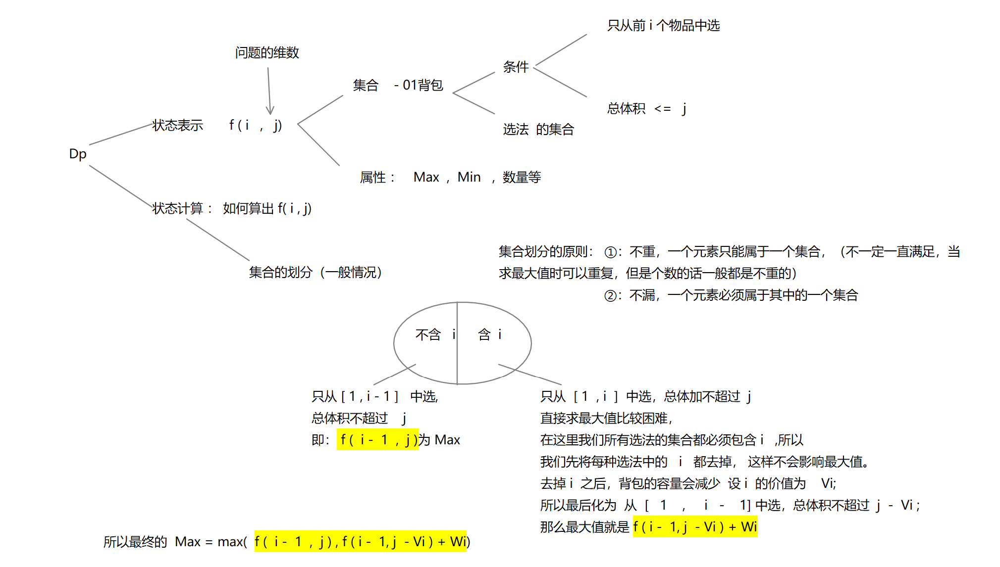
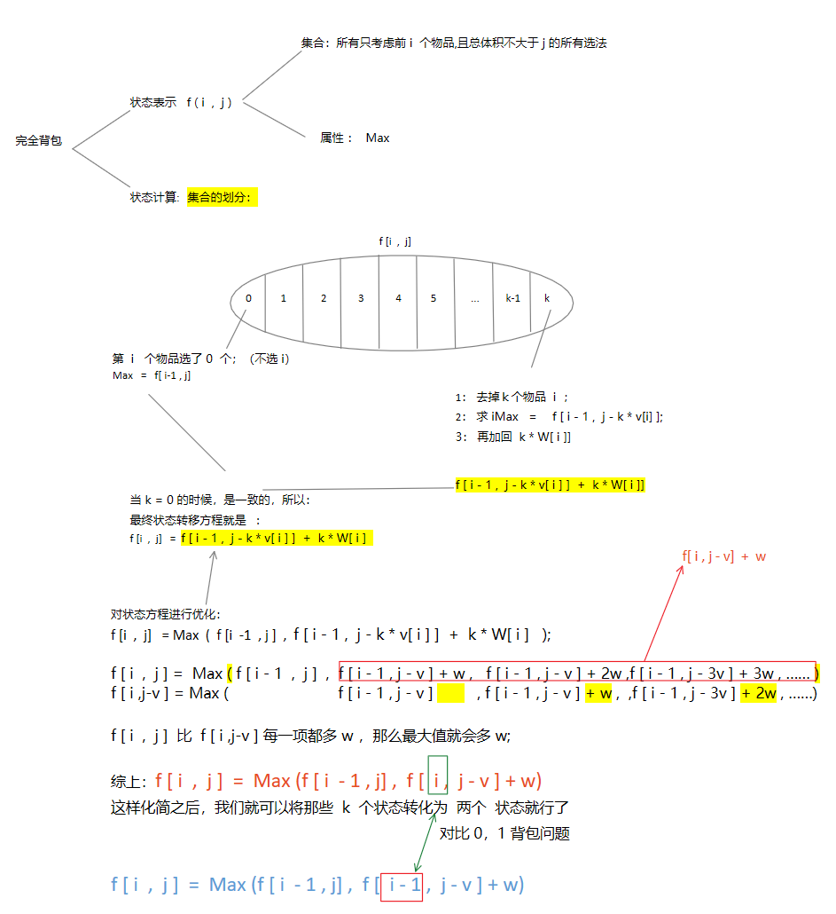
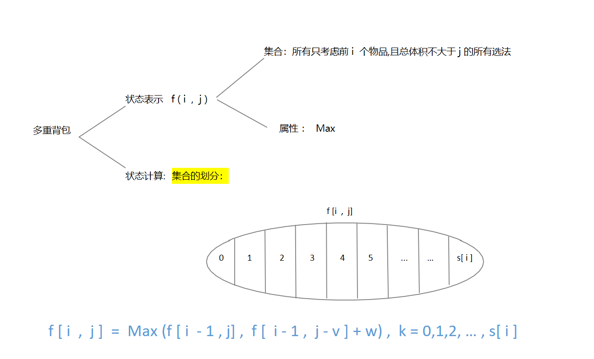

[TOC]

### 背包问题

####  0 ，1 背包

```
特点：每件物品最多只能用一次； (使用次数 <= 1 )
```



```c++
// acw2
#include<iostream>
#include<algorithm>
using namespace std;
const int N = 1010;
int n ,m;
int v[N],w[N];
int f[N][N];

int main(){
    cin >> n >> m;
    
    for(int i = 1 ; i <= n ; i++) cin >> v[i] >> w[i];
    
    //  二维
    for(int i = 1 ; i <= n ; i++){
        for(int j = 0 ; j <= m ; j++){
            f[i][j] = f[i-1][j];
            if(j >= v[i]) f[i][j] = max(f[i][j],f[i-1][j - v[i] ]+ w[i]);
        }
    }
    cout << f[n][m] << endl;
    return 0;
}   
// 可以优化的原因：
f[i] 只用到了 f[i-1];
j , j - v[i]  <= j;


int f[N];
// 一维
for(int i = 1 ; i <= n ; i++){ 
    for(int j = m ; j >= v[i] ; j--){
        f[j] = max(f[j],f[j - v[i]] + w[i])     
    }
}
```

#### 完全背包

```
特点：每件物品有无限个；
```




```c++
#include<iostream>
#include<algorithm>
using namespace std;
const int N = 1010;
int n,m;
int v[N], w[N];
int f[N][N];

int main(){
    cin >> n >> m;
    
    for(int i = 0 ; i <= n ; i++ ) cin >> v[i] >> w[i];
    
    //  原始状态方程，数据量的增加会超时
    for(int i = 1 ; i <= n ; i++)
        for(int j = 0 ; j <= m ; j++)
            for(int k = 0 ; k * v[i] <= j ; k++)           //  限制完全背包的r
                f[i][j] = max(f[i][j] , f[i-1][j - v[i] * k] + w[i] *k);
    
    cout << f[n][m] << endl;
    
    return 0;
}

//  优化后的状态转移方程；(二维)
for(int i = 1 ; i <= n ; i ++ )
    for(int j = 0 ; j <= m ;j++){
        f[i][j] = f[i-1][j];
        if(j >= v[i]) f[i][j] = max(f[i][j],f[i][j - v[i]] + w[i]);
    }


//  再次优化 (一维)
int f[N];
for(int i = 1 ; i <= n ; i++)
    for(int j = v[i] ; j <= m ; j++){
        f[j] = max(f[j] , f[j-v[i]] + w[i]);
    }
cout << f[m] << endl;        
    
```


#### 多重背包

```
特点：每个物品的个数有限制；
```



```c++
const int N = 110;
int n,m;
int v[N], w[N],s[N];
int f[N][N];

int main(){
    cin >> n >> m;
    
    for(int i = 1 ; i <= n ; i++ ) cin >> v[i] >> w[i] >> s[i];
    
    //  原始状态方程，数据量的增加会超时
    for(int i = 1 ; i <= n ; i++)
        for(int j = 0 ; j <= m ; j++)
            for(int k = 0 ;k <= s[i] &&  k * v[i] <= j ; k++)              // 多重背包的个数的限制：k <= s[i]
                f[i][j] = max(f[i][j] , f[i-1][j - v[i] * k] + w[i] *k);
                
    cout << f[n][m] << endl;
    佛教
    return 0;
}    

普通优化时的问题：
f[i][j] = max(f[i-1][j] , f[i-1][j-v]+w , f[i-1][j-2v]+2w ,...,f[i-1][j-sv] + sw)
f[i][j-v]=max(         f[i-1][j-v],f[i-1][j-1]+w,...,f[i-1][j-(s-1)v]+(s-1)w + f[i-1][j-sv]+(s+1)w );  
// 最后多余的一项会使我们无法正常的转移， max() 无法使用

// 使用 二进制 来进行优化
1 , 2 , 4 , ... , 2^k , c  (c < 2^(k+1))
可以凑出 0 ~  2^(k+1) -1 的数 + c  ==  0 ~ s

```


#### 分组背包

```c++
特点：每一组当中每个物品最多只能有一个
```


