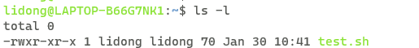

[TOC]


文件开头指明编译器的路径

```shell
#! /bin/bash
```

`.sh` 文件刚开始创建时本身是不可执行文件。修改文件权限即可

```shell
chomd +x test.sh   # 将 test.sh 文件变成可执行文件
```



执行可执行文件

```shell
./test.sh  # 当前目录下执行

/home/acs/test.sh  # 绝对路径下执行

~/test.sh # 家目录下执行
```

##### 注释

单行注释

```shell
# 单行注释
```

多行注释

```shell
:<< zs(任意可换)
.....
zs(与上面保持一致)
```

##### 变量

**变量的定义和使用**

注意：**变量名和赋值号之间不能有空格**

```shell
name=hdd

echo ${name}
```

**只读变量**

使用  `readonly`  或者  `declare`  可以将变量变为只读。

```shell
name=yxc
# 1:使用 readonly
readonly name

# 2:使用 declear
declare -r name  # 两种写法均可

name=abc  # 会报错，因为此时name只读
```

**删除变量**

`unset` 可以删除变量。

```shell
name=yxc
unset name
echo $name  # 输出空行
```

**变量类型**

- **局部变量(自定义变量)**局部变量在脚本或命令中定义，仅在当前shell实例中有效，其他shell启动的程序不能访问局部变量。
-  **环境变量** 所有的程序，包括shell启动的程序，都能访问环境变量，有些程序需要环境变量来保证其正常运行。必要的时候shell脚本也可以定义环境变量。
- **shell变量** shell变量是由shell程序设置的特殊变量。shell变量中有一部分是环境变量，有一部分是局部变量，这些变量保证了shell的正常运行

自定义变量改成环境变量：

```shell
acs@9e0ebfcd82d7:~$ name=hdd  # 定义变量
acs@9e0ebfcd82d7:~$ export name  # 第一种方法
acs@9e0ebfcd82d7:~$ declare -x name  # 第二种方法
```

```shell
# 改为环境变量之后这个命令就可以在子进程中使用
# 1：进入子进程
bash

# 运行环境变量
echo $name
# 输出
hdd

# 退出子继承 (或 ctrl + d)
exit
```

环境变量改为自定义变量：

```shell
acs@9e0ebfcd82d7:~$ export name=hdd  # 定义环境变量
acs@9e0ebfcd82d7:~$ declare +x name  # 改为自定义变量
```

**shell字符串**

```shell
name1='hdd'  # 单引号定义字符串
name2="hdd"  # 双引号定义字符串
name3=hdd    # 也可以不加引号，同样表示字符串
```

单引号字符串的限制：

- 单引号里的任何字符都会原样输出，单引号字符串中的变量是无效的；
- 单引号字串中不能出现单独一个的单引号（对单引号使用转义符后也不行），但可成对出现，作为字符串拼接使用。

双引号的优点：

- 双引号里可以有变量
- 双引号里可以出现转义字符

eg：

```shell
your_name="hdd"
str="Hello, I know you are \"$your_name\"! \n"
echo -e $str
```

输出结果

```shell
Hello, I know you are "hdd"! 
```

**获取字符串长度**

```shell
name="hdd"
echo ${#name}  # 输出3
```

**提取子串**

```shell
name="hello, hdd"
echo ${name:0:5}  # 提取从0开始的5个字符
```


##### 文件参数变量

在执行shell脚本时，可以向脚本传递参数。$1$是第一个参数，$2$是第二个参数，以此类推。特殊的，`$0` 是文件名（包含路径）。例如：

`test.sh` 文件

```shell
#! /bin/bash

echo "文件名："$0
echo "第一个参数："$1
echo "第二个参数："$2
echo "第三个参数："$3
echo "第四个参数："$4
```

执行该脚本

```shell
acs@9e0ebfcd82d7:~$ chmod +x test.sh 
acs@9e0ebfcd82d7:~$ ./test.sh 1 2 3 4
文件名：./test.sh
第一个参数：1
第二个参数：2
第三个参数：3
第四个参数：4
```

**其它参数相关变量**

| 参数         | 参数                                                         |
| ------------ | ------------------------------------------------------------ |
| `$#`         | 代表文件传入的参数个数，如上例中值为 4                       |
| `$*`         | 由所有参数构成的用空格隔开的字符串，如上例中值为`"$1 $2 $3 $4"` |
| `$@`         | 每个参数分别用双引号括起来的字符串，如上例中值为`"$1" "$2" "$3" "$4"` |
| `$$`         | 脚本当前运行的进程  ID                                       |
| `$?`         | 上一条命令的退出状态（注意不是stdout，而是exit code）。0表示正常退出，其他值表示错误 |
| `$(command)` | 返回  `command`  这条命令的  stdout（可嵌套）                |
| \`command\`  | 返回  `command`  这条命令的 stdout（不可嵌套）               |

##### 数组

数组中可以存放多个不同类型的值，只支持一维数组，初始化时不需要指明数组大小。
数组下标从 $0$ 开始。

**定义**
数组用小括号表示，元素之间用空格隔开。例如：

```shell
array=(1 abc "def" hdd)
```

也可以直接定义数组中某个元素的值：

```shell
array[0]=1
array[1]=abc
array[2]="def"
array[3]=yxc
```

读取数组中某个元素的值

```shell
${array[index]}
```

**读取整个数组**

```shell
${array[@]}  # 第一种写法
${array[*]}  # 第二种写法
```

**数组长度**

```shell
${#array[@]}  # 第一种写法
${#array[*]}  # 第二种写法
```

注意这里的数组长度是指被使用了多少个，不是下标的界限，而是下标的数量

##### expr 命令

`expr`  命令用于求表达式的值，格式为：

```
expr 表达式
```

表达式说明：

- 用空格隔开每一项

- 用反斜杠放在shell特定的字符前面（发现表达式运行错误时，可以试试转义）

- 对包含空格和其他特殊字符的字符串要用引号括起来

- expr 会在 stdout中输出结果。如果为逻辑关系表达式，则结果为真，stdout 为 1，否则为 0。

- **expr的 exit code：如果为逻辑关系表达式，则结果为真，exit code为0，否则为1。** `if` 章节有样例

**字符串表达式**

- `length str` 返回 `str` 的长度
- `index str charSet`  ，`charSet`中任意单个字符在 `str` 中最第一次出现的位置，**下标从 $1$ 开始**。如果 `str` 中不存在 `charSet` 中的字符 ， 返回 $0$ 。
- `substr str Start_post Sub_len` ，返回 `str` 中从 `Start_post` 位置开始的，长度为 `Sub_len` 的子串。如果 `Start_post` 或者 `Sub_len` 为负数，$0$ 或者非数值，则返回空字符串。

例如：

```shell
str="Hello World!"

echo `expr length "$str"`  # ``不是单引号，表示执行该命令，输出12
echo `expr index "$str" aWd`  # 输出7，下标从1开始
echo `expr substr "$str" 2 3`  # 输出 ell
```

**整数表达式**

`expr`  支持普通的算术操作，算术表达式优先级**低于**字符串表达式，**高于**逻辑关系表达式。

-  `+ , -`  加减运算。两端参数会转换为整数，如果转换失败则报错。
-  `* / %`   乘，除，取模运算。两端参数会转换为整数，如果转换失败则报错。
-  `()`   可以该表优先级，但需要用反斜杠转义

例如：

```shell
a=3
b=4

echo `expr $a + $b`  # 输出7
echo `expr $a - $b`  # 输出-1
echo `expr $a \* $b`  # 输出12，*需要转义
echo `expr $a / $b`  # 输出0，整除
echo `expr $a % $b` # 输出3
echo `expr \( $a + 1 \) \* \( $b + 1 \)`  # 输出20，值为(a + 1) * (b + 1)
```

**逻辑关系表达式**

-  `|`   (**短路或**) 如果第一个参数非空且非  $0$，则返回第一个参数的值，否则返回第二个参数的值，但要求第二个参数的值也是非空或非 $0$，否则返回 $0$ 。如果第一个参数是非空或非0时，不会计算第二个参数。
- `&`    (**短路与**)如果两个参数都非空且非0，则返回第一个参数，否则返回0。如果第一个参为0或为空，则不会计算第二个参数。
- `< <= = == != >= >`    比较两端的参数，如果为true，则返回1，否则返回0。”==”是”=”的同义词。”expr”首先尝试将两端参数转换为整数，并做算术比较，如果转换失败，则按字符集排序规则做字符比较。
- `()`   可以该表优先级，但需要用反斜杠转义

```shell
a=3
b=4

echo `expr $a \> $b`  # 输出0，>需要转义
echo `expr $a '<' $b`  # 输出1，也可以将 特殊字符 用引号引起来
echo `expr $a '>=' $b`  # 输出0
echo `expr $a \<\= $b`  # 输出1

c=0
d=5

echo `expr $c \& $d`  # 输出0
echo `expr $a \& $b`  # 输出3
echo `expr $c \| $d`  # 输出5
echo `expr $a \| $b`  # 输出3
```

##### read 命令

`read`  命令用于从标准输入中读取单行数据。当读到文件结束符时，exit code为1，否则为 $0$。

参数说明

-   `-p` 后面可以接提示信息
-   `-t` 后面跟秒数，定义输入字符的等待时间，超过等待时间后会自动忽略此命令。
-   `-n`  输入字符长度限制(达到6位，自动结束)
-   `-s`  隐藏输入内容

```shell
acs@9e0ebfcd82d7:~$ read name  # 读入name的值
houdong  # 标准输入

acs@9e0ebfcd82d7:~$ echo $name  # 输出name的值
houdong  #标准输出

# 读入name的值，等待时间30秒
acs@9e0ebfcd82d7:~$ read -p "Please input your name: " -t 30 name  

Please input your name: houdong  # 标准输入

acs@9e0ebfcd82d7:~$ echo $name  # 输出name的值
hdd  # 标准输出
```

read 命令一个一个词组地接收输入的参数，每个词组需要使用空格进行分隔；如果输入的词组个数大于需要的参数个数，则多出的词组将被作为整体为最后一个参数接收。

```shell
#! /bin/bash
read firstStr secondStr
echo "第一个参数:$firstStr; 第二个参数:$secondStr"
```

```shell
$ sh test.sh 
一 二 三 四
第一个参数:一; 第二个参数:二 三 四
```

```shell
#! /bin/bash
read -p "请输入一段文字:" -n 6  -s password
echo -e "\npassword is $password"
```

```shell
$ sh test.sh 
请输入一段文字:
password is asdfgh
```

##### echo 命令

`echo`  用于输出字符串。命令格式：

```shell
echo houdong
```

**显示普通字符串**

```shell
echo "Hello AC Terminal"
echo Hello AC Terminal  # 引号可以省略
```

**显示转义字符**

```shell
echo "\"Hello AC Terminal\""  # 注意只能使用双引号，如果使用单引号，则不转义
echo \"Hello AC Terminal\"  # 也可以省略双引号
```

**显示变量**

```shell
name=yxc
echo "My name is $name"  # 输出 My name is yxc
```

**显示换行**

```shell
echo -e "Hi\n"  # -e 开启文本格式符转义, 此时使用单引号也可开启文本格式符转义
echo "acwing"
```

输出结果：

```
Hi

acwing
```

```shell
# 可运行下面命令查看 开启 -e 后的转义
man echo
```

 **显示不换行**，echo 输出默认会换行，

```shell
echo -e "Hi \c" # -e 开启转义 \c 不换行
echo "acwing"
```

输出结果：

```
Hi acwing
```

**显示结果定向至文件**

```shell
# 将内容以覆盖的方式输出到output.txt中
echo "Hello World" > output.txt
```

**显示命令的执行结果**

```shell
echo `date`   # 或者 echo $(date)
```

输出结果：

```
Sun Jan 30 20:50:29 CST 2022
```

##### printf 命令

printf 命令用于格式化输出，类似于C/C++中的printf函数。

默认**不会在字符串末尾添加换行符。**

命令格式：  

```
printf format-string [arguments...]
```

```shell
#! /bin/bash
printf "%10d.\n" 123  # 占10位，右对齐
printf "%-10.2f.\n" 123.123321  # 占10位，保留2位小数，左对齐
printf "My name is %s\n" "yxc"  # 格式化输出字符串
printf "%d * %d = %d\n"  2 3 `expr 2 \* 3` # 表达式的值作为参数
```

输出结果

```
       123.
123.12    .
My name is yxc
2 * 3 = 6
```

| 序列 | 说明                                                         |
| ---- | ------------------------------------------------------------ |
| \a   | 警告字符，通常为ASCII的BEL字符                               |
| \b   | 后退                                                         |
| \c   | 抑制（不显示）输出结果中任何结尾的换行字符（只在%b格式指示符控制下的参数字符串中有效），而且，任何留在参数里的字符、任何接下来的参数以及任何留在格式字符串中的字符，都被忽略 |
| \f   | 换页（formfeed）                                             |
| \n   | 换行                                                         |
| \r   | 回车（Carriage return）                                      |
| \t   | 水平制表符                                                   |
| \v   | 垂直制表符                                                   |
| \\\  | 一个字面上的反斜杠字符                                       |

##### test 命令与判断符号 [ ]

**逻辑运算符&&和||**

- `&&` 表示与， `||` 表示或
- 二者具有短路原则：
   `expr1 && expr2`：当`expr1`为假时，直接忽略`expr2`
   `expr1 || expr2`：当`expr1`为真时，直接忽略`expr2`

-  表达式的  `exit code` 为   **0，表示真； **  为非零，表示假。(与C/C++中的定义相反)


**test命令**

在命令行中输入`man test`，可以查看  `test` 命令的用法。

`test`  命令用于判断文件类型，以及对变量做比较。

`test`  命令**用`exit code`返回结果**，而不是使用 `stdout`。**0表示真，非0表示假。**

例如：

```shell
test 2 -lt 3  # 为真，返回值为0    -lt 是小于
echo $?  # 输出上个命令的返回值，输出0
```

```shell
acs@9e0ebfcd82d7:~$ ls  # 列出当前目录下的所有文件
homework  output.txt  test.sh  tmp

acs@9e0ebfcd82d7:~$ test -e test.sh && echo "exist" || echo "Not exist"
exist  # test.sh 文件存在

acs@9e0ebfcd82d7:~$ test -e test2.sh && echo "exist" || echo "Not exist"
Not exist  # testh2.sh 文件不存在
```

**文件类型判断**

命令格式：

```shell
test -e filename  # 判断文件是否存在
```

参数：

-   `-e` 文件是否存在
-   `-f` 是否为文件
-   `-d`  是否为目录（文件夹）

**文件权限判断**

```shell
test -r filename  # 判断文件是否可读
```

-   `-r`  文件是否刻度
-   `-w`  文件是否可写
-   `-x`  文件是否可执行
-   `-s`  是否为非空文件

**整数间的比较**

命令格式：

```shell
test $a -eq $b  # a是否等于b
```

-   `-eq`  a 是否等于 b
-   `-ne`  a 是否不等于 b
-   `-gt`  a 是否大于 b
-   `-lt`  a 是否小于 b
-   `-ge`  a 是否大于等于 b
-   `-le`  a 是否小于等于 b

**字符串比较**

```shell
test -z "houdong" && echo "true" || echo "false"

s1="hou"
s2="hoa"
test -z $s1 /> $s2 && echo "true" || echo "false"
```

|                   测试参数                    |                         代表意义                          |
| :-------------------------------------------: | :-------------------------------------------------------: |
|                 `test -z str`                 |          判断 str 是否为空，如果为空，则返回true          |
|                 `test -n str`                 | 判断 str 是否为非空，如果为非空，则返回true（-n可以省略） |
|              `test str1 == str2`              |                   判断str1是否等于str2                    |
|              `test str1 != str2`              |                  判断str1是否不等于str2                   |
| `test str1 /< str2` 或者  `test str1 /> str2` |                   也支持大于或小于比较                    |

**多重条件判定**

命令格式：

`test -r filename -a -x filename`

-   `-a`  两条件是否同时成立
-   `-o` 两条件是否至少一个成立
-   `!`  取反。 eg： `test ! -x file ` 当 file 不可执行时，返回 true;

**判断符号 [ ]**

 **`[ ]`** 与 test 用法几乎一模一样，更常用于 `if` 语句中。另外 `[ [ ] ]` 是 `[ ]` 的加强版，支持的特性更多。

例如：

```shell
[ 2 -lt 3 ]  # 为真，返回值为0
echo $?  # 输出上个命令的返回值，输出0
```

```shell
acs@9e0ebfcd82d7:~$ ls  # 列出当前目录下的所有文件
homework  output.txt  test.sh  tmp


acs@9e0ebfcd82d7:~$ [ -e test.sh ] && echo "exist" || echo "Not exist"
exist  # test.sh 文件存在


acs@9e0ebfcd82d7:~$ [ -e test2.sh ] && echo "exist" || echo "Not exist"
Not exist  # testh2.sh 文件不存在
```

注意：

- `[  ]` 内的每一项都要用空格隔开
- 中括号内的变量，最好用双引号括起来
- 中括号内的常数，最好用单或双引号括起来

```shell
# 注意 字符串中有空格时
name=lidong hdd

# 会报错。 $name 会被解析为 lidong hdd == 右边这使得参数大于 1 个
[ $name == "lidong hdd"]  

# 正确写法
[ "$name" == "lidong hdd"]
```

##### 判断语句

**`if…then形式 `**   类似于C/C++中的if-else语句。

**单层if**

```shell
if condition
then
    语句1
    语句2
    ...
fi
```

示例

```shell
a=3
b=4

if [ "$a" -lt "$b" ] && [ "$a" -gt 2 ]
then
    echo ${a}在范围内
fi
```

```shell
expr 3 == 3
echo $?    # 会输出 0


if expr 3 == 3   # expr 在逻辑表达式中输出 1
then
	echo "hhh"
fi
```

输出结果：

```
3在范围内
```

**单层if-else**

```shell
if condition
then
    语句1
    语句2
    ...
else
    语句1
    语句2
    ...
fi
```

示例：

```shell
a=3
b=4

if ! [ "$a" -lt "$b" ]
then
    echo ${a}不小于${b}
else
    echo ${a}小于${b}
fi
```

输出结果：

```
3小于4
```

**多层if-elif-elif-else**

命令格式

```shell
if condition
then
    语句1
    语句2
    ...
elif condition
then
    语句1
    语句2
    ...
elif condition
then
    语句1
    语句2
else
    语句1
    语句2
    ...
fi
```

示例：

```shell
a=4

if [ $a -eq 1 ]
then
    echo ${a}等于1
elif [ $a -eq 2 ]
then
    echo ${a}等于2
elif [ $a -eq 3 ]
then
    echo ${a}等于3
else
    echo 其他
fi
```

输出结果：

```
其他
```

**case…esac形式**

类似于C/C++中的switch语句。

命令格式

```shell
case $变量名称 in
    值1)
        语句1
        语句2
        ...
        ;;  # 类似于C/C++中的break
    值2)
        语句1
        语句2
        ...
        ;;
    *)  # 类似于C/C++中的default
        语句1
        语句2
        ...
        ;;
esac
```

示例：

```shell
a=4

case $a in
    1)
        echo ${a}等于1
        ;;
    2)
        echo ${a}等于2
        ;;
    3)                                                
        echo ${a}等于3
        ;;
    *)
        echo 其他
        ;;
esac
```

输出结果：

```
其他
```

##### 循环语句

**for…in…do…done**

命令格式：

```shell
for var in val1 val2 val3
do
    语句1
    语句2
    ...
done
```

示例1，输出a 2 cc，每个元素一行：

```shell
for i in a 2 cc
do
    echo $i
done
```

示例2，输出当前路径下的所有文件名，每个文件名一行：

```shell
for file in `ls`
do
    echo $file
done
```


