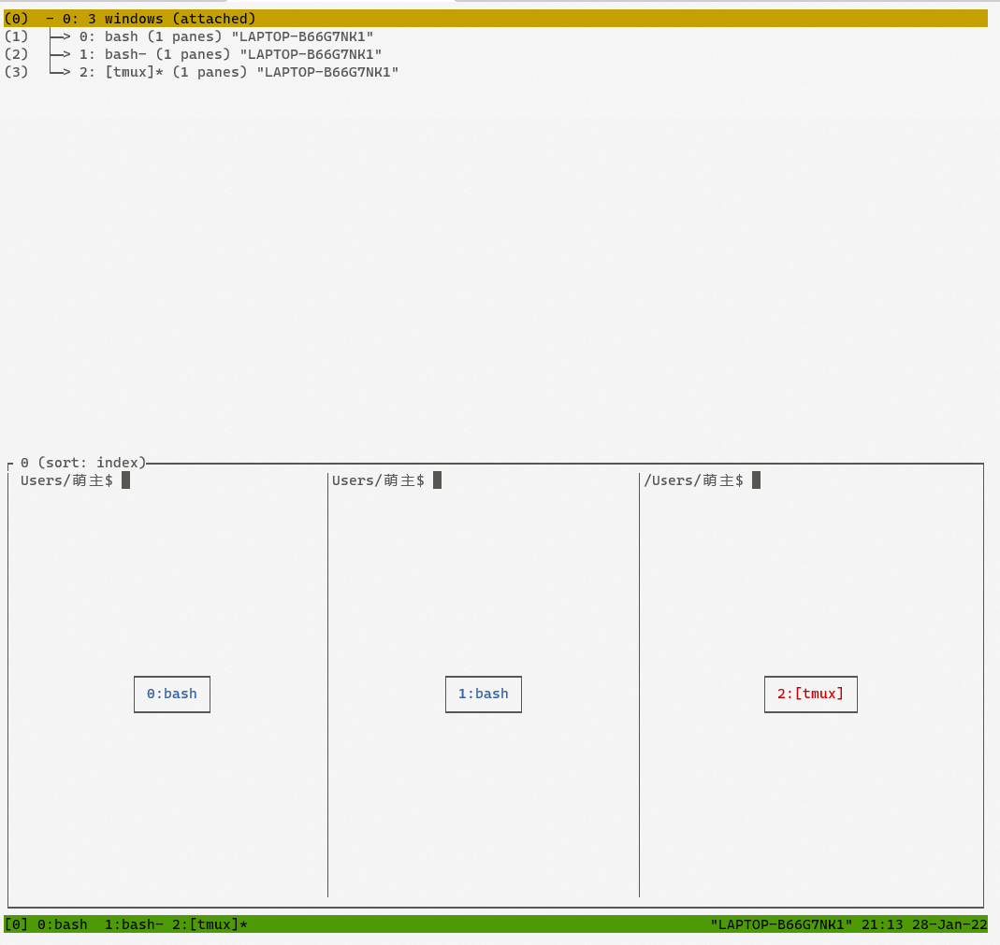

[TOC]


### tmux

Teminal MultipleXer : 终端复用器

重要功能：同时开多个窗口，断点复用。

**结构：**

​		一个 tmux 可以包含多个 session ，一个 session 可以包含多个 window,一个 window 可以包含多个 pane。

实例：

```
       tmux:
            session 0:
                window 0:
                    pane 0
                    pane 1
                    pane 2
                    ...
                window 1
                window 2
                ...
            session 1
            session 2
            ...
```

```shell
# 启动命令 
tmux 

# 启动一个名为 lidong_1 的 session 
tmux new -s lidong_1

# 要想保留 当前 session 的数据 ，
# 先按 Ctrl + b , 松开后按 d. 就可已保存当前 session了

# 重启之前的 lidong_1 session 服务
tmux a -t lidong_1
```

操作：

(1) tmux：新建一个session，其中包含一个window，window中包含一个pane，pane里打开了一个shell对话框。

(2) 按下 `Ctrl + b` 后手指松开，然后按  `%`：将当前pane左右平分成两个pane。

(3) 按下  `Ctrl + b`  后手指松开，然后按  `"`（注意是双引号"）：将当前pane上下平分成两个pane

(4) `Ctrl + d`：关闭当前pane；如果当前window的所有pane均已关闭，则自动关闭window；如果当前session的所有window均已关闭，则自动关闭session。

(5) 鼠标点击可以选pane。 (AC  Teminal)

(6) 按下  `ctrl + b`  后手指**松开**，然后按方向键：选择相邻的pane。

(7) 鼠标拖动pane之间的分割线，可以调整分割线的位置。(AC  Teminal)

(8) 按住  `ctrl + b`  的**同时**按方向键，可以调整pane之间分割线的位置。

(9) 按下 `ctrl + b`  后手指松开，然后按 `z`：将当前pane全屏/取消全屏。

(10) 按下  `ctrl + b`  后手指松开，然后按 d：挂起当前session。

(11) tmux a：打开之前挂起的session。

(12) 按下  `ctrl + b`  后手指松开，然后按  `s`：选择其它session。
        方向键 —— 上：选择上一项 session/window/pane
        方向键 —— 下：选择下一项 session/window/pane
        方向键 —— 右：展开当前项 session/window
        方向键 —— 左：闭合当前项 session/window

(13) 按下  `Ctrl + b` 后手指松开，然后按  `c` ：在当前session中创建一个新的window。

(14) 按下  `Ctrl + b`  后手指松开，然后按  `w`：选择其他window，操作方法与(12)完全相同。



(15) 按下   `Ctrl + b`  后手指松开，然后按`PageUp`：翻阅当前pane内的内容。

(16) 鼠标滚轮：翻阅当前pane内的内容。

(17) 在tmux中选中文本时，需要按住`shift`键。（仅支持Windows和Linux，不支持Mac，不过该操作并不是必须的，因此影响不大）

(18) tmux中复制/粘贴文本的通用方式：

​		(1) 按下  `Ctrl + b`  后松开手指，然后按  `[`
​		(2) 用鼠标选中文本，被选中的文本会被自动复制到tmux的剪贴板 (AC  Teminal)
​        (3) 按下  `Ctrl + b` 后松开手指，然后按   `]` ，会将剪贴板中的内容粘贴到光标处

### vim

```
功能：
    (1) 命令行模式下的文本编辑器。
    (2) 根据文件扩展名自动判别编程语言。支持代码缩进、代码高亮等功能。
    (3) 使用方式：vim filename
        如果已有该文件，则打开它。
        如果没有该文件，则打开个一个新的文件，并命名为filename
模式：
    (1) 一般命令模式
        默认模式。命令输入方式：类似于打游戏放技能，按不同字符，即可进行不同操作。可以复制、粘贴、删除文本等。
    (2) 编辑模式
        在一般命令模式里按下i，会进入编辑模式。
        按下ESC会退出编辑模式，返回到一般命令模式。
    (3) 命令行模式
        在一般命令模式里按下:/?三个字母中的任意一个，会进入命令行模式。命令行在最下面。
        可以查找、替换、保存、退出、配置编辑器等。
操作：
    (1) i：进入编辑模式
    (2) ESC：进入一般命令模式
    (3) h 或 左箭头键：光标向左移动一个字符
    (4) j 或 向下箭头：光标向下移动一个字符
    (5) k 或 向上箭头：光标向上移动一个字符
    (6) l 或 向右箭头：光标向右移动一个字符
    (7) n<Space>：n表示数字，按下数字后再按空格，光标会向右移动这一行的n个字符
    (8) 0 或 功能键[Home]：光标移动到本行开头
    (9) $ 或 功能键[End]：光标移动到本行末尾
    (10) G：光标移动到最后一行
    (11) :n 或 nG：n为数字，光标移动到第n行
    (12) gg：光标移动到第一行，相当于1G
    (13) n<Enter>：n为数字，光标向下移动n行
    (14) /word：向光标之下寻找第一个值为word的字符串。
    (15) ?word：向光标之上寻找第一个值为word的字符串。
    (16) n：重复前一个查找操作
    (17) N：反向重复前一个查找操作
    (18) :n1,n2s/word1/word2/g：n1与n2为数字，在第n1行与n2行之间寻找word1这个字符串，并将该字符串替换为word2
    (19) :1,$s/word1/word2/g：将全文的word1替换为word2
    (20) :1,$s/word1/word2/gc：将全文的word1替换为word2，且在替换前要求用户确认。
    (21) v：选中文本
    (22) d：删除选中的文本
    (23) dd: 删除当前行
    
    (24) y：复制选中的文本
    
    (25) yy: 复制当前行
    
    (26) p: 将复制的数据在光标的下一行 / 下一个位置粘贴
    
    (27) u：撤销
    (28) Ctrl + r：取消撤销
    (29) 大于号 >：将选中的文本整体向右缩进一次
    (30) 小于号 <：将选中的文本整体向左缩进一次
    (31) :w 保存
    (32) :w! 强制保存
    (33) :q 退出
    (34) :q! 强制退出
    (35) :wq 保存并退出
    
    (36) :set paste 设置成粘贴模式，取消代码自动缩进 
    
    (37) :set nopaste 取消粘贴模式，开启代码自动缩进
    (38) :set nu 显示行号
    (39) :set nonu 隐藏行号
    (40) gg=G：将全文代码格式化
    (41) :noh 关闭查找关键词高亮
    (42) Ctrl + q：当vim卡死时，可以取消当前正在执行的命令
异常处理：
    每次用vim编辑文件时，会自动创建一个.filename.swp的临时文件。
    如果打开某个文件时，该文件的swp文件已存在，则会报错。此时解决办法有两种：
        (1) 找到正在打开该文件的程序，并退出
        (2) 直接删掉该swp文件即可


```

组合键

```shell
# 删除所有
gg d G 

# 格式化文件s
gg = G


```

