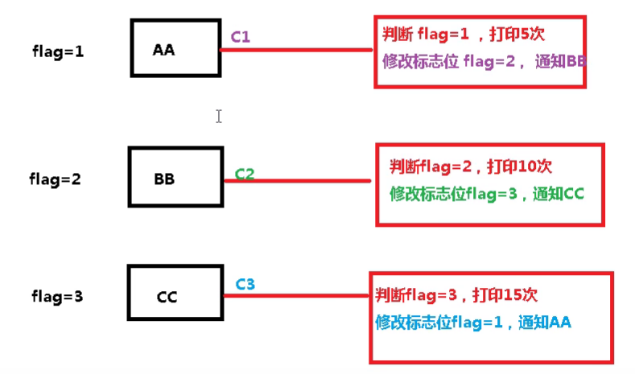

[TOC]


## JUC基础

```
JUC　是 java.util.concurrent 工具包的简介，这是处理线程的工具包。
```

### 进程和线程

```
进程（Process） 是计算机中的程序关于某数据集合上的一次运行活动，

是系统进行资源分配和调度的基本单位，是操作系统结构的基础。 
在当代面向线程设计的计算机结构中，进程是线程的容器。
程序是指令、数据及其组织形式的描述，进程是程序的实体。
是计算机中的程序关于某数据集合上的一次运行活动，是系统进行资源分配和调度的基本单位，
是操作系统结构的基础。

程序是指令、数据及其组织形式的描述，进程是程序的实体
```

```
线程（thread） 是操作系统能够进行运算调度的最小单位。
它被包含在进程之中，是进程中的实际运作单位。
一条线程指的是进程中一个单一顺序的控制流，一个进程中可以并发多个线程，每条线程并行执行不同的任务。

```

### 并发和并行

1：串行：串行是一次只能取得一个任务，并执行这个任务。

2：并行：并行意味着可以同时取得多个任务，并同时去执行所取得的这些任务。

3：并发：同一时刻多个线程在访问同一个资源，多个线程对一个点。

### 管程

管程(monitor)是保证了同一时刻只有一个进程在管程内活动,即管程内定义的操作在同 一时刻只被一个进程调用(由编译器实现).但是这样并不能保证进程以设计的顺序执行 JVM 中同步是基于进入和退出管程(monitor)对象实现的，每个对象都会有一个管程 (monitor)对象，管程(monitor)会随着 java 对象一同创建和销毁 执行线程首先要持有管程对象，然后才能执行方法，当方法完成之后会释放管程，方 法在执行时候会持有管程，其他线程无法再获取同一个管程

### 用户线程

**用户线程**:平时用到的普通线程,自定义线程 

**守护线程**:运行在后台,是一种特殊的线程,比如垃圾回收 当主线程结束后,用户线程还在运行,JVM 存活 如果没有用户线程,都是守护线程,JVM 结束

#### 多线程编程步骤

```
1：创建资源类，在资源类中创建属性和操作方法。
2：在资源类中操作方法
	2.1：判断
	2.2：干活
	2.3：通知   <- 线程间的通信
3：创建多个线程。调用资源类的操作方法。
4: 防止虚假唤醒问题。
```

#### 卖票实例

```java
// 使用 synchronized 同步方法

public class BuyTicket {
    public static void main(String[] args) {
        TicketNum ticketNum = new TicketNum();
		
        //  创建线程。
        //  使用的是  Thread(Runnable r,String threadname) 构造器
        new Thread(() -> {
            for (int i = 0 ; i < 40 ;i++){
                ticketNum.sale();
            }

        },"aa").start();
        new Thread(() -> {
            for (int i = 0 ; i < 40 ;i++){
                ticketNum.sale();
            }

        },"bb").start();
        new Thread(() -> {
            for (int i = 0 ; i < 40 ;i++){
                ticketNum.sale();
            }

        },"cc").start();


    }

}
//  资源类
class TicketNum{
    private int ticket = 30;

    public synchronized void sale(){
        if(ticket > 0){
            System.out.println(Thread.currentThread().getName()+ " : 卖出 " + (ticket--) + " :  剩下 : " + ticket);
        }

    }

}
```


```java
// 使用 Lock 中的 可重入锁 ReentrantLock 


public class BuyTicket_2 {
    public static void main(String[] args) {
        TicketNum_2 ticketNum = new TicketNum_2();

        new Thread(() -> {
            for (int i = 0 ; i < 40 ;i++){
                ticketNum.sale();
            }

        },"BB").start();
        new Thread(() -> {
            for (int i = 0 ; i < 40 ;i++){
                ticketNum.sale();
            }

        },"AA").start();
        new Thread(() -> {
            for (int i = 0 ; i < 40 ;i++){
                ticketNum.sale();
            }

        },"CC").start();
    }

}
//  创建资源类
class TicketNum_2{
    private int ticket = 30;

    //  创建可重入锁
    public final ReentrantLock lock = new ReentrantLock();

    //  卖票
    public  void sale(){
        lock.lock();   // 上锁

        //  避免出现s
        try{
            if(ticket > 0){
                System.out.println(Thread.currentThread().getName()+ " : 卖出 " + (ticket--) + " :  剩下 : " + ticket);
            }
        }finally {
            lock.unlock();  //  解锁，
        }

    }
}
```

#### synchronized 与 Lock 的区别

```
1：Lock 是一个接口， 而 synchronized 是一个关键字，synchronized 是内置的语言实现；


2. synchronized 在发生异常时，会自动释放线程占有的锁，因此不会导致死锁现
	象发生；而 Lock 在发生异常时，如果没有主动通过 unLock()去释放锁，则很
	可能造成死锁现象，因此使用 Lock 时需要在 finally 块中释放锁；
	
	
3. Lock 可以让等待锁的线程响应中断，而 synchronized 却不行，使用
	synchronized 时，等待的线程会一直等待下去，不能够响应中断；
	
	
4. 通过 Lock 可以知道有没有成功获取锁，而 synchronized 却无法办到。

5. Lock 可以提高多个线程进行读操作的效率。
	在性能上来说，如果竞争资源不激烈，两者的性能是差不多的，而当竞争资源
	非常激烈时（即有大量线程同时竞争），此时 Lock 的性能要远远优于synchronized。

```


#### synchronized 的线程通信

```
wait() 使当前等待，等待其他线程 通知，wait 方法在那里 沉睡，就会在那里被唤醒。

notifyAll() 通知除当前线程之外的其他线程。

notify()  唤醒一个线程
```

#### 线程通信间的一些问题

```
1：虚假通信 ：
	wait()  -->  不在循环中使用时，有可能就会出现这种问题。
	即：我们必须把放在  wait()  循环中使用。
	主要是由 wait() 方法的机制引起，因为 wait() 方法在哪里睡，就会在哪里醒，所以醒来之后
的之前的 判断条件可以不会被执行，但是将其写在循环之中就不会出现 不被判断的情况。
	
虚假唤醒：
+1           -1            +1              -1
AA           BB            CC              DD

当  AA 完成操作之后，会通知其他线程，   BB  CC　DD　都会被通知到，那么就会出现不稳定性，

```


```java
//  实现对资源类的属性    +1     -1   操作

/**
 * @author dong
 * @create 2021-10-20 11:36
 *
 * 线程之间的基本通信
 *
 */
public class ThreadCommunication {
    public static void main(String[] args) {
        share share = new share();

        //  +1线程
        new Thread(() ->{

            for (int i = 0 ; i <= 10; i++){

                try {
                    share.addNumber();
                } catch (InterruptedException e) {
                    e.printStackTrace();
                }

            }

        },"AA").start();

        //  -1 线程
        new Thread(() ->{

            for (int i = 0 ; i <= 10; i++){

                try {
                    share.subNumber();
                } catch (InterruptedException e) {
                    e.printStackTrace();
                }

            }

        },"BB").start();
        //  +1线程
        new Thread(() ->{

            for (int i = 0 ; i <= 10; i++){

                try {
                    share.addNumber();
                } catch (InterruptedException e) {
                    e.printStackTrace();
                }

            }

        },"CC").start();

        //  -1 线程
        new Thread(() ->{

            for (int i = 0 ; i <= 10; i++){

                try {
                    share.subNumber();
                } catch (InterruptedException e) {
                    e.printStackTrace();
                }

            }

        },"DD").start();


    }
}
//  创建资源类
class share{
    private int Number = 0;

    //  + 1 的操作
    public synchronized void addNumber() throws InterruptedException {

        // if(Number != 0){ //  判断 Number 是否为 0 ，如果不是，等待
            //  wait() 沉睡被唤醒时也会在这，不会再次执行 if 判断，所以就会出现问题。
        //    this.wait(); 
        //}
        
        while(Number != 0){ 
            this.wait();
        }
        

        //  如果 number 的值是 0 ,则 +1
        Number ++;
        System.out.println(Thread.currentThread().getName() +" :: " + Number);

        //  通知其他线程
        this.notifyAll();
    }

    //  - 1 的操作
    public synchronized void subNumber() throws InterruptedException {
        //if(Number != 1){ //  判断 Number 是否为 1 ，如果不是，等待
        //    this.wait();
        //}
		
        while(Numbwe != 1){
            this.wait();
        }  
        
        Number --;
        System.out.println(Thread.currentThread().getName() +" :: " + Number);

        //  通知其他线程
        this.notifyAll();
    }

}

```

#### 使用 Lock 接口实现 线程通信

```
Condition 类中的方法负责负责实现  Lock 锁的之间的线程通信。 

await()  等待线程唤醒

signalAll()  唤醒所有等待线程

signal()  唤醒一个等待线程

```

```java
import java.util.concurrent.locks.Condition;
import java.util.concurrent.locks.Lock;
import java.util.concurrent.locks.ReentrantLock;
/**
 * @author dong
 * @create 2021-11-03 9:04
 */
public class Main {
    public static void main(String[] args) {
        Share share = new Share();

        new Thread(()->{
            for (int i = 0 ; i < 10 ;i++ )
            {
                try {
                    share.incr();
                } catch (InterruptedException e) {
                    e.printStackTrace();
                }
            }
        },"AAA").start();

        new Thread(()->{
            for (int i = 0 ; i < 10 ;i++ )
            {
                try {
                    share.decr();
                } catch (InterruptedException e) {
                    e.printStackTrace();
                }
            }
        },"BBB").start();

        new Thread(()->{
            for (int i = 0 ; i < 10 ;i++ )
            {
                try {
                    share.incr();
                } catch (InterruptedException e) {
                    e.printStackTrace();
                }
            }
        },"CCC").start();
        new Thread(()->{
            for (int i = 0 ; i < 10 ;i++ )
            {
                try {
                    share.decr();
                } catch (InterruptedException e) {
                    e.printStackTrace();
                }
            }
        },"DDD").start();


    }
}

class Share{
    private int Number = 0;

    //  创建 Lock
    private Lock lock = new ReentrantLock();
    private Condition condition = lock.newCondition();

    //  +1
    public void incr() throws InterruptedException {
        //  上锁
        lock.lock();

        try {
            //   判断
            while (Number != 0){
                condition.await();
            }
            //  干活
            Number++;
            System.out.println(Thread.currentThread().getName() + " :: " + Number);

            //  通知
            condition.signalAll();
        }finally {
            lock.unlock();
        }

    }

    //  -1
    public void decr() throws InterruptedException {
        lock.lock();

        try {
            while(Number != 1){
                condition.await();
            }
            
            Number--;
            System.out.println(Thread.currentThread().getName()+" :: " +Number);

            condition.signalAll();
        }finally {
            lock.unlock();
        }


    }

}

```

#### 线程间的定制化通信

```
当有 多个线程同时使用同一个资源，需要 这些线程按照特定的顺序执行。
eg:
 AA 打印 5 次，BB 打印 10 次， CC 打印 15 次    进行 10 轮。
 
```



```java
import java.util.concurrent.locks.Condition;
import java.util.concurrent.locks.Lock;
import java.util.concurrent.locks.ReentrantLock;

/**
 * @author dong
 * @create 2021-11-03 9:27
 */
public class Main {
    public static void main(String[] args) {
        var sr = new ShareResource();

        new Thread(() -> {
            for(int i = 1; i <= 10 ; i++) {
                try {
                    sr.print5(i);
                } catch (InterruptedException e) {
                    e.printStackTrace();
                }
            }

        },"AA").start();
        new Thread(() -> {
            for(int i = 1; i <= 10 ; i++) {
                try {
                    sr.print10(i);
                } catch (InterruptedException e) {
                    e.printStackTrace();
                }
            }

        },"BB").start();
        new Thread(() -> {
            for(int i = 1; i <= 10 ; i++) {
                try {
                    sr.print15(i);
                } catch (InterruptedException e) {
                    e.printStackTrace();
                }
            }

        },"CC").start();

    }

}

class ShareResource{
    //  定义标志位
    private int flag = 1;  //  1  AA,    2 BB,     3 CC
    //  创建  Lock 锁
    private Lock lock = new ReentrantLock();

    //  创建 三个 condition
    private Condition c1 = lock.newCondition();
    private Condition c2 = lock.newCondition();
    private Condition c3 = lock.newCondition();

    //  打印 5 次的方法
    public void print5(int loop) throws InterruptedException {
        lock.lock();

        try {
            while(flag != 1){
                c1.await();  //  沉睡  c1
            }
            for (int i = 1 ; i <= 5 ;i++) {
                System.out.println(Thread.currentThread().getName()+" :: "+ i +" ：轮数 ：" + loop);
            }
            flag = 2;
            c2.signal(); //  唤醒  c2

        }finally {
            lock.unlock();
        }
    }
    //  打印 10 次的方法
    public void print10(int loop) throws InterruptedException {
        lock.lock();

        try {
            while(flag != 2){
                c2.await();  //  沉睡  c2
            }
            for (int i = 1 ; i <= 10 ;i++) {
                System.out.println(Thread.currentThread().getName()+" :: "+ i +" ：轮数 ：" + loop);
            }
            flag = 3;
            c3.signal(); //  唤醒  c3

        }finally {
            lock.unlock();
        }
    }
    //  打印 15 次的方法
    public void print15(int loop) throws InterruptedException {
        lock.lock();

        try {
            while(flag != 3){
                c3.await();  //  沉睡  c3
            }
            for (int i = 1 ; i <= 15 ;i++) {
                System.out.println(Thread.currentThread().getName()+" :: "+ i +" ：轮数 ：" + loop);
            }
            flag = 1;
            c1.signal(); //  唤醒  c1

        }finally {
            lock.unlock();
        }
    }


}
```

### 集合的线程安全

1：线程不安全集合 ： List 

```java
public class Main {
    public static void main(String[] args) {

        List<String> list = new ArrayList<>();
        for (int i = 0 ; i < 30 ; i++){
            new Thread(() -> {
               list.add(UUID.randomUUID().toString().substring(0,8));
                System.out.println(list);
            },String.valueOf(i)).start();
        }

    }

}

```

2：原始解决方案：

- 使用  线程安全的 Vector
- 使用  Collections  类中的线程安全的方法

```java
public class Main {
    public static void main(String[] args) {
		
        //  使用线程安全的  Vector
        // list<String> list = new Vector<>();
        
        // 使用  Collections 中线程线程安全的 方法
        List<String> list = Collections.synchronizedList(new ArrayList<>());

        for (int i = 0 ; i < 10 ; i++){
            new Thread(() -> {
                list.add(UUID.randomUUID().toString().substring(0,8));
                System.out.println(list);
            },String.valueOf(i)).start();
        }

    }

}
```

3： JUC 解决方法

- 使用  CopyOnWriteArrayList 类

```java
public class Main {
    public static void main(String[] args) {
		
        //  使用  CopyOnWriteArrayList 类来实例化  List 使得 List 线程安全
        List<String> list = new CopyOnWriteArrayList<>();

        for (int i = 0 ; i < 10 ; i++){
            new Thread(() -> {
                list.add(UUID.randomUUID().toString().substring(0,8));
                System.out.println(list);
            },String.valueOf(i)).start();
        }
    }
}
```

```java
//  CopyOnWriteList 的原理 ：  写时复制技术
初始的时候 多个线程 都来 并发的 读取 数据，
    若 某个线程 需要写入，就是 独立写，写的时候时将原来的数据 复制一份，
    并在其中写入新的内容，并且写完之后，这份新的数据会覆盖合并原先的数据，其他线程再次来读
   	时，读的就是这份复制之后加入新的内容的数据。

```


eg:  CopyOnWriteArrayList 源码中的  add() 方法

```java
//  jdk-11
public boolean add(E e) {
        synchronized (lock) {
            Object[] es = getArray();
            int len = es.length;
            es = Arrays.copyOf(es, len + 1);
            es[len] = e;
            setArray(es);
            return true;
        }
    }
```

4：HashSet  线程不安全

```java
//  HashSet 底层调用的就是 HashMap，只不过  HashSet 是不能放入重复元素

public class Main {
    public static void main(String[] args) {
        var set = new HashSet<String>();
        for (int i = 0 ; i < 100 ; i++){
            new Thread(() -> {
                set.add(UUID.randomUUID().toString().substring(0,8));
                System.out.println(set);
            },String.valueOf(i)).start();
        }
        
    }
}
//  会产生 java.util.ConcurrentModificationException 并发异常
```

解决方法：使用  CopyOnWrireArraySet  类 

```java
public class Main {
    public static void main(String[] args) {
       // 使用  CopyOnWriteArraySer 类
        var set = new CopyOnWriteArraySet<>(); 
        for (int i = 0 ; i < 100 ; i++){
            new Thread(() -> {
                set.add(UUID.randomUUID().toString().substring(0,8));
                System.out.println(set);
            },String.valueOf(i)).start();
        }

    }
}
```

5：线程不安全的  HashMap 

```java
public class Main {
    public static void main(String[] args) {

        var map = new HashMap<String,String>();

        for (int i = 0 ; i < 100 ; i++){
            String key = String.valueOf(i);
            new Thread(() -> {
                map.put(key,UUID.randomUUID().toString().substring(0,8));
                System.out.println(map);
            },String.valueOf(i)).start();
        }

    }
}
//  会产生 java.util.ConcurrentModificationException 并发异常
```

- 解决方法： 使用  ConcurrentHashMap  类


```java
public class Main {
    public static void main(String[] args) {

        var map = new ConcurrentH<String,String>();

        for (int i = 0 ; i < 100 ; i++){
            String key = String.valueOf(i);
            new Thread(() -> {
                map.put(key,UUID.randomUUID().toString().substring(0,8));
                System.out.println(map);
            },String.valueOf(i)).start();
        }

    }
}
```

### 多线程锁  --  线程八锁

```


```


