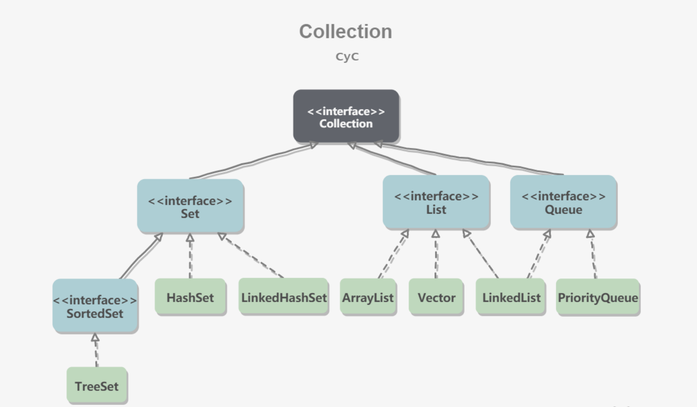
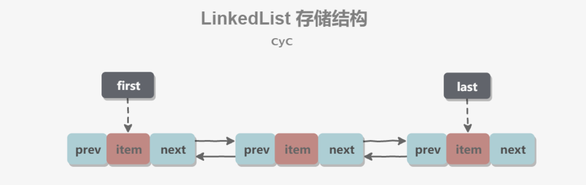
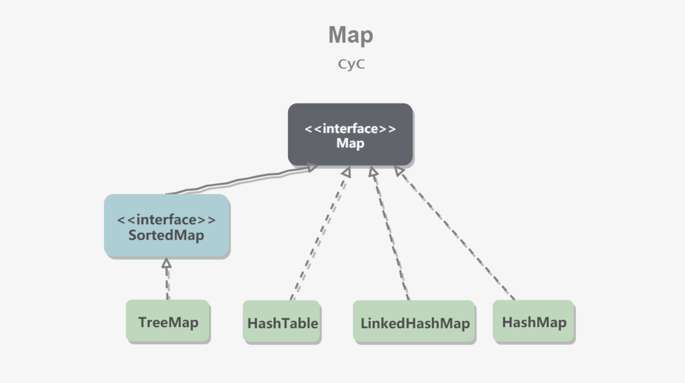

[TOC]


## Collection



Collection 存储着对象的集合

**抽象方法**

```
1：增：
add(Object e)   添加一个元素

addAll(Collection c)  将 c 加至容器中

2：删： 
remove(Object e)    删除一个元素

removeAll(Collection c)  


3: 查
contains(Object e)

containsAll(Collection c)

4：其他
size()  元素个数

isEmpty()  判空

clear()  清空

```

### set

**元素不可重复**

#### TreeSet

TreeSet：基于红黑树实现，**支持有序性操作**，例如根据一个范围查找元素的操作。但是查找效率不如 HashSet，HashSet 查找的时间复杂度为 O(1)，TreeSet 则为 O(logN)。

```
保证元素唯一性的依据 
compareTo 方法 return 0  TreeSet 中就只会有一个 元素 

如果不想保证元素的唯一性，改一下compare方法就可以了，永远不要让它返回0。
                
        1：自然排序：
               TreeSet排序的第一种方式,让元素自身具备比较性, 
               元素需要实现Comparable接口,覆盖compareTo 方法 
               这种方式 也成为元素的自然顺序,或者叫默认顺序. 
        
        2：比较器排序：
               TreeSet的第二种排序方式. 
               当元素自身不具备比较性时,或者具备的比较性不是所需要的 . 
               这是就需要让集合自身具备比较性. 
               在集合初始化时,就有了比较方式. 
两种方式的区别：
TreeSet构造函数什么都不传，默认按照类中Comparable的顺序(没有就报ClassCastException)
TreeSet如果传入Comparator，就优先按照Comparator

```

#### HashSet

HashSet：基于哈希表实现，支持快速查找，但不支持有序性操作。并且失去了元素的插入顺序信息，也就是说使用 Iterator 遍历 HashSet 得到的结果是不确定的。

```


```

#### LinkedHashSet

LinkedHashSet：具有 HashSet 的查找效率，并且内部使用双向链表维护元素的插入顺序。

```


```

### List

**动态数组，元素可以有序可以重复**

**常用方法**

```
1：增：
void add(object e)   
					在容器的最后添加一个元素
					
2：删
remove(int index)
					删除 index 位置的元素
remove(Object e)
					删除 e 元素
					
3：查
Object get(int index) 
					获取 index 位置的元素

4：插
Object set(int index,Object e)
					设置指定的 index 位置元素为 e
					
void add(int index , Object e)         
					在 index 位置插入 ele 元素

boolean addAll (int index, Collection c)
					从 index 位置开始将 c 中的所有元素添加进来

5:其他：
int indexOf (Object e)
					返回 e 在集合中首次出现的位置

int lastIndexOf (Object e)
				返回 e 在当前集合中末次出现的位置
				
List subList (int fromIndex , int toIndex) 
				返回从 fromIndex 到 toIndex位置的子集合

```


```
遍历：
	①：iterator()迭代器实现
	②：增强for循环
	③：普通的循环 -->利用size()和get(int index)方法

```


#### ArrayList

ArrayList：基于动态数组实现，支持随机访问。

```
1：线程不安全。效率高
2：底层使用 Object[]  实现
3：变长数组。
4：继承了  RandomAccess接口，支持快速随机访问。

注意点：
1：ArrayList 动态变成 在时间和空间上开销很大， 最好在一开始指定 长度。减少扩容次数
2：删除时调用 System.arraycopy() 将 index+1 后面的元素都复制到 index 位置上，该操作的时间复杂度为 O(N)。代价很高

```

**新增方法**

```java
void addFirst(Object obj) 


void addLast(Object obj) 


Object getFirst() 


Object getLast() 


Object removeFirst() 


Object removeLast() 

```


#### Vector

Vector：和 ArrayList 类似，但它是线程安全的。

```
1：线程安全，效率低
2：底层使用Object[ ]来存
3：太古老，一般不用。
```

#### LinkedList

LinkedList：基于双向链表实现，只能顺序访问，但是可以快速地在链表中间插入和删除元素。不仅如此，LinkedList 还可以用作栈、队列和双向队列。



```
1：基于双向链表实现，使用 Node 存储链表节点信息。
2：线程不安全，效率高
3：内部声明了Node类型的first和last属性，默认值为null
4：链表 不支持随机访问， 但是对于频繁的插入，删除效率更高。

```

### Queue

```

```

#### PriorityQueue

```
基于堆结构实现，可以用它来实现优先队列。


```


## Map



- TreeMap：基于红黑树实现。

- HashMap：基于哈希表实现。

- HashTable：和 HashMap 类似，但它是线程安全的，这意味着同一时刻多个线程同时写入 HashTable 不会导致数据不一致。它是遗留类，不应该去使用它，而是使用 ConcurrentHashMap 来支持线程安全，ConcurrentHashMap 的效率会更高，因为 ConcurrentHashMap 引入了分段锁。

- LinkedHashMap：使用双向链表来维护元素的顺序，顺序为插入顺序或者最近最少使用（LRU）顺序。

Map 中的抽象方法

```
put()   putAll()   remove()   clear()   
get()   containsKey()   size()   isEmpty()   equals()
KeySet()    values()    entrySet()
```

```java
//   1：添加，删除，修改：
Object put(Object key, Object value)
将指定 key-value 添加到或修改当前 map 对象中


putAll(Map m);
将 m 中的所有 key value 对存放到当前 map 中


Object remove(Object key):
移除指定 key 的 key value 对，并返回 value


void clear():
清空当前 map 中的所有数据

//   2: 元素查询操作
Object get(Object key)：
获取指定 key 对应的 value
    
boolean containsKey(Object value):
是否包含指定的 key
        
boolean containsValue(Object value)：
是否包含指定的 value
                    
int size():
返回 map 中 key value 对的个数
        
boolean isEmpty( ):
判断当前 map 是否为空
        
boolean equals(Object obj)：
判断当前 map 和参数对象 obj 是否相等
    
//    3: 元视图操作的方法
Set keySet():
	返回所有 key 构成的 Set 集合
        
Collection values():
	返回所有 value 构成的 Collection 集合
        
Set entrySet():
	返回所有 key value 对构成的 Set 集合
        
/*
有 values 的返回值 和 keySet 的返回值可以看出
value 是可以重复的，
key 是不可以重复的
*/
```

### HashMap

```
线程不安全， 可以存储 null 的key 和 value
HashMap  底层：
JDK7.0:  数组 加 链表  （拉链法） 
JDK8.0:  数组 + 链表 + 红黑树
```

```java
//  HashMap 容器的遍历

for(Map.Entry<String , int> entry : hashMap.entrySet()){
    System.out.println(entry.getKey() + " " + entry.getVal);
}

```


### LinkedHashMap

```
内部维护一个 双向链表。用来维护 插入顺序 和 LRU 顺序。
accessOrder 决定了顺序，默认为 false，此时维护的是插入顺序。

对于频繁的遍历操作，使用  LinkedHashMap 的效率geng
```


### TreeMap

```

保证按照添加的key-value对进行排序，实现排序遍历，按照key来排序（自然或定制）。

```

### HashTable

```

古老的实现类，线程安全，效率低；不能存储null的key和value

```

