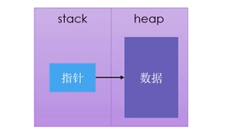

[TOC]

#### 猜谜游戏

```rust
use std::io;
use rand::Rng;
use std::cmp::Ordering;

fn main() {
    println!("猜数游戏！！！");

    let secret_num = rand::thread_rng().gen_range(1 , 101);
    // println!("随机数是 ： {}", secret_num);
    loop {
        println!("猜测一个数！！！");
        let mut guess = String::new();
		
        // 这里的 except 是对潜在的 error 的处理，rust 中必须处理
        io::stdin().read_line(&mut guess).expect("无法读取它"); 
         
        //  将 guess 转换为 unsigned Intger 32  trim() 将 空格 和 换行过滤掉
        let guess : u32 = match guess.trim().parse(){
            Ok(num) => num,
            Err(_) => continue,
        };

        println!("你猜测数是 {} " , guess);

        match guess.cmp(&secret_num) {
            Ordering::Less => println!("Too small!"), // <
            Ordering::Greater => println!("Too big!"),   // = 
            Ordering::Equal => {
                println!("Yon win!"); // >
                break;
            }
        };
    }
}
```

#### 变量，不可变量，常量

```rust
/*
    变量定义：
        let 关键字定义 不可变的变量  immutable 
        let mut 定义 变量  
        const 定义常量
        const 和 let 的区别：
            1：const 不能使用 mut, 常量是永远不可变的
            2：声明常量使用const 关键字，类型必须被标注
            3：常量可以在任何作用域声明，包括全局作用域
        命名规范： MAX_SIZE

*/

fn main(){

    let x = 5;
    let x = x + 1; // Shadowing 

    // let mut str = "houdong";  // &str
    // str = str.len();   // usize 不能赋给 &str
    
   	let str = "houdong";
    let str = str.len();
    
    const N : u32 = 1000010;

    println!("The value of is {} {}" , x , N);
}
```

#### 数据类型

**整型**

默认类型是 `i32` 


$i$ 开头为有符号，范围： $-(2^n-1)$ ~ $2^{n-1}-1$  ； $u$ 开头为无符号，范围： $0$ ~  $2^n -1$

`usize` 和 `isize` 是由计算机的架构所决定的，如果计算机是 64位，那么就是 62 位。


数字中使用 `_` 只是增加可读性，并不会影响其值


**浮点型**

默认类型是 `f64` 。

-   `f32` ,32位，单精度
-   `f64` , 64位， 双精度

**布尔类型**

默认为 `false` , 一个字节大小

符号 : `bool`

**字符类型**

使用 单引号，占用 4 字节大小。是 Unicode 标量值。

#### 复合类型

**元组**  Tuple

- 可以将多个类型的多个值放在一个类型中
- 长度是固定的，一旦声明不能改变

```rust
//  创建
let tup : (i32 , f64, u8) = (500 , 6.4, 1);

//  获取后赋值 另一个 tup ，此时的 x为 i32 , y为 f64 , z为 u8
let (x, y, z) = tup;

//  访问 tup 元素。 点加数字
pritntln!("{} {} {}" , tup.0 , tup.1 , tup.2);

```

**数组**  分配在栈上

- 长度是固定的，一旦声明不能改变
- 类型保持一致

```rust
// 创建
let a : [i32 ; 5] = [1, 2, 3, 4, 5];

let a = [3 ; 5];   等价于   let a = [3 , 3, 3, 3, 3];

let a = [1, 2, 3, 4, 5];

// 访问
println!("{} " ,a[0]);

```

#### 函数

Rust 是一种基于**表达式**的语言。

```rust
// 后面的 x + 3 表达式的值 就是 { } 块的返回值
let y = {
        let x = 5;
        x + 3    // 后面不能有分号，这是一个表达式，不是语句。语句就没有返回值了。
};

println!("{}" ,y);


let y = {
        let x = 5;
        x + 3; // 加了 分号，返回的是 () ,y 不能正常使用
};
```

所以在 Rust 中的 函数返回值如果没有使用 `return` 关键字声明出来的话，其返回值就是最后一个表达式的值。

```rust
fn five(x: i32) -> i32 {
    x + 5   // 不加 分号，就是一个表达式。
    // return x + 5  // 等价
    // return x + 5; // 等价
}
fn main(){
    let x = five(6);
    println!("{} " , x); // 输出为 11
}
```

#### 控制流

**`if`  表达式** 

跟 布尔表达式。

```rust
if num % 3 == 0 { // 写 num % 3 会报错 
    println!("number is divicible by 3");
}else if num % 4 == 0 {
    println!("number is divicible by 4");
}else {
    println!("number is not divicible by 4 or 3");
}
```

if 表达式，即是 表达式，那么就可以在放在 赋值号的右边。

```rust
let condition = true;

// number的值不确定时， if 和 else 中的数据类型需保持一致
let number = if condition { 5 } else { 6 }; 

println!("The value of number is {}" , number );
```

**loop 循环**

`loop` 块中的代码会一直执行，直到遇到终止条件。

```rust
let mut counter = 0;
let result = loop {
    counter += 1;

    if counter == 10 {
        break counter * 2;
    }
};

println!("The result value of is {}" , result); // 结果等于 20
```

**while 条件循环**

```rust
let mut foo = 3;
while foo != 0 {
    println!("{}! " , foo);
    foo -= 1;
}
println!("LIFTOFF");
```

**for 循环**

```rust
let a = [1, 2, 3, 4, 5];

for i in a.iter() {
    println!("{}" , i);
}
```

**Range**

```rust
// (1..4) == [1 , 4)
// rev 是 reverse(), 倒序遍历
for i in (1..4).rev() {
    println!("{} !" , i);
}
println!("LIFTOFF");
```

#### 所有权

所有程序在运行时都必须管理它们使用计算机内存的方式。


指针的大小的是已知固定的，可以存放在 stack 上。


**所有权规则**

1. 每个值都有一个变量，这个变量是该值的所有者
2. 每个值同时只能有一个所有者
3. 当所有者超出作用域（scope）的时，该值将被删除

**变量与数据的交互方式**

- 多个变量可以与同一个数据使用一种独特的方式来交互

    ```rust
    let x = 5;
    let y = x;
    ```

**移动（Move）**

```rust
let s1 = String::from("hou");
let s2 = s1; 	// s1 调用 drop() 销毁 
```


为了保证内存安全：

- Rust 没有尝试复制被分配的内存
- Rust 没有让 s1 失效
    - 当 s1 离开作用域时，Rust 不需要释放任何东西

```rust
let s1 = String::from("hou");
let s2 = s1;

println!("{}", s1); // error
/*
	对于 String 来说，没有实现 Copy Trait,所以不能直接的移动
*/
```


s1 失效也即变灰，那么 Rust 就不会再去释放 s1 的内存，就不会出现二次释放。

**克隆（Clone）**

​		如果真想对 heap 上的 String 数据进行深度拷贝，而不仅仅是 stack 上的数据，可以使用 clone 方法。


对于 stack 上的数据：**复制**

- Copy trait，可以用于像整数这样完全存放在 stack 上的类型
- 如果一个类型实现了 Copy 这个 trait ，那么旧的变量在赋值后仍然可用
- 如果一个类型或者该类型的一部分实现了 Drop trait, 那么 Rust 不允许让它再去实现 Copy trait 了。

**一些拥有 Copy trait 的类型**

- 任何简单标量的组合类型都是可以 Copy 的。
- 任何需要分配内存或者某种资源的都不是 Copy 的
- 实例：
    - 所有的整数类型。eg: u32
    - bool
    - char
    - 所有的浮点类型，eg：f64
    - Tuple（元组），如果其所有字段都是实现 Copy 的。
        - `(i32, i32)` 是
        -  `(i32, String)` 不是

```rust
let x = 5;
let y = x;
println("{}, {}", x, y); // correct
```

**所有权与函数**

- 在语义上，将值传递给函数和把值赋给变量是类似的：

    - 将值传递给函数将发生**移动或者复制**

    ```rust
    fn main(){
        let s = String::from("houdong");
    
        take_ownership(s);
    
        let x = 5;
    
        make_copy(x);
    
        println!("x: {}", x);
    }
    fn take_ownership(some_string: String) {
        println!("{}", some_string);
    }
    fn make_copy(some_number: i32) {
        println!("{}", some_number);
    }
    
    /*
    	x 为整数，实现了 Copy, 所以 传参时传的是副本
    	
    	第4行后， s 就被调用 drop 函数销毁
    	s 为 String, 未实现 Copy, 传参时是发生了 移动（stack 上多了一份）
    */
    ```

**返回值与作用域**

- 函数在返回值的过程中同样也会发生所有权的转移

```rust
fn main(){
    let s1 = gives_ownership();

    let s2 = String::from("houdong");

    let s3 = takes_and_gives(s2);
}

fn gives_ownership() -> String{
    let some_string = String::from("houdong");    
    some_string   		// 将 some_string 的所有权移动至 s1
}

fn takes_and_gives(a_string: String) -> String {
    a_string
}

/*
	s2 的所有权通过函数 takes_and_string 移动至 s3
*/
```

- 一个变量的所有权总是遵循同样的模式：
    - 把一个值赋值给其他变量时就会发生移动
    - 当一个包含 heap 数据的变量离开作用域时，它的值就会被 drop 函数清理，除非数据的所有权移动到另一个变量上。


#### 引用 与 借用

`&` 表示引用，**允许你引用某些值而不取得其所有权**。那么调用函数之后还可以继续使用这个 变量

```rust
fn main(){

    let s = String::from("houdong");
    // 这里使用 s 之后， s 不会drop 函数清理掉，那么后继还可以使用 s。
    let len = cal_len(&s); 
    println!("The length of '{}' is {} ." , s , len);
}

fn cal_len(s: &String) -> usize {
    s.len()
}
```

以引用作为函数参数的形式，称之为借用。对于借用的东西是不可以进行修改的。

和变量一样，引用默认也是不可变的。

但是也可以将引用声明为 **可变的**。

可变引用的限制：

1. 在特定的作用域内，对某一块数据，**只能有一个**可变的引用。

​		这样做的好处就睡可在编译时防止数据竞争

以下三张行为下会发生数据竞争：

- 两个或多个指针同时访问同一个数据。
- 至少有一个指针用于写入数据
- 没有使用任何机制来同步对数据的访问

可以通过创建新的作用域，来允许非同时的创建多个可变引用。

2. 不可以同时拥有一个可变引用和一个不变的引用。多个不可变的引用是可以的。

```rust
fn main(){

    let mut s = String::from("houdong");
    let len = cal_len(&mut s);
    println!("The length of '{}' is {} ." , s , len);
}

fn cal_len(s: &mut String) -> usize {
    s.push_str("dong");
    s.len()
}
```

```rust
// 限制 1
fn main(){
    let mut s = String::from("hodong");
    let s1 = &mut s;
    // let s2 = &mut s; // 会报错
}

```

```rust
// 创建新的作用域，来允许非同时创建多个可变引用
fn main(){
    let mut s = String::from("houdong");
    {
        let s1 = &mut s;
    }
    let s2 = &mut s;
}
```

```rust
// 限制 2
fn main(){
    let mut s = String::from("houdong");
    let r1 = &s;
    let r2 = &s;
    // let s1 = &mut s; // 不能同时存在 &s  和  &mut s
    
    println!("{} {} {}",r1,r2,s1);
}
```

**悬空引用**  Dangling References

​		一个指针引用了内存中的某个地址，而这块内存可能已经释放并分配给其他人使用了。

Rust 在编译期保证永远不会出现悬空引用。

如果你引用了某些数据，编译器将保证在**引用离开 作用域之前 数据不会离开作用域。**

```rust
fn main(){
    let r = dangle();
}

// 这里使用 引用作为返回值,那么在函数结束之后 该引用
// 已经 出了作用域，其就会指向其他地址。那么就不能再将其作为返回值。
fn dangle() -> &String {
    let s = String::from("houdong");
    &s
}
```

#### 切片

**不持有所有权**的数据类型：切片 （slice）

编写一个函数：

他接收字符串作为参数；返回它在这个字符串里找到的第一个单词；如果函数没找到任何空格，那么整个字符串就被返回。

```rust
// 找到第一个 空格 所在的位置
fn main(){
    let mut s = String::from("houdong");
    let word_index = first_world(&s);

    // s.clear(); // 如果这里 s被clear 掉，后面的执行语句照常会返回原本的 s 中的 first_word_index
    println!("{}" , word_index);
}

fn first_world(s: &String) -> usize {
    let bytes = s.as_bytes();
    
    for (i , &item) in bytes.iter().enumerate() {
        if item == b' ' {
            return i;
        }
    }
    s.len()
}
```

上述代码中的主要问题就是 s 的有效性在执行完 `s.clear()`  之后就没有了，但是 word_index 这个受到 s 影响的变量却没有受到影响。那么如何将 s 的有限性进行延续呢？

**字符串切片**： 指向字符串中一部分地引用

```rust
fn main(){
    let s = String::from("hou dong");
    let hou = &s[0..3]; // == &s[..3]
    let dong = &s[5..]; // == &s[5..]

    let whole = &s[0..s.len()]; // == &s[..]
}
```

```rust
fn main(){
    let mut s = String::from("hou dong");
    let word_index = first_world(&s); // 不可变的引用
    
  // 这里执行 clear操作就会报错, 因为第三行使用不可变的引用，这里又使用可变的引用，这会产生数据竞争
    // s.clear(); 
    println!("{}" , word_index);
}

fn first_world(s: &String) -> &str {
    let bytes = s.as_bytes();
    
    for (i , &item) in bytes.iter().enumerate() {
        if item == b' ' {
            return &s[..i];
        }
    }
    &s[..]
}
```

字符串字面值是切片

字符串字面值的类型为 `&str` 也即为字符串切片，是不可变的引用。

```rust
fn main(){
    let s = "hou dong"; // s类型为 &str ,字符串字面值
}
```

将字符串切片作为参数传递

```rust
fn first_world(s: &String) -> &str { ... }
```

可以使用 `&str` 去代替 `&String` ，使得 可接收的参数即可以是 `&String` 又可以 `&str` ，使得函数更加通用。

- 参数是字符串切面值，直接调用该函数。
- 使用 `String` ，可以创建一个完整 `String` 切片来调用该函数。

```rust
fn main(){
    let my_string = String::from("hou dong");
    // 传入完整的字符串切面值
    let word_index1 = first_world(&my_string[..]); 
    
    
    let my_string_literal = "hou dong";
    let word_index2 = first_world(my_string_literal);

    println!("{} {} " ,word_index1 , word_index2);

}
fn first_world(s: &str) -> &str {
    let bytes = s.as_bytes();
    
    for (i , &item) in bytes.iter().enumerate() {
        if item == b' ' {
            return &s[..i];
        }
    }
    &s[..]
}
```

其他类型的切片

```rust
fn main(){
    let a = [1, 2, 3, 4, 5];
    let silce = &a[1..3]; // silce 的类型为 &i32
}
```

#### struct

1: struct 的创建和实例化。

```rust
// 创建使用 strucrt 关键字
struct User{
    user_name : String,
    sign_in_count : u32,
    active : bool,
}

fn main(){
    // 实例化时需要将所有的 Feild 都设置初始值，顺序任意。
    let use1 = User {
        user_name : String::from("lidong"),
        active : true,
        sign_in_count : 007,
    };
}
```

2: 访问实例化后的 struct 中的 Filed。此时 实例化的变量必须是 可变的 mut。

注意： 一旦 struct 的实例时是可变的，那么实例中的字段(Filed) 都是可变的。

```rust
struct User{
    user_name : String,
    sign_in_count : u32,
    active : bool,
}

fn main(){
    let mut use1 = User {
        user_name : String::from("lidong"),
        active : true,
        sign_in_count : 007,
    };
    use1.user_name = String::from("houdong");

}
```

 3: struct 可作为函数的返回值。

```rust
struct User{
    user_name : String,
    sign_in_count : u32,
    active : bool,
}

fn main(){
    let mut use1 = User {
        user_name : String::from("lidong"),
        active : true,
        sign_in_count : 007,
    };
    use1.user_name = String::from("houdong");

    build_user(String::from("houdong"), 007);
}

fn build_user(user_name: String, sign_in_count: u32) -> User {
    User {
        user_name : user_name,
        sign_in_count : sign_in_count,
        active : true,
    }
}
```

字段 （Filed） 初始化简写

当字段名与字段值对应的变量名相同时，就可以使用字段初始化简写的方式：

```rust
fn build_user(email: String , username: String) -> User {
    User {
        user_name,
        sign_in_count,
        active : true,
    }
}
```

struct 更新语法

当你想要基于某个 struct 实例来创建一个新实例时，可以使用 struct 更新语法。

```rust
let mut user1 = User {
    user_name : String::from("lidong"),
    active : true,
    sign_in_count : 007,
};

// 不使用更新语法
let user2 = User {
    user_name : String::from("lindong"),
    active : user1.active,
    sign_in_count : user1.sign_in_count,
};

// 使用 更新语法
let user2 = User {
    user_name : String::from("lindong"),
    ..user1
};

```

**Tuple struct**

可以定义类似  tuple 的 struct，叫做  tuple struct。

Tuple struct 整体有个名，但里面的元素没有名。适用于 想给整个 tuple 起名，并让它不同于其他的 tuple，而且又不需要给每个元素起名。 

```rust
struct Color(i32, i32, i32);
struct Point(i32, i32, i32);

let black = Color(0,0,0);
let origin = Point(0,0,0);
```

**Unit-Like Struct**  (没有任何字段)

可以定义没有任何字段的 struct ，叫做  Unit-Like struct （因为与 () ，单元类型 类似）

适用于需要在某个类型上实现某个 trait ,但是在里面又没有想要存储的数据。 （类似于接口）

 **struct 数据里的所有权**

```rust
struct User{
    user_name : String,
    sign_in_count : u32,
    active : bool,
}
```

这里的字段使用  `String` 而不是 `&str` :

- 该 `struct` 实例拥有其所有的额数据。
- 只要 `struct` 实例是有效的，那么里面的字段数据也是有效的。

`struct`  里也可存放引用，但需要使用生命周期。生命周期保证只要 `struct` 实例是有效的，那么里面的引用也是有效的。如果 `struct` 里面存储引用，而不使用生命周期，就会报错。

**struct 实例**

计算长方形面积。

```rust
fn main() {
    let w = 30;
    let l = 50;
    println!("{}" , area(w, l));
}
// 这里的封装使得 width 和 length 没有关联。
fn area(width: u32 , length: u32 ) -> u32 {
    width * length
}
```

```rust
fn main() {
    let rect = (30, 50);
    println!("{}" , area(rect));
}
// 这里使用元组对长和宽进行封装，但使用元组进行封装时长宽不能明确的表示出来，使得可读性变差
fn area(dim : (u32 , u32)) -> u32 {
    dim.0 * dim.1
}
```

```rust
struct Rectangle {
    width: u32,
    length: u32,
}

fn main() {
    let rect = Rectangle {
        width: 30,
        length: 50,
    };
    // 这里使用 引用，那么使用完 rect 之后主函数依然保留着 rect 的所有权
    println!("{}" , area(&rect)); 
}

fn area(rect: &Rectangle) -> u32 {
    rect.length * rect.width
}
```

```rust
// 使得自定义的注解派生于 Debug, 为 struct 提供 toString() 方法
#[derive(Debug)]
struct Rectangle {
    width: u32,
    length: u32,
}

fn main() {
    let rect = Rectangle {
        width: 30,
        length: 50,
    };
    // 这里使用 引用，那么使用完 rect 之后主函数依然保留着 rect 的所有权
    println!("{}" , area(&rect)); 

    println!("{:#?}", rect); //  "{:?}" 输出更加简洁， "{:#?}" 输出更加易读
}

fn area(rect: &Rectangle) -> u32 {
    rect.length * rect.width
}
```

输出结果

```
1500
Rectangle {
    width: 30,
    length: 50,
}
```

**struct 的方法**

方法：在 struct 的 impl 块中定义，参数中须含有 `&self` 的函数。 

通过  `实例名.函数名`  调用 ，其中的 `&self` 参数不需要 显式传参。

```rust
// 使得自定义的注解派生于 Debug, 为 struct 提供 toString() 方法
#[derive(Debug)]   
struct Rectangle {
    width: u32,
    length: u32,
}

impl Rectangle {
    fn area(&self) -> u32 {
        self.length * self.width
    }
}

fn main() {
    let rect = Rectangle {
        width: 30,
        length: 50,
    };
    // 这里使用 引用，那么使用完 rect 之后主函数依然保留着 rect 的所有权
    println!("{}" , rect.area()); 

    println!("{:#?}", rect);
}
```

```rust
#[derive(Debug)]
struct Rectangle {
    width: u32,
    length: u32,
}

impl Rectangle {
    fn can_hold(&self, other: &Rectangle) -> bool {
        other.length < self.length && other.width < self.width
    }
}

fn main() {
    let rect1 = Rectangle {
        width: 30,
        length: 50,
    };

    let rect2 = Rectangle {
        width: 15,
        length: 40,
    };

    println!("{}",rect1.can_hold(&rect2));
}
```

**关联函数** 

在 struct 的 impl 块中定义，参数中不含有 `&self` ，通过  `struct名::函数名` 来调用。

```rust
// 使得自定义的注解派生于 Debug, 为 struct 提供 toString() 方法
#[derive(Debug)]
struct Rectangle {
    width: u32,
    length: u32,
}

impl Rectangle {
    fn area(&self) -> u32 {
        self.length * self.width
    }

    fn can_hold(&self, other: &Rectangle) -> bool {
        other.length < self.length && other.width < self.width
    }

    fn square(size: u32) -> Rectangle {
        Rectangle {
            width: size,
            length: size
        }
    }
}

fn main() {
    let rect1 = Rectangle {
        width: 30,
        length: 50,
    };

    let rect2 = Rectangle::square(20); // 通过 关联函数 初始化实例

    println!("{}",rect1.can_hold(&rect2));
    
}
```

#### 枚举

定义枚举。 实例： IP地址： IPV4 , IPV6

```rust
enum IpAddKind {
    V4,
    V6,
}
```

枚举类型作为函数参数，为变量赋值。

```rust
enum IpAddKind {
    V4,
    V6,
}

fn main(){
    let four = IpAddKind::V4;
    let six = IpAddKind::V6;

    route(four);
    route(six);
    route(IpAddKind::V6);
}

fn route(ip_kind: IpAddKind) { }
```

枚举中的变量数据类型任意，可以是基本数据结构，也可以是复合数据结构，也可使结构体，甚至是枚举

```rust
enum Messager {
    Quit ,                   // 没有类型
    Move {x: i32 , y: i32},  // 匿名结构体
    Write(String),           // String
    ChangeColor(i32 , i32, i32), // 元组
}

fn main(){
    let q = Messager::Quit;
    let m = Messager::Move {x:24, y:23};
    let w = Messager::Write;
    let c = Messager::ChangeColor(0 , 0, 0);
}
```

为枚举定义方法

```rust
enum Messager {
    Quit , 
    Move {x: i32 , y: i32},
    Write(String),
    ChangeColor(i32 , i32, i32),
}

impl Messager {
    fn call(&self) {}
}

fn main(){
    let q = Messager::Quit;
    let m = Messager::Move {x:24, y:23};
    let w = Messager::Write;
    let c = Messager::ChangeColor(0 , 0, 0);

    m.call();
}
```

**Option 枚举**

定在标准库中，在 Prelude （预导入模块）中。描述了：某个值可能存在（某种类型）或不存在的情况。

在 Rust 中没有 Null 值，Null 的问题在于：当你尝试像使用非 Null 那样使用 Null 值的时候，就会引起某种错误。

Null 的概念：因某种原因而变为无效或者缺失的值。

Rust 中类似 Null 概念的枚举 - `Option<T>`

```rust
// 标准库中的定义
enum Option<T> {
    Some(T), // 有效的值
    None,    // 无效的值
}
```

```rust
let some_number = Some(5); // std::option::Option<i32>
let some_string = Some("li dong");// std::option::Option<&str>

// 将 absent_number 赋值为 None 值必须显式声明 Option<T>
let absent_number: Option<i32>= None; // std::option::Option<i32>
```

 这种设计的优势：

`Option<T>` 和 `T`  是不同的类型，不可以把 `Option<T>` 直接当成 `T` 

```rust
let x: i8 = 5;
let y: Option<i8> = Some(7);

// 会报错
let sum = x + y;// cannot add `std::option::Option<i8>` to `i8`
```

若想使用 `Option<T>` 中的 `T` ，必须将它转换为 `T`。

#### match

允许一个值与一系列模式进行匹配，并执行匹配的模式对应的代码
模式可以是字面值、变量名、通配符..

```rust
enum Coin {
    Penny,
    Nickel,
    Dime,
    Quarter,
}

fn value_in_cents (coin: Coin) -> u8{
    match coin {
        Coin::Penny => 1,
        Coin::Nickel => 1,
        Coin::Dime => 10,
        Coin::Quarter => {
            println!("Quarter!!!");
            25 // 返回这个表达式，不用加 分号
        },
    }
}

fn main(){ }
```

**绑定值模式匹配**

```rust
#[derive(Debug)]
enum UsState {
    Alabama,
    Alaska,
}

enum Coin {
    Penny,
    Nickel,
    Dime,
    Quarter(UsState),
}

fn value_in_cents (coin: Coin) -> u8{
    match coin {
        Coin::Penny => 1,
        Coin::Nickel => 1,
        Coin::Dime => 10,
        Coin::Quarter(state) => { // state 就是这个绑定值，然后就可以使用这个绑定值
            println!("State quare from {:?}", state);
            25
        },
    }
}

fn main(){
    let c = Coin::Quarter(UsState::Alabama);
    println!("{}", value_in_cents(c));
}
// 输出：
// State quare from Alabama
// 25
```

`Option<T>` 匹配

```rust
fn main(){
    let five = Some(5);
    let _six = plus_one(five);
    let _none = plus_one(None);
}

fn plus_one(x: Option<i32>) -> Option<i32> {
    match x {
        None => None,
        Some(i) => Some(i + 1),
    }
}
```

**注意**

对于匹配 必须穷举所有的枚举值，特别是 `Option<T>` 中的 `None` 值。

要是不想穷举所有的可能，可使用 `_` 通配符，代替其余没列出的值。

```rust
fn main(){
    let v = 0u8;

    match v {
        1 => println!("one"),
        2 => println!("two"),
        3 => println!("three"),
        4 => println!("four"),
        _ => (), // 需放在最后
    }
}
```

#### if let

处理只关心**一种匹配**而忽略其他匹配的情况。

```rust
fn main(){

    let v = Some(0u8);

    match v {
        Some(4) => println!("four"),
        _ => (),
    }

    // 上述代码使用 if let 改写
    if let Some(4) = v {
        println!("four");
    }
}
```

也可以搭配 `else` 使用

```rust
fn main(){

    let v = Some(0u8);

    match v {
        Some(4) => println!("four"),
        _ => println!("others")
    }

    // 上述代码使用 if let 改写
    if let Some(4) = v {
        println!("four");
    } else {
        println!("others");
    }
}
```

#### Pakage, Crate,Module

Rust 的代码组织：

代码组织主要包括：

1. 哪些细节可以暴露，哪些细节是私有的
2. 作用域内哪些名称有效

模块系统：

- Package（包）：Cargo的特性，让你构建、测试、共享 crate
- Crate（单元包）：一个模块树，它可产生一个 library 或可执行文件
- Module（模块）、use：让你控制代码的组织、作用域、私有路径
- Path （路径）：为 struct , function 或 module 等项命名的方式

**Package 和 Crate**

Crate的类型：

- binary (二进制文件 -> 可执行文件)
- library (代码库)

Crate Root:

- 是源代码文件
- Rust 编译器从这里开始，组成你的 Crate 的根 Module

一个Package ：

- 包含1个Cargo.toml，它描述了如何构建这些Crates
- 只能包含 0-1个 library crate
- 可以包含任意数量的 binary crate
- 但必须至少包含一个 crate（library或binary）

**cargo的惯例**

- `src/main.rs` 是：

​		- `binary crate` 的 `crate root`

​	    - `crate` 名与 `pachage` 名相同

- `src/lib.rs` 是：

 	   - `package` 包含一个 `library crate`

​        - `library crate` 的 `crate root`

​        - `crate` 名与 `package` 名相同

`Cargo` 会将 `crate root` 文件交给 `rustc` 来构建 `library` 或 `binary`

一个 `Package` 可以同时包含 `src/main.rs` 和 `src/lib,rs` 

- 一个 `binary crate`, 一个 `library crate`
- 名称与 `package` 名相同

一个 `Package` 可以有多个 `binary crate` ：

- 文件放在 `src/bin`
- 每个文件是单独的 `binary crate`

**Crate 的作用**

- 将相关功能组合在一个作用域内，便于在项目间进行共享。—— 防止冲突。

例如： rand crate，访问它的功能需要通过它的名字： rand

**定义 module 来控制作用域和私有性**

**Module**

- 在一个 crate 中，将代码进行分组
- 增加可读性，易于复用。
- 控制项目（item）的私有性。public , private

建立 module ：

- 使用 mod 关键字
- 可嵌套
- 可包含其他项（变量，函数，struct,enum,trait等）的定义


路径（Path）

- 为了在 Rust 模块中找到某个条目，需要使用路径。
- 路径的两种形式：

​		- 绝对路径：从 crate root 开始，使用 crate 名或字面值 crate

​		- 相对路径：从当前模块开始，使用 self , super 或者当前模块的标识符

路径之间至少由一个标识符组成，标识符之间使用 `::`

```rust
// lib.rs
mod front_of_house {
    pub mod hosting {
        pub fn add_to_waitlist() { }
    }
}

pub fn eat_at_restaurant() {
    
    creat::front_of_house::hosting::add_to_waitlist(); // 绝对路径
    
    front_of_house::hosting::add_to_waitlist(); // 相对路径
}
```

私有边界 （private bounday）

- 模块不仅可以组织代码，还可以定义私有边界
- 如果想把 函数 或 struct 等设为私有，可以将它放到某个模块中。
- Rust 中所有的条目（函数，方法，struct，enum，模块，常量）默认是私有的。
- 父级模块无法访问子模块中的私有条目
- 子模块里可以使用所有祖先模块中的条目

**pub 关键字** 使得模块为 公共的


**super 关键字**

```rust
// lib.rs

fn server_order() { }

mod back_of_house {
    fn fix_incorrent_order() {
        cook_order();
        // 使用 super 访问,是该级别跳至 crate级,从而去访问该crate 的其他模块
        super::serve_order(); 
        
        crate::serve_order(); // 使用 crate (绝对路径) 访问
    }
    fn cook_order() {}
}
```

struct 中pub的使用:

```rust
// lib.rs
mod back_of_house {
    pub struct Breakfast {
        pub toast: String,
        seasonal_fruit: String, // private
    }

    impl Breakfast {
        pub fn summer(toast: &str) -> Breakfast {
            Breakfast {
                toast: String::from(toast),
                seasonal_fruit: String::from("peaches")
            }
        }
    }
}

pub fn eat_at_restaurant() {
    let mut meal = back_of_house::Breakfast::summer("Rye");
    meal.toast = String::from("Wheat");
    println!("I'd like {} toast please", meal.toast);

    //seaconal_fruit is private
    // meal.seasonal_fruit = String::from("blueberries"); // error
}
```

enum 中 pub 的使用，如果枚举是 pub 的， 那么枚举中的变量也是 pub 的。

```rust
// lib.rs
mod back_of_house{
    pub enum Apptizer {
        Soup,  // public
        Salad, // public
    }
}
```

**use关键字**

可以使用 use 关键字将路径导入到作用域内，但依然遵循私有性原则。

use 的习惯用法：

- 函数：将函数的父级模块引入作用域（指定到父级）
- struct，enum，其他：指定完整路径（指定到本身）

```rust
use std::collections::HashMap;

fn main(){ 
    let mut map = HashMap::new();
    map.insert(1, 2);
}
```

- 同名条目：指定到父级

```rust
use std::fmt;
use std::io;

fn f1() -> fmt::Result();

fn f2() -> io::Result();

fn main(){ }
```

使用 `as` 关键字

```rust
use std::fmt::Result;
use std::io::Result as IoResult;

fn f1() -> Result();

fn f2() -> IoResult();

fn main(){ }
```

使用 use 引入的条目在当前模块相对其他模块也是私有的。要想引入当前模块的 该条目 也可以被引入当前模块的模块所使用的，使用 `pub use`

- 将该条目引入作用域
- 该条目可以被外部代码引入到它们的作用域

**使用外部包 （package）** 

1.  `Cargo.toml` 添加依赖的包 （package）。会从 `https://crates.io/` 下去下载该 package
2.  use 将特定的条目引入作用域

**使用嵌套语句代替大量的 use 语句**

语法结构 `路径相同部分::{路径1 , 路径2 , ...}`

```rust
use std::cmp::Ordering;
use std::io;

// 上面等价于
use std::{cmp::Ordering , io}
```

引入本身使用 `self`

```rust
use std::io;
use std::io::Write;

// 上式等价于
use std::io::{self, Write};
```

引入一个模块下的所有条目，使用 `*`

```rust
use std::collections::*;
```

**将模块拆分为不同的文件**

```rust
// lib.rs
mod front_of_house;

// front_of_house.rs , 即是 front_of_house Moudle 中的内容
pub mod hosting {
    pub fn add_to_waitlist() { }
}
```

```rust
// 要想把 hosting Moudle 也放在文件中应该建立 front_of_house文件夹，再到 该文件夹下 创建 
// hosting.rs 文件

// src/lib.rs
mod front_of_house;

// src/front_of_house.rs , 即是 front_of_house Moudle 中的内容
pub mod hosting;


// src/front_of_house/hosting.rs
pub fn add_to_waitlist() { }
```

#### 常用的集合

##### Vector

Vector 的创建

```rust
// 使用 Vec::new() 创建一个空的 vector
let mut v: Vec<i32> = Vec::new();

// 使用 宏 vec! 去定义有初值的 vector
let mut v = vec![1, 2, 3];
```

|        功能        | function |
| :----------------: | :------: |
| 在末尾添加一个元素 |  push()  |
|                    |          |
|                    |          |

读取 Vector 的元素

- 索引
- get 方法

```rust
fn main(){
    let mut v = vec![1, 2, 3, 4, 5];
	
    // 使用索引方式没有越界的错误处理
    let third: &i32 = &v[2]; 

    println!("The third element is {}" , third);
	
    // 有越界的错误处理
    match v.get(2) {
        Some(third) => println!("The third element is {}", third),
        None => println!("There is no third element"),
    }
}
```

所有权和借用规则

不能在同一作用域内同时拥有可变和不可变引用

```rust
fn main(){
    let mut v = vec![1, 2, 3, 4, 5];

    let third: &i32 = &v[2];

    // cannot borrow `v` as mutable because it is also borrowed as immutable
    // 如果上面去掉引用那么就可以改，但是这会有 bug
    v[2] = 1; // error
    v.push(2); // error

    println!("The third element is {}" , third);

}
```

```rust
fn main(){
    let mut v = vec![1, 2, 3, 4, 5];

    v[2] = 1;  // correct
    v.push(2); // correct
    
    let third: &i32 = &v[2];

    println!("The third element is {}" , third);

}
```

可写遍历和只读遍历

```rust
fn main(){
    let mut v = vec![100, 32, 78];

    for i in &mut v {
        *i += 50;
    }
	
    // 这样的借用后会将 v 的所有权截至在这，要是后面还能用到，最好使用 引用
    for i in v {
        println!("{}", i);
    }
}
```

```rust
fn main(){
    let mut v = vec![100, 32, 78];

    for i in &mut v {
        *i += 50;
    }

    for (p, i) in v.iter().enumerate() {
        println!("{} : {}", p, i);
    }
}
```

Vector 实例


##### 字符串

是 `Byte` 的结合。

Rust 的核心语言层面，只有一个字符串类型：字符串切片 `str`（或 `&str`）

- 字符串切片：对存储在其它地方，UTF-8编码的字符串的引用
- 字符串字面值：存储在二进制文件中，也是字符串切片

String 类型：

- 来自 标准库 而不是 核心语言, 也使用 utf-8 编码
- 可增长、可修改、可拥有

Rust 的标准库还包含了很多其它的字符串类型，例如：OsString、OsStr、CString、CStr

- String vs Str 后缀：拥有或借用的变体
- 可存储不同编码的文本或在内存中以不同的形式展现

**String 类型的创建和更新**

创建

- `String::from()`   使用 String::new() 创建空的字符串
- `String::new()`   使用 String::from()
- `to_string()`   使用 to_string() 方法。 将字符串切片转为 String 类型

```rust
// 创建
// 1：使用 String::new() 创建空的字符串
let mut s1 = String::new();

// 2：使用 String::from()
let mut s2 = String::from("hou dong");

// 3: 使用 to_string() 方法。 将字符串切片转为 String 类型
let mut s3 = "hou dong".to_string();
```

更新

- `push_str()`  将 字符串切面值或String 类型  添加到 String 类型的后面
- `push()` 将 单个字符 添加到 String类型 后面
- `+` 连接字符串 ，使用了**类似**这个方法： `fn add(self, s: &str) -> String{...}` , 那么就需要一个参数一个 String 类型，第二个是 String 的引用类型， 这里为什么是String 类型的引用而不是 `&str`  ,因为：标准库中的add 方法使用了泛型，只能把 `&str` 添加到 String ，使用了强制转换 (deref coercion)
- `format!`  使用这个宏**不会取得参数的所有权**。

```rust
// 更新
let mut s = String::from("foo");
let s1 = String::from("bar");

s.push_str("bar"); // 将字符串切面值添加到 String 类型的后面
s.push_str(&s1); // 将 String 类型添加到 String 类型的后面

s.push('l');
```

```rust
fn main(){
    let s1 = String::from("hou");
    let s2 = String::from("dong");
    let s = "dong";
    
    // String + &str 
    let s3 = s1 + s;
    println!("{}", s3);

    // String + &String
    let s4 = s3 + &s2;
    println!("{}", s4);
}
```

```rust
fn main(){
    let s1 = String::from("hou");
    let s2 = String::from("dong");
    let s3 = String::from("dong");

    // let s3 = s1 + "-" + &s2 + "-" + &s3;
    // println!("{}", s3);

    let s = format!("{}-{}-{}", s1, s2, s3);
    println!("{}", s);
}
```

**String 类型的表示形式和切割**

String 类型在 rust 中不支持 索引访问。因为是 `utf-8` 编码，一个索引位置只代表一个字节，而在 `utf-8` 编码中一个字节是不能代表一个字符的，例如每个中文汉字需要三个字节。

​		String 是对 `Vec<u8>` 的包装

-  `len()`  返回 String 类型所占的字节数。

rust 看待字符串的三种形式：

- `Bytes` 字节
- `Scalar Valyes` 标量值
- `Grapheme Clusters` 字形簇 （最接近所谓的字母）

```rust
fn main(){
    let s = "我爱中国";

    // 以字节方式看待
    for b in &mut s.bytes() {
        print!("{} ", b);
    }
    // 以标量值看待
    for c in &mut s.chars() {
        print!("{} ", c);
    }
}
```

```shell
#  输出结果
230 136 145 231 136 177 228 184 173 229 155 189
我 爱 中 国
```

切割 String 

可以使用 `[ ] ` 和一个范围来创建字符串的切片

注意，切的时候一定按照 该字符串的标量值来切，不然就会 panic

```rust
fn main(){

    let s = "我爱中国";
    let v = &s[0..3]; // 中文在 Utf-8 中占三个字节

    println!("{}",v); // 我
}
```

##### HashMap

创建 `HashMap`  ， 所有的 `K` 和 `V` 必须都是各自的同一类型。

```rust
// 1： 未添加数据时，显示声明 键值 类型
let mut scores: HashMap<String, i32> = HashMap::new();


// 2: 创建完成之后添加一对键值，编译器会推断出类型
let mut scores = HashMap::new();
scores.insert(String::from("Blue"), 10);
```

使用 `collect` 方法创建  `HashMap` 。

在元素类型为 `Tuple` 的 `Vector` 上使用 `collect` 方法，可以组建一个 `HashMap`:

- 要求 `Tuple` 有两个值：一个作为 `K`, 一个作为 `V`
-  `collect` 方法可以把数据整合成很多种集合类型，包括 `HashMap`。 返回值需要显式指明类型。

```rust
use std::collections::HashMap;

fn main(){

    let teams = vec![String::from("Blue"), String::from("Yellow")];
    let intial_scores = vec![10, 50];
	
    // 因为 collect() 能合成的数据结构不止 HaskMap ，所以必须显式指明，使用 _ 是因为 
    // rust 中可以根据 vec 推断出具体类型
    let scores: HashMap<_ , _> = 
        teams.iter().zip(intial_scores.iter()).collect();
}
```

**HashMap的所有权**

- 对于实现了Copy trait的类型（例如 i32），值会被复制到 HashMap 中
- 对于拥有所有权的值（例如String），值会被移动，所有权会转移给 HashMap
- 如果将值的引用插入到 HashMap 中，值本身就不会移动。  在 HashMap 有效的期间内，被引用的值必须保持有效。

```rust
use std::collections::HashMap;

fn main(){

    let field_name = String::from("Favourite color");
    let field_value = String::from("Blue");

    let mut map = HashMap::new();
    map.insert(field_name, field_value);
    // map.insert(&field_name, &field_value); // 改为引用，后续就还可以使用
	
    // borrow of moved value: `field_name` and `field_value`
    // println!("{} : {}", field_name, field_value); // error
}
```

访问 HashMap 中的值

`get` 方法：

- 参数： `K`
- 返回： `Option<&V>`

```rust
use std::collections::HashMap;

fn main(){

    let mut scores = HashMap::new();

    scores.insert(String::from("Blue"), 10);
    scores.insert(String::from("Yellow"), 50);

    let team_name = String::from("Blue");
    let score = scores.get(&team_name);

    match score {
        Some(s) => println!("{}", s),
        None => println!("team not exits"),
    };

}
```

**遍历 HashMap** 

```rust
use std::collections::HashMap;

fn main(){

    let mut scores = HashMap::new();

    scores.insert(String::from("Blue"), 10);
    scores.insert(String::from("Yellow"), 50);

    for (k, v) in &scores {
        println!("{} : {}", k, v);
    }

}
```

**更新 HashMap**

每个 `K` 只能对应一个 `V` ;

更新 `HashMap` 中的数据：

-  `K` 已经存在，对应一个 `V` 
    1. 替换现有的 `V`, 如果向HashMap插入一对<K, V>，然后再插入同样的 K，但是不同的 V ，那么原来
        的Ⅴ会被替换掉。
    2. 保留现有 `V` ，忽略新的 `V`
    3. 合并现有的 `V` 和 新的 `V` 
- `K` 不存在
    1. 添加一对 `K, V` 

```rust
use std::collections::HashMap;

fn main(){

    let mut scores = HashMap::new();

    scores.insert(String::from("Blue"), 10);
    scores.insert(String::from("Blue"), 20); // 替换 V

    println!("{:?}", scores);
    
}
```

- `entry` 方法：检查指定的 `K` 是否对应一个 `V` 。
    1. 参数为 `K` 
    2. 返回 `enum Entry` ：代表返回值是否存在
- `Entry` 的 `or_insert()` 方法：返回
    1. 如果 `K` 存在，返回到对应的 `V` 的一个可变引用
    2. 如果 `K` 不存在，将方法参数作为新值插进去，返回到这个值的可变引用。

```rust
use std::collections::HashMap;

fn main(){

    let mut scores = HashMap::new();

    scores.insert(String::from("Blue"), 10);
    
    scores.entry(String::from("Yellow")).or_insert(50);
    scores.entry(String::from("Blue")).or_insert(50);

    println!("{:?}", scores);
    
}
```

```rust
use std::collections::HashMap;

fn main(){

    let text = "hou dong dong is a softwore engineer";

    let mut map = HashMap::new();

    for word in text.split_whitespace() {
        let count = map.entry(word).or_insert(0);
        *count += 1
    }

    println!("{:#?}", map);
    
}
```

#### Rust 错误处理

Rust的可靠性：错误处理， 大部分情况下，在编译时提示错误，并处理

错误的分类：

- **可恢复 ，eg : 文件找不到，可再次尝试。  `Result<T , E>`** 

    ```rust
    // Result 枚举类型的定义
    enum Result<T, E> {
        OK(T);  // 
        Err(E);
    }
    ```

    ```rust
    use std::fs::File;
    
    fn main(){
        let f = File::open("hello.txt"); // 寻找这个文件并打开
    
        let f = match f {
            Ok(file) => file,
            Err(error) => {
                panic!("Error opening file {:?}", error);
            }
        };
    }
    ```

    ```rust
    use std::{fs::File , io::ErrorKind};
    
    fn main(){
    
        let f = match File::open("hello.txt") {
            Ok(file) => file,
            // 对不同的错误进行处理
            Err(error) => match error.kind() {
                ErrorKind::NotFound => match File::create("hello.txt") {
                    Ok(fc) => fc,
                    Err(e) => panic!("{:?}", e), 
                },
                other_error => panic!("{:?}", other_error),
            }
        };   
    }
    ```

    上述代码中使用很多的 `match` ，`match` 很有用，但是很原始。

    使用 `closure` （闭包）。 `Result` 有很多方法：

    - 它们接收闭包作为参数
    - 使用 `match` 实现
    - 使用这些方法会让代码简洁

    ```rust
    // 上面例子的改良
    use std::{fs::File , io::ErrorKind};
    
    fn main(){
    
        // let f = match File::open("hello.txt") {
        //     Ok(file) => file,
        //     Err(error) => match error.kind() {
        //         ErrorKind::NotFound => match File::create("hello.txt") {
        //             Ok(fc) => fc,
        //             Err(e) => panic!("{:?}", e), 
        //         },
        //         other_error => panic!("{:?}", other_error),
        //     }
        // };  
    
        let f = File::open("hello.txt").unwrap_or_else(|error| {
            if error.kind() == ErrorKind::NotFound {
                File::create("hello.txt").unwrap_or_else(|error| {
                    panic!("Error creating file {:?}", error);
                })
            }else {
                panic!("Error opening file: {:?}", error);
            }
        });
    
    }
    ```

    **unwrap** 

    - unwrap 是 match表达式的一个快捷方法:
        - 如果 `Result ` 结果是 `Ok` ,返回 `Ok` 里面的值
        - 如果 `Result` 结果是 `Err`, 调用 `panic!` 宏

    ```rust
    // unwrap() 是 match表达式的一个快捷方法
    use std::fs::File;
    
    fn main(){
    	let f = match File::open("hello.txt") {
            Ok(file) => file,
            Err(e) => {
                panic!("{:?}", e);
            }
        };
        
        // 上面 match 表达式等价于下面
        let f = File::open("hello.txt").unwrap();
    }
    ```

    使用 unwrap() 不能自定义错误信息。

    **expect**

    可以指定错误信息，补充了 `unwrap` 的不足。

    ```rust
    use std::fs::File;
    
    fn main(){
    	let f = match File::open("hello.txt") {
            Ok(file) => file,
            Err(e) => {
                panic!("{:?}", e);
            }
        };
        
        // 上面 match 表达式等价于下面
        let f = File::open("hello.txt").expect("无法打开文件");
        
    }
    ```

​		**传播错误**

```rust
// 原始写法
use std::fs::File;
use std::io;
use std::io::Read;

fn read_username_from_file() -> Result<String, io::Error> {
    let f = File::open("hello.txt");

    let mut f = match f {
        Ok(file) => file,
        Err(e) => return Err(e),
    };

    let mut s = String::new();
    match f.read_to_string(&mut s) {
        Ok(_) => Ok(s),
        Err(e) => Err(e),
    }
}

fn main(){
    let result = read_username_from_file();
    
}
```

`?` 运算符：是错误传播的一种快捷方式， 只能用于返回类型为 `Result` 的函数。

- 如果 `Result` 结果是 `Ok` ：`Ok` 中的值就是表达式的结果，然后继续执行程序。
- 如果 `Result` 结果是 `Err` ： `Err` 就是**整个函数**的返回值，就是使用了 `return`

```rust
// 使用 ? 作传播处理
use std::fs::File;
use std::io;
use std::io::Read;

fn read_username_from_file() -> Result<String, io::Error> {
    let mut f = File::open("hello.txt")?;
    let mut s = String::new();
    f.read_to_string(&mut s)?;
    Ok(s)
}
// 上面函数还可以简写
fn read_username_from_file() -> Result<String, io::Error> {
    let mut s = String::new();
    File::open("hello.txt")?.read_to_string(&mut s)?;
    Ok(s)
}

fn main(){
    let result = read_username_from_file();
}
```

`?` 运算符与 `main` 函数

- `main` 函数返回类型是： `()` 

    ```rust
    use std::fs::File;
    
    fn main(){
        File::open("hello.txt")?; // error
    }
    ```

- `main` 函数的返回类型也可以是：`Result<T, E>` 类型

    ```rust
    use std::fs::File;
    use std::error::Error;
    
    fn main() -> Result<(), Box<dyn Error>> {
        File::open("hello.txt")?;
        Ok(())
    }
    ```

- `Box<dyn Error>` 是 `trait` 对象：

    简单理解就是：“任何可能的错误类型”


- **不可恢复，bug，：eg : 访问的索引超出范围   `panic!`** 

    当 `panic!` 执行时：

    1. 程序会打印出一个错误信息

    2. 展开（unwind），清理调用栈（stack）

        默认的情况下，当 panic 发生时：

        - 程序展开调用栈（工作量大）

            - Rust 沿着调用栈往回走
            - 清理每个遇到的函数中的数据

        - 或中止调用栈：

            - 不进行清理，直接停止程序
            - 内存需要 OS 来清理

            若想要 二进制文件更小，把设置从 “展开” 改为 “中止”

        ```rust
        // cargo.toml 中加入这句代码
        
        [profile.release]
        panic = 'abrot'
        ```

    3. 退出程序

使用 `panic!` 产生回溯信息。

```rust
// panic! 的使用

fn main(){
    let v = vec![1, 2 , 3];
    v[99];
}
```

`panic!` 可能出现在：

- 我们所写的代码中
- 我们所依赖的代码中

在 `cmd` 终端中运行 `set RUST_BACKTRACE=1 && cargo run ` 即可显示 回溯信息来定位错误信息的位置。

即设置环境变量 `RUST_BACKTRACE` 为 `1` .      				backtrace ： 追踪

为了获取这样的回溯信息，运行 `cargo` 项目时，必须是调试型，即 `cargo run` ，发行型 `cargo run --release` 


**何时调用 `panic!`** 

**总体原则：**

- 在定义一个可能失败的函数，优先考虑返回 `Result` 
- 否则就 `panic!`

`panic!` 适用于编写示例，原型代码，测试;

- 演示某些概念：使用 unwrap
- 原型代码：使用 unwrap, expect
- 测试：使用 unwrap, expect
- 你可以确定 Result 就是 Ok： 使用 unwrap

```rust
use std::net::IpAddr;

fn main(){
    let home: IpAddr = "127.0.0.1".parse().unwrap();
}
```


#### 提取函数消除重复

```rust
// 将求最大值的函数提取出来
fn largest(list: &[i32]) -> i32 {
    let mut largest = list[0];
    // 使用 & 就是解构
    for &item in list {
        if item > largest {
            largest = item;
        }
    }
    largest
}

fn main(){
    let number_list = vec![34, 50, 25, 100, 56];
    let result = largest(&number_list);
    println!("The largest is {}", result);

    let number_list = vec![102, 34, 6000, 89, 99, 9, -1];
    let result = largest(&number_list);
    println!("The largest is {}", result);
}
```

#### 泛型

与其他语言类似。

**函数使用泛型**

```rust
// 上述例子的改写
fn largest<T: std::cmp::ParialOrd>(list: &[T]) -> T { ... }

```

**结构体使用泛型**

```rust
struct Point<T> {
    x: T,
    y: T,
}

fn main(){
    let integer = Point {x: 5, y: 10};
    let folat = Point {x: 1.0, y: 4.0};
}
```

```rust
// 不同类型
struct Point<T, U> {
    x: T,
    y: U,
}

fn main(){
    let integer = Point {x: 5.2 , y: 10};
}
```

**Enum定义中的泛型**

```rust
enum Opition<T> {
    Some(T),
    None,
}

enum Result<T, E> {
    Ok(T),
    Err(E),
}
fn main(){ }
```

**方法中使用泛型**

```rust
struct Point<T>{
    x: T,
    y: T,
}
impl<T> Point<T> {
    fn xt(&self) -> &T {
        &self.x
    }
}
// 若要为 特定的类型提供特定的方法，可以指明 类型
impl Point<i32> {
    fn x1(&self) -> &i32 {
        &self.x
    }
}

fn main(){
    let p = Point {x: 5, y: 10};
    println!("p.x = {}", p.xt());
}
```

impl 中的函数的泛型参数和 struct 的泛型参数可以不同

```rust
struct Point<T, U>{
    x: T,
    y: U,
}

impl<T, U> Point<T, U> {
    fn mixup<V, M>(self, other: Point<V, M>) -> Point<T, M> {
        Point {
            x: self.x,
            y: other.y
        }
    }
}

fn main(){
    let p1 = Point{x: 5, y: 4};
    let p2 = Point{x: "houdong", y:'c'};
    let p3 = p2.mixup(p1);

    println!("p3.x() = {}, p3.y = {}", p3.x, p3.y);
}
```

泛型代码的性能

- 使用泛型的代码和使用具体类型的代码运行速度是一样的

- 单态化 （monomorphization）:

    在编译时将泛型替换为具体类型的过程

#### Trait

- Trait 告诉 Rust 编译器：

    某种类型具有哪些， 并且可以与其他类型共享的功能

- Trait：抽象的定义共享行为

- Trit bounds（约束）：**泛型类型参数指定为实现了特定行为的类型**

类似于接口，但又有区别

**定义一个 Trait**

把方法签名放在一起， 来定义实现某种目的所必须的一组行为

- 关键字： trait
- 只有方法签名，没有具体实现
- trait 可以有多个方法：每个方法签名占一行，以 `;` 结尾。
- 实现该 trait 的类型必须提供具体的方法实现

```rust


```

**在类型上实现 trait**

- `impl Xxxx for Tweet{...}`
- 在 impl 的块中，对 Trait 里的方法签名进行具体的实现

```rust
// lib.rs
pub trait Summary {
    fn summarize(&self) -> String;
}

pub struct NewsArticle {
    pub headline: String,
    pub loaction: String,
    pub author: String,
    pub content: String,
}

impl Summary for NewsArticle {
    fn summarize(&self) -> String {
        format!("{}, by {} ({})", self.headline, self.author, self.loaction)
    }
}

pub struct Tweet {
    pub usename: String,
    pub content: String,
    pub reply: bool,
    pub retweet: bool,
}

impl Summary for Tweet {
    fn summarize(&self) -> String{
        format!("{}: {}", self.usename, self.content)
    }
}
```

```rust
// main.rs
use hello_cargo::Summary;
use hello_cargo::Tweet;

fn main(){
    let tweet = Tweet {
        usename: String::from("horse_ebooks"),
        content: String::from("of course, as you probably already know ,people"),
        reply: false,
        retweet: false,
    };
    println!("1 new tweet: {}", tweet.summarize());
}
```

**实现 trait 的约束**

可以在某个类型上实现某个 trait 的前提条件是：

- 这个类型  **或者** 这个 trait 是在本地 crate里定义的

无法为外部类型来实现外部的 **trait**

- 孤儿原则：之所以这样命名是因为 父类型不存在。
- 这样能保证代码不相互破坏
- 如果没有了这个规则，两个 crate 可以为同一类型实现同一个 trait, Rust 就不知道应该是用哪个实现了

**默认实现**

```rust
// lib.rs
// 默认实现
pub trait Summary {
    // 对这个方法默认实现
    fn summarize(&self) -> String {
        String::from("(Read more...)")
    }
}

pub struct NewsArticle {
    pub headline: String,
    pub loaction: String,
    pub author: String,
    pub content: String,
}
// 使用默认实现
impl Summary for NewsArticle { }

pub struct Tweet {
    pub usename: String,
    pub content: String,
    pub reply: bool,
    pub retweet: bool,
}

impl Summary for Tweet {
    fn summarize(&self) -> String{
        format!("{}: {}", self.usename, self.content)
    }
}
```

```rust
// lib.rs
// 使用未实现方法初始化默认方法
pub trait Summary {
    fn summerize_author(&self) -> String;

    // 使用未实现方法初始化默认方法
    fn summarize(&self) -> String {
        format!("(Read more... {} )", self.summerize_author())
    }
}

pub struct NewsArticle {
    pub headline: String,
    pub loaction: String,
    pub author: String,
    pub content: String,
}
// 必须初始化那个默认方法
impl Summary for NewsArticle { 
    fn summerize_author(&self) -> String{
        String::from("houdnog")
    }
}

pub struct Tweet {
    pub usename: String,
    pub content: String,
    pub reply: bool,
    pub retweet: bool,
}

impl Summary for Tweet {
    fn summerize_author(&self) -> String{
        String::from("houdnog")
    }
    fn summarize(&self) -> String{
        format!("{}: {}", self.usename, self.content)
    }
}
```

**Trait 作为参数**

- `Trait bound`

```rust
use std::fmt::Display;
pub trait Summary {
    fn summerize_author(&self) -> String;

    // 使用未实现方法初始化默认方法
    fn summarize(&self) -> String {
        format!("(Read more... {} )", self.summerize_author())
    }
}

pub struct NewsArticle {
    pub headline: String,
    pub loaction: String,
    pub author: String,
    pub content: String,
}
// 必须初始化那个默认方法
impl Summary for NewsArticle { 
    fn summerize_author(&self) -> String{
        String::from("houdnog")
    }
}

pub struct Tweet {
    pub usename: String,
    pub content: String,
    pub reply: bool,
    pub retweet: bool,
}

impl Summary for Tweet {
    fn summerize_author(&self) -> String{
        String::from("houdnog")
    }
    fn summarize(&self) -> String{
        format!("{}: {}", self.usename, self.content)
    }
}

// 该 参数是指想要使用实现 Summary trait 的结构体作为参数
// 调用时，传入使用 该 trait 的结构体即可
pub fn notify<T: Summary>(item: T) {
    println!("Breaking news! {}", item.summarize());
}

// impl Summary 是一个 trait bound 的语法糖
// pub fn notify(item: impl Summary) {
//     println!("Breaking news! {}", item.summarize());
// }
```

- 要求实现多个 `trait`, 使用 `+`

```rust
pub fn notify<T: Summary + Display>(item: T) {
    println!("Breaking news! {}", item.summarize());
}

// 或者
pub fn notify(item: impl Summary + Display) {
    println!("Breaking news! {}", item.summarize());
}
```

- 使用 `where` 来简化函数签名

```rust
pub fn notify<T:  Summary + Display, U: Clone + Debug  >(a: T, b: U) -> String {
    format!("Breaking news! {}", a.summarize())
}
```

```rust
// 上面等价于下面
pub fn notify<T, U >(a: T, b: U) -> String 
where
    T: Summary + Display,
    U: Clone + Debug ,
{
    format!("Breaking news! {}", a.summarize())
}
```

**实现 trait 作为返回类型**

注意：**只能返回实现 Summary trait 的一种类型**，不能因为情况不同 返回不同的结构体

```rust
pub fn notify(s:&str) -> impl Summary {
    NewsArticle {
        headline: String::from(""),
        content: String::from(""),
        author: String::from(""),
        loaction: String::from(""),
    }
}
```


`largest ` 案例改写

```rust
// 改写零： 参数实现 PartialOrd,  使用 借用
fn largest<T: PartialOrd>(list: &[T]) -> &T {
    let mut largest = &list[0];
    // 使用 & 就是解构
    for item in list.iter() {
        if item > &largest { // std::cmp::PartialOrd 
            largest = item;
        }
    }
    largest
}
/*
	要想使用 > 进行比较，就必须实现 PartialOrd Trait
	
*/
```

```rust
// 改写一： 参数实现 PartialOrd + Copy
fn largest1<T: PartialOrd + Copy>(list: &[T]) -> T {
    let mut largest = list[0];
    // 使用 & 就是解构
    for &item in list.iter() {
        if item > largest { 			// std::cmp::PartialOrd 
            largest = item;
        }
    }
    largest
}
```

```rust
// 改写二： 参数实现 PartialOrd + Clone
fn largest<T: PartialOrd + Clone>(list: &[T]) -> T {
    let mut largest = list[0].clone();
    // 使用 & 就是解构
    for item in list.iter() {
        if item > &largest { 			// std::cmp::PartialOrd 
            // &T 与 T 类型不匹配，使用 clone()将 item 变为 T
            largest = item.clone();     
        }
    }
    largest
}
/*
	需要实现 clone 的原因是 String 这个类型是在堆上，没有实现 copy, 但实现了 clone()
	
*/
```

**使用 Trait Bound 有条件的实现方法**

- 在使用泛型类型参数的 impl 块上使用 Trait bound, 我们可以有条件的为实现了特定的 Trait 的类型类实现方法

```rust
use std::fmt::Display;

struct Pair<T> {
    x: T,
    y: T,
}

impl<T> Pair<T> {
    fn new(x: T , y: T) -> Self {
        Self{ x, y }
    }
}

// cmp_display 这个方法只针对实现了 Display 和 PartialOrd 的 struct 可以使用
impl<T: Display + PartialOrd> Pair<T> {
    fn cmp_display(&self) {
        if self.x >= self.y {
            println!("The largest member is x = {}", self.x);
        }else {
            println!("The largest member is y = {}", self.y);
        }
    }
}

fn main(){  }
```

- 也可以为实现了其他 trait 的任意类型有条件的实现某个 trait
- 为满足 trait Bound 的所有类型上实现 Trait 叫做覆盖实现 （blanket implementations）

```rust

```


#### 生命周期

**生命周期标注语法**

注意点：

- 生命周期的标注不会改变引用的生命周期长度
- 当指定了泛型生命周期参数，函数可以接收带有任何生命周期的引用
- 生命周期的标注：描述了多个引用的生命周期间的关系，但不影响生命周期
- 上述意味着 单个生命周期标注本身没有意义

语法：

生命周期参数名：

- 以  `'`   开头 
- 通常全小写且非常短
- 多使用 `'a` 

生命周期的标注位置：在引用的 `&` 符号后面， 使用空格将标注和引用类型分开

```rust
&i32  // 一个引用

&'a i32 // 带有显示生命周期的引用

&'a mut i32 // 带有显式生命周期的可变引用
```

**函数签名中生命周期标注**

- 泛型生命周期参数声明在：函数名和参数列表之间的 `<>` 里

    ```rust
    fn main(){
        let string1 = String::from("houdong");
        let string2 = "dong";
    
        let result = longest(string1.as_str(), string2);
        println!("The longest string is {}", result);
    }
    // 规定函数参数和返回值的 生命周期必须在 'a 的范围内
    fn longest<'a>(x: &'a str, y: &'a str) -> &'a str{
        if x.len() > y.len() {
            x
        }else {
            y
        }
    }
    ```

- 生命周期 `'a` 的实际生命周期是：`x` 和 `y` 两个生命周期中较小的那个

​		对于 `&str` 来说，是一个全局静态值，其所有权并不会像其他变量一样移动 `&str` 是直接加载在可执行文件中加载的，不会出现悬垂引用。

```rust
fn main(){
    let string1 = String::from("houdong");
    let result;
    {
        let string2 = String::from("dong");
        result = longest(string1.as_str(), string2.as_str()); // error
    }
    println!("The longest string is {}", result);
}

fn longest<'a>(x: &'a str, y: &'a str) -> &'a str{
    if x.len() > y.len() {
        x
    }else {
        y
    }
}
/*
	上面代码 error 的原因： result 的生命周期为 3 - 9, 
	string1 的生命周期为 2 - 9, string2 的生命周期为 5 - 7;
	两者的生命周期的是 5 - 7;
	
	那么对于 longest 函数来说， 'a 等于 5 - 7
	但是这里 result 的生命周期并不在 5 - 7 中。
*/
```

**深入理解生命周期**

- 指定生命周期参数的方式依赖于函数所做的事情.

    ```rust
    fn main(){
        let string1 = String::from("houdong");    
        let string2 = "dong";
        let result = longest(string1.as_str(), string2); // error
        println!("The longest string is {}", result);
    }
    /*
    	现在longest返回值的生命周期只和 x 有关系，也就无需指明 y 的生命周期
    */
    fn longest<'a>(x: &'a str, y: &str) -> &'a str{ 
        x
    }
    ```

- 从函数返回引用时，返回类型的生命周期参数要与其中一个参数的生命周期匹配、

- 如果返回的引用指向任何参数，那么他只能引用函数内创建的值：

    - 这就是悬垂引用：该值在函数结束时就走出来作用域

        ```rust
        fn main(){
            let string1 = String::from("houdong");    
            let string2 = "dong";
            let result = longest(string1.as_str(), string2);// error
            println!("The longest string is {}", result);
        }
        
        fn longest<'a>(x: &'a str, y: &str) -> &'a str{ 
            let result = String::from("hou");
            result.as_str()   // error
        }
        ```

        ```rust
        // 如何将 函数内创建的值 作为返回值呢?
        // 即： 不返回 引用即可
        /*
        	相当于将所有权 移至 函数的调用者， 那么这块内存的清理也就是调用者的事。
        */
        fn main(){
            let string1 = String::from("houdong");    
            let string2 = "dong";
            let result = longest(string1.as_str(), string2);// error
            println!("The longest string is {}", result);
        }
        
        fn longest<'a>(x: &'a str, y: &str) -> String { 
            let result = String::from("hou");
            result
        }
        ```

**struct 定义中的生命周期标注**

struct 里可包含：

- 自持有的类型
- 引用：**需要在每个引用上添加生命周期标注**

```rust
#[derive(Debug)]
struct ImportantExcerpt<'a> {
    part: &'a str,
}

fn main(){
    let novel = String::from("Call me ishmael. Some years ago ...");
    let first_sentence = novel.split('.')
        .next()
        .expect("Could not found a '.' ");
    
    let _i = ImportantExcerpt {
        part: first_sentence
    };
    println!("{:#?}", _i.part);
}
/*
	其中为 _i.part 赋值的 first_sentence 的生命周期为 8 - 16
	而 _i 的生命周期为 12 - 15 行。
	所以 _i.part 的生命周期是完全覆盖 _i 的。
*/
```

**生命周期的省略**

1. 每个引用都有生命周期
2. 需要为每个生命周期的函数或 struct 指定生命周期参数

```rust
fn first_word(s: &str) -> &str {
    let bytes = s.as_bytes();

    for (i, &item) in bytes.iter().enumerate() {
        if item == b' ' {
            return &s[0..i];
        }
    }
    &s[..]
}

fn main(){ }
/*
对于一些特定的形式，Rust的编译器可以推断出生命周期，那么就无需在标注生命周期
*/
```

**生命周期省略的三个规则**

1. 每个引用类型的参数都有自己的生命周期
2. 如果只有 $1$ 个输入生命周期参数，那么该生命周期被赋给所有的输出生命周期参数
3. 如果有多个输入生命周期参数，但其中一个是 `&self` 或者 `&mut self` (是方法)，那么 `self` 的生命周期会被赋给所有的输出生命周期参数。

规则 $1$ 应用于输入生命周期，$2,3$ 应用于输出生命周期，这些规则适用于 fn 定义和 impl 块.

当编译器使用全部规则之后依然无法推断出函数的生命周期，那么就需要显式标注生命周期

```rust
// 假设我们是编译器, 推断过程
fn first_word(s: &str) -> &str {...}

fn first_word<'a>(s: &'a str) -> &str {...}

fn first_word<'a>(s: &'a str) -> &'a str {...}
```

```rust
// 推断过程
fn longest(x: &str, y: &str) -> &str {...}

fn longest<'a ,'b>(x: &'a str, y: &'b str) -> &str {...} // error
```

**输入，输出生命周期**

- 函数/方法的参数： 称为输入生命周期
- 函数/方法的返回值：称为输出生命周期

**方法中的生命周期标注**

- 在 struct 上使用生命周期实现方法，语法和泛型参数的语法一样

- 在哪声明和使用生命周期参数，依赖于：

    生命周期参数是否和字段，方法的参数或返回值有关

- struct 字段的生命周期名：

    - 在 `impl` 后声明
    - 在 `struct` 名后使用
    - 这些生命周期是 `struct` 类型的一部分

- `impl` 块内的方法签名中：

    - **引用**必须绑定于 struct 字段引用的生命周期，或者引用是独立的也可以

    - 生命周期省略规则经常使得方法中的生命周期标注不是必须的

        ```rust
        struct ImportantExcerpt<'a> {
            part: &'a str,
        }
        // impl 和 结构体名后的生命周期需显式标注
        impl<'a> ImportantExcerpt<'a> {
            fn level(&self) -> i32 {
                3
            }
        	// 根据第三条规则需要返回值的生命周期值与 &self 一致
            fn announce_and_return_part(&self, announcement: &str) -> &str{
                println!("Attention please: {}", announcement);
                self.part
            }
        }
        fn main(){}
        ```

**静态生命周期**

-  `'static` 是一个特殊的生命周期：整个程序的持续时间

    - 所有的字符串字面值都拥有 `'static` 生命周期

        ```rust
        let s: &'a static str = "I have a static lifetime";
        ```

- 为引用指定 `'static` 生命周期前需要三思：

    - 是否需要引用在程序整个生命周期内都存活。

**综合案例**

```rust
use std::fmt::Display;

fn longest_with_an_announcement<'a, T> 
    (x: &'a str , y: &'a str, ann: T) -> &'a str
where 
    T: Display,
{
    println!("Announcement! {}", ann);
    if x.len() > y.len() {
        x
    }else {
        y
    }
}

fn main(){ }
```

#### 编写自动化测试

**测试**

- 函数
- 验证非测试代码的功能是否和预期一致

测试函数体（通常）执行的三个操作：

- 准备数据/状态
- 运行被测试的代码
- 断言 (Assert) 结果

**测试函数**

- 测试函数需要使用 test 属性 (attribute) 进行标注
    -  Attribute 就是一段 Rust 代码的 元数据
    - 在函数上加 `#[test]`

**运行测试**

- 使用 `cargo test` 命令来运行所有的测试函数
    - Rust 会构建一个 Test Runner 可执行文件
        - 它会运行标注了 test 的函数，并报告其运行是否成功

- 当使用 cargo 创建 library 项目时，会生成一个 yesy moudle, 里面有一个 test 函数
    - 可以添加任意数量的 test moudule 或 函数

```shell
# 创建 测试项目
cargo new test_project --lib
```

```shell
# 运行测试项目
cargo test
```

```rust
// lib.rs
#[cfg(test)]
mod tests {
    #[test]
    fn it_works() {
        let result = 2 + 2;
        assert_eq!(result, 4);
    }
}
```

**使用 `assert!` 宏检查测试结果**

-  `assert!` 宏， 来自标准库，用来确定某个状态是否为 `true` 
    -  `true` ： 测试通过
    -   `false` ：调用 `panic!` ，测试失败

使用 `assert_eq!` 和 `assert_ne!` 测试相等性。

- 都来自标准库
- 判断两个参数是否相等或不等， 实际上它们使用的就是 `==` 和 `!=` 运算符
- 断言失败，自动打印出两个参数的值
    - 使用 Debug 格式打印参数
        - 要求参数实现了 `PartialEq` 和 `Debug` Traits （所有基本类型和标准库中的大部分类型都实现了）

```rust
pub fn add_two(a: i32) -> i32 {
    a + 2
}

#[cfg(test)]
mod tests {
    use super::*;

    #[test]
    fn it_adds_two() {
        assert_ne!(4, add_two(2));
    }
}
```

**自定义错误信息**

- 可以向 `assert! , assert_eq! , assert_ne!` 添加可选的自定义消息
    - 这些自定义消息和失败消息都会打印出来
    -  `assert!` ： 第一个参数必填，自定义消息作为第二个参数 
    -  `assert_eq! 和 assert_ne!` 前 两 个参数必填，自定义消息作为第三个参数
    - 自动消息参数会被传递给 `format!` 宏，可以使用  `{}` 占位符

```rust
pub fn greeting(name: &str) -> String {
    format!("Hello !")
}

#[cfg(test)]
mod tests {
    use super::*;

    #[test]
    fn greeting_contain_name() {
        let result = greeting("houdongdong");
        assert!(result.contains("houdongdong"), 
        "Greeting didn't contain name, value was '{}'", result)
    }
}
```

验证错误处理的情况

- 测试处理验证代码的返回值是否正确，还需要验证代码是否如预期的处理了发生的错误的情况
- 可验证代码在特定的情况下是否发生了 panic
- `should_panic` 属性 （attribute）：
    -  函数  `panic` ： 测试通过
    -  函数没有 `panic` ，测试不通过

```rust
pub struct Guess {
    value: u32,
}

impl Guess {
    pub fn new(value: u32) -> Guess {
        if value < 1 || value > 100 {
            panic!("Guess value must be between 1 and 100, got {}",value )
        }
        Guess { value }
    }
}

#[cfg(test)]
mod tests {
    use super::*;

    #[test]
    #[should_panic]
    fn greater_than_100() {
        Guess::new(200);
    }
}
```

让 should_panic 属性更准确

- 为  `should_panic` 属性添加一个可选的 `expexted` 参数
    - 将检查失败消息中是否包含所指定的文字

```rust
pub struct Guess {
    value: u32,
}

impl Guess {
    pub fn new(value: u32) -> Guess {
        if value < 1 {
            panic!("Guess value must be greater than or equal to 1, got {}",value )
        }else if value > 100 {
            panic!(
                "Guess value must be less than or equal to 100, got {}", value
            );
        }
        Guess { value }
    }
}

#[cfg(test)]
mod tests {
    use super::*;

    #[test]
    #[should_panic(expected = "Guess value must be less than or equal to 100")]
    fn greater_than_100() {
        Guess::new(0);
    }
}
```

**在测试中使用 `Result<T, E>`**

- 无需 panic ，可使用 `Result<T, E>` 作为返回类型编写测试：
    - 返回 `Ok` ，测试通过
    - 返回 `Err` ，测试失败

注意：不要使用 `Result<T, E>` 编写的测试上标注 `#[should_panic]`

```rust
#[cfg(test)]
mod tests {
    
    #[test]
    fn it_works() -> Result<(), String> {
        if 2 + 2 == 4 {
            Ok(())
        }else {
            Err(String::from("two plus two does not equal four"))
        }
    }
}
```

**控制测试如何运行**

- 改变 `cargo test` 的行为：添加命令行参数
- 默认行为：
    - 并行运行
    - 所有测试
    - 捕获（不显示）所有输出，使读取与测试结果相关的输出更加容易
- 命令行参数：
    - 针对 `cargo test` 的参数：紧跟 `cargo test` 之后
    - 针对测试可执行的程序：放在 `--` 之后。

```shell
# 显示 cargo test --  后面可以跟的所有参数
cargo test --help

# 显示 cargo test 后面针对二进制文件的参数
cargo test -- --help
```

**并行运行测试**

- 运行多个测试：默认使用多个线程并行运行
    - 运行快
- 确保测试之间：
    - 不会相互依赖
    - 不依赖于某个共享状态（环境，工作目录，环境变量等等）

**`--test-threads` 参数**

- 传递给 二进制文件
- 不相依并行方式运行测试，或想对线程数进行细粒度控制
- 可以使用 `--test-threads` 参数，后边跟着线程的数量
- 例如： `cargo test -- --test-threads=1` 

**显示函数输出**

- 默认，如测试通过， Rust 的 test 库会捕获所有打印到标准输出的内容
- 例如：如果测试代码中用到 `println!` :
    - 如果测试通过：不会在终端看到 `println!` 打印的内容
    - 如果测试失败：测试打印出 `println!` 中的内容并显示失败信息

```rust
pub fn prints_and_returns_10(a: i32) -> i32 {
    println!("I got the value {}", a);
    10
}

#[cfg(test)]
mod tests {
    use super::*;
    #[test]
    fn this_test_will_pass() {
        let value = prints_and_returns_10(4);
        assert_eq!(10, value);
    }

    #[test]
    fn this_test_will_fail() {
        let value = prints_and_returns_10(8);
        assert_eq!(5, value);
    }
}
```

如果想在成功的测试中看到打印的内容，使用下面命令

```shell
cargo test -- --show-output
```

**按照测试的名称运行测试**

**按测试的名称运行测试的子集**

- 选择运行的测试：将测试的名称（一个或者多个）作为 `carfo test` 的参数

    ```rust
    pub fn add_two(a: i32) -> i32 {
        a + 2
    }
    
    #[cfg(test)]
    mod tests {
        use super::*;
        #[test]
        fn add_two_and_two() {
            assert_eq!(4, add_two(2))
        }
    
        #[test]
        fn add_three_and_two() {
            assert_eq!(5 , add_two(3));
        }
    
        #[test]
        fn one_hundred() {
            assert_eq!(102, add_two(100));
        }
    }
    ```

- 运行单个测试，指定测试名

    ```shell
    # 运行 one_hundrd 方法
    cargo test one_hundred
    
    # 不能运行多个
    cargo test one_hundred add_two_and_two  # error
    ```

- 运行多个测试，指定测试名中的一部分 (模块名也行)

    ```shell
    # 运行方法命中含有连续的 add 的函数
    cargo test add 
    
    # 运行模块中的所有测试, tests 为模块名
    cargo test tests
    ```

**忽略测试**

忽略测试，运行剩余测试

-  `ignore` 属性， (attribute) 

```rust
#[cfg(test)]
mod tests {
    #[test]
    fn it_works() {
        assert_eq!(4, 2 + 2);
    }

    #[test]
    #[ignore]
    fn expensive_test() {
        assert_eq!(5 , 1 + 1 + 1 + 1 + 1)
    }
}
```

直接运行时会将 带有 `ignore` 属性的测试忽略。

要只想运行被忽略的测试，可以使用  `cargo test -- --ignored`

**测试的分类**

- Rust 对测试的分类
    - 单元测试
    - 集成测试
- 单元测试
    - 小，专注
    - 一次对一个模块进行隔离测试
    - 可测试 `private` 接口
- 集成测试
    - 在库外部，和其他的外部代码一样使用你的代码
    - 只能使用 `public` 接口
    - 可能在每个测试中使用多个模块 

**单元测试**

```
#[cfg(test)]
mod tests {
	...
}
```

-  `tests` 模块上的 `#[cfg(test)]` 标注：
    - 只有运行 `cargo test` 才编译和运行代码
    - 运行 `cargo build` 则不会
- `cfg： configuration` （配置）
    - 告诉 Rust 下面的条目只有在指定的配置选项下才被包含
    - 配置选项 `test` ， 由 Rust 提供，用来编译和运行测试
        - 只有 `cargo test` 才会编译代码，包含模块中的 `helper` 函数和 `#[test]` 标注的函数 

测试私有函数

```rust
pub fn add_two(a: i32) -> i32 {
    internal_adder(a, 2)
}
fn internal_adder(a: i32, b: i32) -> i32 {
    a + b
}

#[cfg(test)]
mod tests {
    use super::*;

    #[test]
    fn it_works() {
        assert_eq!(4, internal_adder(2, 2)); // private function
    }
}
```

**集成测试**

是在不同的目录里，它不需要 `#[cfg(test)]` 标注

**`tests` 目录**

- 创建集成测试： `tests` 目录
-  `tests` 目录下的每个测试文件都是单独的一个 `crate` 
    - 需要将被测试库导入
- 无需标记 `#[cfg(test)]` , `tests` 目录被特殊对待
    - 只有 `cargo test` ， 才会编译 `test` 目录下 的文件

```rust
//   adder/tests/intergration_test.rs 
use adder;

#[test]
fn it_add_two(){
    assert_eq!(4, adder::add_two(2));
}

// adder/src/lib.rs
pub fn add_two(a: i32) -> i32 {
    internal_adder(a, 2)
}
fn internal_adder(a: i32, b: i32) -> i32 {
    a + b
}

#[cfg(test)]
mod tests {
    use super::*;

    #[test]
    fn it_works() {
        assert_eq!(4, internal_adder(2, 2));
    }
}
```

**运行指定的集成测试**

- 运行一个特定的集成测试： `cargo test 函数名`
- 运行某个测试文件内的所有测试： `cargo test --test 文件名` , 没有后缀名

**集成测试中子模块**

-  `tests` 目录下每个文件被编译成单独的 `crate` 
    - 这些文件不共享行为（与 src 下的文件规则不同）

`tests` 目录下的 子目录不会被视为单独的 `crate` 进行编译。

那么子目录下的这些文件就可以应用于不同的集成测试文件中

```rust
// adder/tests/common/mod.rs
pub fn setup() {}

// adder/tests/intergration_test.rs
use adder;

mod common;

#[test]
fn it_adds_two() {
    common::setup();
    assert_eq!(4, adder::add_two(2));
}
```

**针对 `binary crate` 的集成测试**

- 如果项目是 `binary crate` , 只含有 `src/main.rs` ，没有 `src/lib.rs` :
    - 不能在 `tests` 目录下创建集成测试
    - 无法把 `main.rs` 的函数导入作用域
- 因为只有 `library crate` 才能暴漏函数给其他的 `crate` 用
-  `binary crate` 意味着独立运行

#### 接收命令行参数  （小项目）

1. 接收命令行参数
2. 读取文件
3. 重构：改进模块和错误处理
4. 使用 TDD (测试驱动开发)开发库功能
5. 使用环境变量
6. 将错误消息写入标准错误而不是标准输出

**二进制程序关注点分离的指导性原则**

- 将程序分为 `main.rs` 和 `lib.rs` ，将业务逻辑放入 `lib.rs` 
- 当命令解析逻辑较少时，将它放在 `main.rs` 也行
- 当命令行解析逻辑变复杂时，需要将它从 `main.rs` 提取到 `lib.rs` 

经过上述拆分之后，留在 `main.rs` 的功能有：

- 使用参数值调用命令行解析逻辑
- 进行其他配置
- 调用 `lib.rs` 中的 `run` 函数
- 处理 `run` 函数可能出现的错误

**测试驱动开发**

TDD （Test-Driven Development）

- 编写一个会失败的测试，运行该测试，确保它是按照预期的原因失败
- 编写或修改刚好足够的代码，让新测试通过
- 重构刚刚添加或修改的代码，确保测试会始终通过
- 返回步骤 1， 继续

**创建项目**

```
cargo new mingrep
```

```rust
// main.rs
use std::env;
use std::process;
use mingrep::Config;

fn main(){
    // args 方法会收集命令行参数(Union 字符)， collect 将其封装为一个集合
    let args : Vec<String> = env::args().collect();

    // 获取传来的参数, 并处理可能出现的错误
    let config = Config::new(&args).unwrap_or_else(|err| {
        eprintln!("Problem parsing argument: {}", err);
        process::exit(1);
    });

    // 对传来的参数进行操作，并进行错误处理
    if let Err(e) = mingrep::run(config) {
        eprintln!("Application error: {}", e);
        process::exit(1);
    }   
}
```

```rust
// lib.rs
use std::{fs, error::Error, env};

pub fn run(config: Config) -> Result<() , Box<dyn Error>>{
    let contents = fs::read_to_string(config.filename)?;

    let results = if config.case_insensitive {
        search(&config.query,&contents)
    } else {
        search_case_insentsitive(&config.query, &contents)
    };

    for line in results {
        println!("{}", line);
    }

    Ok(())
}

pub struct Config {
    pub query: String,
    pub filename: String,
    pub case_insensitive: bool,
}
impl Config {
    pub fn new(args: &[String]) -> Result<Config, &'static str> {
        if args.len() < 3 {
            return Err("not enough arguments");
        }

        let query = args[1].clone();
        let filename = args[2].clone();
        let case_insensitive = env::var("CASE_INSENSITIVE").is_err();

        Ok(Config{ query , filename, case_insensitive })
    }
}
// Vec 的元素是与 contents 关联的，所以他们生命周期是一致的
pub fn search<'a>(query: &str , contents: &'a str) -> Vec<&'a str>{
    let mut result = Vec::new();

    for line in contents.lines() {
        if line.contains(query) {
            result.push(line);
        }
    }

    result
}

pub fn search_case_insentsitive<'a> (query: &str , contents: &'a str) -> Vec<&'a str>{
    let mut result = Vec::new();
    
    let query = query.to_lowercase();

    for line in contents.lines() {
        if line.to_lowercase().contains(&query) {
            result.push(line);
        }
    }
    result
}

#[cfg(test)]
mod tests{
    use super::*;

    #[test]
    fn case_sensitive() {
        let query = "duct";
        let contents = "
Rust:
safe, fase, productive.
Pick three.
Duct tape";
        assert_eq!(
            vec!["safe, fase, productive."], 
            search(query , contents)
        );
    }

    #[test]
    fn case_insentitive() {
        let query = "rUsT";
        let contents = "\
Rust:
safe, fase, productive.
Pick three.
Trust me.";
        assert_eq!(
            vec!["Rust:", "Trust me."],
            search_case_insentsitive(query , contents)
        )
    }

}
```

poem.txt 文件

```tex
I'm nobody! Who are you?
Are you nobody, too?
Then there's a pair of us - don't tell!
They'd banish us, you know.

How dreary to be somebody!
How public, like a frog
To tell your name the livelong day
To an admiring bog!
```

**实现功能:**

通过 `cargo run` 命名后面加参数去筛选文本

eg:

```shell
# 在 poem.txt 文件中找到含 to 单词的行并输出
cargo run to poem.txt

# 在 poem.txt 文件中找到含 to 单词的行并输出 （忽略大小写）
set CASE_INSESITIVE=1 && cargo run to poem.txt
```

#### 闭包

闭包 （closures）：可以捕获其所在环境的匿名函数

- 是匿名函数
- 保存为变量， 作为参数
- 可在一个地方创建闭包，然后在另一个上下文中调用闭包来完成运算
- 可从其定义的作用域捕获值

```rust
use std::thread;
use std::time::Duration;

fn main(){
    let simulated_user_specified_value = 10;
    let simulated_random_number = 7;

    generate_workout(
        simulated_user_specified_value, 
        simulated_random_number
    );
}

fn simulated_expensive_calculation(intensity: u32) -> u32 {
    println!("calculating slowly ...");
    thread::sleep(Duration::from_secs(2));
    intensity
}

fn generate_workout(intensity: u32, ranfom_number: u32) {
    if intensity < 25 {
        println!(
            "Today, do {} pushups", 
            simulated_expensive_calculation(intensity)
        );
        println!(
            "Next, do {} situps", 
            simulated_expensive_calculation(intensity)
        );
    }else {
        if ranfom_number == 3 {
            println!("Takr a break today! Remember to stay hydrated!");
        }else {
            println!(
                "Today, run for {} minutes!", 
                simulated_expensive_calculation(intensity)
            );
        }
    }
}
```

```rust
use std::thread;
use std::time::Duration;

fn main(){
    let simulated_user_specified_value = 10;
    let simulated_random_number = 7;

    generate_workout(
        simulated_user_specified_value, 
        simulated_random_number
    );
}

fn generate_workout(intensity: u32, ranfom_number: u32) {

    let expensive_closure = |num| {
        println!("calculating slowly ...");
        thread::sleep(Duration::from_secs(2));
        num
    };


    if intensity < 25 {
        println!("Today, do {} pushups", expensive_closure(intensity));
        println!("Next, do {} situps",expensive_closure(intensity));
    }else {
        if ranfom_number == 3 {
            println!("Takr a break today! Remember to stay hydrated!");
        }else {
            println!(
                "Today, run for {} minutes!", 
                expensive_closure(intensity)
            );
        }
    }
}
```

**闭包的类型推断**

- 闭包不要求标注参数和返回值的类型
- 也可以手动添加类型标注

```rust
let expensive_closure = |num: u32| -> u32 {
    println!("calculating slowly ...");
    thread::sleep(Duration::from_secs(2));
    num
}
```

**函数和闭包定义的语法**

```rust
fn  add_one_v1   (x: u32) -> u32 { x + 1}
let add_one_v2 = |x: u32| -> u32 {x + 1};
let add_one_v3 = |x|			 {x + 1};
let add_one_v4 = |x| 			  x + 1 ;
```

**注意：闭包的定义最终只会为参数/返回值推断出唯一具体的类型**

```rust
fn main(){
	let example_closure = |x| x;
    
    let s = example_closure(String::from("houdong"));
    
    let n = example_closure(5); // error
}
/*
	因为在 s 的初始化时调用了闭包 example_closure() 使得其推断类型为 String ，后续
	n 要想使用，就必须要传入的参数 为 String 类型
*/
```


创建一个 struct, 它持有闭包及其调用结果

- 只会在需要结果时才执行闭包
- 可缓存结果

这个模式通常叫做记忆化（memoniation）或延迟计算 （lazy evaluation）

**如何让 struct 持有闭包**

- struct 的定义需要知道所有字段的类型
    - 需要指明闭包的类型
- 每个闭包实例都有自己唯一的匿名类型，即使两个闭包签名完全一样
- 所以需要使用：泛型和 Trait Bound

**`Fn Trait`** 

由标准库提供，所有的闭包都至少实现了以下 trait 之一：

-  `Fn`
- `FnMut` 
- `FnOnce`

```rust
use std::thread;
use std::time::Duration;

struct Cacher<T>
where 
    T: Fn(u32) -> u32
{
    calculation: T,
    value: Option<u32>,
}

impl<T> Cacher<T> 
where 
    T: Fn(u32) -> u32 
{
    fn new(calculation: T) -> Cacher<T> {
        Cacher {
            calculation,
            value: None,
        }
    }
    fn value(&mut self , arg: u32) -> u32 {
        match self.value {
            Some(v) => v,
            None => {
                let v = (self.calculation)(arg);
                self.value = Some(v);
                v
            }
        }
    }
}

fn main(){
    let simulated_user_specified_value = 10;
    let simulated_random_number = 7;

    generate_workout(
        simulated_user_specified_value, 
        simulated_random_number
    );
}

fn generate_workout(intensity: u32, ranfom_number: u32) {

    let mut expensive_closure = Cacher::new(|num| {
        println!("calculating slowly ...");
        thread::sleep(Duration::from_secs(2));
        num
    });


    if intensity < 25 {
        println!(
            "Today, do {} pushups", 
            expensive_closure.value(intensity)
        );
        println!(
            "Next, do {} situps",
            expensive_closure.value(intensity)
        );
    }else {

        if ranfom_number == 3 {
            println!("Takr a break today! Remember to stay hydrated!");
        }else {
            println!(
                "Today, run for {} minutes!", 
                expensive_closure.value(intensity)
            );
        }
    }
}
```

**闭包可以捕获他们所在的环境**

- 闭包可以访问定义它的作用域内的变量，而普通函数则不行
- 会**产生内存开销**

**闭包从所在环境捕获值的方式**

- 与函数获取参数的三种方式一样
    1. 取得所有权： `FnOnce` 
    2. 可变借用： `FnMut` 
    3. 不可变借用： `Fn` 
- 创建闭包时，通过闭包对环境值的使用， Rust 推断出具体使用哪个 trait：
    - 所有的闭包都实现了 `FnOnce` 
    - 没有移动捕获变量的实现了 `FnMut` 
    - 无需可变访问捕获变量的闭包实现了 `Fn`  

**`move` 关键字**

- 在参数列表前使用 move 关键字，可以**强制闭包取得它所使用的环境值的所有权**
    - 当将闭包传递给新线程以移动数据使其归新线程所有时，此技术最为有用

```rust
fn main(){
    let x = vec![1, 2, 3];

    let equal_to_x = move |z| z == x;
    println!("cat't usex here: {:?}", x); // error 

    let y = vec![1, 2, 3];

    assert!(equal_to_x(y));
}
```

**迭代器**

- 迭代器模式：对一系列项执行某些任务
- 迭代器负责：
    - 遍历每个项
    - 确定序列（遍历）何时完成
- Rust 的迭代器：
    - 懒惰的：除非调用消费迭代器的方法，否则迭代器本身没有任何效果。

```rust
fn main(){
    let v1 = vec![1, 2 ,3];
    let v1_iter = v1.iter();
    
    for val in v1_iter {  // for 循环取得 v1_iter 的所有权，并在内部将其置为可变的
        println!("Got: {}", val);
    }
}
```

**Iterator trait**

- 所有迭代器都实现了 Iterator trait

- Iterator trait 定义于标准库，定义大致为

    ```rust
    pub trait Iterator {
        type Item;
        fn next(&mut self) ->Option<Self: Item>;
        
        // methods with default implementations elided
    }
    ```

- `type Item` 和 `Self::Item ` 定义了与此该 trait 关联的类型

    - 实现 `Iterator trait` 需要你定义一个 `item` 类型，它用于 `next` 方法返回类型（迭代器的返回类型）


`Iterator trait` 仅要求实现一个方法： `next` 

`next` 方法

- 每次只返回迭代器中的一项
- 返回结果包裹在 `Some` 里
- 迭代结束，返回 `None`

可在迭代器上直接调用 `next `方法

```rust
#[cfg(test)]
mod tests{
	#[test]
    fn iterator_demonstration() {
        let v1 = vec![1, 2 ,3];
        let mut v1_iter = v1.iter(); // mut 
        
        assert_eq!(v1_iter.next(), Some(&1));
        assert_eq!(v1_iter.next(), Some(&2));
        assert_eq!(v1_iter.next(), Some(&3));
    }
}
```

**几个迭代方法**

- `iter` 方法：在不可变引用上创建的迭代器
- `into_iter` 方法：创建的迭代器会获得所有权
- `iner_mut` 方法：迭代可变的引用

**消耗迭代器的方法**

-  `sum` 

```rust
fn main(){
    let x: Vec<i32> = vec![1, 2, 3, 4, 5];

    let iter_x = x.iter();

    let sum: i32 = iter_x.sum();

    println!("{}", sum);
}
```

**产生其它迭代器的方法**

- 定义在 `Iterator trait` 上的另外一些方法叫做  “迭代器适配器”
    - 把迭代器转换为不同种类的迭代器
- 可以通过链式调用使用多个迭代器适配器来执行复杂的操作，这种调用可读性较高。
- 例如：map
    - 接收一个闭包，闭包作用于每个元素

```rust
fn main(){
    let v1 = vec![1, 2, 3, 4, 5];
    let v2: Vec<_> = v1.iter().map(|x| x + 1).collect();
    println!("{:?}", v2);
}
```

**使用闭包来捕获环境** （在使用迭代器的情况下）

-  `filter` 方法：
    - 接收一个闭包
    - 这个闭包在遍历迭代器的每个元素时，返回 bool 类型
    - 如果闭包返回 `true`：当前元素将会包含在 `filter`产生的迭代器中
    - 如果闭包返回 `false`：当前元素将不会包含在 `filter`产生的迭代器中

```rust
#[derive(PartialEq, Debug)]
struct Shoe {
    size: u32,
    style: String,
}

fn shoes_in_my_size(shoes: Vec<Shoe>, shoes_size: u32) -> Vec<Shoe> {
    shoes.into_iter().filter(|x| x.size == shoes_size).collect()
}

fn main(){
    let shoes = vec! [
        Shoe {
            size: 10,
            style: String::from("HI"),
        },
        Shoe {
            size: 13,
            style: String::from("I"),
        },
        Shoe {
            size: 10,
            style: String::from("H"),
        },
    ];

    let in_my_size = shoes_in_my_size(shoes,10);

    println!("{:#?}", in_my_size);

}
```

使用 `Iterator trait` 来创建自定义的迭代器

```rust
struct Counter {
    count: u32,
}
impl Counter {
    fn new() -> Counter {
        Counter { count : 0}
    }
}

impl Iterator for Counter {
    type Item = u32;

    fn next(&mut self) -> Option<Self::Item> {
        if self.count < 5 {
            self.count += 1;
            Some(self.count)
        }else {
            None
        }
    }
}

fn main(){
    let mut counter = Counter::new();

    println!("{}", counter.next() == Some(1));
    println!("{}", counter.next() == Some(2));
    println!("{}", counter.next() == Some(3));
    println!("{}", counter.next() == Some(4));
    println!("{}", counter.next() == Some(5));
    println!("{}", counter.next() == None);
	
    /*
    	要求：
    	 求前一个和这一项乘积为3的倍数的和：
    	
    	实现：
    	zip 将两个迭代器上的元素进行运算，第一个迭代器不变
    	第二迭代器要跳过 第一个元素，其余的元素 前一项乘后一项，并且要该值是 3 的倍数，最后
    	再求和
    */
    let sum: u32 = Counter::new()
            .zip(Counter::new().skip(1))
            .map(|(a, b)|  a * b)
            .filter(|x| x % 3 == 0)
            .sum();

    println!("{}",sum);
    
}
```

**改进 I/O 项目**

```rust
// main.rs
use std::env;
use std::process;
use mingrep::Config;

fn main(){
    // let args : Vec<String> = env::args();

    // 获取传来的参数, 并处理可能出现的错误
    let config = Config::new(env::args()).unwrap_or_else(|err| {
        eprintln!("Problem parsing argument: {}", err);
        process::exit(1);
    });

    // 对传来的参数进行操作，并进行错误处理
    if let Err(e) = mingrep::run(config) {
        eprintln!("Application error: {}", e);
        process::exit(1);
    }   
}
```

```rust
use std::{fs, error::Error, env};

pub fn run(config: Config) -> Result<() , Box<dyn Error>>{
    let contents = fs::read_to_string(config.filename)?;

    let results = if config.case_insensitive {
        search(&config.query,&contents)
    } else {
        search_case_insentsitive(&config.query, &contents)
    };

    for line in results {
        println!("{}", line);
    }

    Ok(())
}

pub struct Config {
    pub query: String,
    pub filename: String,
    pub case_insensitive: bool,
}
impl Config {
    pub fn new(mut args: std::env::Args) -> Result<Config, &'static str> {
        if args.len() < 3 {
            return Err("not enough arguments");
        }

        args.next();
        let query = match args.next() {
            Some(arg) => arg,
            None => return Err("Don't get a query String"),
        };
        let filename = match args.next() {
            Some(arg) => arg,
            None => return Err("Don't get a file name"),
        };

        let case_insensitive = env::var("CASE_INSENSITIVE").is_err();

        Ok(Config{ query , filename, case_insensitive })
    }
}
// Vec 的元素是与 contents 关联的，所以他们生命周期是一致的
pub fn search<'a>(query: &str , contents: &'a str) -> Vec<&'a str>{
    // let mut result = Vec::new();
    // for line in contents.lines() {
    //     if line.contains(query) {
    //         result.push(line);
    //     }
    // }
    // result

    contents.lines()
            .filter(|line| line.contains(query))
            .collect()
}

pub fn search_case_insentsitive<'a> (query: &str , contents: &'a str) -> Vec<&'a str>{
    let mut result = Vec::new();
    
    let query = query.to_lowercase();

    for line in contents.lines() {
        if line.to_lowercase().contains(&query) {
            result.push(line);
        }
    }
    result
}

#[cfg(test)]
mod tests{
    use super::*;

    #[test]
    fn case_sensitive() {
        let query = "duct";
        let contents = "
Rust:
safe, fase, productive.
Pick three.
Duct tape";
        assert_eq!(
            vec!["safe, fase, productive."], 
            search(query , contents)
        );
    }

    #[test]
    fn case_insentitive() {
        let query = "rUsT";
        let contents = "\
Rust:
safe, fase, productive.
Pick three.
Trust me.";
        assert_eq!(
            vec!["Rust:", "Trust me."],
            search_case_insentsitive(query , contents)
        )
    }

}
```

**使用 cargo 生成文档**

Rust 中的文档注释支持 Markdown 语法和 html 语法

使用  `///` 作为文档注释

```rust
/// Adds one to the number given
///
///
/// ## Example
///
/// ```
/// let arg = 5;
/// let answer = my_crate::add_one(arg);
/// 
/// assert_eq!(6, answer);
/// ```
///
pub fn add_one(x: i32) -> i32 {
    x + 1
}
```

```shell
# 将有文档注释的 .rs 文件生成为文档 (在 target/doc m)
cargo doc
```

```shell
# 打开 文档
cargo doc --open
```


#### 智能指针

智能指针（smart pointer）则是一些数据结构，它们的行为类似于指针但拥有额外的元数据和附加功能。

**引用计数 （reference counting）智能指针类型**

这种指针通过记录所有者的数量来使一份 数据 被多个所有者同时持有，并在没有任何所有者时自动清理数据。

在拥有所有权和借用概念的Rust中，

**引用和智能指针之间还有另外一个差别：**

- 引用是只借用数据的指针；
- 而与之相反地，**大多数智能指针本身就拥有 它们指向的数据。**

**智能指针的例子**

-  `String` 和 `Vec<T>` 
- 都拥有一片内存区域并允许用户对其进行操作
- 拥有元数据（例如容量等）
- 提供额外的功能或保障（例如String会保障其中的数据必定是合法的UTF-8编码）

**智能指针的实现**

- 通常会使用结构体来实现智能指针，但**区别于**一般结构体的地方在于它们会实现 `Deref` 与 `Drop` 这两个 trait。
    - `Deref trait` 使得智能指针结构体的实例**拥有与引用一致的行为**，它使你可以编写出能够同时用于引用和智能指针的代码。
    - `Drop trait` 则使你可以自定义智能指针**离开作用域时运行的代码**。

**标准库中常见的智能指针**

-  **`Box<T>`，可用于在堆上分配值。**

    - 可以将数据存储在堆上

    - 并在栈中 保留一个指向堆数据的指针

        

    - 没有其他任何的性能开销

    - 无法提供太多的额外功能

- 一般用于下面场景

    - 在编译时,某个类型的大小无法确定，的那使用该类型时，上下文却需要知道它的确切大小
    - 当你需要传递大量数据的所有权，但又**不希望产生大量数据的复制行为时**
    - 你希望拥有一个**实现了指定 trait 的类型值**，但又**不关心具体的类型**时。

**使用 `Box<T>` 在堆上存储数据**

```rust
fn main(){
    let b = Box::new(5);
    println!("b = {}", b);
}
/*
	Box 会在离开自己的作用域时 （也就是 b 到达main函数的结尾时）被释放。
	Box 被释放的东西除了有存储在栈上的指针，还有它指向的那些堆数据
*/
```

对于像单个 `i32` 的值放在堆上是不必要的，通常会将其放在 栈 上。

只有使用 `Box` 才能定义出期望的类型 ： **使用 `Box` 赋能递归类型**

- Rust必须在编译时知道每一种类型占据的空间大小，

- **递归 （recursive）**的类型却无法在编译时被确定具体大小。

- 递归类型的值可以在自身中存储另一个相同类型的值，因为这种嵌套在理论上可以无穷无尽地进行下去，所以Rust 根本无法计算出一个递归类型需要的具体空间大小。

    

-  但是 Box 有一个固定的大小，使用 Box 就可以创建 递归类型

递归类型的例子：

函数式编程语言中相当常见的数据类型：**链接列表（cons list）。** 来自 `Lisp` 语言

Cons List 中的每个成员由两个元素组成

- 当前项的值
- 下一个元素

列表中的最后一项是一个被称作 `Nil`  （终止标记）且不包含下一项的特殊值。

```rust
// 创建一个 Cons List
use crate::List::{Cons, Nil};

fn main(){
    // Rust 无法计算出 list 所需要的空间大小
    let list = Cons(1, Cons(2, Cons(3, Nil)));
    
}

enum List {
    Cons (i32, List),
    Nil,
}
```

Rust 如何计算 非递归 类型所需占用的存储空间的大小：

```rust
enum Message { 
    Quit, 
    Move { x: i32, y: i32 }, 
    Write(String), 
    ChangeColor(i32, i32, i32),
}
```

为了计算出Message值需要多大的存储空间，Rust会遍历枚举中的每一个成员来找到**需要最大空间**的那个变体。在Rust眼 中，Message::Quit不需要占用任何空间，Message::Move需要两个存储i32值的空间，以此类推。因为在每个时间点只会有一个变体存在，所以Message值需要的空间大小也就是能够存储得下        **最大变体的空间大小。**

那么对于 递归类型， Rust 就会一直计算下去，那么就得不到具体的大小。

**使用 `Box` 来获得确定大小的递归类型**

- `Box<T>` 是一个指针，Rust总是可以确定一个Box<T>的具体大小。因为
    - 指针的大小总是恒定的，它不会因为指向数据的大小而产生变化。
- 这也意味着我们可以在Cons变体中**存放一个 `Box<T>` 而不是直接存放另外一个List值**
- 而 `Box<T>` 则会指向下一个List并存储在堆上，而不是直接存放在Cons变体中。


```rust
use crate::List::{Cons, Nil};

fn main(){
    let list = Box::new(Cons(1, 
                Box::new(Cons(2, 
                Box::new(Cons(3, 
                Box::new(Nil)))))));
}

enum List {
    Cons (i32, Box<List>),
    Nil,
}

/*
	理论上讲，我们仍然拥有一个“持有”其他列表的列表，
	但现在的 实现更像是一项挨着一项，而不是一项包含另一项
*/
```

**通过 `Derdf Trait` 将智能指针视为常规引用**

- 实现Deref trait使我们可以自定义解引用运算符 （dereference operator）`*` 的行为
- 通过实现Deref，我们可以将智能指针视作常规引用来进行处理

    - 这也就意味着，原本用于处理引用的代码可以不加 修改地用于处理智能指针

**解引用运算符**

- 常规的引用也是一种运算符

```rust
fn main(){
    let x = 5;
    let y = &x;

    assert_eq!(5, x);
    assert_eq!(5, *y);
}
```

```rust
fn main(){
    let x = 5;
    let y = Box::new(x);

    assert_eq!(5, x);
    assert_eq!(5, *y);
}
```

**定义自己的智能指针**

```rust
use std::ops::Deref;
struct MyBox<T>(T);

impl<T> MyBox<T> {
    fn new(x: T) -> MyBox<T> {
        MyBox(x)
    }
}
impl<T> Deref for MyBox<T> {
    type Target = T; 

    fn deref(&self) -> &T { // 返回引用
        &self.0
    }
}

fn main(){
    let x = 5;
    // let y = Box::new(x);
    let y = MyBox::new(x);

    assert_eq!(5, x);
    assert_eq!(5, *y);
}
```

**函数和方法的隐式解引用转换 （deref coersion）**

是Rust为函数和方法的参数提供的一种便捷特性.

- 当某个类型 T 实现了Deref trait时，
    - Deref trait 将 T 的引用转换为 T 经过 Deref 操作后生成的引用。
- 将某个特定类型的值引用作为参数传递给函数或方法，但传入的类型与参数类型不一致时，
    - 解引用转换就会自动发生
    - 编译器会插入一系列的 deref 方法调用来将我们提供的类型转换为参数 
        - 编译时就会完成，没有额外的性能开销

```rust
use std::ops::Deref;

fn hello(name: &str) {
    println!("Hello,  {}", name);
}

fn main(){
    let m = MyBox::new(String::from("Rust"));
    
    // &m  &MyBox<String>
    // deref &String 
    // deref &str
    hello(&m);
    
    // 若为实现，则应该这样调用 (若 Rust 未实现解引用功能)
    // hello(&(*m)[..]);
}
struct MyBox<T>(T);

impl<T> MyBox<T> {
    fn new(x: T) -> MyBox<T> {
        MyBox(x)
    }
}
impl<T> Deref for MyBox<T> {
    type Target = T; 

    fn deref(&self) -> &T { // 返回引用
        &self.0
    }
}

```

**解引用转换和可变性**

- 使用 Deref trait 能够重载不可变引用的 `*` 运算符。
- 在 **类型与 trait** 满足下面 3 种情形时执行解引用转换：
    - 当 `T: Deref<Target=U> `时，允许 `&T` 转换为 `&U`。
    - 当 `T: DerefMut<Target=U>` 时，允许 `&mut T` 转换为 `&mut U`。
    - 当 `T: Deref<Target=U>` 时，允许 `&mut T` 转换为 `&U`


**`Drop trait`** 

- 实现 Drop trait 来指定值离开作用域时需要运行的代码

-  Drop trait 只要求你实现 drop 方法
    - 参数： 对 self 的可变引用
- Drop trait 在 预导入模块中

```rust
struct CustomSmartPointer { 
    data: String,
}
impl Drop for CustomSmartPointer { 
    fn drop(&mut self) { 
        println!(
        "Dropping CustomSmartPointer with data `{}`!", 
            self.data
        );
} }
fn main() { 
    let c = CustomSmartPointer {
         data: String::from("my stuff") 
        }; 

    let d = CustomSmartPointer { 
        data: String::from("other stuff") 
    };  

    println!("CustomSmartPointers created.");
}
```

```
// 输出结果
CustomSmartPointers created.
Dropping CustomSmartPointer with data `other stuff`! // 后生成的前离开
Dropping CustomSmartPointer with data `my stuff`!
```

- 可以调用标准库中的 `std::mem::drop` 函数来提前清理某个值。

```rust
struct CustomSmartPointer { 
    data: String,
}
impl Drop for CustomSmartPointer { 
    fn drop(&mut self) { 
        println!(
        "Dropping CustomSmartPointer with data `{}`!", 
            self.data
        );
} }
fn main() { 
    let c = CustomSmartPointer {
         data: String::from("my stuff") 
        }; 

    drop(c);

    let d = CustomSmartPointer { 
        data: String::from("other stuff") 
    };  

    println!("CustomSmartPointers created.");
}
```

-  **`Rc<T>`， 允许多重所有权的引用计数类型。**

某些场景中，单个 值也可能同时被多个所有者持有。例如：图数据结构。


在图数据结构中，多个边可能会指向相同的节点，而这个节点从概念上来讲就同时 属于所有指向它的边。

一个节点只要在任意指向它的边还存在时就不应该被清理掉。

- Rust 使用 `RC<T>` 的类型来支持多重所有权。
    -  `reference counting` 引用计数

`Rc<T>` 使用场景

- 需要将 heap 上的数据分享给程序的多个部分同时使用 （只读），而又无法在编译期确定哪个部分会最后释放这些数据时，就可以使用 `Rc<T>` 类型
-  `Rc<T>` 只适用于单线程


-  `Rc<T>`  在预导入模块 （prelude）
-  `Rc::clone(&a)` 函数：增加引用计数，不会像类型的 `clone` 那样的执行深拷贝，会很快
-  `Rc::strong_count(&a)` ：获得引用计数
    -  还有 `Rc::weak_count` 函数

**使用 `Rc<T>` 共享数据**

两个  List 共享 另一个 List 的所有权。


```rust
enum List {
    Cons(i32, Box<List>),
    Nil,
}

use crate::List:: {Cons, Nil};

fn main(){
    let a = Cons ( 5, 
            Box::new(Cons(10, 
            Box::new(Nil))));

    let b = Cons(3, Box::new(a));
    let c = Cons(4, Box::new(a)); // error

}
```

Cons 变体持有它存储的数据。因此，整个a列表会在我们创建b列表时被移动至b中。

换句话说，b 列表持有了a列表的所有权。当我们随后再次尝试使用a来创建c列表时就会出现编译错误，因为 a 已经被移走了。

可以改变 Cons 的定义来**让它持有一个引用**而不是所有权，并为其指定对应的生命周期参数。但**这个生命周期参 数会要求列表中所有元素的存活时间都至少要和列表本身一样长**。换句话说，借用检查器最终会阻止我们编译类似于 `let a = Cons(10, &Nil)`; 这样的代码，因为此处**临时创建的 `Nil` 变体值会在 a 取得其引用前被丢弃。**


将List中的 `Box<T>` 修改为 `Rc<T>`，每个 Cons 变体 都会持有一个值及一个指向 `List` 的 `Rc<T>` ， 只需要在创建 `b` 的过程中克隆 `a` 的 `Rc<List>` 智能指针即可，而不再需要获取 `a` 的所 有权。这会使 `a` 和 `b` 可以共享 `Rc<List>`  数据的所有权，并使智能指针中的引用计数从 $1$ 增加到 $2$。随后，我们在创建 `c` 时也会同样 克隆 `a` 并将引用计数从 $2$ 增加到 $3$。每次调用 `Rc::clone` 都会使引用计数增加，而 `Rc<List>` 智能指针中的数据只有在引用计数器减少到 $0$ 时才会被真正清理掉

```rust
enum List {
    Cons(i32, Rc<List>),
    Nil,
}

use crate::List:: {Cons, Nil};
use std::rc::Rc;

fn main(){
    let a = Rc::new(Cons (5, 
            Rc::new(Cons(10, 
            Rc::new(Nil)))));

    let b = Cons(3, Rc::clone(&a));
    let c = Cons(4, Rc::clone(&a));
}
```

**克隆 `Rc<T>` 会增加引用计数**

```rust
use std::rc::Rc;

enum List {
    Cons(i32, Rc<List>),
    Nil,
}
use crate::List:: {Cons, Nil};

fn main() {
	let a = Rc::new(Cons(5, 
        Rc::new(Cons(10, 
        Rc::new(Nil)))));

	println!("count after creating a = {}",
		Rc::strong_count(&a));

	let b = Cons(3, Rc::clone(&a));

	println!("count after creating b = {}", Rc::strong_count(&a)); 
    
    {
		let c = Cons(4, Rc::clone(&a));
		println!("count after creating c = {}", Rc::strong_count(&a));
	}

	println!("count after c goes out of scope = {}", 
            Rc::strong_count(&a)
        );
}
```

```
// 结果
count after creating a = 1
count after creating b = 2
count after creating c = 3
count after c goes out of scope = 2
```

​		`a` 存储的 `Rc<List>` 拥有初始引用计数 $1$，并在随后每次调用 `clone` 时增加 $1$。而当 `c` 离开作用域被丢弃时，引用 计数减少 $1$。我们不需要像调用 `Rc::clone` 来增加引用计数一样手动调用某个函数来减少引用计数：`Rc<T>` 的 `Drop` 实现会在  `Rc<T>` 离开作用域时自动将引用计数减 $1$。

**`Rc<T>` 通过不可变引用使你可以在程序的不同部分之间共享只读数据。**

如果 `Rc<T>` 也允许你持有多个可变引用的话，那 么它就会违反在第4章讨论过的其中一个**借用规则** :

- 多个指向同一区域的可变借用会导致数据竞争及数据不一致


**内部可变性 （interior mutability）模式：**

- 它允许你在**只持有不可变引用的前提下对数据进行修改**；
    - 数据结构中使用了unsafe（不安全）代码来绕过Rust正常的可变性和借用规则。

**`RefCall<T>`**

- 与 `Rc<T>` 不同，`RefCell<T>` 类型代表了其持有数据的唯一所有权


**借用规则**

- 在任何给定的时间里，你要么只能拥有一个可变引用，要么只能拥有任意数量的不可变引用。
- 引用总是有效的。


`RefCell<T>` 与 `Box<T>` 的区别

Box<T>

-  **编译阶段**强制代码遵守这些借用规则
-  否则出现错误

RefCell<T>

-  只会在 **运行时** 检查这些规则
-  否则触发 panic

RefCell<T> 只能被用于单线程场景中

**选择使用`Box<T>、Rc<T>`还是`RefCell<T>`的依据：**

- Rc<T> 允许一份数据有多个所有者，而 Box<T> 和 RefCell<T> 都只有一个所有者。
- Box<T> 允许在编译时检查的可变或不可变借用，Rc<T> **仅允许**编译时检查的不可变借用，RefCell<T>**允许**运行时检查 的可变或不可变借用。
- 由于 RefCell<T> 允许我们在运行时检查可变借用，所以即便 RefCell<T> **本身是不可变**的，我们仍然能够更改其中存储的值。


**使用 RefCell<T> 在运行时记录借用信息**

- 两个方法
    -  `borrow` 方法
        - 返回智能指针 `Ref<T>` ，它实现了 Deref 
    -  `borrow_mut` 方法
        - 返回智能指针 `RefMut<T>`, 它实现了 Deref 

```rust
pub trait Messenger { 
	fn send(&self, msg: &str);
}
pub struct LimitTracker<'a, T: 'a + Messenger> { 
	messenger: &'a T, 
	value: usize, 
	max: usize,
}

impl<'a, T> LimitTracker<'a, T> 
where 
	T: Messenger {

	pub fn new(messenger: &T, max: usize) -> LimitTracker<T> { 
		LimitTracker { messenger, value: 0, max,}
    } 

    pub fn set_value(&mut self, value: usize) { 
        self.value = value;
        let percentage_of_max = self.value as f64 / self.max as f64;

        if percentage_of_max >= 1.0 { 
            self.messenger.send("Error: You are over your quota!");
        } else if percentage_of_max >= 0.9 { 
            self.messenger.send("Urgent warning: You've used up over 90% of your quota!");
        } else if percentage_of_max >= 0.75 { 
            self.messenger.send("Warning: You've used up over 75% of your quota!");
        }
    }

}


#[cfg(test)]
mod tests {
    use super::*;
    use std::cell::RefCell;

    struct MockMessenger {
        sent_messages: RefCell<Vec<String>>,
    }

    impl MockMessenger {
        fn new() -> MockMessenger {
            MockMessenger {
                sent_messages: RefCell::new(vec![])
            }
        }
    }

    impl Messenger for MockMessenger {
        fn send(&self, message: &str) {
            self.sent_messages.borrow_mut().push(String::from(message));
    }
}

    #[test]
    fn it_sends_an_over_75_percent_warning_message() {
        let mock_messenger = MockMessenger::new();
        let mut limit_tracker = LimitTracker::new(&mock_messenger, 100);

        limit_tracker.set_value(80);

        assert_eq!(mock_messenger.sent_messages.borrow().len() , 1);
    }
}
```


-  `Ref<T>` 和 `RefMut<T>`，可以通过 `RefCell<T>` 访问，是一种可以在运行时而不是编译时执行借用规则的类型。

当违背借用规则时，相比于一般引用导致1的编译时错误，RefCell<T>的实现会在运行时触发panic。

```rust
// 修改 send 方法
impl Messenger for MockMessenger {
    fn send(&self, message: &str) {
        let mut one_borrow = self.sent_messages.borrow_mut();
        let mut two_borrow = self.sent_messages.borrow_mut();

        one_borrow.push(String::from(message));
        two_borrow.push(String::from(message));
    }
}
```


**将 `Re<T>` 和 `RefCell<T>` 结合使用** 来实现一个多重所有权的可变数据

```rust
#[derive(Debug)]
enum List {
	Cons(Rc<RefCell<i32>>, Rc<List>),
	Nil,
}

use crate::List::{Cons, Nil};
use std::cell::RefCell;
use std::rc::Rc;


fn main() {
	let value = Rc::new(RefCell::new(5));
	let a = Rc::new(Cons(Rc::clone(&value), Rc::new(Nil)));
	let b = Cons(Rc::new(RefCell::new(6)), Rc::clone(&a));
	let c = Cons(Rc::new(RefCell::new(10)), Rc::clone(&a));

	*value.borrow_mut() += 10;
	
	println!("a after = {:?}", a);
	println!("b after = {:?}", b);
	println!("c after = {:?}", c);
}

```


**内部可变性 （interior mutability）模式：**

使用了这一模式的**不可变类型**会暴露出能够改变自己内部值的API。


循环引用 （reference cycles）

研究其导致内存泄漏的原因，并研究如何来规避类似的问题。

​		与数据竞争不同，在编译期彻底防止内存泄漏并不是Rust作出的保证之一，这也意味着内存泄漏在 Rust中是一种内存安全行为。你可以通过使用 `Rc<T>` 和 `RefCell<T>` 看到 `Rust` 是允许内存泄漏的：我们能够创建出**互相引用成环状**的实例。由于环中每一个指针的引用计数都不可能减少到 $0$，所以对应的值也不会被释放丢弃，这就造成了内存泄漏。

```rust
use crate::List::{Cons, Nil};
use std::cell::RefCell;
use std::rc::Rc;

#[derive(Debug)]
enum List {
	Cons(i32, RefCell<Rc<List>>),
	Nil,
}

impl List {
	fn tail(&self) -> Option<&RefCell<Rc<List>>> {
		match self {
			Cons(_, item) => Some(item),
			Nil => None,
		}
	}
}

fn main() {
	let a = Rc::new(Cons(5, RefCell::new(Rc::new(Nil))));

	println!("a initial rc count = {}", Rc::strong_count(&a));
	println!("a next item = {:?}", a.tail());

	let b = Rc::new(Cons(10, RefCell::new(Rc::clone(&a))));

	println!("a rc count after b creation = {}", Rc::strong_count(&a));
	println!("b initial rc count = {}", Rc::strong_count(&b));
	println!("b next item = {:?}", b.tail());

	if let Some(link) = a.tail() {
		*link.borrow_mut() = Rc::clone(&b);
	}
	println!("b rc count after changing a = {}", Rc::strong_count(&b));
	
	// 取消下面的注释行便可以观察到循环引用；它会造成栈的溢出。
	println!("a rc count after changing a = {}", Rc::strong_count(&a)); 
	// println!("a next item = {:?}", a.tail());
}

```

 


#### 无畏并发

```rust
use std::thread;
use std::time::Duration;


fn main(){
	// 创建一个新的线程
	let handle = thread::spawn(|| {
		for i in 1..10 {
			println!("hi number {} from the spawned thraed!", i);
			thread::sleep(Duration::from_millis(1));
		}
	});

	handle.join().unwrap();


	// 主线程
	for i in 1..5 {
		println!("hi number {} from the main thread!", i);
		thread::sleep(Duration::from_millis(1));
	}

}
```


