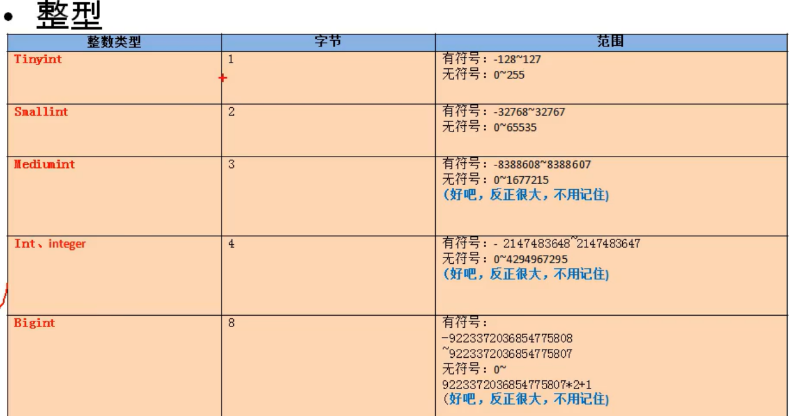
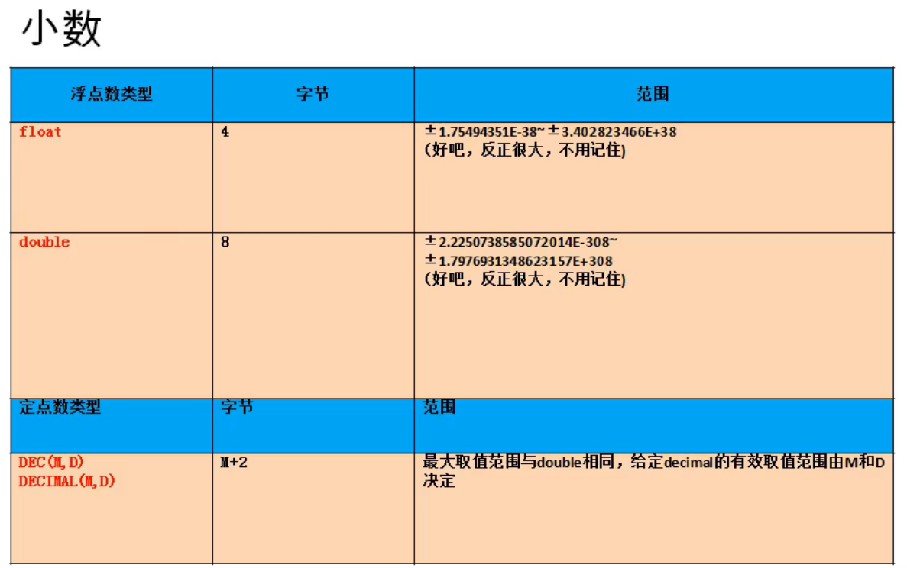
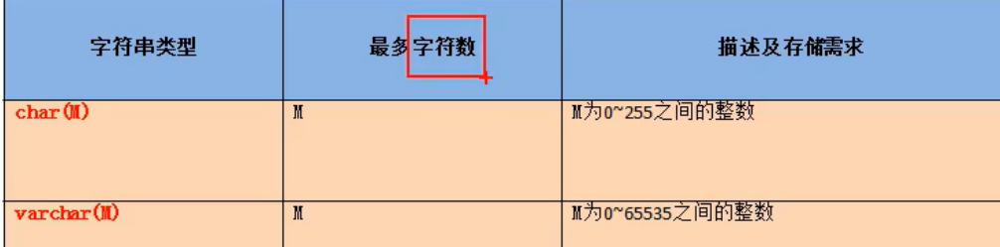
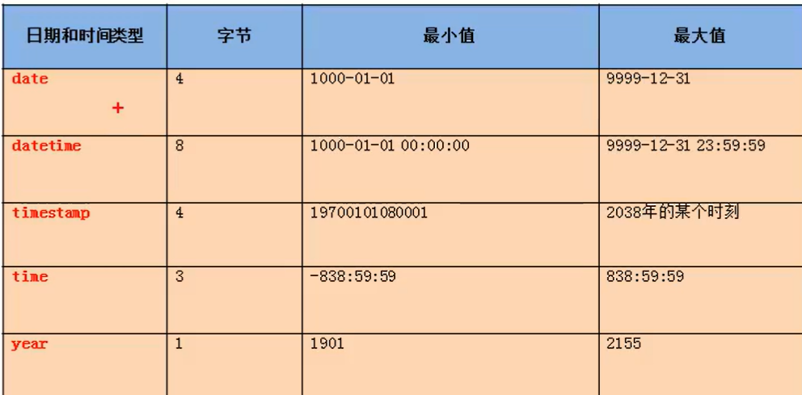
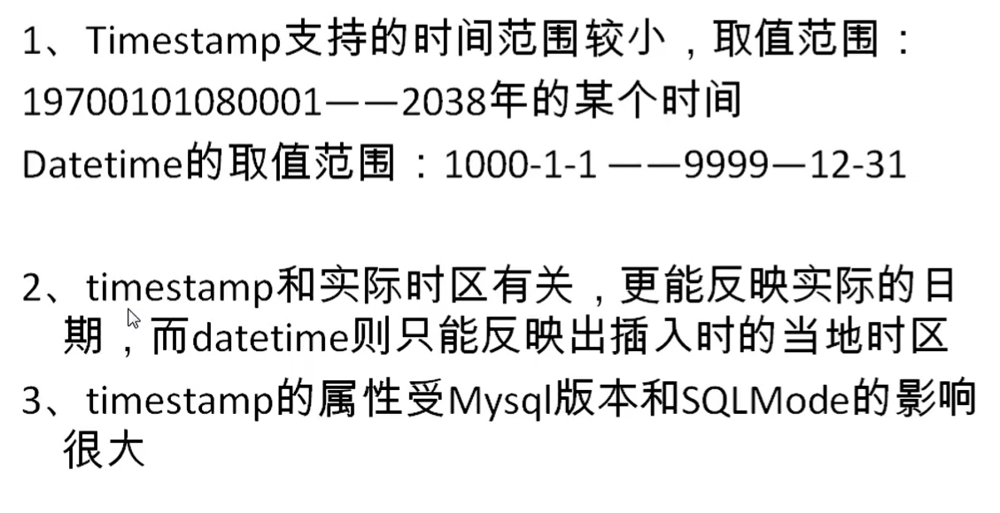

# 常见数据类型

```SQL
1：数值型
    整型：         
                                 字节                     
        tinyInt                   1
        
        smallInt                  2
         
        mediumInt                 3
        
        int / Integer             4
        
        bigInt                    8     
    小数：
          浮点型
                float(M,D)        4
                double(M,D)       8
          定点型(最大范围和double一样)(精确度高)
                dec(M,D)          M+2
                decimal(M,D)
  
2：字符型：
        短文本：char ,varchar
        长文本：text , blob(较长的二进制数据)
        
        binary ,varbinary （包含的是 二进制的字符串）
        
        枚举
        enum :可以规定你插入的值是那些
        
        集合：
        set 
          其中可保存 0~64个成员，和 enum 类型最大的区别是
          set类型一次性可以选取多个成员，而 enum只能选一个，根据成员的个数不同，
          存储占用的字节也不一样
          成员数：       字节数
          1~8            1
          9~16           2
          17~24          3
          25~32          4
          33~64          8
           

3：日期型：
    date                 4  
         
    datetime             8        
    timestamp            4
    
    time                 3
    year                 1

```


#### 整形



```SQL
1：如何设置 无符号和有符号

使用关键字 unsigned  : 无符号
   注意：①：默认是有符号的数
        ②：超出范围会插入临界值，（临界值根据上限和下限）
        
2：如果不设置长度会有默认的长度

这里的默认长度不是int的所显示数，而是表格的宽度，当你的长度不够是会用0 自动填充,但是不显示0
 要想显示出 0 
就必须使用关键字：zerofill ,其使用后的 整形值默认是 无符号型

```


#### 小数



```SQL
浮点型
      float(M,D)        4
      double(M,D)       8
定点型(最大范围和double一样)(精确度高)
      dec(M,D)          M+2
      decimal(M,D)
   
1:M和D 的意思   

M: 整数位+小数位的个数（超出会显示临界值）
D: 表示小数点后保留的位数（超出会四舍五入）

注意：M,D 可以省略
float ,double 是根据你插入的值来决定，不会将默认值设定死
decimal(10,0)  --> 默认是无小数位

```


#### 字符型



```SQL
字符型：
  短文本：char ,varchar
  长文本：text , blob(较长的二进制数据)
  
# 1：char 和 varchar 的区别

char(M)      :固定长度的字符      性能好点，耗费空间高  M可以省略，默认为 1
  
varchar(M)   :可变长度的字符        M不能省略

# 2：enum

create table tab_char(
    c1 enum('a','b','c')
)

insert into tab_char values('a');
insert into tab_char values('b');
insert into tab_char values('c');

insert into tab_char values('m');   # 会出错 ，只能插入枚举的值

insert into tab_char values('A');   # 会转换为 对应的枚举值

# 3：set

create table tab_set(
    c1 set('a','b','c','d')
)

insert into tab_set values('a');
insert into tab_set values('a','b');  # 可以一次插多个值
insert into tab_set values('A','B'); 
insert into tab_set values('c');

insert into tab_set values('m');   # 会出错 ，只能插入枚举的值


```


日期类型





```SQL
create table tsb_date (
    t1 datetime,
    t2 timestamp
);

insert into tab_date values(now(),now());  # 这样会一样

# 更改时区
set time_zone = '+9:00';   # 这样修改之后就会有不一样的效果

 
```


