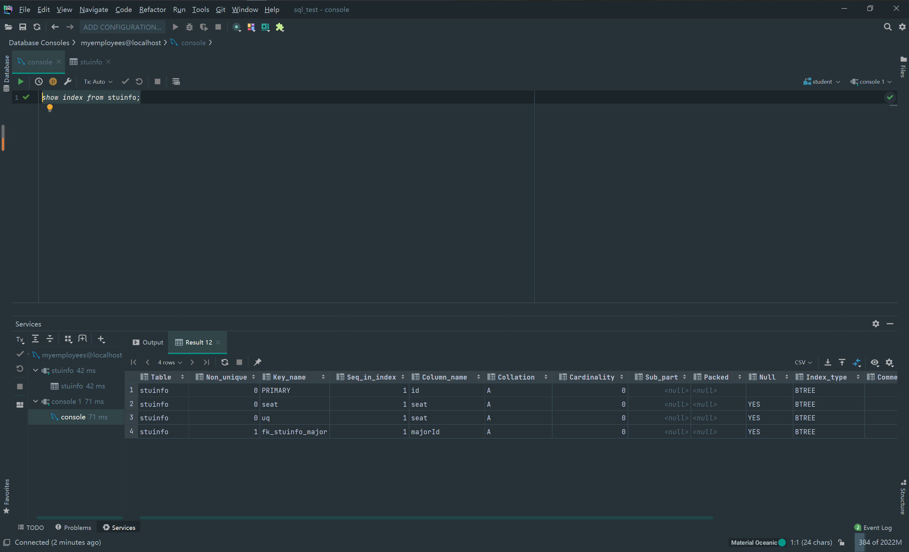

# 常见约束

### 创建表时添加约束

```SQL
1：作用：用于限制表中的数据，为了去保证表中数据的准确和可靠性

2：什么时候添加：（添加数据之前）
      创建表时
      修改表时
3：约束的添加分类
      列级约束：
               不支持foreign key
      表级约束：
              除了 not null,default,外都支持
              
create table 表名(
        字段名  字段类型  列级约束,
        字段名  字段类型  列级约束
        表级约束
)


NOT NULL      非空：         用于保证该字段的值为空

DEFAULT       设置默认值：    用于保证该字段有默认值

PRIMARY KEY   主键：         用于保证该字段的具有唯一性，（并且是非空的）

UNIQUE        唯一：         用于保证该字段中对应的值（除null）具有唯一性（但可以为空）

CHECK         检查：         检查后续添加的值是否是check后的值的一员

FOREIGN KEY   外键：          用于限制两个表的关系，用于保证
                      这个表的该字段的值必须来自于主表的关联列的值
      在从表添加外键的约束，用于引用主表中的某列的值
                          
      eg:主表中存放的学员id,而从表中有对于id 的对应关系
      此时的在设置从表时我们就必须对于 id 必须是主表id中的一员
      而非其他的值
 
 
 
 
 
 
 
 
 
4: primary key 和 unique
               保证唯一性       是否允许非空          一个表中可以有几个(字段)  是否允许组合
 primary key    是              否                      只能有一个         允许(注意唯一性的变化)    
 unique         是（null除外）   是(可以多个为null)        可以有多个        允许
 
 
 
 注意：①：null值不受唯一性约束，可以插入多个 null 值
      ②：一张表中的 primary 只能设置一个字段上，不能有多个字段设为 primary
      ③：而union 是可以有多个字段可以设置，但是字段对应的值（除null）唯一

对于 primary key
# 组合主键 
组合主键的唯一性是所添加到主键的字段的值同时重复才算不唯一，有一个值不重复就可以。

drop table  if  exists stuinfo;
create table stuinfo(
    id int,
    money int,
    stuName varchar(20),
    gender char(1) ,
    seat int unique ,
    age int default 18,
    majorId int  references major(id),
#    constraint  pk  primary key(money),  # 错误
    constraint  pk  primary key(id,stuName),   # 组合主键
    
    constraint  uq  unique(seat),
    constraint  ck  check (gender = '男' or gender = '女' ),
    constraint  fk_stuinfo_major foreign key(majorId) references  major(id)
)
insert into stuinfo(id,money,stuName,gender,age,majorId)
  values(1,12,'john','男'，19，1),
  values(1,12,'john','男'，19，1),  #  这样不行
  values(1,12,'tom','男'，19，1),   #  这样可以
  values(2,12,'john','男'，19，1),  #  这样可以
  
  
  
 

5：foreign key
①：要求在从表设置外键关系
②：从表的外键 列类型 和主表的关联列的类型必须 一致或兼容，名称无所谓
③：主键的关联列必须是一个 key (一般是主键或唯一)
④： 为防止数据对应出现差错
   插入数据时，先插主表，在查从表
   删除数据时先删从表，再删主表，


 
```


```SQL


一：创建表时添加约束（ constraint ：约束）
# 1：添加列级约束
create database student;

use student;

create table stuinfo(
    id int primary key , # 主键
    stuName varchar(20) not null ,  # 非空
    gander char(1) check ( gander = '男'or gander = '女' ),  # 检查
    seat int unique , # 唯一
    age int default 18,  # 默认约束
    majorId int  references major(id)
);

create table major(
    id int primary key,
    majorName varchar(20)
);

desc stuinfo;
# 查看stuinfo表中的所有的索引，包括主键，外键，唯一
show index from stuinfo;


二：创建表级约束
drop table  if  exists stuinfo;
create table stuinfo(
    id int,
    stuName varchar(20)  ,
    gender char(1) ,
    seat int unique ,
    age int default 18,
    majorId int  references major(id),
    constraint  pk  primary key(id),
    constraint  uq  unique(seat),
    constraint  ck  check (gender = '男' or gender = '女' ),
    constraint  fk_stuinfo_major foreign key(majorId) references  major(id)
)

# 注意主键的名不能被改变，就算你设置了也不会显示
```




### 修改表时添加约束

```SQL
drop table  if  exists stuinfo;
create table stuinfo(
    id int,
    stuName varchar(20)  ,
    gender char(1) ,
    seat int ,
    age int ,
    majorId int 
    
)

1：添加非空约束

alter table stuinfo modify column stuName varchar(20) not null;

2：添加默认约束

alter table stuinfo modify column age default 10;

3：添加主键
①：；列级约束
alter table stuinfo modify column id int primary key; # 不支持索引

alter table stuinfo add constraint pri_id primary key(id);

②：表级约束
alter table stuinfo add primary key(id);


4：添加唯一
①：；列级约束
alter table stuinfo modify column seat int unique;

②：表级约束
alter table stuinfo add unique(seat);

5:添加外键
# 要注意的是这里的直接添加外键而无索引时删除时会报错
alter table stuinfo add foreign key(majorId) references major(id); 

alter table stuinfo drop foreign key majorId;  # 这样删除时会报错

# 所以推荐使用添加索引
alter table stuinfo add constraint stu_foreign_maj foreign key(majorId) references major(id);


```


### 修改表时删除约束

```SQL
1：删除非空主键
alter table stuinfo modify column varchar(20) null;

2：删除默认约束
alter table stuinfo modify column age int; 

3：删除主键 
alter table studio drop primary key; 

4:删除唯一
alter table studio drop index seat;


```


### 修改时删除外键的注意

```SQL
5:删除外键

# 如果未给外键添加索引的话下面的删除方式是错误的
alter table stuinfo drop foreign key majorId;


# 删除时使用别名,注意：这里只是解除外键的约束，而 stu-foreign——maj 这个索引还未删除
# 只能再删一次索引

# 解除限制
alter table stuinfo drop  foreign key stu_foreign_maj; 

# 删除索引
alter table stuinfo drop index stu_foreign_maj;

# 删除字段
alter table stuinfo drop column majobId; 


show index from stuinfo; 
```


#### 添加约束名（索引）的注意点

```SQL
1:修改表时添加约束 添加约束名 和 不使用约束名时不一样

2:注意点：
    列级约束 不可以 起约束名
    表级约束可以，（但主键没效果）
 


3：列级约束 和 主级约束
           位置         支持的约束类型               是否可以起 约束名（索引）
列级约束   列的后面       除外键之外都可以                不可以
表级约束   所有列的下面    default和not null不支持       可以


     
```


### 关于与外键关联的删除

```SQL
1：**级联删除 ** 
如果添加普通的外键，那么在直接删除主表中的关联的字段时会产生异常，
这是可以通过在添加外键时就为外键添加  **级联删除 ** 

这里要注意的 级联删除 会直接将从表中与主表对应的字段的值直接删除，那一行直接删除。

alter table stuinfo add constraint fk_stu_major foreign key(majorid) 
references major(id) 
on delete cascade;    # 这几个关键字就是为外键添加级联删除

**2：级联置空 ** 
与级联删除最大的区别就是我们会将从表与主表连接的字段的值置空，而不是直接删除那一行

alter table stuinfo add constraint fk_stu_major foreign key(majorid) 
references major(id) 
on delete set null;


```


