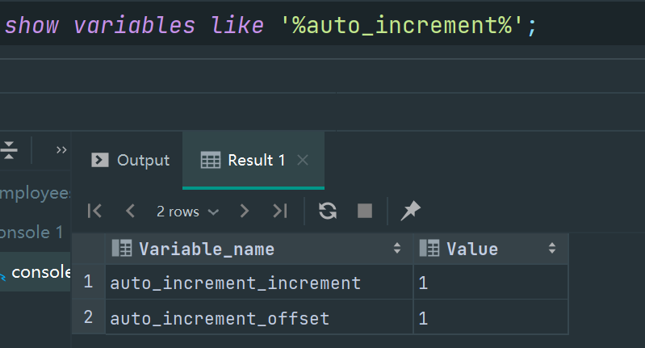

# 标识列

### 创建表时使用标识列

```SQL
标识列：（自增长列）
含义：可以不用手动的插入值，系统提供默认的序列值

1：标识符必须是和 key 搭配（只在 mysql 中）
    主键，外键 unique,(自定义键)

2：一个表中只能有一个标识列

3：标识列的类型可以是： 只能是数值型


1：创建表时设置标识列
create table tab_identify(
        id int primary key auto_increment,
        name varchar(20)
);

#多次重复该语句就会使得 id 这个字段的值自动填充并且递增
insert into tab_identify values(null,'john'); 
# 只要添加一行后，不管对 id 对没有赋 null 值，这都会自动填充并且递增
insert into tab_identify (name) values('john1');


show variables like '%auto_increment%';  # 显示 auto_increment的参数

```




```SQL
auto_increment 中的 auto_increment_increment(步长) 可以设置(在 mysql 中)
而offset 起始位置 不能在 mysql中设置后使用（即设置后无效）

# 设置步长为 3   # 这样设值会使得所有的字段的自增步长都改变
set auto_increment_increment = 3;
 
# 设置初始值
通过 set auto_increment_offect = 值 来设置后的值无效

而可以在开始的时候对 初始值进行修改
insert into tab_identify(10,'tom');  # 将其做为第一个插入即可，同样可以达到
插入的初始值的效果 


 
# 要注意的是在 8.0之后的版本中修改
auto_increment_offset ,auto_increment_increment 和时只要是同时修改，并且
修改的值一样时就可以有效果

drop table tab_identify;
create table tab_identify(
        id int primary key auto_increment,
        name varchar(20)
);
insert into tab_identify values(null,'tom');
show variables like '%auto_increment%';

set auto_increment_offset =3,auto_increment_increment =3; 
```


### 修改表时设置标识列

```SQL

alter table tab_identify modify column id int primary key auto_increment;

删除时就直接去掉标识列就行
alter table tab_identify modify column id int primary key；

```


